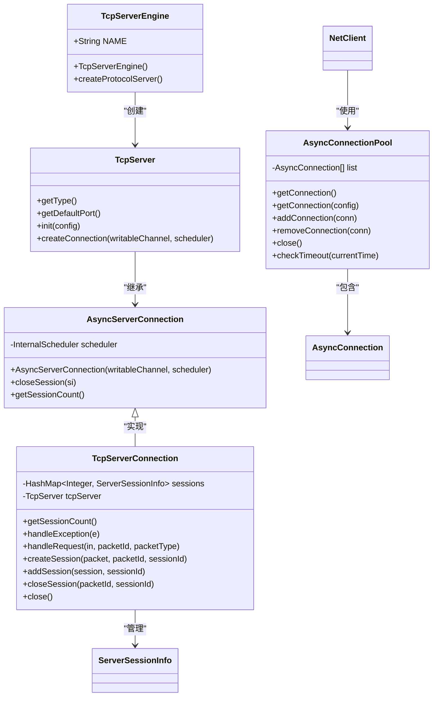
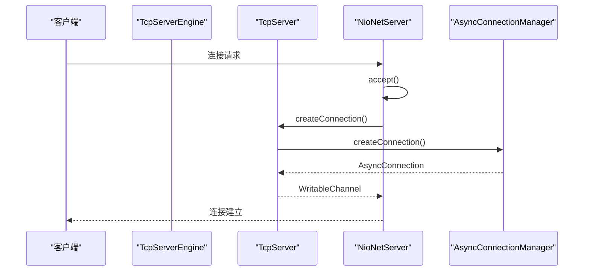
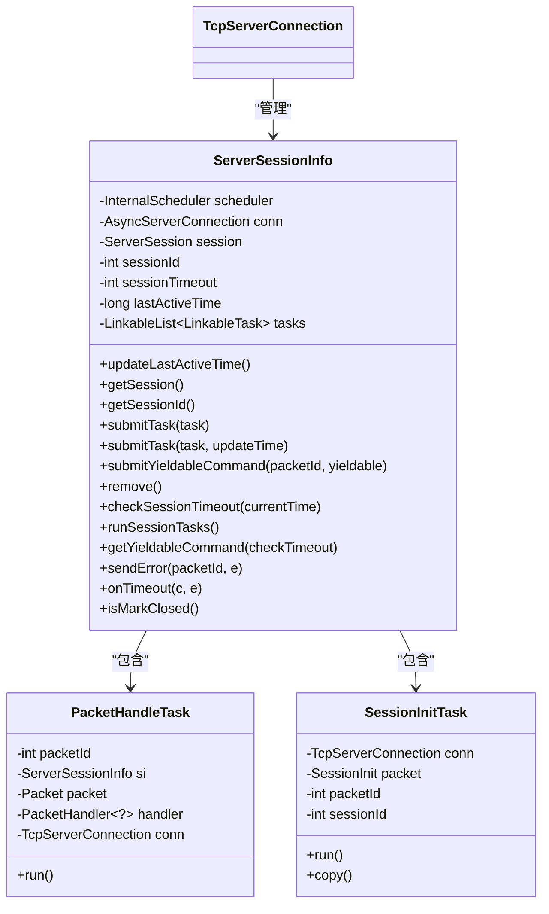
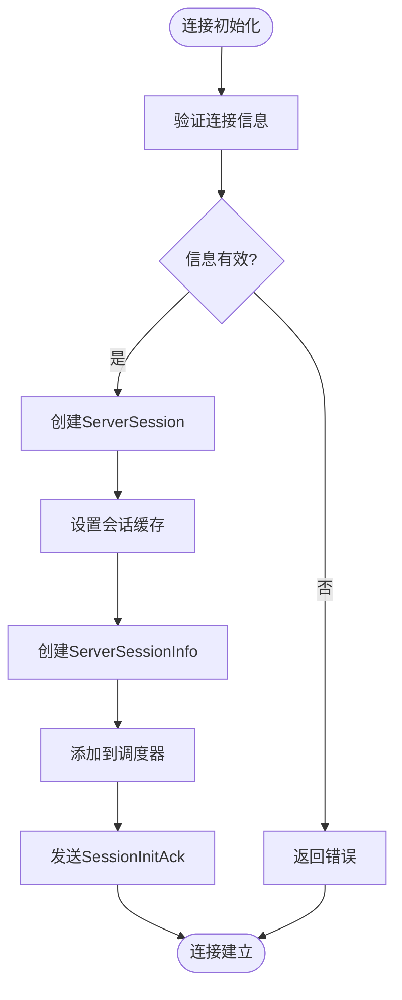
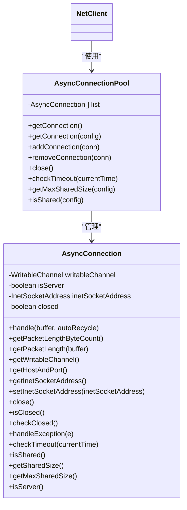
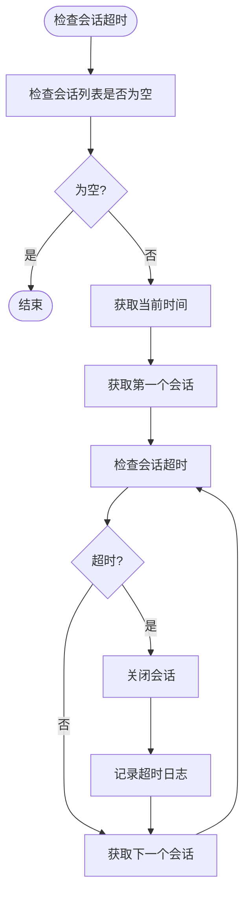
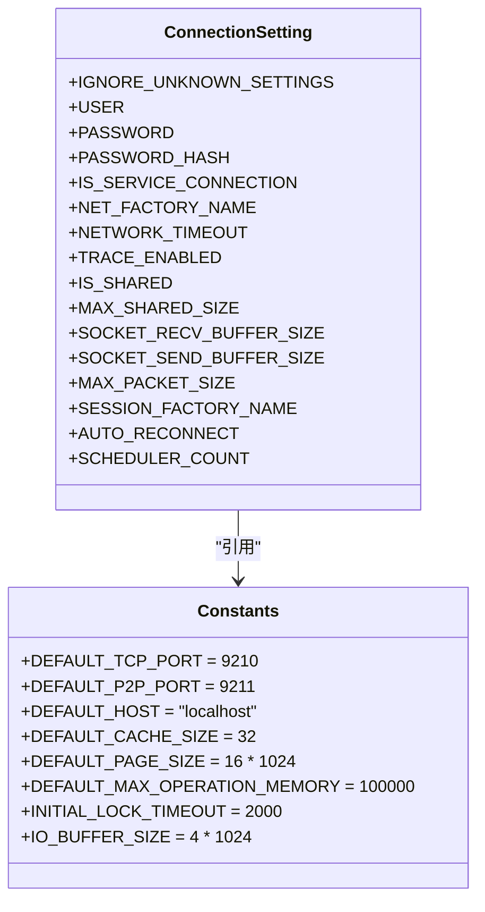

# 连接管理

<cite>
**本文档中引用的文件**  
- [TcpServerEngine.java](file://lealone-server/src/main/java/com/lealone/server/TcpServerEngine.java)
- [TcpServer.java](file://lealone-server/src/main/java/com/lealone/server/TcpServer.java)
- [AsyncServerConnection.java](file://lealone-server/src/main/java/com/lealone/server/AsyncServerConnection.java)
- [TcpServerConnection.java](file://lealone-server/src/main/java/com/lealone/server/TcpServerConnection.java)
- [NioNetServer.java](file://lealone-net/src/main/java/com/lealone/net/nio/NioNetServer.java)
- [AsyncConnectionPool.java](file://lealone-net/src/main/java/com/lealone/net/AsyncConnectionPool.java)
- [ConnectionSetting.java](file://lealone-common/src/main/java/com/lealone/db/ConnectionSetting.java)
- [Constants.java](file://lealone-common/src/main/java/com/lealone/db/Constants.java)
- [GlobalScheduler.java](file://lealone-server/src/main/java/com/lealone/server/scheduler/GlobalScheduler.java)
- [ServerSessionInfo.java](file://lealone-server/src/main/java/com/lealone/server/scheduler/ServerSessionInfo.java)
</cite>

## 目录
1. [连接管理机制概述](#连接管理机制概述)
2. [TcpServerEngine端口监听与连接接受](#tcpserverengine端口监听与连接接受)
3. [AsyncServerConnection会话管理](#asyncserverconnection会话管理)
4. [连接生命周期管理](#连接生命周期管理)
5. [连接池机制](#连接池机制)
6. [连接超时处理策略](#连接超时处理策略)
7. [连接性能调优建议](#连接性能调优建议)

## 连接管理机制概述

Lealone数据库的连接管理机制采用异步非阻塞I/O模型，通过TcpServerEngine监听端口并接受客户端连接请求。每个客户端连接由AsyncServerConnection实例管理，支持在一个TCP连接中维护多个客户端会话。连接管理涉及端口监听、连接接受、会话创建、状态维护和资源释放等关键环节。

**连接管理核心组件关系**

**图示来源**
- [TcpServerEngine.java](file://lealone-server/src/main/java/com/lealone/server/TcpServerEngine.java)
- [TcpServer.java](file://lealone-server/src/main/java/com/lealone/server/TcpServer.java)
- [AsyncServerConnection.java](file://lealone-server/src/main/java/com/lealone/server/AsyncServerConnection.java)
- [TcpServerConnection.java](file://lealone-server/src/main/java/com/lealone/server/TcpServerConnection.java)
- [AsyncConnectionPool.java](file://lealone-net/src/main/java/com/lealone/net/AsyncConnectionPool.java)

## TcpServerEngine端口监听与连接接受

TcpServerEngine是Lealone数据库TCP协议服务器的核心引擎，负责监听指定端口并接受客户端连接请求。它继承自ProtocolServerEngineBase，通过createProtocolServer方法创建TcpServer实例来处理具体的连接逻辑。

TcpServer继承自AsyncServer，实现了端口监听和连接接受功能。在NioNetServer中，通过ServerSocketChannel绑定指定主机和端口，并配置为非阻塞模式。当有新的连接请求到达时，accept方法被调用，创建NioWritableChannel并最终通过connectionManager创建AsyncConnection实例。

**图示来源**
- [TcpServerEngine.java](file://lealone-server/src/main/java/com/lealone/server/TcpServerEngine.java)
- [TcpServer.java](file://lealone-server/src/main/java/com/lealone/server/TcpServer.java)
- [NioNetServer.java](file://lealone-net/src/main/java/com/lealone/net/nio/NioNetServer.java)

**连接管理机制来源**
- [TcpServerEngine.java](file://lealone-server/src/main/java/com/lealone/server/TcpServerEngine.java#L8-L20)
- [TcpServer.java](file://lealone-server/src/main/java/com/lealone/server/TcpServer.java#L15-L38)
- [NioNetServer.java](file://lealone-net/src/main/java/com/lealone/net/nio/NioNetServer.java#L20-L77)

## AsyncServerConnection会话管理

AsyncServerConnection是服务器端连接的抽象基类，负责管理客户端会话。每个TcpServerConnection实例对应一个Scheduler，确保所有操作由单一调度线程执行，避免并发问题。

在TcpServerConnection中，通过HashMap维护sessionId到ServerSessionInfo的映射，每个ServerSessionInfo对应一个客户端会话。当收到客户端请求时，根据sessionId查找对应的ServerSessionInfo，并将请求封装为PacketHandleTask提交给调度器执行。

**图示来源**
- [ServerSessionInfo.java](file://lealone-server/src/main/java/com/lealone/server/scheduler/ServerSessionInfo.java)
- [TcpServerConnection.java](file://lealone-server/src/main/java/com/lealone/server/TcpServerConnection.java)

**会话管理机制来源**
- [AsyncServerConnection.java](file://lealone-server/src/main/java/com/lealone/server/AsyncServerConnection.java#L14-L27)
- [TcpServerConnection.java](file://lealone-server/src/main/java/com/lealone/server/TcpServerConnection.java#L42-L249)
- [ServerSessionInfo.java](file://lealone-server/src/main/java/com/lealone/server/scheduler/ServerSessionInfo.java#L21-L181)

## 连接生命周期管理

Lealone数据库的连接生命周期包括连接初始化、状态维护和资源释放三个阶段。连接初始化发生在客户端首次连接时，通过SessionInit数据包完成身份验证和会话创建。状态维护通过ServerSessionInfo跟踪每个会话的活动状态和超时时间。资源释放在连接关闭时触发，确保所有相关资源被正确清理。

连接初始化流程如下：
1. 客户端发送SessionInit数据包
2. 服务器创建SessionInitTask并提交给调度器
3. 调度器执行任务，创建ServerSession实例
4. 发送SessionInitAck确认消息

**图示来源**
- [TcpServerConnection.java](file://lealone-server/src/main/java/com/lealone/server/TcpServerConnection.java#L98-L141)
- [ServerSessionInfo.java](file://lealone-server/src/main/java/com/lealone/server/scheduler/ServerSessionInfo.java#L38-L47)

**生命周期管理来源**
- [TcpServerConnection.java](file://lealone-server/src/main/java/com/lealone/server/TcpServerConnection.java#L58-L228)
- [ServerSessionInfo.java](file://lealone-server/src/main/java/com/lealone/server/scheduler/ServerSessionInfo.java#L21-L181)
- [Database.java](file://lealone-db/src/main/java/com/lealone/db/Database.java#L1093-L1129)

## 连接池机制

Lealone数据库实现了异步连接池机制，通过AsyncConnectionPool类管理连接实例。连接池支持共享和独享两种模式，可根据配置灵活调整。在共享模式下，多个客户端会话可以复用同一个物理连接，提高资源利用率。

连接池的核心功能包括：
- 连接获取：根据配置选择最佳连接
- 连接添加：将新创建的连接加入池中
- 连接移除：从池中移除指定连接
- 池关闭：关闭池中所有连接
- 超时检查：检查并处理超时连接

**图示来源**
- [AsyncConnectionPool.java](file://lealone-net/src/main/java/com/lealone/net/AsyncConnectionPool.java)
- [AsyncConnection.java](file://lealone-net/src/main/java/com/lealone/net/AsyncConnection.java)

**连接池机制来源**
- [AsyncConnectionPool.java](file://lealone-net/src/main/java/com/lealone/net/AsyncConnectionPool.java#L1-L93)
- [ConnectionSetting.java](file://lealone-common/src/main/java/com/lealone/db/ConnectionSetting.java#L1-L27)
- [SharedConnectionTest.java](file://lealone-test/src/test/java/com/lealone/test/client/SharedConnectionTest.java#L1-L37)

## 连接超时处理策略

Lealone数据库采用基于时间戳的连接超时处理策略，通过定期检查会话的最后活动时间来判断是否超时。GlobalScheduler中的checkSessionTimeout方法遍历所有活跃会话，比较当前时间与最后活动时间的差值是否超过预设的超时阈值。

超时处理流程如下：
1. 获取当前系统时间
2. 遍历所有ServerSessionInfo实例
3. 检查每个会话的最后活动时间
4. 如果超时则关闭会话和连接
5. 记录超时日志

**图示来源**
- [GlobalScheduler.java](file://lealone-server/src/main/java/com/lealone/server/scheduler/GlobalScheduler.java#L156-L164)
- [ServerSessionInfo.java](file://lealone-server/src/main/java/com/lealone/server/scheduler/ServerSessionInfo.java#L103-L112)

**超时处理策略来源**
- [GlobalScheduler.java](file://lealone-server/src/main/java/com/lealone/server/scheduler/GlobalScheduler.java#L150-L164)
- [ServerSessionInfo.java](file://lealone-server/src/main/java/com/lealone/server/scheduler/ServerSessionInfo.java#L103-L112)
- [TcpServerConnection.java](file://lealone-server/src/main/java/com/lealone/server/TcpServerConnection.java#L216-L228)

## 连接性能调优建议

为了优化Lealone数据库的连接性能，建议从连接数限制和I/O线程配置两个方面进行调优。合理的配置可以显著提升系统吞吐量和响应速度。

### 连接数限制

通过ConnectionSetting.MAX_SHARED_SIZE参数控制每个物理连接的最大共享会话数。默认值为3，可根据实际负载情况进行调整。对于高并发场景，适当增加该值可以减少物理连接数，降低系统开销。

**图示来源**
- [ConnectionSetting.java](file://lealone-common/src/main/java/com/lealone/db/ConnectionSetting.java)
- [Constants.java](file://lealone-common/src/main/java/com/lealone/db/Constants.java)

### I/O线程配置

通过SchedulerFactoryBase配置I/O线程数量。默认情况下，系统会根据CPU核心数自动确定线程数。对于高负载场景，可以手动增加线程数以提高并发处理能力。

性能调优建议：
1. 根据CPU核心数合理设置I/O线程数
2. 调整MAX_SHARED_SIZE以平衡连接复用和资源消耗
3. 优化socket缓冲区大小（SOCKET_RECV_BUFFER_SIZE和SOCKET_SEND_BUFFER_SIZE）
4. 设置合理的连接超时时间
5. 监控连接池使用情况，及时发现瓶颈

**性能调优来源**
- [ConnectionSetting.java](file://lealone-common/src/main/java/com/lealone/db/ConnectionSetting.java#L1-L27)
- [Constants.java](file://lealone-common/src/main/java/com/lealone/db/Constants.java#L131-L177)
- [SchedulerFactoryBase.java](file://lealone-common/src/main/java/com/lealone/db/scheduler/SchedulerFactoryBase.java#L34-L228)
- [SchedulerBase.java](file://lealone-common/src/main/java/com/lealone/db/scheduler/SchedulerBase.java#L38-L97)