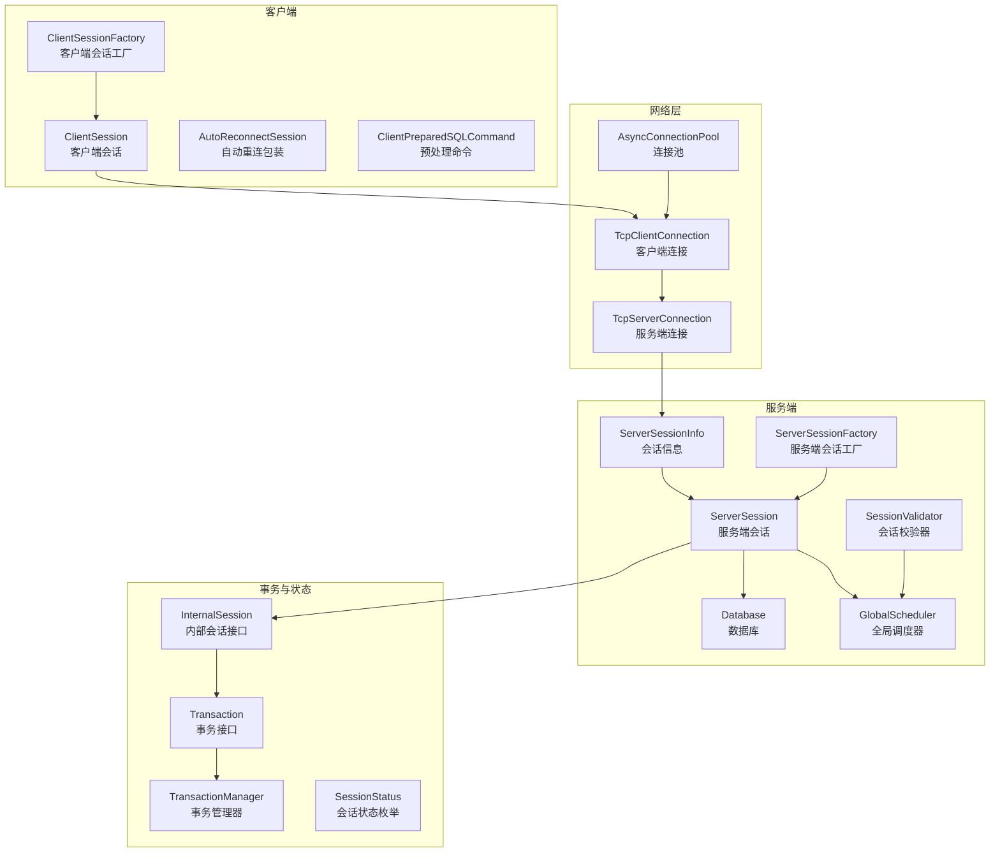
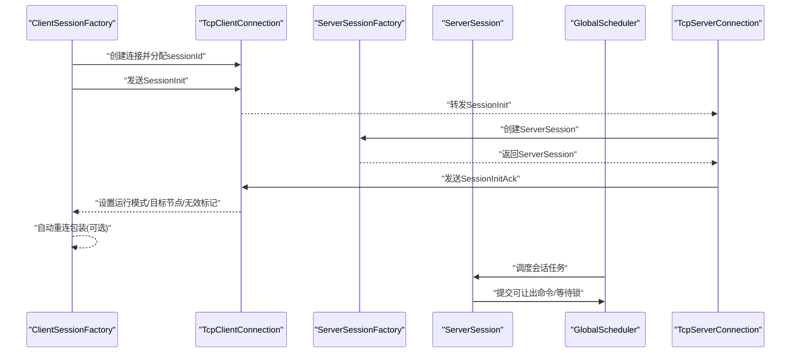
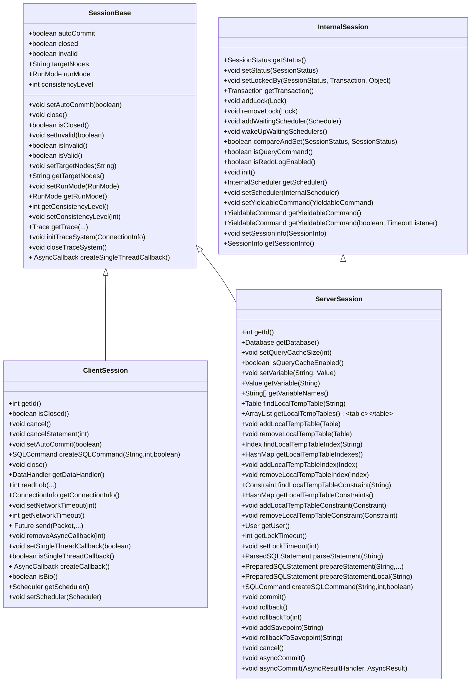
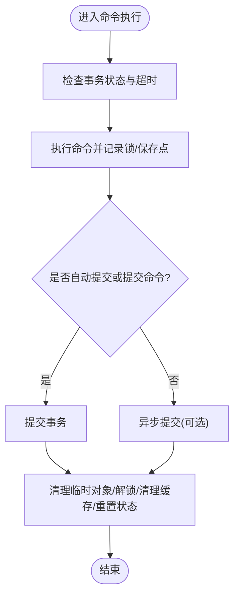
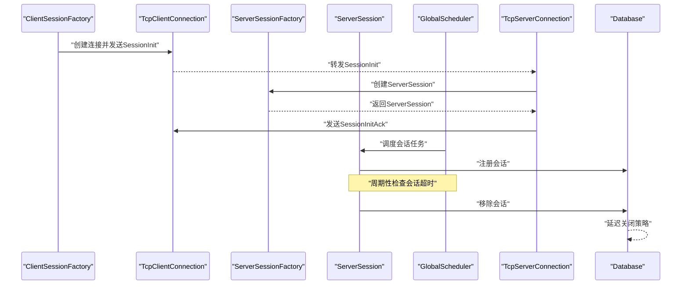
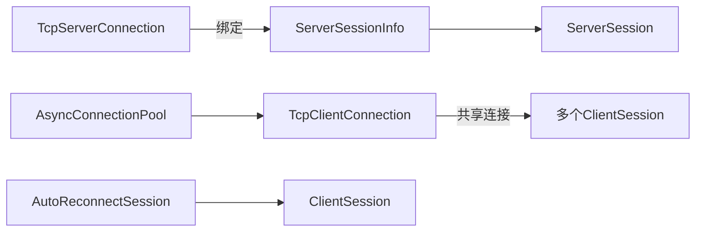
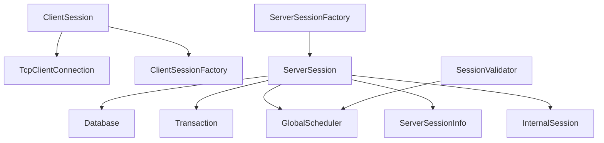

# 会话管理

<cite>
**本文引用的文件列表**
- [ClientSession.java](file://lealone-client/src/main/java/com/lealone/client/session/ClientSession.java)
- [ClientSessionFactory.java](file://lealone-client/src/main/java/com/lealone/client/session/ClientSessionFactory.java)
- [ServerSession.java](file://lealone-db/src/main/java/com/lealone/db/session/ServerSession.java)
- [ServerSessionFactory.java](file://lealone-db/src/main/java/com/lealone/db/session/ServerSessionFactory.java)
- [InternalSession.java](file://lealone-sci/src/main/java/com/lealone/db/session/InternalSession.java)
- [SessionStatus.java](file://lealone-sci/src/main/java/com/lealone/db/session/SessionStatus.java)
- [SessionBase.java](file://lealone-common/src/main/java/com/lealone/db/session/SessionBase.java)
- [ServerSessionInfo.java](file://lealone-server/src/main/java/com/lealone/server/scheduler/ServerSessionInfo.java)
- [GlobalScheduler.java](file://lealone-server/src/main/java/com/lealone/server/scheduler/GlobalScheduler.java)
- [SessionValidator.java](file://lealone-server/src/main/java/com/lealone/server/scheduler/SessionValidator.java)
- [TcpServerConnection.java](file://lealone-server/src/main/java/com/lealone/server/TcpServerConnection.java)
- [TcpClientConnection.java](file://lealone-net/src/main/java/com/lealone/net/TcpClientConnection.java)
- [AsyncConnectionPool.java](file://lealone-net/src/main/java/com/lealone/net/AsyncConnectionPool.java)
- [AutoReconnectSession.java](file://lealone-client/src/main/java/com/lealone/client/session/AutoReconnectSession.java)
- [ClientPreparedSQLCommand.java](file://lealone-client/src/main/java/com/lealone/client/command/ClientPreparedSQLCommand.java)
- [Database.java](file://lealone-db/src/main/java/com/lealone/db/Database.java)
- [Transaction.java](file://lealone-sci/src/main/java/com/lealone/transaction/Transaction.java)
- [ConcurrentTransactionManager.java](file://lealone-aote/src/main/java/com/lealone/transaction/aote/tm/ConcurrentTransactionManager.java)
- [SingleThreadTransactionManager.java](file://lealone-aote/src/main/java/com/lealone/transaction/aote/tm/SingleThreadTransactionManager.java)
- [TransactionManager.java](file://lealone-aote/src/main/java/com/lealone/transaction/aote/tm/TransactionManager.java)
</cite>

## 目录
1. [引言](#引言)
2. [项目结构](#项目结构)
3. [核心组件](#核心组件)
4. [架构总览](#架构总览)
5. [详细组件分析](#详细组件分析)
6. [依赖关系分析](#依赖关系分析)
7. [性能考量](#性能考量)
8. [故障排查指南](#故障排查指南)
9. [结论](#结论)

## 引言
本文件系统化梳理 Lealone 的会话管理架构，重点解析 ClientSession（客户端会话）、ServerSession（服务端会话）与 InternalSession（内部会话接口）之间的层次关系与职责划分；阐述会话状态维护机制（事务上下文、临时对象、会话变量等）；覆盖会话生命周期（创建、认证、权限检查、超时处理与清理）；并分析会话与连接的映射关系及在连接池环境下的复用策略，最后给出面向开发者的资源管理与性能优化建议。

## 项目结构
Lealone 将会话管理按“客户端-服务端-内部抽象”分层组织：
- 客户端侧：ClientSession 负责与服务端交互、协议编解码、LOB 读取、回调管理与自动重连包装。
- 服务端侧：ServerSession 承载事务上下文、会话变量、临时表/索引/约束、查询缓存、锁与调度器集成。
- 内部抽象：InternalSession 定义内部调度与状态机接口，ServerSession 实现该接口并与调度器协作。
- 通用基类：SessionBase 提供会话通用属性与生命周期控制（自动提交、关闭、无效标记、目标节点、运行模式、一致性级别、跟踪系统初始化与关闭等）。
- 服务器调度：GlobalScheduler 统一管理会话任务、超时检测与初始化任务节流；ServerSessionInfo 封装会话与连接的映射、活跃时间与超时判定。
- 连接与池化：TcpClientConnection/TcpServerConnection 管理会话与连接的绑定、回调超时检查；AsyncConnectionPool 支持连接共享与复用策略。
- 数据库与事务：Database 负责会话注册与移除、延迟关闭；Transaction/TransactionManager 管理事务生命周期与并发事务计数。

图表来源
- [ClientSession.java](file://lealone-client/src/main/java/com/lealone/client/session/ClientSession.java#L1-L378)
- [ClientSessionFactory.java](file://lealone-client/src/main/java/com/lealone/client/session/ClientSessionFactory.java#L1-L188)
- [ServerSession.java](file://lealone-db/src/main/java/com/lealone/db/session/ServerSession.java#L1-L800)
- [ServerSessionFactory.java](file://lealone-db/src/main/java/com/lealone/db/session/ServerSessionFactory.java#L1-L128)
- [InternalSession.java](file://lealone-sci/src/main/java/com/lealone/db/session/InternalSession.java#L1-L77)
- [SessionStatus.java](file://lealone-sci/src/main/java/com/lealone/db/session/SessionStatus.java#L1-L23)
- [ServerSessionInfo.java](file://lealone-server/src/main/java/com/lealone/server/scheduler/ServerSessionInfo.java#L1-L181)
- [GlobalScheduler.java](file://lealone-server/src/main/java/com/lealone/server/scheduler/GlobalScheduler.java#L107-L187)
- [SessionValidator.java](file://lealone-server/src/main/java/com/lealone/server/scheduler/SessionValidator.java#L1-L76)
- [TcpServerConnection.java](file://lealone-server/src/main/java/com/lealone/server/TcpServerConnection.java#L120-L169)
- [TcpClientConnection.java](file://lealone-net/src/main/java/com/lealone/net/TcpClientConnection.java#L38-L82)
- [AsyncConnectionPool.java](file://lealone-net/src/main/java/com/lealone/net/AsyncConnectionPool.java#L1-L45)
- [AutoReconnectSession.java](file://lealone-client/src/main/java/com/lealone/client/session/AutoReconnectSession.java#L1-L57)
- [ClientPreparedSQLCommand.java](file://lealone-client/src/main/java/com/lealone/client/command/ClientPreparedSQLCommand.java#L60-L93)
- [Database.java](file://lealone-db/src/main/java/com/lealone/db/Database.java#L1057-L1129)
- [Transaction.java](file://lealone-sci/src/main/java/com/lealone/transaction/Transaction.java#L43-L91)
- [ConcurrentTransactionManager.java](file://lealone-aote/src/main/java/com/lealone/transaction/aote/tm/ConcurrentTransactionManager.java#L1-L48)
- [SingleThreadTransactionManager.java](file://lealone-aote/src/main/java/com/lealone/transaction/aote/tm/SingleThreadTransactionManager.java#L40-L63)
- [TransactionManager.java](file://lealone-aote/src/main/java/com/lealone/transaction/aote/tm/TransactionManager.java#L1-L38)

章节来源
- [ClientSession.java](file://lealone-client/src/main/java/com/lealone/client/session/ClientSession.java#L1-L378)
- [ServerSession.java](file://lealone-db/src/main/java/com/lealone/db/session/ServerSession.java#L1-L800)
- [ServerSessionInfo.java](file://lealone-server/src/main/java/com/lealone/server/scheduler/ServerSessionInfo.java#L1-L181)

## 核心组件
- ClientSession：客户端会话，封装与服务端的网络通信、协议包发送/接收、LOB 读取、回调超时与单线程回调策略、自动重连包装等。
- ServerSession：服务端会话，承载事务上下文、会话变量、本地临时表/索引/约束、查询缓存、锁集合、等待调度器、取消点、超时控制等。
- InternalSession：内部会话接口，定义状态机、事务获取、锁管理、等待调度器、可让出命令（yieldable command）与会话信息等能力。
- SessionBase：会话通用基类，提供自动提交、关闭、无效标记、目标节点、运行模式、一致性级别、跟踪系统初始化/关闭、单线程回调创建等。
- ServerSessionFactory：服务端会话工厂，负责数据库初始化、用户校验、目标节点选择、运行模式设置与会话创建。
- ClientSessionFactory：客户端会话工厂，负责连接建立、会话初始化、重定向与自动重连包装。
- ServerSessionInfo：服务端会话信息，封装会话与连接映射、活跃时间、超时检测、任务队列与可让出命令提交。
- GlobalScheduler：全局调度器，统一调度会话任务、会话初始化节流、会话超时检测与 GC 触发。
- SessionValidator：会话校验器，实现登录失败延迟与节流，保护暴力破解。
- TcpClientConnection/TcpServerConnection：连接层，维护会话集合、回调超时检查、异常处理与连接共享大小。
- AsyncConnectionPool：连接池，支持连接共享与复用策略。
- Database：数据库，负责会话注册/移除、延迟关闭与系统会话管理。
- Transaction/TransactionManager：事务接口与管理器，维护当前事务集合与并发事务计数。

章节来源
- [SessionBase.java](file://lealone-common/src/main/java/com/lealone/db/session/SessionBase.java#L1-L212)
- [ServerSessionFactory.java](file://lealone-db/src/main/java/com/lealone/db/session/ServerSessionFactory.java#L1-L128)
- [ClientSessionFactory.java](file://lealone-client/src/main/java/com/lealone/client/session/ClientSessionFactory.java#L1-L188)
- [ServerSessionInfo.java](file://lealone-server/src/main/java/com/lealone/server/scheduler/ServerSessionInfo.java#L1-L181)
- [GlobalScheduler.java](file://lealone-server/src/main/java/com/lealone/server/scheduler/GlobalScheduler.java#L107-L187)
- [SessionValidator.java](file://lealone-server/src/main/java/com/lealone/server/scheduler/SessionValidator.java#L1-L76)
- [TcpClientConnection.java](file://lealone-net/src/main/java/com/lealone/net/TcpClientConnection.java#L38-L82)
- [AsyncConnectionPool.java](file://lealone-net/src/main/java/com/lealone/net/AsyncConnectionPool.java#L1-L45)
- [Database.java](file://lealone-db/src/main/java/com/lealone/db/Database.java#L1057-L1129)
- [Transaction.java](file://lealone-sci/src/main/java/com/lealone/transaction/Transaction.java#L43-L91)
- [TransactionManager.java](file://lealone-aote/src/main/java/com/lealone/transaction/aote/tm/TransactionManager.java#L1-L38)

## 架构总览
Lealone 的会话管理采用“客户端-服务端-内部抽象”的分层设计：
- 客户端通过 ClientSessionFactory 建立与服务端的连接，发送 SessionInit 并接收 SessionInitAck，完成会话初始化与运行模式/目标节点确认。
- 服务端通过 ServerSessionFactory 校验用户与数据库状态，创建 ServerSession，并将其加入调度器与连接映射。
- ServerSession 实现 InternalSession 接口，与调度器协同执行命令、管理事务与锁、维护会话变量与临时对象。
- 会话超时由 GlobalScheduler 周期性扫描 ServerSessionInfo，结合 SessionValidator 的节流策略，确保安全与稳定性。
- 连接层支持连接共享与池化，客户端与服务端均维护会话集合与回调超时检查，保障资源回收与异常处理。

图表来源
- [ClientSessionFactory.java](file://lealone-client/src/main/java/com/lealone/client/session/ClientSessionFactory.java#L120-L158)
- [TcpClientConnection.java](file://lealone-net/src/main/java/com/lealone/net/TcpClientConnection.java#L155-L190)
- [ServerSessionFactory.java](file://lealone-db/src/main/java/com/lealone/db/session/ServerSessionFactory.java#L47-L86)
- [TcpServerConnection.java](file://lealone-server/src/main/java/com/lealone/server/TcpServerConnection.java#L120-L169)
- [GlobalScheduler.java](file://lealone-server/src/main/java/com/lealone/server/scheduler/GlobalScheduler.java#L150-L226)

## 详细组件分析

### 层次关系与职责划分
- ClientSession：负责网络通信、协议编解码、LOB 读取、回调超时与单线程回调策略、自动重连包装。
- ServerSession：负责事务上下文、会话变量、本地临时对象、查询缓存、锁管理、等待调度器、取消点与超时控制。
- InternalSession：定义状态机、事务获取、锁管理、等待调度器、可让出命令与会话信息。
- SessionBase：提供通用属性与生命周期控制，如自动提交、关闭、无效标记、目标节点、运行模式、一致性级别、跟踪系统初始化/关闭、单线程回调创建等。

图表来源
- [SessionBase.java](file://lealone-common/src/main/java/com/lealone/db/session/SessionBase.java#L1-L212)
- [ClientSession.java](file://lealone-client/src/main/java/com/lealone/client/session/ClientSession.java#L1-L378)
- [ServerSession.java](file://lealone-db/src/main/java/com/lealone/db/session/ServerSession.java#L1-L800)
- [InternalSession.java](file://lealone-sci/src/main/java/com/lealone/db/session/InternalSession.java#L1-L77)

章节来源
- [ClientSession.java](file://lealone-client/src/main/java/com/lealone/client/session/ClientSession.java#L1-L378)
- [ServerSession.java](file://lealone-db/src/main/java/com/lealone/db/session/ServerSession.java#L1-L800)
- [InternalSession.java](file://lealone-sci/src/main/java/com/lealone/db/session/InternalSession.java#L1-L77)
- [SessionBase.java](file://lealone-common/src/main/java/com/lealone/db/session/SessionBase.java#L1-L212)

### 会话状态维护机制
- 事务上下文：ServerSession 维护当前事务、保存点、锁集合、取消点、查询超时与命令开始时间；提供 commit/rollback/rollbackTo/asyncCommit 等操作，并在提交/回滚前后清理临时对象、解锁与清理查询缓存。
- 临时对象：ServerSession 维护本地临时表、索引与约束的映射，支持添加/删除与资源回收；DDL/数据库语句后进行清理与复制。
- 会话变量：ServerSession 维护会话级变量映射，支持设置/获取/列出变量，并对 LOB 类型变量进行链接与解链以确保资源正确释放。
- 查询缓存：ServerSession 维护 LRU 查询缓存，基于 SQL 与可复用性判断命中与复用，同时在数据库元数据变更时清空缓存。
- 锁与等待：ServerSession 维护锁集合与等待调度器，支持按命令粒度解锁与唤醒等待的调度器。

图表来源
- [ServerSession.java](file://lealone-db/src/main/java/com/lealone/db/session/ServerSession.java#L498-L760)

章节来源
- [ServerSession.java](file://lealone-db/src/main/java/com/lealone/db/session/ServerSession.java#L102-L221)
- [ServerSession.java](file://lealone-db/src/main/java/com/lealone/db/session/ServerSession.java#L498-L760)

### 会话生命周期管理
- 创建：ClientSessionFactory 建立连接并发送 SessionInit，接收 SessionInitAck 后完成初始化；ServerSessionFactory 在服务端创建 ServerSession 并加入调度器与连接映射。
- 认证与权限检查：ServerSessionFactory 校验文件密码哈希、用户存在性与密码哈希；SessionValidator 对错误登录进行延迟与节流。
- 超时处理：GlobalScheduler 周期性扫描 ServerSessionInfo，依据最后活跃时间与会话超时阈值关闭超时会话；TcpClientConnection/TcpServerConnection 在连接异常时清理回调并关闭会话。
- 清理：Database 在会话移除时进行延迟关闭策略；ServerSession 在提交/回滚后清理临时对象与锁；ClientSession 在关闭时移除会话并关闭跟踪系统。

图表来源
- [ClientSessionFactory.java](file://lealone-client/src/main/java/com/lealone/client/session/ClientSessionFactory.java#L120-L158)
- [TcpServerConnection.java](file://lealone-server/src/main/java/com/lealone/server/TcpServerConnection.java#L120-L169)
- [GlobalScheduler.java](file://lealone-server/src/main/java/com/lealone/server/scheduler/GlobalScheduler.java#L150-L226)
- [Database.java](file://lealone-db/src/main/java/com/lealone/db/Database.java#L1093-L1129)

章节来源
- [ServerSessionFactory.java](file://lealone-db/src/main/java/com/lealone/db/session/ServerSessionFactory.java#L88-L128)
- [SessionValidator.java](file://lealone-server/src/main/java/com/lealone/server/scheduler/SessionValidator.java#L1-L76)
- [TcpClientConnection.java](file://lealone-net/src/main/java/com/lealone/net/TcpClientConnection.java#L155-L190)
- [Database.java](file://lealone-db/src/main/java/com/lealone/db/Database.java#L1093-L1129)

### 会话与连接的映射关系与复用策略
- 映射关系：TcpClientConnection 维护会话集合与回调映射，支持按包 ID 查找回调；TcpServerConnection 将会话与连接实例绑定，支持会话超时清理与连接共享。
- 复用策略：AsyncConnectionPool 支持连接共享与专用连接复用；ClientSessionFactory 允许多个客户端会话共享同一条 TCP 连接；ServerSessionInfo 维护会话活跃时间与任务队列，确保同一会话内串行执行命令。
- 自动重连：AutoReconnectSession 在会话关闭时自动重建会话并替换底层会话对象，保证业务连续性。

图表来源
- [TcpClientConnection.java](file://lealone-net/src/main/java/com/lealone/net/TcpClientConnection.java#L38-L82)
- [TcpClientConnection.java](file://lealone-net/src/main/java/com/lealone/net/TcpClientConnection.java#L155-L190)
- [AsyncConnectionPool.java](file://lealone-net/src/main/java/com/lealone/net/AsyncConnectionPool.java#L1-L45)
- [AutoReconnectSession.java](file://lealone-client/src/main/java/com/lealone/client/session/AutoReconnectSession.java#L1-L57)
- [ServerSessionInfo.java](file://lealone-server/src/main/java/com/lealone/server/scheduler/ServerSessionInfo.java#L1-L181)

章节来源
- [ClientSessionFactory.java](file://lealone-client/src/main/java/com/lealone/client/session/ClientSessionFactory.java#L68-L112)
- [TcpClientConnection.java](file://lealone-net/src/main/java/com/lealone/net/TcpClientConnection.java#L38-L82)
- [AsyncConnectionPool.java](file://lealone-net/src/main/java/com/lealone/net/AsyncConnectionPool.java#L1-L45)
- [AutoReconnectSession.java](file://lealone-client/src/main/java/com/lealone/client/session/AutoReconnectSession.java#L1-L57)
- [ServerSessionInfo.java](file://lealone-server/src/main/java/com/lealone/server/scheduler/ServerSessionInfo.java#L1-L181)

### 开发者会话级资源管理与性能优化建议
- 会话变量与 LOB：合理使用会话变量，注意 LOB 类型变量的链接/解链与关闭，避免内存泄漏。
- 临时对象：谨慎使用本地临时表/索引/约束，确保在事务结束或回滚后及时清理。
- 查询缓存：关注查询缓存命中率与数据库元数据变更导致的缓存失效，必要时调整缓存大小。
- 事务与锁：避免长时间持有锁，合理设置锁超时与查询超时，减少死锁风险。
- 连接与池化：在高并发场景下启用连接共享与池化，注意连接最大共享数与空闲复用策略。
- 自动重连：在需要高可用的场景使用 AutoReconnectSession，但需注意重连后的状态恢复与幂等性。
- 调度与超时：合理配置会话超时与调度器任务队列，避免长时间阻塞影响整体吞吐。

章节来源
- [ServerSession.java](file://lealone-db/src/main/java/com/lealone/db/session/ServerSession.java#L102-L221)
- [ServerSession.java](file://lealone-db/src/main/java/com/lealone/db/session/ServerSession.java#L498-L760)
- [AsyncConnectionPool.java](file://lealone-net/src/main/java/com/lealone/net/AsyncConnectionPool.java#L1-L45)
- [AutoReconnectSession.java](file://lealone-client/src/main/java/com/lealone/client/session/AutoReconnectSession.java#L1-L57)

## 依赖关系分析
- ClientSession 依赖网络层（TcpClientConnection）与协议编解码（SessionInit/SessionInitAck），并通过调度器与客户端调度器集成。
- ServerSession 依赖数据库（Database）、事务（Transaction/TransactionManager）、调度器（GlobalScheduler/ServerSessionInfo）与锁管理。
- InternalSession 作为 ServerSession 的接口扩展，提供状态机与可让出命令能力，支撑调度器的高效执行。
- 会话工厂（ClientSessionFactory/ServerSessionFactory）负责会话创建与初始化，贯穿认证与权限检查流程。

图表来源
- [ClientSession.java](file://lealone-client/src/main/java/com/lealone/client/session/ClientSession.java#L1-L378)
- [TcpClientConnection.java](file://lealone-net/src/main/java/com/lealone/net/TcpClientConnection.java#L38-L82)
- [ServerSession.java](file://lealone-db/src/main/java/com/lealone/db/session/ServerSession.java#L1-L800)
- [Database.java](file://lealone-db/src/main/java/com/lealone/db/Database.java#L1057-L1129)
- [Transaction.java](file://lealone-sci/src/main/java/com/lealone/transaction/Transaction.java#L43-L91)
- [GlobalScheduler.java](file://lealone-server/src/main/java/com/lealone/server/scheduler/GlobalScheduler.java#L107-L187)
- [ServerSessionInfo.java](file://lealone-server/src/main/java/com/lealone/server/scheduler/ServerSessionInfo.java#L1-L181)
- [ServerSessionFactory.java](file://lealone-db/src/main/java/com/lealone/db/session/ServerSessionFactory.java#L1-L128)
- [SessionValidator.java](file://lealone-server/src/main/java/com/lealone/server/scheduler/SessionValidator.java#L1-L76)

章节来源
- [ClientSession.java](file://lealone-client/src/main/java/com/lealone/client/session/ClientSession.java#L1-L378)
- [ServerSession.java](file://lealone-db/src/main/java/com/lealone/db/session/ServerSession.java#L1-L800)
- [ServerSessionFactory.java](file://lealone-db/src/main/java/com/lealone/db/session/ServerSessionFactory.java#L1-L128)

## 性能考量
- 查询缓存：ServerSession 的 LRU 查询缓存可显著降低解析与准备开销，但需关注数据库元数据变更导致的缓存失效。
- 事务异步提交：ServerSession 支持异步提交，减少提交路径上的阻塞，提升吞吐。
- 调度器节流：GlobalScheduler 与 SessionValidator 协作，限制会话初始化任务与错误登录重试频率，避免过载。
- 连接共享：AsyncConnectionPool 与 TcpClientConnection 的共享机制降低连接创建与销毁成本，提高资源利用率。
- 会话超时：ServerSessionInfo 的超时检测与清理，防止僵尸会话占用资源。

章节来源
- [ServerSession.java](file://lealone-db/src/main/java/com/lealone/db/session/ServerSession.java#L459-L497)
- [ServerSession.java](file://lealone-db/src/main/java/com/lealone/db/session/ServerSession.java#L584-L601)
- [GlobalScheduler.java](file://lealone-server/src/main/java/com/lealone/server/scheduler/GlobalScheduler.java#L150-L226)
- [SessionValidator.java](file://lealone-server/src/main/java/com/lealone/server/scheduler/SessionValidator.java#L1-L76)
- [AsyncConnectionPool.java](file://lealone-net/src/main/java/com/lealone/net/AsyncConnectionPool.java#L1-L45)
- [ServerSessionInfo.java](file://lealone-server/src/main/java/com/lealone/server/scheduler/ServerSessionInfo.java#L103-L112)

## 故障排查指南
- 连接断开与回调异常：TcpClientConnection 在连接关闭时会为未完成的回调设置异常，避免等待线程死等；ClientSession 在关闭时移除会话并关闭跟踪系统。
- 登录失败延迟：SessionValidator 对错误登录进行指数退避与随机抖动，防止暴力破解；GlobalScheduler 在会话初始化阶段进行节流。
- 会话超时：ServerSessionInfo 周期性检查最后活跃时间，超时后关闭会话并记录告警；TcpServerConnection 在会话超时时主动关闭连接。
- 自动重连：AutoReconnectSession 在会话关闭时自动重建会话，确保业务连续性；ClientPreparedSQLCommand 在对象过期时触发重新准备。

章节来源
- [TcpClientConnection.java](file://lealone-net/src/main/java/com/lealone/net/TcpClientConnection.java#L38-L82)
- [TcpClientConnection.java](file://lealone-net/src/main/java/com/lealone/net/TcpClientConnection.java#L155-L190)
- [SessionValidator.java](file://lealone-server/src/main/java/com/lealone/server/scheduler/SessionValidator.java#L1-L76)
- [ServerSessionInfo.java](file://lealone-server/src/main/java/com/lealone/server/scheduler/ServerSessionInfo.java#L103-L112)
- [TcpServerConnection.java](file://lealone-server/src/main/java/com/lealone/server/TcpServerConnection.java#L120-L169)
- [AutoReconnectSession.java](file://lealone-client/src/main/java/com/lealone/client/session/AutoReconnectSession.java#L1-L57)
- [ClientPreparedSQLCommand.java](file://lealone-client/src/main/java/com/lealone/client/command/ClientPreparedSQLCommand.java#L60-L93)

## 结论
Lealone 的会话管理通过清晰的分层设计与完善的生命周期控制，实现了高性能、可扩展且安全的会话管理。客户端与服务端会话分别承担网络交互与业务执行职责，InternalSession 提供统一的状态与调度接口。配合查询缓存、异步提交、连接池化与会话超时清理，系统在高并发场景下仍能保持稳定与高效。开发者应关注会话变量与临时对象的生命周期管理、事务锁的合理使用以及连接池与自动重连策略的选择，以获得最佳性能与可靠性。