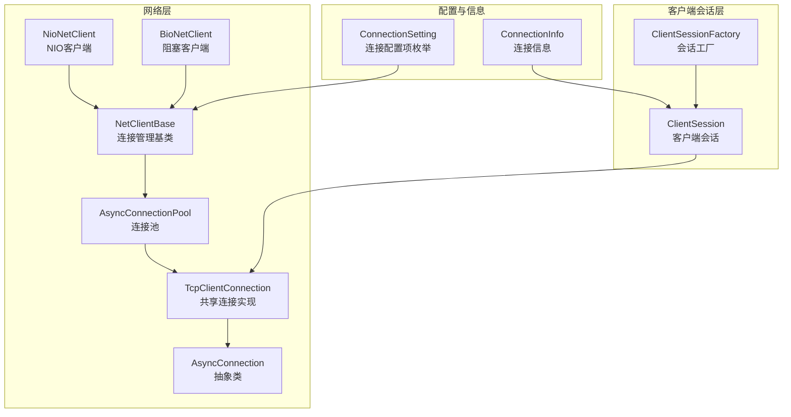
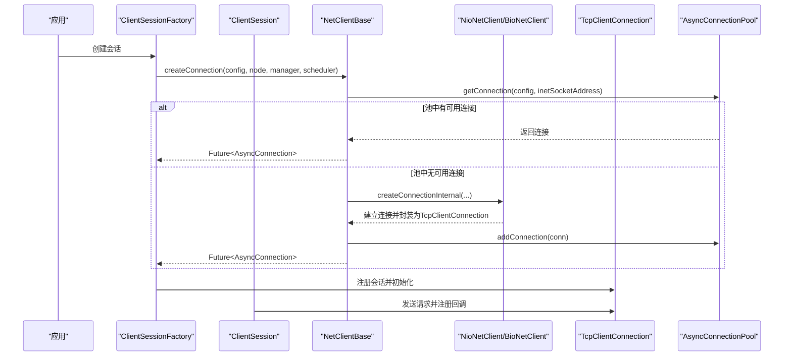
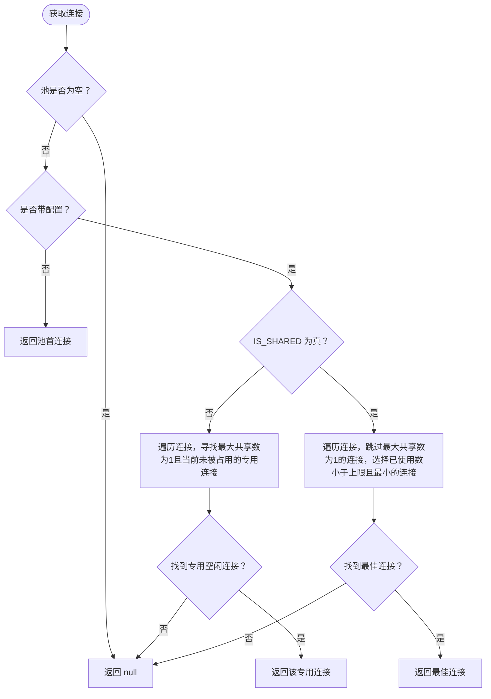
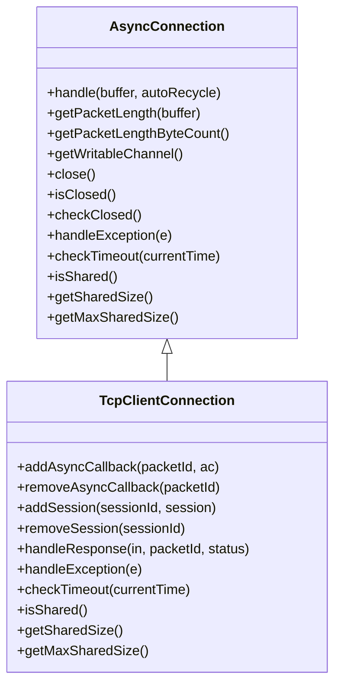
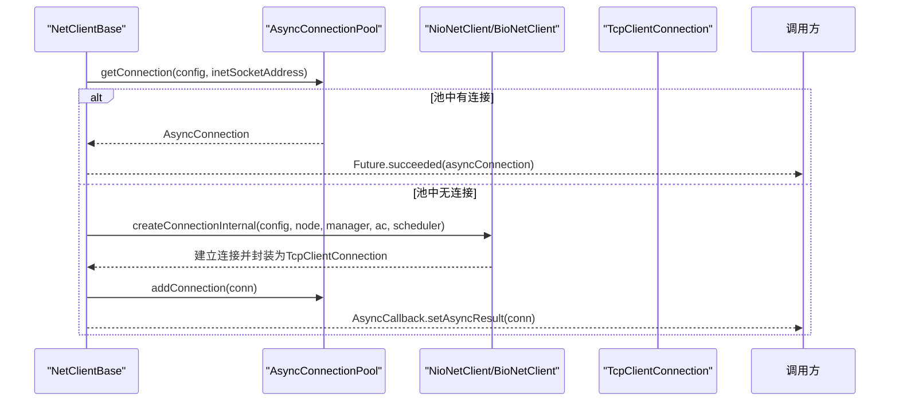
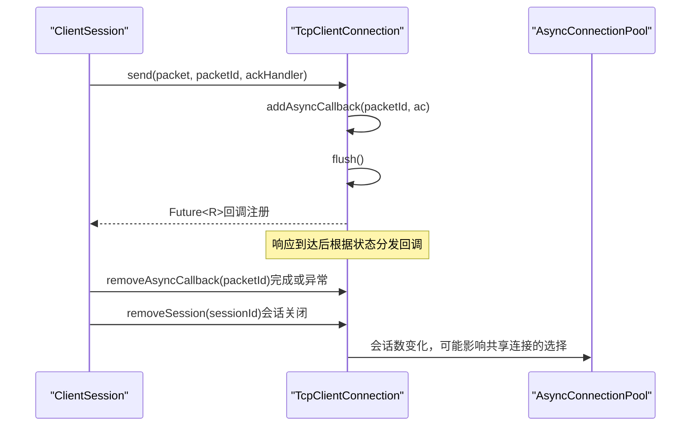
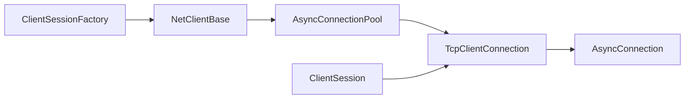

# 连接池机制

<cite>
**本文引用的文件列表**
- [AsyncConnectionPool.java](file://lealone-net/src/main/java/com/lealone/net/AsyncConnectionPool.java)
- [AsyncConnection.java](file://lealone-net/src/main/java/com/lealone/net/AsyncConnection.java)
- [NetClientBase.java](file://lealone-net/src/main/java/com/lealone/net/NetClientBase.java)
- [TcpClientConnection.java](file://lealone-net/src/main/java/com/lealone/net/TcpClientConnection.java)
- [NioNetClient.java](file://lealone-net/src/main/java/com/lealone/net/nio/NioNetClient.java)
- [BioNetClient.java](file://lealone-net/src/main/java/com/lealone/net/bio/BioNetClient.java)
- [ClientSession.java](file://lealone-client/src/main/java/com/lealone/client/session/ClientSession.java)
- [ClientSessionFactory.java](file://lealone-client/src/main/java/com/lealone/client/session/ClientSessionFactory.java)
- [ConnectionSetting.java](file://lealone-common/src/main/java/com/lealone/db/ConnectionSetting.java)
- [ConnectionInfo.java](file://lealone-common/src/main/java/com/lealone/db/ConnectionInfo.java)
- [SharedConnectionTest.java](file://lealone-test/src/test/java/com/lealone/test/client/SharedConnectionTest.java)
</cite>

## 目录
1. [引言](#引言)
2. [项目结构](#项目结构)
3. [核心组件](#核心组件)
4. [架构总览](#架构总览)
5. [详细组件分析](#详细组件分析)
6. [依赖关系分析](#依赖关系分析)
7. [性能考量](#性能考量)
8. [故障排查指南](#故障排查指南)
9. [结论](#结论)
10. [附录](#附录)

## 引言
本文件系统性阐述 Lealone 异步连接池的设计与实现，重点覆盖以下方面：
- AsyncConnectionPool 的内部工作机制：连接获取、归还、空闲连接维护与有效性检测。
- 配置参数（共享模式、最大共享数、网络超时等）对性能的影响。
- ClientSession 如何与连接池协同工作，以及在高并发场景下的连接复用策略。
- 连接池调优指南与常见性能瓶颈的诊断方法。

## 项目结构
围绕连接池的关键代码分布在以下模块：
- 网络层：AsyncConnectionPool、AsyncConnection、NetClientBase、TcpClientConnection、NioNetClient、BioNetClient
- 客户端会话层：ClientSession、ClientSessionFactory
- 配置与信息：ConnectionSetting、ConnectionInfo
- 测试用例：SharedConnectionTest 展示共享连接行为

图表来源
- [AsyncConnection.java](file://lealone-net/src/main/java/com/lealone/net/AsyncConnection.java#L1-L96)
- [TcpClientConnection.java](file://lealone-net/src/main/java/com/lealone/net/TcpClientConnection.java#L1-L191)
- [NioNetClient.java](file://lealone-net/src/main/java/com/lealone/net/nio/NioNetClient.java#L1-L38)
- [BioNetClient.java](file://lealone-net/src/main/java/com/lealone/net/bio/BioNetClient.java#L36-L72)
- [NetClientBase.java](file://lealone-net/src/main/java/com/lealone/net/NetClientBase.java#L1-L143)
- [AsyncConnectionPool.java](file://lealone-net/src/main/java/com/lealone/net/AsyncConnectionPool.java#L1-L93)
- [ClientSession.java](file://lealone-client/src/main/java/com/lealone/client/session/ClientSession.java#L1-L378)
- [ClientSessionFactory.java](file://lealone-client/src/main/java/com/lealone/client/session/ClientSessionFactory.java#L132-L158)
- [ConnectionSetting.java](file://lealone-common/src/main/java/com/lealone/db/ConnectionSetting.java#L1-L27)
- [ConnectionInfo.java](file://lealone-common/src/main/java/com/lealone/db/ConnectionInfo.java#L736-L835)

章节来源
- [AsyncConnectionPool.java](file://lealone-net/src/main/java/com/lealone/net/AsyncConnectionPool.java#L1-L93)
- [NetClientBase.java](file://lealone-net/src/main/java/com/lealone/net/NetClientBase.java#L1-L143)

## 核心组件
- AsyncConnectionPool：按目标地址聚合连接，提供连接获取、移除、关闭、超时检查等能力；支持共享/独享模式与最大共享数控制。
- AsyncConnection：抽象异步连接接口，定义包长解析、通道访问、关闭、超时检查、共享状态查询等。
- TcpClientConnection：具体客户端 TCP 连接实现，支持多会话共享、回调映射、异常处理与运行模式变更通知。
- NetClientBase：连接创建与管理的基类，负责按 InetSocketAddress 维护 AsyncConnectionPool，并提供超时检查、移除连接等通用逻辑。
- ClientSession：客户端会话，封装与服务端的交互，负责发送请求、注册/移除异步回调、网络超时设置等。
- ConnectionSetting/ConnectionInfo：连接配置与信息载体，包含 IS_SHARED、MAX_SHARED_SIZE、NETWORK_TIMEOUT 等关键参数。

章节来源
- [AsyncConnectionPool.java](file://lealone-net/src/main/java/com/lealone/net/AsyncConnectionPool.java#L1-L93)
- [AsyncConnection.java](file://lealone-net/src/main/java/com/lealone/net/AsyncConnection.java#L1-L96)
- [TcpClientConnection.java](file://lealone-net/src/main/java/com/lealone/net/TcpClientConnection.java#L1-L191)
- [NetClientBase.java](file://lealone-net/src/main/java/com/lealone/net/NetClientBase.java#L1-L143)
- [ClientSession.java](file://lealone-client/src/main/java/com/lealone/client/session/ClientSession.java#L1-L378)
- [ConnectionSetting.java](file://lealone-common/src/main/java/com/lealone/db/ConnectionSetting.java#L1-L27)
- [ConnectionInfo.java](file://lealone-common/src/main/java/com/lealone/db/ConnectionInfo.java#L736-L835)

## 架构总览
下图展示从客户端发起连接到会话使用的整体流程，以及连接池在其中的角色。

图表来源
- [ClientSessionFactory.java](file://lealone-client/src/main/java/com/lealone/client/session/ClientSessionFactory.java#L132-L158)
- [NetClientBase.java](file://lealone-net/src/main/java/com/lealone/net/NetClientBase.java#L39-L67)
- [NioNetClient.java](file://lealone-net/src/main/java/com/lealone/net/nio/NioNetClient.java#L33-L90)
- [BioNetClient.java](file://lealone-net/src/main/java/com/lealone/net/bio/BioNetClient.java#L36-L72)
- [TcpClientConnection.java](file://lealone-net/src/main/java/com/lealone/net/TcpClientConnection.java#L1-L191)
- [AsyncConnectionPool.java](file://lealone-net/src/main/java/com/lealone/net/AsyncConnectionPool.java#L1-L93)

## 详细组件分析

### AsyncConnectionPool：连接池内部机制
- 连接获取
  - 无参获取：直接返回池中的第一条连接（适用于独享或简单场景）。
  - 带配置获取：根据 IS_SHARED 与 MAX_SHARED_SIZE 判断是否共享；若共享则选择已使用数小于上限且最小的连接；若非共享，则优先复用“最大共享数为1且当前未被占用”的专用连接。
- 连接归还与移除
  - addConnection/removeConnection 提供连接的加入与移除。
  - removeConnection 在 NetClientBase 中统一调用，确保池为空时清理。
- 关闭与超时
  - close 遍历池内连接并逐个关闭，随后清空列表。
  - checkTimeout 遍历池内连接，委托其执行超时检查（由具体连接实现）。
- 配置参数
  - getMaxSharedSize：当 IS_SHARED 为真时，读取 MAX_SHARED_SIZE，默认值为 3；否则为 1（独享）。
  - isShared：默认为真（共享模式），可通过配置显式关闭。

图表来源
- [AsyncConnectionPool.java](file://lealone-net/src/main/java/com/lealone/net/AsyncConnectionPool.java#L19-L52)

章节来源
- [AsyncConnectionPool.java](file://lealone-net/src/main/java/com/lealone/net/AsyncConnectionPool.java#L1-L93)

### AsyncConnection：抽象连接接口
- 关键职责
  - handle：数据包处理入口。
  - getPacketLength/getPacketLengthByteCount：包头长度解析。
  - getWritableChannel/close/isClosed/checkClosed：通道与生命周期管理。
  - handleException/checkTimeout：异常与超时钩子（可由子类实现）。
  - isShared/getSharedSize/getMaxSharedSize：共享状态与容量查询。
- 设计要点
  - 子类需实现共享语义与超时检查逻辑（例如 TcpClientConnection 实现了共享与回调超时检查）。

章节来源
- [AsyncConnection.java](file://lealone-net/src/main/java/com/lealone/net/AsyncConnection.java#L1-L96)

### TcpClientConnection：共享连接实现
- 共享与容量
  - isShared 返回 true，表示连接可被多个会话共享。
  - getSharedSize 返回当前会话数量；getMaxSharedSize 返回构造时传入的最大共享数。
- 回调与响应处理
  - addAsyncCallback/removeAsyncCallback 维护请求-回调映射。
  - handleResponse 根据状态分发回调或错误；当 STATUS_RUN_MODE_CHANGED 时进行运行模式更新。
- 异常与关闭
  - handleException 设置 pendingException 并通知 NetClient 移除连接。
  - close 时对未完成回调设置异常，避免阻塞等待；同时关闭所有关联会话。
- 超时检查
  - checkTimeout 遍历回调并触发超时检查。

图表来源
- [AsyncConnection.java](file://lealone-net/src/main/java/com/lealone/net/AsyncConnection.java#L1-L96)
- [TcpClientConnection.java](file://lealone-net/src/main/java/com/lealone/net/TcpClientConnection.java#L1-L191)

章节来源
- [TcpClientConnection.java](file://lealone-net/src/main/java/com/lealone/net/TcpClientConnection.java#L1-L191)

### NetClientBase：连接创建与管理
- 连接创建
  - createConnection：先尝试从池中获取连接，若无则异步建立新连接并通过 AsyncCallback 返回。
- 连接池维护
  - addConnection：按 InetSocketAddress 创建或复用 AsyncConnectionPool，并加入连接。
  - removeConnection：从池中移除连接，若池为空则清理；若连接未关闭则主动关闭。
  - checkTimeout：遍历所有池并调用其 checkTimeout。
- 套接字初始化
  - initSocket：根据配置设置接收/发送缓冲区大小、TCP_NODELAY、KEEPALIVE、REUSEADDR 等。

图表来源
- [NetClientBase.java](file://lealone-net/src/main/java/com/lealone/net/NetClientBase.java#L39-L67)
- [NioNetClient.java](file://lealone-net/src/main/java/com/lealone/net/nio/NioNetClient.java#L33-L90)
- [BioNetClient.java](file://lealone-net/src/main/java/com/lealone/net/bio/BioNetClient.java#L36-L72)
- [AsyncConnectionPool.java](file://lealone-net/src/main/java/com/lealone/net/AsyncConnectionPool.java#L54-L60)

章节来源
- [NetClientBase.java](file://lealone-net/src/main/java/com/lealone/net/NetClientBase.java#L1-L143)

### ClientSession：与连接池协同工作
- 请求发送与回调
  - send(packet, packetId, ackHandler)：生成 packetId，注册 AsyncCallback，写入请求并刷新；若为 BIO 模式且存在回调则触发一次读以同步处理。
  - createCallback：根据单线程回调标志创建回调实例。
- 超时与网络设置
  - setNetworkTimeout/getNetworkTimeout：基于 ConnectionInfo 的 NETWORK_TIMEOUT 设置。
- 会话生命周期
  - close：向服务端发送 SessionClose 并移除自身；必要时关闭底层连接；从调度器移除会话。
- 与连接池的关系
  - 通过 TcpClientConnection 的 addSession/removeSession 与连接共享；连接池通过 AsyncConnectionPool 管理连接集合，ClientSession 作为会话实体之一存在于共享连接中。

图表来源
- [ClientSession.java](file://lealone-client/src/main/java/com/lealone/client/session/ClientSession.java#L276-L322)
- [TcpClientConnection.java](file://lealone-net/src/main/java/com/lealone/net/TcpClientConnection.java#L50-L104)
- [AsyncConnectionPool.java](file://lealone-net/src/main/java/com/lealone/net/AsyncConnectionPool.java#L28-L52)

章节来源
- [ClientSession.java](file://lealone-client/src/main/java/com/lealone/client/session/ClientSession.java#L1-L378)
- [ClientSessionFactory.java](file://lealone-client/src/main/java/com/lealone/client/session/ClientSessionFactory.java#L132-L158)

### 配置参数与性能影响
- IS_SHARED（默认：true）
  - 控制连接是否共享。共享连接可被多个会话复用，降低连接数与上下文切换开销；独享连接适合严格隔离场景。
- MAX_SHARED_SIZE（默认：3）
  - 共享连接的最大会话数。增大可提升并发吞吐，但会增加回调管理复杂度与内存占用。
- NETWORK_TIMEOUT（网络层超时）
  - 影响 BIO 客户端连接与读写超时；也用于 ClientSession 的回调超时设置。
- SOCKET_RECV_BUFFER_SIZE/SOCKET_SEND_BUFFER_SIZE
  - 影响套接字缓冲区大小，决定网络 I/O 吞吐与延迟。
- MAX_PACKET_SIZE
  - 单包最大尺寸，影响网络传输效率与内存分配。

章节来源
- [ConnectionSetting.java](file://lealone-common/src/main/java/com/lealone/db/ConnectionSetting.java#L1-L27)
- [ConnectionInfo.java](file://lealone-common/src/main/java/com/lealone/db/ConnectionInfo.java#L736-L835)
- [NetClientBase.java](file://lealone-net/src/main/java/com/lealone/net/NetClientBase.java#L131-L141)
- [BioNetClient.java](file://lealone-net/src/main/java/com/lealone/net/bio/BioNetClient.java#L36-L72)
- [ClientSession.java](file://lealone-client/src/main/java/com/lealone/client/session/ClientSession.java#L266-L274)

## 依赖关系分析
- 组件耦合
  - NetClientBase 依赖 AsyncConnectionPool 管理连接集合；TcpClientConnection 实现 AsyncConnection 并参与共享。
  - ClientSession 依赖 TcpClientConnection 进行请求发送与回调管理。
  - NioNetClient/BioNetClient 负责实际连接建立，并将连接加入池。
- 关键依赖链
  - ClientSessionFactory -> NetClientBase -> AsyncConnectionPool -> TcpClientConnection
  - ClientSession -> TcpClientConnection -> AsyncConnection

图表来源
- [ClientSessionFactory.java](file://lealone-client/src/main/java/com/lealone/client/session/ClientSessionFactory.java#L132-L158)
- [NetClientBase.java](file://lealone-net/src/main/java/com/lealone/net/NetClientBase.java#L39-L67)
- [AsyncConnectionPool.java](file://lealone-net/src/main/java/com/lealone/net/AsyncConnectionPool.java#L54-L60)
- [TcpClientConnection.java](file://lealone-net/src/main/java/com/lealone/net/TcpClientConnection.java#L1-L191)
- [AsyncConnection.java](file://lealone-net/src/main/java/com/lealone/net/AsyncConnection.java#L1-L96)
- [ClientSession.java](file://lealone-client/src/main/java/com/lealone/client/session/ClientSession.java#L1-L378)

章节来源
- [NetClientBase.java](file://lealone-net/src/main/java/com/lealone/net/NetClientBase.java#L1-L143)
- [AsyncConnectionPool.java](file://lealone-net/src/main/java/com/lealone/net/AsyncConnectionPool.java#L1-L93)

## 性能考量
- 连接获取策略
  - 共享连接按“最小占用”策略选择，有助于均衡负载；独享连接优先复用空闲专用连接，减少握手成本。
- 超时与空闲维护
  - NetClientBase 的 checkTimeout 会遍历池内连接，委托其执行超时检查；TcpClientConnection 的回调超时检查避免长时间阻塞。
- 缓冲区与网络参数
  - 适当增大 SOCKET_RECV_BUFFER_SIZE/SOCKET_SEND_BUFFER_SIZE 可提升吞吐；TCP_NODELAY 降低延迟。
- 并发与复用
  - 在高并发场景下，建议启用共享连接并合理设置 MAX_SHARED_SIZE；同时结合单线程回调优化回调处理顺序。
- 资源回收
  - 会话关闭时及时移除回调与会话，避免资源泄漏；连接异常时通过 handleException 触发移除，防止悬挂连接。

[本节为通用性能讨论，不直接分析具体文件]

## 故障排查指南
- 连接异常断开
  - TcpClientConnection.handleException 设置 pendingException 并调用 NetClient.removeConnection，导致连接从池中移除；检查网络波动与服务端状态。
- 回调未完成
  - TcpClientConnection.close 对未完成回调统一设置异常，避免等待线程死等；排查是否存在长时间无响应的请求。
- 超时问题
  - ClientSession.send 将回调超时设置为 ConnectionInfo.getNetworkTimeout；若频繁超时，考虑增大 NETWORK_TIMEOUT 或优化服务端处理。
- 共享连接争用
  - 当 MAX_SHARED_SIZE 过小可能导致争用；通过 SharedConnectionTest 可验证共享行为与连接复用效果。

章节来源
- [TcpClientConnection.java](file://lealone-net/src/main/java/com/lealone/net/TcpClientConnection.java#L159-L190)
- [ClientSession.java](file://lealone-client/src/main/java/com/lealone/client/session/ClientSession.java#L276-L322)
- [SharedConnectionTest.java](file://lealone-test/src/test/java/com/lealone/test/client/SharedConnectionTest.java#L1-L38)

## 结论
Lealone 的异步连接池通过“池化 + 共享 + 最小占用选择”的策略，在保证连接复用的同时兼顾公平与低延迟。配合完善的超时与异常处理机制，能够在高并发场景下稳定运行。调优时应重点关注共享模式、最大共享数与网络超时等参数，并结合业务特征进行平衡。

[本节为总结性内容，不直接分析具体文件]

## 附录
- 关键路径参考
  - 连接池获取：[AsyncConnectionPool.getConnection](file://lealone-net/src/main/java/com/lealone/net/AsyncConnectionPool.java#L19-L52)
  - 连接池超时：[AsyncConnectionPool.checkTimeout](file://lealone-net/src/main/java/com/lealone/net/AsyncConnectionPool.java#L76-L80)
  - 连接创建与池维护：[NetClientBase.createConnection/addConnection/removeConnection](file://lealone-net/src/main/java/com/lealone/net/NetClientBase.java#L39-L114)
  - 共享连接实现：[TcpClientConnection](file://lealone-net/src/main/java/com/lealone/net/TcpClientConnection.java#L1-L191)
  - 客户端会话发送与回调：[ClientSession.send](file://lealone-client/src/main/java/com/lealone/client/session/ClientSession.java#L276-L322)
  - 配置项定义：[ConnectionSetting](file://lealone-common/src/main/java/com/lealone/db/ConnectionSetting.java#L1-L27)
  - 连接信息与超时：[ConnectionInfo](file://lealone-common/src/main/java/com/lealone/db/ConnectionInfo.java#L736-L835)