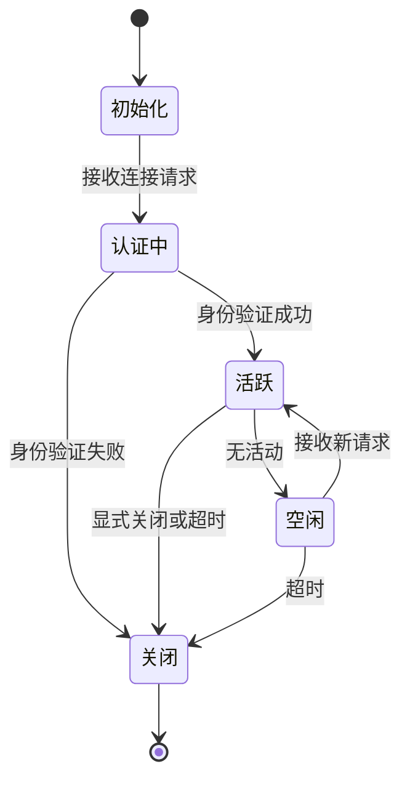
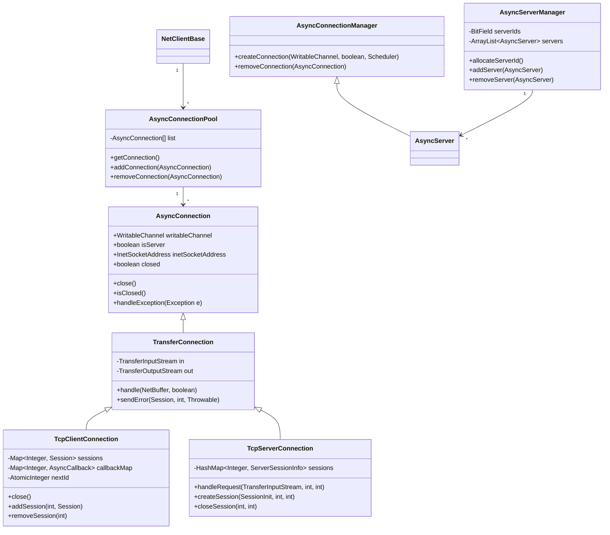
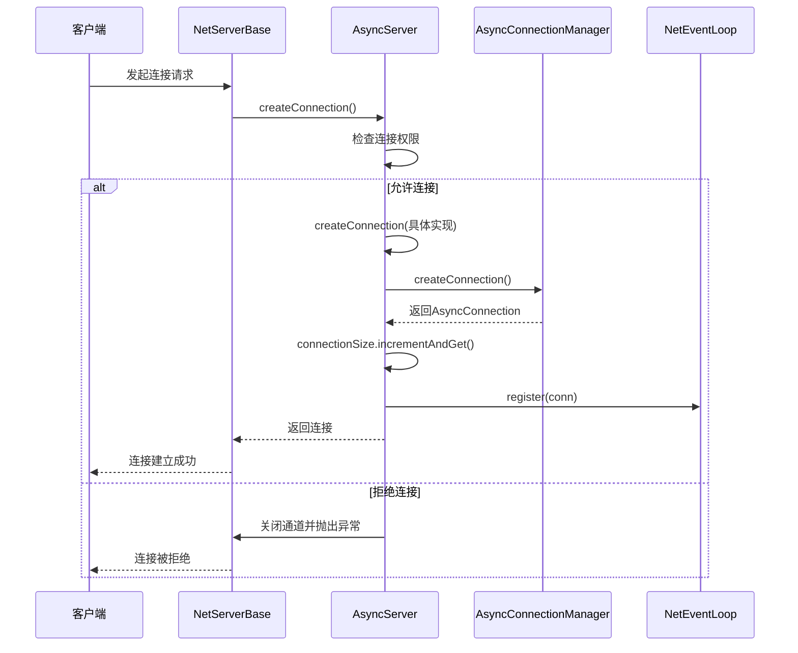
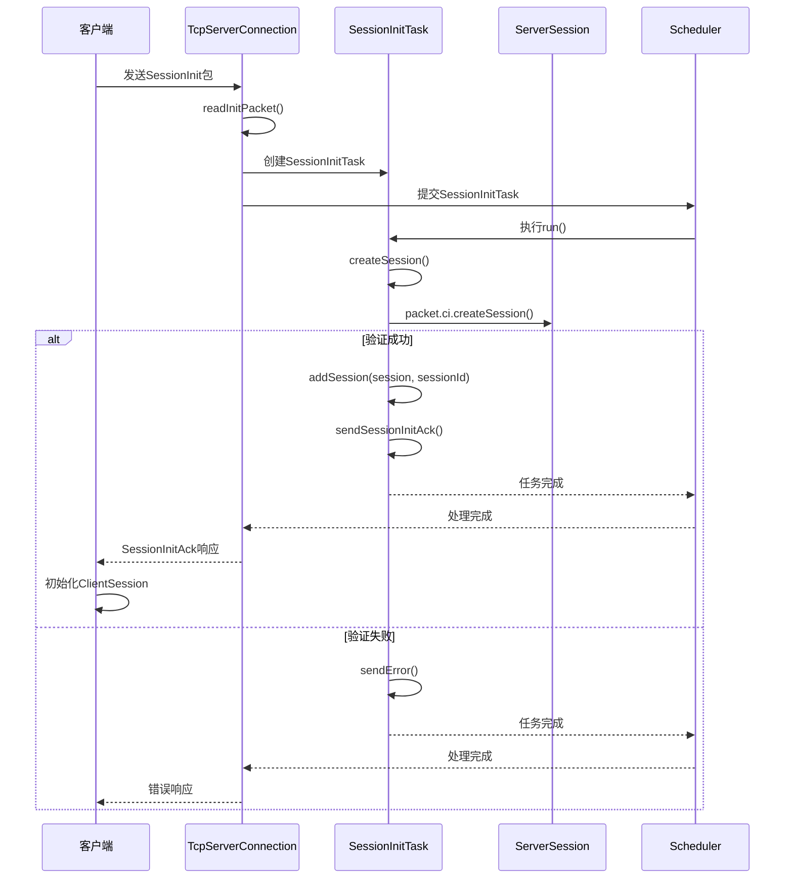
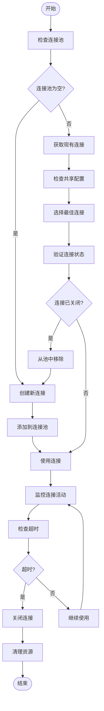
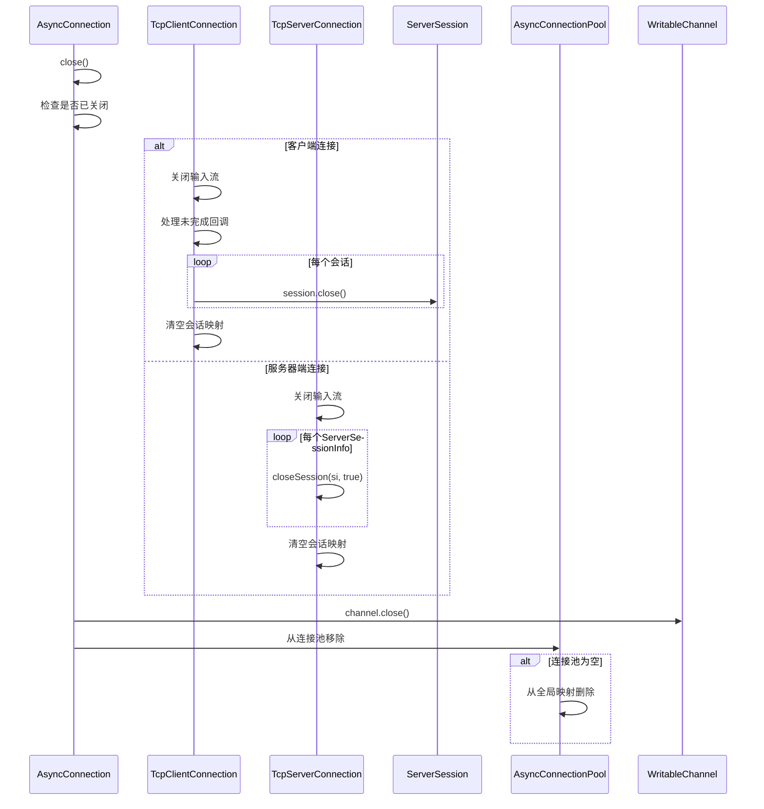
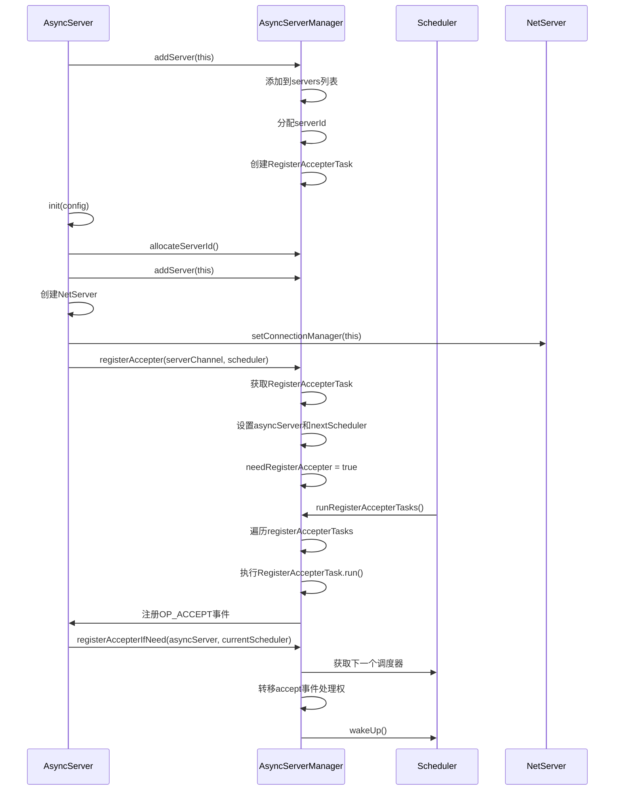
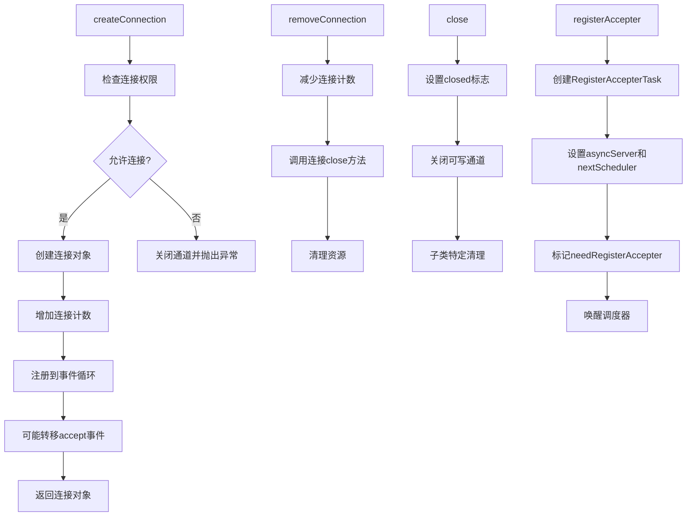
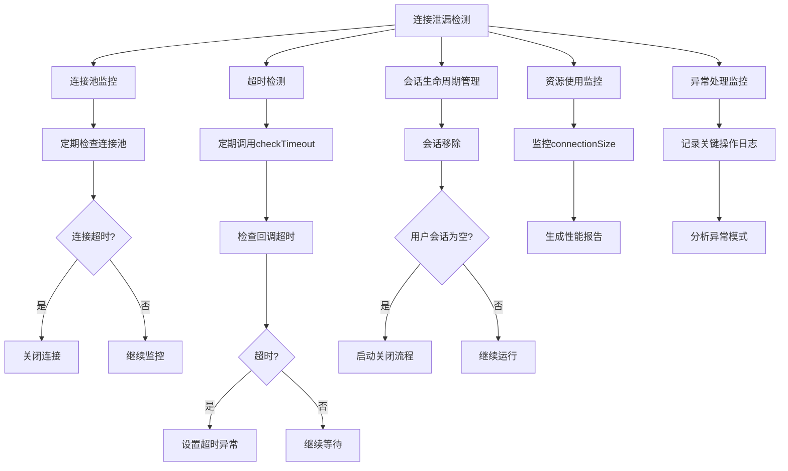
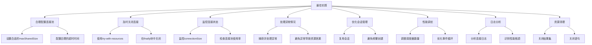

# 连接生命周期管理

**本文档引用的文件**  
- [AsyncConnection.java](https://github.com/lealone/Lealone/blob/master/lealone-net/src/main/java/com/lealone/net/AsyncConnection.java)
- [AsyncConnectionManager.java](https://github.com/lealone/Lealone/blob/master/lealone-net/src/main/java/com/lealone/net/AsyncConnectionManager.java)
- [AsyncConnectionPool.java](https://github.com/lealone/Lealone/blob/master/lealone-net/src/main/java/com/lealone/net/AsyncConnectionPool.java)
- [AsyncServer.java](https://github.com/lealone/Lealone/blob/master/lealone-server/src/main/java/com/lealone/server/AsyncServer.java)
- [AsyncServerManager.java](https://github.com/lealone/Lealone/blob/master/lealone-server/src/main/java/com/lealone/server/AsyncServerManager.java)
- [TcpClientConnection.java](https://github.com/lealone/Lealone/blob/master/lealone-net/src/main/java/com/lealone/net/TcpClientConnection.java)
- [TcpServerConnection.java](https://github.com/lealone/Lealone/blob/master/lealone-server/src/main/java/com/lealone/server/TcpServerConnection.java)
- [TransferConnection.java](https://github.com/lealone/Lealone/blob/master/lealone-net/src/main/java/com/lealone/net/TransferConnection.java)
- [NetClientBase.java](https://github.com/lealone/Lealone/blob/master/lealone-net/src/main/java/com/lealone/net/NetClientBase.java)
- [NetServerBase.java](https://github.com/lealone/Lealone/blob/master/lealone-net/src/main/java/com/lealone/net/NetServerBase.java)
- [NetBuffer.java](https://github.com/lealone/Lealone/blob/master/lealone-common/src/main/java/com/lealone/net/NetBuffer.java)
- [ClientSessionFactory.java](https://github.com/lealone/Lealone/blob/master/lealone-client/src/main/java/com/lealone/client/session/ClientSessionFactory.java)
- [Database.java](https://github.com/lealone/Lealone/blob/master/lealone-db/src/main/java/com/lealone/db/Database.java)

## 目录
1. [连接生命周期概述](#连接生命周期概述)
2. [核心组件分析](#核心组件分析)
3. [连接创建流程](#连接创建流程)
4. [身份验证与会话建立](#身份验证与会话建立)
5. [连接状态管理](#连接状态管理)
6. [连接关闭与资源释放](#连接关闭与资源释放)
7. [AsyncConnectionManager与AsyncServerManager协作](#asyncconnectionmanager与asyncservermanager协作)
8. [关键方法实现细节](#关键方法实现细节)
9. [连接泄漏检测与性能监控](#连接泄漏检测与性能监控)
10. [最佳实践](#最佳实践)

## 连接生命周期概述

Lealone数据库系统的连接生命周期管理机制涵盖了从客户端连接请求到达、连接对象创建、身份验证、会话建立到连接关闭和资源释放的完整过程。该机制通过AsyncConnectionManager和AsyncServerManager两个核心组件的协作，实现了高效的连接状态管理、异常处理和资源清理。

连接生命周期始于客户端发起连接请求，经过网络层接收后创建AsyncConnection对象。随后进行身份验证和会话初始化，建立客户端与服务器之间的通信会话。在连接活跃期间，系统通过连接池和事件循环机制管理连接状态，处理各种数据库操作请求。当连接不再需要时，系统会执行优雅的关闭流程，确保所有相关资源被正确释放。

整个生命周期中，连接状态在不同阶段之间转换，包括初始化、认证中、活跃、空闲和关闭等状态。系统通过超时检测、异常处理和资源监控等机制确保连接管理的健壮性和可靠性。

**连接生命周期状态转换图**

**图示来源**
- [AsyncConnection.java](https://github.com/lealone/Lealone/blob/master/lealone-net/src/main/java/com/lealone/net/AsyncConnection.java)
- [TcpServerConnection.java](https://github.com/lealone/Lealone/blob/master/lealone-server/src/main/java/com/lealone/server/TcpServerConnection.java)

## 核心组件分析

Lealone连接生命周期管理涉及多个核心组件，它们协同工作以实现完整的连接管理功能。

**AsyncConnection** 是所有异步连接的抽象基类，定义了连接的基本行为和状态管理。它封装了可写通道(WritableChannel)，提供了连接处理、关闭和异常处理的基本方法。

**AsyncConnectionManager** 是连接管理的接口，定义了创建和移除连接的方法。它作为连接管理的抽象层，允许不同类型的服务器实现自己的连接管理策略。

**AsyncServerManager** 是服务器管理的静态类，负责管理所有异步服务器实例。它维护服务器ID分配、注册接受者任务和服务器生命周期管理。

**TcpClientConnection** 和 **TcpServerConnection** 分别代表客户端和服务器端的TCP连接实现。它们继承自TransferConnection，实现了具体的连接处理逻辑。

**NetClientBase** 和 **NetServerBase** 提供了网络客户端和服务器的基础实现，包括连接池管理、连接创建和销毁等通用功能。

**图示来源**
- [AsyncConnection.java](https://github.com/lealone/Lealone/blob/master/lealone-net/src/main/java/com/lealone/net/AsyncConnection.java)
- [AsyncConnectionManager.java](https://github.com/lealone/Lealone/blob/master/lealone-net/src/main/java/com/lealone/net/AsyncConnectionManager.java)
- [AsyncServerManager.java](https://github.com/lealone/Lealone/blob/master/lealone-server/src/main/java/com/lealone/server/AsyncServerManager.java)
- [TcpClientConnection.java](https://github.com/lealone/Lealone/blob/master/lealone-net/src/main/java/com/lealone/net/TcpClientConnection.java)
- [TcpServerConnection.java](https://github.com/lealone/Lealone/blob/master/lealone-server/src/main/java/com/lealone/server/TcpServerConnection.java)
- [TransferConnection.java](https://github.com/lealone/Lealone/blob/master/lealone-net/src/main/java/com/lealone/net/TransferConnection.java)
- [AsyncConnectionPool.java](https://github.com/lealone/Lealone/blob/master/lealone-net/src/main/java/com/lealone/net/AsyncConnectionPool.java)

**本节来源**
- [AsyncConnection.java](https://github.com/lealone/Lealone/blob/master/lealone-net/src/main/java/com/lealone/net/AsyncConnection.java)
- [AsyncConnectionManager.java](https://github.com/lealone/Lealone/blob/master/lealone-net/src/main/java/com/lealone/net/AsyncConnectionManager.java)
- [AsyncServerManager.java](https://github.com/lealone/Lealone/blob/master/lealone-server/src/main/java/com/lealone/server/AsyncServerManager.java)
- [TcpClientConnection.java](https://github.com/lealone/Lealone/blob/master/lealone-net/src/main/java/com/lealone/net/TcpClientConnection.java)
- [TcpServerConnection.java](https://github.com/lealone/Lealone/blob/master/lealone-server/src/main/java/com/lealone/server/TcpServerConnection.java)
- [TransferConnection.java](https://github.com/lealone/Lealone/blob/master/lealone-net/src/main/java/com/lealone/net/TransferConnection.java)
- [AsyncConnectionPool.java](https://github.com/lealone/Lealone/blob/master/lealone-net/src/main/java/com/lealone/net/AsyncConnectionPool.java)

## 连接创建流程

连接创建流程始于客户端发起连接请求，经过网络层接收后创建AsyncConnection对象。该流程涉及多个组件的协作，确保连接被正确创建和管理。

当客户端发起连接请求时，服务器的NetServerBase通过其accept方法接收连接。NetServerBase首先检查连接管理器(AsyncConnectionManager)是否已设置，然后调用createConnection方法创建新的连接实例。

在AsyncServer实现中，createConnection方法被重写以处理具体的连接创建逻辑。该方法首先检查是否允许来自该主机的连接，如果允许，则调用抽象方法createConnection创建具体的连接对象。创建成功后，连接被注册到事件循环(NetEventLoop)中，并更新连接计数。

对于TCP连接，TcpServer创建TcpServerConnection实例，该实例继承自AsyncServerConnection。连接创建过程中，系统会为连接分配输入和输出缓冲区(NetBuffer)，并将其与调度器(Scheduler)关联。

客户端连接的创建流程类似，但由NetClientBase负责。当客户端需要创建连接时，首先检查连接池中是否存在可用连接。如果存在且符合配置要求，则复用现有连接；否则创建新连接。

**图示来源**
- [NetServerBase.java](https://github.com/lealone/Lealone/blob/master/lealone-net/src/main/java/com/lealone/net/NetServerBase.java)
- [AsyncServer.java](https://github.com/lealone/Lealone/blob/master/lealone-server/src/main/java/com/lealone/server/AsyncServer.java)
- [AsyncConnectionManager.java](https://github.com/lealone/Lealone/blob/master/lealone-net/src/main/java/com/lealone/net/AsyncConnectionManager.java)

**本节来源**
- [NetServerBase.java](https://github.com/lealone/Lealone/blob/master/lealone-net/src/main/java/com/lealone/net/NetServerBase.java)
- [AsyncServer.java](https://github.com/lealone/Lealone/blob/master/lealone-server/src/main/java/com/lealone/server/AsyncServer.java)
- [AsyncConnectionManager.java](https://github.com/lealone/Lealone/blob/master/lealone-net/src/main/java/com/lealone/net/AsyncConnectionManager.java)

## 身份验证与会话建立

身份验证与会话建立是连接生命周期中的关键阶段，确保只有经过验证的客户端才能访问数据库资源。该过程通过SessionInit和SessionInitAck协议包实现。

当客户端连接建立后，会发送SessionInit包到服务器。TcpServerConnection的handleRequest方法接收到该请求后，调用readInitPacket方法读取初始化数据包。系统创建SessionInitTask任务，并将其提交给调度器处理。

SessionInitTask执行createSession方法，该方法使用ConnectionInfo创建ServerSession实例。身份验证在此过程中完成，系统检查用户名和密码的正确性。如果验证成功，系统调用addSession方法将新会话添加到会话映射中，并发送SessionInitAck响应包。

在addSession方法中，系统为会话创建ServerSessionInfo对象，该对象包含会话的调度信息和任务队列。会话被设置为当前调度器，并创建过期映射(ExpiringMap)用于缓存管理。ServerSessionInfo被添加到调度器的会话信息列表中。

客户端收到SessionInitAck响应后，根据响应中的协议版本、自动提交状态、目标节点等信息初始化ClientSession。客户端会话建立完成后，即可开始发送SQL请求。

**图示来源**
- [TcpServerConnection.java](https://github.com/lealone/Lealone/blob/master/lealone-server/src/main/java/com/lealone/server/TcpServerConnection.java)
- [SessionInitTask.java](https://github.com/lealone/Lealone/blob/master/lealone-server/src/main/java/com/lealone/server/scheduler/SessionInitTask.java)
- [ClientSessionFactory.java](https://github.com/lealone/Lealone/blob/master/lealone-client/src/main/java/com/lealone/client/session/ClientSessionFactory.java)

**本节来源**
- [TcpServerConnection.java](https://github.com/lealone/Lealone/blob/master/lealone-server/src/main/java/com/lealone/server/TcpServerConnection.java)
- [ClientSessionFactory.java](https://github.com/lealone/Lealone/blob/master/lealone-client/src/main/java/com/lealone/client/session/ClientSessionFactory.java)

## 连接状态管理

连接状态管理是确保系统稳定性和资源高效利用的关键。Lealone通过多种机制实现连接状态的有效管理，包括连接池、超时检测和状态监控。

AsyncConnectionPool是连接池的核心实现，它维护一个连接列表，支持连接的获取、添加和移除。连接池根据配置决定是否共享连接，以及最大共享大小。当获取连接时，系统优先选择负载最低的连接。

NetClientBase和NetServerBase都维护连接池映射，以InetSocketAddress为键。这种设计避免了localhost和127.0.0.1被视为不同地址的问题，提高了连接复用率。

系统通过checkTimeout方法实现连接超时检测。AsyncConnectionManager定期调用checkTimeout，检查每个连接的回调超时情况。对于长时间无活动的连接，系统会自动关闭以释放资源。

连接状态通过isClosed标志管理，所有操作前都会调用checkClosed方法验证连接状态。异常处理通过handleException方法实现，当发生异常时，连接会被标记为关闭并从连接池中移除。

**图示来源**
- [AsyncConnectionPool.java](https://github.com/lealone/Lealone/blob/master/lealone-net/src/main/java/com/lealone/net/AsyncConnectionPool.java)
- [NetClientBase.java](https://github.com/lealone/Lealone/blob/master/lealone-net/src/main/java/com/lealone/net/NetClientBase.java)
- [AsyncConnection.java](https://github.com/lealone/Lealone/blob/master/lealone-net/src/main/java/com/lealone/net/AsyncConnection.java)

**本节来源**
- [AsyncConnectionPool.java](https://github.com/lealone/Lealone/blob/master/lealone-net/src/main/java/com/lealone/net/AsyncConnectionPool.java)
- [NetClientBase.java](https://github.com/lealone/Lealone/blob/master/lealone-net/src/main/java/com/lealone/net/NetClientBase.java)
- [AsyncConnection.java](https://github.com/lealone/Lealone/blob/master/lealone-net/src/main/java/com/lealone/net/AsyncConnection.java)

## 连接关闭与资源释放

连接关闭与资源释放是连接生命周期的最后阶段，确保所有相关资源被正确清理。该过程涉及多个组件的协作，包括连接本身、会话、回调和缓冲区。

当连接需要关闭时，系统调用close方法。该方法首先检查连接是否已关闭，避免重复关闭。然后关闭输入流，确保不再接收新数据。对于客户端连接，系统会处理未完成的回调，设置连接中断异常，避免等待线程无限期阻塞。

在TcpClientConnection中，close方法会遍历所有会话并调用其close方法。这确保了所有相关的数据库会话都被正确关闭。会话映射在最后被清空，释放内存资源。

服务器端的TcpServerConnection有类似的关闭流程，但需要额外处理会话信息。系统会遍历所有ServerSessionInfo，调用closeSession方法。在closeSession中，系统执行事务回滚，关闭会话，并从调度器中移除会话信息。

资源释放还包括缓冲区的清理和事件循环的注销。WritableChannel的close方法负责释放底层网络资源。连接从连接池中移除后，如果池为空，则从全局映射中删除。

**图示来源**
- [TcpClientConnection.java](https://github.com/lealone/Lealone/blob/master/lealone-net/src/main/java/com/lealone/net/TcpClientConnection.java)
- [TcpServerConnection.java](https://github.com/lealone/Lealone/blob/master/lealone-server/src/main/java/com/lealone/server/TcpServerConnection.java)
- [AsyncConnection.java](https://github.com/lealone/Lealone/blob/master/lealone-net/src/main/java/com/lealone/net/AsyncConnection.java)
- [AsyncConnectionPool.java](https://github.com/lealone/Lealone/blob/master/lealone-net/src/main/java/com/lealone/net/AsyncConnectionPool.java)

**本节来源**
- [TcpClientConnection.java](https://github.com/lealone/Lealone/blob/master/lealone-net/src/main/java/com/lealone/net/TcpClientConnection.java)
- [TcpServerConnection.java](https://github.com/lealone/Lealone/blob/master/lealone-server/src/main/java/com/lealone/server/TcpServerConnection.java)
- [AsyncConnection.java](https://github.com/lealone/Lealone/blob/master/lealone-net/src/main/java/com/lealone/net/AsyncConnection.java)

## AsyncConnectionManager与AsyncServerManager协作

AsyncConnectionManager和AsyncServerManager在连接生命周期管理中扮演着关键角色，它们通过紧密协作实现高效的连接管理。

AsyncConnectionManager作为连接管理的接口，定义了创建和移除连接的基本操作。AsyncServer实现了这个接口，成为具体的连接管理者。当服务器需要创建新连接时，通过AsyncConnectionManager的createConnection方法委托给AsyncServer处理。

AsyncServerManager则负责管理所有AsyncServer实例的生命周期。当AsyncServer初始化时，调用AsyncServerManager的addServer方法将其注册到全局服务器列表中。服务器停止时，调用removeServer方法从列表中移除。

两个组件在连接接受(accept)事件处理上紧密协作。AsyncServer的registerAccepter方法通过AsyncServerManager注册接受者任务。当需要轮换接受者时，AsyncServerManager的registerAccepterIfNeed方法被调用，将接受事件的处理权转移给下一个调度器。

这种设计实现了连接接受的负载均衡，避免单个调度器成为瓶颈。通过将接受事件分散到多个调度器，系统能够更好地利用多核CPU的处理能力。

**图示来源**
- [AsyncServer.java](https://github.com/lealone/Lealone/blob/master/lealone-server/src/main/java/com/lealone/server/AsyncServer.java)
- [AsyncServerManager.java](https://github.com/lealone/Lealone/blob/master/lealone-server/src/main/java/com/lealone/server/AsyncServerManager.java)

**本节来源**
- [AsyncServer.java](https://github.com/lealone/Lealone/blob/master/lealone-server/src/main/java/com/lealone/server/AsyncServer.java)
- [AsyncServerManager.java](https://github.com/lealone/Lealone/blob/master/lealone-server/src/main/java/com/lealone/server/AsyncServerManager.java)

## 关键方法实现细节

连接生命周期管理涉及多个关键方法的实现，这些方法定义了连接管理的核心逻辑。

**connect方法** 实际上是通过createConnection方法实现的。在AsyncServer中，createConnection方法首先检查连接权限，然后创建具体的连接对象。连接创建后，立即注册到事件循环中，并更新连接计数。最后，调用registerAccepterIfNeed方法，可能将accept事件处理权转移给其他调度器。

**disconnect方法** 由removeConnection方法实现。在AsyncServer中，removeConnection方法减少连接计数，然后调用连接的close方法。这触发了连接的关闭流程，包括资源释放和状态清理。

**close方法** 在AsyncConnection中定义，是连接关闭的核心。该方法设置closed标志，然后关闭底层可写通道。子类如TcpClientConnection和TcpServerConnection重写此方法以实现特定的资源清理逻辑。

**createConnection方法** 在AsyncConnectionManager接口中定义，由AsyncServer实现。该方法是连接创建的入口点，负责连接的实例化和初始化。

**removeConnection方法** 同样在AsyncConnectionManager接口中定义，由AsyncServer实现。该方法负责连接的清理和资源释放。

**图示来源**
- [AsyncServer.java](https://github.com/lealone/Lealone/blob/master/lealone-server/src/main/java/com/lealone/server/AsyncServer.java)
- [AsyncConnection.java](https://github.com/lealone/Lealone/blob/master/lealone-net/src/main/java/com/lealone/net/AsyncConnection.java)
- [TcpClientConnection.java](https://github.com/lealone/Lealone/blob/master/lealone-net/src/main/java/com/lealone/net/TcpClientConnection.java)
- [TcpServerConnection.java](https://github.com/lealone/Lealone/blob/master/lealone-server/src/main/java/com/lealone/server/TcpServerConnection.java)

**本节来源**
- [AsyncServer.java](https://github.com/lealone/Lealone/blob/master/lealone-server/src/main/java/com/lealone/server/AsyncServer.java)
- [AsyncConnection.java](https://github.com/lealone/Lealone/blob/master/lealone-net/src/main/java/com/lealone/net/AsyncConnection.java)

## 连接泄漏检测与性能监控

连接泄漏检测与性能监控是确保系统稳定运行的重要机制。Lealone通过多种方式实现连接泄漏的预防和检测。

**连接池监控** 通过AsyncConnectionPool实现。系统定期检查连接池中的连接状态，对超时连接进行清理。连接池的isEmpty方法可用于监控连接使用情况。

**超时检测** 通过checkTimeout方法实现。系统定期调用此方法，检查每个连接的回调超时情况。对于长时间无活动的连接，系统会自动关闭以防止资源泄漏。

**会话生命周期管理** 在Database类中实现。当会话被移除时，系统检查用户会话列表是否为空。如果为空且设置了关闭延迟，系统会启动数据库关闭流程，避免资源浪费。

**资源使用监控** 通过连接计数器实现。AsyncServer维护connectionSize原子计数器，实时跟踪当前连接数。这可用于性能监控和容量规划。

**异常处理监控** 通过日志记录实现。系统在关键操作点记录连接状态变化和异常情况，便于问题排查和性能分析。

**图示来源**
- [AsyncConnectionPool.java](https://github.com/lealone/Lealone/blob/master/lealone-net/src/main/java/com/lealone/net/AsyncConnectionPool.java)
- [AsyncConnection.java](https://github.com/lealone/Lealone/blob/master/lealone-net/src/main/java/com/lealone/net/AsyncConnection.java)
- [Database.java](https://github.com/lealone/Lealone/blob/master/lealone-db/src/main/java/com/lealone/db/Database.java)
- [AsyncServer.java](https://github.com/lealone/Lealone/blob/master/lealone-server/src/main/java/com/lealone/server/AsyncServer.java)

**本节来源**
- [AsyncConnectionPool.java](https://github.com/lealone/Lealone/blob/master/lealone-net/src/main/java/com/lealone/net/AsyncConnectionPool.java)
- [AsyncConnection.java](https://github.com/lealone/Lealone/blob/master/lealone-net/src/main/java/com/lealone/net/AsyncConnection.java)
- [Database.java](https://github.com/lealone/Lealone/blob/master/lealone-db/src/main/java/com/lealone/db/Database.java)

## 最佳实践

为了确保Lealone连接生命周期管理的高效和稳定，开发者应遵循以下最佳实践：

**合理配置连接池** 根据应用需求设置合适的连接池大小和超时参数。避免连接池过大导致资源浪费，或过小导致性能瓶颈。

**及时关闭连接** 确保在使用完连接后及时调用close方法。使用try-with-resources语句或finally块确保连接被正确关闭。

**监控连接状态** 定期监控连接池使用情况和连接计数，及时发现潜在的连接泄漏问题。

**处理异常情况** 正确处理连接相关的异常，避免因未处理的异常导致连接资源无法释放。

**优化会话管理** 合理管理会话生命周期，避免创建过多的会话对象。对于长时间运行的操作，考虑使用批处理或异步处理。

**性能调优** 根据实际负载调整调度器和事件循环的配置，优化连接接受和处理的性能。

**日志分析** 定期分析连接相关的日志，识别性能瓶颈和异常模式。

**资源清理** 确保所有与连接相关的资源（如结果集、语句等）都被正确清理。

**图示来源**
- [AsyncConnectionPool.java](https://github.com/lealone/Lealone/blob/master/lealone-net/src/main/java/com/lealone/net/AsyncConnectionPool.java)
- [AsyncConnection.java](https://github.com/lealone/Lealone/blob/master/lealone-net/src/main/java/com/lealone/net/AsyncConnection.java)
- [TcpClientConnection.java](https://github.com/lealone/Lealone/blob/master/lealone-net/src/main/java/com/lealone/net/TcpClientConnection.java)

**本节来源**
- [AsyncConnectionPool.java](https://github.com/lealone/Lealone/blob/master/lealone-net/src/main/java/com/lealone/net/AsyncConnectionPool.java)
- [AsyncConnection.java](https://github.com/lealone/Lealone/blob/master/lealone-net/src/main/java/com/lealone/net/AsyncConnection.java)
- [TcpClientConnection.java](https://github.com/lealone/Lealone/blob/master/lealone-net/src/main/java/com/lealone/net/TcpClientConnection.java)