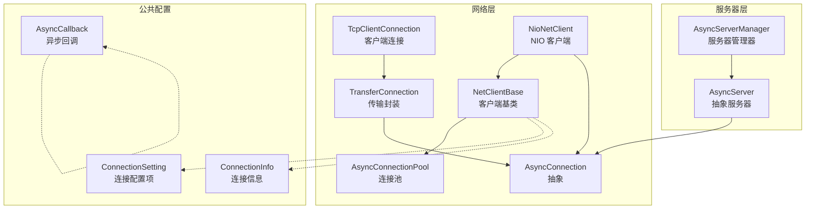
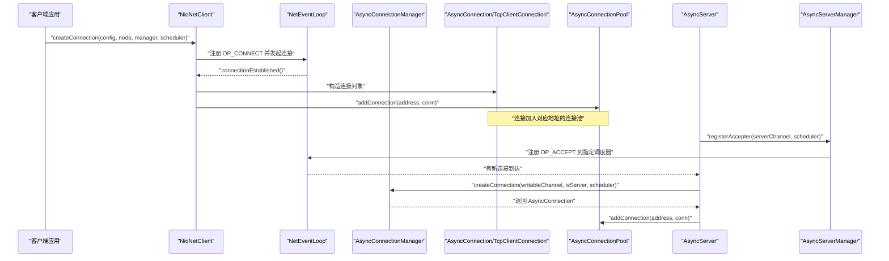
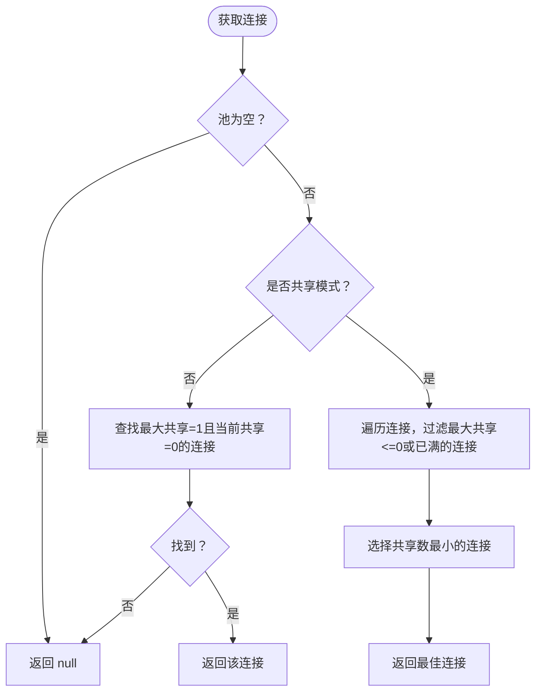
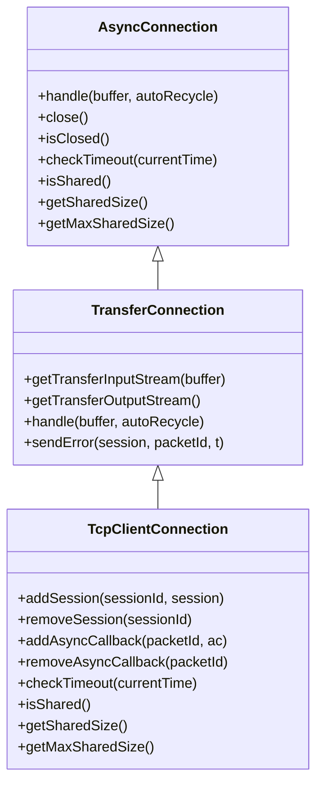
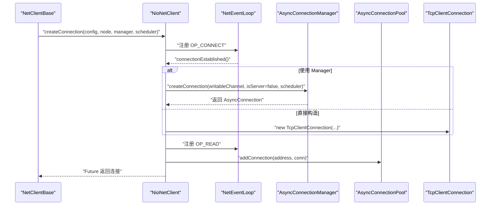
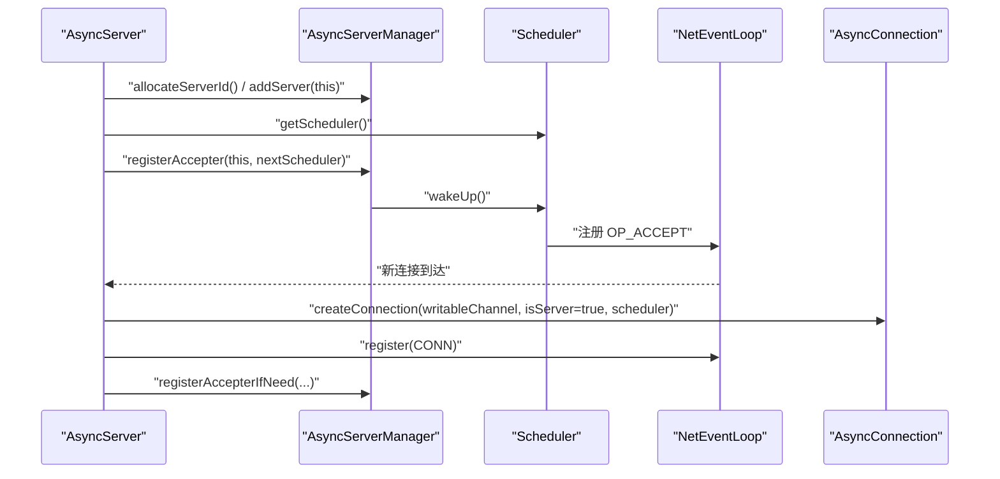
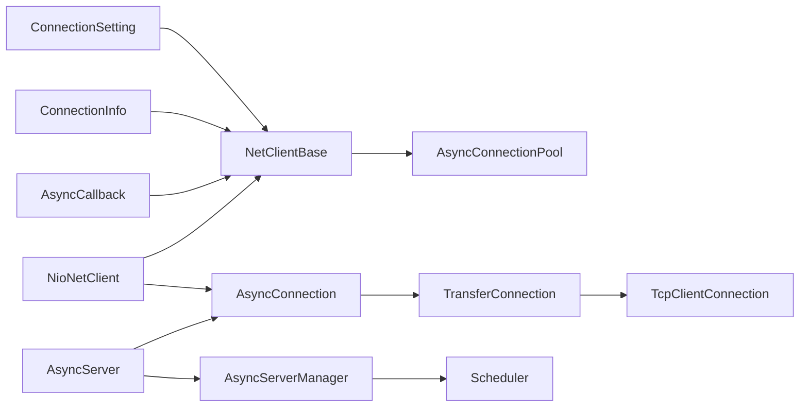

# 连接管理

<cite>
**本文引用的文件列表**
- [AsyncConnectionManager.java](https://github.com/lealone/Lealone/blob/master/lealone-net/src/main/java/com/lealone/net/AsyncConnectionManager.java)
- [AsyncConnectionPool.java](https://github.com/lealone/Lealone/blob/master/lealone-net/src/main/java/com/lealone/net/AsyncConnectionPool.java)
- [AsyncConnection.java](https://github.com/lealone/Lealone/blob/master/lealone-net/src/main/java/com/lealone/net/AsyncConnection.java)
- [TransferConnection.java](https://github.com/lealone/Lealone/blob/master/lealone-net/src/main/java/com/lealone/net/TransferConnection.java)
- [TcpClientConnection.java](https://github.com/lealone/Lealone/blob/master/lealone-net/src/main/java/com/lealone/net/TcpClientConnection.java)
- [NetClientBase.java](https://github.com/lealone/Lealone/blob/master/lealone-net/src/main/java/com/lealone/net/NetClientBase.java)
- [NioNetClient.java](https://github.com/lealone/Lealone/blob/master/lealone-net/src/main/java/com/lealone/net/nio/NioNetClient.java)
- [AsyncServerManager.java](https://github.com/lealone/Lealone/blob/master/lealone-server/src/main/java/com/lealone/server/AsyncServerManager.java)
- [AsyncServer.java](https://github.com/lealone/Lealone/blob/master/lealone-server/src/main/java/com/lealone/server/AsyncServer.java)
- [ConnectionSetting.java](https://github.com/lealone/Lealone/blob/master/lealone-common/src/main/java/com/lealone/db/ConnectionSetting.java)
- [ConnectionInfo.java](https://github.com/lealone/Lealone/blob/master/lealone-common/src/main/java/com/lealone/db/ConnectionInfo.java)
- [AsyncCallback.java](https://github.com/lealone/Lealone/blob/master/lealone-common/src/main/java/com/lealone/db/async/AsyncCallback.java)
- [SharedConnectionTest.java](https://github.com/lealone/Lealone/blob/master/lealone-test/src/test/java/com/lealone/test/client/SharedConnectionTest.java)
</cite>

## 目录
1. [引言](#引言)
2. [项目结构与角色定位](#项目结构与角色定位)
3. [核心组件总览](#核心组件总览)
4. [架构概览](#架构概览)
5. [详细组件分析](#详细组件分析)
6. [依赖关系分析](#依赖关系分析)
7. [性能与调优建议](#性能与调优建议)
8. [故障排查指南](#故障排查指南)
9. [结论](#结论)

## 引言
本文件系统性阐述 Lealone 的连接管理机制，重点覆盖以下方面：
- AsyncConnectionManager 如何抽象并委派客户端连接的生命周期管理（创建、维护、销毁）。
- AsyncConnectionPool 连接池的工作原理、选择策略与配置参数。
- AsyncServerManager 如何协调多服务器实例的连接管理与轮询接管 Accept 事件。
- 面向开发者的连接池调优指南：最大连接数、超时设置、资源回收策略等。

## 项目结构与角色定位
- 网络层（lealone-net）：提供异步连接抽象、传输封装、客户端连接池与网络工厂实现。
- 服务器层（lealone-server）：提供异步服务器抽象、服务器管理器以支持多实例与轮询 Accept。
- 公共配置（lealone-common）：提供连接配置项枚举、连接信息与异步回调超时机制。
- 客户端（lealone-client）：通过 JDBC 或内部 API 使用连接池与网络层能力。
- 测试（lealone-test）：验证连接共享与池化行为。

图表来源
- [AsyncConnection.java](https://github.com/lealone/Lealone/blob/master/lealone-net/src/main/java/com/lealone/net/AsyncConnection.java#L1-L96)
- [TcpClientConnection.java](https://github.com/lealone/Lealone/blob/master/lealone-net/src/main/java/com/lealone/net/TcpClientConnection.java#L1-L191)
- [TransferConnection.java](https://github.com/lealone/Lealone/blob/master/lealone-net/src/main/java/com/lealone/net/TransferConnection.java#L1-L153)
- [AsyncConnectionPool.java](https://github.com/lealone/Lealone/blob/master/lealone-net/src/main/java/com/lealone/net/AsyncConnectionPool.java#L1-L94)
- [NetClientBase.java](https://github.com/lealone/Lealone/blob/master/lealone-net/src/main/java/com/lealone/net/NetClientBase.java#L1-L143)
- [NioNetClient.java](https://github.com/lealone/Lealone/blob/master/lealone-net/src/main/java/com/lealone/net/nio/NioNetClient.java#L1-L101)
- [AsyncServer.java](https://github.com/lealone/Lealone/blob/master/lealone-server/src/main/java/com/lealone/server/AsyncServer.java#L1-L169)
- [AsyncServerManager.java](https://github.com/lealone/Lealone/blob/master/lealone-server/src/main/java/com/lealone/server/AsyncServerManager.java#L1-L133)
- [ConnectionSetting.java](https://github.com/lealone/Lealone/blob/master/lealone-common/src/main/java/com/lealone/db/ConnectionSetting.java#L1-L27)
- [ConnectionInfo.java](https://github.com/lealone/Lealone/blob/master/lealone-common/src/main/java/com/lealone/db/ConnectionInfo.java#L736-L783)
- [AsyncCallback.java](https://github.com/lealone/Lealone/blob/master/lealone-common/src/main/java/com/lealone/db/async/AsyncCallback.java#L52-L100)

章节来源
- [AsyncConnectionManager.java](https://github.com/lealone/Lealone/blob/master/lealone-net/src/main/java/com/lealone/net/AsyncConnectionManager.java#L1-L26)
- [AsyncConnectionPool.java](https://github.com/lealone/Lealone/blob/master/lealone-net/src/main/java/com/lealone/net/AsyncConnectionPool.java#L1-L94)
- [AsyncConnection.java](https://github.com/lealone/Lealone/blob/master/lealone-net/src/main/java/com/lealone/net/AsyncConnection.java#L1-L96)
- [TransferConnection.java](https://github.com/lealone/Lealone/blob/master/lealone-net/src/main/java/com/lealone/net/TransferConnection.java#L1-L153)
- [TcpClientConnection.java](https://github.com/lealone/Lealone/blob/master/lealone-net/src/main/java/com/lealone/net/TcpClientConnection.java#L1-L191)
- [NetClientBase.java](https://github.com/lealone/Lealone/blob/master/lealone-net/src/main/java/com/lealone/net/NetClientBase.java#L1-L143)
- [NioNetClient.java](https://github.com/lealone/Lealone/blob/master/lealone-net/src/main/java/com/lealone/net/nio/NioNetClient.java#L1-L101)
- [AsyncServerManager.java](https://github.com/lealone/Lealone/blob/master/lealone-server/src/main/java/com/lealone/server/AsyncServerManager.java#L1-L133)
- [AsyncServer.java](https://github.com/lealone/Lealone/blob/master/lealone-server/src/main/java/com/lealone/server/AsyncServer.java#L1-L169)
- [ConnectionSetting.java](https://github.com/lealone/Lealone/blob/master/lealone-common/src/main/java/com/lealone/db/ConnectionSetting.java#L1-L27)
- [ConnectionInfo.java](https://github.com/lealone/Lealone/blob/master/lealone-common/src/main/java/com/lealone/db/ConnectionInfo.java#L736-L783)
- [AsyncCallback.java](https://github.com/lealone/Lealone/blob/master/lealone-common/src/main/java/com/lealone/db/async/AsyncCallback.java#L52-L100)

## 核心组件总览
- AsyncConnectionManager：定义连接创建与移除接口，并提供可选的 accepter 注册与延迟添加能力，用于委派具体网络实现或服务器侧连接创建。
- AsyncConnectionPool：按目标地址聚合连接，提供连接选择策略（共享/独享、最小占用优先），并统一进行超时检查与关闭。
- AsyncConnection/TcpClientConnection/TransferConnection：抽象连接与传输层封装，负责包解析、错误处理、回调管理与共享计数。
- NetClientBase/NioNetClient：客户端侧连接创建流程、连接池管理与套接字初始化；NIO 实现负责连接建立后的通道注册与回调。
- AsyncServer/AsyncServerManager：服务器侧连接创建、注册与轮询接管 Accept 事件，支持多实例协作与负载均衡式监听。

章节来源
- [AsyncConnectionManager.java](https://github.com/lealone/Lealone/blob/master/lealone-net/src/main/java/com/lealone/net/AsyncConnectionManager.java#L1-L26)
- [AsyncConnectionPool.java](https://github.com/lealone/Lealone/blob/master/lealone-net/src/main/java/com/lealone/net/AsyncConnectionPool.java#L1-L94)
- [AsyncConnection.java](https://github.com/lealone/Lealone/blob/master/lealone-net/src/main/java/com/lealone/net/AsyncConnection.java#L1-L96)
- [TcpClientConnection.java](https://github.com/lealone/Lealone/blob/master/lealone-net/src/main/java/com/lealone/net/TcpClientConnection.java#L1-L191)
- [TransferConnection.java](https://github.com/lealone/Lealone/blob/master/lealone-net/src/main/java/com/lealone/net/TransferConnection.java#L1-L153)
- [NetClientBase.java](https://github.com/lealone/Lealone/blob/master/lealone-net/src/main/java/com/lealone/net/NetClientBase.java#L1-L143)
- [NioNetClient.java](https://github.com/lealone/Lealone/blob/master/lealone-net/src/main/java/com/lealone/net/nio/NioNetClient.java#L1-L101)
- [AsyncServer.java](https://github.com/lealone/Lealone/blob/master/lealone-server/src/main/java/com/lealone/server/AsyncServer.java#L1-L169)
- [AsyncServerManager.java](https://github.com/lealone/Lealone/blob/master/lealone-server/src/main/java/com/lealone/server/AsyncServerManager.java#L1-L133)

## 架构概览
下图展示客户端连接创建与服务器连接接受的关键交互路径，以及连接池在其中的作用。

图表来源
- [NioNetClient.java](https://github.com/lealone/Lealone/blob/master/lealone-net/src/main/java/com/lealone/net/nio/NioNetClient.java#L33-L101)
- [NetClientBase.java](https://github.com/lealone/Lealone/blob/master/lealone-net/src/main/java/com/lealone/net/NetClientBase.java#L39-L100)
- [AsyncConnectionPool.java](https://github.com/lealone/Lealone/blob/master/lealone-net/src/main/java/com/lealone/net/AsyncConnectionPool.java#L54-L60)
- [AsyncServer.java](https://github.com/lealone/Lealone/blob/master/lealone-server/src/main/java/com/lealone/server/AsyncServer.java#L116-L147)
- [AsyncServerManager.java](https://github.com/lealone/Lealone/blob/master/lealone-server/src/main/java/com/lealone/server/AsyncServerManager.java#L136-L133)

## 详细组件分析

### AsyncConnectionManager：连接生命周期委派
- 角色与职责
  - 定义 createConnection 与 removeConnection 接口，用于委派具体连接创建与移除逻辑。
  - 提供可选扩展点：registerAccepter（注册 Accept 事件）、addConnectionLazy（延迟添加）。
- 与服务器的关系
  - AsyncServer 实现该接口，负责在服务器侧创建连接并注册到事件循环。
- 与客户端的关系
  - NIO 客户端在连接建立后，可通过传入的 connectionManager 创建客户端连接对象并交由池管理。

章节来源
- [AsyncConnectionManager.java](https://github.com/lealone/Lealone/blob/master/lealone-net/src/main/java/com/lealone/net/AsyncConnectionManager.java#L12-L25)
- [AsyncServer.java](https://github.com/lealone/Lealone/blob/master/lealone-server/src/main/java/com/lealone/server/AsyncServer.java#L116-L147)

### AsyncConnectionPool：连接池与选择策略
- 数据结构
  - 以 InetSocketAddress 为键，维护 AsyncConnection 列表。
- 选择策略
  - 独享连接：当共享上限为 1 且当前无共享占用时可直接复用。
  - 共享连接：在满足最大共享上限的前提下，选择当前共享占用最少的连接。
- 关键方法
  - getConnection()/getConnection(config)：按策略获取连接。
  - addConnection/removeConnection/close：池化与回收。
  - checkTimeout：遍历池内连接执行超时检查。
- 配置参数
  - IS_SHARED：是否启用共享模式（默认共享）。
  - MAX_SHARED_SIZE：共享模式下的最大共享数（默认值由池内静态方法提供）。

图表来源
- [AsyncConnectionPool.java](https://github.com/lealone/Lealone/blob/master/lealone-net/src/main/java/com/lealone/net/AsyncConnectionPool.java#L19-L52)

章节来源
- [AsyncConnectionPool.java](https://github.com/lealone/Lealone/blob/master/lealone-net/src/main/java/com/lealone/net/AsyncConnectionPool.java#L1-L94)
- [ConnectionSetting.java](https://github.com/lealone/Lealone/blob/master/lealone-common/src/main/java/com/lealone/db/ConnectionSetting.java#L1-L27)

### AsyncConnection/TcpClientConnection/TransferConnection：传输与状态管理
- AsyncConnection
  - 抽象连接，提供包长度解析、关闭、异常处理与超时检查钩子。
  - isShared/getSharedSize/getMaxSharedSize 默认返回非共享状态。
- TransferConnection
  - 在 AsyncConnection 基础上提供输入输出流封装与请求/响应分发。
  - 统一错误解析与发送错误响应。
- TcpClientConnection
  - 客户端连接实现，维护会话映射、回调映射与共享计数。
  - 关闭时清理回调与会话，避免悬挂等待。
  - 超时检查委托给回调集合。

图表来源
- [AsyncConnection.java](https://github.com/lealone/Lealone/blob/master/lealone-net/src/main/java/com/lealone/net/AsyncConnection.java#L1-L96)
- [TransferConnection.java](https://github.com/lealone/Lealone/blob/master/lealone-net/src/main/java/com/lealone/net/TransferConnection.java#L1-L153)
- [TcpClientConnection.java](https://github.com/lealone/Lealone/blob/master/lealone-net/src/main/java/com/lealone/net/TcpClientConnection.java#L1-L191)

章节来源
- [AsyncConnection.java](https://github.com/lealone/Lealone/blob/master/lealone-net/src/main/java/com/lealone/net/AsyncConnection.java#L1-L96)
- [TransferConnection.java](https://github.com/lealone/Lealone/blob/master/lealone-net/src/main/java/com/lealone/net/TransferConnection.java#L1-L153)
- [TcpClientConnection.java](https://github.com/lealone/Lealone/blob/master/lealone-net/src/main/java/com/lealone/net/TcpClientConnection.java#L1-L191)

### NetClientBase/NioNetClient：客户端连接创建与池化
- NetClientBase
  - 以 InetSocketAddress 为键管理 AsyncConnectionPool。
  - 提供 createConnection/getConnection/removeConnection/addConnection/close/checkTimeout 等统一入口。
  - 初始化套接字缓冲区大小、TCP 参数。
- NioNetClient
  - 发起非阻塞连接，注册 OP_CONNECT，完成后构造连接对象并加入池。
  - 支持通过 AsyncConnectionManager 创建连接，或直接构造客户端连接。
  - 连接成功后替换 SelectionKey 附件为轻量级对象，便于后续读写事件处理。

图表来源
- [NetClientBase.java](https://github.com/lealone/Lealone/blob/master/lealone-net/src/main/java/com/lealone/net/NetClientBase.java#L39-L100)
- [NioNetClient.java](https://github.com/lealone/Lealone/blob/master/lealone-net/src/main/java/com/lealone/net/nio/NioNetClient.java#L33-L101)
- [AsyncConnectionPool.java](https://github.com/lealone/Lealone/blob/master/lealone-net/src/main/java/com/lealone/net/AsyncConnectionPool.java#L54-L60)

章节来源
- [NetClientBase.java](https://github.com/lealone/Lealone/blob/master/lealone-net/src/main/java/com/lealone/net/NetClientBase.java#L1-L143)
- [NioNetClient.java](https://github.com/lealone/Lealone/blob/master/lealone-net/src/main/java/com/lealone/net/nio/NioNetClient.java#L1-L101)

### AsyncServer/AsyncServerManager：服务器侧连接与多实例协调
- AsyncServer
  - 初始化时分配 serverId，注册到 AsyncServerManager。
  - createConnection 校验来源并创建连接，注册到事件循环，必要时切换 Accept 监听调度器。
  - removeConnection 负责减少计数并关闭连接。
  - registerAccepter 将监听注册到指定调度器。
- AsyncServerManager
  - 分配/清理 serverId，维护 RegisterAccepterTask 数组。
  - 在调度器之间传递 Accept 监听权，实现轮询式负载均衡。
  - 批量运行待注册任务，避免重复注册。

图表来源
- [AsyncServer.java](https://github.com/lealone/Lealone/blob/master/lealone-server/src/main/java/com/lealone/server/AsyncServer.java#L41-L147)
- [AsyncServerManager.java](https://github.com/lealone/Lealone/blob/master/lealone-server/src/main/java/com/lealone/server/AsyncServerManager.java#L22-L133)

章节来源
- [AsyncServer.java](https://github.com/lealone/Lealone/blob/master/lealone-server/src/main/java/com/lealone/server/AsyncServer.java#L1-L169)
- [AsyncServerManager.java](https://github.com/lealone/Lealone/blob/master/lealone-server/src/main/java/com/lealone/server/AsyncServerManager.java#L1-L133)

## 依赖关系分析
- 组件耦合
  - NetClientBase 与 AsyncConnectionPool 通过 InetSocketAddress 聚合连接，形成“按地址池化”的弱耦合。
  - NioNetClient 依赖 NetEventLoop 与 Selector，间接依赖 SchedulerFactory。
  - AsyncServer 依赖 AsyncServerManager 与 SchedulerFactory，实现多实例协作。
- 外部依赖
  - ConnectionSetting/ConnectionInfo 提供配置项与网络超时等参数。
  - AsyncCallback 提供网络超时检查与异常转换。

图表来源
- [NetClientBase.java](https://github.com/lealone/Lealone/blob/master/lealone-net/src/main/java/com/lealone/net/NetClientBase.java#L1-L143)
- [NioNetClient.java](https://github.com/lealone/Lealone/blob/master/lealone-net/src/main/java/com/lealone/net/nio/NioNetClient.java#L1-L101)
- [AsyncConnectionPool.java](https://github.com/lealone/Lealone/blob/master/lealone-net/src/main/java/com/lealone/net/AsyncConnectionPool.java#L1-L94)
- [AsyncConnection.java](https://github.com/lealone/Lealone/blob/master/lealone-net/src/main/java/com/lealone/net/AsyncConnection.java#L1-L96)
- [TransferConnection.java](https://github.com/lealone/Lealone/blob/master/lealone-net/src/main/java/com/lealone/net/TransferConnection.java#L1-L153)
- [TcpClientConnection.java](https://github.com/lealone/Lealone/blob/master/lealone-net/src/main/java/com/lealone/net/TcpClientConnection.java#L1-L191)
- [AsyncServer.java](https://github.com/lealone/Lealone/blob/master/lealone-server/src/main/java/com/lealone/server/AsyncServer.java#L1-L169)
- [AsyncServerManager.java](https://github.com/lealone/Lealone/blob/master/lealone-server/src/main/java/com/lealone/server/AsyncServerManager.java#L1-L133)
- [ConnectionSetting.java](https://github.com/lealone/Lealone/blob/master/lealone-common/src/main/java/com/lealone/db/ConnectionSetting.java#L1-L27)
- [ConnectionInfo.java](https://github.com/lealone/Lealone/blob/master/lealone-common/src/main/java/com/lealone/db/ConnectionInfo.java#L736-L783)
- [AsyncCallback.java](https://github.com/lealone/Lealone/blob/master/lealone-common/src/main/java/com/lealone/db/async/AsyncCallback.java#L52-L100)

## 性能与调优建议
- 最大连接数与共享策略
  - IS_SHARED：默认共享，适合高并发短事务场景；若业务需要严格隔离，可设为 false。
  - MAX_SHARED_SIZE：共享模式下建议根据会话数量与并发度设置，避免过度竞争导致上下文切换。
  - 参考实现中的默认值与选择策略，结合业务峰值并发评估。
- 超时设置
  - NETWORK_TIMEOUT：网络层超时，配合 AsyncCallback 的 checkTimeout 使用，避免请求悬挂。
  - 查询超时（如 JDBC 的 query timeout）与网络超时协同，避免长时间阻塞。
- 资源回收策略
  - 定期调用 NetClientBase.checkTimeout 对池内连接进行超时扫描。
  - 在连接关闭时清理回调映射与会话，防止资源泄漏。
  - 服务器侧 removeConnection 后及时关闭底层通道。
- 网络参数
  - SOCKET_RECV_BUFFER_SIZE/SOCKET_SEND_BUFFER_SIZE：根据吞吐与延迟需求调整，避免过大造成内存压力。
  - TCP_NODELAY/KEEPALIVE：提升实时性与稳定性。
- 多实例与轮询 Accept
  - 启用轮询 Accept 可均衡服务器实例间的连接压力，避免单点过载。
  - 注意避免重复注册 Accept 事件，确保切换调度器时正确取消旧兴趣位。

章节来源
- [AsyncConnectionPool.java](https://github.com/lealone/Lealone/blob/master/lealone-net/src/main/java/com/lealone/net/AsyncConnectionPool.java#L76-L87)
- [NetClientBase.java](https://github.com/lealone/Lealone/blob/master/lealone-net/src/main/java/com/lealone/net/NetClientBase.java#L122-L141)
- [AsyncCallback.java](https://github.com/lealone/Lealone/blob/master/lealone-common/src/main/java/com/lealone/db/async/AsyncCallback.java#L90-L100)
- [ConnectionSetting.java](https://github.com/lealone/Lealone/blob/master/lealone-common/src/main/java/com/lealone/db/ConnectionSetting.java#L1-L27)
- [ConnectionInfo.java](https://github.com/lealone/Lealone/blob/master/lealone-common/src/main/java/com/lealone/db/ConnectionInfo.java#L761-L767)
- [AsyncServer.java](https://github.com/lealone/Lealone/blob/master/lealone-server/src/main/java/com/lealone/server/AsyncServer.java#L116-L147)
- [AsyncServerManager.java](https://github.com/lealone/Lealone/blob/master/lealone-server/src/main/java/com/lealone/server/AsyncServerManager.java#L103-L131)

## 故障排查指南
- 连接被关闭或 Broken
  - AsyncConnection.checkClosed 抛出异常，提示连接已断开；检查底层通道状态与异常处理。
- 回调未释放导致挂起
  - TcpClientConnection 在关闭时遍历回调映射并设置异常，避免等待线程死等；确认回调注册与移除成对出现。
- 超时问题
  - AsyncCallback.checkTimeout 根据 startTime 与 networkTimeout 判断超时并抛出异常；核对请求发起时间与超时配置。
- Accept 注册异常
  - AsyncServerManager 在切换调度器时需正确取消旧兴趣位并注册新事件；避免重复注册引发异常。

章节来源
- [AsyncConnection.java](https://github.com/lealone/Lealone/blob/master/lealone-net/src/main/java/com/lealone/net/AsyncConnection.java#L63-L72)
- [TcpClientConnection.java](https://github.com/lealone/Lealone/blob/master/lealone-net/src/main/java/com/lealone/net/TcpClientConnection.java#L59-L87)
- [AsyncCallback.java](https://github.com/lealone/Lealone/blob/master/lealone-common/src/main/java/com/lealone/db/async/AsyncCallback.java#L90-L100)
- [AsyncServerManager.java](https://github.com/lealone/Lealone/blob/master/lealone-server/src/main/java/com/lealone/server/AsyncServerManager.java#L103-L131)

## 结论
Lealone 的连接管理以异步为核心，通过 AsyncConnectionManager 抽象连接生命周期，NetClientBase/AsyncConnectionPool 实现客户端侧的连接池化与复用，AsyncServer/AsyncServerManager 协调服务器侧连接与多实例 Accept 负载均衡。开发者可基于 IS_SHARED/MAX_SHARED_SIZE、NETWORK_TIMEOUT、SOCKET 缓冲区等参数进行精细化调优，结合 AsyncCallback 的超时机制与池化回收策略，获得稳定高效的连接管理体验。