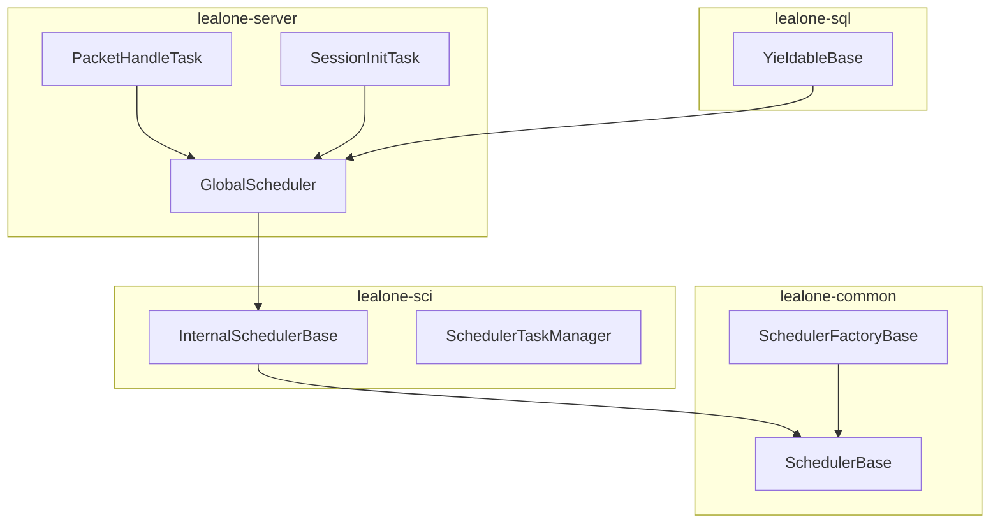
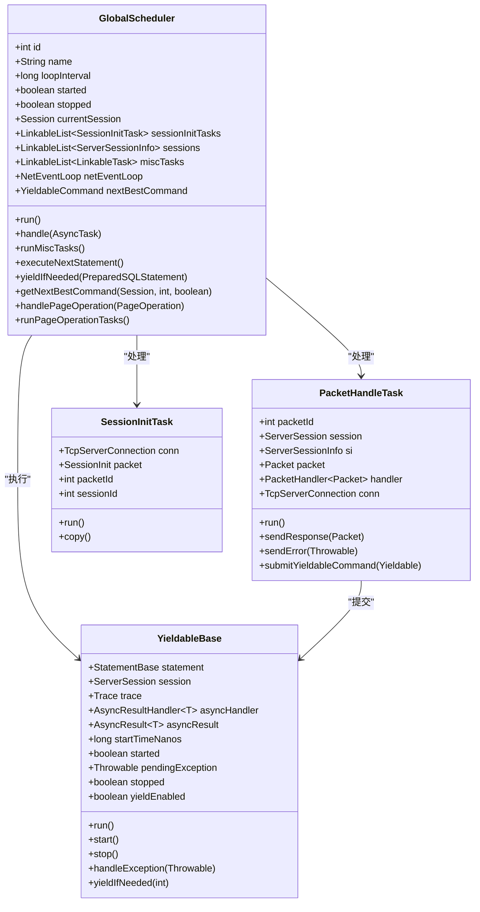
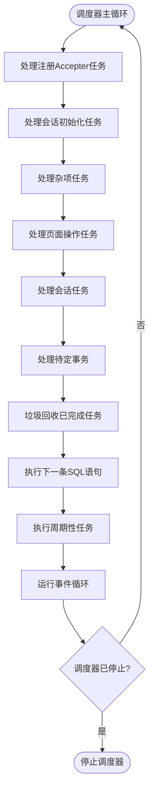
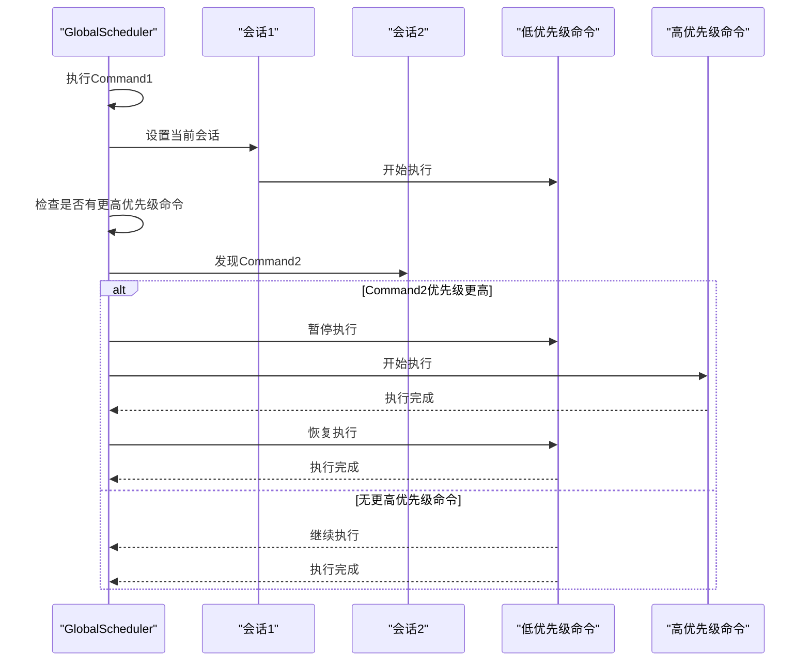
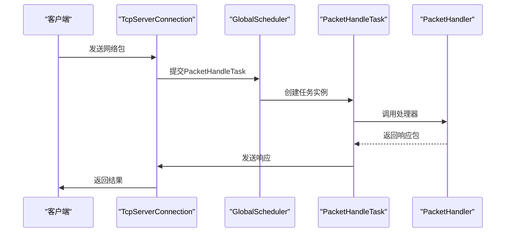
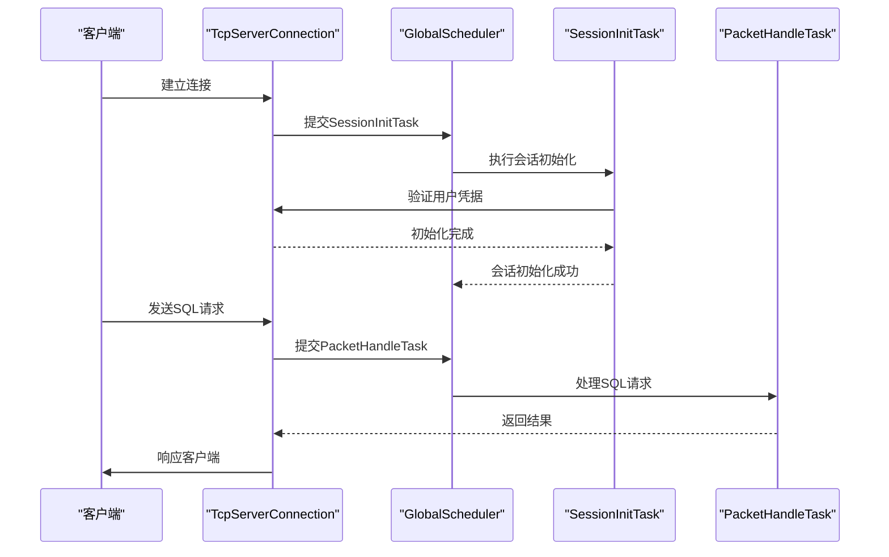
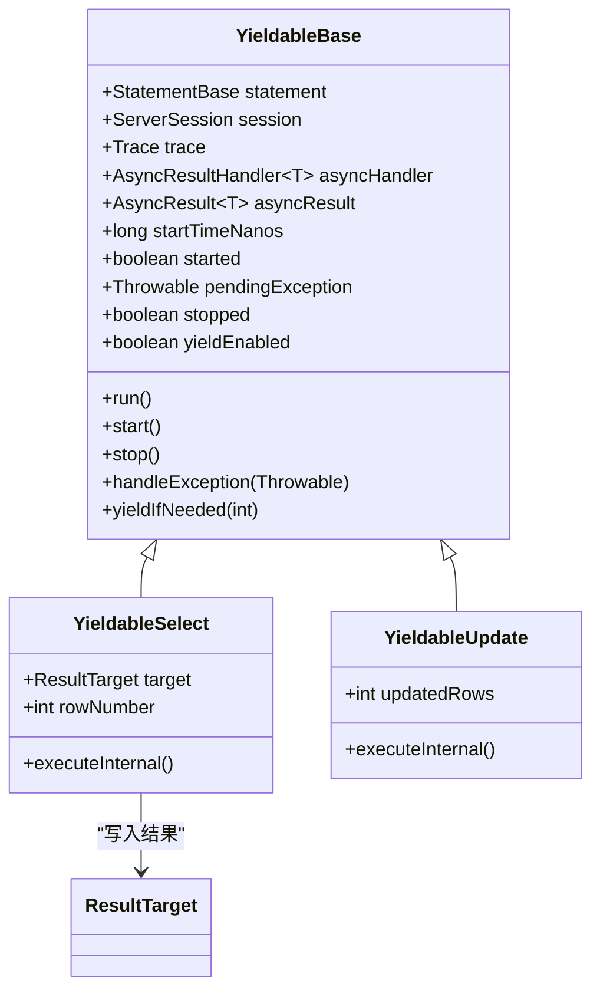
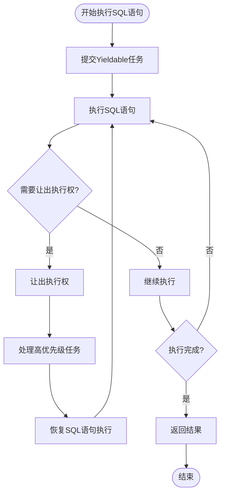
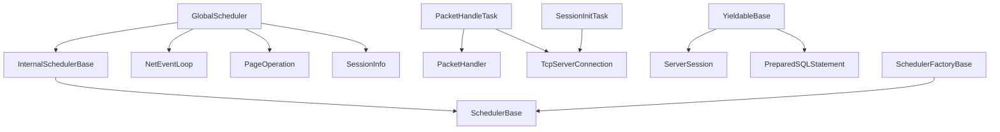

# 调度器架构

<cite>
**本文档引用的文件**   
- [GlobalScheduler.java](file://lealone-server/src/main/java/com/lealone/server/scheduler/GlobalScheduler.java)
- [PacketHandleTask.java](file://lealone-server/src/main/java/com/lealone/server/scheduler/PacketHandleTask.java)
- [SessionInitTask.java](file://lealone-server/src/main/java/com/lealone/server/scheduler/SessionInitTask.java)
- [YieldableBase.java](file://lealone-sql/src/main/java/com/lealone/sql/executor/YieldableBase.java)
- [InternalSchedulerBase.java](file://lealone-sci/src/main/java/com/lealone/db/scheduler/InternalSchedulerBase.java)
- [SchedulerFactoryBase.java](file://lealone-common/src/main/java/com/lealone/db/scheduler/SchedulerFactoryBase.java)
- [lealone.yaml](file://lealone-main/dist/conf/lealone.yaml)
</cite>

## 目录
1. [引言](#引言)
2. [项目结构](#项目结构)
3. [核心组件](#核心组件)
4. [架构概述](#架构概述)
5. [详细组件分析](#详细组件分析)
6. [依赖分析](#依赖分析)
7. [性能考虑](#性能考虑)
8. [故障排除指南](#故障排除指南)
9. [结论](#结论)

## 引言
Lealone调度器是数据库系统的核心组件，负责管理任务队列、线程池和执行调度算法。GlobalScheduler作为主要的调度器实现，采用基于优先级的抢占式调度算法来优化任务执行。调度器通过PacketHandleTask将网络请求转化为可调度任务，并与SessionInitTask等其他任务协同工作。此外，调度器与SQL引擎的YieldableBase机制集成，支持长时间查询的渐进式执行。本文档详细解析了调度器的架构和功能，为开发者提供配置和调优建议。

## 项目结构
Lealone调度器的代码分布在多个模块中，主要包括lealone-server、lealone-sci、lealone-common和lealone-sql。lealone-server模块包含GlobalScheduler和相关任务类，lealone-sci模块提供调度器的基础接口和抽象类，lealone-common模块包含通用的调度器工厂和工具类，lealone-sql模块则实现了SQL语句的可中断执行机制。



**图源**
- [GlobalScheduler.java](file://lealone-server/src/main/java/com/lealone/server/scheduler/GlobalScheduler.java)
- [InternalSchedulerBase.java](file://lealone-sci/src/main/java/com/lealone/db/scheduler/InternalSchedulerBase.java)
- [SchedulerBase.java](file://lealone-common/src/main/java/com/lealone/db/scheduler/SchedulerBase.java)
- [SchedulerFactoryBase.java](file://lealone-common/src/main/java/com/lealone/db/scheduler/SchedulerFactoryBase.java)
- [YieldableBase.java](file://lealone-sql/src/main/java/com/lealone/sql/executor/YieldableBase.java)

**本节源码**
- [GlobalScheduler.java](file://lealone-server/src/main/java/com/lealone/server/scheduler/GlobalScheduler.java)
- [PacketHandleTask.java](file://lealone-server/src/main/java/com/lealone/server/scheduler/PacketHandleTask.java)
- [SessionInitTask.java](file://lealone-server/src/main/java/com/lealone/server/scheduler/SessionInitTask.java)

## 核心组件
Lealone调度器的核心组件包括GlobalScheduler、PacketHandleTask、SessionInitTask和YieldableBase。GlobalScheduler负责管理任务队列和线程池，实现基于优先级的抢占式调度算法。PacketHandleTask将网络请求转化为可调度任务，SessionInitTask处理新会话的初始化，YieldableBase提供SQL语句的渐进式执行机制。

**本节源码**
- [GlobalScheduler.java](file://lealone-server/src/main/java/com/lealone/server/scheduler/GlobalScheduler.java#L1-L455)
- [PacketHandleTask.java](file://lealone-server/src/main/java/com/lealone/server/scheduler/PacketHandleTask.java#L1-L78)
- [SessionInitTask.java](file://lealone-server/src/main/java/com/lealone/server/scheduler/SessionInitTask.java#L1-L35)
- [YieldableBase.java](file://lealone-sql/src/main/java/com/lealone/sql/executor/YieldableBase.java#L1-L193)

## 架构概述
Lealone调度器采用多线程架构，每个调度器实例运行在一个独立的线程中。GlobalScheduler继承自InternalSchedulerBase，实现了任务调度的核心逻辑。调度器通过NetEventLoop处理网络事件，使用LinkableList管理不同类型的任务队列。任务优先级机制确保高优先级任务能够抢占低优先级任务的执行时间。



**图源**
- [GlobalScheduler.java](file://lealone-server/src/main/java/com/lealone/server/scheduler/GlobalScheduler.java#L31-L455)
- [PacketHandleTask.java](file://lealone-server/src/main/java/com/lealone/server/scheduler/PacketHandleTask.java#L18-L78)
- [SessionInitTask.java](file://lealone-server/src/main/java/com/lealone/server/scheduler/SessionInitTask.java#L13-L35)
- [YieldableBase.java](file://lealone-sql/src/main/java/com/lealone/sql/executor/YieldableBase.java#L26-L193)

## 详细组件分析

### GlobalScheduler分析
GlobalScheduler是Lealone数据库系统的主要调度器，负责管理所有任务的执行。它继承自InternalSchedulerBase，实现了任务调度的核心逻辑。调度器通过多个LinkableList管理不同类型的任务队列，包括会话初始化任务、杂项任务和页面操作任务。

#### 任务队列管理
GlobalScheduler使用LinkableList数据结构管理不同类型的任务队列。这种数据结构提供了高效的插入和删除操作，适合频繁修改的任务队列。调度器在每个循环中依次处理不同类型的任务，确保各种任务都能得到及时处理。



**图源**
- [GlobalScheduler.java](file://lealone-server/src/main/java/com/lealone/server/scheduler/GlobalScheduler.java#L63-L77)

#### 基于优先级的抢占式调度算法
GlobalScheduler实现了基于优先级的抢占式调度算法，确保高优先级任务能够及时执行。算法通过getNextBestCommand方法查找优先级最高的可执行命令，如果发现更高优先级的命令，当前执行的语句会让出执行权。



**图源**
- [GlobalScheduler.java](file://lealone-server/src/main/java/com/lealone/server/scheduler/GlobalScheduler.java#L216-L336)

**本节源码**
- [GlobalScheduler.java](file://lealone-server/src/main/java/com/lealone/server/scheduler/GlobalScheduler.java#L31-L455)

### PacketHandleTask分析
PacketHandleTask负责将网络请求转化为可调度任务。当客户端发送请求时，调度器创建PacketHandleTask实例来处理该请求。任务执行完成后，结果通过网络返回给客户端。

#### 网络请求到可调度任务的转换
PacketHandleTask的构造函数接收网络包、会话信息和处理器等参数，将这些信息封装成一个可执行的任务。run方法调用相应的处理器处理网络包，并将结果发送回客户端。



**图源**
- [PacketHandleTask.java](file://lealone-server/src/main/java/com/lealone/server/scheduler/PacketHandleTask.java#L18-L78)

#### 与SessionInitTask的协同工作
PacketHandleTask和SessionInitTask协同工作，确保新会话能够正确初始化。当新客户端连接时，首先创建SessionInitTask进行会话初始化，初始化完成后才能创建PacketHandleTask处理后续请求。



**图源**
- [SessionInitTask.java](file://lealone-server/src/main/java/com/lealone/server/scheduler/SessionInitTask.java#L13-L35)
- [PacketHandleTask.java](file://lealone-server/src/main/java/com/lealone/server/scheduler/PacketHandleTask.java#L18-L78)

**本节源码**
- [PacketHandleTask.java](file://lealone-server/src/main/java/com/lealone/server/scheduler/PacketHandleTask.java#L1-L78)
- [SessionInitTask.java](file://lealone-server/src/main/java/com/lealone/server/scheduler/SessionInitTask.java#L1-L35)

### 调度器与SQL引擎的集成
Lealone调度器与SQL引擎通过YieldableBase机制集成，实现长时间查询的渐进式执行。这种机制允许长时间运行的查询在执行过程中让出CPU，避免阻塞其他任务。

#### YieldableBase机制
YieldableBase是所有可中断SQL语句执行的基础类。它提供了yieldIfNeeded方法，允许SQL语句在适当的时候检查是否需要让出执行权。当有更高优先级的任务需要执行时，当前SQL语句会暂停执行，让出CPU资源。



**图源**
- [YieldableBase.java](file://lealone-sql/src/main/java/com/lealone/sql/executor/YieldableBase.java#L26-L193)

#### 渐进式执行流程
长时间查询的渐进式执行流程包括任务提交、周期性检查和结果返回三个阶段。调度器在执行SQL语句时定期调用yieldIfNeeded方法，检查是否有更高优先级的任务需要执行。



**图源**
- [YieldableBase.java](file://lealone-sql/src/main/java/com/lealone/sql/executor/YieldableBase.java#L94-L115)

**本节源码**
- [YieldableBase.java](file://lealone-sql/src/main/java/com/lealone/sql/executor/YieldableBase.java#L1-L193)

## 依赖分析
Lealone调度器的依赖关系复杂，涉及多个模块和组件。GlobalScheduler依赖于InternalSchedulerBase提供的基础功能，同时与NetEventLoop、PageOperation等组件交互。PacketHandleTask依赖于PacketHandler处理网络包，SessionInitTask依赖于TcpServerConnection创建会话。



**图源**
- [GlobalScheduler.java](file://lealone-server/src/main/java/com/lealone/server/scheduler/GlobalScheduler.java)
- [PacketHandleTask.java](file://lealone-server/src/main/java/com/lealone/server/scheduler/PacketHandleTask.java)
- [SessionInitTask.java](file://lealone-server/src/main/java/com/lealone/server/scheduler/SessionInitTask.java)
- [YieldableBase.java](file://lealone-sql/src/main/java/com/lealone/sql/executor/YieldableBase.java)
- [InternalSchedulerBase.java](file://lealone-sci/src/main/java/com/lealone/db/scheduler/InternalSchedulerBase.java)
- [SchedulerBase.java](file://lealone-common/src/main/java/com/lealone/db/scheduler/SchedulerBase.java)

**本节源码**
- [GlobalScheduler.java](file://lealone-server/src/main/java/com/lealone/server/scheduler/GlobalScheduler.java#L31-L455)
- [InternalSchedulerBase.java](file://lealone-sci/src/main/java/com/lealone/db/scheduler/InternalSchedulerBase.java#L21-L250)

## 性能考虑
Lealone调度器在高并发场景下表现出良好的性能和资源利用率。通过基于优先级的抢占式调度算法，确保关键任务能够及时响应。调度器使用LinkableList数据结构管理任务队列，提供了高效的插入和删除操作。

### 高并发性能表现
在高并发场景下，GlobalScheduler能够有效管理大量并发任务。调度器通过NetEventLoop处理网络事件，使用非阻塞I/O提高吞吐量。任务队列的分层管理确保不同类型的任务能够得到合理调度。

### 资源利用率
调度器通过合理的线程管理和任务调度，最大化CPU和内存资源的利用率。每个调度器实例运行在独立的线程中，避免了线程竞争。任务的渐进式执行机制防止长时间查询占用过多CPU资源。

### 调度参数配置和性能调优建议
开发者可以通过配置文件调整调度器的参数，优化性能。主要配置参数包括调度器数量、循环间隔和任务优先级等。

```yaml
# lealone.yaml
scheduler:
  count: 4
  loop_interval: 50
  factory_type: LoadBalance
```

**本节源码**
- [lealone.yaml](file://lealone-main/dist/conf/lealone.yaml)

## 故障排除指南
当调度器出现问题时，开发者可以检查日志文件和系统状态。常见的问题包括任务积压、高CPU使用率和内存泄漏。通过分析调度器的任务队列和执行日志，可以定位问题根源。

**本节源码**
- [GlobalScheduler.java](file://lealone-server/src/main/java/com/lealone/server/scheduler/GlobalScheduler.java#L33-L455)

## 结论
Lealone调度器通过GlobalScheduler实现了高效的任务管理和基于优先级的抢占式调度算法。PacketHandleTask成功将网络请求转化为可调度任务，并与SessionInitTask等其他任务协同工作。调度器与SQL引擎的YieldableBase机制集成，支持长时间查询的渐进式执行。在高并发场景下，调度器表现出良好的性能和资源利用率。开发者可以通过合理的配置和调优，进一步提升系统性能。