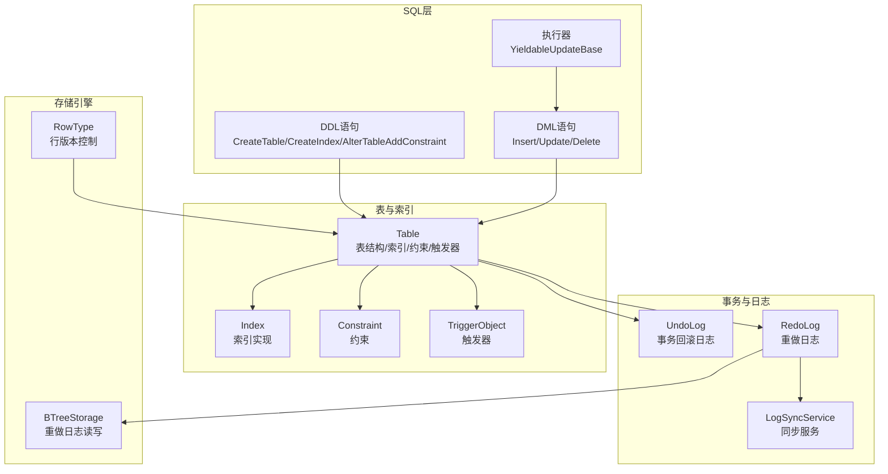
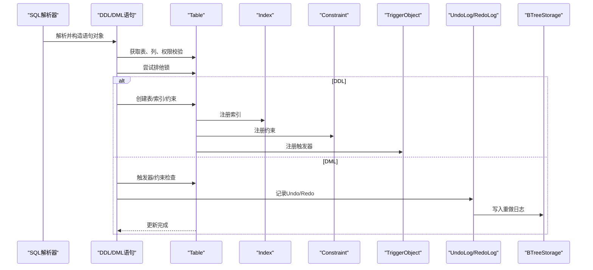
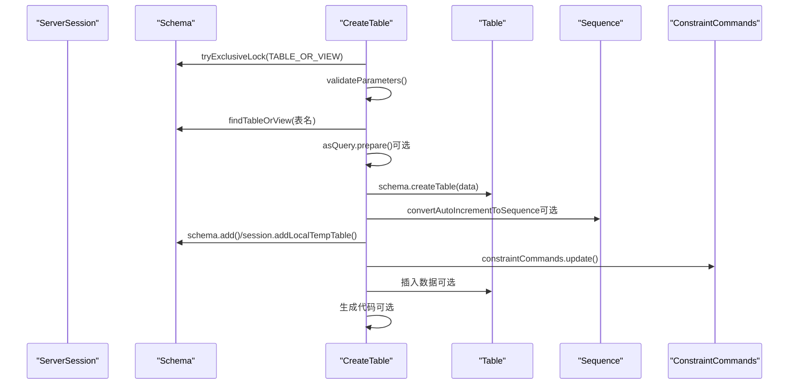
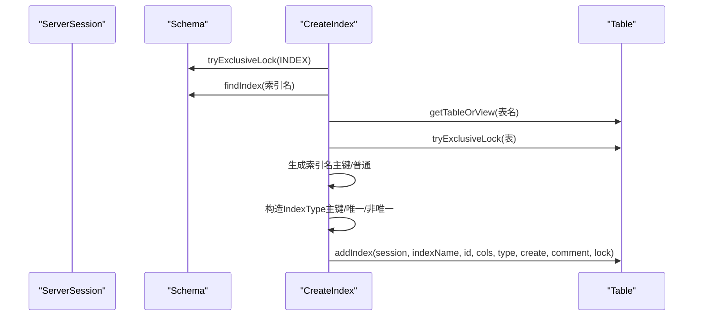
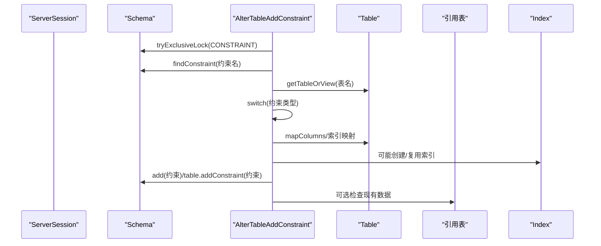
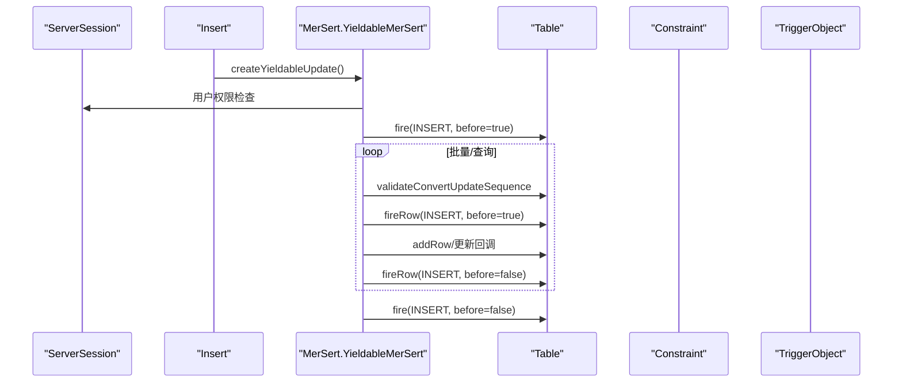
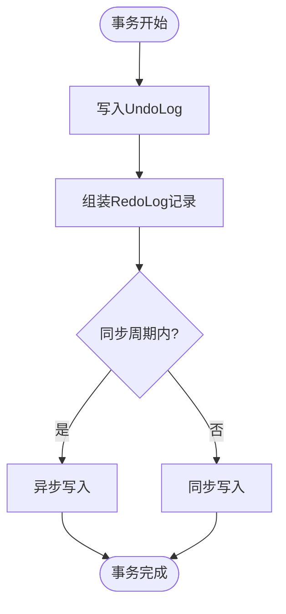
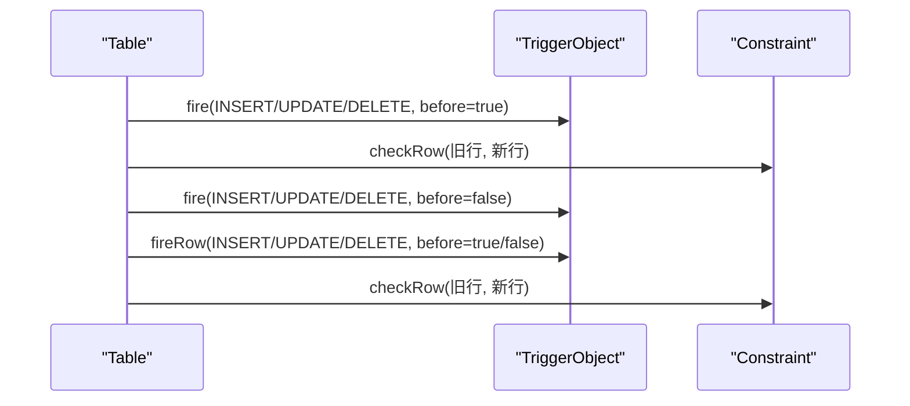
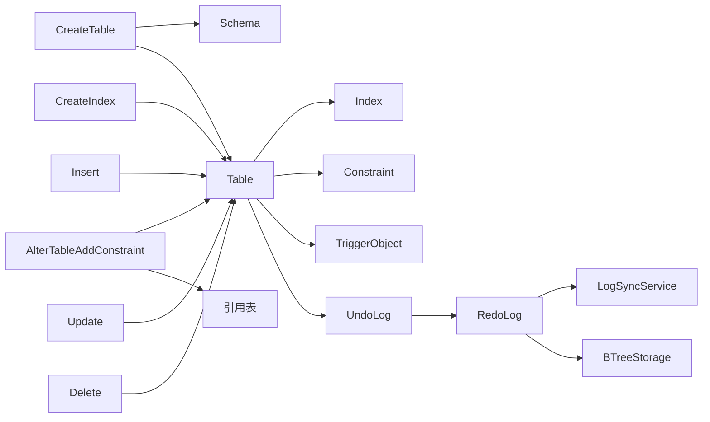
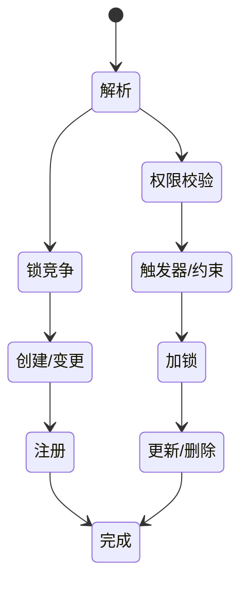

# DDL与DML处理

<cite>
**本文引用的文件**
- [CreateTable.java](https://github.com/lealone/Lealone/blob/master/lealone-sql/src/main/java/com/lealone/sql/ddl/CreateTable.java)
- [CreateIndex.java](https://github.com/lealone/Lealone/blob/master/lealone-sql/src/main/java/com/lealone/sql/ddl/CreateIndex.java)
- [AlterTableAddConstraint.java](https://github.com/lealone/Lealone/blob/master/lealone-sql/src/main/java/com/lealone/sql/ddl/AlterTableAddConstraint.java)
- [Insert.java](https://github.com/lealone/Lealone/blob/master/lealone-sql/src/main/java/com/lealone/sql/dml/Insert.java)
- [Update.java](https://github.com/lealone/Lealone/blob/master/lealone-sql/src/main/java/com/lealone/sql/dml/Update.java)
- [Delete.java](https://github.com/lealone/Lealone/blob/master/lealone-sql/src/main/java/com/lealone/sql/dml/Delete.java)
- [MerSert.java](https://github.com/lealone/Lealone/blob/master/lealone-sql/src/main/java/com/lealone/sql/dml/MerSert.java)
- [UpDel.java](https://github.com/lealone/Lealone/blob/master/lealone-sql/src/main/java/com/lealone/sql/dml/UpDel.java)
- [YieldableUpdateBase.java](https://github.com/lealone/Lealone/blob/master/lealone-sql/src/main/java/com/lealone/sql/executor/YieldableUpdateBase.java)
- [Table.java](https://github.com/lealone/Lealone/blob/master/lealone-db/src/main/java/com/lealone/db/table/Table.java)
- [Constraint.java](https://github.com/lealone/Lealone/blob/master/lealone-db/src/main/java/com/lealone/db/constraint/Constraint.java)
- [ConstraintCheck.java](https://github.com/lealone/Lealone/blob/master/lealone-db/src/main/java/com/lealone/db/constraint/ConstraintCheck.java)
- [ConstraintReferential.java](https://github.com/lealone/Lealone/blob/master/lealone-db/src/main/java/com/lealone/db/constraint/ConstraintReferential.java)
- [TriggerObject.java](https://github.com/lealone/Lealone/blob/master/lealone-db/src/main/java/com/lealone/db/schema/TriggerObject.java)
- [UndoLog.java](https://github.com/lealone/Lealone/blob/master/lealone-aote/src/main/java/com/lealone/transaction/aote/log/UndoLog.java)
- [RedoLog.java](https://github.com/lealone/Lealone/blob/master/lealone-aote/src/main/java/com/lealone/transaction/aote/log/RedoLog.java)
- [RedoLogRecord.java](https://github.com/lealone/Lealone/blob/master/lealone-aote/src/main/java/com/lealone/transaction/aote/log/RedoLogRecord.java)
- [LogSyncService.java](https://github.com/lealone/Lealone/blob/master/lealone-aote/src/main/java/com/lealone/transaction/aote/log/LogSyncService.java)
- [BTreeStorage.java](https://github.com/lealone/Lealone/blob/master/lealone-aose/src/main/java/com/lealone/storage/aose/btree/BTreeStorage.java)
- [RowType.java](https://github.com/lealone/Lealone/blob/master/lealone-db/src/main/java/com/lealone/db/row/RowType.java)
- [TableAlterHistory.java](https://github.com/lealone/Lealone/blob/master/lealone-db/src/main/java/com/lealone/db/table/TableAlterHistory.java)
- [StandardTable.java](https://github.com/lealone/Lealone/blob/master/lealone-db/src/main/java/com/lealone/db/table/StandardTable.java)
</cite>

## 目录
1. [简介](#简介)
2. [项目结构](#项目结构)
3. [核心组件](#核心组件)
4. [架构总览](#架构总览)
5. [详细组件分析](#详细组件分析)
6. [依赖关系分析](#依赖关系分析)
7. [性能考量](#性能考量)
8. [故障排查指南](#故障排查指南)
9. [结论](#结论)
10. [附录](#附录)

## 简介
本文件系统性梳理Lealone数据库中DDL与DML语句的处理流程，覆盖：
- DDL：CreateTable、CreateIndex、AlterTableAddConstraint 的元数据变更与存储结构创建路径
- DML：Insert、Update、Delete 的执行机制，包含行锁管理、版本控制、事务日志记录
- 在线DDL能力与对系统可用性的影响
- 约束检查、触发器执行等附加处理逻辑
- 提供DDL/DML执行的时序图与状态机模型

## 项目结构
围绕DDL/DML处理的核心模块分布如下：
- SQL层：DDL与DML语句解析与执行入口（lealone-sql）
- 表与索引：表结构、索引、约束、触发器（lealone-db）
- 事务与日志：Undo/Redo日志、同步服务（lealone-aote）
- 存储引擎：AOSE（页面存储、重做日志）（lealone-aose）

图表来源
- [CreateTable.java](https://github.com/lealone/Lealone/blob/master/lealone-sql/src/main/java/com/lealone/sql/ddl/CreateTable.java#L1-L246)
- [CreateIndex.java](https://github.com/lealone/Lealone/blob/master/lealone-sql/src/main/java/com/lealone/sql/ddl/CreateIndex.java#L1-L118)
- [AlterTableAddConstraint.java](https://github.com/lealone/Lealone/blob/master/lealone-sql/src/main/java/com/lealone/sql/ddl/AlterTableAddConstraint.java#L1-L327)
- [Insert.java](https://github.com/lealone/Lealone/blob/master/lealone-sql/src/main/java/com/lealone/sql/dml/Insert.java#L1-L74)
- [Update.java](https://github.com/lealone/Lealone/blob/master/lealone-sql/src/main/java/com/lealone/sql/dml/Update.java#L1-L180)
- [Delete.java](https://github.com/lealone/Lealone/blob/master/lealone-sql/src/main/java/com/lealone/sql/dml/Delete.java#L1-L97)
- [YieldableUpdateBase.java](https://github.com/lealone/Lealone/blob/master/lealone-sql/src/main/java/com/lealone/sql/executor/YieldableUpdateBase.java#L1-L21)
- [Table.java](https://github.com/lealone/Lealone/blob/master/lealone-db/src/main/java/com/lealone/db/table/Table.java#L1-L200)
- [UndoLog.java](https://github.com/lealone/Lealone/blob/master/lealone-aote/src/main/java/com/lealone/transaction/aote/log/UndoLog.java#L1-L35)
- [RedoLog.java](https://github.com/lealone/Lealone/blob/master/lealone-aote/src/main/java/com/lealone/transaction/aote/log/RedoLog.java#L403-L452)
- [RedoLogRecord.java](https://github.com/lealone/Lealone/blob/master/lealone-aote/src/main/java/com/lealone/transaction/aote/log/RedoLogRecord.java#L84-L160)
- [LogSyncService.java](https://github.com/lealone/Lealone/blob/master/lealone-aote/src/main/java/com/lealone/transaction/aote/log/LogSyncService.java#L298-L320)
- [BTreeStorage.java](https://github.com/lealone/Lealone/blob/master/lealone-aose/src/main/java/com/lealone/storage/aose/btree/BTreeStorage.java#L369-L414)
- [RowType.java](https://github.com/lealone/Lealone/blob/master/lealone-db/src/main/java/com/lealone/db/row/RowType.java#L233-L264)

章节来源
- [CreateTable.java](https://github.com/lealone/Lealone/blob/master/lealone-sql/src/main/java/com/lealone/sql/ddl/CreateTable.java#L1-L246)
- [CreateIndex.java](https://github.com/lealone/Lealone/blob/master/lealone-sql/src/main/java/com/lealone/sql/ddl/CreateIndex.java#L1-L118)
- [AlterTableAddConstraint.java](https://github.com/lealone/Lealone/blob/master/lealone-sql/src/main/java/com/lealone/sql/ddl/AlterTableAddConstraint.java#L1-L327)
- [Insert.java](https://github.com/lealone/Lealone/blob/master/lealone-sql/src/main/java/com/lealone/sql/dml/Insert.java#L1-L74)
- [Update.java](https://github.com/lealone/Lealone/blob/master/lealone-sql/src/main/java/com/lealone/sql/dml/Update.java#L1-L180)
- [Delete.java](https://github.com/lealone/Lealone/blob/master/lealone-sql/src/main/java/com/lealone/sql/dml/Delete.java#L1-L97)
- [YieldableUpdateBase.java](https://github.com/lealone/Lealone/blob/master/lealone-sql/src/main/java/com/lealone/sql/executor/YieldableUpdateBase.java#L1-L21)
- [Table.java](https://github.com/lealone/Lealone/blob/master/lealone-db/src/main/java/com/lealone/db/table/Table.java#L1-L200)

## 核心组件
- DDL语句处理器
  - CreateTable：解析建表参数、校验、创建表与索引、序列、约束命令、可选的“按查询建表”插入数据、代码生成插件集成
  - CreateIndex：解析索引定义、权限校验、表级排他锁、创建索引
  - AlterTableAddConstraint：解析并添加主键、唯一、检查、外键约束，必要时复用或新建索引
- DML语句处理器
  - Insert/Update/Delete：继承MerSert/UpDel，基于Yieldable执行器进行批量/流式更新，支持触发器与约束检查
- 执行器与调度
  - YieldableUpdateBase：统一的异步更新结果封装
- 表与索引
  - Table：表结构、索引、约束、触发器、版本号、行级触发器与约束检查入口
- 事务与日志
  - UndoLog/RedoLog/RedoLogRecord/LogSyncService：事务写入、重做日志落盘与同步
- 存储引擎
  - BTreeStorage：重做日志读写、校验与同步
- 版本控制
  - RowType：行元数据版本，配合表版本进行重放与索引重建

章节来源
- [CreateTable.java](https://github.com/lealone/Lealone/blob/master/lealone-sql/src/main/java/com/lealone/sql/ddl/CreateTable.java#L1-L246)
- [CreateIndex.java](https://github.com/lealone/Lealone/blob/master/lealone-sql/src/main/java/com/lealone/sql/ddl/CreateIndex.java#L1-L118)
- [AlterTableAddConstraint.java](https://github.com/lealone/Lealone/blob/master/lealone-sql/src/main/java/com/lealone/sql/ddl/AlterTableAddConstraint.java#L1-L327)
- [Insert.java](https://github.com/lealone/Lealone/blob/master/lealone-sql/src/main/java/com/lealone/sql/dml/Insert.java#L1-L74)
- [Update.java](https://github.com/lealone/Lealone/blob/master/lealone-sql/src/main/java/com/lealone/sql/dml/Update.java#L1-L180)
- [Delete.java](https://github.com/lealone/Lealone/blob/master/lealone-sql/src/main/java/com/lealone/sql/dml/Delete.java#L1-L97)
- [MerSert.java](https://github.com/lealone/Lealone/blob/master/lealone-sql/src/main/java/com/lealone/sql/dml/MerSert.java#L1-L323)
- [UpDel.java](https://github.com/lealone/Lealone/blob/master/lealone-sql/src/main/java/com/lealone/sql/dml/UpDel.java#L1-L184)
- [YieldableUpdateBase.java](https://github.com/lealone/Lealone/blob/master/lealone-sql/src/main/java/com/lealone/sql/executor/YieldableUpdateBase.java#L1-L21)
- [Table.java](https://github.com/lealone/Lealone/blob/master/lealone-db/src/main/java/com/lealone/db/table/Table.java#L1-L200)
- [UndoLog.java](https://github.com/lealone/Lealone/blob/master/lealone-aote/src/main/java/com/lealone/transaction/aote/log/UndoLog.java#L1-L35)
- [RedoLog.java](https://github.com/lealone/Lealone/blob/master/lealone-aote/src/main/java/com/lealone/transaction/aote/log/RedoLog.java#L403-L452)
- [RedoLogRecord.java](https://github.com/lealone/Lealone/blob/master/lealone-aote/src/main/java/com/lealone/transaction/aote/log/RedoLogRecord.java#L84-L160)
- [LogSyncService.java](https://github.com/lealone/Lealone/blob/master/lealone-aote/src/main/java/com/lealone/transaction/aote/log/LogSyncService.java#L298-L320)
- [BTreeStorage.java](https://github.com/lealone/Lealone/blob/master/lealone-aose/src/main/java/com/lealone/storage/aose/btree/BTreeStorage.java#L369-L414)
- [RowType.java](https://github.com/lealone/Lealone/blob/master/lealone-db/src/main/java/com/lealone/db/row/RowType.java#L233-L264)

## 架构总览
DDL/DML处理贯穿SQL解析、权限与锁、表/索引/约束/触发器、事务日志与存储引擎。下图展示关键交互：

图表来源
- [CreateTable.java](https://github.com/lealone/Lealone/blob/master/lealone-sql/src/main/java/com/lealone/sql/ddl/CreateTable.java#L142-L246)
- [CreateIndex.java](https://github.com/lealone/Lealone/blob/master/lealone-sql/src/main/java/com/lealone/sql/ddl/CreateIndex.java#L78-L118)
- [AlterTableAddConstraint.java](https://github.com/lealone/Lealone/blob/master/lealone-sql/src/main/java/com/lealone/sql/ddl/AlterTableAddConstraint.java#L142-L327)
- [Insert.java](https://github.com/lealone/Lealone/blob/master/lealone-sql/src/main/java/com/lealone/sql/dml/Insert.java#L45-L74)
- [Update.java](https://github.com/lealone/Lealone/blob/master/lealone-sql/src/main/java/com/lealone/sql/dml/Update.java#L104-L180)
- [Delete.java](https://github.com/lealone/Lealone/blob/master/lealone-sql/src/main/java/com/lealone/sql/dml/Delete.java#L55-L97)
- [Table.java](https://github.com/lealone/Lealone/blob/master/lealone-db/src/main/java/com/lealone/db/table/Table.java#L148-L206)
- [UndoLog.java](https://github.com/lealone/Lealone/blob/master/lealone-aote/src/main/java/com/lealone/transaction/aote/log/UndoLog.java#L1-L35)
- [RedoLog.java](https://github.com/lealone/Lealone/blob/master/lealone-aote/src/main/java/com/lealone/transaction/aote/log/RedoLog.java#L403-L452)
- [BTreeStorage.java](https://github.com/lealone/Lealone/blob/master/lealone-aose/src/main/java/com/lealone/storage/aose/btree/BTreeStorage.java#L369-L414)

## 详细组件分析

### DDL：CreateTable
- 关键职责
  - 参数校验（存储引擎参数、表设置）
  - 元数据锁（schema表级排他锁）
  - 表创建、列定义、序列转换、临时表行为、按查询建表插入
  - 约束命令延迟执行、代码生成插件集成
- 流程要点
  - 验证参数后尝试获取schema与表对象锁
  - 若存在“按查询建表”，先准备子查询并校验列数
  - 主键列自动置非空
  - 创建表对象并注册到schema或会话临时表
  - 准备列表达式、添加序列、执行约束命令、可选插入数据
  - 生成代码（插件机制）
- 时序图

图表来源
- [CreateTable.java](https://github.com/lealone/Lealone/blob/master/lealone-sql/src/main/java/com/lealone/sql/ddl/CreateTable.java#L142-L246)

章节来源
- [CreateTable.java](https://github.com/lealone/Lealone/blob/master/lealone-sql/src/main/java/com/lealone/sql/ddl/CreateTable.java#L1-L246)

### DDL：CreateIndex
- 关键职责
  - 权限校验（用户对表的ALL权限）
  - 表级排他锁
  - 唯一索引/主键索引类型选择
  - 索引列映射与名称生成
  - 添加索引到表
- 流程要点
  - 获取索引对象ID，生成唯一索引名
  - 依据是否主键/唯一/哈希构建IndexType
  - 映射索引列到表列
  - 调用table.addIndex完成索引创建
- 时序图

图表来源
- [CreateIndex.java](https://github.com/lealone/Lealone/blob/master/lealone-sql/src/main/java/com/lealone/sql/ddl/CreateIndex.java#L78-L118)

章节来源
- [CreateIndex.java](https://github.com/lealone/Lealone/blob/master/lealone-sql/src/main/java/com/lealone/sql/ddl/CreateIndex.java#L1-L118)

### DDL：AlterTableAddConstraint
- 关键职责
  - 支持主键、唯一、检查、外键约束
  - 约束名生成、索引复用/新建策略
  - 外键引用表与列映射、动作配置
  - 现有数据一致性检查（可选）
- 流程要点
  - 获取约束对象ID，生成唯一约束名
  - 主键：若无现有索引则创建，标记属于约束
  - 唯一：优先复用唯一索引，否则新建
  - 检查：表达式优化与求值器绑定
  - 外键：确保引用表可引用，必要时为引用表建立唯一索引，设置删除/更新动作
  - 注册约束到schema与表，并可选检查现有数据
- 时序图

图表来源
- [AlterTableAddConstraint.java](https://github.com/lealone/Lealone/blob/master/lealone-sql/src/main/java/com/lealone/sql/ddl/AlterTableAddConstraint.java#L142-L327)

章节来源
- [AlterTableAddConstraint.java](https://github.com/lealone/Lealone/blob/master/lealone-sql/src/main/java/com/lealone/sql/ddl/AlterTableAddConstraint.java#L1-L327)

### DML：Insert/Update/Delete
- 继承关系与执行器
  - Insert/Update/Delete均继承MerSert/UpDel，使用Yieldable执行器进行分段执行，避免长事务阻塞
  - MerSert：批量/查询驱动的插入，支持LOB字段与参数化
  - UpDel：基于TableFilter与TableIterator扫描匹配行，逐行加锁并更新/删除
- 触发器与约束
  - DML执行前/后触发器：Insert/Update/Delete分别在开始与结束阶段触发
  - 行级触发器与约束：Table.fireBeforeRow/fireAfterRow，以及约束检查
- 时序图（以Insert为例）

图表来源
- [Insert.java](https://github.com/lealone/Lealone/blob/master/lealone-sql/src/main/java/com/lealone/sql/dml/Insert.java#L45-L74)
- [MerSert.java](https://github.com/lealone/Lealone/blob/master/lealone-sql/src/main/java/com/lealone/sql/dml/MerSert.java#L168-L323)
- [UpDel.java](https://github.com/lealone/Lealone/blob/master/lealone-sql/src/main/java/com/lealone/sql/dml/UpDel.java#L81-L184)
- [Table.java](https://github.com/lealone/Lealone/blob/master/lealone-db/src/main/java/com/lealone/db/table/Table.java#L818-L935)

章节来源
- [Insert.java](https://github.com/lealone/Lealone/blob/master/lealone-sql/src/main/java/com/lealone/sql/dml/Insert.java#L1-L74)
- [Update.java](https://github.com/lealone/Lealone/blob/master/lealone-sql/src/main/java/com/lealone/sql/dml/Update.java#L1-L180)
- [Delete.java](https://github.com/lealone/Lealone/blob/master/lealone-sql/src/main/java/com/lealone/sql/dml/Delete.java#L1-L97)
- [MerSert.java](https://github.com/lealone/Lealone/blob/master/lealone-sql/src/main/java/com/lealone/sql/dml/MerSert.java#L1-L323)
- [UpDel.java](https://github.com/lealone/Lealone/blob/master/lealone-sql/src/main/java/com/lealone/sql/dml/UpDel.java#L1-L184)
- [Table.java](https://github.com/lealone/Lealone/blob/master/lealone-db/src/main/java/com/lealone/db/table/Table.java#L818-L935)

### 行锁管理与事务日志
- 行锁
  - UpDel在迭代过程中对行尝试加锁，遇到冲突返回让出，避免长时间阻塞
  - Table提供tryExclusiveLock用于DDL阶段的表级排他锁
- 事务日志
  - UndoLog：记录事务相关StorageMap与RedoLog服务索引，支持回滚
  - RedoLog：批量写入重做日志，同步后清理待处理事务
  - RedoLogRecord：本地事务、LOB保存等记录类型
  - LogSyncService：根据同步周期决定同步写入时机
- 存储引擎
  - BTreeStorage：重做日志读写、校验与同步
- 版本控制
  - RowType.getMetaVersion返回表版本，用于行重放
  - Table.incrementAndGetVersion用于结构变更版本递增

图表来源
- [UndoLog.java](https://github.com/lealone/Lealone/blob/master/lealone-aote/src/main/java/com/lealone/transaction/aote/log/UndoLog.java#L1-L35)
- [RedoLog.java](https://github.com/lealone/Lealone/blob/master/lealone-aote/src/main/java/com/lealone/transaction/aote/log/RedoLog.java#L403-L452)
- [RedoLogRecord.java](https://github.com/lealone/Lealone/blob/master/lealone-aote/src/main/java/com/lealone/transaction/aote/log/RedoLogRecord.java#L84-L160)
- [LogSyncService.java](https://github.com/lealone/Lealone/blob/master/lealone-aote/src/main/java/com/lealone/transaction/aote/log/LogSyncService.java#L298-L320)
- [BTreeStorage.java](https://github.com/lealone/Lealone/blob/master/lealone-aose/src/main/java/com/lealone/storage/aose/btree/BTreeStorage.java#L369-L414)
- [RowType.java](https://github.com/lealone/Lealone/blob/master/lealone-db/src/main/java/com/lealone/db/row/RowType.java#L233-L264)
- [Table.java](https://github.com/lealone/Lealone/blob/master/lealone-db/src/main/java/com/lealone/db/table/Table.java#L112-L147)

章节来源
- [UpDel.java](https://github.com/lealone/Lealone/blob/master/lealone-sql/src/main/java/com/lealone/sql/dml/UpDel.java#L120-L184)
- [Table.java](https://github.com/lealone/Lealone/blob/master/lealone-db/src/main/java/com/lealone/db/table/Table.java#L148-L206)
- [UndoLog.java](https://github.com/lealone/Lealone/blob/master/lealone-aote/src/main/java/com/lealone/transaction/aote/log/UndoLog.java#L1-L35)
- [RedoLog.java](https://github.com/lealone/Lealone/blob/master/lealone-aote/src/main/java/com/lealone/transaction/aote/log/RedoLog.java#L403-L452)
- [RedoLogRecord.java](https://github.com/lealone/Lealone/blob/master/lealone-aote/src/main/java/com/lealone/transaction/aote/log/RedoLogRecord.java#L84-L160)
- [LogSyncService.java](https://github.com/lealone/Lealone/blob/master/lealone-aote/src/main/java/com/lealone/transaction/aote/log/LogSyncService.java#L298-L320)
- [BTreeStorage.java](https://github.com/lealone/Lealone/blob/master/lealone-aose/src/main/java/com/lealone/storage/aose/btree/BTreeStorage.java#L369-L414)
- [RowType.java](https://github.com/lealone/Lealone/blob/master/lealone-db/src/main/java/com/lealone/db/row/RowType.java#L233-L264)

### 约束检查与触发器执行
- 约束
  - Constraint抽象定义了checkRow、checkExistingData、isBefore等接口
  - ConstraintCheck：表达式约束，支持现有数据检查
  - ConstraintReferential：外键约束，支持自引用、引用表唯一索引复用/新建
- 触发器
  - TriggerObject：支持INSTEAD OF、BEFORE/AFTER、FOR EACH ROW、NOWAIT/QUEUE等
  - Table.fire系列方法：在DML前后触发器与约束检查
- 时序图（约束与触发器）

图表来源
- [Constraint.java](https://github.com/lealone/Lealone/blob/master/lealone-db/src/main/java/com/lealone/db/constraint/Constraint.java#L1-L181)
- [ConstraintCheck.java](https://github.com/lealone/Lealone/blob/master/lealone-db/src/main/java/com/lealone/db/constraint/ConstraintCheck.java#L43-L88)
- [ConstraintReferential.java](https://github.com/lealone/Lealone/blob/master/lealone-db/src/main/java/com/lealone/db/constraint/ConstraintReferential.java#L313-L349)
- [TriggerObject.java](https://github.com/lealone/Lealone/blob/master/lealone-db/src/main/java/com/lealone/db/schema/TriggerObject.java#L151-L183)
- [Table.java](https://github.com/lealone/Lealone/blob/master/lealone-db/src/main/java/com/lealone/db/table/Table.java#L818-L935)

章节来源
- [Constraint.java](https://github.com/lealone/Lealone/blob/master/lealone-db/src/main/java/com/lealone/db/constraint/Constraint.java#L1-L181)
- [ConstraintCheck.java](https://github.com/lealone/Lealone/blob/master/lealone-db/src/main/java/com/lealone/db/constraint/ConstraintCheck.java#L1-L88)
- [ConstraintReferential.java](https://github.com/lealone/Lealone/blob/master/lealone-db/src/main/java/com/lealone/db/constraint/ConstraintReferential.java#L1-L349)
- [TriggerObject.java](https://github.com/lealone/Lealone/blob/master/lealone-db/src/main/java/com/lealone/db/schema/TriggerObject.java#L1-L183)
- [Table.java](https://github.com/lealone/Lealone/blob/master/lealone-db/src/main/java/com/lealone/db/table/Table.java#L818-L935)

### 在线DDL与可用性影响
- 在线DDL能力体现
  - DDL语句在执行前尝试获取schema/表级排他锁，失败则返回-1，允许并发继续
  - 约束与索引创建过程尽量复用已有结构（如唯一索引），减少重建成本
  - 表结构变更通过版本号incrementAndGetVersion标识，配合RowType重放
- 对系统可用性的影响
  - DDL短暂停顿（锁等待）但不阻塞其他操作
  - 约束检查与索引创建在后台进行，不影响读写
  - 表结构变更历史记录（TableAlterHistory）便于后续重放与索引重建

章节来源
- [CreateTable.java](https://github.com/lealone/Lealone/blob/master/lealone-sql/src/main/java/com/lealone/sql/ddl/CreateTable.java#L142-L246)
- [CreateIndex.java](https://github.com/lealone/Lealone/blob/master/lealone-sql/src/main/java/com/lealone/sql/ddl/CreateIndex.java#L78-L118)
- [AlterTableAddConstraint.java](https://github.com/lealone/Lealone/blob/master/lealone-sql/src/main/java/com/lealone/sql/ddl/AlterTableAddConstraint.java#L142-L327)
- [Table.java](https://github.com/lealone/Lealone/blob/master/lealone-db/src/main/java/com/lealone/db/table/Table.java#L112-L147)
- [TableAlterHistory.java](https://github.com/lealone/Lealone/blob/master/lealone-db/src/main/java/com/lealone/db/table/TableAlterHistory.java#L1-L106)
- [StandardTable.java](https://github.com/lealone/Lealone/blob/master/lealone-db/src/main/java/com/lealone/db/table/StandardTable.java#L805-L837)

## 依赖关系分析
- 组件耦合
  - DDL语句依赖Schema与Table，DDL执行前进行锁竞争
  - DML语句依赖TableFilter/Iterator进行行扫描与加锁
  - 事务日志与存储引擎解耦，通过RedoLogRecord抽象
- 外部依赖
  - 插件机制用于代码生成（CreateTable）
  - 触发器可通过类名或源码加载（TriggerObject）
- 循环依赖
  - 未发现直接循环依赖；约束与索引相互引用通过表对象间接关联

图表来源
- [CreateTable.java](https://github.com/lealone/Lealone/blob/master/lealone-sql/src/main/java/com/lealone/sql/ddl/CreateTable.java#L142-L246)
- [CreateIndex.java](https://github.com/lealone/Lealone/blob/master/lealone-sql/src/main/java/com/lealone/sql/ddl/CreateIndex.java#L78-L118)
- [AlterTableAddConstraint.java](https://github.com/lealone/Lealone/blob/master/lealone-sql/src/main/java/com/lealone/sql/ddl/AlterTableAddConstraint.java#L142-L327)
- [Insert.java](https://github.com/lealone/Lealone/blob/master/lealone-sql/src/main/java/com/lealone/sql/dml/Insert.java#L45-L74)
- [Update.java](https://github.com/lealone/Lealone/blob/master/lealone-sql/src/main/java/com/lealone/sql/dml/Update.java#L104-L180)
- [Delete.java](https://github.com/lealone/Lealone/blob/master/lealone-sql/src/main/java/com/lealone/sql/dml/Delete.java#L55-L97)
- [Table.java](https://github.com/lealone/Lealone/blob/master/lealone-db/src/main/java/com/lealone/db/table/Table.java#L148-L206)
- [UndoLog.java](https://github.com/lealone/Lealone/blob/master/lealone-aote/src/main/java/com/lealone/transaction/aote/log/UndoLog.java#L1-L35)
- [RedoLog.java](https://github.com/lealone/Lealone/blob/master/lealone-aote/src/main/java/com/lealone/transaction/aote/log/RedoLog.java#L403-L452)
- [LogSyncService.java](https://github.com/lealone/Lealone/blob/master/lealone-aote/src/main/java/com/lealone/transaction/aote/log/LogSyncService.java#L298-L320)
- [BTreeStorage.java](https://github.com/lealone/Lealone/blob/master/lealone-aose/src/main/java/com/lealone/storage/aose/btree/BTreeStorage.java#L369-L414)

章节来源
- [CreateTable.java](https://github.com/lealone/Lealone/blob/master/lealone-sql/src/main/java/com/lealone/sql/ddl/CreateTable.java#L1-L246)
- [CreateIndex.java](https://github.com/lealone/Lealone/blob/master/lealone-sql/src/main/java/com/lealone/sql/ddl/CreateIndex.java#L1-L118)
- [AlterTableAddConstraint.java](https://github.com/lealone/Lealone/blob/master/lealone-sql/src/main/java/com/lealone/sql/ddl/AlterTableAddConstraint.java#L1-L327)
- [Insert.java](https://github.com/lealone/Lealone/blob/master/lealone-sql/src/main/java/com/lealone/sql/dml/Insert.java#L1-L74)
- [Update.java](https://github.com/lealone/Lealone/blob/master/lealone-sql/src/main/java/com/lealone/sql/dml/Update.java#L1-L180)
- [Delete.java](https://github.com/lealone/Lealone/blob/master/lealone-sql/src/main/java/com/lealone/sql/dml/Delete.java#L1-L97)
- [Table.java](https://github.com/lealone/Lealone/blob/master/lealone-db/src/main/java/com/lealone/db/table/Table.java#L1-L200)

## 性能考量
- 并发与锁
  - DDL阶段采用排他锁，失败即让出，降低阻塞概率
  - DML阶段逐行加锁，遇到冲突让出，避免长事务
- 批处理与流式
  - MerSert支持批量参数与查询驱动插入，减少往返
  - UpDel基于TableIterator流式扫描，结合条件评估器
- 日志与存储
  - RedoLog批量写入，LogSyncService按周期优化同步
  - BTreeStorage重做日志读写与校验，保障崩溃恢复

## 故障排查指南
- 常见错误与定位
  - 约束冲突：主键重复、唯一冲突、外键引用不存在
  - 权限不足：用户对表缺少ALL权限
  - 锁冲突：DDL/DML竞争导致返回-1
  - 触发器异常：触发器执行失败抛出异常
- 排查步骤
  - 检查DDL/DML执行前的锁获取与权限校验
  - 查看约束检查与触发器执行日志
  - 校验RedoLog写入与同步状态
  - 使用表结构变更历史（TableAlterHistory）辅助定位

章节来源
- [AlterTableAddConstraint.java](https://github.com/lealone/Lealone/blob/master/lealone-sql/src/main/java/com/lealone/sql/ddl/AlterTableAddConstraint.java#L142-L327)
- [CreateIndex.java](https://github.com/lealone/Lealone/blob/master/lealone-sql/src/main/java/com/lealone/sql/ddl/CreateIndex.java#L78-L118)
- [UpDel.java](https://github.com/lealone/Lealone/blob/master/lealone-sql/src/main/java/com/lealone/sql/dml/UpDel.java#L120-L184)
- [TriggerObject.java](https://github.com/lealone/Lealone/blob/master/lealone-db/src/main/java/com/lealone/db/schema/TriggerObject.java#L151-L183)
- [RedoLog.java](https://github.com/lealone/Lealone/blob/master/lealone-aote/src/main/java/com/lealone/transaction/aote/log/RedoLog.java#L403-L452)

## 结论
Lealone的DDL/DML处理在保证强一致性的前提下，通过排他锁、行级加锁、事务日志与版本控制实现了高并发与高可用：
- DDL：在线DDL，锁竞争失败即让出，约束与索引创建尽量复用，降低停机时间
- DML：分段执行、流式扫描、触发器与约束检查分离，提升吞吐
- 事务：Undo/Redo日志与同步服务保障持久化与崩溃恢复
- 可扩展：插件与触发器机制支持业务定制

## 附录
- 状态机模型（简化）
  - DDL：解析→锁竞争→创建/变更→注册→完成
  - DML：解析→权限校验→触发器/约束→逐行加锁→更新/删除→完成
  - 事务：写入Undo→组装Redo→同步/异步写入→完成

[此图为概念性状态图，不对应具体源码文件]