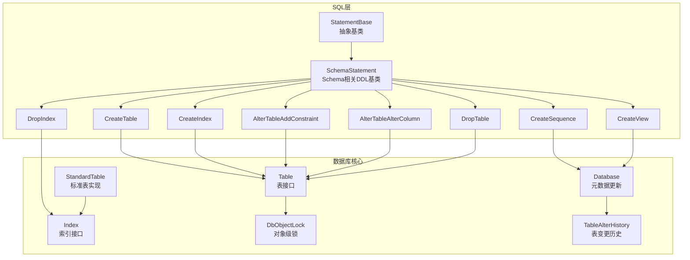
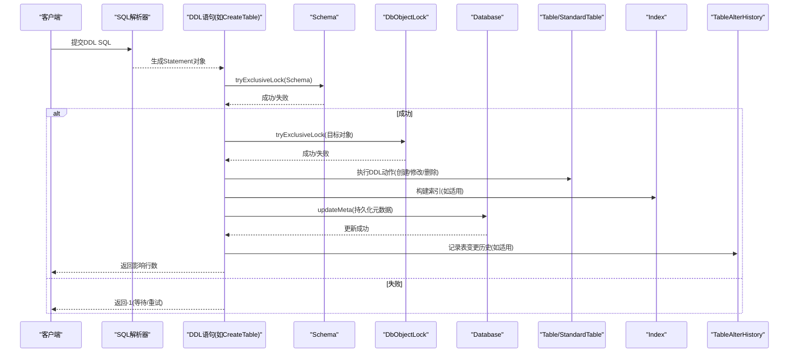
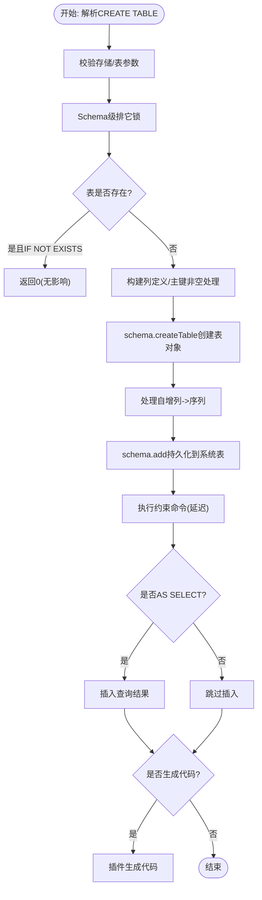
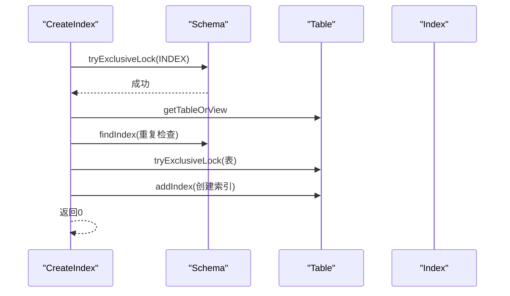
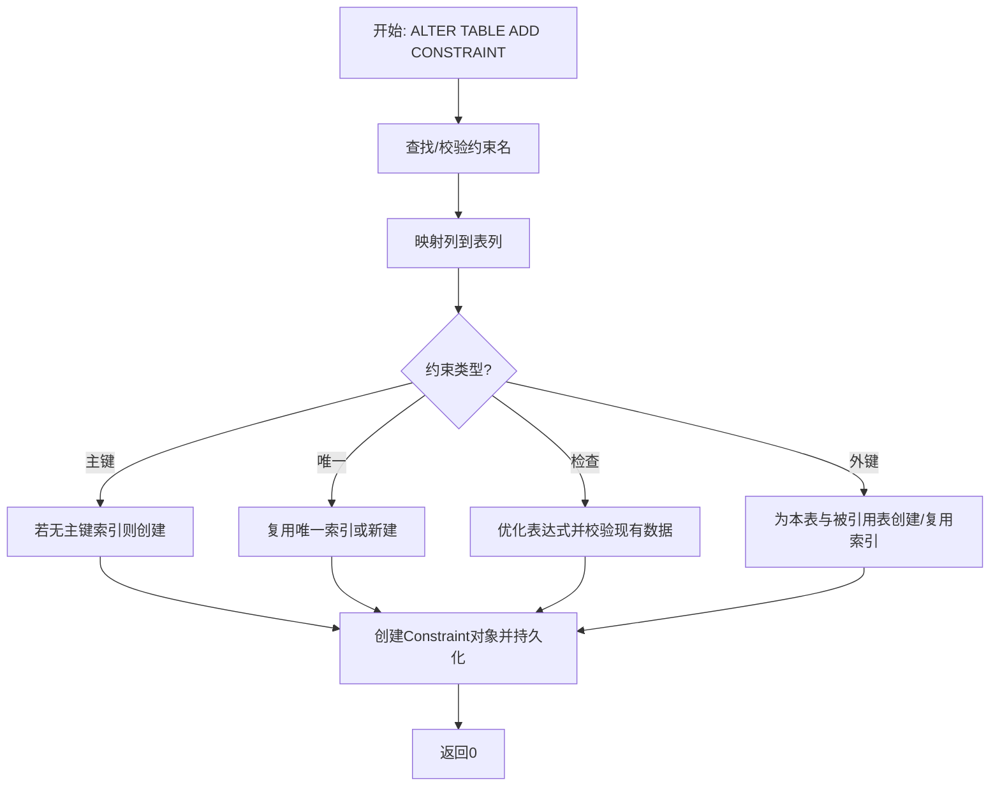
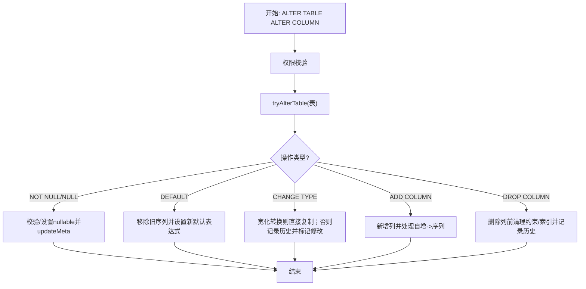
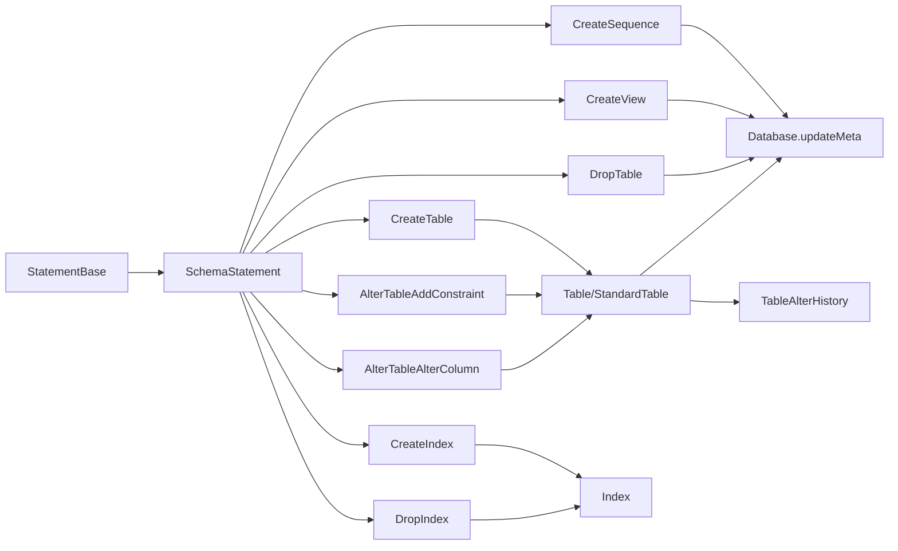

# DDL语句处理

<cite>
**本文引用的文件**
- [CreateTable.java](https://github.com/lealone/Lealone/blob/master/lealone-sql/src/main/java/com/lealone/sql/ddl/CreateTable.java)
- [CreateIndex.java](https://github.com/lealone/Lealone/blob/master/lealone-sql/src/main/java/com/lealone/sql/ddl/CreateIndex.java)
- [AlterTableAddConstraint.java](https://github.com/lealone/Lealone/blob/master/lealone-sql/src/main/java/com/lealone/sql/ddl/AlterTableAddConstraint.java)
- [CreateSequence.java](https://github.com/lealone/Lealone/blob/master/lealone-sql/src/main/java/com/lealone/sql/ddl/CreateSequence.java)
- [CreateView.java](https://github.com/lealone/Lealone/blob/master/lealone-sql/src/main/java/com/lealone/sql/ddl/CreateView.java)
- [AlterTableAlterColumn.java](https://github.com/lealone/Lealone/blob/master/lealone-sql/src/main/java/com/lealone/sql/ddl/AlterTableAlterColumn.java)
- [DropTable.java](https://github.com/lealone/Lealone/blob/master/lealone-sql/src/main/java/com/lealone/sql/ddl/DropTable.java)
- [DropIndex.java](https://github.com/lealone/Lealone/blob/master/lealone-sql/src/main/java/com/lealone/sql/ddl/DropIndex.java)
- [SchemaStatement.java](https://github.com/lealone/Lealone/blob/master/lealone-sql/src/main/java/com/lealone/sql/ddl/SchemaStatement.java)
- [StatementBase.java](https://github.com/lealone/Lealone/blob/master/lealone-sql/src/main/java/com/lealone/sql/StatementBase.java)
- [Table.java](https://github.com/lealone/Lealone/blob/master/lealone-db/src/main/java/com/lealone/db/table/Table.java)
- [StandardTable.java](https://github.com/lealone/Lealone/blob/master/lealone-db/src/main/java/com/lealone/db/table/StandardTable.java)
- [Index.java](https://github.com/lealone/Lealone/blob/master/lealone-db/src/main/java/com/lealone/db/index/Index.java)
- [DbObjectLock.java](https://github.com/lealone/Lealone/blob/master/lealone-db/src/main/java/com/lealone/db/lock/DbObjectLock.java)
- [Database.java](https://github.com/lealone/Lealone/blob/master/lealone-db/src/main/java/com/lealone/db/Database.java)
- [TableAlterHistory.java](https://github.com/lealone/Lealone/blob/master/lealone-db/src/main/java/com/lealone/db/table/TableAlterHistory.java)
- [OnlineDDLTest.java](https://github.com/lealone/Lealone/blob/master/lealone-test/src/test/java/com/lealone/test/sql/onlineddl/OnlineDDLTest.java)
- [TransactionalDDLTest.java](https://github.com/lealone/Lealone/blob/master/lealone-test/src/test/java/com/lealone/test/sql/transaction/TransactionalDDLTest.java)
</cite>

## 目录
1. [简介](#简介)
2. [项目结构与核心组件](#项目结构与核心组件)
3. [核心组件总览](#核心组件总览)
4. [架构概览](#架构概览)
5. [详细组件分析](#详细组件分析)
6. [依赖关系分析](#依赖关系分析)
7. [性能与并发特性](#性能与并发特性)
8. [故障排查指南](#故障排查指南)
9. [结论](#结论)
10. [附录：扩展自定义DDL语句](#附录扩展自定义ddl语句)

## 简介
本文件系统性梳理Lealone数据库中DDL（数据定义语言）语句的处理流程，覆盖CreateTable、CreateIndex、AlterTable（含添加约束、修改列）、CreateSequence、CreateView、DropTable、DropIndex等常见DDL操作。重点说明：
- 元数据变更与持久化路径
- 存储结构创建与索引构建
- 锁机制与事务边界
- 在线DDL（Online DDL）的实现思路与限制
- 约束创建、视图定义、序列生成等特性
- 从解析到执行完成的完整时序图与关键状态转换模型
- 如何扩展自定义DDL语句

## 项目结构与核心组件
DDL语句由SQL层的Statement类负责解析与执行，随后通过Schema与Table等数据库对象进行落地。核心目录与职责如下：
- lealone-sql：SQL解析与DDL语句实现（如CreateTable、CreateIndex、AlterTable等）
- lealone-db：数据库核心对象（Table、Index、Schema、Sequence、Database等）
- lealone-test：测试用例，包含OnlineDDL与事务DDL测试

图表来源
- [StatementBase.java](https://github.com/lealone/Lealone/blob/master/lealone-sql/src/main/java/com/lealone/sql/StatementBase.java#L1-L200)
- [SchemaStatement.java](https://github.com/lealone/Lealone/blob/master/lealone-sql/src/main/java/com/lealone/sql/ddl/SchemaStatement.java#L1-L47)
- [CreateTable.java](https://github.com/lealone/Lealone/blob/master/lealone-sql/src/main/java/com/lealone/sql/ddl/CreateTable.java#L1-L246)
- [CreateIndex.java](https://github.com/lealone/Lealone/blob/master/lealone-sql/src/main/java/com/lealone/sql/ddl/CreateIndex.java#L1-L120)
- [AlterTableAddConstraint.java](https://github.com/lealone/Lealone/blob/master/lealone-sql/src/main/java/com/lealone/sql/ddl/AlterTableAddConstraint.java#L1-L328)
- [AlterTableAlterColumn.java](https://github.com/lealone/Lealone/blob/master/lealone-sql/src/main/java/com/lealone/sql/ddl/AlterTableAlterColumn.java#L1-L347)
- [CreateSequence.java](https://github.com/lealone/Lealone/blob/master/lealone-sql/src/main/java/com/lealone/sql/ddl/CreateSequence.java#L1-L123)
- [CreateView.java](https://github.com/lealone/Lealone/blob/master/lealone-sql/src/main/java/com/lealone/sql/ddl/CreateView.java#L1-L137)
- [DropTable.java](https://github.com/lealone/Lealone/blob/master/lealone-sql/src/main/java/com/lealone/sql/ddl/DropTable.java#L1-L140)
- [DropIndex.java](https://github.com/lealone/Lealone/blob/master/lealone-sql/src/main/java/com/lealone/sql/ddl/DropIndex.java#L1-L89)
- [Table.java](https://github.com/lealone/Lealone/blob/master/lealone-db/src/main/java/com/lealone/db/table/Table.java#L1-L200)
- [StandardTable.java](https://github.com/lealone/Lealone/blob/master/lealone-db/src/main/java/com/lealone/db/table/StandardTable.java#L1-L200)
- [Index.java](https://github.com/lealone/Lealone/blob/master/lealone-db/src/main/java/com/lealone/db/index/Index.java#L1-L200)
- [DbObjectLock.java](https://github.com/lealone/Lealone/blob/master/lealone-db/src/main/java/com/lealone/db/lock/DbObjectLock.java#L1-L53)
- [Database.java](https://github.com/lealone/Lealone/blob/master/lealone-db/src/main/java/com/lealone/db/Database.java#L787-L828)
- [TableAlterHistory.java](https://github.com/lealone/Lealone/blob/master/lealone-db/src/main/java/com/lealone/db/table/TableAlterHistory.java#L1-L106)

章节来源
- [StatementBase.java](https://github.com/lealone/Lealone/blob/master/lealone-sql/src/main/java/com/lealone/sql/StatementBase.java#L1-L200)
- [SchemaStatement.java](https://github.com/lealone/Lealone/blob/master/lealone-sql/src/main/java/com/lealone/sql/ddl/SchemaStatement.java#L1-L47)
- [Table.java](https://github.com/lealone/Lealone/blob/master/lealone-db/src/main/java/com/lealone/db/table/Table.java#L1-L200)

## 核心组件总览
- StatementBase：所有SQL语句的抽象基类，负责参数、优先级、重编译检测、元数据修改ID等通用逻辑。
- SchemaStatement：面向Schema对象的DDL基类，统一进行系统模式校验与Schema级排它锁。
- Table/StandardTable：表抽象与标准实现，负责列、索引、触发器、序列、约束管理，以及元数据版本与变更历史。
- Index：索引接口，定义增删改查、成本估算、扫描能力等。
- DbObjectLock：数据库对象级锁，支持异步回调处理器。
- Database：元数据系统表的更新入口，维护修改元数据ID，确保查询计划失效与缓存刷新。
- TableAlterHistory：记录表结构变更历史，用于运行时重放以保持旧页面与新页面一致。

章节来源
- [StatementBase.java](https://github.com/lealone/Lealone/blob/master/lealone-sql/src/main/java/com/lealone/sql/StatementBase.java#L1-L200)
- [SchemaStatement.java](https://github.com/lealone/Lealone/blob/master/lealone-sql/src/main/java/com/lealone/sql/ddl/SchemaStatement.java#L1-L47)
- [Table.java](https://github.com/lealone/Lealone/blob/master/lealone-db/src/main/java/com/lealone/db/table/Table.java#L1-L200)
- [StandardTable.java](https://github.com/lealone/Lealone/blob/master/lealone-db/src/main/java/com/lealone/db/table/StandardTable.java#L1-L200)
- [Index.java](https://github.com/lealone/Lealone/blob/master/lealone-db/src/main/java/com/lealone/db/index/Index.java#L1-L200)
- [DbObjectLock.java](https://github.com/lealone/Lealone/blob/master/lealone-db/src/main/java/com/lealone/db/lock/DbObjectLock.java#L1-L53)
- [Database.java](https://github.com/lealone/Lealone/blob/master/lealone-db/src/main/java/com/lealone/db/Database.java#L787-L828)
- [TableAlterHistory.java](https://github.com/lealone/Lealone/blob/master/lealone-db/src/main/java/com/lealone/db/table/TableAlterHistory.java#L1-L106)

## 架构概览
DDL执行流程遵循“解析—权限与锁—执行—元数据持久化—清理”的闭环。SchemaStatement在进入具体DDL前先尝试Schema级排它锁，随后按需对目标对象（表、索引、序列、视图）申请对象级锁，最后通过Database.updateMeta持久化元数据。

图表来源
- [CreateTable.java](https://github.com/lealone/Lealone/blob/master/lealone-sql/src/main/java/com/lealone/sql/ddl/CreateTable.java#L142-L246)
- [CreateIndex.java](https://github.com/lealone/Lealone/blob/master/lealone-sql/src/main/java/com/lealone/sql/ddl/CreateIndex.java#L78-L118)
- [AlterTableAddConstraint.java](https://github.com/lealone/Lealone/blob/master/lealone-sql/src/main/java/com/lealone/sql/ddl/AlterTableAddConstraint.java#L142-L327)
- [AlterTableAlterColumn.java](https://github.com/lealone/Lealone/blob/master/lealone-sql/src/main/java/com/lealone/sql/ddl/AlterTableAlterColumn.java#L108-L347)
- [DropTable.java](https://github.com/lealone/Lealone/blob/master/lealone-sql/src/main/java/com/lealone/sql/ddl/DropTable.java#L128-L139)
- [DropIndex.java](https://github.com/lealone/Lealone/blob/master/lealone-sql/src/main/java/com/lealone/sql/ddl/DropIndex.java#L51-L87)
- [SchemaStatement.java](https://github.com/lealone/Lealone/blob/master/lealone-sql/src/main/java/com/lealone/sql/ddl/SchemaStatement.java#L42-L46)
- [DbObjectLock.java](https://github.com/lealone/Lealone/blob/master/lealone-db/src/main/java/com/lealone/db/lock/DbObjectLock.java#L32-L51)
- [Database.java](https://github.com/lealone/Lealone/blob/master/lealone-db/src/main/java/com/lealone/db/Database.java#L803-L828)
- [TableAlterHistory.java](https://github.com/lealone/Lealone/blob/master/lealone-db/src/main/java/com/lealone/db/table/TableAlterHistory.java#L88-L106)

## 详细组件分析

### CreateTable（创建表）
- 关键点
  - 参数校验：验证存储引擎参数与表设置参数是否被识别。
  - 排它锁：Schema级排它锁，防止并发DDL冲突；表对象级锁在需要时申请。
  - 列与主键：自动将主键列设为非空；支持从查询推导列定义。
  - 序列：自增列转换为序列；临时表支持ON COMMIT行为。
  - 约束命令：延迟执行约束命令，保证一致性。
  - 插入数据：当使用AS SELECT时，插入查询结果。
  - 代码生成：可选插件式代码生成。
- 元数据与持久化
  - 通过schema.createTable创建表对象，随后schema.add持久化到系统表；Database.updateMeta更新元数据。
- 并发与锁
  - Schema级排它锁；表对象级锁；异常回滚时移除已创建对象。

图表来源
- [CreateTable.java](https://github.com/lealone/Lealone/blob/master/lealone-sql/src/main/java/com/lealone/sql/ddl/CreateTable.java#L119-L246)

章节来源
- [CreateTable.java](https://github.com/lealone/Lealone/blob/master/lealone-sql/src/main/java/com/lealone/sql/ddl/CreateTable.java#L119-L246)
- [SchemaStatement.java](https://github.com/lealone/Lealone/blob/master/lealone-sql/src/main/java/com/lealone/sql/ddl/SchemaStatement.java#L42-L46)
- [Database.java](https://github.com/lealone/Lealone/blob/master/lealone-db/src/main/java/com/lealone/db/Database.java#L803-L828)

### CreateIndex（创建索引）
- 关键点
  - 支持主键、唯一、普通、哈希索引类型；自动命名唯一索引。
  - 对表申请对象级排它锁；检查重复索引名。
  - 将IndexColumn映射到表列；调用table.addIndex创建索引。
- 并发与锁
  - Schema级索引锁；表对象级锁；权限校验。

图表来源
- [CreateIndex.java](https://github.com/lealone/Lealone/blob/master/lealone-sql/src/main/java/com/lealone/sql/ddl/CreateIndex.java#L78-L118)

章节来源
- [CreateIndex.java](https://github.com/lealone/Lealone/blob/master/lealone-sql/src/main/java/com/lealone/sql/ddl/CreateIndex.java#L78-L118)
- [Table.java](https://github.com/lealone/Lealone/blob/master/lealone-db/src/main/java/com/lealone/db/table/Table.java#L148-L171)

### AlterTableAddConstraint（添加约束）
- 关键点
  - 支持主键、唯一、检查、外键约束；对外键自动选择或创建唯一索引。
  - 唯一索引复用策略：若现有索引满足唯一且包含约束列，则直接复用。
  - 外键引用表的主键列可省略，默认使用被引用表的主键列。
  - 异常回滚：创建过程中失败会移除已创建索引并释放唯一名。
- 并发与锁
  - Schema级约束锁；表对象级锁；权限校验。

图表来源
- [AlterTableAddConstraint.java](https://github.com/lealone/Lealone/blob/master/lealone-sql/src/main/java/com/lealone/sql/ddl/AlterTableAddConstraint.java#L142-L327)

章节来源
- [AlterTableAddConstraint.java](https://github.com/lealone/Lealone/blob/master/lealone-sql/src/main/java/com/lealone/sql/ddl/AlterTableAddConstraint.java#L142-L327)

### AlterTableAlterColumn（修改列）
- 关键点
  - 支持NOT NULL、NULL、DEFAULT、CHANGE TYPE、新增/删除列、选择性设置等。
  - 宽化类型转换（如精度扩大）无需全表复制；否则记录变更历史并标记表修改。
  - 删除列前清理约束与索引；新增列时处理自增列转序列。
  - 默认值表达式不能引用当前表（防循环依赖）。
- 并发与锁
  - 通过SchemaStatement.tryAlterTable获取Schema级排它锁；表对象级锁；Database.updateMeta持久化。

图表来源
- [AlterTableAlterColumn.java](https://github.com/lealone/Lealone/blob/master/lealone-sql/src/main/java/com/lealone/sql/ddl/AlterTableAlterColumn.java#L108-L347)
- [Database.java](https://github.com/lealone/Lealone/blob/master/lealone-db/src/main/java/com/lealone/db/Database.java#L803-L828)

章节来源
- [AlterTableAlterColumn.java](https://github.com/lealone/Lealone/blob/master/lealone-sql/src/main/java/com/lealone/sql/ddl/AlterTableAlterColumn.java#L108-L347)
- [SchemaStatement.java](https://github.com/lealone/Lealone/blob/master/lealone-sql/src/main/java/com/lealone/sql/ddl/SchemaStatement.java#L42-L46)
- [Database.java](https://github.com/lealone/Lealone/blob/master/lealone-db/src/main/java/com/lealone/db/Database.java#L803-L828)

### CreateSequence（创建序列）
- 关键点
  - 支持最小值、最大值、起始、增量、缓存大小、循环、事务性等。
  - 通过schema.add持久化序列对象。
- 并发与锁
  - Schema级序列锁；重复名检查。

章节来源
- [CreateSequence.java](https://github.com/lealone/Lealone/blob/master/lealone-sql/src/main/java/com/lealone/sql/ddl/CreateSequence.java#L87-L110)

### CreateView（创建视图）
- 关键点
  - 支持IF NOT EXISTS、OR REPLACE、强制替换等；不支持带参数的视图。
  - 使用系统会话构建TableView；首次创建加入Schema，替换时更新元数据。
- 并发与锁
  - Schema级表/视图锁；权限校验。

章节来源
- [CreateView.java](https://github.com/lealone/Lealone/blob/master/lealone-sql/src/main/java/com/lealone/sql/ddl/CreateView.java#L84-L136)

### DropTable（删除表）
- 关键点
  - 支持RESTRICT/CASCADE删除策略；检查是否可删除、是否有依赖视图等。
  - 删除后清理表变更历史记录。
- 并发与锁
  - Schema级表/视图锁；表对象级锁；逐个执行链式删除。

章节来源
- [DropTable.java](https://github.com/lealone/Lealone/blob/master/lealone-sql/src/main/java/com/lealone/sql/ddl/DropTable.java#L128-L139)
- [TableAlterHistory.java](https://github.com/lealone/Lealone/blob/master/lealone-db/src/main/java/com/lealone/db/table/TableAlterHistory.java#L97-L106)

### DropIndex（删除索引）
- 关键点
  - 检查索引归属：主键索引可删除；其他索引若被约束使用则报错。
  - 删除后标记表修改。
- 并发与锁
  - Schema级索引锁；权限校验。

章节来源
- [DropIndex.java](https://github.com/lealone/Lealone/blob/master/lealone-sql/src/main/java/com/lealone/sql/ddl/DropIndex.java#L51-L87)

## 依赖关系分析
- StatementBase与各DDL语句：所有DDL继承自StatementBase，共享参数、优先级、重编译检测与元数据修改ID。
- SchemaStatement与Schema：统一进行系统模式校验与Schema级排它锁。
- DDL语句与Table/Index/Sequence/View：DDL语句最终通过Schema与Table/Index等对象落地。
- Database.updateMeta：统一的元数据持久化入口，更新系统表并递增修改元数据ID，触发查询计划失效与缓存清理。
- TableAlterHistory：记录表结构变更历史，StandardTable在页面访问时按历史重放，保证旧页面与新页面一致。

图表来源
- [StatementBase.java](https://github.com/lealone/Lealone/blob/master/lealone-sql/src/main/java/com/lealone/sql/StatementBase.java#L1-L200)
- [SchemaStatement.java](https://github.com/lealone/Lealone/blob/master/lealone-sql/src/main/java/com/lealone/sql/ddl/SchemaStatement.java#L1-L47)
- [CreateTable.java](https://github.com/lealone/Lealone/blob/master/lealone-sql/src/main/java/com/lealone/sql/ddl/CreateTable.java#L142-L246)
- [CreateIndex.java](https://github.com/lealone/Lealone/blob/master/lealone-sql/src/main/java/com/lealone/sql/ddl/CreateIndex.java#L78-L118)
- [AlterTableAddConstraint.java](https://github.com/lealone/Lealone/blob/master/lealone-sql/src/main/java/com/lealone/sql/ddl/AlterTableAddConstraint.java#L142-L327)
- [AlterTableAlterColumn.java](https://github.com/lealone/Lealone/blob/master/lealone-sql/src/main/java/com/lealone/sql/ddl/AlterTableAlterColumn.java#L108-L347)
- [CreateSequence.java](https://github.com/lealone/Lealone/blob/master/lealone-sql/src/main/java/com/lealone/sql/ddl/CreateSequence.java#L87-L110)
- [CreateView.java](https://github.com/lealone/Lealone/blob/master/lealone-sql/src/main/java/com/lealone/sql/ddl/CreateView.java#L84-L136)
- [DropTable.java](https://github.com/lealone/Lealone/blob/master/lealone-sql/src/main/java/com/lealone/sql/ddl/DropTable.java#L128-L139)
- [DropIndex.java](https://github.com/lealone/Lealone/blob/master/lealone-sql/src/main/java/com/lealone/sql/ddl/DropIndex.java#L51-L87)
- [Database.java](https://github.com/lealone/Lealone/blob/master/lealone-db/src/main/java/com/lealone/db/Database.java#L803-L828)
- [TableAlterHistory.java](https://github.com/lealone/Lealone/blob/master/lealone-db/src/main/java/com/lealone/db/table/TableAlterHistory.java#L88-L106)

## 性能与并发特性
- 锁粒度
  - Schema级锁：避免同一时间多个DDL同时作用于同一Schema对象。
  - 对象级锁：表、索引、序列、视图等对象级排它锁，确保DDL期间的原子性。
- 事务边界
  - DDL语句通常在单事务内执行，失败时回滚已创建对象；部分语句（如CreateTable）在异常时移除临时对象。
- 元数据与缓存
  - Database.updateMeta更新系统表并递增修改元数据ID，触发查询计划失效与缓存清理。
- 在线DDL（Online DDL）
  - 标准表在页面访问时按变更历史重放，使旧页面与新页面一致，从而在不阻塞DML的前提下完成结构变更。
  - 测试用例OnlineDDLTest展示了在运行时添加约束、唯一键、视图等DDL操作，验证在线能力。
- 事务隔离级别
  - 支持READ UNCOMMITTED/READ COMMITTED/REPEATABLE READ/SERIALIZABLE等隔离级别，影响可见性与并发控制。

章节来源
- [DbObjectLock.java](https://github.com/lealone/Lealone/blob/master/lealone-db/src/main/java/com/lealone/db/lock/DbObjectLock.java#L32-L51)
- [Database.java](https://github.com/lealone/Lealone/blob/master/lealone-db/src/main/java/com/lealone/db/Database.java#L803-L828)
- [StandardTable.java](https://github.com/lealone/Lealone/blob/master/lealone-db/src/main/java/com/lealone/db/table/StandardTable.java#L805-L867)
- [OnlineDDLTest.java](https://github.com/lealone/Lealone/blob/master/lealone-test/src/test/java/com/lealone/test/sql/onlineddl/OnlineDDLTest.java#L1-L31)

## 故障排查指南
- 常见错误与定位
  - 表/索引/序列已存在：检查IF NOT EXISTS选项或确认对象名。
  - 权限不足：确认用户对表拥有ALL权限。
  - 主键重复：ALTER TABLE ADD CONSTRAINT PRIMARY KEY仅允许一个主键。
  - 列为空值：将列设为NOT NULL前需确保无空值。
  - 索引属于约束：删除索引前需先删除对应约束或主键。
  - 视图无效：ALTER TABLE DROP COLUMN后可能使视图失效，需重建视图。
- 回滚与清理
  - DDL失败时，会回滚已创建的对象（如索引、序列），并释放唯一名。
  - 删除表后清理其变更历史记录。
- 调试建议
  - 查看DDL执行日志与异常栈。
  - 使用EXPLAIN查看查询计划变化（元数据更新后自动失效）。
  - 在事务DDL测试中验证回滚与一致性。

章节来源
- [CreateIndex.java](https://github.com/lealone/Lealone/blob/master/lealone-sql/src/main/java/com/lealone/sql/ddl/CreateIndex.java#L104-L118)
- [AlterTableAddConstraint.java](https://github.com/lealone/Lealone/blob/master/lealone-sql/src/main/java/com/lealone/sql/ddl/AlterTableAddConstraint.java#L150-L158)
- [AlterTableAlterColumn.java](https://github.com/lealone/Lealone/blob/master/lealone-sql/src/main/java/com/lealone/sql/ddl/AlterTableAlterColumn.java#L261-L269)
- [DropIndex.java](https://github.com/lealone/Lealone/blob/master/lealone-sql/src/main/java/com/lealone/sql/ddl/DropIndex.java#L63-L85)
- [DropTable.java](https://github.com/lealone/Lealone/blob/master/lealone-sql/src/main/java/com/lealone/sql/ddl/DropTable.java#L112-L126)
- [TransactionalDDLTest.java](https://github.com/lealone/Lealone/blob/master/lealone-test/src/test/java/com/lealone/test/sql/transaction/TransactionalDDLTest.java#L20-L42)

## 结论
Lealone的DDL体系以SchemaStatement为统一入口，结合DbObjectLock与Database.updateMeta实现强一致的元数据持久化。StandardTable通过TableAlterHistory在页面访问时重放变更，达成在线DDL的效果。DDL语句覆盖了表、索引、约束、序列、视图等主要特性，并在并发与事务层面提供了完善的保护与回滚机制。对于扩展新的DDL语句，建议遵循SchemaStatement的锁与权限模型，使用Database.updateMeta进行元数据持久化，并在必要时记录TableAlterHistory以支持在线DDL。

## 附录：扩展自定义DDL语句
- 步骤
  - 继承StatementBase或SchemaStatement，实现update()方法。
  - 在update()中申请Schema级锁与对象级锁，执行业务逻辑。
  - 通过schema.add或Database.updateMeta持久化元数据。
  - 若涉及表结构变更，考虑记录TableAlterHistory以支持在线重放。
- 示例参考路径
  - [CreateTable.java](https://github.com/lealone/Lealone/blob/master/lealone-sql/src/main/java/com/lealone/sql/ddl/CreateTable.java#L142-L246)
  - [CreateIndex.java](https://github.com/lealone/Lealone/blob/master/lealone-sql/src/main/java/com/lealone/sql/ddl/CreateIndex.java#L78-L118)
  - [AlterTableAddConstraint.java](https://github.com/lealone/Lealone/blob/master/lealone-sql/src/main/java/com/lealone/sql/ddl/AlterTableAddConstraint.java#L142-L327)
  - [AlterTableAlterColumn.java](https://github.com/lealone/Lealone/blob/master/lealone-sql/src/main/java/com/lealone/sql/ddl/AlterTableAlterColumn.java#L108-L347)
  - [CreateSequence.java](https://github.com/lealone/Lealone/blob/master/lealone-sql/src/main/java/com/lealone/sql/ddl/CreateSequence.java#L87-L110)
  - [CreateView.java](https://github.com/lealone/Lealone/blob/master/lealone-sql/src/main/java/com/lealone/sql/ddl/CreateView.java#L84-L136)
  - [DropTable.java](https://github.com/lealone/Lealone/blob/master/lealone-sql/src/main/java/com/lealone/sql/ddl/DropTable.java#L128-L139)
  - [DropIndex.java](https://github.com/lealone/Lealone/blob/master/lealone-sql/src/main/java/com/lealone/sql/ddl/DropIndex.java#L51-L87)