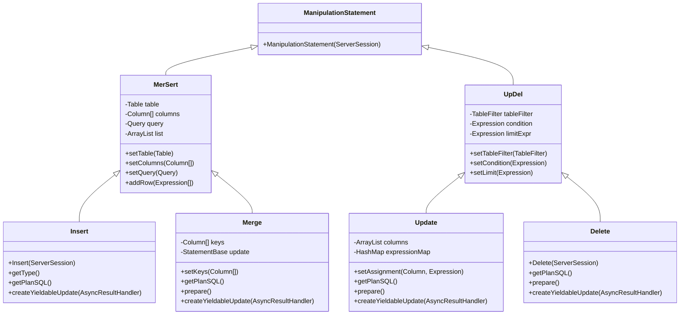
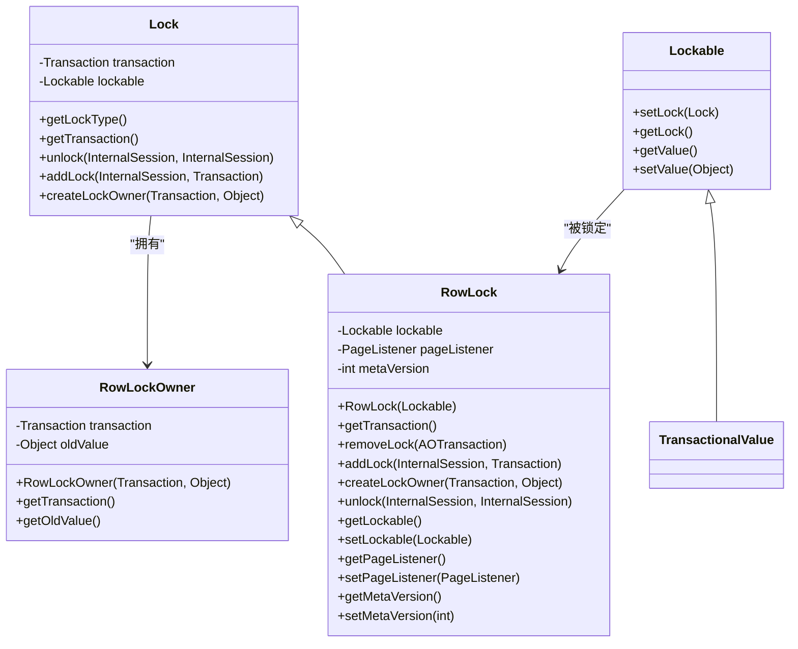
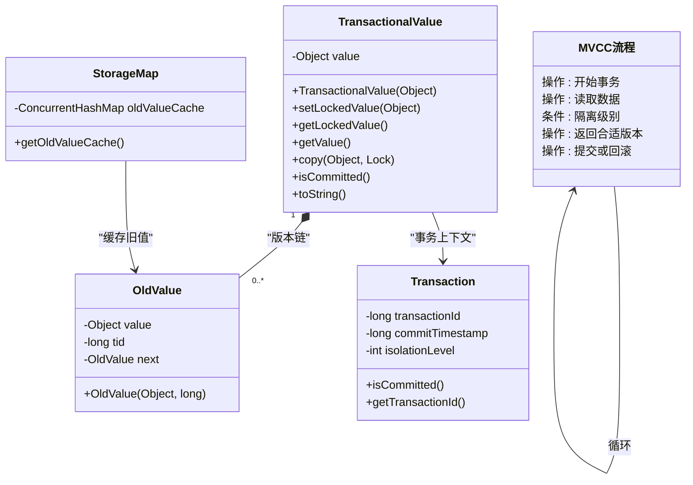
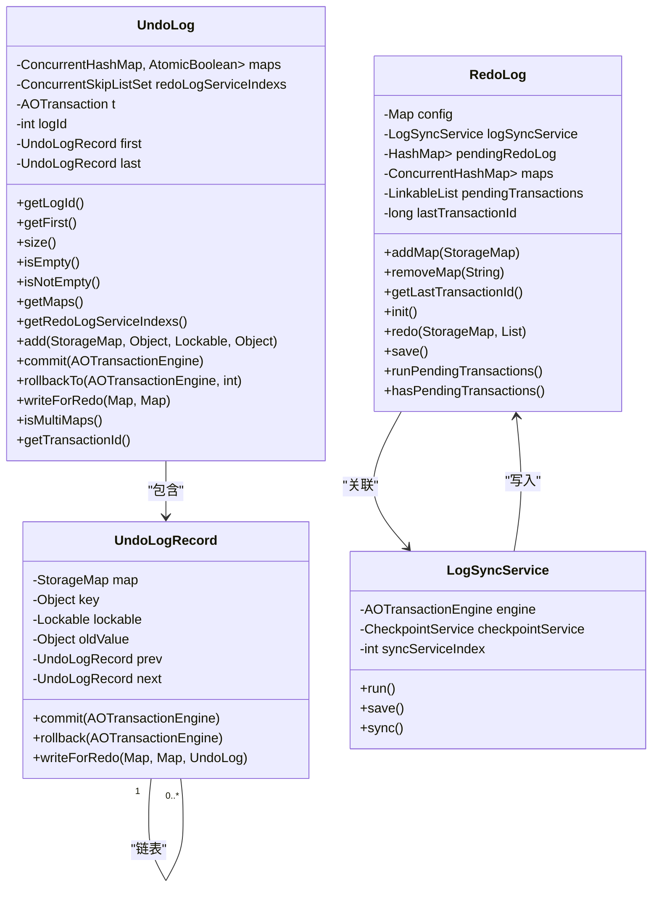
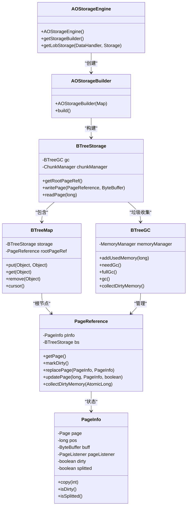
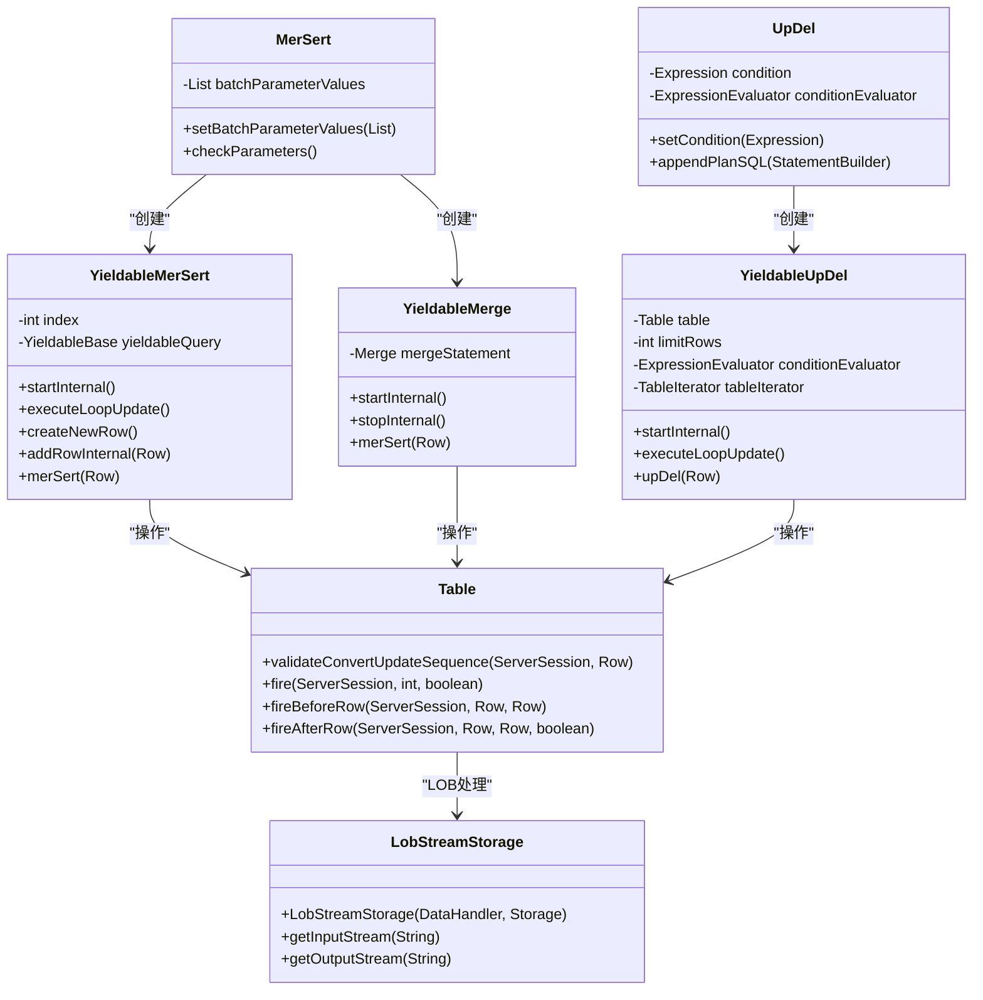
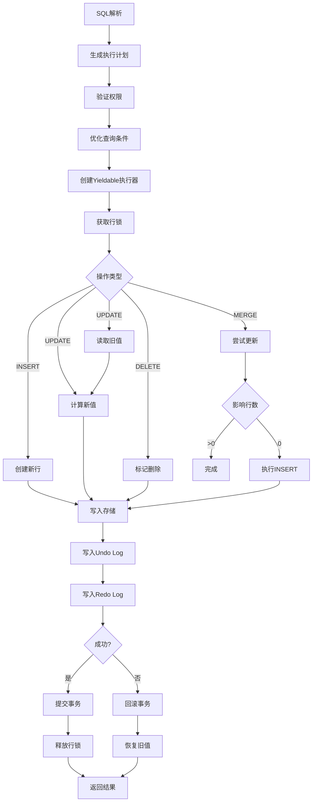
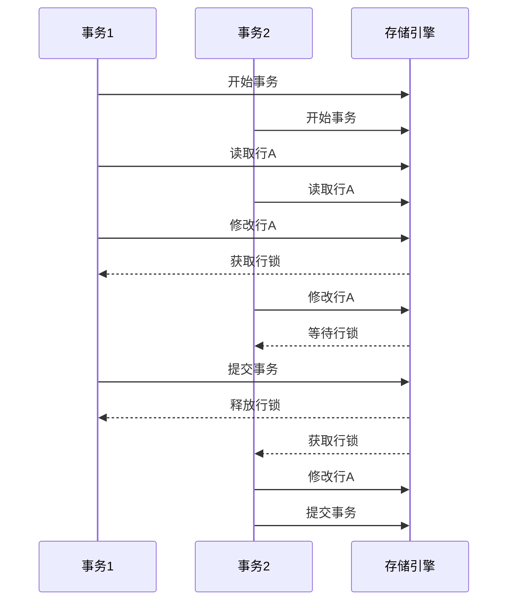
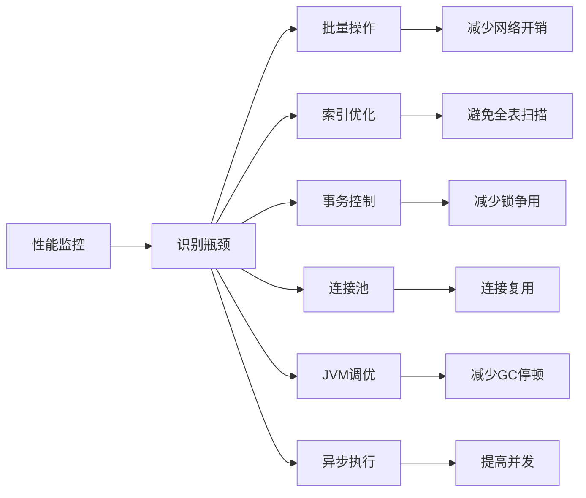

# DML语句处理

<cite>
**本文档引用的文件**   
- [Insert.java](file://lealone-sql/src/main/java/com/lealone/sql/dml/Insert.java)
- [Update.java](file://lealone-sql/src/main/java/com/lealone/sql/dml/Update.java)
- [Delete.java](file://lealone-sql/src/main/java/com/lealone/sql/dml/Delete.java)
- [Merge.java](file://lealone-sql/src/main/java/com/lealone/sql/dml/Merge.java)
- [UpDel.java](file://lealone-sql/src/main/java/com/lealone/sql/dml/UpDel.java)
- [MerSert.java](file://lealone-sql/src/main/java/com/lealone/sql/dml/MerSert.java)
- [ManipulationStatement.java](file://lealone-sql/src/main/java/com/lealone/sql/dml/ManipulationStatement.java)
- [YieldableLoopUpdateBase.java](file://lealone-sql/src/main/java/com/lealone/sql/executor/YieldableLoopUpdateBase.java)
- [AOTransactionEngine.java](file://lealone-aote/src/main/java/com/lealone/transaction/aote/AOTransactionEngine.java)
- [RedoLog.java](file://lealone-aote/src/main/java/com/lealone/transaction/aote/log/RedoLog.java)
- [UndoLog.java](file://lealone-aote/src/main/java/com/lealone/transaction/aote/log/UndoLog.java)
- [RowLock.java](file://lealone-aote/src/main/java/com/lealone/transaction/aote/lock/RowLock.java)
- [TransactionalValue.java](file://lealone-aote/src/main/java/com/lealone/transaction/aote/TransactionalValue.java)
- [AOStorageEngine.java](file://lealone-aose/src/main/java/com/lealone/storage/aose/AOStorageEngine.java)
- [BTreeGC.java](file://lealone-aose/src/main/java/com/lealone/storage/aose/btree/BTreeGC.java)
- [PageReference.java](file://lealone-aose/src/main/java/com/lealone/storage/aose/btree/page/PageReference.java)
- [CheckpointService.java](file://lealone-aote/src/main/java/com/lealone/transaction/aote/CheckpointService.java)
- [TransactionalDbObjects.java](file://lealone-db/src/main/java/com/lealone/db/TransactionalDbObjects.java)
</cite>

## 目录
1. [简介](#简介)
2. [DML语句执行机制](#dml语句执行机制)
3. [行级锁管理](#行级锁管理)
4. [多版本并发控制(MVCC)](#多版本并发控制mvcc)
5. [事务日志记录](#事务日志记录)
6. [存储引擎交互](#存储引擎交互)
7. [高级特性处理](#高级特性处理)
8. [DML执行流程图](#dml执行流程图)
9. [并发冲突检测与解决](#并发冲突检测与解决)
10. [性能优化技巧](#性能优化技巧)
11. [结论](#结论)

## 简介
本文档详细描述了Lealone数据库中DML（数据操作语言）语句的处理机制。DML语句包括INSERT、UPDATE、DELETE和MERGE等操作，这些操作是数据库系统中最基本的数据修改功能。文档深入分析了这些语句的执行机制，包括行级锁管理、多版本并发控制（MVCC）、事务日志记录（Redo/Undo Log）等核心机制。

文档还详细说明了DML操作如何与存储引擎交互，包括页加载、修改、脏页刷新等过程。同时阐述了批量操作、条件更新、自增列处理等高级特性。通过完整的流程图展示了从SQL解析到结果返回的各个阶段，并结合实际代码示例说明并发场景下的冲突检测与解决策略，以及性能优化技巧。

**本文档引用的文件**   
- [Insert.java](file://lealone-sql/src/main/java/com/lealone/sql/dml/Insert.java#L1-L74)
- [Update.java](file://lealone-sql/src/main/java/com/lealone/sql/dml/Update.java#L1-L180)
- [Delete.java](file://lealone-sql/src/main/java/com/lealone/sql/dml/Delete.java#L1-L97)
- [Merge.java](file://lealone-sql/src/main/java/com/lealone/sql/dml/Merge.java#L1-L163)

## DML语句执行机制
Lealone数据库中的DML语句执行机制基于一套分层的架构设计，从高层SQL语句到底层存储操作，经过多个处理阶段。DML语句的执行主要分为INSERT、UPDATE、DELETE和MERGE四种类型，它们共享一个共同的基类体系。

INSERT语句通过`Insert`类实现，继承自`MerSert`基类。当执行INSERT操作时，系统首先验证用户权限，然后触发INSERT触发器，最后将新行添加到表中。`Insert`类中的`YieldableInsert`内部类负责实际的执行逻辑，通过`addRowInternal`方法将行添加到存储中。

UPDATE语句由`Update`类实现，继承自`UpDel`基类。UPDATE操作首先设置要更新的列和表达式，然后在执行时创建新行对象，将旧行的值复制到新行，再根据更新表达式修改指定列的值。`YieldableUpdate`内部类中的`upDel`方法负责执行更新操作，通过`table.updateRow`方法完成行的更新。

DELETE语句由`Delete`类实现，同样继承自`UpDel`基类。DELETE操作通过`YieldableDelete`内部类执行，首先检查删除权限，然后触发DELETE触发器，最后调用`table.removeRow`方法从表中移除指定行。

MERGE语句由`Merge`类实现，继承自`MerSert`基类。MERGE操作是一种特殊的DML语句，它结合了INSERT和UPDATE的功能。当执行MERGE时，系统首先尝试更新匹配的行，如果未找到匹配行，则插入新行。`YieldableMerge`内部类中的`merSert`方法实现了这一逻辑，先执行UPDATE操作，如果影响行数为0，则执行INSERT操作。

所有DML语句都继承自`ManipulationStatement`基类，该基类提供了基本的语句执行框架。`YieldableLoopUpdateBase`类提供了循环更新的基础实现，支持在执行过程中暂停和恢复，这对于处理大量数据时的性能优化非常重要。

**图表来源**  
- [Insert.java](file://lealone-sql/src/main/java/com/lealone/sql/dml/Insert.java#L21-L74)
- [Update.java](file://lealone-sql/src/main/java/com/lealone/sql/dml/Update.java#L34-L180)
- [Delete.java](file://lealone-sql/src/main/java/com/lealone/sql/dml/Delete.java#L23-L97)
- [Merge.java](file://lealone-sql/src/main/java/com/lealone/sql/dml/Merge.java#L31-L163)
- [MerSert.java](file://lealone-sql/src/main/java/com/lealone/sql/dml/MerSert.java#L33-L323)
- [UpDel.java](file://lealone-sql/src/main/java/com/lealone/sql/dml/UpDel.java#L27-L184)
- [ManipulationStatement.java](file://lealone-sql/src/main/java/com/lealone/sql/dml/ManipulationStatement.java#L11-L17)

**本节来源**  
- [Insert.java](file://lealone-sql/src/main/java/com/lealone/sql/dml/Insert.java#L21-L74)
- [Update.java](file://lealone-sql/src/main/java/com/lealone/sql/dml/Update.java#L34-L180)
- [Delete.java](file://lealone-sql/src/main/java/com/lealone/sql/dml/Delete.java#L23-L97)
- [Merge.java](file://lealone-sql/src/main/java/com/lealone/sql/dml/Merge.java#L31-L163)

## 行级锁管理
Lealone数据库的行级锁管理机制基于`RowLock`类实现，该类继承自通用的`Lock`基类。行级锁是实现事务隔离和并发控制的关键组件，确保多个事务在访问同一行数据时不会产生冲突。

`RowLock`类的核心是`Lockable`接口的实现，每个被锁定的行都关联一个`Lockable`对象。当事务需要修改某一行时，会创建一个`RowLock`实例并将其与该行的`Lockable`对象关联。`RowLock`类提供了`addLock`和`removeLock`方法来管理锁的获取和释放。

在事务提交或回滚时，`RowLock`的`unlock`方法会被调用，将锁释放给其他等待的事务。`unlock`方法首先检查`PageListener`是否存在，如果存在则将锁设置回页面监听器，否则将锁设置为null以释放内存。这种设计确保了锁的正确传递和内存的有效管理。

行级锁的获取过程是原子性的，通过CAS（Compare-And-Swap）操作实现。当多个事务同时尝试获取同一行的锁时，只有一个事务能够成功，其他事务会被阻塞或返回失败。这种机制避免了死锁的发生，同时保证了数据的一致性。

`RowLockOwner`类用于表示持有锁的事务，它包含了事务引用和旧值信息。当事务回滚时，系统可以使用旧值将数据恢复到之前的状态。这种设计支持了MVCC（多版本并发控制）机制，允许多个事务同时读取同一行的不同版本。

行级锁还支持锁升级和降级。当事务需要对多个行进行操作时，系统会自动管理锁的粒度，避免过度锁定导致的性能问题。锁的超时机制也已实现，防止事务长时间持有锁导致系统阻塞。

**图表来源**  
- [RowLock.java](file://lealone-aote/src/main/java/com/lealone/transaction/aote/lock/RowLock.java#L16-L104)
- [RowLockOwner.java](file://lealone-aote/src/main/java/com/lealone/transaction/aote/lock/RowLockOwner.java)
- [Lock.java](file://lealone-db/src/main/java/com/lealone/db/lock/Lock.java)
- [Lockable.java](file://lealone-db/src/main/java/com/lealone/db/lock/Lockable.java)
- [TransactionalValue.java](file://lealone-aote/src/main/java/com/lealone/transaction/aote/TransactionalValue.java)

**本节来源**  
- [RowLock.java](file://lealone-aote/src/main/java/com/lealone/transaction/aote/lock/RowLock.java#L16-L104)

## 多版本并发控制(MVCC)
Lealone数据库的多版本并发控制（MVCC）机制通过`TransactionalValue`类实现，该类是MVCC的核心组件。MVCC允许多个事务同时读取同一数据的不同版本，从而提高并发性能，避免读写冲突。

`TransactionalValue`类实现了`Lockable`接口，每个存储的值都被包装在`TransactionalValue`对象中。该类包含事务ID（tid）、键（key）和值（value）等属性，用于跟踪值的版本信息。当事务修改数据时，不会直接覆盖旧值，而是创建一个新的版本。

MVCC机制支持四种隔离级别：READ_UNCOMMITTED、READ_COMMITTED、REPEATABLE_READ和SERIALIZABLE。不同隔离级别下，事务能看到的数据版本不同。例如，在READ_COMMITTED级别下，事务只能看到已提交的数据；而在REPEATABLE_READ级别下，事务在整个执行期间看到的数据版本保持一致。

`TransactionalValue`类提供了`getValueForTransaction`静态方法，根据当前事务和隔离级别确定应该返回哪个版本的值。该方法会检查事务的提交时间戳和隔离级别，决定是返回当前值、旧值还是SIGHTLESS（不可见）。

对于REPEATABLE_READ和SERIALIZABLE隔离级别，系统维护了一个旧值链表（OldValue链表）。每个`TransactionalValue`对象可能关联一个或多个`OldValue`对象，形成版本链。当事务需要读取历史版本时，可以从链表中找到合适的版本。

MVCC机制还支持快照读取。当事务开始时，系统会记录当前的最大事务ID作为快照点。在此之后，事务只能看到快照点之前已提交的数据，这保证了可重复读的语义。

垃圾回收机制定期清理不再需要的旧版本。`CheckpointService`会检查当前活动的事务，确定哪些旧版本可以安全删除。只有当所有可能需要该版本的事务都完成后，对应的旧版本才会被清理。

**图表来源**  
- [TransactionalValue.java](file://lealone-aote/src/main/java/com/lealone/transaction/aote/TransactionalValue.java#L35-L206)
- [OldValue.java](file://lealone-aote/src/main/java/com/lealone/transaction/aote/TransactionalValue.java)
- [Transaction.java](file://lealone-sci/src/main/java/com/lealone/transaction/Transaction.java)
- [StorageMap.java](file://lealone-sci/src/main/java/com/lealone/storage/StorageMap.java)
- [CheckpointService.java](file://lealone-aote/src/main/java/com/lealone/transaction/aote/CheckpointService.java#L161-L195)

**本节来源**  
- [TransactionalValue.java](file://lealone-aote/src/main/java/com/lealone/transaction/aote/TransactionalValue.java#L35-L206)
- [CheckpointService.java](file://lealone-aote/src/main/java/com/lealone/transaction/aote/CheckpointService.java#L161-L195)

## 事务日志记录
Lealone数据库的事务日志记录机制由`RedoLog`和`UndoLog`两个核心组件构成，它们共同确保了事务的持久性和原子性。日志系统采用异步写入和批量提交的策略，以提高性能并保证数据安全。

`RedoLog`（重做日志）负责记录事务的修改操作，确保在系统崩溃后能够恢复未持久化的数据。`RedoLog`类维护一个`pendingRedoLog`映射，存储待写入的键值对缓冲区。当日志缓冲区达到一定大小或满足时间条件时，系统会将日志批量写入磁盘。

`RedoLog`的写入过程是分阶段的：首先将修改操作写入内存缓冲区，然后由`LogSyncService`定期将缓冲区内容同步到磁盘。这种设计减少了磁盘I/O次数，提高了写入性能。`RedoLog`还支持多线程并行写入，通过`logSyncServices`数组实现负载均衡。

`UndoLog`（撤销日志）负责记录事务修改前的旧值，支持事务回滚操作。每个事务都有一个独立的`UndoLog`实例，其中包含`first`和`last`指针，形成一个双向链表结构。当事务执行修改操作时，旧值会被添加到`UndoLog`链表中。

`UndoLog`的提交过程是顺序的，从`first`开始遍历链表，将每个修改操作应用到存储中。回滚过程则从`last`开始，逆序执行撤销操作。`UndoLog`还维护了`maps`映射，记录涉及的存储映射，以及`redoLogServiceIndexs`集合，跟踪需要同步的redo日志服务。

日志系统的恢复机制在数据库启动时执行。系统会读取redo日志文件，按事务ID顺序重放所有未完成的事务。对于每个存储映射，系统会调用`redo`方法，将日志中的修改应用到数据文件中。

**图表来源**  
- [RedoLog.java](file://lealone-aote/src/main/java/com/lealone/transaction/aote/log/RedoLog.java#L40-L453)
- [UndoLog.java](file://lealone-aote/src/main/java/com/lealone/transaction/aote/log/UndoLog.java#L23-L144)
- [UndoLogRecord.java](file://lealone-aote/src/main/java/com/lealone/transaction/aote/log/UndoLogRecord.java)
- [LogSyncService.java](file://lealone-aote/src/main/java/com/lealone/transaction/aote/log/LogSyncService.java)
- [AOTransactionEngine.java](file://lealone-aote/src/main/java/com/lealone/transaction/aote/AOTransactionEngine.java#L32-L311)

**本节来源**  
- [RedoLog.java](file://lealone-aote/src/main/java/com/lealone/transaction/aote/log/RedoLog.java#L40-L453)
- [UndoLog.java](file://lealone-aote/src/main/java/com/lealone/transaction/aote/log/UndoLog.java#L23-L144)

## 存储引擎交互
Lealone数据库的DML操作与存储引擎的交互通过`AOStorageEngine`和`BTreeStorage`等组件实现。存储引擎负责数据的物理存储和检索，DML操作通过存储引擎提供的API进行数据的增删改查。

`AOStorageEngine`是异步自适应优化存储引擎的实现，它继承自`StorageEngineBase`基类。该引擎通过`getStorageBuilder`方法返回`AOStorageBuilder`实例，用于创建和配置存储实例。存储引擎还提供`getLobStorage`方法，用于获取大对象存储的实现。

B树存储结构是Lealone数据库的核心数据结构，由`BTreeStorage`类实现。B树提供了高效的键值对存储和检索能力，支持范围查询和有序遍历。`BTreeMap`类封装了B树的具体操作，包括插入、删除、更新和查找等。

页管理是存储引擎的关键组件，由`PageReference`和`PageInfo`类实现。每个页面都有一个`PageReference`对象，用于跟踪页面的状态和位置。`PageInfo`类包含页面的元数据，如是否脏页、页面位置、缓冲区等。

脏页刷新机制通过`BTreeGC`（B树垃圾收集器）实现。当页面被修改时，`PageReference`的`markDirtyPage1`方法会被调用，将页面标记为脏页。`BTreeGC`定期检查脏页，并将它们写入磁盘。`collectDirtyMemory`方法用于收集所有脏页的内存使用量。

页的生命周期管理采用CAS（Compare-And-Swap）算法，确保多线程环境下的线程安全。`PageReference`的`replacePage`方法使用原子更新器来替换页面引用，避免了显式锁的开销。这种设计提高了并发性能，减少了锁争用。

存储引擎还支持页面的分割和合并。当页面大小超过阈值时，会触发分割操作，将页面分成两个较小的页面。当页面利用率过低时，会触发合并操作，将相邻的页面合并。这些操作由`BTreeGC`的`gc`方法协调执行。

**图表来源**  
- [AOStorageEngine.java](file://lealone-aose/src/main/java/com/lealone/storage/aose/AOStorageEngine.java#L15-L33)
- [BTreeStorage.java](file://lealone-aose/src/main/java/com/lealone/storage/aose/btree/BTreeStorage.java)
- [BTreeMap.java](file://lealone-aose/src/main/java/com/lealone/storage/aose/btree/BTreeMap.java)
- [PageReference.java](file://lealone-aose/src/main/java/com/lealone/storage/aose/btree/page/PageReference.java#L278-L349)
- [PageInfo.java](file://lealone-aose/src/main/java/com/lealone/storage/aose/btree/page/PageInfo.java)
- [BTreeGC.java](file://lealone-aose/src/main/java/com/lealone/storage/aose/btree/BTreeGC.java#L44-L94)

**本节来源**  
- [AOStorageEngine.java](file://lealone-aose/src/main/java/com/lealone/storage/aose/AOStorageEngine.java#L15-L33)
- [PageReference.java](file://lealone-aose/src/main/java/com/lealone/storage/aose/btree/page/PageReference.java#L278-L349)
- [BTreeGC.java](file://lealone-aose/src/main/java/com/lealone/storage/aose/btree/BTreeGC.java#L44-L94)

## 高级特性处理
Lealone数据库支持多种DML高级特性，包括批量操作、条件更新和自增列处理等。这些特性通过专门的机制实现，以提高性能和功能完整性。

批量操作通过`setBatchParameterValues`方法实现，允许在单个语句中执行多个相同操作。当设置批量参数值时，系统会创建一个参数值列表，在执行时逐个应用。`YieldableMerSert`类中的`executeLoopUpdate0`方法处理批量执行逻辑，通过循环调用`merSert`方法完成所有操作。

条件更新通过`condition`表达式实现，支持复杂的WHERE子句。`UpDel`基类中的`conditionEvaluator`字段用于评估条件表达式，决定是否对当前行执行操作。`ExpressionInterpreter`类负责解释和执行条件表达式，支持各种比较操作和逻辑运算。

自增列处理由`table.validateConvertUpdateSequence`方法实现。当插入新行时，如果自增列的值为null，系统会自动生成下一个序列值。序列值的生成是原子性的，通过CAS操作确保线程安全。`Sequence`类管理序列的状态，包括当前值和增量。

MERGE语句的特殊处理在`YieldableMerge`类中实现。MERGE操作首先尝试更新匹配的行，如果影响行数为0，则执行INSERT操作。这种"先更新后插入"的策略避免了重复键错误，提高了执行效率。

触发器支持在DML操作前后执行自定义逻辑。`table.fire`方法在操作开始和结束时调用，触发相应的触发器。`fireBeforeRow`和`fireAfterRow`方法分别在修改前和修改后执行，支持INSTEAD OF触发器的特殊处理。

大对象（LOB）处理通过专门的`LobStreamStorage`实现。当涉及LOB字段时，系统会临时切换`DataHandler`，确保LOB数据的正确读写。`YieldableLoopUpdateBase`中的`executeLoopUpdate`方法处理LOB字段的特殊逻辑。

**图表来源**  
- [MerSert.java](file://lealone-sql/src/main/java/com/lealone/sql/dml/MerSert.java#L39-L323)
- [UpDel.java](file://lealone-sql/src/main/java/com/lealone/sql/dml/UpDel.java#L29-L184)
- [YieldableMerSert.java](file://lealone-sql/src/main/java/com/lealone/sql/dml/MerSert.java#L168-L323)
- [YieldableUpDel.java](file://lealone-sql/src/main/java/com/lealone/sql/dml/UpDel.java#L81-L184)
- [YieldableMerge.java](file://lealone-sql/src/main/java/com/lealone/sql/dml/Merge.java#L109-L162)
- [Table.java](file://lealone-db/src/main/java/com/lealone/db/table/Table.java)
- [LobStreamStorage.java](file://lealone-aose/src/main/java/com/lealone/storage/aose/lob/LobStreamStorage.java)

**本节来源**  
- [MerSert.java](file://lealone-sql/src/main/java/com/lealone/sql/dml/MerSert.java#L39-L323)
- [UpDel.java](file://lealone-sql/src/main/java/com/lealone/sql/dml/UpDel.java#L29-L184)
- [Merge.java](file://lealone-sql/src/main/java/com/lealone/sql/dml/Merge.java#L109-L162)

## DML执行流程图
Lealone数据库的DML语句执行流程从SQL解析开始，经过多个处理阶段，最终完成数据修改并返回结果。整个流程可以分为以下几个主要阶段：

首先是SQL解析和计划生成阶段。SQL解析器将原始SQL语句解析成语法树，然后生成执行计划。对于INSERT语句，生成"INSERT INTO"计划；对于UPDATE语句，生成"UPDATE...SET"计划；对于DELETE语句，生成"DELETE FROM"计划；对于MERGE语句，生成"MERGE INTO...KEY"计划。

接下来是准备阶段。系统验证用户权限，检查表和列的存在性，优化查询条件。`prepare`方法负责这一阶段的工作，它会映射列引用，优化表达式，并创建索引条件。对于批量操作，还会设置批量参数值。

然后是执行阶段。系统创建相应的`Yieldable`执行器，如`YieldableInsert`、`YieldableUpdate`等。执行器负责实际的行级操作，包括获取行锁、读取旧值、计算新值、写入新值等。执行过程支持暂停和恢复，以避免长时间占用CPU。

在执行过程中，系统会记录事务日志。修改操作首先写入undo log，然后修改内存中的数据，最后将redo log写入磁盘。这种顺序确保了事务的原子性和持久性。

最后是提交阶段。如果所有操作都成功，事务提交，释放行锁，清理undo log。如果发生错误，事务回滚，使用undo log恢复数据到之前的状态。

**图表来源**  
- [Insert.java](file://lealone-sql/src/main/java/com/lealone/sql/dml/Insert.java#L21-L74)
- [Update.java](file://lealone-sql/src/main/java/com/lealone/sql/dml/Update.java#L34-L180)
- [Delete.java](file://lealone-sql/src/main/java/com/lealone/sql/dml/Delete.java#L23-L97)
- [Merge.java](file://lealone-sql/src/main/java/com/lealone/sql/dml/Merge.java#L31-L163)
- [MerSert.java](file://lealone-sql/src/main/java/com/lealone/sql/dml/MerSert.java#L33-L323)
- [UpDel.java](file://lealone-sql/src/main/java/com/lealone/sql/dml/UpDel.java#L27-L184)

**本节来源**  
- [Insert.java](file://lealone-sql/src/main/java/com/lealone/sql/dml/Insert.java#L21-L74)
- [Update.java](file://lealone-sql/src/main/java/com/lealone/sql/dml/Update.java#L34-L180)
- [Delete.java](file://lealone-sql/src/main/java/com/lealone/sql/dml/Delete.java#L23-L97)
- [Merge.java](file://lealone-sql/src/main/java/com/lealone/sql/dml/Merge.java#L31-L163)

## 并发冲突检测与解决
Lealone数据库的并发冲突检测与解决机制基于MVCC和行级锁的组合实现。系统通过事务ID、版本号和锁状态来检测和解决并发冲突。

冲突检测主要发生在数据修改时。当事务尝试修改一行数据时，系统会检查该行的当前状态。如果行被其他事务锁定，当前事务会被阻塞或返回失败。`tryLockRow`方法负责行锁的获取，返回值表示锁获取的结果：1表示成功，0表示被其他事务锁定，-1表示发生异常。

对于MVCC场景，系统通过版本比较来检测冲突。`TransactionalValue.getValueForTransaction`方法会比较当前事务的ID和数据版本的事务ID，决定是否允许读取。在可重复读隔离级别下，如果其他事务修改了已读取的数据，当前事务会看到旧版本，避免了不可重复读问题。

写-写冲突通过行级锁解决。当两个事务同时尝试修改同一行时，先获取锁的事务可以继续执行，后到的事务会被阻塞。`RowLock`类的`addLock`方法使用CAS操作确保锁获取的原子性。

读-写冲突通过MVCC解决。读操作不需要获取行级锁，可以直接读取合适版本的数据。写操作会创建新版本，不影响正在进行的读操作。这种设计实现了读写不互斥，提高了并发性能。

系统还实现了死锁检测机制。当事务等待锁超时时，系统会检查是否存在循环等待，如果发现死锁，会选择一个事务进行回滚，解除死锁状态。

**图表来源**  
- [RowLock.java](file://lealone-aote/src/main/java/com/lealone/transaction/aote/lock/RowLock.java#L16-L104)
- [TransactionalValue.java](file://lealone-aote/src/main/java/com/lealone/transaction/aote/TransactionalValue.java#L35-L206)
- [UpDel.java](file://lealone-sql/src/main/java/com/lealone/sql/dml/UpDel.java#L164-L169)
- [AOTransactionEngine.java](file://lealone-aote/src/main/java/com/lealone/transaction/aote/AOTransactionEngine.java#L203-L225)

**本节来源**  
- [RowLock.java](file://lealone-aote/src/main/java/com/lealone/transaction/aote/lock/RowLock.java#L16-L104)
- [TransactionalValue.java](file://lealone-aote/src/main/java/com/lealone/transaction/aote/TransactionalValue.java#L35-L206)

## 性能优化技巧
Lealone数据库提供了多种DML性能优化技巧，通过合理的配置和使用方式可以显著提升系统性能。

批量操作是最重要的性能优化手段。通过`addBatch`和`executeBatch`方法，可以将多个DML操作合并为一次网络传输和事务处理。这减少了网络开销和事务管理开销，显著提高了吞吐量。

索引优化对于UPDATE和DELETE操作至关重要。为WHERE条件中的列创建合适的索引，可以避免全表扫描，快速定位目标行。复合索引的使用需要根据查询模式合理设计列顺序。

事务大小控制也很重要。过大的事务会占用大量内存和锁资源，增加冲突概率。建议将大事务拆分为多个小事务，或者使用流式处理方式。

连接池配置影响并发性能。合理的连接池大小可以平衡资源利用率和并发能力。连接复用减少了连接建立的开销，提高了响应速度。

JVM参数调优对整体性能有显著影响。合理的堆内存大小、GC策略选择可以减少停顿时间，提高吞吐量。直接内存的使用可以减少数据复制开销。

异步执行模式适合高并发场景。通过异步API，可以在等待I/O时处理其他任务，提高资源利用率。`AsyncResultHandler`接口支持非阻塞操作，避免线程阻塞。

**图表来源**  
- [MerSert.java](file://lealone-sql/src/main/java/com/lealone/sql/dml/MerSert.java#L76-L78)
- [UpDel.java](file://lealone-sql/src/main/java/com/lealone/sql/dml/UpDel.java#L84-L89)
- [AOTransactionEngine.java](file://lealone-aote/src/main/java/com/lealone/transaction/aote/AOTransactionEngine.java#L203-L225)
- [YieldableLoopUpdateBase.java](file://lealone-sql/src/main/java/com/lealone/sql/executor/YieldableLoopUpdateBase.java#L27-L36)

**本节来源**  
- [MerSert.java](file://lealone-sql/src/main/java/com/lealone/sql/dml/MerSert.java#L76-L78)
- [UpDel.java](file://lealone-sql/src/main/java/com/lealone/sql/dml/UpDel.java#L84-L89)

## 结论
Lealone数据库的DML语句处理机制是一个复杂而高效的系统，集成了行级锁管理、多版本并发控制、事务日志记录等多种先进技术。通过分层的架构设计和精心的算法实现，系统在保证数据一致性和事务隔离性的同时，提供了出色的并发性能。

核心的MVCC机制通过`TransactionalValue`类实现，支持四种隔离级别，允许多个事务同时读取同一数据的不同版本。行级锁管理通过`RowLock`类实现，确保写操作的互斥性。事务日志系统由`RedoLog`和`UndoLog`组成，保证了事务的持久性和原子性。

存储引擎交互通过`AOStorageEngine`和`BTreeStorage`实现，采用B树结构提供高效的键值存储。页管理机制使用CAS算法确保线程安全，脏页刷新由`BTreeGC`协调执行。这些组件共同构成了高性能的存储基础。

高级特性如批量操作、条件更新、MERGE语句等都得到了完善的实现。并发冲突检测与解决机制有效处理了各种竞争情况，性能优化技巧为实际应用提供了指导。

总体而言，Lealone数据库的DML处理机制在正确性、性能和功能完整性之间取得了良好的平衡，为构建高并发、高可用的数据库应用提供了坚实的基础。