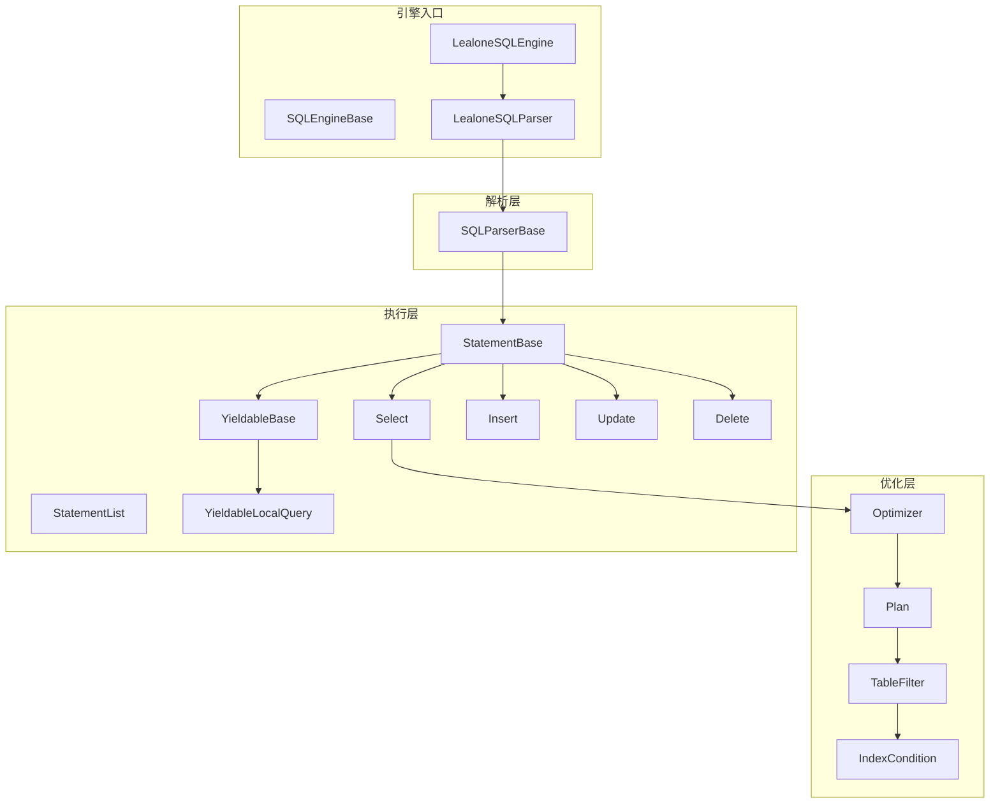
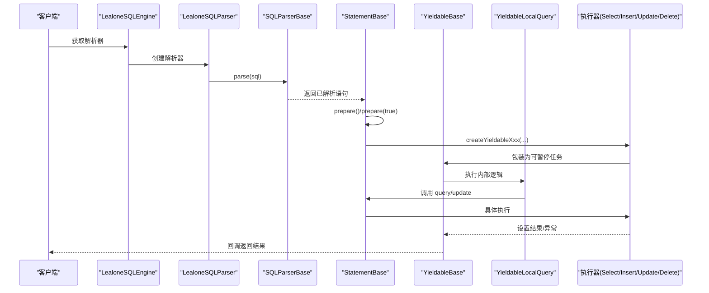
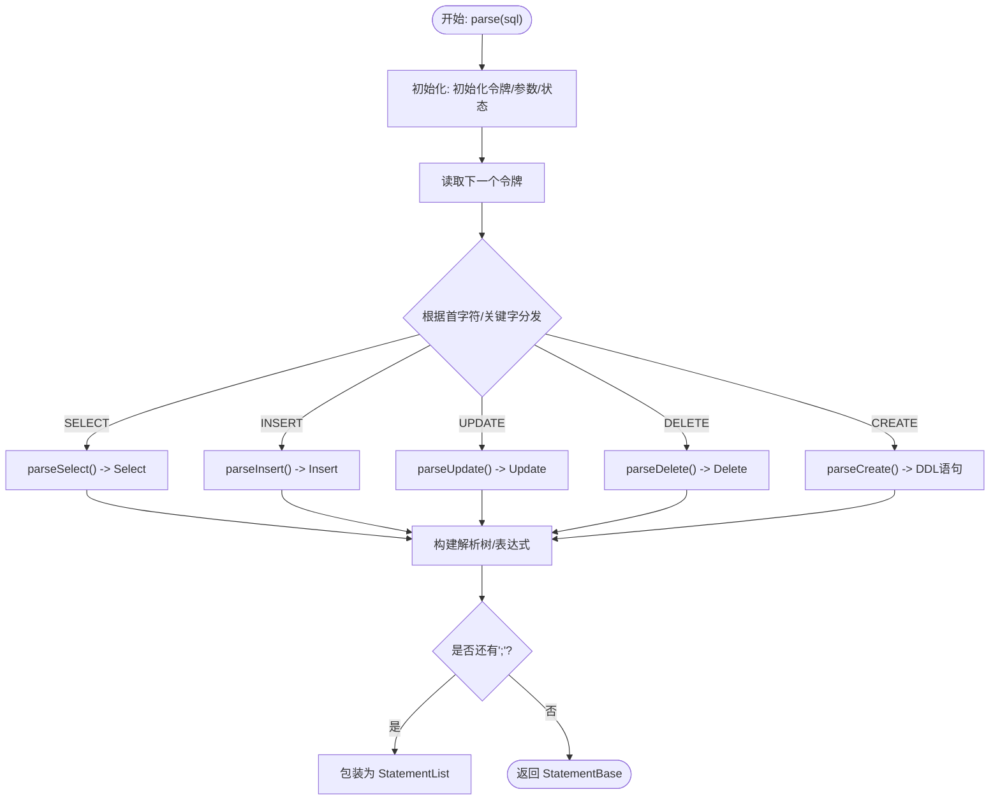
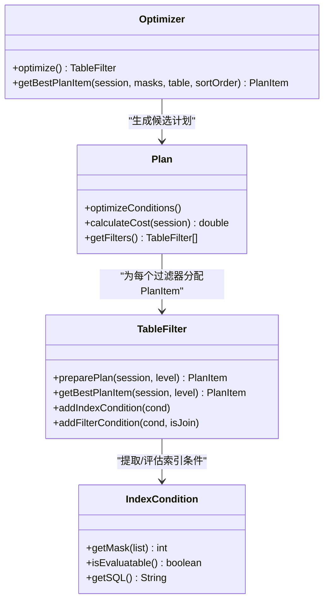
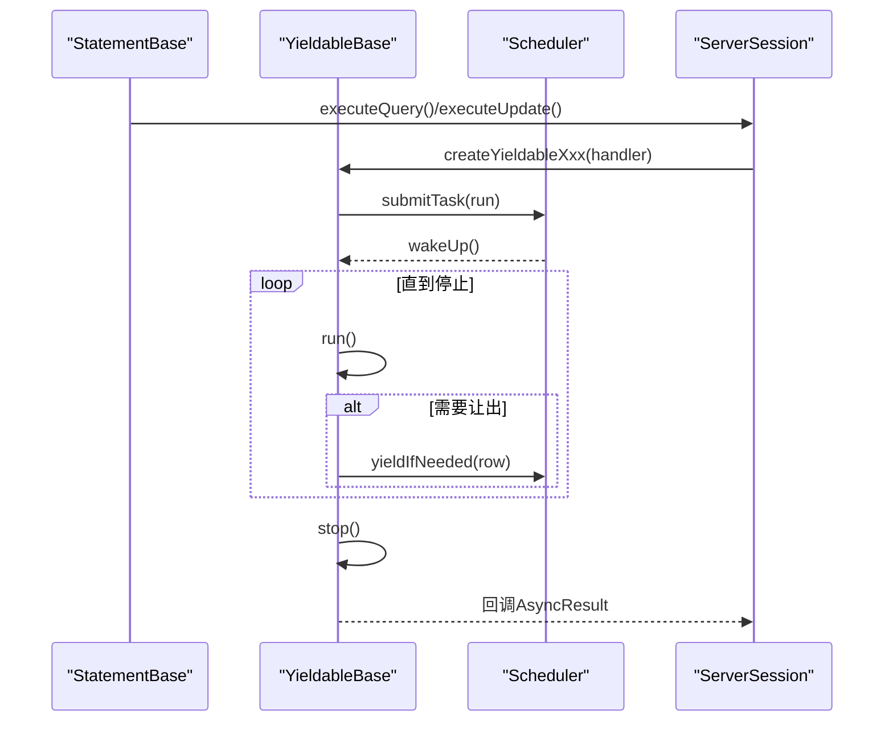
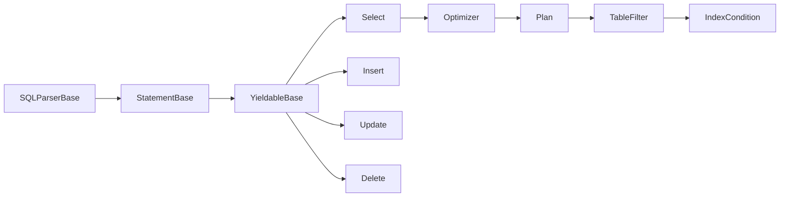

# SQL引擎

<cite>
**本文引用的文件**
- [LealoneSQLEngine.java](https://github.com/lealone/Lealone/blob/master/lealone-sql/src/main/java/com/lealone/sql/LealoneSQLEngine.java)
- [SQLEngineBase.java](https://github.com/lealone/Lealone/blob/master/lealone-sql/src/main/java/com/lealone/sql/SQLEngineBase.java)
- [LealoneSQLParser.java](https://github.com/lealone/Lealone/blob/master/lealone-sql/src/main/java/com/lealone/sql/LealoneSQLParser.java)
- [SQLParserBase.java](https://github.com/lealone/Lealone/blob/master/lealone-sql/src/main/java/com/lealone/sql/SQLParserBase.java)
- [StatementBase.java](https://github.com/lealone/Lealone/blob/master/lealone-sql/src/main/java/com/lealone/sql/StatementBase.java)
- [StatementList.java](https://github.com/lealone/Lealone/blob/master/lealone-sql/src/main/java/com/lealone/sql/StatementList.java)
- [YieldableBase.java](https://github.com/lealone/Lealone/blob/master/lealone-sql/src/main/java/com/lealone/sql/executor/YieldableBase.java)
- [YieldableLocalQuery.java](https://github.com/lealone/Lealone/blob/master/lealone-sql/src/main/java/com/lealone/sql/query/YieldableLocalQuery.java)
- [Select.java](https://github.com/lealone/Lealone/blob/master/lealone-sql/src/main/java/com/lealone/sql/query/Select.java)
- [Insert.java](https://github.com/lealone/Lealone/blob/master/lealone-sql/src/main/java/com/lealone/sql/dml/Insert.java)
- [Update.java](https://github.com/lealone/Lealone/blob/master/lealone-sql/src/main/java/com/lealone/sql/dml/Update.java)
- [Delete.java](https://github.com/lealone/Lealone/blob/master/lealone-sql/src/main/java/com/lealone/sql/dml/Delete.java)
- [CreateTable.java](https://github.com/lealone/Lealone/blob/master/lealone-sql/src/main/java/com/lealone/sql/ddl/CreateTable.java)
- [Optimizer.java](https://github.com/lealone/Lealone/blob/master/lealone-sql/src/main/java/com/lealone/sql/optimizer/Optimizer.java)
- [Plan.java](https://github.com/lealone/Lealone/blob/master/lealone-sql/src/main/java/com/lealone/sql/optimizer/Plan.java)
- [TableFilter.java](https://github.com/lealone/Lealone/blob/master/lealone-sql/src/main/java/com/lealone/sql/optimizer/TableFilter.java)
- [IndexCondition.java](https://github.com/lealone/Lealone/blob/master/lealone-sql/src/main/java/com/lealone/sql/optimizer/IndexCondition.java)
- [Expression.java](https://github.com/lealone/Lealone/blob/master/lealone-sql/src/main/java/com/lealone/sql/expression/Expression.java)
</cite>

## 目录
1. [简介](#简介)
2. [项目结构](#项目结构)
3. [核心组件](#核心组件)
4. [架构总览](#架构总览)
5. [详细组件分析](#详细组件分析)
6. [依赖关系分析](#依赖关系分析)
7. [性能考量](#性能考量)
8. [故障排查指南](#故障排查指南)
9. [结论](#结论)
10. [附录](#附录)

## 简介
本文件系统化梳理 Lealone 的 SQL 引擎，覆盖从 SQLParser 的词法/语法解析，到 Optimizer 的查询优化（索引选择、执行计划生成），再到 Query 的执行阶段；重点阐述渐进式 SQL 引擎如何通过 YieldableBase 实现可暂停的查询执行，并支持复杂的 SELECT、INSERT、UPDATE、DELETE 语句；同时说明 DDL（如 CreateTable、CreateIndex）和 DML 内部处理机制，以及 SQL 引擎与存储引擎和事务引擎的协同工作方式，确保数据一致性与完整性。文末提供 SQL 解析树与查询计划的可视化示例，帮助读者快速理解整体流程。

## 项目结构
Lealone 的 SQL 引擎位于 lealone-sql 模块，主要由以下层次构成：
- 引擎入口与工厂：SQLEngineBase、LealoneSQLEngine、LealoneSQLParser
- 解析层：SQLParserBase（含 DDL/DML/表达式/子查询等解析）
- 优化层：Optimizer、Plan、TableFilter、IndexCondition
- 执行层：StatementBase、StatementList、YieldableBase 及其具体实现（Select/Insert/Update/Delete）
- 表达式与查询：Expression、Select、YieldableLocalQuery 等

图表来源
- [LealoneSQLEngine.java](https://github.com/lealone/Lealone/blob/master/lealone-sql/src/main/java/com/lealone/sql/LealoneSQLEngine.java#L1-L27)
- [SQLEngineBase.java](https://github.com/lealone/Lealone/blob/master/lealone-sql/src/main/java/com/lealone/sql/SQLEngineBase.java#L1-L60)
- [LealoneSQLParser.java](https://github.com/lealone/Lealone/blob/master/lealone-sql/src/main/java/com/lealone/sql/LealoneSQLParser.java#L1-L15)
- [SQLParserBase.java](https://github.com/lealone/Lealone/blob/master/lealone-sql/src/main/java/com/lealone/sql/SQLParserBase.java#L1-L800)
- [StatementBase.java](https://github.com/lealone/Lealone/blob/master/lealone-sql/src/main/java/com/lealone/sql/StatementBase.java#L1-L593)
- [StatementList.java](https://github.com/lealone/Lealone/blob/master/lealone-sql/src/main/java/com/lealone/sql/StatementList.java#L1-L204)
- [YieldableBase.java](https://github.com/lealone/Lealone/blob/master/lealone-sql/src/main/java/com/lealone/sql/executor/YieldableBase.java#L1-L193)
- [YieldableLocalQuery.java](https://github.com/lealone/Lealone/blob/master/lealone-sql/src/main/java/com/lealone/sql/query/YieldableLocalQuery.java#L1-L28)
- [Select.java](https://github.com/lealone/Lealone/blob/master/lealone-sql/src/main/java/com/lealone/sql/query/Select.java#L1-L800)
- [Insert.java](https://github.com/lealone/Lealone/blob/master/lealone-sql/src/main/java/com/lealone/sql/dml/Insert.java#L1-L74)
- [Update.java](https://github.com/lealone/Lealone/blob/master/lealone-sql/src/main/java/com/lealone/sql/dml/Update.java#L1-L180)
- [Delete.java](https://github.com/lealone/Lealone/blob/master/lealone-sql/src/main/java/com/lealone/sql/dml/Delete.java#L1-L97)
- [Optimizer.java](https://github.com/lealone/Lealone/blob/master/lealone-sql/src/main/java/com/lealone/sql/optimizer/Optimizer.java#L1-L282)
- [Plan.java](https://github.com/lealone/Lealone/blob/master/lealone-sql/src/main/java/com/lealone/sql/optimizer/Plan.java#L1-L116)
- [TableFilter.java](https://github.com/lealone/Lealone/blob/master/lealone-sql/src/main/java/com/lealone/sql/optimizer/TableFilter.java#L1-L800)
- [IndexCondition.java](https://github.com/lealone/Lealone/blob/master/lealone-sql/src/main/java/com/lealone/sql/optimizer/IndexCondition.java#L1-L312)

章节来源
- [LealoneSQLEngine.java](https://github.com/lealone/Lealone/blob/master/lealone-sql/src/main/java/com/lealone/sql/LealoneSQLEngine.java#L1-L27)
- [SQLEngineBase.java](https://github.com/lealone/Lealone/blob/master/lealone-sql/src/main/java/com/lealone/sql/SQLEngineBase.java#L1-L60)
- [LealoneSQLParser.java](https://github.com/lealone/Lealone/blob/master/lealone-sql/src/main/java/com/lealone/sql/LealoneSQLParser.java#L1-L15)
- [SQLParserBase.java](https://github.com/lealone/Lealone/blob/master/lealone-sql/src/main/java/com/lealone/sql/SQLParserBase.java#L1-L800)

## 核心组件
- 引擎入口与工厂
  - LealoneSQLEngine：继承自 SQLEngineBase，负责创建 SQLParser 并提供标识符转义策略。
  - SQLEngineBase：抽象引擎基类，提供参数、表达式、条件构造器及插件接口。
  - LealoneSQLParser：继承自 SQLParserBase，作为具体解析器实例。
- 解析器
  - SQLParserBase：统一的 SQL 解析入口，支持 DDL/DML/表达式/子查询等解析，维护令牌流、参数列表、当前解析状态等。
- 执行器
  - StatementBase：所有已解析语句的基类，封装参数、优先级、元数据、执行与异步回调、可重入与取消等通用逻辑。
  - StatementList：多语句组合执行，支持分号分隔的语句串，嵌套会话与自动提交控制。
  - YieldableBase：可暂停执行的抽象基类，封装 run/stop 生命周期、异常处理、进度上报、行扫描与让出调度。
  - YieldableLocalQuery：本地查询的可暂停实现，直接委托 StatementBase.query 并设置结果。
- 查询与 DML
  - Select：复杂查询的准备与优化，构建 TableFilter 列表、条件、排序、去重、分组、聚合等。
  - Insert/Update/Delete：基于 UpDel/UpDel 的批量更新循环，触发器、权限检查、序列转换、异步操作回调。
- 优化器
  - Optimizer/Plan/TableFilter/IndexCondition：索引选择、成本估算、连接顺序搜索、索引条件提取与评估。

章节来源
- [StatementBase.java](https://github.com/lealone/Lealone/blob/master/lealone-sql/src/main/java/com/lealone/sql/StatementBase.java#L1-L593)
- [StatementList.java](https://github.com/lealone/Lealone/blob/master/lealone-sql/src/main/java/com/lealone/sql/StatementList.java#L1-L204)
- [YieldableBase.java](https://github.com/lealone/Lealone/blob/master/lealone-sql/src/main/java/com/lealone/sql/executor/YieldableBase.java#L1-L193)
- [YieldableLocalQuery.java](https://github.com/lealone/Lealone/blob/master/lealone-sql/src/main/java/com/lealone/sql/query/YieldableLocalQuery.java#L1-L28)
- [Select.java](https://github.com/lealone/Lealone/blob/master/lealone-sql/src/main/java/com/lealone/sql/query/Select.java#L1-L800)
- [Insert.java](https://github.com/lealone/Lealone/blob/master/lealone-sql/src/main/java/com/lealone/sql/dml/Insert.java#L1-L74)
- [Update.java](https://github.com/lealone/Lealone/blob/master/lealone-sql/src/main/java/com/lealone/sql/dml/Update.java#L1-L180)
- [Delete.java](https://github.com/lealone/Lealone/blob/master/lealone-sql/src/main/java/com/lealone/sql/dml/Delete.java#L1-L97)
- [Optimizer.java](https://github.com/lealone/Lealone/blob/master/lealone-sql/src/main/java/com/lealone/sql/optimizer/Optimizer.java#L1-L282)
- [Plan.java](https://github.com/lealone/Lealone/blob/master/lealone-sql/src/main/java/com/lealone/sql/optimizer/Plan.java#L1-L116)
- [TableFilter.java](https://github.com/lealone/Lealone/blob/master/lealone-sql/src/main/java/com/lealone/sql/optimizer/TableFilter.java#L1-L800)
- [IndexCondition.java](https://github.com/lealone/Lealone/blob/master/lealone-sql/src/main/java/com/lealone/sql/optimizer/IndexCondition.java#L1-L312)
- [Expression.java](https://github.com/lealone/Lealone/blob/master/lealone-sql/src/main/java/com/lealone/sql/expression/Expression.java#L1-L377)

## 架构总览
SQL 引擎的处理流程如下：
1) 解析阶段：LealoneSQLEngine 创建 LealoneSQLParser，SQLParserBase 将 SQL 字符串解析为 StatementBase（或 StatementList）。
2) 准备阶段：StatementBase.prepare/prepare(boolean) 完成参数绑定、表达式优化、索引条件提取、计划准备。
3) 优化阶段：Select.prepare 中调用 Optimizer/Plan/TableFilter 选择最佳访问路径与连接顺序，IndexCondition 提取可利用的索引条件。
4) 执行阶段：StatementBase.executeXxx 或 createYieldableXxx 返回 YieldableBase 实例，交由会话调度器逐步执行，期间可因行扫描或外部事件让出，直至完成或异常。
5) 结果返回：YieldableBase 在 stop 时设置 AsyncResult，通过回调返回 Result 或受影响行数。

图表来源
- [LealoneSQLEngine.java](https://github.com/lealone/Lealone/blob/master/lealone-sql/src/main/java/com/lealone/sql/LealoneSQLEngine.java#L1-L27)
- [LealoneSQLParser.java](https://github.com/lealone/Lealone/blob/master/lealone-sql/src/main/java/com/lealone/sql/LealoneSQLParser.java#L1-L15)
- [SQLParserBase.java](https://github.com/lealone/Lealone/blob/master/lealone-sql/src/main/java/com/lealone/sql/SQLParserBase.java#L1-L800)
- [StatementBase.java](https://github.com/lealone/Lealone/blob/master/lealone-sql/src/main/java/com/lealone/sql/StatementBase.java#L1-L593)
- [YieldableLocalQuery.java](https://github.com/lealone/Lealone/blob/master/lealone-sql/src/main/java/com/lealone/sql/query/YieldableLocalQuery.java#L1-L28)
- [YieldableBase.java](https://github.com/lealone/Lealone/blob/master/lealone-sql/src/main/java/com/lealone/sql/executor/YieldableBase.java#L1-L193)
- [Select.java](https://github.com/lealone/Lealone/blob/master/lealone-sql/src/main/java/com/lealone/sql/query/Select.java#L1-L800)
- [Insert.java](https://github.com/lealone/Lealone/blob/master/lealone-sql/src/main/java/com/lealone/sql/dml/Insert.java#L1-L74)
- [Update.java](https://github.com/lealone/Lealone/blob/master/lealone-sql/src/main/java/com/lealone/sql/dml/Update.java#L1-L180)
- [Delete.java](https://github.com/lealone/Lealone/blob/master/lealone-sql/src/main/java/com/lealone/sql/dml/Delete.java#L1-L97)

## 详细组件分析

### 解析器与解析树
- SQLParserBase 维护字符类型表、当前令牌、参数列表、解析索引等，提供 parseExpression/parseTableName/parse 等入口。
- parseStatement 根据首字符或关键字分发到具体解析器（如 parseSelect/parseInsert/parseUpdate/parseDelete/parseCreate 等），最终构造对应 StatementBase 子类。
- 支持多语句串（分号分隔），包装为 StatementList，内部使用嵌套会话与自动提交控制。

图表来源
- [SQLParserBase.java](https://github.com/lealone/Lealone/blob/master/lealone-sql/src/main/java/com/lealone/sql/SQLParserBase.java#L1-L800)
- [StatementList.java](https://github.com/lealone/Lealone/blob/master/lealone-sql/src/main/java/com/lealone/sql/StatementList.java#L1-L204)

章节来源
- [SQLParserBase.java](https://github.com/lealone/Lealone/blob/master/lealone-sql/src/main/java/com/lealone/sql/SQLParserBase.java#L1-L800)
- [StatementList.java](https://github.com/lealone/Lealone/blob/master/lealone-sql/src/main/java/com/lealone/sql/StatementList.java#L1-L204)

### 查询优化与执行计划
- Select.prepare 中：
  - expandColumnList 展开通配列
  - initOrder/initGroup 初始化排序/分组
  - condition.optimize + createIndexConditions 提取可用索引条件
  - preparePlan 选择最优访问路径：
    - 单表：TableFilter.preparePlan + PlanItem.getBestPlanItem
    - 多表：Optimizer.optimize 使用暴力枚举/贪心/遗传算法组合，Plan.calculateCost 评估成本
- Optimizer/Plan/TableFilter/IndexCondition 协作：
  - IndexCondition 从表达式中提取比较类型（等值/范围/IN/子查询），计算掩码用于索引选择
  - Plan 保存每个 TableFilter 的 PlanItem，并在 optimizeConditions 中移除不可用索引条件
  - TableFilter.getBestPlanItem 基于 masks/sortOrder 选择最佳索引，考虑连接嵌套与代价

图表来源
- [Optimizer.java](https://github.com/lealone/Lealone/blob/master/lealone-sql/src/main/java/com/lealone/sql/optimizer/Optimizer.java#L1-L282)
- [Plan.java](https://github.com/lealone/Lealone/blob/master/lealone-sql/src/main/java/com/lealone/sql/optimizer/Plan.java#L1-L116)
- [TableFilter.java](https://github.com/lealone/Lealone/blob/master/lealone-sql/src/main/java/com/lealone/sql/optimizer/TableFilter.java#L1-L800)
- [IndexCondition.java](https://github.com/lealone/Lealone/blob/master/lealone-sql/src/main/java/com/lealone/sql/optimizer/IndexCondition.java#L1-L312)

章节来源
- [Select.java](https://github.com/lealone/Lealone/blob/master/lealone-sql/src/main/java/com/lealone/sql/query/Select.java#L1-L800)
- [Optimizer.java](https://github.com/lealone/Lealone/blob/master/lealone-sql/src/main/java/com/lealone/sql/optimizer/Optimizer.java#L1-L282)
- [Plan.java](https://github.com/lealone/Lealone/blob/master/lealone-sql/src/main/java/com/lealone/sql/optimizer/Plan.java#L1-L116)
- [TableFilter.java](https://github.com/lealone/Lealone/blob/master/lealone-sql/src/main/java/com/lealone/sql/optimizer/TableFilter.java#L1-L800)
- [IndexCondition.java](https://github.com/lealone/Lealone/blob/master/lealone-sql/src/main/java/com/lealone/sql/optimizer/IndexCondition.java#L1-L312)

### 渐进式执行与可暂停查询
- YieldableBase.run 生命周期：
  - start：记录开始时间、设置进度、校验参数、调用 startInternal
  - executeInternal：子类实现具体执行逻辑
  - stop：记录耗时、设置进度、清理资源、回调结果
- StatementBase.syncExecute 与异步执行：
  - executeQuery/executeUpdate 创建 YieldableCommand 并提交到会话任务队列，配合 session.getScheduler().wakeUp() 唤醒调度
  - setCurrentRowNumber(rowNumber, yieldEnabled) 与 session.getScheduler().yieldIfNeeded(this) 实现行级让出
- YieldableLocalQuery 直接委托 StatementBase.query 并设置结果

图表来源
- [StatementBase.java](https://github.com/lealone/Lealone/blob/master/lealone-sql/src/main/java/com/lealone/sql/StatementBase.java#L1-L593)
- [YieldableBase.java](https://github.com/lealone/Lealone/blob/master/lealone-sql/src/main/java/com/lealone/sql/executor/YieldableBase.java#L1-L193)
- [YieldableLocalQuery.java](https://github.com/lealone/Lealone/blob/master/lealone-sql/src/main/java/com/lealone/sql/query/YieldableLocalQuery.java#L1-L28)

章节来源
- [StatementBase.java](https://github.com/lealone/Lealone/blob/master/lealone-sql/src/main/java/com/lealone/sql/StatementBase.java#L1-L593)
- [YieldableBase.java](https://github.com/lealone/Lealone/blob/master/lealone-sql/src/main/java/com/lealone/sql/executor/YieldableBase.java#L1-L193)
- [YieldableLocalQuery.java](https://github.com/lealone/Lealone/blob/master/lealone-sql/src/main/java/com/lealone/sql/query/YieldableLocalQuery.java#L1-L28)

### 复杂查询（SELECT）处理
- Select.prepare：
  - 条件优化与索引条件提取
  - distinct/sort/group by 特殊优化：选择支持 DISTINCT 的索引、利用排序列匹配的索引、按分组列匹配的索引
  - preparePlan：单表直接选择索引，多表使用 Optimizer 计算最佳连接顺序
- 表达式系统：
  - Expression 抽象值、类型、精度、显示大小、SQL 片段、布尔值、成本估算、列依赖、可评估性等
  - Expression.optimize 与 createIndexConditions 为优化器提供信息

章节来源
- [Select.java](https://github.com/lealone/Lealone/blob/master/lealone-sql/src/main/java/com/lealone/sql/query/Select.java#L1-L800)
- [Expression.java](https://github.com/lealone/Lealone/blob/master/lealone-sql/src/main/java/com/lealone/sql/expression/Expression.java#L1-L377)

### DML（INSERT/UPDATE/DELETE）处理
- Insert：构造 INSERT INTO 语句的执行计划，触发器前后置事件，异步插入行。
- Update：多列赋值映射，条件优化与索引条件提取，逐行创建新行并异步更新。
- Delete：条件优化与索引条件提取，逐行异步删除。
- 三者均继承自 UpDel/YieldableUpDel/YieldableLoopUpdateBase，具备权限检查、触发器、序列转换、异步回调等通用能力。

章节来源
- [Insert.java](https://github.com/lealone/Lealone/blob/master/lealone-sql/src/main/java/com/lealone/sql/dml/Insert.java#L1-L74)
- [Update.java](https://github.com/lealone/Lealone/blob/master/lealone-sql/src/main/java/com/lealone/sql/dml/Update.java#L1-L180)
- [Delete.java](https://github.com/lealone/Lealone/blob/master/lealone-sql/src/main/java/com/lealone/sql/dml/Delete.java#L1-L97)

### DDL（CreateTable）处理
- CreateTable：校验参数、解析列定义、主键约束、临时表行为、序列转换、约束命令延迟执行、可选代码生成等。
- 与存储引擎协作：通过 Schema.createTable 创建表对象，TableFilter.prepareExpression 初始化列表达式，必要时回滚并释放锁。

章节来源
- [CreateTable.java](https://github.com/lealone/Lealone/blob/master/lealone-sql/src/main/java/com/lealone/sql/ddl/CreateTable.java#L1-L379)

## 依赖关系分析
- 组件耦合
  - StatementBase 与执行器（Select/Insert/Update/Delete）强关联，通过 createYieldableXxx 与 YieldableBase 解耦
  - Optimizer/Plan/TableFilter/IndexCondition 形成查询优化子系统，Select.prepare 直接依赖
  - SQLParserBase 与各 Statement 子类解耦，通过工厂与会话传递
- 外部依赖
  - ServerSession 提供用户权限、触发器、调度器、数据库事件监听等
  - AsyncResult/AsyncResultHandler 提供异步回调机制
  - Index/Storage 接口由存储引擎实现，SQL 层仅通过 TableFilter/IndexCondition 间接使用

图表来源
- [SQLParserBase.java](https://github.com/lealone/Lealone/blob/master/lealone-sql/src/main/java/com/lealone/sql/SQLParserBase.java#L1-L800)
- [StatementBase.java](https://github.com/lealone/Lealone/blob/master/lealone-sql/src/main/java/com/lealone/sql/StatementBase.java#L1-L593)
- [YieldableBase.java](https://github.com/lealone/Lealone/blob/master/lealone-sql/src/main/java/com/lealone/sql/executor/YieldableBase.java#L1-L193)
- [Select.java](https://github.com/lealone/Lealone/blob/master/lealone-sql/src/main/java/com/lealone/sql/query/Select.java#L1-L800)
- [Optimizer.java](https://github.com/lealone/Lealone/blob/master/lealone-sql/src/main/java/com/lealone/sql/optimizer/Optimizer.java#L1-L282)
- [Plan.java](https://github.com/lealone/Lealone/blob/master/lealone-sql/src/main/java/com/lealone/sql/optimizer/Plan.java#L1-L116)
- [TableFilter.java](https://github.com/lealone/Lealone/blob/master/lealone-sql/src/main/java/com/lealone/sql/optimizer/TableFilter.java#L1-L800)
- [IndexCondition.java](https://github.com/lealone/Lealone/blob/master/lealone-sql/src/main/java/com/lealone/sql/optimizer/IndexCondition.java#L1-L312)

章节来源
- [SQLParserBase.java](https://github.com/lealone/Lealone/blob/master/lealone-sql/src/main/java/com/lealone/sql/SQLParserBase.java#L1-L800)
- [StatementBase.java](https://github.com/lealone/Lealone/blob/master/lealone-sql/src/main/java/com/lealone/sql/StatementBase.java#L1-L593)
- [YieldableBase.java](https://github.com/lealone/Lealone/blob/master/lealone-sql/src/main/java/com/lealone/sql/executor/YieldableBase.java#L1-L193)
- [Select.java](https://github.com/lealone/Lealone/blob/master/lealone-sql/src/main/java/com/lealone/sql/query/Select.java#L1-L800)
- [Optimizer.java](https://github.com/lealone/Lealone/blob/master/lealone-sql/src/main/java/com/lealone/sql/optimizer/Optimizer.java#L1-L282)
- [Plan.java](https://github.com/lealone/Lealone/blob/master/lealone-sql/src/main/java/com/lealone/sql/optimizer/Plan.java#L1-L116)
- [TableFilter.java](https://github.com/lealone/Lealone/blob/master/lealone-sql/src/main/java/com/lealone/sql/optimizer/TableFilter.java#L1-L800)
- [IndexCondition.java](https://github.com/lealone/Lealone/blob/master/lealone-sql/src/main/java/com/lealone/sql/optimizer/IndexCondition.java#L1-L312)

## 性能考量
- 优化器策略
  - 单表：直接选择扫描或索引，结合 IndexCondition 掩码评估
  - 多表：对小规模（<=7）全排列搜索，大规模采用贪心+随机打乱的“遗传”策略，避免指数爆炸
  - 成本计算：Plan.calculateCost 以累积代价衡量，结合 Join/NestedJoin 的代价叠加
- 表达式与索引
  - Expression.optimize 与 createIndexConditions 为优化器提供精确信息，减少无效扫描
  - IndexCondition.getMask 将比较类型映射为掩码，便于索引选择与范围裁剪
- 渐进式执行
  - setCurrentRowNumber(rowNumber, yieldEnabled) 与 yieldIfNeeded(row) 结合，按行扫描频率让出，避免长时间占用
  - StatementBase.syncExecute 在存储引擎未完全结束时调度其他语句，提升并发吞吐

章节来源
- [Optimizer.java](https://github.com/lealone/Lealone/blob/master/lealone-sql/src/main/java/com/lealone/sql/optimizer/Optimizer.java#L1-L282)
- [Plan.java](https://github.com/lealone/Lealone/blob/master/lealone-sql/src/main/java/com/lealone/sql/optimizer/Plan.java#L1-L116)
- [Expression.java](https://github.com/lealone/Lealone/blob/master/lealone-sql/src/main/java/com/lealone/sql/expression/Expression.java#L1-L377)
- [IndexCondition.java](https://github.com/lealone/Lealone/blob/master/lealone-sql/src/main/java/com/lealone/sql/optimizer/IndexCondition.java#L1-L312)
- [StatementBase.java](https://github.com/lealone/Lealone/blob/master/lealone-sql/src/main/java/com/lealone/sql/StatementBase.java#L1-L593)

## 故障排查指南
- 语法错误
  - SQLParserBase.getSyntaxError 提供期望令牌列表，定位语法问题
- 参数未设置
  - StatementBase.checkParameters 校验占位符是否已赋值
- 死锁与异常
  - YieldableBase.handleException 中针对不同错误码采取回滚/立即关机等策略，确保一致性
- 行级让出失败
  - 检查 setCurrentRowNumber 是否被正确调用，以及 session.getScheduler().yieldIfNeeded 是否生效

章节来源
- [SQLParserBase.java](https://github.com/lealone/Lealone/blob/master/lealone-sql/src/main/java/com/lealone/sql/SQLParserBase.java#L1-L800)
- [StatementBase.java](https://github.com/lealone/Lealone/blob/master/lealone-sql/src/main/java/com/lealone/sql/StatementBase.java#L1-L593)
- [YieldableBase.java](https://github.com/lealone/Lealone/blob/master/lealone-sql/src/main/java/com/lealone/sql/executor/YieldableBase.java#L1-L193)

## 结论
Lealone 的 SQL 引擎以清晰的分层设计实现了从解析到优化再到执行的完整链路。通过可暂停的 YieldableBase，引擎能够在长查询与高并发场景下保持响应性；通过 Optimizer/Plan/TableFilter/IndexCondition 的协同，实现对索引与连接顺序的智能选择；通过 StatementBase 的统一抽象与 DDL/DML 的模块化实现，保证了功能扩展与维护性。与存储引擎和事务引擎的协作则确保了数据一致性与完整性。

## 附录
- 查询计划可视化示例
  - Select.getPlanSQL 输出包含表、索引、WHERE 条件、JOIN 条件、扫描次数等信息，便于诊断与优化
  - IndexCondition.getSQL 输出等值/范围/IN/子查询等条件片段，辅助理解索引利用情况

章节来源
- [Select.java](https://github.com/lealone/Lealone/blob/master/lealone-sql/src/main/java/com/lealone/sql/query/Select.java#L1-L800)
- [IndexCondition.java](https://github.com/lealone/Lealone/blob/master/lealone-sql/src/main/java/com/lealone/sql/optimizer/IndexCondition.java#L1-L312)