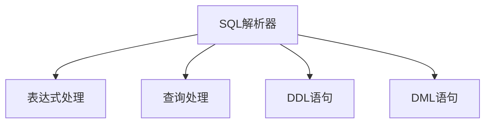
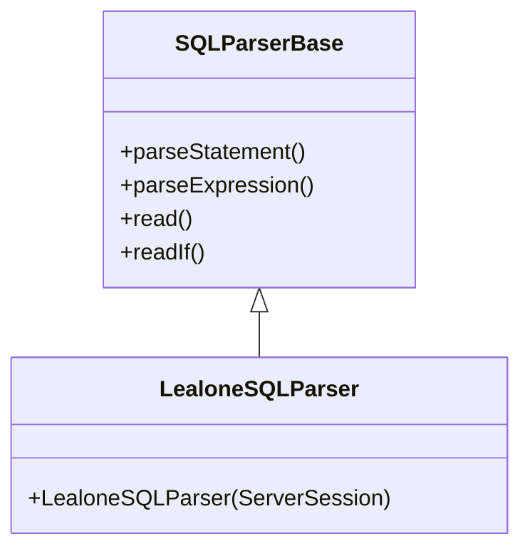
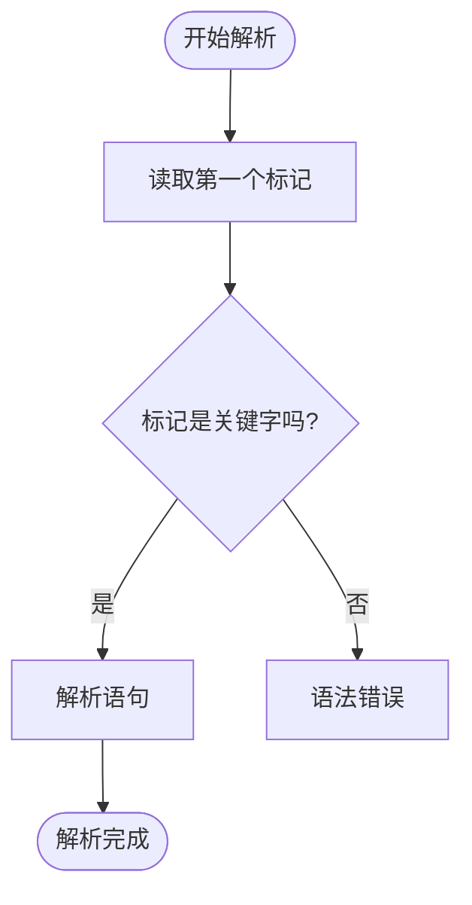
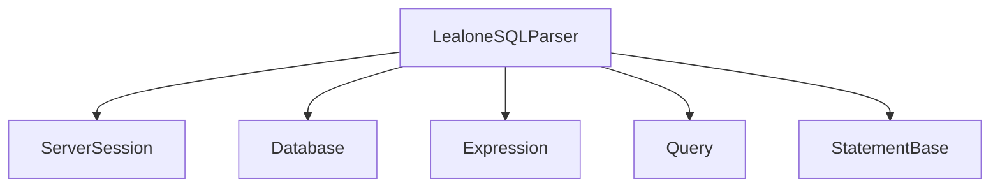

# SQL解析器

<cite>
**本文档引用的文件**   
- [LealoneSQLParser.java](file://lealone-sql/src/main/java/com/lealone/sql/LealoneSQLParser.java)
- [SQLParserBase.java](file://lealone-sql/src/main/java/com/lealone/sql/SQLParserBase.java)
- [LealoneSQLEngine.java](file://lealone-sql/src/main/java/com/lealone/sql/LealoneSQLEngine.java)
- [Expression.java](file://lealone-sql/src/main/java/com/lealone/sql/expression/Expression.java)
- [Select.java](file://lealone-sql/src/main/java/com/lealone/sql/query/Select.java)
- [StatementBase.java](file://lealone-sql/src/main/java/com/lealone/sql/StatementBase.java)
- [BuiltInFunction.java](file://lealone-sql/src/main/java/com/lealone/sql/expression/function/BuiltInFunction.java)
- [Condition.java](file://lealone-sql/src/main/java/com/lealone/sql/expression/condition/Condition.java)
- [Query.java](file://lealone-sql/src/main/java/com/lealone/sql/query/Query.java)
</cite>

## 目录
1. [引言](#引言)
2. [项目结构](#项目结构)
3. [核心组件](#核心组件)
4. [架构概述](#架构概述)
5. [详细组件分析](#详细组件分析)
6. [依赖分析](#依赖分析)
7. [性能考虑](#性能考虑)
8. [故障排除指南](#故障排除指南)
9. [结论](#结论)

## 引言
LealoneSQLParser是Lealone数据库系统中的核心组件，负责将原始SQL文本转换为抽象语法树(AST)。该解析器实现了完整的SQL语法支持，包括DDL、DML、查询语句等，并提供了强大的表达式处理能力。解析器的设计遵循了模块化和可扩展的原则，通过继承和组合的方式实现了词法分析、语法分析和语义分析的分离。本文档将深入解析SQL解析器的工作原理，包括其词法分析和语法分析过程，以及如何处理各种SQL结构。

## 项目结构
LealoneSQLParser位于`lealone-sql`模块中，是整个SQL处理管道的入口点。该模块包含了SQL解析、表达式处理、查询优化和执行等核心功能。解析器的实现主要分布在`com.lealone.sql`包及其子包中，其中`SQLParserBase`类提供了基础的解析功能，而`LealoneSQLParser`类则继承自`SQLParserBase`并实现了具体的解析逻辑。

**Diagram sources**
- [LealoneSQLParser.java](file://lealone-sql/src/main/java/com/lealone/sql/LealoneSQLParser.java)
- [SQLParserBase.java](file://lealone-sql/src/main/java/com/lealone/sql/SQLParserBase.java)

**Section sources**
- [LealoneSQLParser.java](file://lealone-sql/src/main/java/com/lealone/sql/LealoneSQLParser.java)
- [SQLParserBase.java](file://lealone-sql/src/main/java/com/lealone/sql/SQLParserBase.java)

## 核心组件
LealoneSQLParser的核心组件包括词法分析器、语法分析器和AST生成器。词法分析器负责将SQL文本分解为标记(token)，语法分析器根据SQL语法规则构建语法树，而AST生成器则将语法树转换为可以在后续阶段使用的抽象语法树。这些组件协同工作，确保SQL语句能够被正确解析和执行。

**Section sources**
- [LealoneSQLParser.java](file://lealone-sql/src/main/java/com/lealone/sql/LealoneSQLParser.java)
- [SQLParserBase.java](file://lealone-sql/src/main/java/com/lealone/sql/SQLParserBase.java)

## 架构概述
LealoneSQLParser的架构设计遵循了经典的编译器架构，包括词法分析、语法分析和语义分析三个阶段。解析器通过继承`SQLParserBase`类来复用基础的解析功能，同时通过实现具体的解析方法来支持Lealone特有的SQL语法。这种设计模式使得解析器既具有良好的可维护性，又具有高度的可扩展性。

**Diagram sources**
- [LealoneSQLParser.java](file://lealone-sql/src/main/java/com/lealone/sql/LealoneSQLParser.java)
- [SQLParserBase.java](file://lealone-sql/src/main/java/com/lealone/sql/SQLParserBase.java)

## 详细组件分析
### 词法分析
词法分析是SQL解析的第一步，负责将输入的SQL文本分解为一系列有意义的标记。LealoneSQLParser通过`read()`和`readIf()`等方法实现了标记的读取和识别。这些方法能够识别关键字、标识符、参数、值等不同类型的标记，并为后续的语法分析提供基础。

**Section sources**
- [SQLParserBase.java](file://lealone-sql/src/main/java/com/lealone/sql/SQLParserBase.java)

### 语法分析
语法分析是SQL解析的核心阶段，负责根据SQL语法规则构建语法树。LealoneSQLParser通过`parseStatement()`方法实现了对不同类型SQL语句的解析。该方法根据输入的第一个标记来决定具体的解析路径，例如以"SELECT"开头的语句会被解析为查询语句，而以"INSERT"开头的语句则会被解析为插入语句。

**Diagram sources**
- [SQLParserBase.java](file://lealone-sql/src/main/java/com/lealone/sql/SQLParserBase.java)

### AST生成
AST生成是SQL解析的最后阶段，负责将语法树转换为可以在后续阶段使用的抽象语法树。LealoneSQLParser通过`Expression`类及其子类实现了AST节点的表示。每个AST节点都包含了类型、值、子节点等信息，这些信息在查询优化和执行阶段被用来生成执行计划。

**Section sources**
- [Expression.java](file://lealone-sql/src/main/java/com/lealone/sql/expression/Expression.java)

## 依赖分析
LealoneSQLParser依赖于多个核心组件来完成其功能。这些依赖包括`ServerSession`用于获取会话信息，`Database`用于访问数据库元数据，以及各种表达式和查询类用于构建AST。通过这些依赖，解析器能够正确地解析SQL语句并生成相应的执行计划。

**Diagram sources**
- [LealoneSQLParser.java](file://lealone-sql/src/main/java/com/lealone/sql/LealoneSQLParser.java)
- [SQLParserBase.java](file://lealone-sql/src/main/java/com/lealone/sql/SQLParserBase.java)

## 性能考虑
LealoneSQLParser在设计时充分考虑了性能因素。通过使用`ArrayList`等高效的数据结构，以及避免不必要的对象创建，解析器能够在保证功能完整性的同时提供良好的性能表现。此外，解析器还支持预编译和缓存机制，进一步提高了重复执行相同SQL语句的效率。

## 故障排除指南
在使用LealoneSQLParser时，可能会遇到各种问题，如语法错误、解析失败等。为了帮助用户快速定位和解决问题，解析器提供了详细的错误信息和调试支持。当发生错误时，解析器会抛出`DbException`异常，并包含具体的错误代码和消息，帮助用户理解问题的根源。

**Section sources**
- [SQLParserBase.java](file://lealone-sql/src/main/java/com/lealone/sql/SQLParserBase.java)

## 结论
LealoneSQLParser是一个功能强大且设计精良的SQL解析器，它通过模块化的设计和高效的实现，为Lealone数据库系统提供了可靠的SQL处理能力。通过对词法分析、语法分析和AST生成的深入理解，开发者可以更好地利用这一工具来构建高性能的数据库应用。