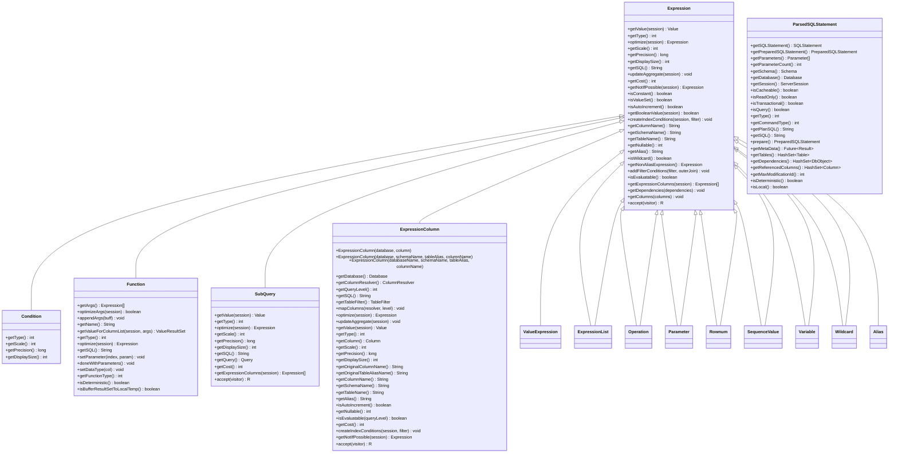
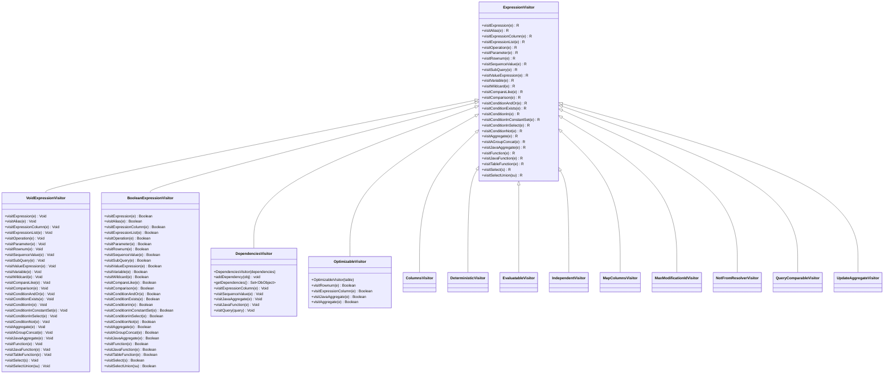
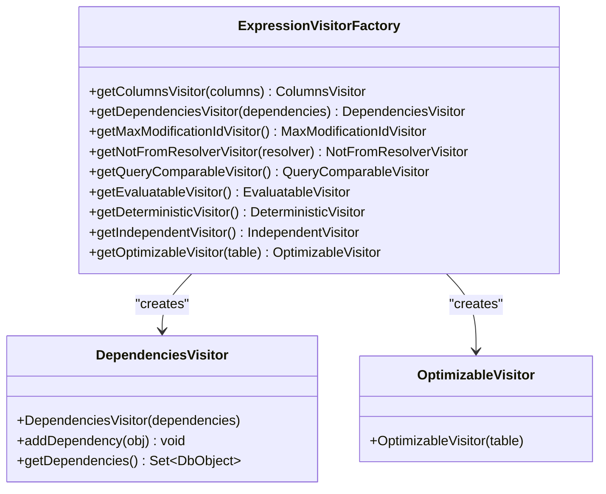
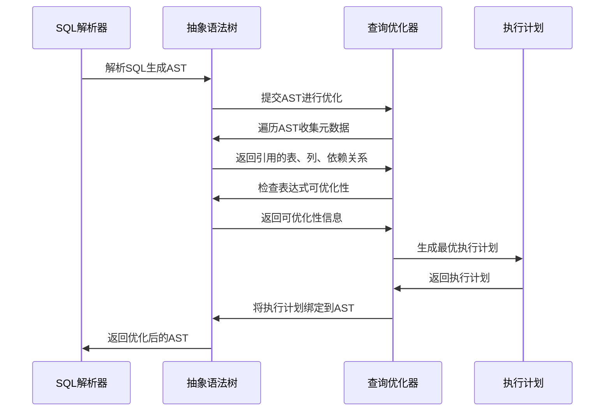
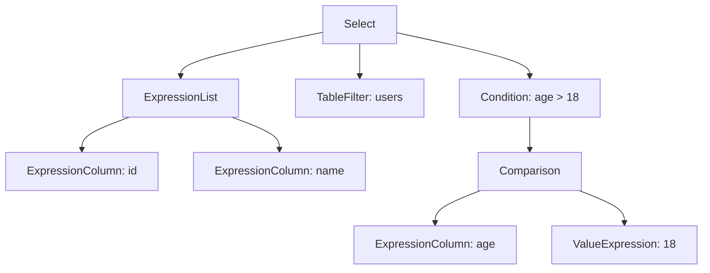
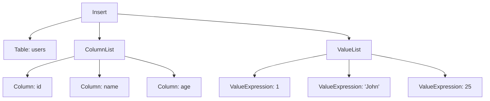

# 抽象语法树(AST)

<cite>
**本文档引用的文件**   
- [ParsedSQLStatement.java](https://github.com/lealone/Lealone/blob/master/lealone-sci\src\main\java\com\lealone\sql\ParsedSQLStatement.java)
- [Expression.java](https://github.com/lealone/Lealone/blob/master/lealone-sql\src\main\java\com\lealone\sql\expression\Expression.java)
- [Condition.java](https://github.com/lealone/Lealone/blob/master/lealone-sql\src\main\java\com\lealone\sql\expression\condition\Condition.java)
- [Function.java](https://github.com/lealone/Lealone/blob/master/lealone-sql\src\main\java\com\lealone\sql\expression\function\Function.java)
- [SubQuery.java](https://github.com/lealone/Lealone/blob/master/lealone-sql\src\main\java\com\lealone\sql\expression\subquery\SubQuery.java)
- [ExpressionColumn.java](https://github.com/lealone/Lealone/blob/master/lealone-sql\src\main\java\com\lealone\sql\expression\ExpressionColumn.java)
- [Select.java](https://github.com/lealone/Lealone/blob/master/lealone-sql\src\main\java\com\lealone\sql\query\Select.java)
- [ExpressionVisitor.java](https://github.com/lealone/Lealone/blob/master/lealone-sql\src\main\java\com\lealone\sql\expression\visitor\ExpressionVisitor.java)
- [DependenciesVisitor.java](https://github.com/lealone/Lealone/blob/master/lealone-sql\src\main\java\com\lealone\sql\expression\visitor\DependenciesVisitor.java)
- [OptimizableVisitor.java](https://github.com/lealone/Lealone/blob/master/lealone-sql\src\main\java\com\lealone\sql\expression\visitor\OptimizableVisitor.java)
- [ExpressionVisitorFactory.java](https://github.com/lealone/Lealone/blob/master/lealone-sql\src\main\java\com\lealone\sql\expression\visitor\ExpressionVisitorFactory.java)
- [Alias.java](https://github.com/lealone/Lealone/blob/master/lealone-sql\src\main\java\com\lealone\sql\expression\Alias.java)
- [ValueExpression.java](https://github.com/lealone/Lealone/blob/master/lealone-sql\src\main\java\com\lealone\sql\expression\ValueExpression.java)
- [ExpressionList.java](https://github.com/lealone/Lealone/blob/master/lealone-sql\src\main\java\com\lealone\sql\expression\ExpressionList.java)
</cite>

## 目录
1. [引言](#引言)
2. [AST结构设计](#ast结构设计)
3. [核心节点类型](#核心节点类型)
4. [遍历机制与访问者模式](#遍历机制与访问者模式)
5. [AST在查询优化中的作用](#ast在查询优化中的作用)
6. [AST结构示例](#ast结构示例)
7. [元数据支持](#元数据支持)
8. [结论](#结论)

## 引言

抽象语法树（Abstract Syntax Tree, AST）是Lealone数据库系统中SQL解析和执行的核心数据结构。它将SQL语句的文本形式转换为树形结构，精确地表示了SQL语句的语法结构。AST不仅为后续的语义分析、查询优化和执行计划生成提供了基础，还通过丰富的元数据支持了复杂的数据库操作。本文档将全面解析Lealone数据库中AST的设计与实现，重点介绍`ParsedSQLStatement`及其相关表达式类的结构，详细描述核心节点类型的行为，阐述遍历机制和访问者模式的应用，并展示AST在查询优化中的关键作用。

## AST结构设计

Lealone数据库的AST设计基于面向对象的原则，通过继承和多态实现了灵活的表达式处理。`Expression`类作为所有表达式节点的基类，定义了获取值、类型、优化表达式等核心方法。具体的表达式类型如`ExpressionColumn`、`ValueExpression`、`Function`等继承自`Expression`，实现了各自特定的行为。`ParsedSQLStatement`类作为SQL语句的解析结果，包含了AST的根节点，通过遍历这棵树可以完整地重建原始的SQL语句。



**图源**
- [Expression.java](https://github.com/lealone/Lealone/blob/master/lealone-sql\src\main\java\com\lealone\sql\expression\Expression.java)
- [Condition.java](https://github.com/lealone/Lealone/blob/master/lealone-sql\src\main\java\com\lealone\sql\expression\condition\Condition.java)
- [Function.java](https://github.com/lealone/Lealone/blob/master/lealone-sql\src\main\java\com\lealone\sql\expression\function\Function.java)
- [SubQuery.java](https://github.com/lealone/Lealone/blob/master/lealone-sql\src\main\java\com\lealone\sql\expression\subquery\SubQuery.java)
- [ExpressionColumn.java](https://github.com/lealone/Lealone/blob/master/lealone-sql\src\main\java\com\lealone\sql\expression\ExpressionColumn.java)
- [ParsedSQLStatement.java](https://github.com/lealone/Lealone/blob/master/lealone-sci\src\main\java\com\lealone\sql\ParsedSQLStatement.java)

**本节来源**
- [Expression.java](https://github.com/lealone/Lealone/blob/master/lealone-sql\src\main\java\lealone\sql\expression\Expression.java)
- [ParsedSQLStatement.java](https://github.com/lealone/Lealone/blob/master/lealone-sci\src\main\java\com\lealone\sql\ParsedSQLStatement.java)

## 核心节点类型

### Expression节点

`Expression`是所有表达式节点的基类，定义了表达式的基本行为。它提供了获取表达式值、类型、精度、显示大小等信息的方法。`optimize`方法用于在查询准备阶段优化表达式，`getSQL`方法返回表达式的SQL表示形式。`accept`方法实现了访问者模式，允许在不修改表达式类的情况下添加新的操作。

### Condition节点

`Condition`类继承自`Expression`，专门用于表示返回布尔值或NULL的条件表达式。它重写了`getType`、`getScale`、`getPrecision`和`getDisplaySize`方法，以反映布尔值的特性。`Condition`的子类如`Comparison`、`ConditionAndOr`、`ConditionNot`等实现了具体的条件逻辑。

### Function节点

`Function`类表示内置函数和用户定义函数。它维护了一个参数表达式数组`args`，并通过`optimizeArgs`方法优化这些参数。`Function`类还提供了`getArgs`、`appendArgs`等方法来处理函数参数。`Function`的子类如`BuiltInFunction`、`JavaFunction`、`TableFunction`等实现了具体的函数行为。

### SubQuery节点

`SubQuery`类表示返回单个值的子查询。它包含一个`Query`对象，通过执行该查询来获取值。`SubQuery`重写了`getValue`方法，执行子查询并返回结果。它还提供了`getQuery`方法来访问底层的查询对象。

## 遍历机制与访问者模式

### ExpressionVisitor接口

`ExpressionVisitor`接口定义了访问各种表达式节点的方法。通过实现这个接口，可以为表达式树添加新的操作，而无需修改表达式类本身。`Expression`类的`accept`方法接受一个`ExpressionVisitor`对象，并调用其相应的方法。



**图源**
- [ExpressionVisitor.java](https://github.com/lealone/Lealone/blob/master/lealone-sql\src\main\java\com\lealone\sql\expression\visitor\ExpressionVisitor.java)
- [DependenciesVisitor.java](https://github.com/lealone/Lealone/blob/master/lealone-sql\src\main\java\com\lealone\sql\expression\visitor\DependenciesVisitor.java)
- [OptimizableVisitor.java](https://github.com/lealone/Lealone/blob/master/lealone-sql\src\main\java\com\lealone\sql\expression\visitor\OptimizableVisitor.java)

**本节来源**
- [ExpressionVisitor.java](https://github.com/lealone/Lealone/blob/master/lealone-sql\src\main\java\com\lealone\sql\expression\visitor\ExpressionVisitor.java)
- [DependenciesVisitor.java](https://github.com/lealone/Lealone/blob/master/lealone-sql\src\main\java\com\lealone\sql\expression\visitor\DependenciesVisitor.java)
- [OptimizableVisitor.java](https://github.com/lealone/Lealone/blob/master/lealone-sql\src\main\java\com\lealone\sql\expression\visitor\OptimizableVisitor.java)

### ExpressionVisitorFactory工厂

`ExpressionVisitorFactory`类提供了创建各种`ExpressionVisitor`实例的静态方法。这些方法返回单例或新创建的访问者对象，用于执行特定的遍历任务，如收集依赖关系、检查可评估性、确定确定性等。



**图源**
- [ExpressionVisitorFactory.java](https://github.com/lealone/Lealone/blob/master/lealone-sql\src\main\java\com\lealone\sql\expression\visitor\ExpressionVisitorFactory.java)
- [DependenciesVisitor.java](https://github.com/lealone/Lealone/blob/master/lealone-sql\src\main\java\com\lealone\sql\expression\visitor\DependenciesVisitor.java)
- [OptimizableVisitor.java](https://github.com/lealone/Lealone/blob/master/lealone-sql\src\main\java\com\lealone\sql\expression\visitor\OptimizableVisitor.java)

**本节来源**
- [ExpressionVisitorFactory.java](https://github.com/lealone/Lealone/blob/master/lealone-sql\src\main\java\com\lealone\sql\expression\visitor\ExpressionVisitorFactory.java)

## AST在查询优化中的作用

AST在查询优化过程中扮演着至关重要的角色。通过遍历AST，优化器可以收集查询的元数据，如引用的表、列、依赖关系等，并基于这些信息生成最优的执行计划。

### 依赖关系收集

`DependenciesVisitor`用于收集表达式所依赖的数据库对象。当遍历到`ExpressionColumn`节点时，它会将列所属的表添加到依赖集合中；当遍历到`SequenceValue`节点时，它会将序列添加到依赖集合中。这对于确定查询的影响范围和执行顺序至关重要。

### 可优化性检查

`OptimizableVisitor`用于检查聚合函数是否可以被优化。对于内置聚合函数，它会检查是否针对特定表进行了优化；对于用户定义的聚合函数，由于其行为不确定，通常不能被优化。这有助于优化器决定是否可以使用快速聚合查询。

### 查询优化示例

以下是一个查询优化的序列图，展示了从解析SQL到生成执行计划的过程：



**图源**
- [ParsedSQLStatement.java](https://github.com/lealone/Lealone/blob/master/lealone-sci\src\main\java\com\lealone\sql\ParsedSQLStatement.java)
- [Select.java](https://github.com/lealone/Lealone/blob/master/lealone-sql\src\main\java\com\lealone\sql\query\Select.java)
- [ExpressionVisitor.java](https://github.com/lealone/Lealone/blob/master/lealone-sql\src\main\java\com\lealone\sql\expression\visitor\ExpressionVisitor.java)

**本节来源**
- [ParsedSQLStatement.java](https://github.com/lealone/Lealone/blob/master/lealone-sci\src\main\java\com\lealone\sql\ParsedSQLStatement.java)
- [Select.java](https://github.com/lealone/Lealone/blob/master/lealone-sql\src\main\java\com\lealone\sql\query\Select.java)

## AST结构示例

### SELECT语句的AST结构

以下是一个SELECT语句及其对应的AST结构示例：

```sql
SELECT id, name FROM users WHERE age > 18
```

对应的AST结构如下：



**图源**
- [Select.java](https://github.com/lealone/Lealone/blob/master/lealone-sql\src\main\java\com\lealone\sql\query\Select.java)
- [ExpressionColumn.java](https://github.com/lealone/Lealone/blob/master/lealone-sql\src\main\java\com\lealone\sql\expression\ExpressionColumn.java)
- [ValueExpression.java](https://github.com/lealone/Lealone/blob/master/lealone-sql\src\main\java\com\lealone\sql\expression\ValueExpression.java)

**本节来源**
- [Select.java](https://github.com/lealone/Lealone/blob/master/lealone-sql\src\main\java\com\lealone\sql\query\Select.java)

### INSERT语句的AST结构

以下是一个INSERT语句及其对应的AST结构示例：

```sql
INSERT INTO users (id, name, age) VALUES (1, 'John', 25)
```

对应的AST结构如下：



**图源**
- [Insert.java](https://github.com/lealone/Lealone/blob/master/lealone-sql\src\main\java\com\lealone\sql\dml\Insert.java)
- [ValueExpression.java](https://github.com/lealone/Lealone/blob/master/lealone-sql\src\main\java\com\lealone\sql\expression\ValueExpression.java)

**本节来源**
- [Insert.java](https://github.com/lealone/Lealone/blob/master/lealone-sql\src\main\java\com\lealone\sql\dml\Insert.java)

## 元数据支持

AST节点携带了丰富的元数据，以支持后续的语义分析和优化。这些元数据包括列引用、表引用、数据类型、精度、显示大小等。

### 列引用和表引用

`ExpressionColumn`节点通过`getColumn`、`getTableName`、`getSchemaName`等方法提供列和表的引用信息。这些信息在查询优化和执行计划生成中至关重要，用于确定数据的来源和访问路径。

### 数据类型和精度

每个表达式节点都提供了`getType`、`getScale`、`getPrecision`、`getDisplaySize`等方法，用于获取表达式的结果类型和精度信息。这些信息在类型检查、数据转换和存储分配中起着关键作用。

### 依赖关系

`getDependencies`方法通过`DependenciesVisitor`收集表达式所依赖的数据库对象，如表、序列、用户定义函数等。这些依赖关系信息用于确定查询的影响范围、执行顺序和缓存策略。

## 结论

Lealone数据库的抽象语法树（AST）设计精巧，通过继承和多态实现了灵活的表达式处理。`Expression`基类定义了表达式的基本行为，而具体的表达式类型如`ExpressionColumn`、`Function`、`SubQuery`等实现了各自特定的功能。访问者模式的应用使得可以在不修改表达式类的情况下添加新的操作，如依赖关系收集、可优化性检查等。AST在查询优化过程中扮演着核心角色，通过收集元数据和检查表达式特性，为生成最优的执行计划提供了基础。丰富的元数据支持，如列引用、表引用、数据类型等，使得AST能够有效地支持复杂的数据库操作。总体而言，Lealone的AST设计体现了良好的面向对象原则和软件工程实践，为数据库系统的高效运行提供了坚实的基础。