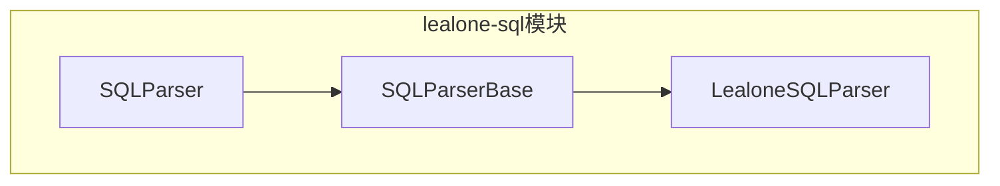
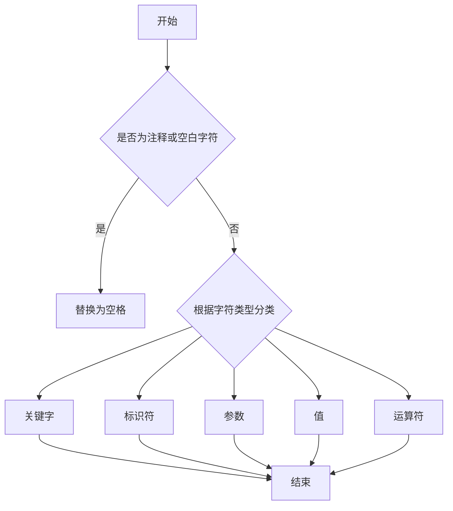
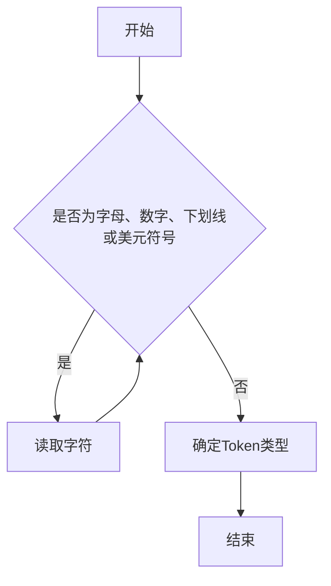
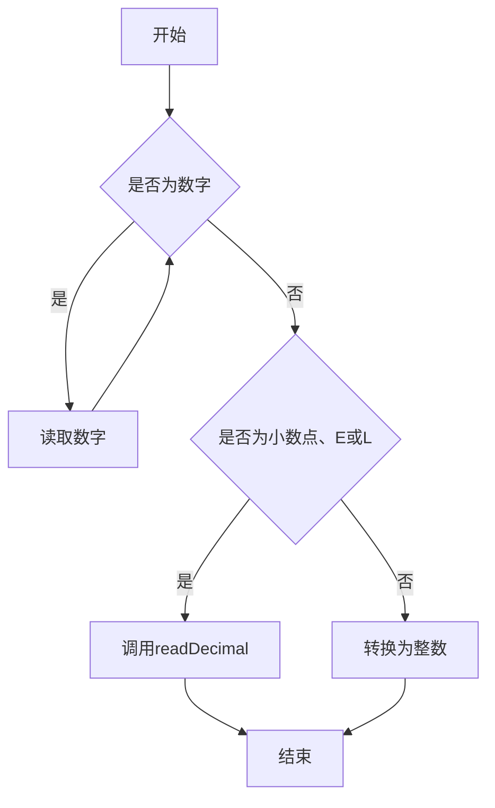
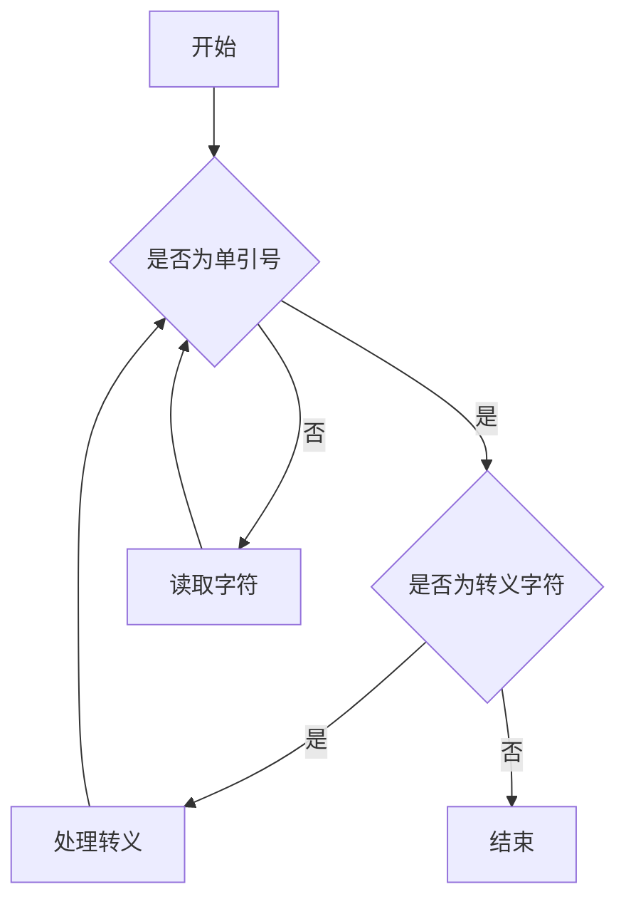
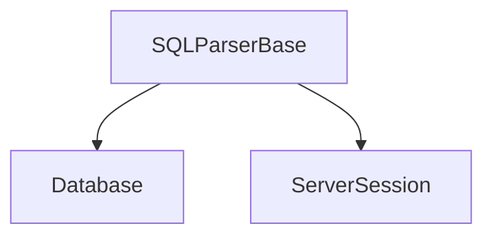

# 词法分析器

<cite>
**本文档引用的文件**   
- [LealoneSQLParser.java](file://lealone-sql\src\main\java\com\lealone\sql\LealoneSQLParser.java)
- [SQLParserBase.java](file://lealone-sql\src\main\java\com\lealone\sql\SQLParserBase.java)
</cite>

## 目录
1. [引言](#引言)
2. [项目结构](#项目结构)
3. [核心组件](#核心组件)
4. [架构概述](#架构概述)
5. [详细组件分析](#详细组件分析)
6. [依赖分析](#依赖分析)
7. [性能考虑](#性能考虑)
8. [故障排除指南](#故障排除指南)
9. [结论](#结论)
10. [附录](#附录)（如有必要）

## 引言
本文档深入解析LealoneSQLParser中的词法分析过程，详细阐述如何将原始SQL文本分解为有意义的词法单元（Token），包括关键字、标识符、运算符、常量等。文档将详细描述词法分析器的状态机设计和正则表达式匹配规则，说明如何处理SQL中的注释、字符串字面量、数字字面量等特殊语法结构。同时，文档将阐述词法分析错误的检测与报告机制，如非法字符、未闭合字符串等问题，并提供典型的SQL语句分词示例，展示从字符流到Token流的转换过程。最后，文档将解释词法分析器与语法分析器之间的接口协议和数据传递方式。

## 项目结构
Lealone项目的词法分析器主要位于`lealone-sql`模块中，核心实现类为`SQLParserBase`和其子类`LealoneSQLParser`。`SQLParserBase`类提供了词法分析的基础功能，包括字符类型分类、Token类型定义、词法单元识别等。`LealoneSQLParser`继承自`SQLParserBase`，并根据Lealone数据库的特定需求进行扩展和定制。

**图源**
- [SQLParserBase.java](file://lealone-sql\src\main\java\com\lealone\sql\SQLParserBase.java)
- [LealoneSQLParser.java](file://lealone-sql\src\main\java\com\lealone\sql\LealoneSQLParser.java)

**节源**
- [SQLParserBase.java](file://lealone-sql\src\main\java\com\lealone\sql\SQLParserBase.java)
- [LealoneSQLParser.java](file://lealone-sql\src\main\java\com\lealone\sql\LealoneSQLParser.java)

## 核心组件
词法分析器的核心组件包括字符类型分类器、Token类型定义、词法单元识别器和错误处理机制。`SQLParserBase`类中的`characterTypes`数组用于存储每个字符的类型，`currentTokenType`变量用于存储当前Token的类型，`currentToken`变量用于存储当前Token的文本内容。`read()`方法是词法分析的核心，它根据字符类型分类器的结果，识别出下一个Token，并更新`currentTokenType`和`currentToken`变量。

**节源**
- [SQLParserBase.java](file://lealone-sql\src\main\java\com\lealone\sql\SQLParserBase.java)

## 架构概述
LealoneSQLParser的词法分析器采用状态机设计，通过预处理SQL语句，将注释和空白字符替换为空格，然后逐字符扫描SQL语句，根据字符类型分类器的结果，识别出下一个Token。词法分析器支持多种Token类型，包括关键字、标识符、参数、结束符、值、等号、大于等于、大于、小于、小于等于、不等于、@、减号、加号、字符串连接、开括号、闭括号、空值、真、假、当前时间戳、当前日期、当前时间、行号和空间相交。

**图源**
- [SQLParserBase.java](file://lealone-sql\src\main\java\com\lealone\sql\SQLParserBase.java)

## 详细组件分析
### 词法分析过程
词法分析过程从`initialize`方法开始，该方法对SQL语句进行预处理，将注释和空白字符替换为空格，并初始化字符类型分类器。然后，`read`方法逐字符扫描SQL语句，根据字符类型分类器的结果，识别出下一个Token。`read`方法首先跳过空白字符，然后根据第一个字符的类型，进入相应的处理分支。例如，如果第一个字符是字母，则进入标识符处理分支；如果第一个字符是数字，则进入数字处理分支；如果第一个字符是单引号，则进入字符串处理分支。

#### 标识符处理
标识符处理分支首先读取连续的字母、数字、下划线和美元符号，直到遇到非标识符字符。然后，`getTokenType`方法根据标识符的文本内容，确定其Token类型。如果标识符是关键字，则返回相应的关键字Token类型；否则，返回标识符Token类型。

**图源**
- [SQLParserBase.java](file://lealone-sql\src\main\java\com\lealone\sql\SQLParserBase.java)

#### 数字处理
数字处理分支首先读取连续的数字，直到遇到非数字字符。如果遇到小数点、E或L，则调用`readDecimal`方法处理浮点数或长整数。否则，将读取的数字转换为整数，并返回值Token类型。

**图源**
- [SQLParserBase.java](file://lealone-sql\src\main\java\com\lealone\sql\SQLParserBase.java)

#### 字符串处理
字符串处理分支首先读取字符串内容，直到遇到未转义的单引号。如果遇到转义字符，则根据转义规则处理。然后，将读取的字符串内容转换为字符串值，并返回值Token类型。

**图源**
- [SQLParserBase.java](file://lealone-sql\src\main\java\com\lealone\sql\SQLParserBase.java)

### 错误处理
词法分析器的错误处理机制主要通过`getSyntaxError`方法实现。当遇到非法字符或未闭合的字符串时，`getSyntaxError`方法会抛出语法错误异常。`addExpected`方法用于记录期望的Token，以便在错误发生时提供更详细的错误信息。

**节源**
- [SQLParserBase.java](file://lealone-sql\src\main\java\com\lealone\sql\SQLParserBase.java)

## 依赖分析
词法分析器依赖于`Database`和`ServerSession`对象，用于获取数据库配置和会话信息。`Database`对象提供了数据库的配置信息，如是否将标识符转换为大写。`ServerSession`对象提供了会话信息，如当前模式和模式搜索路径。

**图源**
- [SQLParserBase.java](file://lealone-sql\src\main\java\com\lealone\sql\SQLParserBase.java)

**节源**
- [SQLParserBase.java](file://lealone-sql\src\main\java\com\lealone\sql\SQLParserBase.java)

## 性能考虑
词法分析器的性能主要受SQL语句的长度和复杂度影响。为了提高性能，词法分析器采用了预处理技术，将注释和空白字符替换为空格，减少了后续处理的复杂度。此外，词法分析器使用了缓存技术，将常用的字符串和值对象缓存起来，避免了重复创建。

## 故障排除指南
当遇到词法分析错误时，可以检查SQL语句中是否存在非法字符或未闭合的字符串。如果问题仍然存在，可以启用调试模式，查看词法分析器的详细日志，以确定问题的具体位置。

**节源**
- [SQLParserBase.java](file://lealone-sql\src\main\java\com\lealone\sql\SQLParserBase.java)

## 结论
LealoneSQLParser的词法分析器采用状态机设计，通过预处理SQL语句，将注释和空白字符替换为空格，然后逐字符扫描SQL语句，根据字符类型分类器的结果，识别出下一个Token。词法分析器支持多种Token类型，包括关键字、标识符、参数、结束符、值、等号、大于等于、大于、小于、小于等于、不等于、@、减号、加号、字符串连接、开括号、闭括号、空值、真、假、当前时间戳、当前日期、当前时间、行号和空间相交。词法分析器的错误处理机制通过`getSyntaxError`方法实现，当遇到非法字符或未闭合的字符串时，会抛出语法错误异常。词法分析器与语法分析器之间的接口协议和数据传递方式通过`currentTokenType`和`currentToken`变量实现。