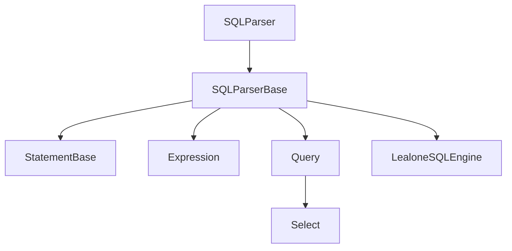
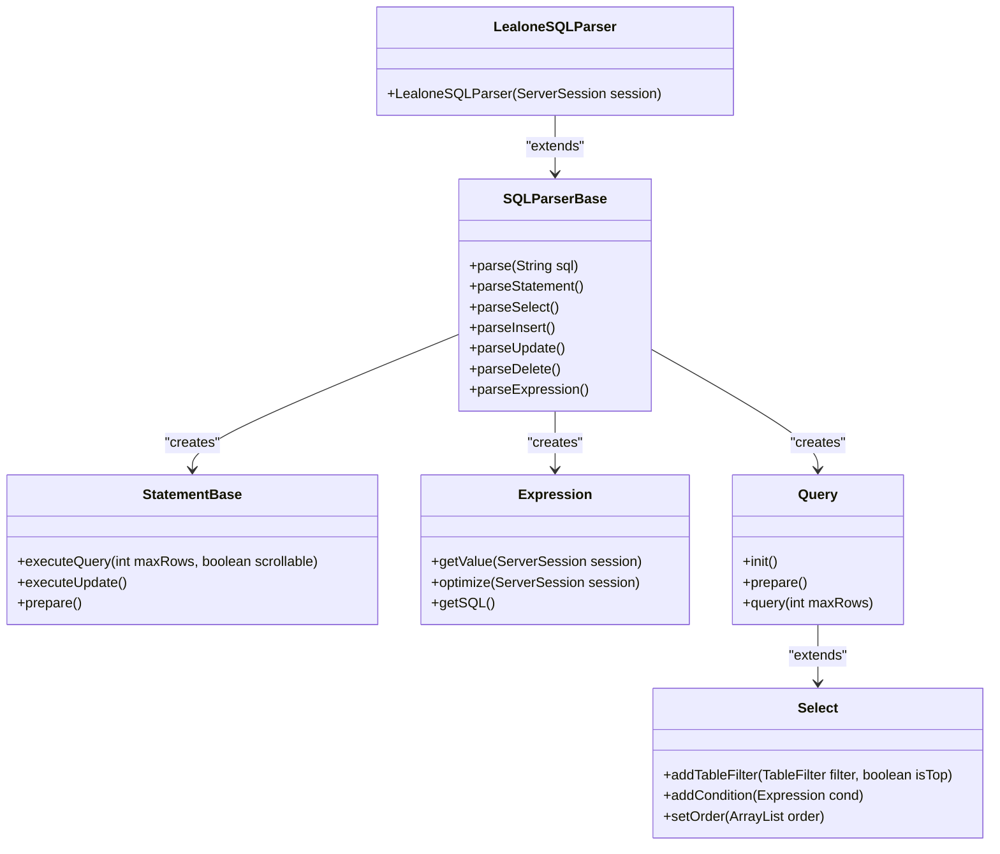
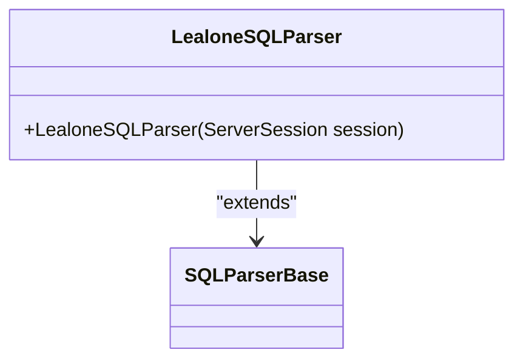
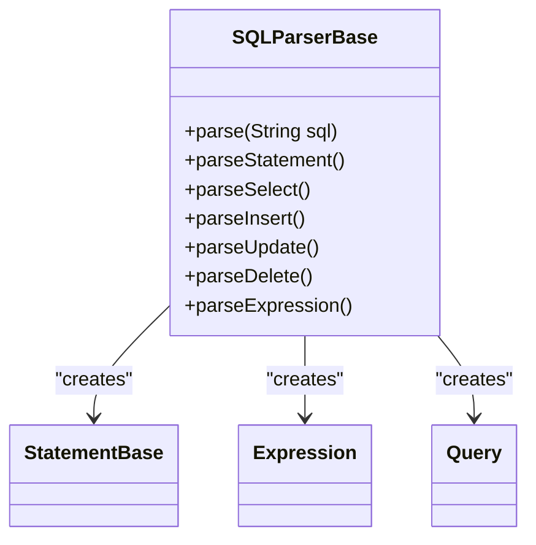
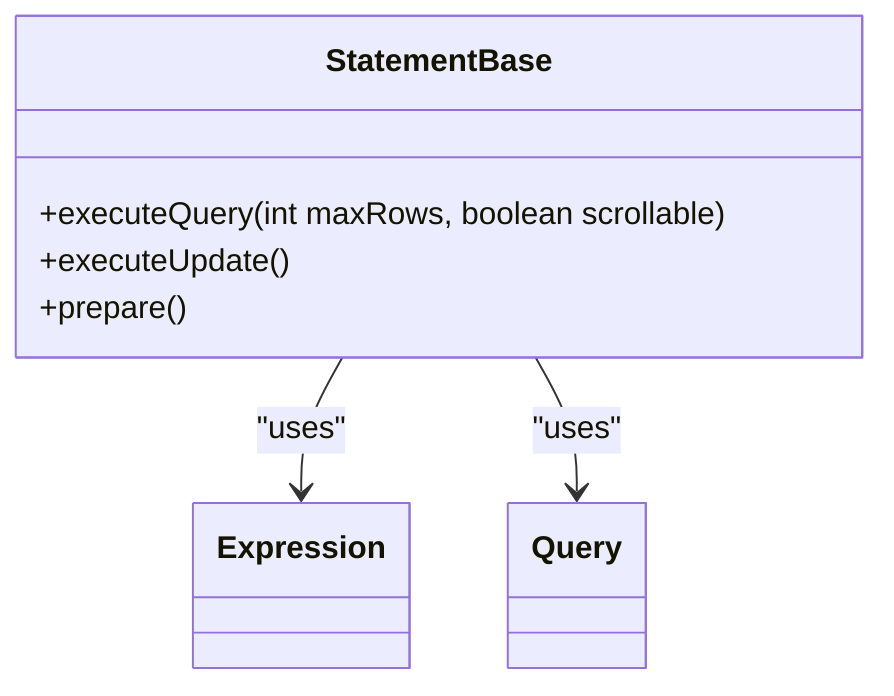
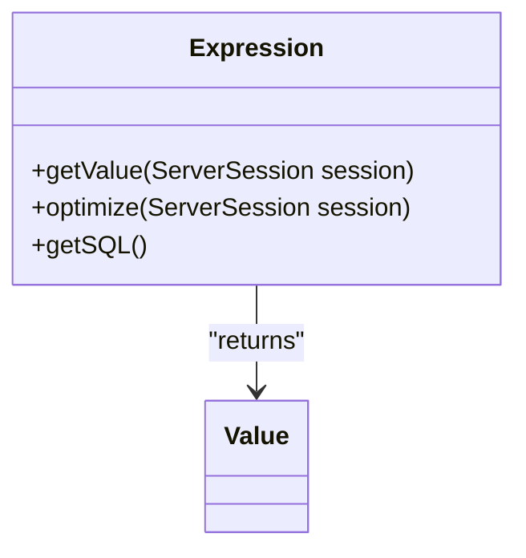
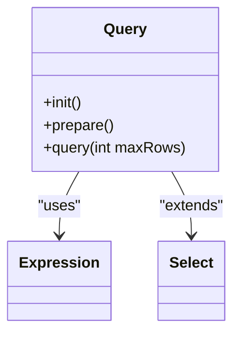
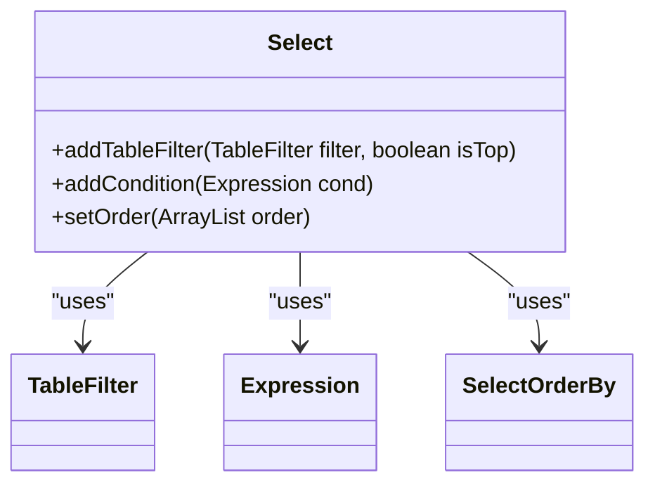
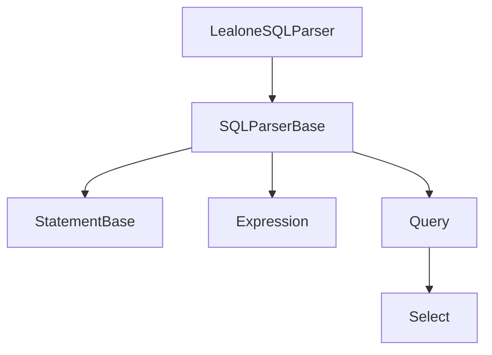

# 语法分析器

<cite>
**Referenced Files in This Document**   
- [LealoneSQLParser.java](https://github.com/lealone/Lealone/blob/master/lealone-sql/src/main/java/com/lealone/sql/LealoneSQLParser.java)
- [SQLParserBase.java](https://github.com/lealone/Lealone/blob/master/lealone-sql/src/main/java/com/lealone/sql/SQLParserBase.java)
- [StatementBase.java](https://github.com/lealone/Lealone/blob/master/lealone-sql/src/main/java/com/lealone/sql/StatementBase.java)
- [Expression.java](https://github.com/lealone/Lealone/blob/master/lealone-sql/src/main/java/com/lealone/sql/expression/Expression.java)
- [Select.java](https://github.com/lealone/Lealone/blob/master/lealone-sql/src/main/java/com/lealone/sql/query/Select.java)
- [Query.java](https://github.com/lealone/Lealone/blob/master/lealone-sql/src/main/java/com/lealone/sql/query/Query.java)
- [LealoneSQLEngine.java](https://github.com/lealone/Lealone/blob/master/lealone-sql/src/main/java/com/lealone/sql/LealoneSQLEngine.java)
</cite>

## 目录
1. [简介](#简介)
2. [项目结构](#项目结构)
3. [核心组件](#核心组件)
4. [架构概述](#架构概述)
5. [详细组件分析](#详细组件分析)
6. [依赖分析](#依赖分析)
7. [性能考虑](#性能考虑)
8. [故障排除指南](#故障排除指南)
9. [结论](#结论)

## 简介
本文档深入解析LealoneSQLParser的递归下降语法分析实现，解释如何基于词法单元流构建抽象语法树（AST）。详细描述了DDL（CREATE、ALTER、DROP）、DML（INSERT、UPDATE、DELETE）、查询语句（SELECT）等主要语句类型的语法规则和解析流程。同时，阐述了语法分析器如何处理嵌套查询、连接操作、条件表达式等复杂结构，以及语法错误的检测机制和错误恢复策略。

## 项目结构
Lealone项目的语法分析器主要位于`lealone-sql`模块中，其核心功能通过递归下降解析技术实现。该模块负责将SQL语句解析为抽象语法树（AST），并为后续的查询优化和执行提供基础。

**Diagram sources**
- [LealoneSQLParser.java](https://github.com/lealone/Lealone/blob/master/lealone-sql/src/main/java/com/lealone/sql/LealoneSQLParser.java#L1-L15)
- [SQLParserBase.java](https://github.com/lealone/Lealone/blob/master/lealone-sql/src/main/java/com/lealone/sql/SQLParserBase.java#L1-L800)
- [StatementBase.java](https://github.com/lealone/Lealone/blob/master/lealone-sql/src/main/java/com/lealone/sql/StatementBase.java#L1-L593)
- [Expression.java](https://github.com/lealone/Lealone/blob/master/lealone-sql/src/main/java/com/lealone/sql/expression/Expression.java#L1-L377)
- [Select.java](https://github.com/lealone/Lealone/blob/master/lealone-sql/src/main/java/com/lealone/sql/query/Select.java#L1-L800)
- [Query.java](https://github.com/lealone/Lealone/blob/master/lealone-sql/src/main/java/com/lealone/sql/query/Query.java#L1-L496)
- [LealoneSQLEngine.java](https://github.com/lealone/Lealone/blob/master/lealone-sql/src/main/java/com/lealone/sql/LealoneSQLEngine.java#L1-L27)

**Section sources**
- [LealoneSQLParser.java](https://github.com/lealone/Lealone/blob/master/lealone-sql/src/main/java/com/lealone/sql/LealoneSQLParser.java#L1-L15)
- [SQLParserBase.java](https://github.com/lealone/Lealone/blob/master/lealone-sql/src/main/java/com/lealone/sql/SQLParserBase.java#L1-L800)

## 核心组件
语法分析器的核心组件包括`LealoneSQLParser`、`SQLParserBase`、`StatementBase`、`Expression`、`Query`和`Select`类。这些组件共同协作，实现了从SQL语句到抽象语法树的转换过程。

**Section sources**
- [LealoneSQLParser.java](https://github.com/lealone/Lealone/blob/master/lealone-sql/src/main/java/com/lealone/sql/LealoneSQLParser.java#L1-L15)
- [SQLParserBase.java](https://github.com/lealone/Lealone/blob/master/lealone-sql/src/main/java/com/lealone/sql/SQLParserBase.java#L1-L800)
- [StatementBase.java](https://github.com/lealone/Lealone/blob/master/lealone-sql/src/main/java/com/lealone/sql/StatementBase.java#L1-L593)
- [Expression.java](https://github.com/lealone/Lealone/blob/master/lealone-sql/src/main/java/com/lealone/sql/expression/Expression.java#L1-L377)
- [Select.java](https://github.com/lealone/Lealone/blob/master/lealone-sql/src/main/java/com/lealone/sql/query/Select.java#L1-L800)
- [Query.java](https://github.com/lealone/Lealone/blob/master/lealone-sql/src/main/java/com/lealone/sql/query/Query.java#L1-L496)

## 架构概述
LealoneSQLParser继承自SQLParserBase，利用递归下降解析技术处理SQL语句。它通过一系列解析方法，如`parseSelect`、`parseInsert`、`parseUpdate`等，将SQL语句分解为抽象语法树（AST）。每个解析方法负责处理特定的SQL语句类型，并构建相应的AST节点。

**Diagram sources**
- [LealoneSQLParser.java](https://github.com/lealone/Lealone/blob/master/lealone-sql/src/main/java/com/lealone/sql/LealoneSQLParser.java#L1-L15)
- [SQLParserBase.java](https://github.com/lealone/Lealone/blob/master/lealone-sql/src/main/java/com/lealone/sql/SQLParserBase.java#L1-L800)
- [StatementBase.java](https://github.com/lealone/Lealone/blob/master/lealone-sql/src/main/java/com/lealone/sql/StatementBase.java#L1-L593)
- [Expression.java](https://github.com/lealone/Lealone/blob/master/lealone-sql/src/main/java/com/lealone/sql/expression/Expression.java#L1-L377)
- [Select.java](https://github.com/lealone/Lealone/blob/master/lealone-sql/src/main/java/com/lealone/sql/query/Select.java#L1-L800)
- [Query.java](https://github.com/lealone/Lealone/blob/master/lealone-sql/src/main/java/com/lealone/sql/query/Query.java#L1-L496)

## 详细组件分析
### LealoneSQLParser分析
LealoneSQLParser是Lealone数据库的SQL解析器，继承自SQLParserBase。它负责将SQL语句解析为抽象语法树（AST），并为后续的查询优化和执行提供基础。

#### 类图

**Diagram sources**
- [LealoneSQLParser.java](https://github.com/lealone/Lealone/blob/master/lealone-sql/src/main/java/com/lealone/sql/LealoneSQLParser.java#L1-L15)

### SQLParserBase分析
SQLParserBase是SQL解析器的基础类，提供了通用的解析方法和工具。它通过递归下降解析技术处理SQL语句，并构建抽象语法树（AST）。

#### 类图

**Diagram sources**
- [SQLParserBase.java](https://github.com/lealone/Lealone/blob/master/lealone-sql/src/main/java/com/lealone/sql/SQLParserBase.java#L1-L800)

### StatementBase分析
StatementBase是所有SQL语句的基类，提供了通用的执行方法和属性。它负责执行SQL语句并返回结果。

#### 类图

**Diagram sources**
- [StatementBase.java](https://github.com/lealone/Lealone/blob/master/lealone-sql/src/main/java/com/lealone/sql/StatementBase.java#L1-L593)

### Expression分析
Expression是SQL表达式的基类，提供了通用的求值和优化方法。它负责计算表达式的值并进行优化。

#### 类图

**Diagram sources**
- [Expression.java](https://github.com/lealone/Lealone/blob/master/lealone-sql/src/main/java/com/lealone/sql/expression/Expression.java#L1-L377)

### Query分析
Query是查询语句的基类，提供了通用的初始化和执行方法。它负责初始化查询并执行。

#### 类图

**Diagram sources**
- [Query.java](https://github.com/lealone/Lealone/blob/master/lealone-sql/src/main/java/com/lealone/sql/query/Query.java#L1-L496)

### Select分析
Select是SELECT语句的具体实现，提供了添加表过滤器、条件和排序等功能。它负责构建SELECT语句的抽象语法树（AST）。

#### 类图

**Diagram sources**
- [Select.java](https://github.com/lealone/Lealone/blob/master/lealone-sql/src/main/java/com/lealone/sql/query/Select.java#L1-L800)

## 依赖分析
语法分析器的各个组件之间存在紧密的依赖关系。LealoneSQLParser依赖于SQLParserBase提供的解析方法，而SQLParserBase又依赖于StatementBase、Expression、Query和Select等组件。

**Diagram sources**
- [LealoneSQLParser.java](https://github.com/lealone/Lealone/blob/master/lealone-sql/src/main/java/com/lealone/sql/LealoneSQLParser.java#L1-L15)
- [SQLParserBase.java](https://github.com/lealone/Lealone/blob/master/lealone-sql/src/main/java/com/lealone/sql/SQLParserBase.java#L1-L800)
- [StatementBase.java](https://github.com/lealone/Lealone/blob/master/lealone-sql/src/main/java/com/lealone/sql/StatementBase.java#L1-L593)
- [Expression.java](https://github.com/lealone/Lealone/blob/master/lealone-sql/src/main/java/com/lealone/sql/expression/Expression.java#L1-L377)
- [Select.java](https://github.com/lealone/Lealone/blob/master/lealone-sql/src/main/java/com/lealone/sql/query/Select.java#L1-L800)
- [Query.java](https://github.com/lealone/Lealone/blob/master/lealone-sql/src/main/java/com/lealone/sql/query/Query.java#L1-L496)

**Section sources**
- [LealoneSQLParser.java](https://github.com/lealone/Lealone/blob/master/lealone-sql/src/main/java/com/lealone/sql/LealoneSQLParser.java#L1-L15)
- [SQLParserBase.java](https://github.com/lealone/Lealone/blob/master/lealone-sql/src/main/java/com/lealone/sql/SQLParserBase.java#L1-L800)
- [StatementBase.java](https://github.com/lealone/Lealone/blob/master/lealone-sql/src/main/java/com/lealone/sql/StatementBase.java#L1-L593)
- [Expression.java](https://github.com/lealone/Lealone/blob/master/lealone-sql/src/main/java/com/lealone/sql/expression/Expression.java#L1-L377)
- [Select.java](https://github.com/lealone/Lealone/blob/master/lealone-sql/src/main/java/com/lealone/sql/query/Select.java#L1-L800)
- [Query.java](https://github.com/lealone/Lealone/blob/master/lealone-sql/src/main/java/com/lealone/sql/query/Query.java#L1-L496)

## 性能考虑
语法分析器在设计时考虑了性能优化。通过递归下降解析技术，可以高效地处理复杂的SQL语句。此外，通过缓存和预编译机制，可以减少重复解析的开销。

## 故障排除指南
在使用语法分析器时，可能会遇到一些常见的问题，如语法错误、解析失败等。可以通过检查SQL语句的格式和结构，确保其符合SQL标准来解决这些问题。

**Section sources**
- [SQLParserBase.java](https://github.com/lealone/Lealone/blob/master/lealone-sql/src/main/java/com/lealone/sql/SQLParserBase.java#L1-L800)

## 结论
LealoneSQLParser通过递归下降解析技术实现了高效的SQL语句解析。它能够处理各种复杂的SQL语句，并构建出准确的抽象语法树（AST）。通过与其他组件的紧密协作，为后续的查询优化和执行提供了坚实的基础。