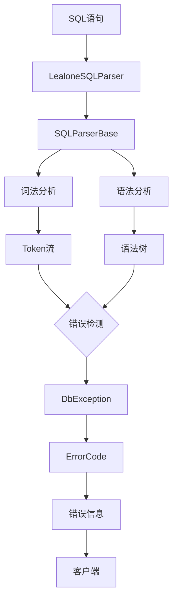
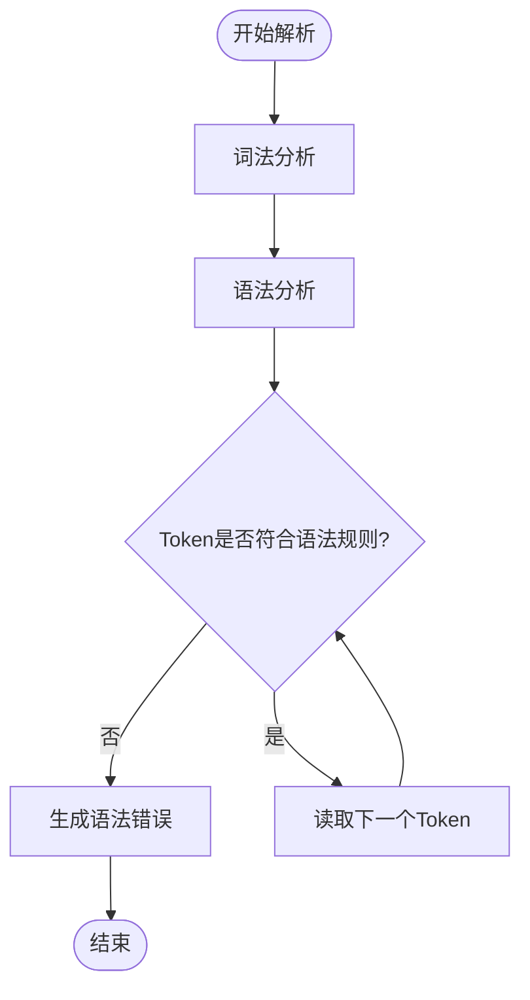
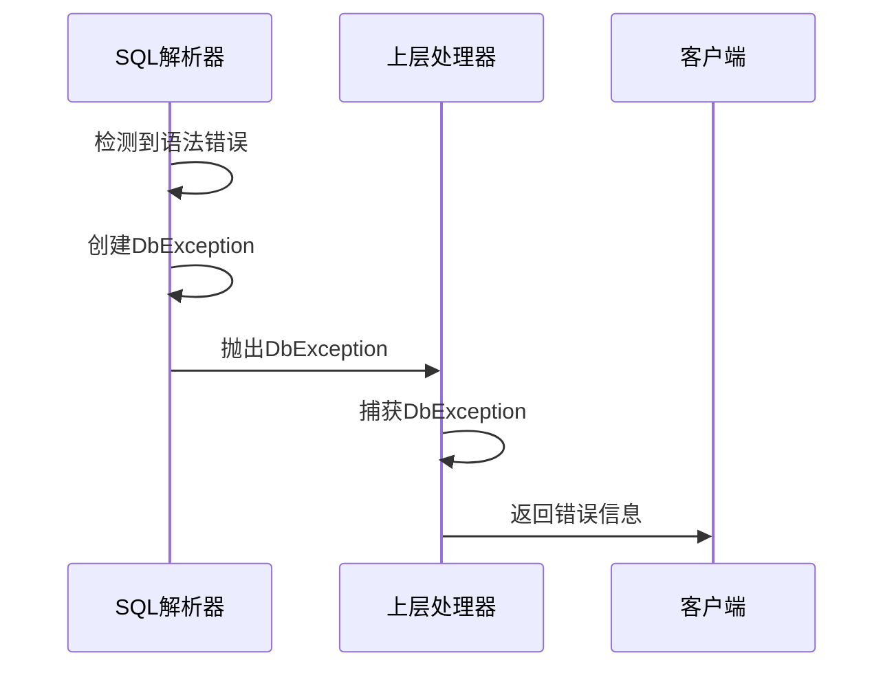

# 错误处理与校验

**本文档引用的文件**   
- [LealoneSQLParser.java](https://github.com/lealone/Lealone/blob/master/lealone-sql/src/main/java/com/lealone/sql/LealoneSQLParser.java)
- [SQLParserBase.java](https://github.com/lealone/Lealone/blob/master/lealone-sql/src/main/java/com/lealone/sql/SQLParserBase.java)
- [DbException.java](https://github.com/lealone/Lealone/blob/master/lealone-common/src/main/java/com/lealone/common/exceptions/DbException.java)
- [ErrorCode.java](https://github.com/lealone/Lealone/blob/master/lealone-common/src/main/java/com/lealone/db/api/ErrorCode.java)
- [StringUtils.java](https://github.com/lealone/Lealone/blob/master/lealone-common/src/main/java/com/lealone/common/util/StringUtils.java)

## 目录
1. [引言](#引言)
2. [错误处理体系结构](#错误处理体系结构)
3. [词法与语法分析阶段的错误检测](#词法与语法分析阶段的错误检测)
4. [常见SQL语法错误类型](#常见sql语法错误类型)
5. [错误信息构造原则](#错误信息构造原则)
6. [解析器错误恢复技术](#解析器错误恢复技术)
7. [异常传递机制](#异常传递机制)
8. [代码示例与最佳实践](#代码示例与最佳实践)

## 引言
Lealone数据库系统提供了一套完整的SQL解析错误处理机制，旨在在词法和语法分析阶段准确识别并报告各种SQL语法错误。该机制通过`LealoneSQLParser`和`SQLParserBase`类实现，结合`DbException`异常体系，为用户提供清晰、准确的错误信息。本文档将深入解析这一错误处理机制，涵盖错误检测、报告、恢复以及异常传递的全过程。

## 错误处理体系结构
Lealone的SQL解析错误处理体系由多个核心组件构成，包括SQL解析器、异常类和错误代码定义。这些组件协同工作，确保在解析SQL语句时能够及时发现并处理错误。

**图源**
- [LealoneSQLParser.java](https://github.com/lealone/Lealone/blob/master/lealone-sql/src/main/java/com/lealone/sql/LealoneSQLParser.java)
- [SQLParserBase.java](https://github.com/lealone/Lealone/blob/master/lealone-sql/src/main/java/com/lealone/sql/SQLParserBase.java)
- [DbException.java](https://github.com/lealone/Lealone/blob/master/lealone-common/src/main/java/com/lealone/common/exceptions/DbException.java)
- [ErrorCode.java](https://github.com/lealone/Lealone/blob/master/lealone-common/src/main/java/com/lealone/db/api/ErrorCode.java)

**本节源**
- [LealoneSQLParser.java](https://github.com/lealone/Lealone/blob/master/lealone-sql/src/main/java/com/lealone/sql/LealoneSQLParser.java#L10-L15)
- [SQLParserBase.java](https://github.com/lealone/Lealone/blob/master/lealone-sql/src/main/java/com/lealone/sql/SQLParserBase.java#L186-L239)

## 词法与语法分析阶段的错误检测
在词法分析阶段，解析器将SQL语句分解为一系列Token。如果遇到无法识别的字符或格式错误的字符串，将立即抛出语法错误。在语法分析阶段，解析器根据预定义的语法规则验证Token序列。当遇到不符合语法规则的Token时，解析器会调用`getSyntaxError`方法生成错误信息。

**图源**
- [SQLParserBase.java](https://github.com/lealone/Lealone/blob/master/lealone-sql/src/main/java/com/lealone/sql/SQLParserBase.java#L3064-L3116)
- [StringUtils.java](https://github.com/lealone/Lealone/blob/master/lealone-common/src/main/java/com/lealone/common/util/StringUtils.java#L222-L227)

**本节源**
- [SQLParserBase.java](https://github.com/lealone/Lealone/blob/master/lealone-sql/src/main/java/com/lealone/sql/SQLParserBase.java#L3064-L3116)
- [StringUtils.java](https://github.com/lealone/Lealone/blob/master/lealone-common/src/main/java/com/lealone/common/util/StringUtils.java#L222-L227)

## 常见SQL语法错误类型
LealoneSQL解析器能够识别多种常见的SQL语法错误，包括但不限于：

- **语法结构错误**：如缺少关键字、错误的语句顺序等。
- **关键字拼写错误**：如将`SELECT`拼写为`SELETC`。
- **括号不匹配**：如`SELECT * FROM (table1 JOIN table2)`中缺少右括号。

这些错误在解析过程中会被逐一检测并报告。

**本节源**
- [SQLParserBase.java](https://github.com/lealone/Lealone/blob/master/lealone-sql/src/main/java/com/lealone/sql/SQLParserBase.java#L3064-L3116)
- [ErrorCode.java](https://github.com/lealone/Lealone/blob/master/lealone-common/src/main/java/com/lealone/db/api/ErrorCode.java#L273-L292)

## 错误信息构造原则
错误信息的构造遵循一定的原则，以确保用户能够快速定位和解决问题。错误信息通常包括错误码、错误消息和位置信息（行号、列号）。例如，当遇到语法错误时，解析器会使用`StringUtils.addAsterisk`方法在错误位置添加`[*]`标记，以便用户直观地看到错误发生的位置。

**本节源**
- [DbException.java](https://github.com/lealone/Lealone/blob/master/lealone-common/src/main/java/com/lealone/common/exceptions/DbException.java#L183-L186)
- [StringUtils.java](https://github.com/lealone/Lealone/blob/master/lealone-common/src/main/java/com/lealone/common/util/StringUtils.java#L222-L227)

## 解析器错误恢复技术
为了保证在发现一个错误后能继续解析后续语句，Lealone解析器采用了错误恢复技术。当检测到错误时，解析器会尝试跳过错误的Token，寻找下一个同步点，然后继续解析。这种技术有助于用户一次性发现多个错误，而不是每次只报告一个错误。

**本节源**
- [SQLParserBase.java](https://github.com/lealone/Lealone/blob/master/lealone-sql/src/main/java/com/lealone/sql/SQLParserBase.java#L287-L289)

## 异常传递机制
错误从解析器传递到上层调用者的过程通过`DbException`异常体系实现。当解析器检测到错误时，会创建一个`DbException`实例，并将其抛出。上层调用者捕获该异常后，可以获取详细的错误信息，并根据需要进行处理。

**图源**
- [DbException.java](https://github.com/lealone/Lealone/blob/master/lealone-common/src/main/java/com/lealone/common/exceptions/DbException.java#L138-L174)
- [SQLParserBase.java](https://github.com/lealone/Lealone/blob/master/lealone-sql/src/main/java/com/lealone/sql/SQLParserBase.java#L287-L289)

**本节源**
- [DbException.java](https://github.com/lealone/Lealone/blob/master/lealone-common/src/main/java/com/lealone/common/exceptions/DbException.java#L138-L174)
- [SQLParserBase.java](https://github.com/lealone/Lealone/blob/master/lealone-sql/src/main/java/com/lealone/sql/SQLParserBase.java#L287-L289)

## 代码示例与最佳实践
在实际开发中，建议开发者充分利用Lealone提供的错误处理机制，编写健壮的SQL语句。例如，可以通过捕获`DbException`来处理SQL解析错误，并向用户提供友好的错误提示。

**本节源**
- [DbException.java](https://github.com/lealone/Lealone/blob/master/lealone-common/src/main/java/com/lealone/common/exceptions/DbException.java#L138-L174)
- [SQLParserBase.java](https://github.com/lealone/Lealone/blob/master/lealone-sql/src/main/java/com/lealone/sql/SQLParserBase.java#L287-L289)