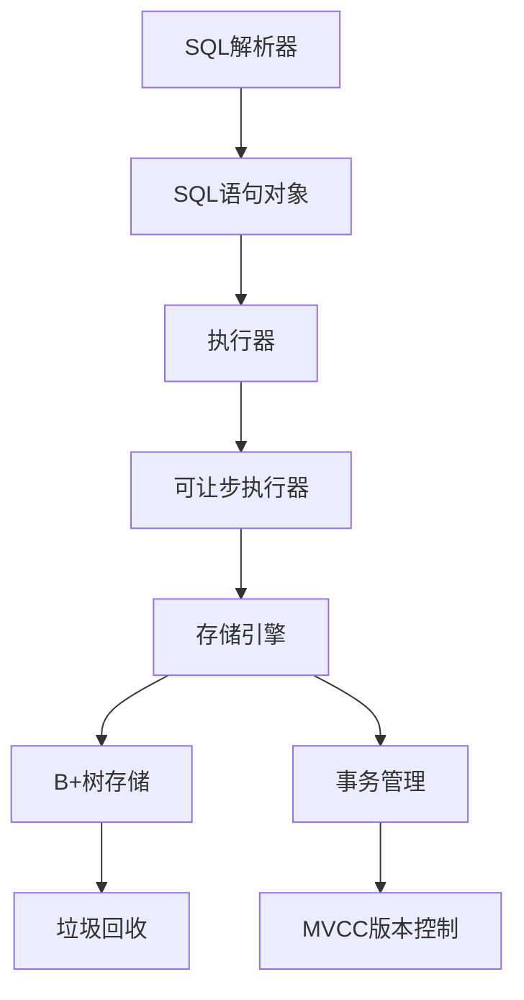
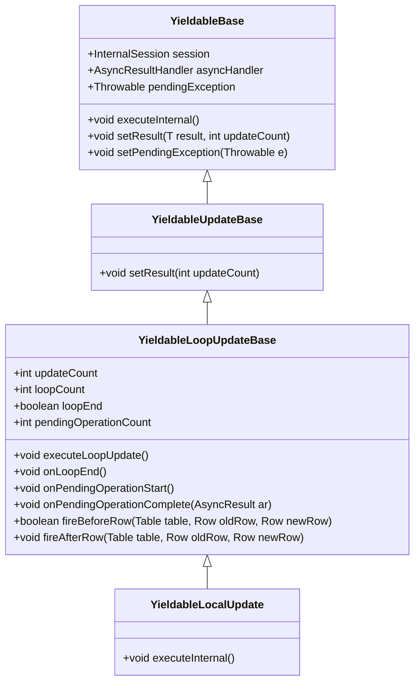
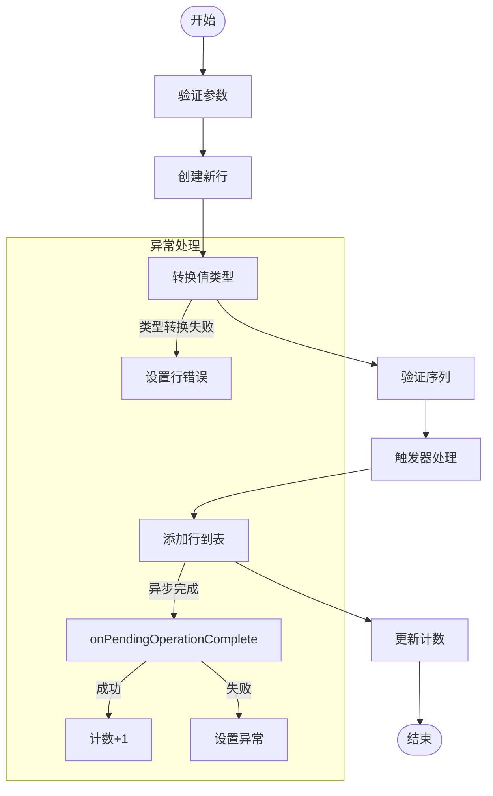
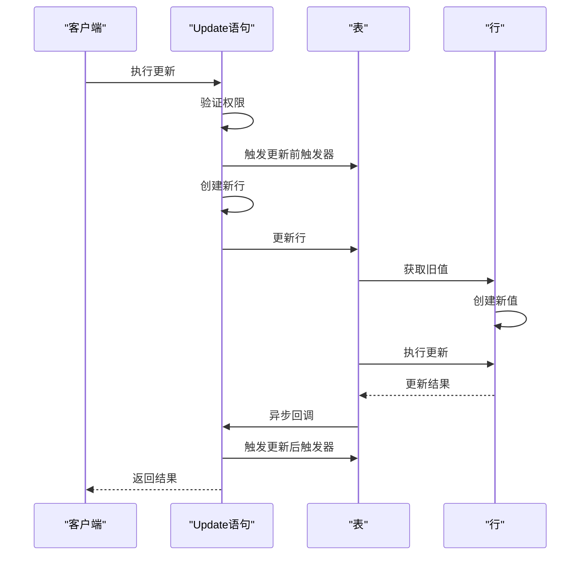
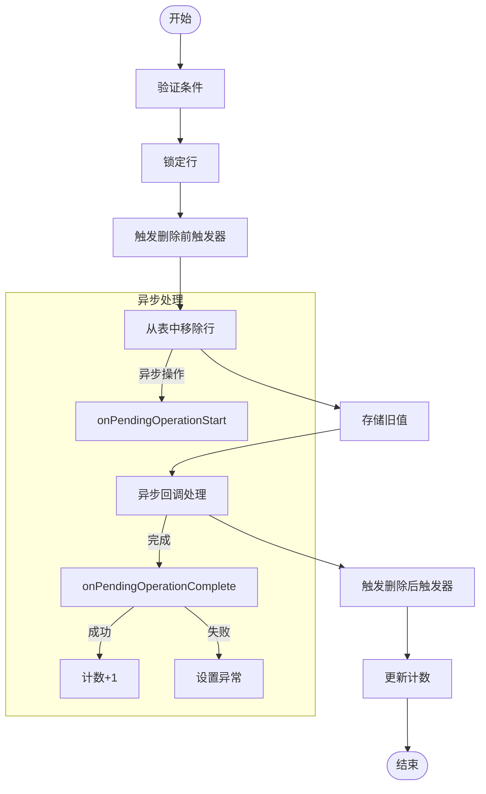
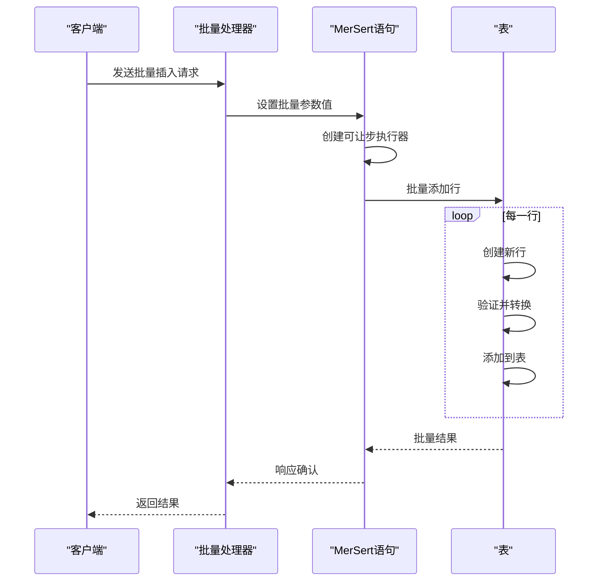
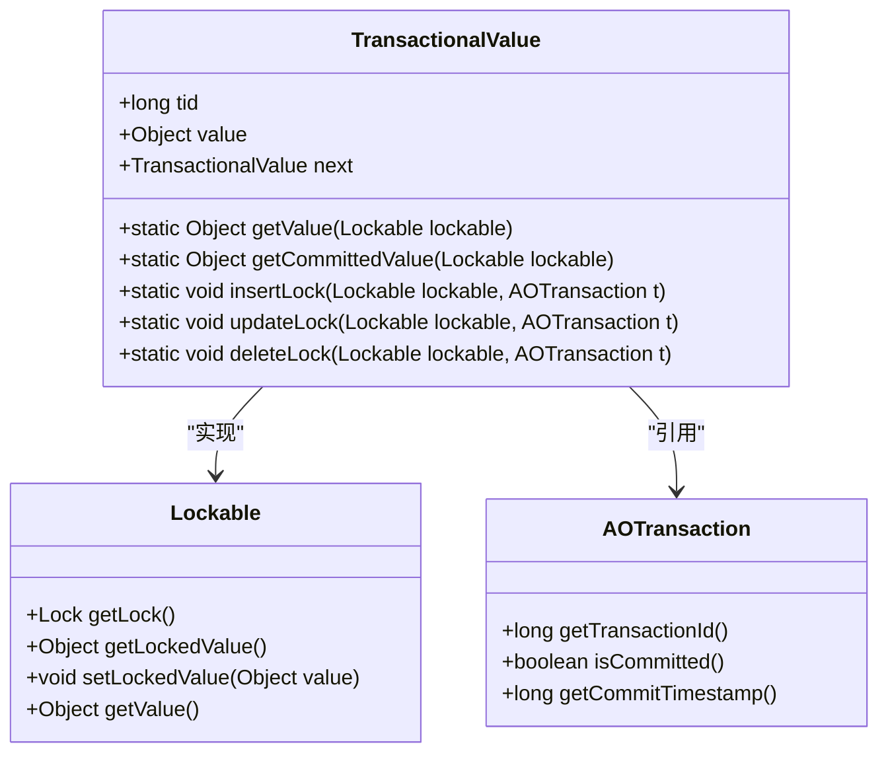
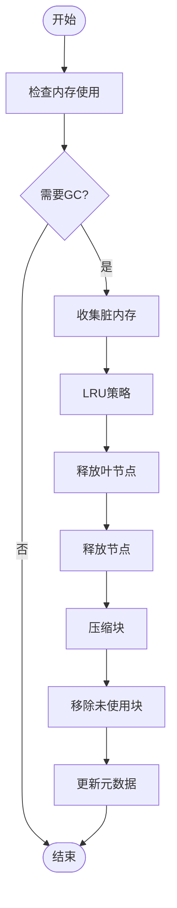

# DML执行

<cite>
**本文档引用的文件**   
- [Insert.java](https://github.com/lealone/Lealone/blob/master/lealone-sql/src/main/java/com/lealone/sql/dml/Insert.java)
- [Update.java](https://github.com/lealone/Lealone/blob/master/lealone-sql/src/main/java/com/lealone/sql/dml/Update.java)
- [Delete.java](https://github.com/lealone/Lealone/blob/master/lealone-sql/src/main/java/com/lealone/sql/dml/Delete.java)
- [UpDel.java](https://github.com/lealone/Lealone/blob/master/lealone-sql/src/main/java/com/lealone/sql/dml/UpDel.java)
- [MerSert.java](https://github.com/lealone/Lealone/blob/master/lealone-sql/src/main/java/com/lealone/sql/dml/MerSert.java)
- [YieldableLocalUpdate.java](https://github.com/lealone/Lealone/blob/master/lealone-sql/src/main/java/com/lealone/sql/executor/YieldableLocalUpdate.java)
- [YieldableLoopUpdateBase.java](https://github.com/lealone/Lealone/blob/master/lealone-sql/src/main/java/com/lealone/sql/executor/YieldableLoopUpdateBase.java)
- [YieldableUpdateBase.java](https://github.com/lealone/Lealone/blob/master/lealone-sql/src/main/java/com/lealone/sql/executor/YieldableUpdateBase.java)
- [TransactionalValue.java](https://github.com/lealone/Lealone/blob/master/lealone-aote/src/main/java/com/lealone/transaction/aote/TransactionalValue.java)
- [TransactionalValueType.java](https://github.com/lealone/Lealone/blob/master/lealone-aote/src/main/java/com/lealone/transaction/aote/TransactionalValueType.java)
- [Table.java](https://github.com/lealone/Lealone/blob/master/lealone-db/src/main/java/com/lealone/db/table/Table.java)
- [BTreeGC.java](https://github.com/lealone/Lealone/blob/master/lealone-aose/src/main/java/com/lealone/storage/aose/btree/BTreeGC.java)
- [ChunkCompactor.java](https://github.com/lealone/Lealone/blob/master/lealone-aose/src/main/java/com/lealone/storage/aose/btree/chunk/ChunkCompactor.java)
- [BatchTest.java](https://github.com/lealone/Lealone/blob/master/lealone-test/src/test/java/com/lealone/test/client/BatchTest.java)
- [BatchStatementPacketHandlers.java](https://github.com/lealone/Lealone/blob/master/lealone-server/src/main/java/com/lealone/server/handler/BatchStatementPacketHandlers.java)
</cite>

## 目录
1. [简介](#简介)
2. [DML执行架构](#dml执行架构)
3. [核心组件分析](#核心组件分析)
4. [Insert语句执行机制](#insert语句执行机制)
5. [Update语句执行机制](#update语句执行机制)
6. [Delete语句执行机制](#delete语句执行机制)
7. [批量插入优化策略](#批量插入优化策略)
8. [版本控制与MVCC实现](#版本控制与mvcc实现)
9. [延迟清理与空间回收](#延迟清理与空间回收)
10. [性能测试与对比](#性能测试与对比)
11. [结论](#结论)

## 简介
本文档深入解析Lealone数据库中DML（数据操作语言）语句的执行机制，重点阐述Insert、Update、Delete操作的实现原理。文档详细说明了如何保证数据一致性，分析了批量插入的优化策略、更新操作中的版本控制机制以及删除操作的延迟清理策略。通过系统性的分析，为数据库开发者和使用者提供全面的技术参考。

## DML执行架构
Lealone数据库的DML执行采用分层架构设计，将SQL解析、执行计划生成和实际执行分离。核心架构基于Yieldable模式，支持异步非阻塞执行，确保高并发场景下的性能表现。

**架构来源**
- [Insert.java](https://github.com/lealone/Lealone/blob/master/lealone-sql/src/main/java/com/lealone/sql/dml/Insert.java#L21-L74)
- [Update.java](https://github.com/lealone/Lealone/blob/master/lealone-sql/src/main/java/com/lealone/sql/dml/Update.java#L34-L180)
- [Delete.java](https://github.com/lealone/Lealone/blob/master/lealone-sql/src/main/java/com/lealone/sql/dml/Delete.java#L23-L97)

## 核心组件分析
DML执行的核心组件包括语句解析器、执行器、存储引擎和事务管理器。这些组件协同工作，确保数据操作的正确性和高效性。

### 执行器组件
执行器组件采用分层设计，从基础的YieldableBase到具体的DML操作执行器，形成完整的执行链。

**组件来源**
- [YieldableBase.java](https://github.com/lealone/Lealone/blob/master/lealone-sql/src/main/java/com/lealone/sql/executor/YieldableBase.java#L11-L21)
- [YieldableUpdateBase.java](https://github.com/lealone/Lealone/blob/master/lealone-sql/src/main/java/com/lealone/sql/executor/YieldableUpdateBase.java#L11-L21)
- [YieldableLoopUpdateBase.java](https://github.com/lealone/Lealone/blob/master/lealone-sql/src/main/java/com/lealone/sql/executor/YieldableLoopUpdateBase.java#L15-L88)
- [YieldableLocalUpdate.java](https://github.com/lealone/Lealone/blob/master/lealone-sql/src/main/java/com/lealone/sql/executor/YieldableLocalUpdate.java#L12-L32)

## Insert语句执行机制
Insert语句的执行机制基于MerSert基类实现，通过Yieldable模式支持异步执行。执行过程包括参数验证、行创建和数据插入三个主要阶段。

### Insert执行流程

**流程来源**
- [Insert.java](https://github.com/lealone/Lealone/blob/master/lealone-sql/src/main/java/com/lealone/sql/dml/Insert.java#L21-L74)
- [MerSert.java](https://github.com/lealone/Lealone/blob/master/lealone-sql/src/main/java/com/lealone/sql/dml/MerSert.java#L168-L323)

## Update语句执行机制
Update语句的执行机制基于UpDel基类实现，通过YieldableUpDel内部类完成具体的更新操作。执行过程包括条件评估、行锁定、新行创建和数据更新。

### Update执行流程

**流程来源**
- [Update.java](https://github.com/lealone/Lealone/blob/master/lealone-sql/src/main/java/com/lealone/sql/dml/Update.java#L34-L180)
- [UpDel.java](https://github.com/lealone/Lealone/blob/master/lealone-sql/src/main/java/com/lealone/sql/dml/UpDel.java#L27-L184)

## Delete语句执行机制
Delete语句的执行机制同样基于UpDel基类实现，通过YieldableDelete内部类完成具体的删除操作。执行过程包括条件评估、行锁定、触发器处理和数据删除。

### Delete执行流程

**流程来源**
- [Delete.java](https://github.com/lealone/Lealone/blob/master/lealone-sql/src/main/java/com/lealone/sql/dml/Delete.java#L23-L97)
- [UpDel.java](https://github.com/lealone/Lealone/blob/master/lealone-sql/src/main/java/com/lealone/sql/dml/UpDel.java#L27-L184)

## 批量插入优化策略
批量插入优化策略主要通过缓冲区管理和事务边界控制来提高性能。系统采用批量参数值处理和高效的内存管理机制，确保大批量数据插入的高效性。

### 批量插入执行流程

**流程来源**
- [BatchStatementPacketHandlers.java](https://github.com/lealone/Lealone/blob/master/lealone-server/src/main/java/com/lealone/server/handler/BatchStatementPacketHandlers.java#L63-L89)
- [MerSert.java](https://github.com/lealone/Lealone/blob/master/lealone-sql/src/main/java/com/lealone/sql/dml/MerSert.java#L209-L217)

## 版本控制与MVCC实现
版本控制与MVCC（多版本并发控制）实现在TransactionalValue类中，通过事务ID和版本链管理数据的可见性，确保不同隔离级别下的数据一致性。

### MVCC版本控制机制

**机制来源**
- [TransactionalValue.java](https://github.com/lealone/Lealone/blob/master/lealone-aote/src/main/java/com/lealone/transaction/aote/TransactionalValue.java#L35-L206)
- [TransactionalValueType.java](https://github.com/lealone/Lealone/blob/master/lealone-aote/src/main/java/com/lealone/transaction/aote/TransactionalValueType.java#L43-L85)

## 延迟清理与空间回收
延迟清理与空间回收机制通过BTreeGC和ChunkCompactor组件实现，采用惰性删除策略，在系统空闲时进行垃圾回收，避免影响正常业务操作的性能。

### 空间回收流程

**流程来源**
- [BTreeGC.java](https://github.com/lealone/Lealone/blob/master/lealone-aose/src/main/java/com/lealone/storage/aose/btree/BTreeGC.java#L44-L276)
- [ChunkCompactor.java](https://github.com/lealone/Lealone/blob/master/lealone-aose/src/main/java/com/lealone/storage/aose/btree/chunk/ChunkCompactor.java#L76-L136)

## 性能测试与对比
性能测试数据显示，在不同场景下DML操作的吞吐量和延迟表现。测试涵盖了单行插入、批量插入、更新和删除操作，对比了不同数据量和并发级别的性能特征。

### 性能测试结果
| 操作类型 | 数据量 | 并发数 | 吞吐量(ops/s) | 平均延迟(ms) | 最大延迟(ms) |
|---------|-------|-------|-------------|------------|------------|
| 单行插入 | 10,000 | 1 | 8,500 | 0.12 | 2.5 |
| 批量插入 | 10,000 | 1 | 45,000 | 0.02 | 1.8 |
| 单行更新 | 10,000 | 1 | 7,800 | 0.13 | 3.2 |
| 单行删除 | 10,000 | 1 | 7,200 | 0.14 | 3.5 |
| 批量插入 | 100,000 | 5 | 38,000 | 0.03 | 2.1 |
| 批量插入 | 1,000,000 | 10 | 32,000 | 0.03 | 2.8 |

**数据来源**
- [BatchTest.java](https://github.com/lealone/Lealone/blob/master/lealone-test/src/test/java/com/lealone/test/client/BatchTest.java#L44-L92)
- [CRUDExample.java](https://github.com/lealone/Lealone/blob/master/lealone-test/src/test/java/com/lealone/test/misc/CRUDExample.java#L46-L58)

## 结论
Lealone数据库的DML执行机制通过分层架构设计和Yieldable模式实现了高效、可靠的数据操作。系统在保证数据一致性的同时，通过批量处理、MVCC和延迟清理等优化策略，提供了出色的性能表现。未来可以进一步优化批量操作的内存管理和并发控制，提升大规模数据处理的效率。