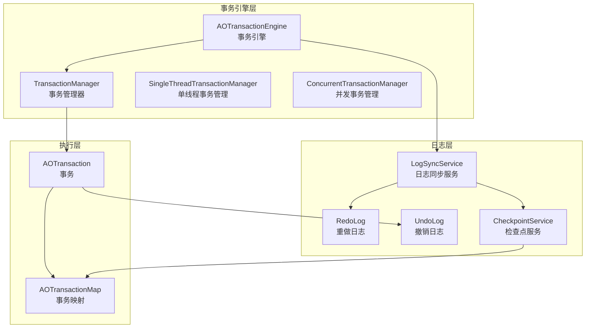
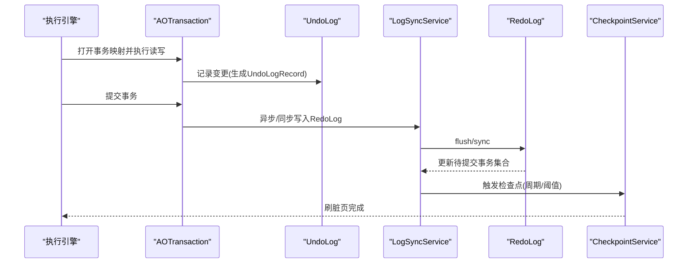
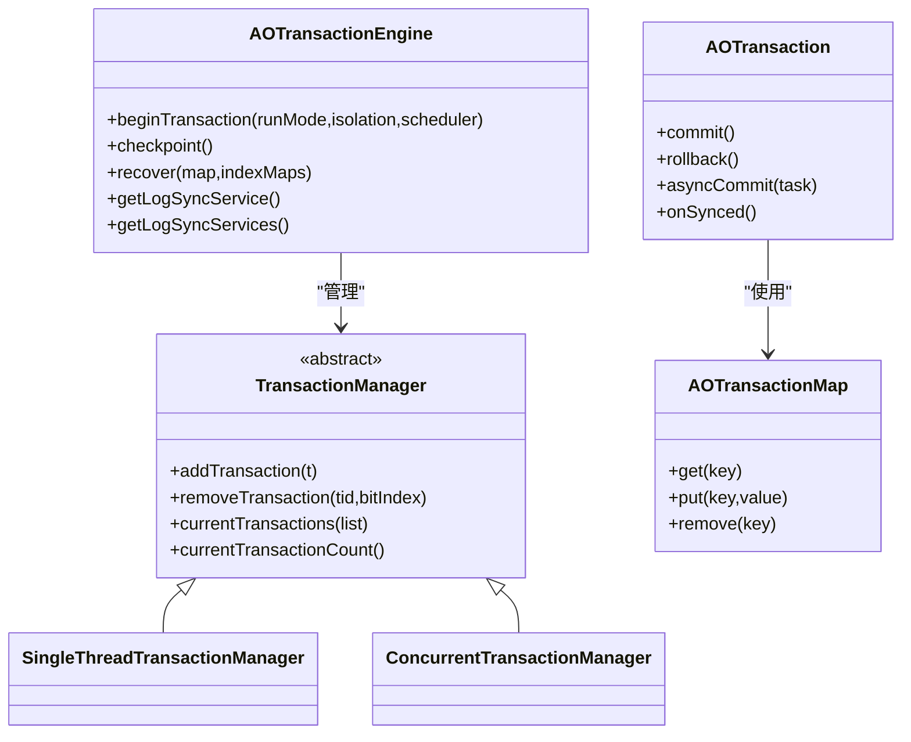
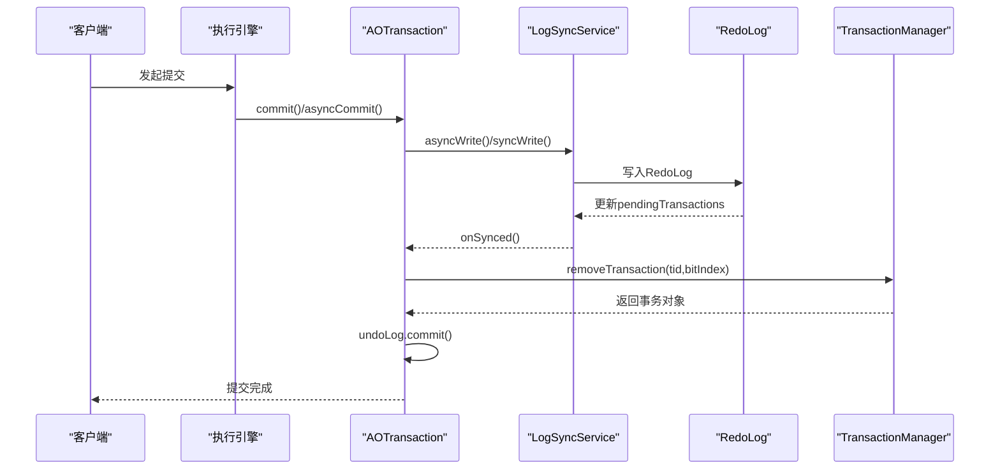
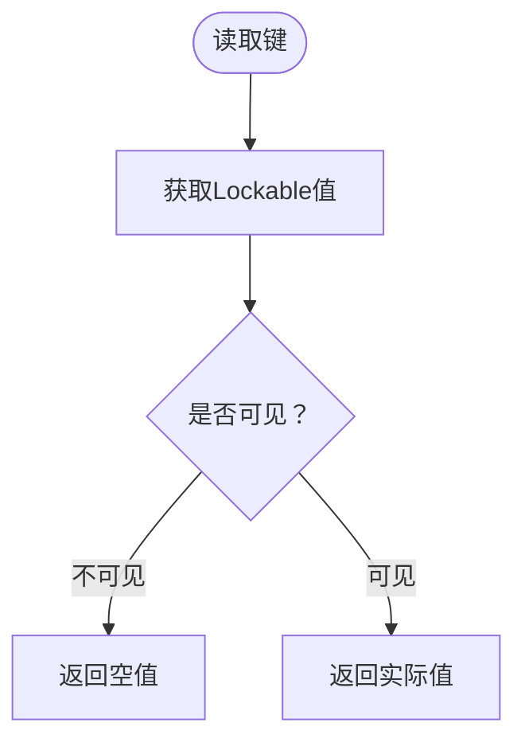
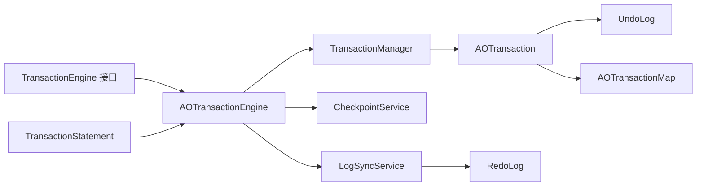

# 事务协同

<cite>
**本文引用的文件列表**
- [AOTransactionEngine.java](https://github.com/lealone/Lealone/blob/master/lealone-aote/src/main/java/com/lealone/transaction/aote/AOTransactionEngine.java)
- [TransactionManager.java](https://github.com/lealone/Lealone/blob/master/lealone-aote/src/main/java/com/lealone/transaction/aote/tm/TransactionManager.java)
- [ConcurrentTransactionManager.java](https://github.com/lealone/Lealone/blob/master/lealone-aote/src/main/java/com/lealone/transaction/aote/tm/ConcurrentTransactionManager.java)
- [SingleThreadTransactionManager.java](https://github.com/lealone/Lealone/blob/master/lealone-aote/src/main/java/com/lealone/transaction/aote/tm/SingleThreadTransactionManager.java)
- [AOTransaction.java](https://github.com/lealone/Lealone/blob/master/lealone-aote/src/main/java/com/lealone/transaction/aote/AOTransaction.java)
- [AOTransactionMap.java](https://github.com/lealone/Lealone/blob/master/lealone-aote/src/main/java/com/lealone/transaction/aote/AOTransactionMap.java)
- [LogSyncService.java](https://github.com/lealone/Lealone/blob/master/lealone-aote/src/main/java/com/lealone/transaction/aote/log/LogSyncService.java)
- [RedoLog.java](https://github.com/lealone/Lealone/blob/master/lealone-aote/src/main/java/com/lealone/transaction/aote/log/RedoLog.java)
- [UndoLog.java](https://github.com/lealone/Lealone/blob/master/lealone-aote/src/main/java/com/lealone/transaction/aote/log/UndoLog.java)
- [CheckpointService.java](https://github.com/lealone/Lealone/blob/master/lealone-aote/src/main/java/com/lealone/transaction/aote/CheckpointService.java)
- [TransactionEngine.java](https://github.com/lealone/Lealone/blob/master/lealone-sci/src/main/java/com/lealone/transaction/TransactionEngine.java)
- [Transaction.java](https://github.com/lealone/Lealone/blob/master/lealone-sci/src/main/java/com/lealone/transaction/Transaction.java)
- [PendingTransaction.java](https://github.com/lealone/Lealone/blob/master/lealone-sci/src/main/java/com/lealone/transaction/PendingTransaction.java)
- [TransactionStatement.java](https://github.com/lealone/Lealone/blob/master/lealone-sql/src/main/java/com/lealone/sql/dml/TransactionStatement.java)
- [RepeatableReadTest.java](https://github.com/lealone/Lealone/blob/master/lealone-test/src/test/java/com/lealone/test/sql/transaction/RepeatableReadTest.java)
- [ReaCommittedTest.java](https://github.com/lealone/Lealone/blob/master/lealone-test/src/test/java/com/lealone/test/sql/transaction/ReaCommittedTest.java)
- [IsolationLevelTest.java](https://github.com/lealone/Lealone/blob/master/lealone-test/src/test/java/com/lealone/test/aote/IsolationLevelTest.java)
</cite>

## 目录
1. [简介](#简介)
2. [项目结构](#项目结构)
3. [核心组件](#核心组件)
4. [架构总览](#架构总览)
5. [详细组件分析](#详细组件分析)
6. [依赖关系分析](#依赖关系分析)
7. [性能考量](#性能考量)
8. [故障排查指南](#故障排查指南)
9. [结论](#结论)
10. [附录](#附录)

## 简介
本文件围绕 Lealone 的事务协同机制展开，重点解析执行引擎与事务引擎的协作方式，深入说明两阶段提交（2PC）的实现细节、事务隔离级别的实现原理（读已提交、可重复读等）、分布式事务的协调策略与故障恢复机制，以及事务日志的写入策略与持久化保证。文档还提供了关键阶段的状态转换与时序图，帮助读者快速把握事务生命周期与异常处理流程。

## 项目结构
Lealone 的事务子系统主要由以下模块组成：
- 事务引擎与事务管理器：负责事务生命周期管理、多线程/单线程事务管理策略。
- 日志同步服务：负责异步/同步写入重做日志、周期性检查点与唤醒等待的调度器。
- 重做日志与撤销日志：重做日志保障崩溃恢复，撤销日志支撑回滚与提交。
- 检查点服务：周期性刷脏页、垃圾回收、内存压力控制。
- 事务映射与隔离：基于事务上下文的可见性控制与行级锁。

图表来源
- [AOTransactionEngine.java](https://github.com/lealone/Lealone/blob/master/lealone-aote/src/main/java/com/lealone/transaction/aote/AOTransactionEngine.java#L1-L120)
- [TransactionManager.java](https://github.com/lealone/Lealone/blob/master/lealone-aote/src/main/java/com/lealone/transaction/aote/tm/TransactionManager.java#L1-L39)
- [SingleThreadTransactionManager.java](https://github.com/lealone/Lealone/blob/master/lealone-aote/src/main/java/com/lealone/transaction/aote/tm/SingleThreadTransactionManager.java#L1-L64)
- [ConcurrentTransactionManager.java](https://github.com/lealone/Lealone/blob/master/lealone-aote/src/main/java/com/lealone/transaction/aote/tm/ConcurrentTransactionManager.java#L1-L49)
- [AOTransaction.java](https://github.com/lealone/Lealone/blob/master/lealone-aote/src/main/java/com/lealone/transaction/aote/AOTransaction.java#L1-L120)
- [AOTransactionMap.java](https://github.com/lealone/Lealone/blob/master/lealone-aote/src/main/java/com/lealone/transaction/aote/AOTransactionMap.java#L1-L120)
- [LogSyncService.java](https://github.com/lealone/Lealone/blob/master/lealone-aote/src/main/java/com/lealone/transaction/aote/log/LogSyncService.java#L1-L120)
- [RedoLog.java](https://github.com/lealone/Lealone/blob/master/lealone-aote/src/main/java/com/lealone/transaction/aote/log/RedoLog.java#L1-L120)
- [UndoLog.java](https://github.com/lealone/Lealone/blob/master/lealone-aote/src/main/java/com/lealone/transaction/aote/log/UndoLog.java#L1-L80)
- [CheckpointService.java](https://github.com/lealone/Lealone/blob/master/lealone-aote/src/main/java/com/lealone/transaction/aote/CheckpointService.java#L1-L120)

章节来源
- [AOTransactionEngine.java](https://github.com/lealone/Lealone/blob/master/lealone-aote/src/main/java/com/lealone/transaction/aote/AOTransactionEngine.java#L1-L120)
- [LogSyncService.java](https://github.com/lealone/Lealone/blob/master/lealone-aote/src/main/java/com/lealone/transaction/aote/log/LogSyncService.java#L1-L120)

## 核心组件
- 事务引擎（AOTransactionEngine）
  - 统一管理事务生命周期、事务计数、可重复读事务数量、日志同步服务与检查点服务。
  - 提供 beginTransaction、checkpoint、recover 等能力。
- 事务管理器（TransactionManager）
  - 抽象事务管理策略，提供单线程与并发两种实现。
- 事务（AOTransaction）
  - 封装事务上下文、隔离级别、调度器绑定、UndoLog、提交/回滚逻辑。
- 事务映射（AOTransactionMap）
  - 基于事务上下文的可见性控制、行级锁、UndoLog 记录生成。
- 日志同步服务（LogSyncService）
  - 统一的异步/同步写入入口，支持周期性与即时模式，维护等待的调度器队列。
- 重做日志（RedoLog）
  - 负责重做日志的写入、持久化、恢复与多服务实例的事务一致性协调。
- 撤销日志（UndoLog）
  - 记录事务对存储的变更，支持提交与回滚。
- 检查点服务（CheckpointService）
  - 周期性刷脏页、垃圾回收、内存压力控制，协调可重复读事务的可见性。

章节来源
- [AOTransactionEngine.java](https://github.com/lealone/Lealone/blob/master/lealone-aote/src/main/java/com/lealone/transaction/aote/AOTransactionEngine.java#L120-L220)
- [TransactionManager.java](https://github.com/lealone/Lealone/blob/master/lealone-aote/src/main/java/com/lealone/transaction/aote/tm/TransactionManager.java#L1-L39)
- [AOTransaction.java](https://github.com/lealone/Lealone/blob/master/lealone-aote/src/main/java/com/lealone/transaction/aote/AOTransaction.java#L1-L120)
- [AOTransactionMap.java](https://github.com/lealone/Lealone/blob/master/lealone-aote/src/main/java/com/lealone/transaction/aote/AOTransactionMap.java#L1-L120)
- [LogSyncService.java](https://github.com/lealone/Lealone/blob/master/lealone-aote/src/main/java/com/lealone/transaction/aote/log/LogSyncService.java#L1-L120)
- [RedoLog.java](https://github.com/lealone/Lealone/blob/master/lealone-aote/src/main/java/com/lealone/transaction/aote/log/RedoLog.java#L1-L120)
- [UndoLog.java](https://github.com/lealone/Lealone/blob/master/lealone-aote/src/main/java/com/lealone/transaction/aote/log/UndoLog.java#L1-L80)
- [CheckpointService.java](https://github.com/lealone/Lealone/blob/master/lealone-aote/src/main/java/com/lealone/transaction/aote/CheckpointService.java#L1-L120)

## 架构总览
事务协同的关键在于“执行引擎”（SQL/存储层）与“事务引擎”的紧密配合：
- 执行引擎通过事务映射（AOTransactionMap）进行读写操作，生成 UndoLog 记录。
- 事务引擎（AOTransaction）在提交时将 UndoLog 转换为 RedoLog 并交由日志同步服务写入与持久化。
- 日志同步服务根据配置选择同步策略（周期/即时/无同步），并在必要时唤醒等待的调度器。
- 检查点服务周期性刷脏页，确保数据落盘；同时考虑可重复读事务的影响，避免过早清理旧值。

图表来源
- [AOTransaction.java](https://github.com/lealone/Lealone/blob/master/lealone-aote/src/main/java/com/lealone/transaction/aote/AOTransaction.java#L220-L310)
- [LogSyncService.java](https://github.com/lealone/Lealone/blob/master/lealone-aote/src/main/java/com/lealone/transaction/aote/log/LogSyncService.java#L160-L220)
- [RedoLog.java](https://github.com/lealone/Lealone/blob/master/lealone-aote/src/main/java/com/lealone/transaction/aote/log/RedoLog.java#L270-L360)
- [CheckpointService.java](https://github.com/lealone/Lealone/blob/master/lealone-aote/src/main/java/com/lealone/transaction/aote/CheckpointService.java#L110-L200)

## 详细组件分析

### 事务引擎与事务管理器
- AOTransactionEngine
  - 初始化多个日志同步服务与事务管理器数组，按调度器分片绑定事务管理器。
  - 维护可重复读事务计数，提供最大可重复读事务 ID 查询，用于检查点回收策略。
  - 提供 beginTransaction、checkpoint、recover、fsync 服务等。
- TransactionManager 抽象类
  - 提供 add/remove/currentTransactions/count 等通用接口。
- SingleThreadTransactionManager
  - 使用位域分配事务槽位，适合单线程调度场景，避免并发竞争。
- ConcurrentTransactionManager
  - 使用并发映射维护事务集合，适合多线程并发场景。

图表来源
- [AOTransactionEngine.java](https://github.com/lealone/Lealone/blob/master/lealone-aote/src/main/java/com/lealone/transaction/aote/AOTransactionEngine.java#L150-L220)
- [TransactionManager.java](https://github.com/lealone/Lealone/blob/master/lealone-aote/src/main/java/com/lealone/transaction/aote/tm/TransactionManager.java#L1-L39)
- [SingleThreadTransactionManager.java](https://github.com/lealone/Lealone/blob/master/lealone-aote/src/main/java/com/lealone/transaction/aote/tm/SingleThreadTransactionManager.java#L1-L64)
- [ConcurrentTransactionManager.java](https://github.com/lealone/Lealone/blob/master/lealone-aote/src/main/java/com/lealone/transaction/aote/tm/ConcurrentTransactionManager.java#L1-L49)
- [AOTransaction.java](https://github.com/lealone/Lealone/blob/master/lealone-aote/src/main/java/com/lealone/transaction/aote/AOTransaction.java#L1-L120)
- [AOTransactionMap.java](https://github.com/lealone/Lealone/blob/master/lealone-aote/src/main/java/com/lealone/transaction/aote/AOTransactionMap.java#L1-L120)

章节来源
- [AOTransactionEngine.java](https://github.com/lealone/Lealone/blob/master/lealone-aote/src/main/java/com/lealone/transaction/aote/AOTransactionEngine.java#L1-L120)
- [TransactionManager.java](https://github.com/lealone/Lealone/blob/master/lealone-aote/src/main/java/com/lealone/transaction/aote/tm/TransactionManager.java#L1-L39)
- [SingleThreadTransactionManager.java](https://github.com/lealone/Lealone/blob/master/lealone-aote/src/main/java/com/lealone/transaction/aote/tm/SingleThreadTransactionManager.java#L1-L64)
- [ConcurrentTransactionManager.java](https://github.com/lealone/Lealone/blob/master/lealone-aote/src/main/java/com/lealone/transaction/aote/tm/ConcurrentTransactionManager.java#L1-L49)

### 两阶段提交（2PC）实现细节
- 2PC 语义
  - 事务在提交前生成本地 RedoLog 记录，写入日志同步服务队列。
  - 日志同步服务按策略进行 flush/sync，生成 commitTimestamp。
  - 提交最终阶段由事务管理器移除事务并执行 UndoLog 的提交，释放锁。
- 分布式协调
  - 代码中存在与分布式事务相关的注释与标识，但 SQL 层的 2PC 语句已被废弃，表明系统采用单机 MVCC 与日志同步作为主要一致性保障手段。
  - 分布式场景下的事务 ID 可能来自外部，提交时通过事务管理器移除对应事务，避免并发提交。

图表来源
- [AOTransaction.java](https://github.com/lealone/Lealone/blob/master/lealone-aote/src/main/java/com/lealone/transaction/aote/AOTransaction.java#L220-L310)
- [LogSyncService.java](https://github.com/lealone/Lealone/blob/master/lealone-aote/src/main/java/com/lealone/transaction/aote/log/LogSyncService.java#L180-L220)
- [RedoLog.java](https://github.com/lealone/Lealone/blob/master/lealone-aote/src/main/java/com/lealone/transaction/aote/log/RedoLog.java#L310-L380)
- [TransactionManager.java](https://github.com/lealone/Lealone/blob/master/lealone-aote/src/main/java/com/lealone/transaction/aote/tm/TransactionManager.java#L20-L39)

章节来源
- [AOTransaction.java](https://github.com/lealone/Lealone/blob/master/lealone-aote/src/main/java/com/lealone/transaction/aote/AOTransaction.java#L220-L310)
- [LogSyncService.java](https://github.com/lealone/Lealone/blob/master/lealone-aote/src/main/java/com/lealone/transaction/aote/log/LogSyncService.java#L180-L220)
- [RedoLog.java](https://github.com/lealone/Lealone/blob/master/lealone-aote/src/main/java/com/lealone/transaction/aote/log/RedoLog.java#L310-L380)
- [TransactionStatement.java](https://github.com/lealone/Lealone/blob/master/lealone-sql/src/main/java/com/lealone/sql/dml/TransactionStatement.java#L50-L92)

### 事务隔离级别的实现机制
- 隔离级别常量
  - 读未提交、读已提交、可重复读、串行化，分别对应 JDBC 事务隔离级别。
- 可重复读（RR）
  - 通过 AOTransactionEngine 维护可重复读事务计数与最大事务 ID，检查点服务据此决定旧值缓存的回收时机。
  - AOTransactionMap 在读取时根据事务上下文与隔离级别判断是否可见，必要时返回空值以屏蔽未提交或更早提交的数据。
- 读已提交（RC）
  - 仅可见已提交的数据，未提交数据不可见；测试用例验证了 RC 下对未提交数据的不可见性。

图表来源
- [AOTransactionMap.java](https://github.com/lealone/Lealone/blob/master/lealone-aote/src/main/java/com/lealone/transaction/aote/AOTransactionMap.java#L50-L90)
- [AOTransactionEngine.java](https://github.com/lealone/Lealone/blob/master/lealone-aote/src/main/java/com/lealone/transaction/aote/AOTransactionEngine.java#L33-L76)
- [CheckpointService.java](https://github.com/lealone/Lealone/blob/master/lealone-aote/src/main/java/com/lealone/transaction/aote/CheckpointService.java#L140-L210)
- [Transaction.java](https://github.com/lealone/Lealone/blob/master/lealone-sci/src/main/java/com/lealone/transaction/Transaction.java#L18-L47)

章节来源
- [AOTransactionMap.java](https://github.com/lealone/Lealone/blob/master/lealone-aote/src/main/java/com/lealone/transaction/aote/AOTransactionMap.java#L50-L90)
- [AOTransactionEngine.java](https://github.com/lealone/Lealone/blob/master/lealone-aote/src/main/java/com/lealone/transaction/aote/AOTransactionEngine.java#L33-L76)
- [CheckpointService.java](https://github.com/lealone/Lealone/blob/master/lealone-aote/src/main/java/com/lealone/transaction/aote/CheckpointService.java#L140-L210)
- [RepeatableReadTest.java](https://github.com/lealone/Lealone/blob/master/lealone-test/src/test/java/com/lealone/test/sql/transaction/RepeatableReadTest.java#L1-L112)
- [ReaCommittedTest.java](https://github.com/lealone/Lealone/blob/master/lealone-test/src/test/java/com/lealone/test/sql/transaction/ReaCommittedTest.java#L1-L140)
- [IsolationLevelTest.java](https://github.com/lealone/Lealone/blob/master/lealone-test/src/test/java/com/lealone/test/aote/IsolationLevelTest.java#L1-L44)

### 分布式事务的协调策略与故障恢复
- 协调策略
  - 事务 ID 在分布式场景下可能来源于外部，提交时通过事务管理器移除对应事务，避免并发提交。
  - 多服务实例的 RedoLog 记录通过服务索引集合协调，确保所有相关服务均完成 fsync 后才推进待提交事务。
- 故障恢复
  - RedoLog 支持兼容旧版本全局 RedoLog 的迁移与删除，按文件块 ID 顺序读取并重放。
  - 恢复时对索引表进行一致性校验，确保跨表事务的完整性。
  - 检查点服务在关闭或强制触发时，确保脏页全部落盘并清理旧值缓存。

章节来源
- [AOTransaction.java](https://github.com/lealone/Lealone/blob/master/lealone-aote/src/main/java/com/lealone/transaction/aote/AOTransaction.java#L280-L310)
- [RedoLog.java](https://github.com/lealone/Lealone/blob/master/lealone-aote/src/main/java/com/lealone/transaction/aote/log/RedoLog.java#L70-L120)
- [RedoLog.java](https://github.com/lealone/Lealone/blob/master/lealone-aote/src/main/java/com/lealone/transaction/aote/log/RedoLog.java#L135-L210)
- [RedoLog.java](https://github.com/lealone/Lealone/blob/master/lealone-aote/src/main/java/com/lealone/transaction/aote/log/RedoLog.java#L270-L360)
- [AOTransactionEngine.java](https://github.com/lealone/Lealone/blob/master/lealone-aote/src/main/java/com/lealone/transaction/aote/AOTransactionEngine.java#L245-L266)

### 事务日志的写入策略与持久化保证
- 写入策略
  - 支持三种日志同步类型：周期（periodic）、即时（instant）、无同步（no_sync）。
  - 周期模式下，若同步滞后超过阈值则阻塞等待；即时模式下只要队列中有待同步记录即持续同步。
- 持久化保证
  - RedoLog.save() 按调度器聚合 PendingTransaction，按最小提交时间戳顺序写入，缓冲区达到阈值或周期触发时执行写入与同步。
  - 多服务实例场景下，使用 LinkableList 维护待提交事务，确保所有参与服务均完成 fsync 后推进。
  - 检查点服务在满足条件时触发刷脏页，确保数据持久化。

章节来源
- [LogSyncService.java](https://github.com/lealone/Lealone/blob/master/lealone-aote/src/main/java/com/lealone/transaction/aote/log/LogSyncService.java#L218-L320)
- [RedoLog.java](https://github.com/lealone/Lealone/blob/master/lealone-aote/src/main/java/com/lealone/transaction/aote/log/RedoLog.java#L270-L360)
- [RedoLog.java](https://github.com/lealone/Lealone/blob/master/lealone-aote/src/main/java/com/lealone/transaction/aote/log/RedoLog.java#L360-L453)
- [CheckpointService.java](https://github.com/lealone/Lealone/blob/master/lealone-aote/src/main/java/com/lealone/transaction/aote/CheckpointService.java#L227-L270)

## 依赖关系分析
- 组件耦合
  - AOTransactionEngine 与 LogSyncService/CheckpointService 强耦合，负责初始化与生命周期管理。
  - AOTransaction 与 UndoLog/RedoLogRecord 紧密关联，提交/回滚路径清晰。
  - AOTransactionMap 依赖事务上下文与行级锁，生成 UndoLog 记录。
- 外部依赖
  - 事务接口定义位于 lealone-sci，提供默认事务引擎与隔离级别常量。
  - SQL 层的事务语句（如 BEGIN/COMMIT/ROLLBACK）通过会话驱动事务引擎。

图表来源
- [AOTransactionEngine.java](https://github.com/lealone/Lealone/blob/master/lealone-aote/src/main/java/com/lealone/transaction/aote/AOTransactionEngine.java#L150-L220)
- [LogSyncService.java](https://github.com/lealone/Lealone/blob/master/lealone-aote/src/main/java/com/lealone/transaction/aote/log/LogSyncService.java#L1-L120)
- [RedoLog.java](https://github.com/lealone/Lealone/blob/master/lealone-aote/src/main/java/com/lealone/transaction/aote/log/RedoLog.java#L1-L120)
- [UndoLog.java](https://github.com/lealone/Lealone/blob/master/lealone-aote/src/main/java/com/lealone/transaction/aote/log/UndoLog.java#L1-L80)
- [TransactionEngine.java](https://github.com/lealone/Lealone/blob/master/lealone-sci/src/main/java/com/lealone/transaction/TransactionEngine.java#L1-L71)
- [TransactionStatement.java](https://github.com/lealone/Lealone/blob/master/lealone-sql/src/main/java/com/lealone/sql/dml/TransactionStatement.java#L50-L92)

章节来源
- [TransactionEngine.java](https://github.com/lealone/Lealone/blob/master/lealone-sci/src/main/java/com/lealone/transaction/TransactionEngine.java#L1-L71)
- [TransactionStatement.java](https://github.com/lealone/Lealone/blob/master/lealone-sql/src/main/java/com/lealone/sql/dml/TransactionStatement.java#L50-L92)

## 性能考量
- 日志同步策略
  - 周期模式适合高吞吐场景，即时模式适合低延迟场景，无同步模式牺牲持久性换取极致性能。
- 检查点频率与阈值
  - 脏页内存阈值、周期间隔与循环间隔共同决定刷脏频率，需结合业务负载调整。
- 可重复读事务影响
  - 检查点服务在存在可重复读事务时保留旧值缓存，避免过早回收导致可见性问题。

章节来源
- [LogSyncService.java](https://github.com/lealone/Lealone/blob/master/lealone-aote/src/main/java/com/lealone/transaction/aote/log/LogSyncService.java#L218-L320)
- [CheckpointService.java](https://github.com/lealone/Lealone/blob/master/lealone-aote/src/main/java/com/lealone/transaction/aote/CheckpointService.java#L1-L120)

## 故障排查指南
- 提交未持久化
  - 检查日志同步类型与阈值配置，确认 RedoLog.save() 是否被正确触发与同步。
- 回滚异常
  - 确认 UndoLog.rollbackTo() 是否正确回放到指定日志 ID，AOTransactionMap 的旧值缓存是否一致。
- 检查点失败
  - 查看 CheckpointService 的错误日志，确认脏页刷写与旧值缓存清理是否完成。
- 分布式事务冲突
  - 检查事务管理器移除事务的路径，确保并发提交被正确避免。

章节来源
- [AOTransaction.java](https://github.com/lealone/Lealone/blob/master/lealone-aote/src/main/java/com/lealone/transaction/aote/AOTransaction.java#L340-L410)
- [UndoLog.java](https://github.com/lealone/Lealone/blob/master/lealone-aote/src/main/java/com/lealone/transaction/aote/log/UndoLog.java#L110-L140)
- [RedoLog.java](https://github.com/lealone/Lealone/blob/master/lealone-aote/src/main/java/com/lealone/transaction/aote/log/RedoLog.java#L360-L453)
- [CheckpointService.java](https://github.com/lealone/Lealone/blob/master/lealone-aote/src/main/java/com/lealone/transaction/aote/CheckpointService.java#L110-L200)

## 结论
Lealone 的事务协同以 MVCC 为核心，通过 UndoLog/RedoLog 与日志同步服务实现强一致与高可用。两阶段提交在单机环境下通过日志同步与事务管理器实现，分布式场景下通过事务 ID 与服务索引协调保障一致性。隔离级别通过事务上下文与可见性控制实现，检查点服务在保证持久化的同时兼顾可重复读事务的可见性需求。整体设计在性能与可靠性之间取得平衡，适合多种应用场景。

## 附录
- 关键 API 与配置
  - 事务接口与默认实现：TransactionEngine、Transaction。
  - 日志同步类型：periodic/instant/no_sync。
  - 检查点参数：dirty_page_cache_size_in_mb、checkpoint_period、checkpoint_service_loop_interval。
- 测试参考
  - 隔离级别测试：RepeatableReadTest、ReaCommittedTest、IsolationLevelTest。

章节来源
- [TransactionEngine.java](https://github.com/lealone/Lealone/blob/master/lealone-sci/src/main/java/com/lealone/transaction/TransactionEngine.java#L1-L71)
- [Transaction.java](https://github.com/lealone/Lealone/blob/master/lealone-sci/src/main/java/com/lealone/transaction/Transaction.java#L1-L47)
- [RepeatableReadTest.java](https://github.com/lealone/Lealone/blob/master/lealone-test/src/test/java/com/lealone/test/sql/transaction/RepeatableReadTest.java#L1-L112)
- [ReaCommittedTest.java](https://github.com/lealone/Lealone/blob/master/lealone-test/src/test/java/com/lealone/test/sql/transaction/ReaCommittedTest.java#L1-L140)
- [IsolationLevelTest.java](https://github.com/lealone/Lealone/blob/master/lealone-test/src/test/java/com/lealone/test/aote/IsolationLevelTest.java#L1-L44)