# 执行引擎

<cite>
**本文引用的文件**
- [YieldableBase.java](https://github.com/lealone/Lealone/blob/master/lealone-sql/src/main/java/com/lealone/sql/executor/YieldableBase.java)
- [YieldableQueryBase.java](https://github.com/lealone/Lealone/blob/master/lealone-sql/src/main/java/com/lealone/sql/query/YieldableQueryBase.java)
- [YieldableSelect.java](https://github.com/lealone/Lealone/blob/master/lealone-sql/src/main/java/com/lealone/sql/query/YieldableSelect.java)
- [YieldableLocalQuery.java](https://github.com/lealone/Lealone/blob/master/lealone-sql/src/main/java/com/lealone/sql/query/YieldableLocalQuery.java)
- [YieldableUpdateBase.java](https://github.com/lealone/Lealone/blob/master/lealone-sql/src/main/java/com/lealone/sql/executor/YieldableUpdateBase.java)
- [YieldableLocalUpdate.java](https://github.com/lealone/Lealone/blob/master/lealone-sql/src/main/java/com/lealone/sql/executor/YieldableLocalUpdate.java)
- [YieldableLoopUpdateBase.java](https://github.com/lealone/Lealone/blob/master/lealone-sql/src/main/java/com/lealone/sql/executor/YieldableLoopUpdateBase.java)
- [Select.java](https://github.com/lealone/Lealone/blob/master/lealone-sql/src/main/java/com/lealone/sql/query/Select.java)
- [Insert.java](https://github.com/lealone/Lealone/blob/master/lealone-sql/src/main/java/com/lealone/sql/dml/Insert.java)
- [Update.java](https://github.com/lealone/Lealone/blob/master/lealone-sql/src/main/java/com/lealone/sql/dml/Update.java)
- [Delete.java](https://github.com/lealone/Lealone/blob/master/lealone-sql/src/main/java/com/lealone/sql/dml/Delete.java)
- [StatementBase.java](https://github.com/lealone/Lealone/blob/master/lealone-sql/src/main/java/com/lealone/sql/StatementBase.java)
- [QOperator.java](https://github.com/lealone/Lealone/blob/master/lealone-sql/src/main/java/com/lealone/sql/query/QOperator.java)
- [Operator.java](https://github.com/lealone/Lealone/blob/master/lealone-sql/src/main/java/com/lealone/sql/operator/Operator.java)
- [Transaction.java](https://github.com/lealone/Lealone/blob/master/lealone-sci/src/main/java/com/lealone/transaction/Transaction.java)
- [TransactionEngine.java](https://github.com/lealone/Lealone/blob/master/lealone-sci/src/main/java/com/lealone/transaction/TransactionEngine.java)
- [AOTransaction.java](https://github.com/lealone/Lealone/blob/master/lealone-aote/src/main/java/com/lealone/transaction/aote/AOTransaction.java)
- [Database.java](https://github.com/lealone/Lealone/blob/master/lealone-db/src/main/java/com/lealone/db/Database.java)
- [StorageEngine.java](https://github.com/lealone/Lealone/blob/master/lealone-sci/src/main/java/com/lealone/storage/StorageEngine.java)
- [StorageMap.java](https://github.com/lealone/Lealone/blob/master/lealone-sci/src/main/java/com/lealone/storage/StorageMap.java)
- [BatchStatementPacketHandlers.java](https://github.com/lealone/Lealone/blob/master/lealone-server/src/main/java/com/lealone/server/handler/BatchStatementPacketHandlers.java)
</cite>

## 目录
1. [简介](#简介)
2. [项目结构](#项目结构)
3. [核心组件](#核心组件)
4. [架构总览](#架构总览)
5. [详细组件分析](#详细组件分析)
6. [依赖关系分析](#依赖关系分析)
7. [性能考量](#性能考量)
8. [故障排查指南](#故障排查指南)
9. [结论](#结论)
10. [附录](#附录)

## 简介
本文件系统性梳理Lealone的渐进式SQL执行引擎，重点围绕可暂停（Yieldable）机制、Select/Insert/Update/Delete等语句的执行流程、与存储引擎的数据读写交互、与事务引擎的ACID协同，以及批处理与流式处理模式的区别与应用。文档以“可暂停”为主线，串联查询与更新两类执行路径，并通过时序图展示复杂查询的关键状态转换。

## 项目结构
执行引擎相关代码主要分布在以下模块：
- SQL层：语句解析与准备、查询计划与执行器、可暂停执行器基类
- 执行器层：YieldableBase及其子类，负责语句级的可暂停执行
- 查询执行器：YieldableSelect、YieldableLocalQuery、QOperator族
- 更新执行器：YieldableUpdateBase、YieldableLocalUpdate、YieldableLoopUpdateBase及各DML语句的内部Yieldable
- 事务与存储：Transaction接口、TransactionEngine、AOTransaction、StorageEngine、StorageMap
- 服务端：批处理协议处理器

图表来源
- [StatementBase.java](https://github.com/lealone/Lealone/blob/master/lealone-sql/src/main/java/com/lealone/sql/StatementBase.java#L1-L200)
- [Select.java](https://github.com/lealone/Lealone/blob/master/lealone-sql/src/main/java/com/lealone/sql/query/Select.java#L1-L200)
- [Insert.java](https://github.com/lealone/Lealone/blob/master/lealone-sql/src/main/java/com/lealone/sql/dml/Insert.java#L1-L74)
- [Update.java](https://github.com/lealone/Lealone/blob/master/lealone-sql/src/main/java/com/lealone/sql/dml/Update.java#L1-L180)
- [Delete.java](https://github.com/lealone/Lealone/blob/master/lealone-sql/src/main/java/com/lealone/sql/dml/Delete.java#L1-L97)
- [YieldableBase.java](https://github.com/lealone/Lealone/blob/master/lealone-sql/src/main/java/com/lealone/sql/executor/YieldableBase.java#L1-L193)
- [YieldableQueryBase.java](https://github.com/lealone/Lealone/blob/master/lealone-sql/src/main/java/com/lealone/sql/query/YieldableQueryBase.java#L1-L25)
- [YieldableSelect.java](https://github.com/lealone/Lealone/blob/master/lealone-sql/src/main/java/com/lealone/sql/query/YieldableSelect.java#L1-L213)
- [YieldableLocalQuery.java](https://github.com/lealone/Lealone/blob/master/lealone-sql/src/main/java/com/lealone/sql/query/YieldableLocalQuery.java#L1-L28)
- [YieldableUpdateBase.java](https://github.com/lealone/Lealone/blob/master/lealone-sql/src/main/java/com/lealone/sql/executor/YieldableUpdateBase.java#L1-L21)
- [YieldableLocalUpdate.java](https://github.com/lealone/Lealone/blob/master/lealone-sql/src/main/java/com/lealone/sql/executor/YieldableLocalUpdate.java#L1-L32)
- [YieldableLoopUpdateBase.java](https://github.com/lealone/Lealone/blob/master/lealone-sql/src/main/java/com/lealone/sql/executor/YieldableLoopUpdateBase.java#L1-L88)
- [QOperator.java](https://github.com/lealone/Lealone/blob/master/lealone-sql/src/main/java/com/lealone/sql/query/QOperator.java#L1-L171)
- [Operator.java](https://github.com/lealone/Lealone/blob/master/lealone-sql/src/main/java/com/lealone/sql/operator/Operator.java#L1-L28)
- [Transaction.java](https://github.com/lealone/Lealone/blob/master/lealone-sci/src/main/java/com/lealone/transaction/Transaction.java#L1-L91)
- [TransactionEngine.java](https://github.com/lealone/Lealone/blob/master/lealone-sci/src/main/java/com/lealone/transaction/TransactionEngine.java#L1-L70)
- [AOTransaction.java](https://github.com/lealone/Lealone/blob/master/lealone-aote/src/main/java/com/lealone/transaction/aote/AOTransaction.java#L33-L401)
- [StorageEngine.java](https://github.com/lealone/Lealone/blob/master/lealone-sci/src/main/java/com/lealone/storage/StorageEngine.java#L1-L23)
- [StorageMap.java](https://github.com/lealone/Lealone/blob/master/lealone-sci/src/main/java/com/lealone/storage/StorageMap.java#L164-L228)

章节来源
- [StatementBase.java](https://github.com/lealone/Lealone/blob/master/lealone-sql/src/main/java/com/lealone/sql/StatementBase.java#L1-L200)
- [YieldableBase.java](https://github.com/lealone/Lealone/blob/master/lealone-sql/src/main/java/com/lealone/sql/executor/YieldableBase.java#L1-L193)

## 核心组件
- 可暂停执行基类：YieldableBase负责语句生命周期管理、异常处理、进度上报、与会话状态协作、以及基于行号的让出机制。
- 查询执行器：YieldableQueryBase派生出YieldableSelect与YieldableLocalQuery；前者通过QOperator族实现不同查询策略（扁平、去重、分组、聚合、缓存等），后者直接委托StatementBase.query。
- 更新执行器：YieldableUpdateBase派生出YieldableLocalUpdate与YieldableLoopUpdateBase；前者适用于本地一次性更新，后者支持循环扫描与异步操作的聚合统计。
- 查询操作接口：Operator定义了start/run/stop/isStopped/getLocalResult等契约，QOperator作为具体实现封装迭代、条件评估、采样与限流逻辑。
- 事务与存储：Transaction/TransactionEngine定义事务能力与生命周期，AOTransaction提供AOE事务实现；StorageEngine/StorageMap负责持久化与数据访问。

章节来源
- [YieldableBase.java](https://github.com/lealone/Lealone/blob/master/lealone-sql/src/main/java/com/lealone/sql/executor/YieldableBase.java#L1-L193)
- [YieldableQueryBase.java](https://github.com/lealone/Lealone/blob/master/lealone-sql/src/main/java/com/lealone/sql/query/YieldableQueryBase.java#L1-L25)
- [YieldableSelect.java](https://github.com/lealone/Lealone/blob/master/lealone-sql/src/main/java/com/lealone/sql/query/YieldableSelect.java#L1-L213)
- [YieldableLocalQuery.java](https://github.com/lealone/Lealone/blob/master/lealone-sql/src/main/java/com/lealone/sql/query/YieldableLocalQuery.java#L1-L28)
- [YieldableUpdateBase.java](https://github.com/lealone/Lealone/blob/master/lealone-sql/src/main/java/com/lealone/sql/executor/YieldableUpdateBase.java#L1-L21)
- [YieldableLocalUpdate.java](https://github.com/lealone/Lealone/blob/master/lealone-sql/src/main/java/com/lealone/sql/executor/YieldableLocalUpdate.java#L1-L32)
- [YieldableLoopUpdateBase.java](https://github.com/lealone/Lealone/blob/master/lealone-sql/src/main/java/com/lealone/sql/executor/YieldableLoopUpdateBase.java#L1-L88)
- [QOperator.java](https://github.com/lealone/Lealone/blob/master/lealone-sql/src/main/java/com/lealone/sql/query/QOperator.java#L1-L171)
- [Operator.java](https://github.com/lealone/Lealone/blob/master/lealone-sql/src/main/java/com/lealone/sql/operator/Operator.java#L1-L28)
- [Transaction.java](https://github.com/lealone/Lealone/blob/master/lealone-sci/src/main/java/com/lealone/transaction/Transaction.java#L1-L91)
- [TransactionEngine.java](https://github.com/lealone/Lealone/blob/master/lealone-sci/src/main/java/com/lealone/transaction/TransactionEngine.java#L1-L70)
- [AOTransaction.java](https://github.com/lealone/Lealone/blob/master/lealone-aote/src/main/java/com/lealone/transaction/aote/AOTransaction.java#L33-L401)
- [StorageEngine.java](https://github.com/lealone/Lealone/blob/master/lealone-sci/src/main/java/com/lealone/storage/StorageEngine.java#L1-L23)
- [StorageMap.java](https://github.com/lealone/Lealone/blob/master/lealone-sci/src/main/java/com/lealone/storage/StorageMap.java#L164-L228)

## 架构总览
执行引擎采用“语句-执行器-操作器”的分层设计。语句在prepare后生成对应Yieldable，交由调度器逐步run；查询侧通过QOperator族根据查询特征选择最优执行策略；更新侧通过YieldableLoopUpdateBase实现逐行扫描与异步操作聚合；事务与存储通过TransactionEngine与StorageEngine解耦。

图表来源
- [YieldableBase.java](https://github.com/lealone/Lealone/blob/master/lealone-sql/src/main/java/com/lealone/sql/executor/YieldableBase.java#L93-L174)
- [YieldableSelect.java](https://github.com/lealone/Lealone/blob/master/lealone-sql/src/main/java/com/lealone/sql/query/YieldableSelect.java#L73-L118)
- [QOperator.java](https://github.com/lealone/Lealone/blob/master/lealone-sql/src/main/java/com/lealone/sql/query/QOperator.java#L108-L132)
- [TransactionEngine.java](https://github.com/lealone/Lealone/blob/master/lealone-sci/src/main/java/com/lealone/transaction/TransactionEngine.java#L1-L70)
- [AOTransaction.java](https://github.com/lealone/Lealone/blob/master/lealone-aote/src/main/java/com/lealone/transaction/aote/AOTransaction.java#L33-L401)
- [StorageEngine.java](https://github.com/lealone/Lealone/blob/master/lealone-sci/src/main/java/com/lealone/storage/StorageEngine.java#L1-L23)
- [StorageMap.java](https://github.com/lealone/Lealone/blob/master/lealone-sci/src/main/java/com/lealone/storage/StorageMap.java#L164-L228)

## 详细组件分析

### 可暂停执行基类：YieldableBase
- 生命周期管理：startInternal/stopInternal/executeInternal三段式；run()统一入口，捕获异常并转交handleException。
- 异常处理：DbException转换、SQLException上报、内存不足立即shutdown、死锁自动回滚、非查询语句回滚当前命令。
- 进度与统计：启动/结束事件上报，慢查询日志记录。
- 让出机制：yieldIfNeeded(rowNumber)结合SessionStatus控制让出，支持禁用yield。
- 结果设置：setResult(result, rowCount)，查询走trace统计，非查询走rowCount。

图表来源
- [YieldableBase.java](https://github.com/lealone/Lealone/blob/master/lealone-sql/src/main/java/com/lealone/sql/executor/YieldableBase.java#L93-L174)

章节来源
- [YieldableBase.java](https://github.com/lealone/Lealone/blob/master/lealone-sql/src/main/java/com/lealone/sql/executor/YieldableBase.java#L1-L193)

### 查询执行器：YieldableSelect与YieldableLocalQuery
- YieldableLocalQuery：直接调用StatementBase.query，适合简单查询或本地查询。
- YieldableSelect：
  - OLAP切换：当行数超过阈值且未禁用OLAP时，尝试加载插件OperatorFactory创建OLAP Operator并让出。
  - 查询策略选择：根据是否快速聚合、分组、去重、排序等特征选择QOperator实现（QCache/QAggregateQuick/QGroupSorted/QGroup/QDistinct/QFlat/QEmpty）。
  - 本地结果集：按需创建LocalResult，支持排序、去重、分组、偏移/限制等。
  - 结束条件：Operator停止或达到目标行数/采样数。

图表来源
- [YieldableSelect.java](https://github.com/lealone/Lealone/blob/master/lealone-sql/src/main/java/com/lealone/sql/query/YieldableSelect.java#L36-L118)
- [YieldableSelect.java](https://github.com/lealone/Lealone/blob/master/lealone-sql/src/main/java/com/lealone/sql/query/YieldableSelect.java#L120-L212)
- [QOperator.java](https://github.com/lealone/Lealone/blob/master/lealone-sql/src/main/java/com/lealone/sql/query/QOperator.java#L108-L132)

章节来源
- [YieldableSelect.java](https://github.com/lealone/Lealone/blob/master/lealone-sql/src/main/java/com/lealone/sql/query/YieldableSelect.java#L1-L213)
- [YieldableLocalQuery.java](https://github.com/lealone/Lealone/blob/master/lealone-sql/src/main/java/com/lealone/sql/query/YieldableLocalQuery.java#L1-L28)
- [QOperator.java](https://github.com/lealone/Lealone/blob/master/lealone-sql/src/main/java/com/lealone/sql/query/QOperator.java#L1-L171)

### 更新执行器：YieldableUpdateBase、YieldableLocalUpdate、YieldableLoopUpdateBase
- YieldableUpdateBase：统一更新结果包装（Integer）。
- YieldableLocalUpdate：直接调用StatementBase.update，适合一次性更新；当返回值<0表示等待锁，不设WAITING状态以免后续无法继续。
- YieldableLoopUpdateBase：
  - 循环执行executeLoopUpdate，支持逐行扫描与异步操作聚合。
  - onPendingOperationStart/onPendingOperationComplete统计成功/失败并最终汇总结果。
  - fireBeforeRow/fireAfterRow支持行级触发器，异常时设置pendingException并终止。

```mermaid
sequenceDiagram
participant YU as "YieldableLoopUpdateBase"
participant ST as "StatementBase"
participant TBL as "Table"
participant TX as "Transaction"
YU->>YU : startInternal()
loop 扫描/更新循环
YU->>ST : executeLoopUpdate()
alt 行级触发器
YU->>TBL : fireBeforeRow()
end
YU->>TBL : 异步更新/删除
TBL->>TX : 加锁/事务上下文
TX-->>TBL : 成功/等待/冲突
YU->>YU : onPendingOperationComplete()
alt 已结束且无挂起操作
YU->>YU : setResult()/完成
end
end
```

图表来源
- [YieldableUpdateBase.java](https://github.com/lealone/Lealone/blob/master/lealone-sql/src/main/java/com/lealone/sql/executor/YieldableUpdateBase.java#L1-L21)
- [YieldableLocalUpdate.java](https://github.com/lealone/Lealone/blob/master/lealone-sql/src/main/java/com/lealone/sql/executor/YieldableLocalUpdate.java#L1-L32)
- [YieldableLoopUpdateBase.java](https://github.com/lealone/Lealone/blob/master/lealone-sql/src/main/java/com/lealone/sql/executor/YieldableLoopUpdateBase.java#L1-L88)

章节来源
- [YieldableUpdateBase.java](https://github.com/lealone/Lealone/blob/master/lealone-sql/src/main/java/com/lealone/sql/executor/YieldableUpdateBase.java#L1-L21)
- [YieldableLocalUpdate.java](https://github.com/lealone/Lealone/blob/master/lealone-sql/src/main/java/com/lealone/sql/executor/YieldableLocalUpdate.java#L1-L32)
- [YieldableLoopUpdateBase.java](https://github.com/lealone/Lealone/blob/master/lealone-sql/src/main/java/com/lealone/sql/executor/YieldableLoopUpdateBase.java#L1-L88)

### DML语句：Insert/Update/Delete
- Insert：创建YieldableInsert，在startInternal中检查权限并触发INSERT前触发器，merSert委托父类添加行。
- Update：创建YieldableUpdate，逐行计算新行、校验序列、触发UPDATE前后触发器，异步更新并聚合结果。
- Delete：创建YieldableDelete，逐行触发DELETE前触发器，异步删除并聚合结果。

图表来源
- [Insert.java](https://github.com/lealone/Lealone/blob/master/lealone-sql/src/main/java/com/lealone/sql/dml/Insert.java#L1-L74)
- [Update.java](https://github.com/lealone/Lealone/blob/master/lealone-sql/src/main/java/com/lealone/sql/dml/Update.java#L1-L180)
- [Delete.java](https://github.com/lealone/Lealone/blob/master/lealone-sql/src/main/java/com/lealone/sql/dml/Delete.java#L1-L97)

章节来源
- [Insert.java](https://github.com/lealone/Lealone/blob/master/lealone-sql/src/main/java/com/lealone/sql/dml/Insert.java#L1-L74)
- [Update.java](https://github.com/lealone/Lealone/blob/master/lealone-sql/src/main/java/com/lealone/sql/dml/Update.java#L1-L180)
- [Delete.java](https://github.com/lealone/Lealone/blob/master/lealone-sql/src/main/java/com/lealone/sql/dml/Delete.java#L1-L97)

### 查询语句：Select
- 初始化与准备：expandColumnList、initGroup、preparePlan、prepareOrder、prepareIndex等，构建表达式、过滤条件、排序与索引选择。
- 特殊优化：quickAggregate、distinct/sort/group索引优化，groupSortedIndex匹配。
- 计划SQL输出：getPlanSQL输出查询计划文本。

章节来源
- [Select.java](https://github.com/lealone/Lealone/blob/master/lealone-sql/src/main/java/com/lealone/sql/query/Select.java#L1-L800)

### 事务与存储交互
- 事务引擎：TransactionEngine提供beginTransaction、checkpoint、recover等能力；Transaction定义隔离级别、打开Map、保存点等。
- AO事务：AOTransaction实现锁管理、UndoLog、提交/回滚、等待/重试逻辑。
- 存储引擎：StorageEngine提供StorageBuilder与LobStorage；StorageMap提供游标、清理、关闭、保存等操作。

图表来源
- [TransactionEngine.java](https://github.com/lealone/Lealone/blob/master/lealone-sci/src/main/java/com/lealone/transaction/TransactionEngine.java#L1-L70)
- [Transaction.java](https://github.com/lealone/Lealone/blob/master/lealone-sci/src/main/java/com/lealone/transaction/Transaction.java#L1-L91)
- [AOTransaction.java](https://github.com/lealone/Lealone/blob/master/lealone-aote/src/main/java/com/lealone/transaction/aote/AOTransaction.java#L33-L401)
- [StorageEngine.java](https://github.com/lealone/Lealone/blob/master/lealone-sci/src/main/java/com/lealone/storage/StorageEngine.java#L1-L23)
- [StorageMap.java](https://github.com/lealone/Lealone/blob/master/lealone-sci/src/main/java/com/lealone/storage/StorageMap.java#L164-L228)

章节来源
- [TransactionEngine.java](https://github.com/lealone/Lealone/blob/master/lealone-sci/src/main/java/com/lealone/transaction/TransactionEngine.java#L1-L70)
- [Transaction.java](https://github.com/lealone/Lealone/blob/master/lealone-sci/src/main/java/com/lealone/transaction/Transaction.java#L1-L91)
- [AOTransaction.java](https://github.com/lealone/Lealone/blob/master/lealone-aote/src/main/java/com/lealone/transaction/aote/AOTransaction.java#L33-L401)
- [StorageEngine.java](https://github.com/lealone/Lealone/blob/master/lealone-sci/src/main/java/com/lealone/storage/StorageEngine.java#L1-L23)
- [StorageMap.java](https://github.com/lealone/Lealone/blob/master/lealone-sci/src/main/java/com/lealone/storage/StorageMap.java#L164-L228)

### 批处理与流式处理模式
- 批处理：服务端BatchStatementPacketHandlers接收批量请求，构造Yieldable并提交给调度器；每个批次参数值替换后逐条执行，完成后统一返回结果数组。
- 流式处理：查询侧通过YieldableSelect与QOperator的渐进执行，结合SessionStatus让出，实现高吞吐低阻塞；OLAP切换可在大数据量场景下提升吞吐。

图表来源
- [BatchStatementPacketHandlers.java](https://github.com/lealone/Lealone/blob/master/lealone-server/src/main/java/com/lealone/server/handler/BatchStatementPacketHandlers.java#L63-L89)

章节来源
- [BatchStatementPacketHandlers.java](https://github.com/lealone/Lealone/blob/master/lealone-server/src/main/java/com/lealone/server/handler/BatchStatementPacketHandlers.java#L63-L89)

## 依赖关系分析
- 语句与执行器：StatementBase派生出Select/Insert/Update/Delete，各自创建对应Yieldable。
- 执行器与操作器：YieldableSelect依赖QOperator族；YieldableLocalQuery直接委托StatementBase。
- 事务与存储：AOTransaction持有UndoLog与RowLock，通过TransactionEngine注册事件；StorageEngine/StorageMap提供底层数据访问。
- 服务端协议：BatchStatementPacketHandlers将批量请求映射到Yieldable执行。

图表来源
- [StatementBase.java](https://github.com/lealone/Lealone/blob/master/lealone-sql/src/main/java/com/lealone/sql/StatementBase.java#L1-L200)
- [Select.java](https://github.com/lealone/Lealone/blob/master/lealone-sql/src/main/java/com/lealone/sql/query/Select.java#L1-L200)
- [Insert.java](https://github.com/lealone/Lealone/blob/master/lealone-sql/src/main/java/com/lealone/sql/dml/Insert.java#L1-L74)
- [Update.java](https://github.com/lealone/Lealone/blob/master/lealone-sql/src/main/java/com/lealone/sql/dml/Update.java#L1-L180)
- [Delete.java](https://github.com/lealone/Lealone/blob/master/lealone-sql/src/main/java/com/lealone/sql/dml/Delete.java#L1-L97)
- [YieldableSelect.java](https://github.com/lealone/Lealone/blob/master/lealone-sql/src/main/java/com/lealone/sql/query/YieldableSelect.java#L1-L213)
- [YieldableUpdateBase.java](https://github.com/lealone/Lealone/blob/master/lealone-sql/src/main/java/com/lealone/sql/executor/YieldableUpdateBase.java#L1-L21)
- [YieldableLoopUpdateBase.java](https://github.com/lealone/Lealone/blob/master/lealone-sql/src/main/java/com/lealone/sql/executor/YieldableLoopUpdateBase.java#L1-L88)
- [TransactionEngine.java](https://github.com/lealone/Lealone/blob/master/lealone-sci/src/main/java/com/lealone/transaction/TransactionEngine.java#L1-L70)
- [AOTransaction.java](https://github.com/lealone/Lealone/blob/master/lealone-aote/src/main/java/com/lealone/transaction/aote/AOTransaction.java#L33-L401)
- [StorageMap.java](https://github.com/lealone/Lealone/blob/master/lealone-sci/src/main/java/com/lealone/storage/StorageMap.java#L164-L228)

## 性能考量
- 渐进式执行：通过yieldIfNeeded与SessionStatus让出，避免长事务阻塞调度器，提升整体吞吐。
- 查询优化：Select.preparePlan/select.isQuickAggregateQuery/select.isGroupSortedQuery等策略减少全表扫描与额外排序。
- OLAP切换：YieldableSelect在行数超阈值时尝试OLAP Operator，结合插件机制提升大数据量查询性能。
- 批处理：批量参数替换与单次提交，减少网络往返与事务开销。
- 存储与事务：AOTransaction的UndoLog与锁管理降低冲突成本，Checkpoint/GC任务减轻存储压力。

## 故障排查指南
- 异常处理：YieldableBase.handleException对SQLException分类处理，内存不足立即shutdown，死锁自动回滚，非查询语句回滚当前命令并回调。
- 锁等待：QOperator/Operator.onLockedException与AOTransaction.addWaitingTransaction配合，实现等待/重试。
- 慢查询：YieldableBase记录执行时间，超过阈值输出慢查询日志。
- 批处理结果：BatchStatementPacketHandlers将每条批次结果打包返回，便于定位失败项。

章节来源
- [YieldableBase.java](https://github.com/lealone/Lealone/blob/master/lealone-sql/src/main/java/com/lealone/sql/executor/YieldableBase.java#L131-L159)
- [QOperator.java](https://github.com/lealone/Lealone/blob/master/lealone-sql/src/main/java/com/lealone/sql/query/QOperator.java#L154-L157)
- [AOTransaction.java](https://github.com/lealone/Lealone/blob/master/lealone-aote/src/main/java/com/lealone/transaction/aote/AOTransaction.java#L312-L359)
- [BatchStatementPacketHandlers.java](https://github.com/lealone/Lealone/blob/master/lealone-server/src/main/java/com/lealone/server/handler/BatchStatementPacketHandlers.java#L63-L89)

## 结论
Lealone的执行引擎通过YieldableBase实现了语句级的可暂停执行，结合Operator/QOperator族与事务/存储引擎，形成高效、可扩展的渐进式SQL执行体系。查询侧针对不同特征选择最优执行策略，更新侧通过循环与异步聚合保证一致性与性能；批处理与流式处理分别满足高吞吐与低延迟场景需求。事务引擎确保ACID特性，存储引擎提供可靠的数据访问与持久化能力。

## 附录
- 关键路径参考
  - 可暂停执行：[YieldableBase.run](https://github.com/lealone/Lealone/blob/master/lealone-sql/src/main/java/com/lealone/sql/executor/YieldableBase.java#L93-L115)
  - 查询执行：[YieldableSelect.executeInternal](https://github.com/lealone/Lealone/blob/master/lealone-sql/src/main/java/com/lealone/sql/query/YieldableSelect.java#L90-L118)
  - 更新执行：[YieldableLoopUpdateBase.executeInternal](https://github.com/lealone/Lealone/blob/master/lealone-sql/src/main/java/com/lealone/sql/executor/YieldableLoopUpdateBase.java#L26-L37)
  - 事务提交：[AOTransaction.commitFinal](https://github.com/lealone/Lealone/blob/master/lealone-aote/src/main/java/com/lealone/transaction/aote/AOTransaction.java#L288-L301)
  - 存储映射：[StorageMap.cursor/save/close](https://github.com/lealone/Lealone/blob/master/lealone-sci/src/main/java/com/lealone/storage/StorageMap.java#L164-L228)