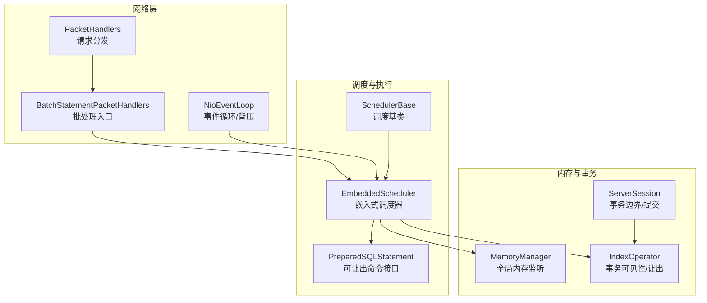
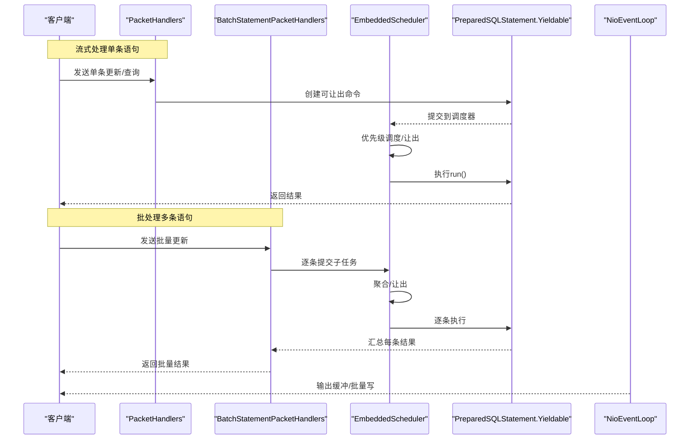
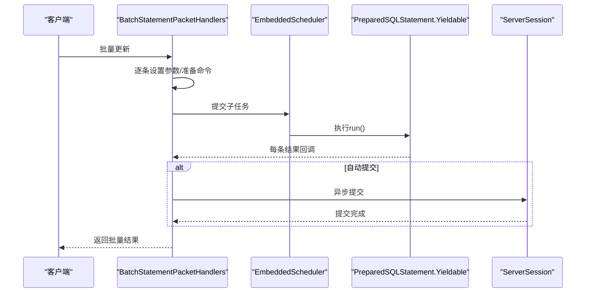
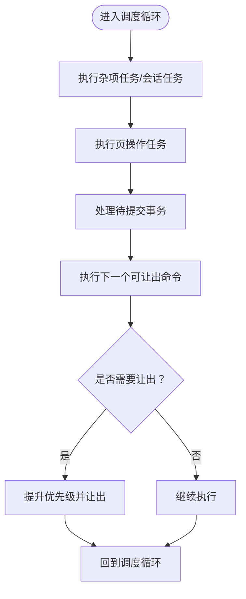
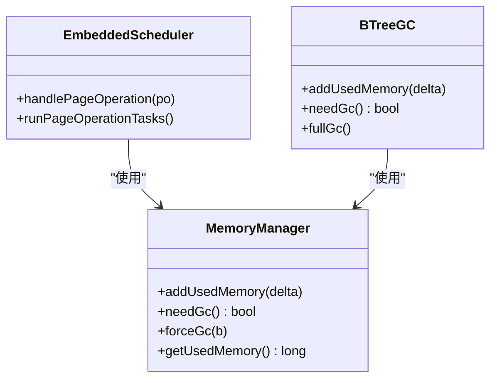
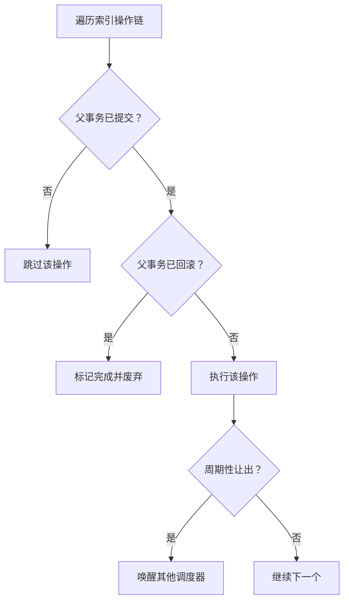
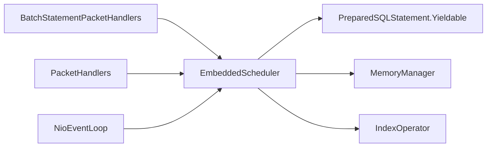

# 执行模式

**本文引用的文件**
- [BatchStatementPacketHandlers.java](https://github.com/lealone/Lealone/blob/master/lealone-server/src/main/java/com/lealone/server/handler/BatchStatementPacketHandlers.java)
- [PacketHandlers.java](https://github.com/lealone/Lealone/blob/master/lealone-server/src/main/java/com/lealone/server/handler/PacketHandlers.java)
- [EmbeddedScheduler.java](https://github.com/lealone/Lealone/blob/master/lealone-sci/src/main/java/com/lealone/db/scheduler/EmbeddedScheduler.java)
- [NioEventLoop.java](https://github.com/lealone/Lealone/blob/master/lealone-net/src/main/java/com/lealone/net/nio/NioEventLoop.java)
- [PreparedSQLStatement.java](https://github.com/lealone/Lealone/blob/master/lealone-sci/src/main/java/com/lealone/sql/PreparedSQLStatement.java)
- [SchedulerBase.java](https://github.com/lealone/Lealone/blob/master/lealone-common/src/main/java/com/lealone/db/scheduler/SchedulerBase.java)
- [MemoryManager.java](https://github.com/lealone/Lealone/blob/master/lealone-sci/src/main/java/com/lealone/db/MemoryManager.java)
- [RunMode.java](https://github.com/lealone/Lealone/blob/master/lealone-common/src/main/java/com/lealone/db/RunMode.java)
- [IndexOperator.java](https://github.com/lealone/Lealone/blob/master/lealone-db/src/main/java/com/lealone/db/index/IndexOperator.java)
- [ServerSession.java](https://github.com/lealone/Lealone/blob/master/lealone-db/src/main/java/com/lealone/db/session/ServerSession.java)
- [BatchTest.java](https://github.com/lealone/Lealone/blob/master/lealone-test/src/test/java/com/lealone/test/client/BatchTest.java)

## 目录
1. [简介](#简介)
2. [项目结构](#项目结构)
3. [核心组件](#核心组件)
4. [架构总览](#架构总览)
5. [详细组件分析](#详细组件分析)
6. [依赖关系分析](#依赖关系分析)
7. [性能考量](#性能考量)
8. [故障排查指南](#故障排查指南)
9. [结论](#结论)
10. [附录](#附录)

## 简介
本文件围绕 Lealone 的“执行模式”展开，系统梳理批处理与流式处理两种模式的实现差异、内存管理与背压控制、事务边界与批量提交优化，并结合测试用例给出选型建议与实践案例。文档面向不同技术背景的读者，既提供高层概览，也包含代码级图示与来源标注，便于快速定位实现细节。

## 项目结构
与执行模式密切相关的模块主要分布在以下子工程：
- lealone-server：网络层与协议处理，负责接收客户端请求并分发到调度器。
- lealone-sci：调度器与可让出执行（Yieldable）机制的核心实现。
- lealone-net：网络事件循环与写缓冲策略，体现流式处理的背压控制。
- lealone-common：通用调度抽象、运行模式等基础能力。
- lealone-db：事务、索引与会话等底层执行环境。
- lealone-test：批处理与事务行为的验证用例。

图表来源
- [PacketHandlers.java](https://github.com/lealone/Lealone/blob/master/lealone-server/src/main/java/com/lealone/server/handler/PacketHandlers.java#L1-L164)
- [BatchStatementPacketHandlers.java](https://github.com/lealone/Lealone/blob/master/lealone-server/src/main/java/com/lealone/server/handler/BatchStatementPacketHandlers.java#L1-L150)
- [EmbeddedScheduler.java](https://github.com/lealone/Lealone/blob/master/lealone-sci/src/main/java/com/lealone/db/scheduler/EmbeddedScheduler.java#L1-L326)
- [NioEventLoop.java](https://github.com/lealone/Lealone/blob/master/lealone-net/src/main/java/com/lealone/net/nio/NioEventLoop.java#L1-L569)
- [PreparedSQLStatement.java](https://github.com/lealone/Lealone/blob/master/lealone-sci/src/main/java/com/lealone/sql/PreparedSQLStatement.java#L60-L136)
- [SchedulerBase.java](https://github.com/lealone/Lealone/blob/master/lealone-common/src/main/java/com/lealone/db/scheduler/SchedulerBase.java#L1-L207)
- [MemoryManager.java](https://github.com/lealone/Lealone/blob/master/lealone-sci/src/main/java/com/lealone/db/MemoryManager.java#L14-L101)
- [IndexOperator.java](https://github.com/lealone/Lealone/blob/master/lealone-db/src/main/java/com/lealone/db/index/IndexOperator.java#L134-L195)
- [ServerSession.java](https://github.com/lealone/Lealone/blob/master/lealone-db/src/main/java/com/lealone/db/session/ServerSession.java#L625-L665)

章节来源
- [RunMode.java](https://github.com/lealone/Lealone/blob/master/lealone-common/src/main/java/com/lealone/db/RunMode.java#L1-L24)

## 核心组件
- 批处理入口：BatchStatementPacketHandlers 将批量请求拆分为多个子任务，统一走可让出执行路径，最后汇总结果。
- 流式处理入口：PacketHandlers 提供单条语句的可让出执行路径，配合网络事件循环实现边读边处理。
- 调度器：EmbeddedScheduler 负责在多会话、多命令间进行优先级调度与让出，保障公平性与吞吐。
- 可让出执行：PreparedSQLStatement.Yieldable/YieldableCommand 抽象了可中断/可让出的执行单元。
- 背压控制：NioEventLoop 通过输出缓冲与批量写策略，在繁忙或高延迟场景下抑制写放大。
- 内存管理：MemoryManager 提供全局内存阈值与监听，驱动 GC 与回收策略。
- 事务边界：ServerSession 与 IndexOperator 在事务可见性与提交时机上协同，确保一致性。

章节来源
- [BatchStatementPacketHandlers.java](https://github.com/lealone/Lealone/blob/master/lealone-server/src/main/java/com/lealone/server/handler/BatchStatementPacketHandlers.java#L1-L150)
- [PacketHandlers.java](https://github.com/lealone/Lealone/blob/master/lealone-server/src/main/java/com/lealone/server/handler/PacketHandlers.java#L1-L164)
- [EmbeddedScheduler.java](https://github.com/lealone/Lealone/blob/master/lealone-sci/src/main/java/com/lealone/db/scheduler/EmbeddedScheduler.java#L1-L326)
- [PreparedSQLStatement.java](https://github.com/lealone/Lealone/blob/master/lealone-sci/src/main/java/com/lealone/sql/PreparedSQLStatement.java#L60-L136)
- [NioEventLoop.java](https://github.com/lealone/Lealone/blob/master/lealone-net/src/main/java/com/lealone/net/nio/NioEventLoop.java#L307-L365)
- [MemoryManager.java](https://github.com/lealone/Lealone/blob/master/lealone-sci/src/main/java/com/lealone/db/MemoryManager.java#L14-L101)
- [IndexOperator.java](https://github.com/lealone/Lealone/blob/master/lealone-db/src/main/java/com/lealone/db/index/IndexOperator.java#L134-L195)
- [ServerSession.java](https://github.com/lealone/Lealone/blob/master/lealone-db/src/main/java/com/lealone/db/session/ServerSession.java#L625-L665)

## 架构总览
下图展示批处理与流式处理在请求到达、调度、执行与响应阶段的关键交互。

图表来源
- [PacketHandlers.java](https://github.com/lealone/Lealone/blob/master/lealone-server/src/main/java/com/lealone/server/handler/PacketHandlers.java#L51-L118)
- [BatchStatementPacketHandlers.java](https://github.com/lealone/Lealone/blob/master/lealone-server/src/main/java/com/lealone/server/handler/BatchStatementPacketHandlers.java#L33-L148)
- [EmbeddedScheduler.java](https://github.com/lealone/Lealone/blob/master/lealone-sci/src/main/java/com/lealone/db/scheduler/EmbeddedScheduler.java#L231-L275)
- [NioEventLoop.java](https://github.com/lealone/Lealone/blob/master/lealone-net/src/main/java/com/lealone/net/nio/NioEventLoop.java#L307-L365)

## 详细组件分析

### 批处理模式：批量提交与事务边界
- 请求入口：BatchStatementPacketHandlers 接收批量更新请求，针对非 MerSert 的情况，逐条构造可让出命令并提交到调度器；对 MerSert 则一次性设置参数并提交。
- 结果聚合：使用计数器等待所有子任务完成，再统一发送批量结果；若处于自动提交模式，则在全部完成后异步提交。
- 事务边界：批处理默认关闭自动提交时，由外部控制提交时机；开启自动提交时，批处理内部在汇总完成后异步提交。

图表来源
- [BatchStatementPacketHandlers.java](https://github.com/lealone/Lealone/blob/master/lealone-server/src/main/java/com/lealone/server/handler/BatchStatementPacketHandlers.java#L33-L148)
- [ServerSession.java](https://github.com/lealone/Lealone/blob/master/lealone-db/src/main/java/com/lealone/db/session/ServerSession.java#L625-L665)

章节来源
- [BatchStatementPacketHandlers.java](https://github.com/lealone/Lealone/blob/master/lealone-server/src/main/java/com/lealone/server/handler/BatchStatementPacketHandlers.java#L1-L150)
- [BatchTest.java](https://github.com/lealone/Lealone/blob/master/lealone-test/src/test/java/com/lealone/test/client/BatchTest.java#L44-L92)

### 流式处理模式：可让出执行与背压控制
- 可让出执行：PacketHandlers 为单条语句创建可让出命令，提交到调度器；调度器在空闲或更高优先级命令出现时让出当前执行。
- 背压控制：NioEventLoop 在输出缓冲堆积或调度器繁忙时，采用批量写策略或延迟写入，避免频繁唤醒与写放大。
- 优先级让出：EmbeddedScheduler 在存在多个会话时，比较命令优先级，必要时提升当前命令优先级并让出，确保高优任务优先。

图表来源
- [EmbeddedScheduler.java](https://github.com/lealone/Lealone/blob/master/lealone-sci/src/main/java/com/lealone/db/scheduler/EmbeddedScheduler.java#L63-L112)
- [EmbeddedScheduler.java](https://github.com/lealone/Lealone/blob/master/lealone-sci/src/main/java/com/lealone/db/scheduler/EmbeddedScheduler.java#L231-L275)
- [EmbeddedScheduler.java](https://github.com/lealone/Lealone/blob/master/lealone-sci/src/main/java/com/lealone/db/scheduler/EmbeddedScheduler.java#L276-L309)

章节来源
- [PacketHandlers.java](https://github.com/lealone/Lealone/blob/master/lealone-server/src/main/java/com/lealone/server/handler/PacketHandlers.java#L51-L118)
- [NioEventLoop.java](https://github.com/lealone/Lealone/blob/master/lealone-net/src/main/java/com/lealone/net/nio/NioEventLoop.java#L307-L365)
- [EmbeddedScheduler.java](https://github.com/lealone/Lealone/blob/master/lealone-sci/src/main/java/com/lealone/db/scheduler/EmbeddedScheduler.java#L276-L309)

### 内存管理策略与全局监听
- 全局内存阈值：MemoryManager 提供全局最大内存与阈值计算，超过阈值触发 GC 或强制 GC。
- 监听机制：全局内存监听器在使用量上升时被唤醒，调度器可据此调整让出策略或触发回收。
- 页操作内存：AO 存储的页操作会累加使用内存，达到阈值时唤醒全局监听，促使 GC 触发。

图表来源
- [MemoryManager.java](https://github.com/lealone/Lealone/blob/master/lealone-sci/src/main/java/com/lealone/db/MemoryManager.java#L14-L101)
- [EmbeddedScheduler.java](https://github.com/lealone/Lealone/blob/master/lealone-sci/src/main/java/com/lealone/db/scheduler/EmbeddedScheduler.java#L100-L139)
- [BTreeGC.java](https://github.com/lealone/Lealone/blob/master/lealone-aose/src/main/java/com/lealone/storage/aose/btree/BTreeGC.java#L44-L94)

章节来源
- [MemoryManager.java](https://github.com/lealone/Lealone/blob/master/lealone-sci/src/main/java/com/lealone/db/MemoryManager.java#L14-L101)
- [EmbeddedScheduler.java](https://github.com/lealone/Lealone/blob/master/lealone-sci/src/main/java/com/lealone/db/scheduler/EmbeddedScheduler.java#L100-L139)
- [BTreeGC.java](https://github.com/lealone/Lealone/blob/master/lealone-aose/src/main/java/com/lealone/storage/aose/btree/BTreeGC.java#L44-L94)

### 事务边界与可见性控制
- 事务可见性：IndexOperator 在处理索引操作链时，严格遵循父事务提交状态，未提交则跳过，已回滚则废弃，避免脏读。
- 让出与唤醒：在大量索引操作场景中，调度器周期性调用让出，确保高优任务抢占与公平调度。
- 会话提交：ServerSession 在手动提交时触发缓存失效，使其他事务可见最新数据。

图表来源
- [IndexOperator.java](https://github.com/lealone/Lealone/blob/master/lealone-db/src/main/java/com/lealone/db/index/IndexOperator.java#L134-L195)
- [ServerSession.java](https://github.com/lealone/Lealone/blob/master/lealone-db/src/main/java/com/lealone/db/session/ServerSession.java#L625-L665)

章节来源
- [IndexOperator.java](https://github.com/lealone/Lealone/blob/master/lealone-db/src/main/java/com/lealone/db/index/IndexOperator.java#L134-L195)
- [ServerSession.java](https://github.com/lealone/Lealone/blob/master/lealone-db/src/main/java/com/lealone/db/session/ServerSession.java#L625-L665)

## 依赖关系分析
- 批处理依赖可让出执行与调度器，最终由网络层返回批量结果。
- 流式处理同样依赖可让出执行与调度器，但更强调背压控制与优先级让出。
- 调度器依赖内存管理与索引可见性控制，形成闭环的资源与一致性保障。

图表来源
- [BatchStatementPacketHandlers.java](https://github.com/lealone/Lealone/blob/master/lealone-server/src/main/java/com/lealone/server/handler/BatchStatementPacketHandlers.java#L1-L150)
- [PacketHandlers.java](https://github.com/lealone/Lealone/blob/master/lealone-server/src/main/java/com/lealone/server/handler/PacketHandlers.java#L1-L164)
- [EmbeddedScheduler.java](https://github.com/lealone/Lealone/blob/master/lealone-sci/src/main/java/com/lealone/db/scheduler/EmbeddedScheduler.java#L1-L326)
- [NioEventLoop.java](https://github.com/lealone/Lealone/blob/master/lealone-net/src/main/java/com/lealone/net/nio/NioEventLoop.java#L1-L569)
- [MemoryManager.java](https://github.com/lealone/Lealone/blob/master/lealone-sci/src/main/java/com/lealone/db/MemoryManager.java#L14-L101)
- [IndexOperator.java](https://github.com/lealone/Lealone/blob/master/lealone-db/src/main/java/com/lealone/db/index/IndexOperator.java#L134-L195)

章节来源
- [SchedulerBase.java](https://github.com/lealone/Lealone/blob/master/lealone-common/src/main/java/com/lealone/db/scheduler/SchedulerBase.java#L1-L207)
- [RunMode.java](https://github.com/lealone/Lealone/blob/master/lealone-common/src/main/java/com/lealone/db/RunMode.java#L1-L24)

## 性能考量
- 资源利用率
  - 批处理：适合大批量写入，减少网络往返与事务开销，但需注意内存峰值与 GC 压力。
  - 流式处理：适合高频短事务，调度器让出与背压控制降低长尾延迟，提高整体吞吐。
- 响应延迟
  - 批处理：单次批量提交可能带来延迟抖动，建议分批提交与合理批次大小。
  - 流式处理：可让出执行与批量写策略降低写放大，提升端到端延迟稳定性。
- 背压与内存
  - 背压：NioEventLoop 在输出缓冲堆积或调度器繁忙时采用批量写，避免频繁唤醒。
  - 内存：MemoryManager 全局阈值与监听，配合调度器让出，防止内存持续上涨。

章节来源
- [NioEventLoop.java](https://github.com/lealone/Lealone/blob/master/lealone-net/src/main/java/com/lealone/net/nio/NioEventLoop.java#L307-L365)
- [MemoryManager.java](https://github.com/lealone/Lealone/blob/master/lealone-sci/src/main/java/com/lealone/db/MemoryManager.java#L14-L101)
- [EmbeddedScheduler.java](https://github.com/lealone/Lealone/blob/master/lealone-sci/src/main/java/com/lealone/db/scheduler/EmbeddedScheduler.java#L276-L309)

## 故障排查指南
- 批处理无响应或延迟过高
  - 检查是否处于自动提交模式，确认批量完成后是否触发异步提交。
  - 关注内存使用是否接近阈值，必要时增大批次或启用 GC。
- 流式处理写放大或丢包
  - 检查输出缓冲堆积与批量写策略，适当调整 prefer_batch_write 与 max_packet_count_per_loop。
- 事务可见性问题
  - 确认索引操作链是否受父事务状态影响，避免脏读或重复执行。
- 会话阻塞
  - 检查调度器是否因高优任务让出导致当前任务长时间不执行，必要时调整优先级策略。

章节来源
- [BatchStatementPacketHandlers.java](https://github.com/lealone/Lealone/blob/master/lealone-server/src/main/java/com/lealone/server/handler/BatchStatementPacketHandlers.java#L124-L148)
- [NioEventLoop.java](https://github.com/lealone/Lealone/blob/master/lealone-net/src/main/java/com/lealone/net/nio/NioEventLoop.java#L307-L365)
- [IndexOperator.java](https://github.com/lealone/Lealone/blob/master/lealone-db/src/main/java/com/lealone/db/index/IndexOperator.java#L134-L195)
- [ServerSession.java](https://github.com/lealone/Lealone/blob/master/lealone-db/src/main/java/com/lealone/db/session/ServerSession.java#L625-L665)

## 结论
- 批处理模式适用于大批量写入与批量提交优化，需关注内存峰值与事务边界控制。
- 流式处理模式强调可让出执行与背压控制，适合高并发短事务与低延迟场景。
- 通过调度器让出、内存监听与索引可见性控制，系统在资源利用率与响应延迟之间取得平衡。
- 实际选型建议：高吞吐低延迟场景优先考虑流式处理；批导入/ETL场景优先考虑批处理并分批提交。

## 附录
- 实践案例
  - 批处理：使用客户端批量插入接口，分批提交以平衡吞吐与内存压力。
  - 事务：手动控制事务边界，确保数据一致性与可见性。
- 配置要点
  - 调度循环间隔、批量写偏好、最大包数量等参数可根据业务特征调优。

章节来源
- [BatchTest.java](https://github.com/lealone/Lealone/blob/master/lealone-test/src/test/java/com/lealone/test/client/BatchTest.java#L44-L92)
- [SchedulerBase.java](https://github.com/lealone/Lealone/blob/master/lealone-common/src/main/java/com/lealone/db/scheduler/SchedulerBase.java#L39-L48)
- [NioEventLoop.java](https://github.com/lealone/Lealone/blob/master/lealone-net/src/main/java/com/lealone/net/nio/NioEventLoop.java#L63-L75)