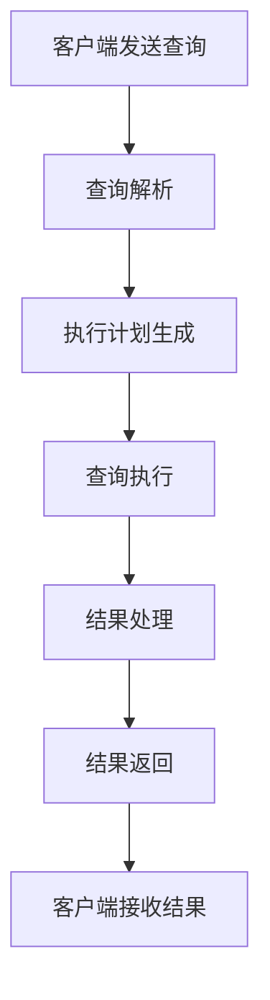
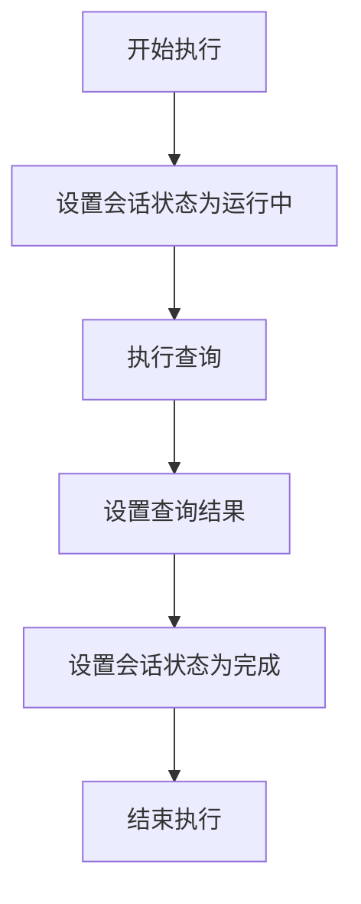
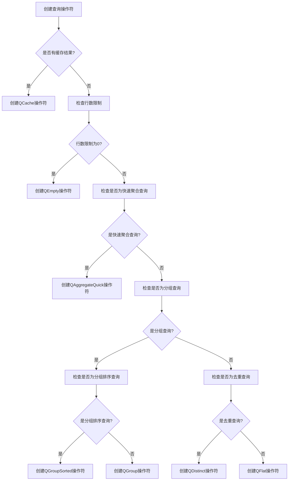
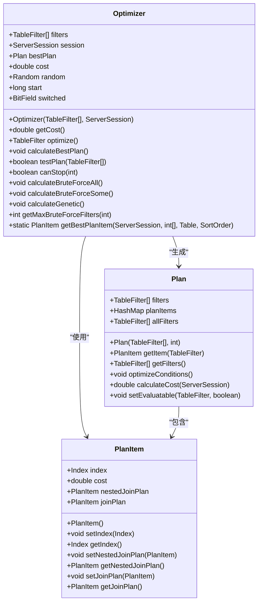
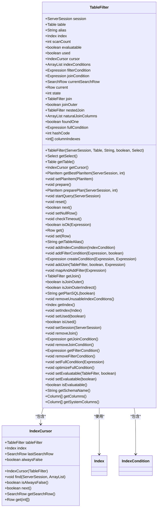
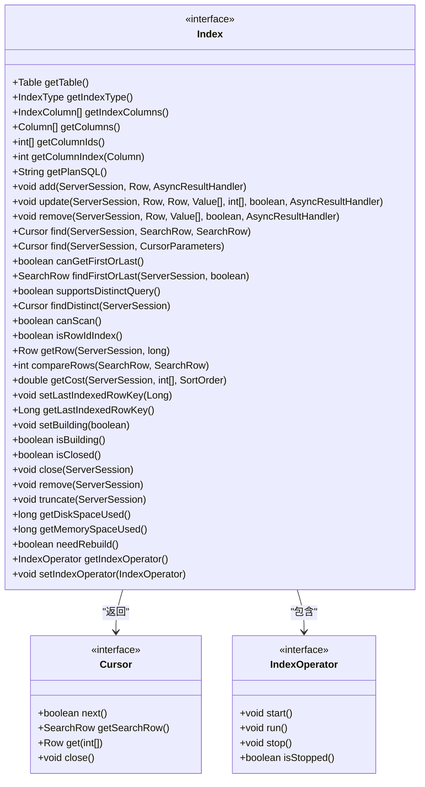
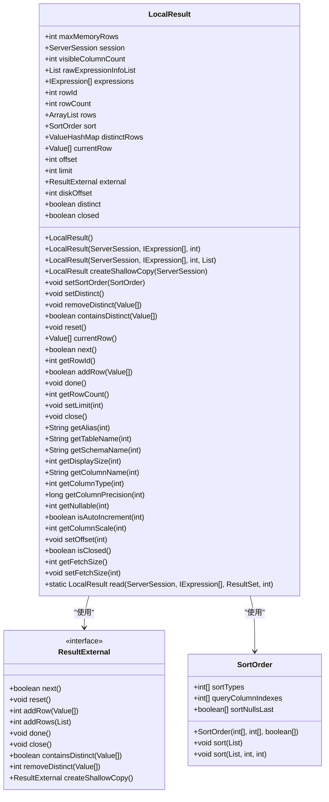
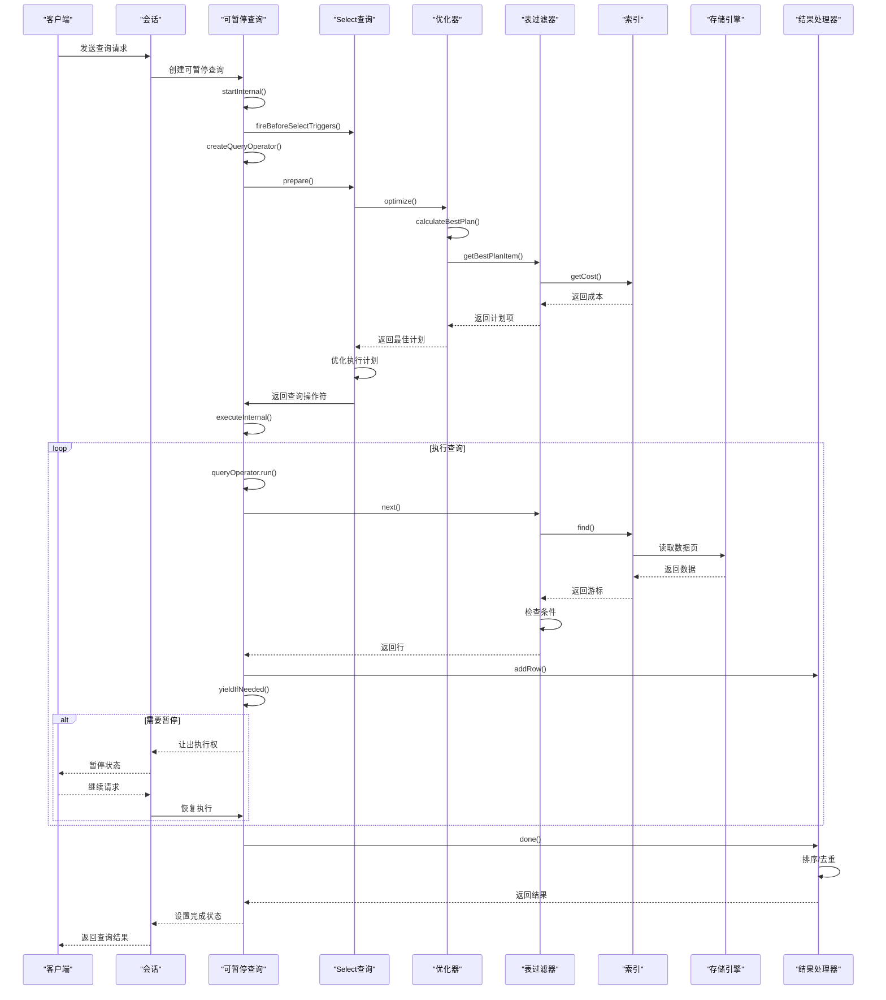

# 查询执行

<cite>
**本文档引用的文件**   
- [YieldableLocalQuery.java](https://github.com/lealone/Lealone/blob/master/lealone-sql\src\main\java\com\lealone\sql\query\YieldableLocalQuery.java)
- [Select.java](https://github.com/lealone/Lealone/blob/master/lealone-sql\src\main\java\com\lealone\sql\query\Select.java)
- [YieldableSelect.java](https://github.com/lealone/Lealone/blob/master/lealone-sql\src\main\java\com\lealone\sql\query\YieldableSelect.java)
- [Optimizer.java](https://github.com/lealone/Lealone/blob/master/lealone-sql\src\main\java\com\lealone\sql\optimizer\Optimizer.java)
- [Plan.java](https://github.com/lealone/Lealone/blob/master/lealone-sql\src\main\java\com\lealone\sql\optimizer\Plan.java)
- [TableFilter.java](https://github.com/lealone/Lealone/blob/master/lealone-sql\src\main\java\com\lealone\sql\optimizer\TableFilter.java)
- [QOperator.java](https://github.com/lealone/Lealone/blob/master/lealone-sql\src\main\java\com\lealone\sql\query\QOperator.java)
- [QFlat.java](https://github.com/lealone/Lealone/blob/master/lealone-sql\src\main\java\com\lealone\sql\query\QFlat.java)
- [QDistinct.java](https://github.com/lealone/Lealone/blob/master/lealone-sql\src\main\java\com\lealone\sql\query\QDistinct.java)
- [YieldableBase.java](https://github.com/lealone/Lealone/blob/master/lealone-sql\src\main\java\com\lealone\sql\executor\YieldableBase.java)
- [Index.java](https://github.com/lealone/Lealone/blob/master/lealone-db\src\main\java\com\lealone\db\index\Index.java)
- [LocalResult.java](https://github.com/lealone/Lealone/blob/master/lealone-db\src\main\java\com\lealone\db\result\LocalResult.java)
</cite>

## 目录
1. [查询执行概述](#查询执行概述)
2. [Select查询执行流程](#select查询执行流程)
3. [可暂停查询执行机制](#可暂停查询执行机制)
4. [查询执行计划生成与优化](#查询执行计划生成与优化)
5. [查询执行与存储引擎交互](#查询执行与存储引擎交互)
6. [查询执行时序图](#查询执行时序图)

## 查询执行概述

查询执行是数据库系统的核心功能之一，负责将SQL查询语句转换为实际的数据访问操作。Lealone数据库的查询执行框架设计精巧，支持从查询解析、执行计划生成、优化到结果返回的完整生命周期管理。该框架特别注重高并发场景下的性能表现，通过可暂停执行机制确保系统在处理复杂查询时仍能保持良好的响应性。

查询执行框架主要由以下几个核心组件构成：
- **查询解析器**：负责将SQL语句解析为抽象语法树
- **查询优化器**：生成最优的查询执行计划
- **执行引擎**：根据执行计划执行查询操作
- **结果处理器**：管理查询结果的生成和返回

这些组件协同工作，确保查询能够高效、准确地执行。

**Section sources**
- [Select.java](https://github.com/lealone/Lealone/blob/master/lealone-sql\src\main\java\com\lealone\sql\query\Select.java#L1-L1026)
- [YieldableSelect.java](https://github.com/lealone/Lealone/blob/master/lealone-sql\src\main\java\com\lealone\sql\query\YieldableSelect.java#L1-L213)

## Select查询执行流程

Select查询的执行流程从客户端发送查询请求开始，经过多个阶段最终返回结果。整个流程可以分为以下几个关键阶段：

1. **查询初始化**：解析SQL语句并初始化查询对象
2. **执行计划生成**：优化器根据查询条件生成最优执行计划
3. **查询执行**：执行引擎按照执行计划访问数据
4. **结果处理**：收集和处理查询结果
5. **结果返回**：将结果返回给客户端

在Lealone数据库中，Select查询的执行流程通过`Select`类实现。该类负责管理查询的整个生命周期，从初始化到结果返回。查询执行的核心逻辑位于`prepare()`和`query()`方法中，其中`prepare()`方法负责执行计划的生成和优化，而`query()`方法则负责实际的查询执行。



**Diagram sources **
- [Select.java](https://github.com/lealone/Lealone/blob/master/lealone-sql\src\main\java\com\lealone\sql\query\Select.java#L1-L1026)

**Section sources**
- [Select.java](https://github.com/lealone/Lealone/blob/master/lealone-sql\src\main\java\com\lealone\sql\query\Select.java#L1-L1026)
- [YieldableSelect.java](https://github.com/lealone/Lealone/blob/master/lealone-sql\src\main\java\com\lealone\sql\query\YieldableSelect.java#L1-L213)

## 可暂停查询执行机制

Lealone数据库通过`YieldableLocalQuery`和`YieldableSelect`类实现了查询的可暂停执行机制。这种机制允许长时间运行的查询在执行过程中主动让出CPU资源，从而避免阻塞其他查询的执行，提高系统的整体并发性能。

### YieldableLocalQuery实现

`YieldableLocalQuery`是可暂停查询的基础实现，它继承自`YieldableQueryBase`类。该类的核心方法是`executeInternal()`，其执行流程如下：



**Diagram sources **
- [YieldableLocalQuery.java](https://github.com/lealone/Lealone/blob/master/lealone-sql\src\main\java\com\lealone\sql\query\YieldableLocalQuery.java#L1-L28)

### YieldableSelect实现

`YieldableSelect`类提供了更高级的可暂停查询功能，支持OLAP（在线分析处理）模式的查询执行。该类通过`yieldIfNeeded()`方法实现查询的可暂停特性：

```mer
flowchart TD
    A[检查是否需要暂停] --> B{行数超过阈值?}
    B -->|是| C[创建OLAP操作符]
    C --> D[让出执行权]
    D --> E[设置会话状态为暂停]
    E --> F[返回true]
    B -->|否| G[调用父类方法]
    G --> H[返回结果]
```

**Diagram sources **
- [YieldableSelect.java](https://github.com/lealone/Lealone/blob/master/lealone-sql\src\main\java\com\lealone\sql\query\YieldableSelect.java#L1-L213)

`YieldableSelect`类还实现了`createQueryOperator()`方法，根据查询类型选择合适的操作符：



**Diagram sources **
- [YieldableSelect.java](https://github.com/lealone/Lealone/blob/master/lealone-sql\src\main\java\com\lealone\sql\query\YieldableSelect.java#L120-L162)

**Section sources**
- [YieldableLocalQuery.java](https://github.com/lealone/Lealone/blob/master/lealone-sql\src\main\java\com\lealone\sql\query\YieldableLocalQuery.java#L1-L28)
- [YieldableSelect.java](https://github.com/lealone/Lealone/blob/master/lealone-sql\src\main\java\com\lealone\sql\query\YieldableSelect.java#L1-L213)
- [YieldableBase.java](https://github.com/lealone/Lealone/blob/master/lealone-sql\src\main\java\com\lealone\sql\executor\YieldableBase.java#L1-L193)

## 查询执行计划生成与优化

查询执行计划的生成与优化是数据库性能的关键。Lealone数据库通过`Optimizer`类实现了高效的查询优化器，能够根据查询条件和数据特征生成最优的执行计划。

### 执行计划生成

执行计划的生成过程由`Optimizer`类的`optimize()`方法完成。该方法首先调用`calculateBestPlan()`计算最佳执行计划，然后对计划进行条件优化：



**Diagram sources **
- [Optimizer.java](https://github.com/lealone/Lealone/blob/master/lealone-sql\src\main\java\com\lealone\sql\optimizer\Optimizer.java#L1-L282)
- [Plan.java](https://github.com/lealone/Lealone/blob/master/lealone-sql\src\main\java\com\lealone\sql\optimizer\Plan.java#L1-L116)

### 查询优化策略

Lealone数据库实现了多种查询优化策略，包括：

1. **索引选择优化**：根据查询条件选择最优索引
2. **排序优化**：利用索引的有序性避免额外排序
3. **去重优化**：为DISTINCT查询选择合适的索引
4. **分组优化**：为GROUP BY查询选择分组排序索引

这些优化策略在`Select`类的`prepare()`方法中实现：

```mermaid
flowchart TD
A[准备执行计划] --> B{是否为单表查询?}
B --> |是| C[调用preparePlan()]
B --> |否| D[创建优化器]
D --> E[调用优化器的optimize()]
E --> F[设置可评估性]
F --> G[返回成本]
C --> H[返回成本]
G --> I[检查DISTINCT优化]
I --> J{满足DISTINCT优化条件?}
J --> |是| K[调用optimizeDistinct()]
J --> |否| L[检查排序优化]
L --> M{满足排序优化条件?}
M --> |是| N[调用optimizeSort()]
M --> |否| O[检查分组优化]
O --> P{有分组索引?}
P --> |是| Q[设置分组排序查询]
P --> |否| R[完成准备]
```

**Diagram sources **
- [Select.java](https://github.com/lealone/Lealone/blob/master/lealone-sql\src\main\java\com\lealone\sql\query\Select.java#L538-L557)

**Section sources**
- [Optimizer.java](https://github.com/lealone/Lealone/blob/master/lealone-sql\src\main\java\com\lealone\sql\optimizer\Optimizer.java#L1-L282)
- [Plan.java](https://github.com/lealone/Lealone/blob/master/lealone-sql\src\main\java\com\lealone\sql\optimizer\Plan.java#L1-L116)
- [Select.java](https://github.com/lealone/Lealone/blob/master/lealone-sql\src\main\java\com\lealone\sql\query\Select.java#L408-L557)

## 查询执行与存储引擎交互

查询执行过程中与存储引擎的交互主要通过`TableFilter`和`Index`接口实现。`TableFilter`类负责管理表的访问，而`Index`接口定义了索引的操作方法。

### TableFilter实现

`TableFilter`类是查询执行与存储引擎交互的核心组件，它负责管理表的访问和查询条件的处理：



**Diagram sources **
- [TableFilter.java](https://github.com/lealone/Lealone/blob/master/lealone-sql\src\main\java\com\lealone\sql\optimizer\TableFilter.java#L1-L1006)

### 索引操作

`Index`接口定义了索引的基本操作方法，包括数据查找、插入、删除等：



**Diagram sources **
- [Index.java](https://github.com/lealone/Lealone/blob/master/lealone-db\src\main\java\com\lealone\db\index\Index.java#L1-L268)

### 查询结果管理

查询结果通过`LocalResult`类进行管理，该类负责结果的存储、排序和去重：



**Diagram sources **
- [LocalResult.java](https://github.com/lealone/Lealone/blob/master/lealone-db\src\main\java\com\lealone\db\result\LocalResult.java#L1-L494)

**Section sources**
- [TableFilter.java](https://github.com/lealone/Lealone/blob/master/lealone-sql\src\main\java\com\lealone\sql\optimizer\TableFilter.java#L1-L1006)
- [Index.java](https://github.com/lealone/Lealone/blob/master/lealone-db\src\main\java\com\lealone\db\index\Index.java#L1-L268)
- [LocalResult.java](https://github.com/lealone/Lealone/blob/master/lealone-db\src\main\java\com\lealone\db\result\LocalResult.java#L1-L494)

## 查询执行时序图

以下是Select查询执行的完整时序图，展示了从查询开始到结果返回的关键阶段和状态转换：



**Diagram sources **
- [YieldableSelect.java](https://github.com/lealone/Lealone/blob/master/lealone-sql\src\main\java\com\lealone\sql\query\YieldableSelect.java#L89-L117)
- [Select.java](https://github.com/lealone/Lealone/blob/master/lealone-sql\src\main\java\com\lealone\sql\query\Select.java#L738-L739)
- [TableFilter.java](https://github.com/lealone/Lealone/blob/master/lealone-sql\src\main\java\com\lealone\sql\optimizer\TableFilter.java#L308-L393)
- [Index.java](https://github.com/lealone/Lealone/blob/master/lealone-db\src\main\java\com\lealone\db\index\Index.java#L120-L122)
- [LocalResult.java](https://github.com/lealone/Lealone/blob/master/lealone-db\src\main\java\com\lealone\db\result\LocalResult.java#L266-L309)

**Section sources**
- [YieldableSelect.java](https://github.com/lealone/Lealone/blob/master/lealone-sql\src\main\java\com\lealone\sql\query\YieldableSelect.java#L89-L117)
- [Select.java](https://github.com/lealone/Lealone/blob/master/lealone-sql\src\main\java\com\lealone\sql\query\Select.java#L738-L739)
- [TableFilter.java](https://github.com/lealone/Lealone/blob/master/lealone-sql\src\main\java\com\lealone\sql\optimizer\TableFilter.java#L308-L393)
- [Index.java](https://github.com/lealone/Lealone/blob/master/lealone-db\src\main\java\com\lealone\db\index\Index.java#L120-L122)
- [LocalResult.java](https://github.com/lealone/Lealone/blob/master/lealone-db\src\main\java\com\lealone\db\result\LocalResult.java#L266-L309)