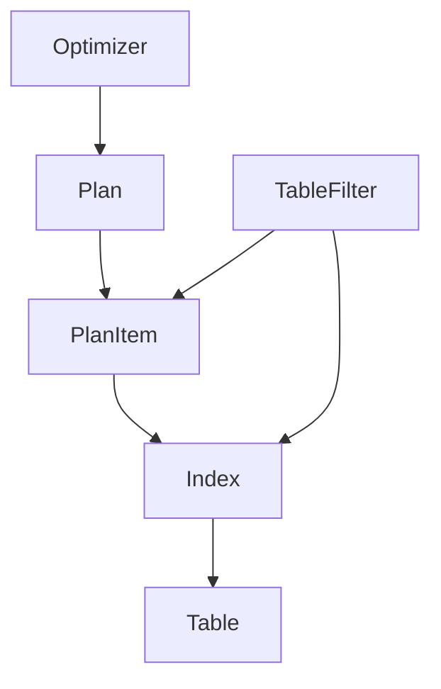
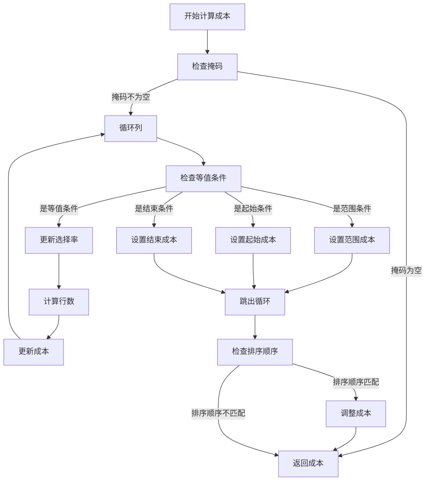
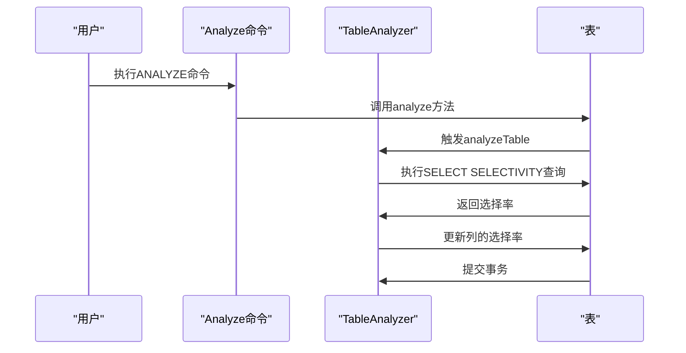
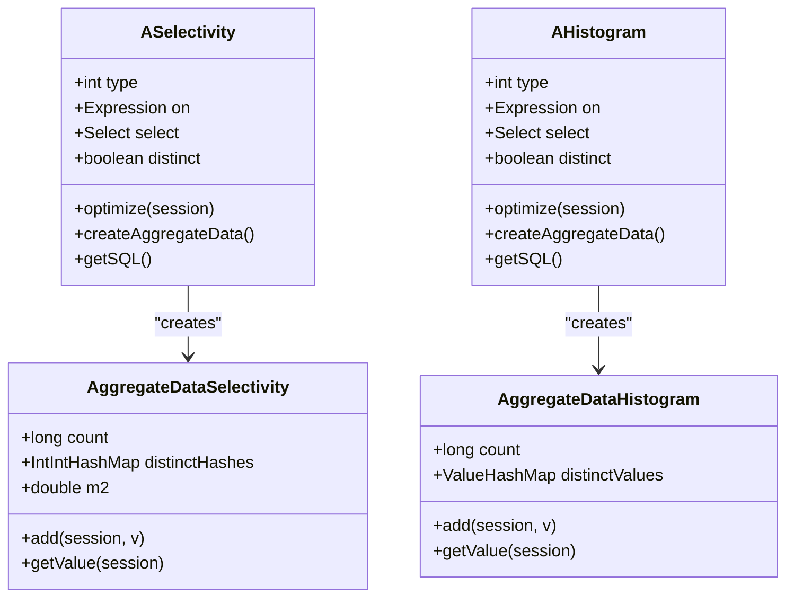
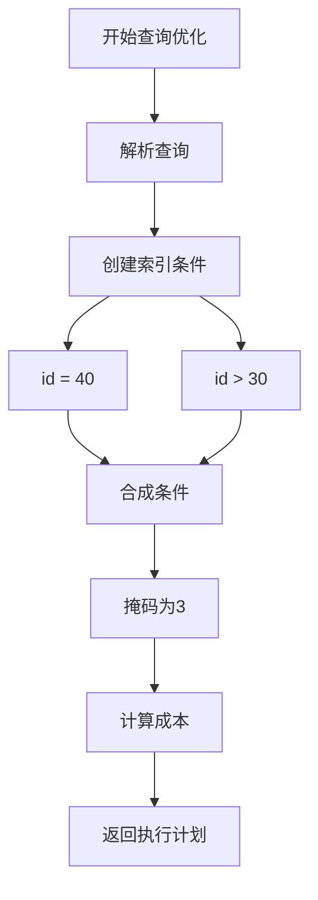

# 成本模型

<cite>
**本文档引用的文件**   
- [Plan.java](file://lealone-sql/src/main/java/com/lealone/sql/optimizer/Plan.java)
- [PlanItem.java](file://lealone-sql/src/main/java/com/lealone/sql/optimizer/PlanItem.java)
- [TableFilter.java](file://lealone-sql/src/main/java/com/lealone/sql/optimizer/TableFilter.java)
- [Optimizer.java](file://lealone-sql/src/main/java/com/lealone/sql/optimizer/Optimizer.java)
- [IndexBase.java](file://lealone-db/src/main/java/com/lealone/db/index/IndexBase.java)
- [ViewIndex.java](file://lealone-db/src/main/java/com/lealone/db/index/ViewIndex.java)
- [StandardDelegateIndex.java](file://lealone-db/src/main/java/com/lealone/db/index/standard/StandardDelegateIndex.java)
- [ASelectivity.java](file://lealone-sql/src/main/java/com/lealone/sql/expression/aggregate/ASelectivity.java)
- [AHistogram.java](file://lealone-sql/src/main/java/com/lealone/sql/expression/aggregate/AHistogram.java)
- [Analyze.java](file://lealone-sql/src/main/java/com/lealone/sql/ddl/Analyze.java)
- [TableAnalyzer.java](file://lealone-db/src/main/java/com/lealone/db/table/TableAnalyzer.java)
- [QueryStatisticsData.java](file://lealone-db/src/main/java/com/lealone/db/stats/QueryStatisticsData.java)
- [PerfMetaTable.java](file://lealone-db/src/main/java/com/lealone/db/table/PerfMetaTable.java)
- [Constants.java](file://lealone-common/src/main/java/com/lealone/db/Constants.java)
</cite>

## 目录
1. [引言](#引言)
2. [基于成本的优化框架](#基于成本的优化框架)
3. [成本计算公式](#成本计算公式)
4. [统计信息收集与维护](#统计信息收集与维护)
5. [基数估计与选择率计算](#基数估计与选择率计算)
6. [成本估算示例](#成本估算示例)
7. [结论](#结论)

## 引言
Lealone数据库采用基于成本的优化（CBO）框架来选择最优的查询执行计划。该框架通过量化不同执行计划的执行成本，包括I/O成本、CPU成本等因素，来决定最佳的查询执行路径。本文档详细解释了Lealone数据库中成本模型的实现，包括成本计算公式、统计信息的收集与维护机制，以及优化器如何利用这些信息进行基数估计和选择率计算。

## 基于成本的优化框架
Lealone数据库的基于成本的优化框架主要由`Optimizer`、`Plan`、`PlanItem`和`TableFilter`等组件构成。`Optimizer`负责计算最佳查询计划，`Plan`表示查询计划，`PlanItem`描述了要使用的索引及其估计成本，而`TableFilter`则代表查询中使用的表。

**图源**
- [Optimizer.java](file://lealone-sql/src/main/java/com/lealone/sql/optimizer/Optimizer.java)
- [Plan.java](file://lealone-sql/src/main/java/com/lealone/sql/optimizer/Plan.java)
- [PlanItem.java](file://lealone-sql/src/main/java/com/lealone/sql/optimizer/PlanItem.java)
- [TableFilter.java](file://lealone-sql/src/main/java/com/lealone/sql/optimizer/TableFilter.java)
- [IndexBase.java](file://lealone-db/src/main/java/com/lealone/db/index/IndexBase.java)

## 成本计算公式
Lealone数据库的成本计算公式主要考虑了I/O成本、CPU成本等因素。成本计算的核心在于`IndexBase`类中的`getCostRangeIndex`方法，该方法根据给定的掩码、行数和排序顺序来计算成本。

**图源**
- [IndexBase.java](file://lealone-db/src/main/java/com/lealone/db/index/IndexBase.java#L242-L337)

## 统计信息收集与维护
Lealone数据库通过`Analyze`命令和`TableAnalyzer`类来收集和维护统计信息。`Analyze`命令可以手动执行，而`TableAnalyzer`则在插入、更新或删除操作时自动触发统计信息的收集。

**图源**
- [Analyze.java](file://lealone-sql/src/main/java/com/lealone/sql/ddl/Analyze.java)
- [TableAnalyzer.java](file://lealone-db/src/main/java/com/lealone/db/table/TableAnalyzer.java)

## 基数估计与选择率计算
Lealone数据库通过`ASelectivity`和`AHistogram`聚合函数来计算选择率和直方图。`ASelectivity`函数返回一个介于1到100之间的整数，表示不重复记录数占总记录数的百分比。`AHistogram`函数则计算每个值出现的次数。

**图源**
- [ASelectivity.java](file://lealone-sql/src/main/java/com/lealone/sql/expression/aggregate/ASelectivity.java)
- [AHistogram.java](file://lealone-sql/src/main/java/com/lealone/sql/expression/aggregate/AHistogram.java)

## 成本估算示例
假设有一个查询`SELECT * FROM table WHERE id = 40 AND id > 30`，Lealone数据库的优化器会生成两个索引条件，`id = 40`和`id > 30`。在`TableFilter.getBestPlanItem`方法中，这两个条件会被合成一个掩码为3（`IndexCondition.EQUALITY | IndexCondition.START`）的条件。然后，优化器会根据这个掩码来计算成本。

**图源**
- [TableFilter.java](file://lealone-sql/src/main/java/com/lealone/sql/optimizer/TableFilter.java#L162-L176)

## 结论
Lealone数据库的基于成本的优化框架通过综合考虑I/O成本、CPU成本等因素，利用统计信息进行基数估计和选择率计算，从而选择最优的查询执行计划。该框架不仅支持手动执行`ANALYZE`命令来收集统计信息，还支持在插入、更新或删除操作时自动触发统计信息的收集，确保了统计信息的准确性和及时性。