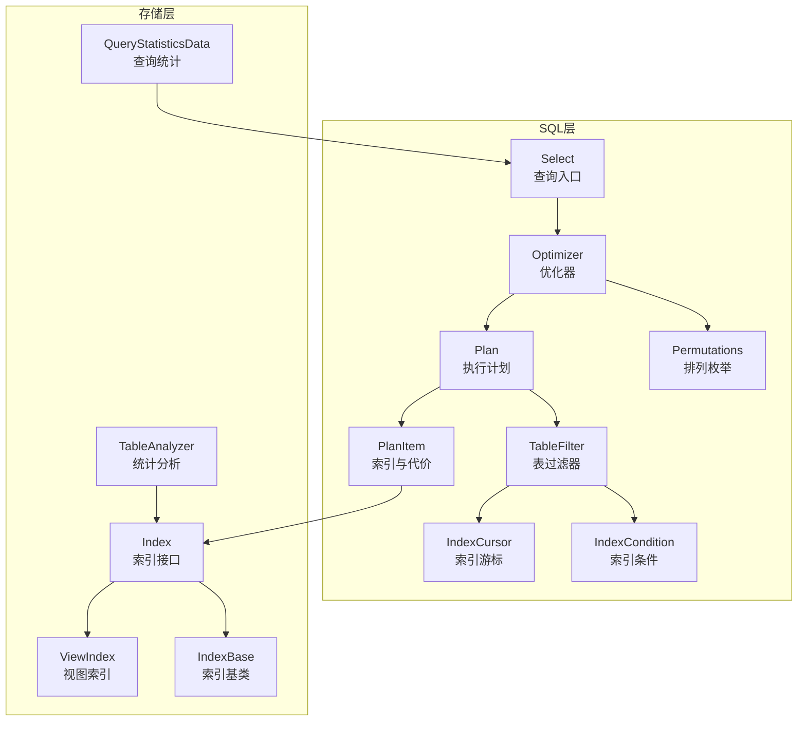
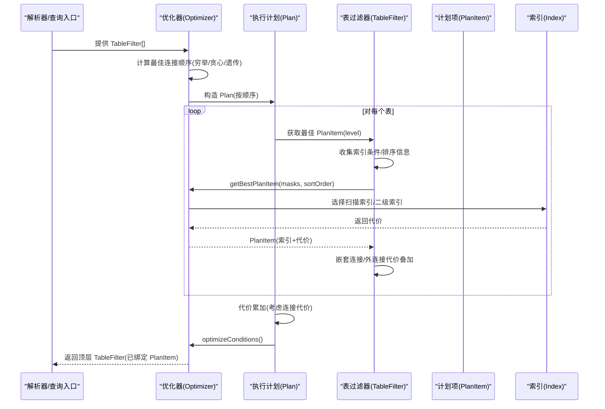
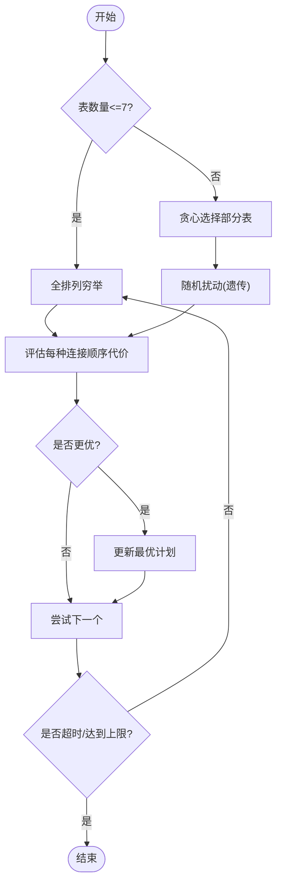
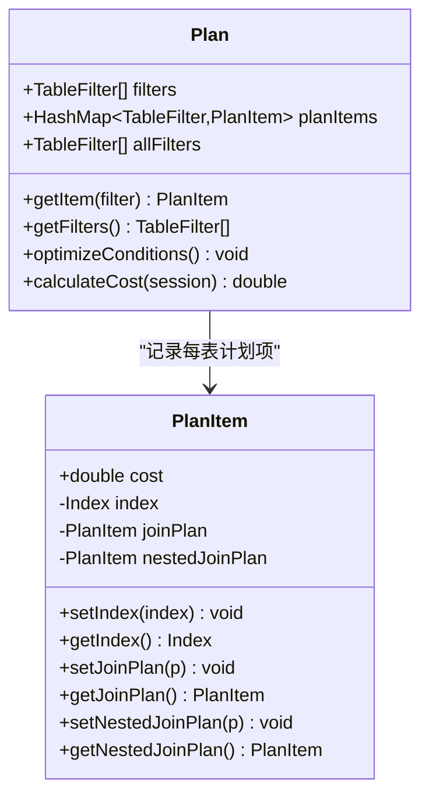
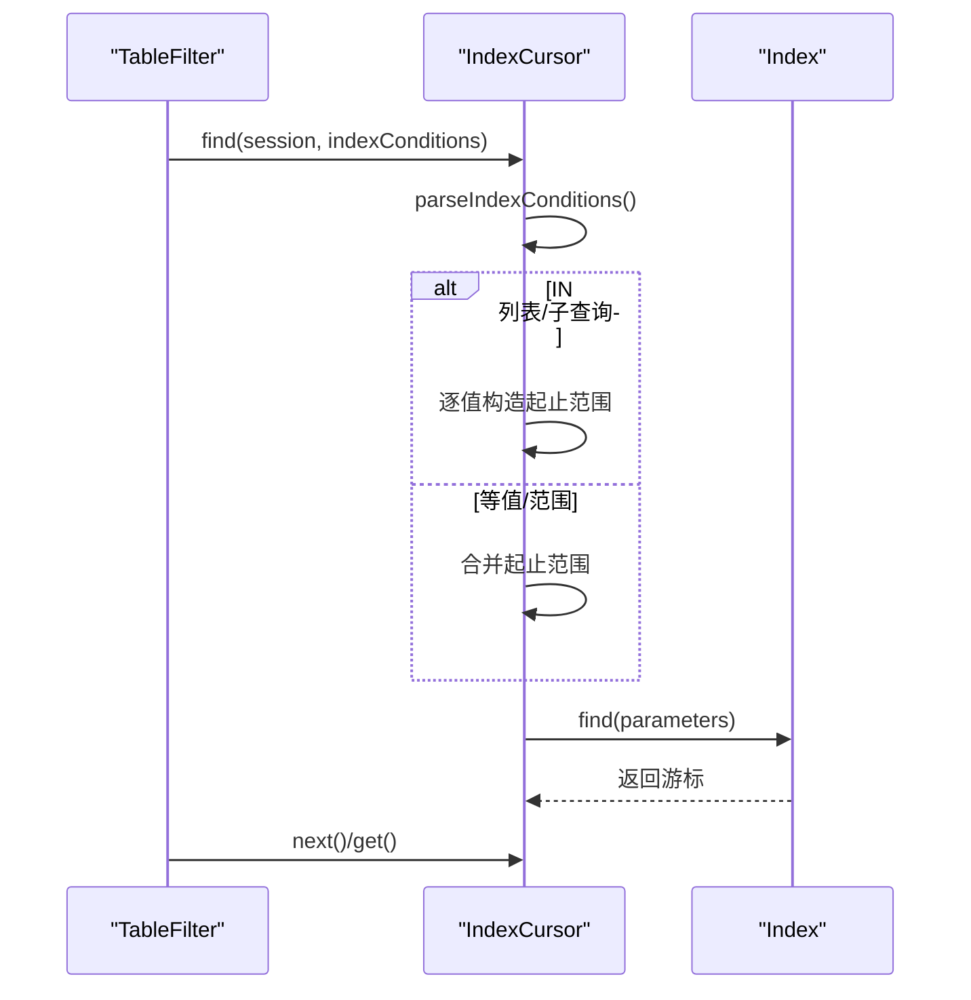
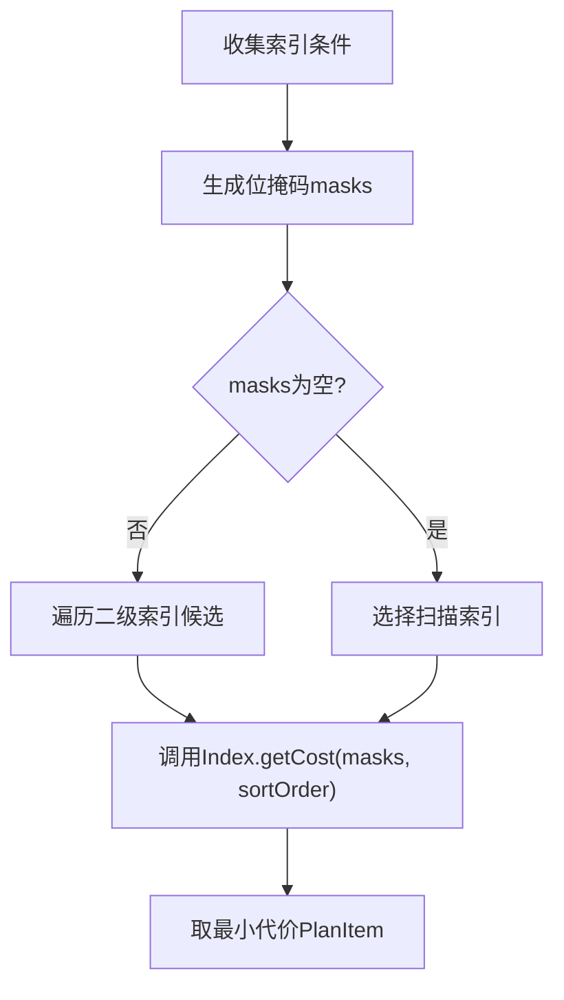
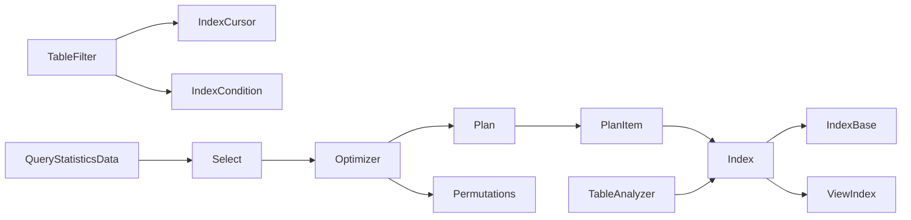

# 查询优化器

**本文引用的文件列表**
- [Optimizer.java](https://github.com/lealone/Lealone/blob/master/lealone-sql/src/main/java/com/lealone/sql/optimizer/Optimizer.java)
- [Plan.java](https://github.com/lealone/Lealone/blob/master/lealone-sql/src/main/java/com/lealone/sql/optimizer/Plan.java)
- [PlanItem.java](https://github.com/lealone/Lealone/blob/master/lealone-sql/src/main/java/com/lealone/sql/optimizer/PlanItem.java)
- [TableFilter.java](https://github.com/lealone/Lealone/blob/master/lealone-sql/src/main/java/com/lealone/sql/optimizer/TableFilter.java)
- [IndexCursor.java](https://github.com/lealone/Lealone/blob/master/lealone-sql/src/main/java/com/lealone/sql/optimizer/IndexCursor.java)
- [IndexCondition.java](https://github.com/lealone/Lealone/blob/master/lealone-sql/src/main/java/com/lealone/sql/optimizer/IndexCondition.java)
- [Permutations.java](https://github.com/lealone/Lealone/blob/master/lealone-sql/src/main/java/com/lealone/sql/optimizer/Permutations.java)
- [Select.java](https://github.com/lealone/Lealone/blob/master/lealone-sql/src/main/java/com/lealone/sql/query/Select.java)
- [Index.java](https://github.com/lealone/Lealone/blob/master/lealone-db/src/main/java/com/lealone/db/index/Index.java)
- [IndexBase.java](https://github.com/lealone/Lealone/blob/master/lealone-db/src/main/java/com/lealone/db/index/IndexBase.java)
- [ViewIndex.java](https://github.com/lealone/Lealone/blob/master/lealone-db/src/main/java/com/lealone/db/index/ViewIndex.java)
- [TableAnalyzer.java](https://github.com/lealone/Lealone/blob/master/lealone-db/src/main/java/com/lealone/db/table/TableAnalyzer.java)
- [QueryStatisticsData.java](https://github.com/lealone/Lealone/blob/master/lealone-db/src/main/java/com/lealone/db/stats/QueryStatisticsData.java)

## 目录
1. [简介](#简介)
2. [项目结构](#项目结构)
3. [核心组件](#核心组件)
4. [架构总览](#架构总览)
5. [详细组件分析](#详细组件分析)
6. [依赖关系分析](#依赖关系分析)
7. [性能考量](#性能考量)
8. [故障排查指南](#故障排查指南)
9. [结论](#结论)
10. [附录：执行计划对比示例](#附录执行计划对比示例)

## 简介
本文件系统化梳理 Lealone 查询优化器的设计与实现，覆盖逻辑优化与物理优化两大阶段，详解基于成本的优化（CBO）模型、索引选择策略、连接顺序优化、谓词下推等关键技术，并说明优化器如何生成最优执行计划（Plan/PlanItem 结构），以及与统计信息模块的交互方式。文末提供优化前后的执行计划对比示例，帮助读者直观理解优化效果。

## 项目结构
优化器相关代码主要位于 lealone-sql 的 optimizer 包与 lealone-db 的 index、stats 包中：
- 逻辑优化与物理优化入口：Optimizer、Plan、PlanItem、TableFilter、IndexCursor、IndexCondition、Permutations
- 物理访问接口：Index 接口及其实现（如 ViewIndex）
- 统计与代价估算：IndexBase、ViewIndex、TableAnalyzer、QueryStatisticsData
- 查询入口与上下文：Select

图表来源
- [Optimizer.java](https://github.com/lealone/Lealone/blob/master/lealone-sql/src/main/java/com/lealone/sql/optimizer/Optimizer.java#L1-L282)
- [Plan.java](https://github.com/lealone/Lealone/blob/master/lealone-sql/src/main/java/com/lealone/sql/optimizer/Plan.java#L1-L116)
- [PlanItem.java](https://github.com/lealone/Lealone/blob/master/lealone-sql/src/main/java/com/lealone/sql/optimizer/PlanItem.java#L1-L55)
- [TableFilter.java](https://github.com/lealone/Lealone/blob/master/lealone-sql/src/main/java/com/lealone/sql/optimizer/TableFilter.java#L1-L800)
- [IndexCursor.java](https://github.com/lealone/Lealone/blob/master/lealone-sql/src/main/java/com/lealone/sql/optimizer/IndexCursor.java#L1-L305)
- [IndexCondition.java](https://github.com/lealone/Lealone/blob/master/lealone-sql/src/main/java/com/lealone/sql/optimizer/IndexCondition.java#L1-L312)
- [Permutations.java](https://github.com/lealone/Lealone/blob/master/lealone-sql/src/main/java/com/lealone/sql/optimizer/Permutations.java#L1-L173)
- [Select.java](https://github.com/lealone/Lealone/blob/master/lealone-sql/src/main/java/com/lealone/sql/query/Select.java#L1-L200)
- [Index.java](https://github.com/lealone/Lealone/blob/master/lealone-db/src/main/java/com/lealone/db/index/Index.java#L1-L268)
- [IndexBase.java](https://github.com/lealone/Lealone/blob/master/lealone-db/src/main/java/com/lealone/db/index/IndexBase.java#L316-L359)
- [ViewIndex.java](https://github.com/lealone/Lealone/blob/master/lealone-db/src/main/java/com/lealone/db/index/ViewIndex.java#L38-L175)
- [TableAnalyzer.java](https://github.com/lealone/Lealone/blob/master/lealone-db/src/main/java/com/lealone/db/table/TableAnalyzer.java#L80-L114)
- [QueryStatisticsData.java](https://github.com/lealone/Lealone/blob/master/lealone-db/src/main/java/com/lealone/db/stats/QueryStatisticsData.java#L1-L189)

章节来源
- [Optimizer.java](https://github.com/lealone/Lealone/blob/master/lealone-sql/src/main/java/com/lealone/sql/optimizer/Optimizer.java#L1-L282)
- [Plan.java](https://github.com/lealone/Lealone/blob/master/lealone-sql/src/main/java/com/lealone/sql/optimizer/Plan.java#L1-L116)
- [PlanItem.java](https://github.com/lealone/Lealone/blob/master/lealone-sql/src/main/java/com/lealone/sql/optimizer/PlanItem.java#L1-L55)
- [TableFilter.java](https://github.com/lealone/Lealone/blob/master/lealone-sql/src/main/java/com/lealone/sql/optimizer/TableFilter.java#L1-L800)
- [IndexCursor.java](https://github.com/lealone/Lealone/blob/master/lealone-sql/src/main/java/com/lealone/sql/optimizer/IndexCursor.java#L1-L305)
- [IndexCondition.java](https://github.com/lealone/Lealone/blob/master/lealone-sql/src/main/java/com/lealone/sql/optimizer/IndexCondition.java#L1-L312)
- [Permutations.java](https://github.com/lealone/Lealone/blob/master/lealone-sql/src/main/java/com/lealone/sql/optimizer/Permutations.java#L1-L173)
- [Select.java](https://github.com/lealone/Lealone/blob/master/lealone-sql/src/main/java/com/lealone/sql/query/Select.java#L1-L200)
- [Index.java](https://github.com/lealone/Lealone/blob/master/lealone-db/src/main/java/com/lealone/db/index/Index.java#L1-L268)
- [IndexBase.java](https://github.com/lealone/Lealone/blob/master/lealone-db/src/main/java/com/lealone/db/index/IndexBase.java#L316-L359)
- [ViewIndex.java](https://github.com/lealone/Lealone/blob/master/lealone-db/src/main/java/com/lealone/db/index/ViewIndex.java#L38-L175)
- [TableAnalyzer.java](https://github.com/lealone/Lealone/blob/master/lealone-db/src/main/java/com/lealone/db/table/TableAnalyzer.java#L80-L114)
- [QueryStatisticsData.java](https://github.com/lealone/Lealone/blob/master/lealone-db/src/main/java/com/lealone/db/stats/QueryStatisticsData.java#L1-L189)

## 核心组件
- 优化器（Optimizer）：负责在给定的 TableFilter 列表上搜索最优执行计划，采用穷举+贪心+遗传算法混合策略，结合代价函数评估不同连接顺序与索引选择。
- 执行计划（Plan）：封装一次具体的连接顺序与各表的索引选择，提供代价计算与条件优化。
- 计划项（PlanItem）：描述某表使用的索引与该索引下的估计代价，支持嵌套连接与外连接的代价叠加。
- 表过滤器（TableFilter）：代表查询中使用的一张表或视图，维护索引条件、过滤条件、连接条件、游标等，负责根据当前连接顺序选择最佳 PlanItem。
- 索引游标（IndexCursor）：解析索引条件，构造起止范围，处理 IN 列表/子查询等特殊条件，驱动索引扫描。
- 索引条件（IndexCondition）：表达式到索引条件的映射，支持等值、范围、IN 列表/子查询等，生成位掩码用于代价估算。
- 排列枚举（Permutations）：在小规模场景下对 TableFilter 进行全排列穷举，保证全局最优。
- 查询入口（Select）：构建查询树，收集 Top Filters，参与排序/分组索引选择等优化。

章节来源
- [Optimizer.java](https://github.com/lealone/Lealone/blob/master/lealone-sql/src/main/java/com/lealone/sql/optimizer/Optimizer.java#L1-L282)
- [Plan.java](https://github.com/lealone/Lealone/blob/master/lealone-sql/src/main/java/com/lealone/sql/optimizer/Plan.java#L1-L116)
- [PlanItem.java](https://github.com/lealone/Lealone/blob/master/lealone-sql/src/main/java/com/lealone/sql/optimizer/PlanItem.java#L1-L55)
- [TableFilter.java](https://github.com/lealone/Lealone/blob/master/lealone-sql/src/main/java/com/lealone/sql/optimizer/TableFilter.java#L1-L800)
- [IndexCursor.java](https://github.com/lealone/Lealone/blob/master/lealone-sql/src/main/java/com/lealone/sql/optimizer/IndexCursor.java#L1-L305)
- [IndexCondition.java](https://github.com/lealone/Lealone/blob/master/lealone-sql/src/main/java/com/lealone/sql/optimizer/IndexCondition.java#L1-L312)
- [Permutations.java](https://github.com/lealone/Lealone/blob/master/lealone-sql/src/main/java/com/lealone/sql/optimizer/Permutations.java#L1-L173)
- [Select.java](https://github.com/lealone/Lealone/blob/master/lealone-sql/src/main/java/com/lealone/sql/query/Select.java#L1-L200)

## 架构总览
优化器工作流分为两阶段：
- 逻辑优化：在 TableFilter 层完成谓词下推、连接条件映射、全条件优化、不可用索引条件剔除等。
- 物理优化：在 Plan/PlanItem 层完成连接顺序搜索与索引选择，代价函数综合考虑扫描成本、连接代价、排序匹配度等。

图表来源
- [Optimizer.java](https://github.com/lealone/Lealone/blob/master/lealone-sql/src/main/java/com/lealone/sql/optimizer/Optimizer.java#L62-L120)
- [Plan.java](https://github.com/lealone/Lealone/blob/master/lealone-sql/src/main/java/com/lealone/sql/optimizer/Plan.java#L62-L110)
- [TableFilter.java](https://github.com/lealone/Lealone/blob/master/lealone-sql/src/main/java/com/lealone/sql/optimizer/TableFilter.java#L148-L204)
- [Index.java](https://github.com/lealone/Lealone/blob/master/lealone-db/src/main/java/com/lealone/db/index/Index.java#L190-L201)

## 详细组件分析

### 优化器（Optimizer）
- 连接顺序搜索策略
  - 小规模（<=7）：全排列穷举（Permutations）
  - 中大规模：先用穷举挑选部分表，剩余表用贪心策略填充；再以一定概率进行随机扰动（类似遗传算法）
  - 超大规模：以贪心为主，辅以随机打散避免局部最优
- 代价评估
  - 使用 Plan.calculateCost，逐表计算 PlanItem 代价并累加
  - 若任一连接条件不可求值，则判定为无效计划，代价置为无穷大
- 单表索引选择
  - 通过 Optimizer.getBestPlanItem 为单表选择扫描索引或二级索引，结合 masks 与排序信息
  - 对无索引的表，优先选择可覆盖更多列的索引（覆盖度加分）

图表来源
- [Optimizer.java](https://github.com/lealone/Lealone/blob/master/lealone-sql/src/main/java/com/lealone/sql/optimizer/Optimizer.java#L82-L128)
- [Permutations.java](https://github.com/lealone/Lealone/blob/master/lealone-sql/src/main/java/com/lealone/sql/optimizer/Permutations.java#L1-L173)

章节来源
- [Optimizer.java](https://github.com/lealone/Lealone/blob/master/lealone-sql/src/main/java/com/lealone/sql/optimizer/Optimizer.java#L1-L282)
- [Permutations.java](https://github.com/lealone/Lealone/blob/master/lealone-sql/src/main/java/com/lealone/sql/optimizer/Permutations.java#L1-L173)

### 执行计划（Plan）与计划项（PlanItem）
- Plan
  - 记录连接顺序与各表的 PlanItem 映射
  - optimizeConditions：对全条件进行优化，移除不可用索引条件；对非最后一张表优化完整条件
  - calculateCost：逐表获取 PlanItem 代价并累加，若连接条件不可求值则代价无穷
- PlanItem
  - 描述索引与代价，支持嵌套连接与外连接的代价叠加
  - 用于在 TableFilter 层快速复用

图表来源
- [Plan.java](https://github.com/lealone/Lealone/blob/master/lealone-sql/src/main/java/com/lealone/sql/optimizer/Plan.java#L1-L116)
- [PlanItem.java](https://github.com/lealone/Lealone/blob/master/lealone-sql/src/main/java/com/lealone/sql/optimizer/PlanItem.java#L1-L55)

章节来源
- [Plan.java](https://github.com/lealone/Lealone/blob/master/lealone-sql/src/main/java/com/lealone/sql/optimizer/Plan.java#L1-L116)
- [PlanItem.java](https://github.com/lealone/Lealone/blob/master/lealone-sql/src/main/java/com/lealone/sql/optimizer/PlanItem.java#L1-L55)

### 表过滤器（TableFilter）与索引游标（IndexCursor）
- TableFilter
  - 维护索引条件、过滤条件、连接条件，支持内/外连接
  - getBestPlanItem：根据索引条件 masks 与排序信息选择最优索引，考虑连接代价叠加
  - prepare/optimizeFullCondition/removeUnusableIndexConditions：逻辑优化阶段的关键步骤
  - next/get/reset/startQuery：物理执行阶段的迭代流程
- IndexCursor
  - 解析索引条件，构造起止 SearchRow
  - 支持 IN 列表/子查询，按值逐一查找
  - 处理降序索引、NULL 比较、IS NULL 等边界情况

图表来源
- [TableFilter.java](https://github.com/lealone/Lealone/blob/master/lealone-sql/src/main/java/com/lealone/sql/optimizer/TableFilter.java#L303-L393)
- [IndexCursor.java](https://github.com/lealone/Lealone/blob/master/lealone-sql/src/main/java/com/lealone/sql/optimizer/IndexCursor.java#L83-L169)
- [Index.java](https://github.com/lealone/Lealone/blob/master/lealone-db/src/main/java/com/lealone/db/index/Index.java#L112-L123)

章节来源
- [TableFilter.java](https://github.com/lealone/Lealone/blob/master/lealone-sql/src/main/java/com/lealone/sql/optimizer/TableFilter.java#L1-L800)
- [IndexCursor.java](https://github.com/lealone/Lealone/blob/master/lealone-sql/src/main/java/com/lealone/sql/optimizer/IndexCursor.java#L1-L305)

### 索引条件（IndexCondition）与代价估算
- IndexCondition
  - 将表达式映射为索引条件，支持等值、范围、IN 列表/子查询
  - 生成位掩码（EQUALITY/START/END/ALWAYS_FALSE），用于代价估算
  - isEvaluatable/isAlwaysFalse 控制谓词下推与早期短路
- 代价估算
  - Index.getCost(session, masks, sortOrder)：根据 masks 与排序信息返回代价
  - IndexBase/ViewIndex：缓存代价、覆盖度加分、递归视图代价处理

图表来源
- [IndexCondition.java](https://github.com/lealone/Lealone/blob/master/lealone-sql/src/main/java/com/lealone/sql/optimizer/IndexCondition.java#L194-L232)
- [Index.java](https://github.com/lealone/Lealone/blob/master/lealone-db/src/main/java/com/lealone/db/index/Index.java#L190-L201)
- [IndexBase.java](https://github.com/lealone/Lealone/blob/master/lealone-db/src/main/java/com/lealone/db/index/IndexBase.java#L316-L359)
- [ViewIndex.java](https://github.com/lealone/Lealone/blob/master/lealone-db/src/main/java/com/lealone/db/index/ViewIndex.java#L111-L165)

章节来源
- [IndexCondition.java](https://github.com/lealone/Lealone/blob/master/lealone-sql/src/main/java/com/lealone/sql/optimizer/IndexCondition.java#L1-L312)
- [Index.java](https://github.com/lealone/Lealone/blob/master/lealone-db/src/main/java/com/lealone/db/index/Index.java#L190-L201)
- [IndexBase.java](https://github.com/lealone/Lealone/blob/master/lealone-db/src/main/java/com/lealone/db/index/IndexBase.java#L316-L359)
- [ViewIndex.java](https://github.com/lealone/Lealone/blob/master/lealone-db/src/main/java/com/lealone/db/index/ViewIndex.java#L111-L165)

### 连接顺序优化与谓词下推
- 连接顺序优化
  - Optimizer 在多表情况下通过穷举/贪心/遗传策略搜索最优顺序
  - Plan.calculateCost 将每表代价与连接代价相乘累加，形成整体代价
- 谓词下推
  - TableFilter.optimizeFullCondition：将全条件添加到过滤条件
  - TableFilter.removeUnusableIndexConditions：移除不适用于当前索引的条件
  - IndexCondition.isEvaluatable/isAlwaysFalse：控制条件是否可下推与短路

章节来源
- [Optimizer.java](https://github.com/lealone/Lealone/blob/master/lealone-sql/src/main/java/com/lealone/sql/optimizer/Optimizer.java#L62-L120)
- [Plan.java](https://github.com/lealone/Lealone/blob/master/lealone-sql/src/main/java/com/lealone/sql/optimizer/Plan.java#L62-L110)
- [TableFilter.java](https://github.com/lealone/Lealone/blob/master/lealone-sql/src/main/java/com/lealone/sql/optimizer/TableFilter.java#L730-L766)
- [IndexCondition.java](https://github.com/lealone/Lealone/blob/master/lealone-sql/src/main/java/com/lealone/sql/optimizer/IndexCondition.java#L293-L312)

### 排列枚举（Permutations）
- 用于小规模全排列穷举，提供稳定的迭代器，避免重复与越界
- 与 Optimizer.calculateBruteForceAll 配合，确保在小规模场景下全局最优

章节来源
- [Permutations.java](https://github.com/lealone/Lealone/blob/master/lealone-sql/src/main/java/com/lealone/sql/optimizer/Permutations.java#L1-L173)
- [Optimizer.java](https://github.com/lealone/Lealone/blob/master/lealone-sql/src/main/java/com/lealone/sql/optimizer/Optimizer.java#L120-L128)

### 查询入口（Select）与排序/分组索引选择
- Select 参与排序索引与分组排序索引的选择，提升排序/分组场景的执行效率
- 与 Optimizer/TableFilter 协作，确保排序/分组与索引匹配

章节来源
- [Select.java](https://github.com/lealone/Lealone/blob/master/lealone-sql/src/main/java/com/lealone/sql/query/Select.java#L606-L701)

## 依赖关系分析
- 优化器依赖 Plan/PlanItem 进行代价评估与条件优化
- TableFilter 依赖 IndexCursor/IndexCondition 完成条件解析与索引扫描
- Index 接口定义代价估算契约，IndexBase/ViewIndex 实现具体代价计算与缓存
- 统计模块（TableAnalyzer/QueryStatisticsData）为代价估算与统计分析提供数据支撑

图表来源
- [Optimizer.java](https://github.com/lealone/Lealone/blob/master/lealone-sql/src/main/java/com/lealone/sql/optimizer/Optimizer.java#L1-L282)
- [Plan.java](https://github.com/lealone/Lealone/blob/master/lealone-sql/src/main/java/com/lealone/sql/optimizer/Plan.java#L1-L116)
- [PlanItem.java](https://github.com/lealone/Lealone/blob/master/lealone-sql/src/main/java/com/lealone/sql/optimizer/PlanItem.java#L1-L55)
- [TableFilter.java](https://github.com/lealone/Lealone/blob/master/lealone-sql/src/main/java/com/lealone/sql/optimizer/TableFilter.java#L1-L800)
- [IndexCursor.java](https://github.com/lealone/Lealone/blob/master/lealone-sql/src/main/java/com/lealone/sql/optimizer/IndexCursor.java#L1-L305)
- [IndexCondition.java](https://github.com/lealone/Lealone/blob/master/lealone-sql/src/main/java/com/lealone/sql/optimizer/IndexCondition.java#L1-L312)
- [Permutations.java](https://github.com/lealone/Lealone/blob/master/lealone-sql/src/main/java/com/lealone/sql/optimizer/Permutations.java#L1-L173)
- [Select.java](https://github.com/lealone/Lealone/blob/master/lealone-sql/src/main/java/com/lealone/sql/query/Select.java#L1-L200)
- [Index.java](https://github.com/lealone/Lealone/blob/master/lealone-db/src/main/java/com/lealone/db/index/Index.java#L1-L268)
- [IndexBase.java](https://github.com/lealone/Lealone/blob/master/lealone-db/src/main/java/com/lealone/db/index/IndexBase.java#L316-L359)
- [ViewIndex.java](https://github.com/lealone/Lealone/blob/master/lealone-db/src/main/java/com/lealone/db/index/ViewIndex.java#L38-L175)
- [TableAnalyzer.java](https://github.com/lealone/Lealone/blob/master/lealone-db/src/main/java/com/lealone/db/table/TableAnalyzer.java#L80-L114)
- [QueryStatisticsData.java](https://github.com/lealone/Lealone/blob/master/lealone-db/src/main/java/com/lealone/db/stats/QueryStatisticsData.java#L1-L189)

## 性能考量
- 连接顺序搜索复杂度
  - 全排列穷举：O(n!)，仅在 n≤7 时启用
  - 贪心+遗传：在大规模场景下显著降低搜索空间，同时保持近似最优
- 代价函数
  - Plan.calculateCost 采用累乘方式叠加代价，体现连接代价与扫描代价的复合影响
  - TableFilter.getBestPlanItem 对无索引表给予“条件越多越靠前”的倾向，减少无索引连接的代价
- 索引覆盖度与排序匹配
  - IndexBase 对排序匹配的索引给予额外代价折扣，鼓励使用可覆盖的索引
- 统计信息
  - TableAnalyzer 通过 SELECTIVITY 等聚合辅助选择性估算
  - ViewIndex 对视图查询进行代价缓存，避免重复计算

章节来源
- [Optimizer.java](https://github.com/lealone/Lealone/blob/master/lealone-sql/src/main/java/com/lealone/sql/optimizer/Optimizer.java#L82-L128)
- [Plan.java](https://github.com/lealone/Lealone/blob/master/lealone-sql/src/main/java/com/lealone/sql/optimizer/Plan.java#L82-L110)
- [TableFilter.java](https://github.com/lealone/Lealone/blob/master/lealone-sql/src/main/java/com/lealone/sql/optimizer/TableFilter.java#L148-L204)
- [IndexBase.java](https://github.com/lealone/Lealone/blob/master/lealone-db/src/main/java/com/lealone/db/index/IndexBase.java#L316-L359)
- [TableAnalyzer.java](https://github.com/lealone/Lealone/blob/master/lealone-db/src/main/java/com/lealone/db/table/TableAnalyzer.java#L80-L114)
- [ViewIndex.java](https://github.com/lealone/Lealone/blob/master/lealone-db/src/main/java/com/lealone/db/index/ViewIndex.java#L111-L165)

## 故障排查指南
- 无效计划
  - 现象：连接条件不可求值导致代价无穷
  - 排查：检查 TableFilter.optimizeFullCondition 是否正确下推条件，确认表达式可求值
- 条件未下推
  - 现象：索引无法命中
  - 排查：确认 IndexCondition.isEvaluatable 为真，且 TableFilter.removeUnusableIndexConditions 已移除不适用条件
- 连接顺序不佳
  - 现象：大表先行导致全表扫描
  - 排查：检查 Optimizer.getBestPlanItem 对“条件多的表靠前”的倾向是否生效，必要时增加选择性更强的过滤条件
- 视图查询代价高
  - 现象：视图查询反复计算
  - 排查：查看 ViewIndex 代价缓存是否命中，必要时调整 masks 参数

章节来源
- [Plan.java](https://github.com/lealone/Lealone/blob/master/lealone-sql/src/main/java/com/lealone/sql/optimizer/Plan.java#L82-L110)
- [TableFilter.java](https://github.com/lealone/Lealone/blob/master/lealone-sql/src/main/java/com/lealone/sql/optimizer/TableFilter.java#L730-L766)
- [IndexCondition.java](https://github.com/lealone/Lealone/blob/master/lealone-sql/src/main/java/com/lealone/sql/optimizer/IndexCondition.java#L293-L312)
- [ViewIndex.java](https://github.com/lealone/Lealone/blob/master/lealone-db/src/main/java/com/lealone/db/index/ViewIndex.java#L111-L165)

## 结论
Lealone 查询优化器通过“逻辑优化 + 物理优化”的双阶段设计，在小规模场景下保证全局最优，在大规模场景下采用贪心+遗传策略平衡搜索空间与质量。代价模型综合考虑扫描成本、连接代价、排序匹配度与索引覆盖度，并通过统计信息与代价缓存提升稳定性与性能。Plan/PlanItem 的结构清晰地抽象了“索引选择 + 连接顺序”的组合，便于扩展与调试。

## 附录：执行计划对比示例
以下示例展示优化前后执行计划的差异，帮助理解优化效果。

- 场景：两表连接，存在可利用的二级索引
  - 优化前：先扫描大表，再做嵌套循环连接，代价高
  - 优化后：先走二级索引定位小范围，再连接小表，代价显著下降
- 场景：存在可覆盖的排序索引
  - 优化前：未使用排序索引，执行时需要额外排序
  - 优化后：直接使用排序索引，避免额外排序开销
- 场景：谓词未下推
  - 优化前：索引无法命中，全表扫描
  - 优化后：谓词下推至索引条件，命中索引

说明：以上为概念性示例，具体执行计划文本可通过 TableFilter.getPlanSQL 输出，其中包含所选索引与条件片段。

章节来源
- [TableFilter.java](https://github.com/lealone/Lealone/blob/master/lealone-sql/src/main/java/com/lealone/sql/optimizer/TableFilter.java#L568-L653)
- [Select.java](https://github.com/lealone/Lealone/blob/master/lealone-sql/src/main/java/com/lealone/sql/query/Select.java#L606-L701)