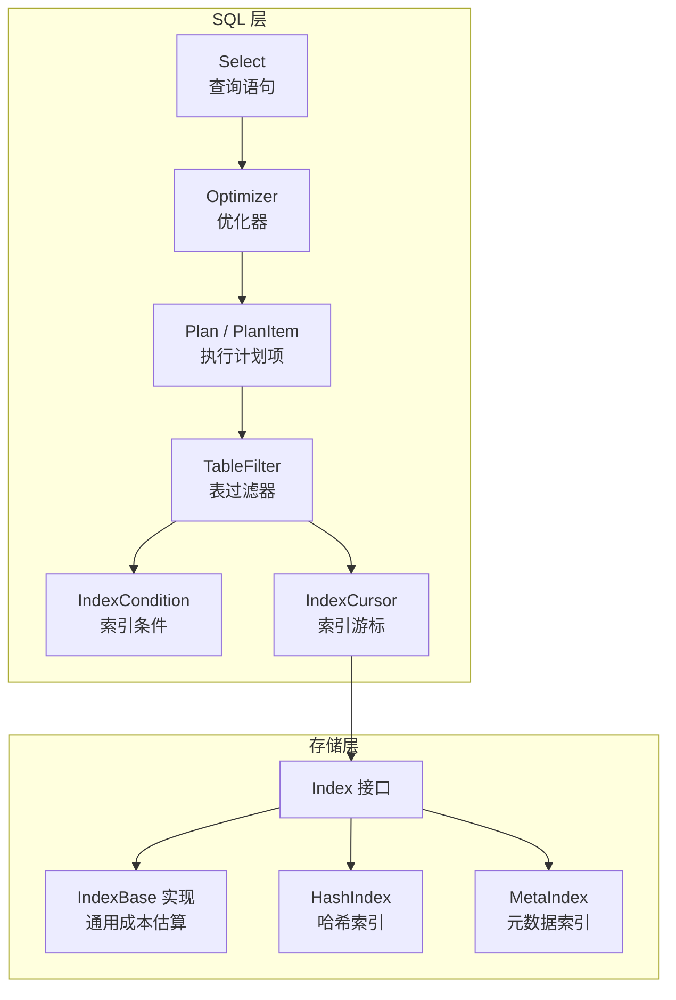
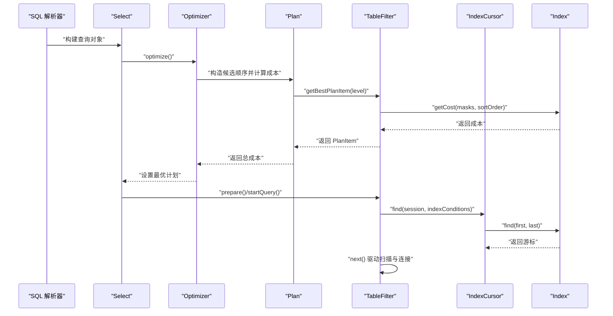
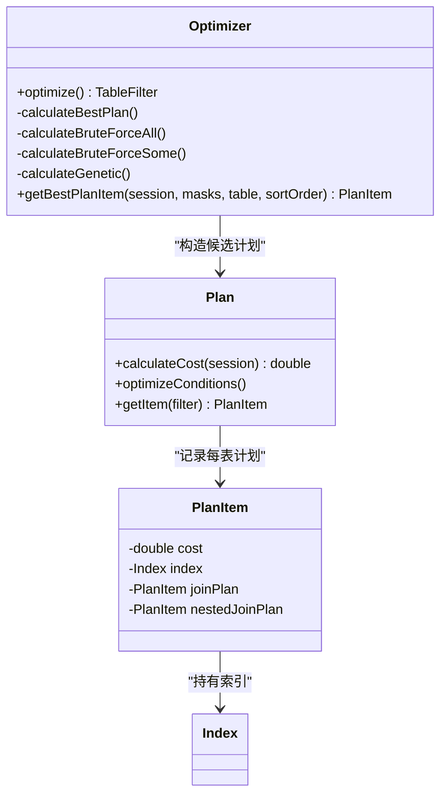
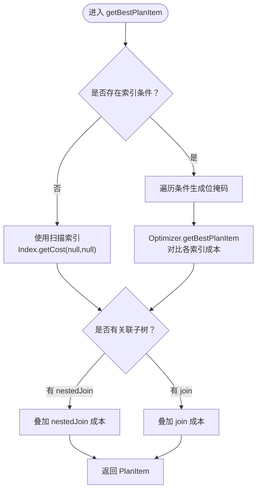
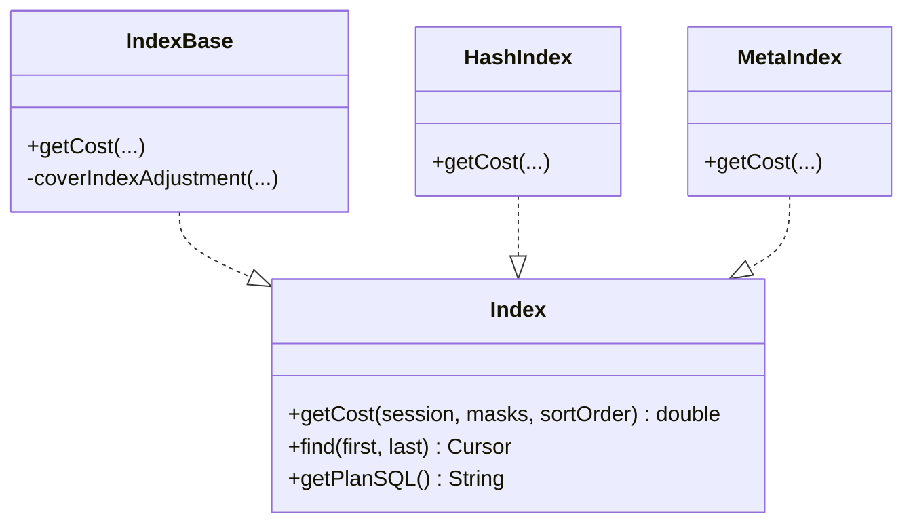
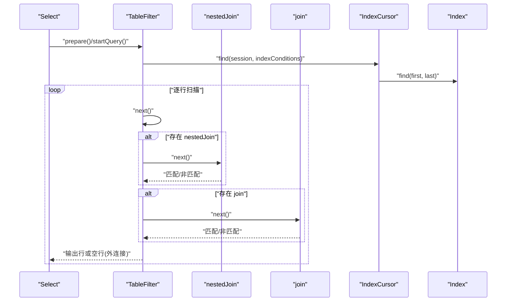
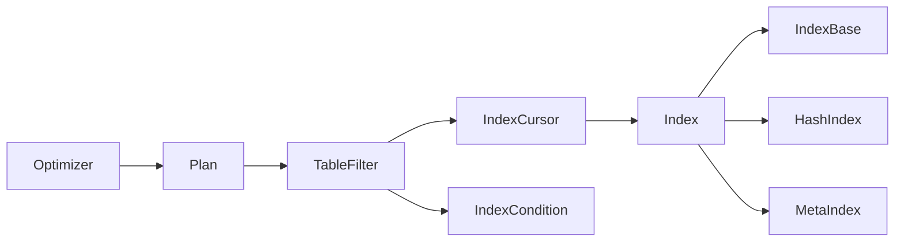

# 物理优化

<cite>
**本文引用的文件**
- [Optimizer.java](https://github.com/lealone/Lealone/blob/master/lealone-sql/src/main/java/com/lealone/sql/optimizer/Optimizer.java)
- [Plan.java](https://github.com/lealone/Lealone/blob/master/lealone-sql/src/main/java/com/lealone/sql/optimizer/Plan.java)
- [PlanItem.java](https://github.com/lealone/Lealone/blob/master/lealone-sql/src/main/java/com/lealone/sql/optimizer/PlanItem.java)
- [TableFilter.java](https://github.com/lealone/Lealone/blob/master/lealone-sql/src/main/java/com/lealone/sql/optimizer/TableFilter.java)
- [IndexCondition.java](https://github.com/lealone/Lealone/blob/master/lealone-sql/src/main/java/com/lealone/sql/optimizer/IndexCondition.java)
- [IndexCursor.java](https://github.com/lealone/Lealone/blob/master/lealone-sql/src/main/java/com/lealone/sql/optimizer/IndexCursor.java)
- [Index.java](https://github.com/lealone/Lealone/blob/master/lealone-db/src/main/java/com/lealone/db/index/Index.java)
- [IndexBase.java](https://github.com/lealone/Lealone/blob/master/lealone-db/src/main/java/com/lealone/db/index/IndexBase.java)
- [HashIndex.java](https://github.com/lealone/Lealone/blob/master/lealone-db/src/main/java/com/lealone/db/index/hash/HashIndex.java)
- [MetaIndex.java](https://github.com/lealone/Lealone/blob/master/lealone-db/src/main/java/com/lealone/db/index/MetaIndex.java)
- [Select.java](https://github.com/lealone/Lealone/blob/master/lealone-sql/src/main/java/com/lealone/sql/query/Select.java)
- [SQLParserBase.java](https://github.com/lealone/Lealone/blob/master/lealone-sql/src/main/java/com/lealone/sql/SQLParserBase.java)
- [Explain.java](https://github.com/lealone/Lealone/blob/master/lealone-sql/src/main/java/com/lealone/sql/dml/Explain.java)
- [JoinTest.java](https://github.com/lealone/Lealone/blob/master/lealone-test/src/test/java/com/lealone/test/sql/query/JoinTest.java)
</cite>

## 目录
1. [简介](#简介)
2. [项目结构](#项目结构)
3. [核心组件](#核心组件)
4. [架构总览](#架构总览)
5. [详细组件分析](#详细组件分析)
6. [依赖关系分析](#依赖关系分析)
7. [性能考量](#性能考量)
8. [故障排查指南](#故障排查指南)
9. [结论](#结论)
10. [附录](#附录)

## 简介
本文件系统性阐述 Lealone 的物理优化阶段工作机制，聚焦于如何将逻辑执行计划转换为具体的物理执行计划。内容涵盖：
- 从逻辑表达式到物理算子（IndexScan、TableScan、Join 等）的选择策略
- 连接算法（Nested Loop、Hash Join 等）的适用场景与选择依据
- 物理优化如何综合考虑数据分布、索引可用性、排序需求与系统资源
- 通过执行计划示例展示优化决策过程与结果

## 项目结构
围绕物理优化的关键模块主要分布在以下包：
- lealone-sql/sql/optimizer：查询优化器与执行计划构建
- lealone-sql/sql/query：查询语句解析与执行入口
- lealone-db/db/index：索引接口与具体实现（B-Tree、Hash、元数据索引等）
- lealone-sql/sql/dml：EXPLAIN 等执行计划展示命令

图表来源
- [Select.java](https://github.com/lealone/Lealone/blob/master/lealone-sql/src/main/java/com/lealone/sql/query/Select.java#L1-L120)
- [Optimizer.java](https://github.com/lealone/Lealone/blob/master/lealone-sql/src/main/java/com/lealone/sql/optimizer/Optimizer.java#L53-L120)
- [Plan.java](https://github.com/lealone/Lealone/blob/master/lealone-sql/src/main/java/com/lealone/sql/optimizer/Plan.java#L21-L60)
- [PlanItem.java](https://github.com/lealone/Lealone/blob/master/lealone-sql/src/main/java/com/lealone/sql/optimizer/PlanItem.java#L1-L55)
- [TableFilter.java](https://github.com/lealone/Lealone/blob/master/lealone-sql/src/main/java/com/lealone/sql/optimizer/TableFilter.java#L120-L210)
- [IndexCondition.java](https://github.com/lealone/Lealone/blob/master/lealone-sql/src/main/java/com/lealone/sql/optimizer/IndexCondition.java#L190-L240)
- [IndexCursor.java](https://github.com/lealone/Lealone/blob/master/lealone-sql/src/main/java/com/lealone/sql/optimizer/IndexCursor.java#L41-L120)
- [Index.java](https://github.com/lealone/Lealone/blob/master/lealone-db/src/main/java/com/lealone/db/index/Index.java#L190-L210)
- [IndexBase.java](https://github.com/lealone/Lealone/blob/master/lealone-db/src/main/java/com/lealone/db/index/IndexBase.java#L248-L337)
- [HashIndex.java](https://github.com/lealone/Lealone/blob/master/lealone-db/src/main/java/com/lealone/db/index/hash/HashIndex.java#L69-L89)
- [MetaIndex.java](https://github.com/lealone/Lealone/blob/master/lealone-db/src/main/java/com/lealone/db/index/MetaIndex.java#L42-L89)

章节来源
- [Select.java](https://github.com/lealone/Lealone/blob/master/lealone-sql/src/main/java/com/lealone/sql/query/Select.java#L1-L120)
- [Optimizer.java](https://github.com/lealone/Lealone/blob/master/lealone-sql/src/main/java/com/lealone/sql/optimizer/Optimizer.java#L53-L120)

## 核心组件
- 优化器 Optimizer：负责在给定的表过滤器集合上搜索最佳执行顺序与索引选择，采用穷举、贪心与遗传混合策略。
- 执行计划 Plan/PlanItem：封装每个表的最优索引与成本，并支持连接成本叠加。
- 表过滤器 TableFilter：代表查询中使用的每个表或视图，维护索引条件、过滤条件、连接关系与游标状态。
- 索引条件 IndexCondition：将表达式映射为可被索引利用的比较类型（等值、范围、IN 等），并生成位掩码用于成本评估。
- 索引游标 IndexCursor：根据索引条件解析起止范围，驱动索引扫描。
- 索引接口 Index 与实现：提供 getCost 估算、find 游标创建、覆盖索引与排序匹配等能力；HashIndex/MetaIndex 提供特定场景的成本约束。

章节来源
- [Optimizer.java](https://github.com/lealone/Lealone/blob/master/lealone-sql/src/main/java/com/lealone/sql/optimizer/Optimizer.java#L53-L120)
- [Plan.java](https://github.com/lealone/Lealone/blob/master/lealone-sql/src/main/java/com/lealone/sql/optimizer/Plan.java#L21-L115)
- [PlanItem.java](https://github.com/lealone/Lealone/blob/master/lealone-sql/src/main/java/com/lealone/sql/optimizer/PlanItem.java#L1-L55)
- [TableFilter.java](https://github.com/lealone/Lealone/blob/master/lealone-sql/src/main/java/com/lealone/sql/optimizer/TableFilter.java#L120-L210)
- [IndexCondition.java](https://github.com/lealone/Lealone/blob/master/lealone-sql/src/main/java/com/lealone/sql/optimizer/IndexCondition.java#L190-L240)
- [IndexCursor.java](https://github.com/lealone/Lealone/blob/master/lealone-sql/src/main/java/com/lealone/sql/optimizer/IndexCursor.java#L41-L120)
- [Index.java](https://github.com/lealone/Lealone/blob/master/lealone-db/src/main/java/com/lealone/db/index/Index.java#L190-L210)
- [IndexBase.java](https://github.com/lealone/Lealone/blob/master/lealone-db/src/main/java/com/lealone/db/index/IndexBase.java#L248-L337)
- [HashIndex.java](https://github.com/lealone/Lealone/blob/master/lealone-db/src/main/java/com/lealone/db/index/hash/HashIndex.java#L69-L89)
- [MetaIndex.java](https://github.com/lealone/Lealone/blob/master/lealone-db/src/main/java/com/lealone/db/index/MetaIndex.java#L42-L89)

## 架构总览
物理优化的核心流程如下：
- 解析与映射：SQL 解析后生成 Select，随后构建 TableFilter 树，收集索引条件与连接条件。
- 计划空间搜索：Optimizer 对表访问顺序进行穷举或近似搜索，Plan 计算每种顺序的成本。
- 成本评估：每个 TableFilter 基于 IndexCondition 生成位掩码，调用 Index.getCost 评估索引成本；连接成本按比例叠加。
- 最优计划确定：选择成本最小的 Plan，设置各 TableFilter 的索引与连接计划。
- 执行阶段：TableFilter.next 驱动 IndexCursor 扫描，结合过滤与连接条件输出结果。

图表来源
- [SQLParserBase.java](https://github.com/lealone/Lealone/blob/master/lealone-sql/src/main/java/com/lealone/sql/SQLParserBase.java#L1876-L1931)
- [Select.java](https://github.com/lealone/Lealone/blob/master/lealone-sql/src/main/java/com/lealone/sql/query/Select.java#L1-L120)
- [Optimizer.java](https://github.com/lealone/Lealone/blob/master/lealone-sql/src/main/java/com/lealone/sql/optimizer/Optimizer.java#L67-L120)
- [Plan.java](https://github.com/lealone/Lealone/blob/master/lealone-sql/src/main/java/com/lealone/sql/optimizer/Plan.java#L82-L115)
- [TableFilter.java](https://github.com/lealone/Lealone/blob/master/lealone-sql/src/main/java/com/lealone/sql/optimizer/TableFilter.java#L148-L204)
- [IndexCursor.java](https://github.com/lealone/Lealone/blob/master/lealone-sql/src/main/java/com/lealone/sql/optimizer/IndexCursor.java#L83-L120)
- [Index.java](https://github.com/lealone/Lealone/blob/master/lealone-db/src/main/java/com/lealone/db/index/Index.java#L190-L210)

## 详细组件分析

### 组件一：优化器 Optimizer 与执行计划 Plan/PlanItem
- 作用：在多表连接场景下，对表访问顺序进行搜索，结合每个表的索引选择与连接成本，得到全局最优计划。
- 关键策略：
  - 单表：直接评估扫描索引与可用索引的成本。
  - 多表：当表数 ≤ 7 时穷举所有排列；否则先用“部分穷举 + 贪婪填充”，再以“随机打乱 + 局部交换”的遗传策略迭代优化。
  - 成本计算：Plan 对每个 TableFilter 调用 getBestPlanItem 并累乘成本；若连接条件不可求值，标记为无效计划。
- PlanItem：保存选定的 Index 与成本，并可携带嵌套连接与连接子计划的成本信息。

图表来源
- [Optimizer.java](https://github.com/lealone/Lealone/blob/master/lealone-sql/src/main/java/com/lealone/sql/optimizer/Optimizer.java#L53-L120)
- [Plan.java](https://github.com/lealone/Lealone/blob/master/lealone-sql/src/main/java/com/lealone/sql/optimizer/Plan.java#L21-L115)
- [PlanItem.java](https://github.com/lealone/Lealone/blob/master/lealone-sql/src/main/java/com/lealone/sql/optimizer/PlanItem.java#L1-L55)

章节来源
- [Optimizer.java](https://github.com/lealone/Lealone/blob/master/lealone-sql/src/main/java/com/lealone/sql/optimizer/Optimizer.java#L82-L120)
- [Plan.java](https://github.com/lealone/Lealone/blob/master/lealone-sql/src/main/java/com/lealone/sql/optimizer/Plan.java#L82-L115)
- [PlanItem.java](https://github.com/lealone/Lealone/blob/master/lealone-sql/src/main/java/com/lealone/sql/optimizer/PlanItem.java#L1-L55)

### 组件二：表过滤器 TableFilter 与索引条件 IndexCondition
- 作用：封装单表的扫描与连接行为，维护索引条件、过滤条件、连接关系与游标状态。
- 关键点：
  - 索引选择：当存在索引条件时，将每个条件映射为位掩码（等值、起始、结束、范围、恒假），传入 Optimizer.getBestPlanItem 选择最优索引。
  - 连接成本：若存在 nestedJoin 或 join，分别递归获取其 PlanItem 并按比例叠加成本。
  - 执行推进：next() 驱动 IndexCursor 扫描，结合过滤与连接条件输出行；支持外连接的空行处理。
- 索引条件：IndexCondition 将表达式映射为比较类型，生成位掩码，支持 IN 列表/子查询等。

图表来源
- [TableFilter.java](https://github.com/lealone/Lealone/blob/master/lealone-sql/src/main/java/com/lealone/sql/optimizer/TableFilter.java#L148-L204)
- [IndexCondition.java](https://github.com/lealone/Lealone/blob/master/lealone-sql/src/main/java/com/lealone/sql/optimizer/IndexCondition.java#L190-L240)
- [Optimizer.java](https://github.com/lealone/Lealone/blob/master/lealone-sql/src/main/java/com/lealone/sql/optimizer/Optimizer.java#L253-L280)

章节来源
- [TableFilter.java](https://github.com/lealone/Lealone/blob/master/lealone-sql/src/main/java/com/lealone/sql/optimizer/TableFilter.java#L148-L204)
- [IndexCondition.java](https://github.com/lealone/Lealone/blob/master/lealone-sql/src/main/java/com/lealone/sql/optimizer/IndexCondition.java#L190-L240)
- [Optimizer.java](https://github.com/lealone/Lealone/blob/master/lealone-sql/src/main/java/com/lealone/sql/optimizer/Optimizer.java#L253-L280)

### 组件三：索引接口与成本估算 Index/HashIndex/MetaIndex
- Index 接口定义 getCost(masks, sortOrder)，由具体实现根据位掩码与排序匹配情况估算成本。
- IndexBase 实现通用成本估算规则：
  - 代价优先级：等值 > 范围 > 起始 > 结束；唯一索引末列等值可直接获得低代价。
  - 覆盖索引：若索引列能覆盖排序或分组表达式，进一步降低代价。
- HashIndex：仅当所有索引列均为等值时才可使用，否则返回高代价。
- MetaIndex：元数据表仅支持全表扫描，不支持精确查找。

图表来源
- [Index.java](https://github.com/lealone/Lealone/blob/master/lealone-db/src/main/java/com/lealone/db/index/Index.java#L190-L210)
- [IndexBase.java](https://github.com/lealone/Lealone/blob/master/lealone-db/src/main/java/com/lealone/db/index/IndexBase.java#L248-L337)
- [HashIndex.java](https://github.com/lealone/Lealone/blob/master/lealone-db/src/main/java/com/lealone/db/index/hash/HashIndex.java#L69-L89)
- [MetaIndex.java](https://github.com/lealone/Lealone/blob/master/lealone-db/src/main/java/com/lealone/db/index/MetaIndex.java#L42-L89)

章节来源
- [Index.java](https://github.com/lealone/Lealone/blob/master/lealone-db/src/main/java/com/lealone/db/index/Index.java#L190-L210)
- [IndexBase.java](https://github.com/lealone/Lealone/blob/master/lealone-db/src/main/java/com/lealone/db/index/IndexBase.java#L248-L337)
- [HashIndex.java](https://github.com/lealone/Lealone/blob/master/lealone-db/src/main/java/com/lealone/db/index/hash/HashIndex.java#L69-L89)
- [MetaIndex.java](https://github.com/lealone/Lealone/blob/master/lealone-db/src/main/java/com/lealone/db/index/MetaIndex.java#L42-L89)

### 组件四：执行阶段与连接策略
- 执行入口：Select.preparePlan/execute，构建 TableFilter 树并应用最优计划。
- 连接类型：
  - 内连接 INNER JOIN：按连接条件匹配，无匹配则丢弃。
  - 左外连接 LEFT OUTER JOIN：若右表无匹配，保留左表空行。
  - 自然连接 NATURAL JOIN：基于同名列自动推导连接键。
  - 嵌套连接：TableFilter 支持 nestedJoin 子树，形成复杂连接链。
- 连接算法选择：
  - Nested Loop：适合小表或连接选择性较低的情况；TableFilter 的 next 逻辑天然体现嵌套循环的推进。
  - Hash Join：当前代码未显式实现 Hash Join 算法类，但 HashIndex 的等值约束与索引成本特性可作为 Hash Join 的基础（例如以较小表构建哈希表，较大表做探测）。实际选择由索引成本决定，若 HashIndex 可用且代价低，优化器会倾向选择该索引路径。

图表来源
- [TableFilter.java](https://github.com/lealone/Lealone/blob/master/lealone-sql/src/main/java/com/lealone/sql/optimizer/TableFilter.java#L308-L393)
- [SQLParserBase.java](https://github.com/lealone/Lealone/blob/master/lealone-sql/src/main/java/com/lealone/sql/SQLParserBase.java#L1876-L1931)
- [JoinTest.java](https://github.com/lealone/Lealone/blob/master/lealone-test/src/test/java/com/lealone/test/sql/query/JoinTest.java#L83-L121)

章节来源
- [TableFilter.java](https://github.com/lealone/Lealone/blob/master/lealone-sql/src/main/java/com/lealone/sql/optimizer/TableFilter.java#L308-L393)
- [SQLParserBase.java](https://github.com/lealone/Lealone/blob/master/lealone-sql/src/main/java/com/lealone/sql/SQLParserBase.java#L1876-L1931)
- [JoinTest.java](https://github.com/lealone/Lealone/blob/master/lealone-test/src/test/java/com/lealone/test/sql/query/JoinTest.java#L83-L121)

### 组件五：排序与覆盖索引
- 排序优化：Select 在存在排序时，优先选择能覆盖排序列的索引，减少额外排序开销。
- 分组优化：Select 在存在分组时，优先选择能覆盖分组列的索引，避免额外排序或临时表。

章节来源
- [Select.java](https://github.com/lealone/Lealone/blob/master/lealone-sql/src/main/java/com/lealone/sql/query/Select.java#L606-L701)
- [IndexBase.java](https://github.com/lealone/Lealone/blob/master/lealone-db/src/main/java/com/lealone/db/index/IndexBase.java#L316-L337)

## 依赖关系分析
- 优化器依赖：TableFilter 提供每表的最佳索引与成本；Index.getCost 提供索引成本评估；SortOrder 影响覆盖索引与排序成本。
- 执行依赖：TableFilter 依赖 IndexCursor 与 Index.find 创建游标；IndexCursor 依赖索引条件解析起止范围。
- 连接依赖：TableFilter 支持 join 与 nestedJoin，形成连接树；连接条件在 prepare 阶段映射并优化。

图表来源
- [Optimizer.java](https://github.com/lealone/Lealone/blob/master/lealone-sql/src/main/java/com/lealone/sql/optimizer/Optimizer.java#L253-L280)
- [Plan.java](https://github.com/lealone/Lealone/blob/master/lealone-sql/src/main/java/com/lealone/sql/optimizer/Plan.java#L82-L115)
- [TableFilter.java](https://github.com/lealone/Lealone/blob/master/lealone-sql/src/main/java/com/lealone/sql/optimizer/TableFilter.java#L148-L204)
- [IndexCursor.java](https://github.com/lealone/Lealone/blob/master/lealone-sql/src/main/java/com/lealone/sql/optimizer/IndexCursor.java#L41-L120)
- [Index.java](https://github.com/lealone/Lealone/blob/master/lealone-db/src/main/java/com/lealone/db/index/Index.java#L190-L210)
- [IndexBase.java](https://github.com/lealone/Lealone/blob/master/lealone-db/src/main/java/com/lealone/db/index/IndexBase.java#L248-L337)
- [HashIndex.java](https://github.com/lealone/Lealone/blob/master/lealone-db/src/main/java/com/lealone/db/index/hash/HashIndex.java#L69-L89)
- [MetaIndex.java](https://github.com/lealone/Lealone/blob/master/lealone-db/src/main/java/com/lealone/db/index/MetaIndex.java#L42-L89)

章节来源
- [Optimizer.java](https://github.com/lealone/Lealone/blob/master/lealone-sql/src/main/java/com/lealone/sql/optimizer/Optimizer.java#L253-L280)
- [Plan.java](https://github.com/lealone/Lealone/blob/master/lealone-sql/src/main/java/com/lealone/sql/optimizer/Plan.java#L82-L115)
- [TableFilter.java](https://github.com/lealone/Lealone/blob/master/lealone-sql/src/main/java/com/lealone/sql/optimizer/TableFilter.java#L148-L204)
- [IndexCursor.java](https://github.com/lealone/Lealone/blob/master/lealone-sql/src/main/java/com/lealone/sql/optimizer/IndexCursor.java#L41-L120)
- [Index.java](https://github.com/lealone/Lealone/blob/master/lealone-db/src/main/java/com/lealone/db/index/Index.java#L190-L210)
- [IndexBase.java](https://github.com/lealone/Lealone/blob/master/lealone-db/src/main/java/com/lealone/db/index/IndexBase.java#L248-L337)
- [HashIndex.java](https://github.com/lealone/Lealone/blob/master/lealone-db/src/main/java/com/lealone/db/index/hash/HashIndex.java#L69-L89)
- [MetaIndex.java](https://github.com/lealone/Lealone/blob/master/lealone-db/src/main/java/com/lealone/db/index/MetaIndex.java#L42-L89)

## 性能考量
- 索引选择优先级：等值条件优先，其次范围、起始、结束；唯一索引末列等值可显著降低代价。
- 覆盖索引：索引列能覆盖排序或分组表达式时，成本显著下降。
- 连接成本：连接子树的成本按比例叠加，尽量让小表驱动大表，或利用索引减少连接代价。
- 执行超时与扫描计数：TableFilter.next 中定期检查取消/超时，scanCount 用于统计扫描次数，便于诊断。
- HashIndex 限制：仅当所有索引列均为等值时才可使用，否则退化为高代价路径。

章节来源
- [IndexBase.java](https://github.com/lealone/Lealone/blob/master/lealone-db/src/main/java/com/lealone/db/index/IndexBase.java#L248-L337)
- [HashIndex.java](https://github.com/lealone/Lealone/blob/master/lealone-db/src/main/java/com/lealone/db/index/hash/HashIndex.java#L69-L89)
- [TableFilter.java](https://github.com/lealone/Lealone/blob/master/lealone-sql/src/main/java/com/lealone/sql/optimizer/TableFilter.java#L308-L393)

## 故障排查指南
- EXPLAIN/EXPLAIN ANALYZE：通过 Explain 命令输出执行计划文本，必要时开启执行分析以观察真实统计。
- 条件不可求值：若连接条件无法求值，Plan.calculateCost 会标记为无效计划（成本无穷大），需检查表达式映射与列别名。
- 索引不可用：当索引类型不支持或条件不满足（如 HashIndex 需等值），优化器会回退到扫描索引或全表扫描。
- 连接异常：确认 NATURAL JOIN 的自然列是否一致，以及 LEFT/INNER 连接的空行处理逻辑。

章节来源
- [Explain.java](https://github.com/lealone/Lealone/blob/master/lealone-sql/src/main/java/com/lealone/sql/dml/Explain.java#L47-L89)
- [Plan.java](https://github.com/lealone/Lealone/blob/master/lealone-sql/src/main/java/com/lealone/sql/optimizer/Plan.java#L82-L115)
- [HashIndex.java](https://github.com/lealone/Lealone/blob/master/lealone-db/src/main/java/com/lealone/db/index/hash/HashIndex.java#L69-L89)
- [SQLParserBase.java](https://github.com/lealone/Lealone/blob/master/lealone-sql/src/main/java/com/lealone/sql/SQLParserBase.java#L1876-L1931)

## 结论
Lealone 的物理优化通过“表访问顺序搜索 + 索引成本评估 + 连接成本叠加”的方式，将逻辑执行计划转化为高效的物理执行计划。其关键在于：
- 使用位掩码统一表达索引条件，使不同索引的成本可比性更强；
- 以覆盖索引与排序匹配为核心优化手段，减少额外排序与临时存储；
- 在连接场景下，通过 nestedJoin 与 join 的组合，灵活适配多种连接模式；
- 当前未显式实现 Hash Join 类，但 HashIndex 的等值约束与成本特性可作为其基础，实际选择由索引成本决定。

## 附录
- 执行计划示例（概念性说明）
  - 场景：两表连接，t1.id 等值连接 t2.id，t1 上有唯一索引，t2 上有普通索引。
  - 优化器决策：优先选择 t1 的唯一索引（等值末列），t2 选择普通索引（可能为范围或扫描），连接成本按比例叠加。
  - 执行阶段：IndexCursor 基于索引条件解析起止范围，TableFilter.next 驱动嵌套循环扫描与连接，输出结果。
- 相关测试参考
  - 连接测试：JoinTest 包含多种连接场景，可用于验证连接行为与执行计划。

章节来源
- [JoinTest.java](https://github.com/lealone/Lealone/blob/master/lealone-test/src/test/java/com/lealone/test/sql/query/JoinTest.java#L83-L121)