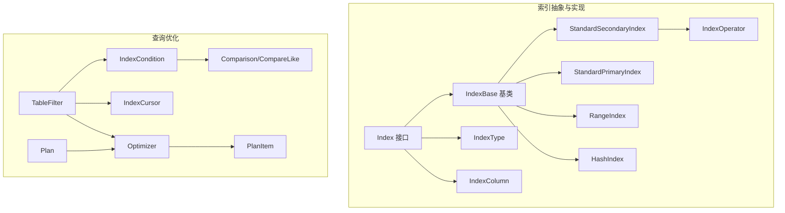
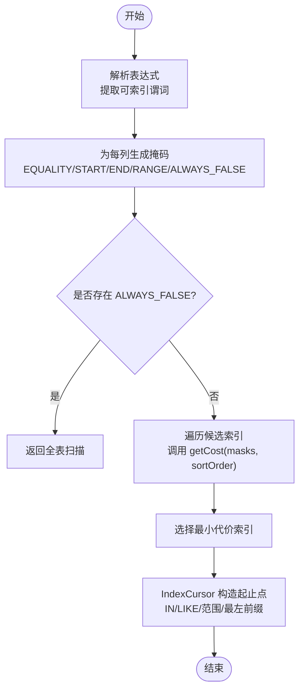
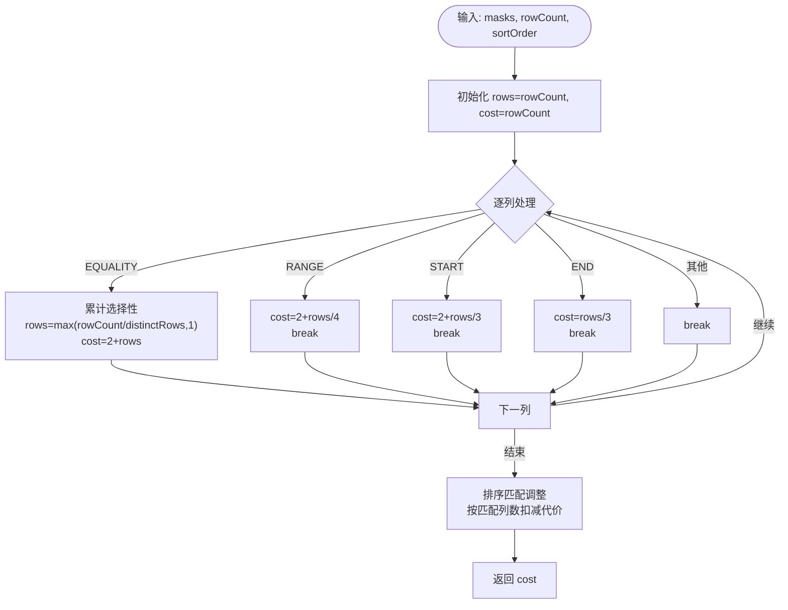
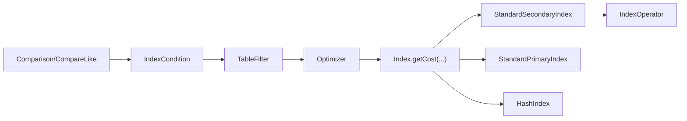

# 索引选择


**本文引用的文件**
- [Index.java](https://github.com/lealone/Lealone/blob/master/lealone-db/src/main/java/com/lealone/db/index/Index.java)
- [IndexBase.java](https://github.com/lealone/Lealone/blob/master/lealone-db/src/main/java/com/lealone/db/index/IndexBase.java)
- [IndexColumn.java](https://github.com/lealone/Lealone/blob/master/lealone-db/src/main/java/com/lealone/db/index/IndexColumn.java)
- [IndexConditionType.java](https://github.com/lealone/Lealone/blob/master/lealone-db/src/main/java/com/lealone/db/index/IndexConditionType.java)
- [IndexOperator.java](https://github.com/lealone/Lealone/blob/master/lealone-db/src/main/java/com/lealone/db/index/IndexOperator.java)
- [StandardIndex.java](https://github.com/lealone/Lealone/blob/master/lealone-db/src/main/java/com/lealone/db/index/standard/StandardIndex.java)
- [StandardSecondaryIndex.java](https://github.com/lealone/Lealone/blob/master/lealone-db/src/main/java/com/lealone/db/index/standard/StandardSecondaryIndex.java)
- [StandardPrimaryIndex.java](https://github.com/lealone/Lealone/blob/master/lealone-db/src/main/java/com/lealone/db/index/standard/StandardPrimaryIndex.java)
- [HashIndex.java](https://github.com/lealone/Lealone/blob/master/lealone-db/src/main/java/com/lealone/db/index/hash/HashIndex.java)
- [IndexType.java](https://github.com/lealone/Lealone/blob/master/lealone-db/src/main/java/com/lealone/db/index/IndexType.java)
- [TableFilter.java](https://github.com/lealone/Lealone/blob/master/lealone-sql/src/main/java/com/lealone/sql/optimizer/TableFilter.java)
- [IndexCondition.java](https://github.com/lealone/Lealone/blob/master/lealone-sql/src/main/java/com/lealone/sql/optimizer/IndexCondition.java)
- [Optimizer.java](https://github.com/lealone/Lealone/blob/master/lealone-sql/src/main/java/com/lealone/sql/optimizer/Optimizer.java)
- [PlanItem.java](https://github.com/lealone/Lealone/blob/master/lealone-sql/src/main/java/com/lealone/sql/optimizer/PlanItem.java)
- [Plan.java](https://github.com/lealone/Lealone/blob/master/lealone-sql/src/main/java/com/lealone/sql/optimizer/Plan.java)
- [IndexCursor.java](https://github.com/lealone/Lealone/blob/master/lealone-sql/src/main/java/com/lealone/sql/optimizer/IndexCursor.java)
- [Comparison.java](https://github.com/lealone/Lealone/blob/master/lealone-sql/src/main/java/com/lealone/sql/expression/condition/Comparison.java)
- [CompareLike.java](https://github.com/lealone/Lealone/blob/master/lealone-sql/src/main/java/com/lealone/sql/expression/condition/CompareLike.java)
- [Select.java](https://github.com/lealone/Lealone/blob/master/lealone-sql/src/main/java/com/lealone/sql/query/Select.java)


## 目录
1. [简介](#简介)
2. [项目结构](#项目结构)
3. [核心组件](#核心组件)
4. [架构总览](#架构总览)
5. [详细组件分析](#详细组件分析)
6. [依赖关系分析](#依赖关系分析)
7. [性能考量](#性能考量)
8. [故障排查指南](#故障排查指南)
9. [结论](#结论)
10. [附录](#附录)

## 简介
本文件系统化梳理 Lealone 数据库的索引选择策略，重点解释优化器如何基于查询谓词生成“搜索掩码”，评估各候选索引的成本，最终选择最优索引。内容覆盖：
- 索引匹配条件的分析方法：等值、范围、IN 列表/子查询、LIKE 优化等
- 索引扫描成本估算：基于行数、选择性、排序匹配的代价模型
- 索引扫描与全表扫描的权衡：何时走索引、何时走全表扫描
- 复合索引的使用策略与最左前缀原则
- 典型查询示例与索引设计最佳实践

## 项目结构
Lealone 将索引抽象与实现拆分清晰：
- 抽象层：Index 接口、IndexBase 基类、IndexColumn、IndexType、IndexOperator
- 实现层：标准索引（StandardSecondaryIndex、StandardPrimaryIndex）、哈希索引（HashIndex）、范围索引（RangeIndex）
- 查询优化层：TableFilter、IndexCondition、Optimizer、Plan、IndexCursor、Comparison/CompareLike 等表达式解析



图表来源
- [Index.java](https://github.com/lealone/Lealone/blob/master/lealone-db/src/main/java/com/lealone/db/index/Index.java#L1-L268)
- [IndexBase.java](https://github.com/lealone/Lealone/blob/master/lealone-db/src/main/java/com/lealone/db/index/IndexBase.java#L1-L455)
- [StandardSecondaryIndex.java](https://github.com/lealone/Lealone/blob/master/lealone-db/src/main/java/com/lealone/db/index/standard/StandardSecondaryIndex.java#L1-L509)
- [StandardPrimaryIndex.java](https://github.com/lealone/Lealone/blob/master/lealone-db/src/main/java/com/lealone/db/index/standard/StandardPrimaryIndex.java#L1-L447)
- [HashIndex.java](https://github.com/lealone/Lealone/blob/master/lealone-db/src/main/java/com/lealone/db/index/hash/HashIndex.java#L1-L114)
- [IndexType.java](https://github.com/lealone/Lealone/blob/master/lealone-db/src/main/java/com/lealone/db/index/IndexType.java#L1-L174)
- [TableFilter.java](https://github.com/lealone/Lealone/blob/master/lealone-sql/src/main/java/com/lealone/sql/optimizer/TableFilter.java#L1-L200)
- [IndexCondition.java](https://github.com/lealone/Lealone/blob/master/lealone-sql/src/main/java/com/lealone/sql/optimizer/IndexCondition.java#L1-L312)
- [Optimizer.java](https://github.com/lealone/Lealone/blob/master/lealone-sql/src/main/java/com/lealone/sql/optimizer/Optimizer.java#L250-L282)
- [PlanItem.java](https://github.com/lealone/Lealone/blob/master/lealone-sql/src/main/java/com/lealone/sql/optimizer/PlanItem.java#L1-L54)
- [Plan.java](https://github.com/lealone/Lealone/blob/master/lealone-sql/src/main/java/com/lealone/sql/optimizer/Plan.java#L86-L115)
- [IndexCursor.java](https://github.com/lealone/Lealone/blob/master/lealone-sql/src/main/java/com/lealone/sql/optimizer/IndexCursor.java#L112-L208)
- [Comparison.java](https://github.com/lealone/Lealone/blob/master/lealone-sql/src/main/java/com/lealone/sql/expression/condition/Comparison.java#L351-L429)
- [CompareLike.java](https://github.com/lealone/Lealone/blob/master/lealone-sql/src/main/java/com/lealone/sql/expression/condition/CompareLike.java#L187-L251)

章节来源
- [Index.java](https://github.com/lealone/Lealone/blob/master/lealone-db/src/main/java/com/lealone/db/index/Index.java#L1-L268)
- [IndexBase.java](https://github.com/lealone/Lealone/blob/master/lealone-db/src/main/java/com/lealone/db/index/IndexBase.java#L1-L455)
- [TableFilter.java](https://github.com/lealone/Lealone/blob/master/lealone-sql/src/main/java/com/lealone/sql/optimizer/TableFilter.java#L1-L200)

## 核心组件
- 索引接口与基类
  - Index：定义索引能力（查找、扫描、成本估算、排序匹配、磁盘/内存占用等）
  - IndexBase：通用实现（比较键、代价估算模板、排序匹配调整、列映射等）
- 索引类型与列定义
  - IndexType：标识主键、唯一、哈希、扫描、代理等属性
  - IndexColumn：索引列及其排序方向/空值顺序
- 索引实现
  - StandardSecondaryIndex：标准二级索引，基于事务映射存储，支持 DISTINCT、覆盖扫描、构建期游标合并
  - StandardPrimaryIndex：表数据扫描伪索引，提供行主键定位能力
  - HashIndex：哈希索引，仅支持等值条件；不可扫描
  - RangeIndex：系统范围表专用索引，仅支持扫描
- 索引操作器
  - IndexOperator：异步批量执行索引增删改，按事务提交时间有序调度，支持快速路径与事务路径
- 查询优化
  - TableFilter：构建最佳计划项，聚合谓词生成“搜索掩码”，调用 Optimizer 选择最优索引
  - IndexCondition：将表达式转换为索引可用的比较类型与掩码
  - Optimizer：遍历候选索引，比较 getCost，选择最小代价
  - Plan/PlanItem：封装单表/联接的代价模型与索引选择结果
  - IndexCursor：根据掩码与排序信息构造起止点，处理 IN 列表/子查询、最左前缀匹配

章节来源
- [Index.java](https://github.com/lealone/Lealone/blob/master/lealone-db/src/main/java/com/lealone/db/index/Index.java#L1-L268)
- [IndexBase.java](https://github.com/lealone/Lealone/blob/master/lealone-db/src/main/java/com/lealone/db/index/IndexBase.java#L231-L337)
- [IndexType.java](https://github.com/lealone/Lealone/blob/master/lealone-db/src/main/java/com/lealone/db/index/IndexType.java#L1-L174)
- [IndexColumn.java](https://github.com/lealone/Lealone/blob/master/lealone-db/src/main/java/com/lealone/db/index/IndexColumn.java#L1-L88)
- [StandardSecondaryIndex.java](https://github.com/lealone/Lealone/blob/master/lealone-db/src/main/java/com/lealone/db/index/standard/StandardSecondaryIndex.java#L260-L306)
- [StandardPrimaryIndex.java](https://github.com/lealone/Lealone/blob/master/lealone-db/src/main/java/com/lealone/db/index/standard/StandardPrimaryIndex.java#L312-L319)
- [HashIndex.java](https://github.com/lealone/Lealone/blob/master/lealone-db/src/main/java/com/lealone/db/index/hash/HashIndex.java#L70-L82)
- [IndexOperator.java](https://github.com/lealone/Lealone/blob/master/lealone-db/src/main/java/com/lealone/db/index/IndexOperator.java#L249-L382)
- [TableFilter.java](https://github.com/lealone/Lealone/blob/master/lealone-sql/src/main/java/com/lealone/sql/optimizer/TableFilter.java#L155-L200)
- [IndexCondition.java](https://github.com/lealone/Lealone/blob/master/lealone-sql/src/main/java/com/lealone/sql/optimizer/IndexCondition.java#L194-L233)
- [Optimizer.java](https://github.com/lealone/Lealone/blob/master/lealone-sql/src/main/java/com/lealone/sql/optimizer/Optimizer.java#L253-L280)
- [PlanItem.java](https://github.com/lealone/Lealone/blob/master/lealone-sql/src/main/java/com/lealone/sql/optimizer/PlanItem.java#L1-L54)
- [Plan.java](https://github.com/lealone/Lealone/blob/master/lealone-sql/src/main/java/com/lealone/sql/optimizer/Plan.java#L86-L115)
- [IndexCursor.java](https://github.com/lealone/Lealone/blob/master/lealone-sql/src/main/java/com/lealone/sql/optimizer/IndexCursor.java#L112-L208)

## 架构总览
索引选择的关键流程如下：

```mermaid
sequenceDiagram
participant Q as "查询解析"
participant TF as "TableFilter"
participant ICnd as "IndexCondition"
participant Opt as "Optimizer"
participant Idx as "Index"
participant Cur as "IndexCursor"
Q->>TF : 解析 WHERE/HAVING/GROUP BY/ORDER BY
TF->>ICnd : 从表达式提取可索引谓词
TF->>TF : 聚合生成 per-column 掩码
TF->>Opt : getBestPlanItem(masks, table, sortOrder)
Opt->>Idx : 遍历候选索引并调用 getCost(session, masks, sortOrder)
Idx-->>Opt : 返回代价
Opt-->>TF : 返回最小代价索引与代价
TF->>Cur : 使用 IndexCursor 构造起止点(IN/LIKE/范围)
Cur-->>TF : 提供扫描游标
TF-->>Q : 输出执行计划
```

图表来源
- [TableFilter.java](https://github.com/lealone/Lealone/blob/master/lealone-sql/src/main/java/com/lealone/sql/optimizer/TableFilter.java#L155-L200)
- [IndexCondition.java](https://github.com/lealone/Lealone/blob/master/lealone-sql/src/main/java/com/lealone/sql/optimizer/IndexCondition.java#L194-L233)
- [Optimizer.java](https://github.com/lealone/Lealone/blob/master/lealone-sql/src/main/java/com/lealone/sql/optimizer/Optimizer.java#L253-L280)
- [Index.java](https://github.com/lealone/Lealone/blob/master/lealone-db/src/main/java/com/lealone/db/index/Index.java#L190-L201)
- [IndexCursor.java](https://github.com/lealone/Lealone/blob/master/lealone-sql/src/main/java/com/lealone/sql/optimizer/IndexCursor.java#L112-L208)

## 详细组件分析

### 索引匹配条件分析
- 等值条件（=、IS）：映射为 EQUALITY 掩码，可显著降低代价
- 范围条件（>=、>、<=、<）：映射为 START/END/RANGE 掩码，代价估算按范围大小递减
- IN 列表/子查询：当满足“首列匹配”且非视图索引时，可作为等值使用；否则不参与索引
- LIKE 优化：前缀匹配可转为范围查询，提升索引命中率
- 最左前缀原则：IndexCursor 仅在首列满足条件下才启用 IN/LIKE 范围扫描；否则退化为全表扫描或次优路径



图表来源
- [IndexCondition.java](https://github.com/lealone/Lealone/blob/master/lealone-sql/src/main/java/com/lealone/sql/optimizer/IndexCondition.java#L194-L233)
- [TableFilter.java](https://github.com/lealone/Lealone/blob/master/lealone-sql/src/main/java/com/lealone/sql/optimizer/TableFilter.java#L155-L200)
- [IndexCursor.java](https://github.com/lealone/Lealone/blob/master/lealone-sql/src/main/java/com/lealone/sql/optimizer/IndexCursor.java#L112-L208)
- [CompareLike.java](https://github.com/lealone/Lealone/blob/master/lealone-sql/src/main/java/com/lealone/sql/expression/condition/CompareLike.java#L187-L251)
- [Comparison.java](https://github.com/lealone/Lealone/blob/master/lealone-sql/src/main/java/com/lealone/sql/expression/condition/Comparison.java#L351-L429)

章节来源
- [IndexCondition.java](https://github.com/lealone/Lealone/blob/master/lealone-sql/src/main/java/com/lealone/sql/optimizer/IndexCondition.java#L194-L233)
- [IndexCursor.java](https://github.com/lealone/Lealone/blob/master/lealone-sql/src/main/java/com/lealone/sql/optimizer/IndexCursor.java#L112-L208)
- [CompareLike.java](https://github.com/lealone/Lealone/blob/master/lealone-sql/src/main/java/com/lealone/sql/expression/condition/CompareLike.java#L187-L251)
- [Comparison.java](https://github.com/lealone/Lealone/blob/master/lealone-sql/src/main/java/com/lealone/sql/expression/condition/Comparison.java#L351-L429)

### 成本估算与索引扫描策略
- 标准 B-Tree 索引代价模型（IndexBase.getCostRangeIndex）
  - EQUALITY：累计选择性，rows = max(rowCount/distinctRows, 1)，代价 = 2 + rows
  - RANGE：代价 = 2 + rows/4
  - START：代价 = 2 + rows/3
  - END：代价 = rows/3
  - 唯一索引末列等值：代价直接为常数
  - 排序匹配调整：若 ORDER BY 与索引前缀完全匹配，按匹配列数扣减代价
- 全表扫描代价（StandardPrimaryIndex.getCost）
  - 代价与表行数近似线性相关，适合小结果集或无可用索引
- 哈希索引代价（HashIndex.getCost）
  - 仅当所有列均为等值时代价为常数；否则返回极大代价，强制放弃
- 范围索引代价（RangeIndex.getCost）
  - 固定极低代价，但仅支持扫描



图表来源
- [IndexBase.java](https://github.com/lealone/Lealone/blob/master/lealone-db/src/main/java/com/lealone/db/index/IndexBase.java#L231-L337)
- [StandardPrimaryIndex.java](https://github.com/lealone/Lealone/blob/master/lealone-db/src/main/java/com/lealone/db/index/standard/StandardPrimaryIndex.java#L312-L319)
- [HashIndex.java](https://github.com/lealone/Lealone/blob/master/lealone-db/src/main/java/com/lealone/db/index/hash/HashIndex.java#L70-L82)
- [RangeIndex.java](https://github.com/lealone/Lealone/blob/master/lealone-db/src/main/java/com/lealone/db/index/RangeIndex.java#L77-L81)

章节来源
- [IndexBase.java](https://github.com/lealone/Lealone/blob/master/lealone-db/src/main/java/com/lealone/db/index/IndexBase.java#L231-L337)
- [StandardPrimaryIndex.java](https://github.com/lealone/Lealone/blob/master/lealone-db/src/main/java/com/lealone/db/index/standard/StandardPrimaryIndex.java#L312-L319)
- [HashIndex.java](https://github.com/lealone/Lealone/blob/master/lealone-db/src/main/java/com/lealone/db/index/hash/HashIndex.java#L70-L82)
- [RangeIndex.java](https://github.com/lealone/Lealone/blob/master/lealone-db/src/main/java/com/lealone/db/index/RangeIndex.java#L77-L81)

### 索引扫描与全表扫描的权衡
- 当 masks 为空或存在 ALWAYS_FALSE 时，退化为全表扫描
- 若候选索引中存在哈希索引且不满足等值条件，会被排除
- 对于小结果集或无可用索引的查询，全表扫描可能更优
- Optimizer 会遍历候选索引并取最小代价；Plan 在联接场景下将各表代价累乘

章节来源
- [TableFilter.java](https://github.com/lealone/Lealone/blob/master/lealone-sql/src/main/java/com/lealone/sql/optimizer/TableFilter.java#L155-L200)
- [Optimizer.java](https://github.com/lealone/Lealone/blob/master/lealone-sql/src/main/java/com/lealone/sql/optimizer/Optimizer.java#L253-L280)
- [Plan.java](https://github.com/lealone/Lealone/blob/master/lealone-sql/src/main/java/com/lealone/sql/optimizer/Plan.java#L86-L115)

### 复合索引与最左前缀
- 复合索引列顺序即访问顺序；只有前缀列能有效利用索引
- IndexCursor 在处理 IN/LIKE 时要求“首列匹配”，否则不启用该谓词的索引扫描
- 排序匹配时，ORDER BY 的前缀列与索引前缀一致可进一步降低代价

章节来源
- [IndexCursor.java](https://github.com/lealone/Lealone/blob/master/lealone-sql/src/main/java/com/lealone/sql/optimizer/IndexCursor.java#L112-L208)
- [IndexBase.java](https://github.com/lealone/Lealone/blob/master/lealone-db/src/main/java/com/lealone/db/index/IndexBase.java#L295-L337)

### 典型查询示例与影响
以下示例仅描述行为与影响，不包含具体 SQL 内容：
- 示例 A：WHERE id = ? 且 name > ? 且 name < ?
  - 等值 + 范围：复合索引按最左前缀生效，代价由范围大小决定
- 示例 B：WHERE id IN (?, ?, ?)
  - 首列 IN：可走复合索引；非首列 IN：不走索引
- 示例 C：WHERE name LIKE 'prefix%'
  - 前缀匹配：转为范围查询，命中索引
- 示例 D：WHERE id = ? AND name = ?
  - 双等值：唯一索引末列等值代价为常数，优先选择
- 示例 E：WHERE name = ?（无合适索引）
  - 退化为全表扫描或次优索引

章节来源
- [IndexCondition.java](https://github.com/lealone/Lealone/blob/master/lealone-sql/src/main/java/com/lealone/sql/optimizer/IndexCondition.java#L194-L233)
- [IndexBase.java](https://github.com/lealone/Lealone/blob/master/lealone-db/src/main/java/com/lealone/db/index/IndexBase.java#L231-L337)
- [IndexCursor.java](https://github.com/lealone/Lealone/blob/master/lealone-sql/src/main/java/com/lealone/sql/optimizer/IndexCursor.java#L112-L208)
- [CompareLike.java](https://github.com/lealone/Lealone/blob/master/lealone-sql/src/main/java/com/lealone/sql/expression/condition/CompareLike.java#L187-L251)

### 索引设计最佳实践
- 优先为高频过滤列建立复合索引，将选择性高的列放在前面
- WHERE 中的等值条件优先于范围条件；尽量让等值条件出现在前缀
- ORDER BY 前缀应与索引前缀一致，减少额外排序开销
- 避免在 BLOB/CLOB 列上建索引（IndexBase 校验）
- 对于哈希索引，仅适用于等值查询；非等值场景使用标准索引
- IN 列表/子查询仅在首列匹配时有效；必要时拆分或重写查询
- LIKE 前缀匹配优于通配符开头模式；必要时考虑全文检索替代方案

章节来源
- [IndexBase.java](https://github.com/lealone/Lealone/blob/master/lealone-db/src/main/java/com/lealone/db/index/IndexBase.java#L340-L353)
- [IndexType.java](https://github.com/lealone/Lealone/blob/master/lealone-db/src/main/java/com/lealone/db/index/IndexType.java#L1-L174)
- [HashIndex.java](https://github.com/lealone/Lealone/blob/master/lealone-db/src/main/java/com/lealone/db/index/hash/HashIndex.java#L70-L82)
- [IndexCursor.java](https://github.com/lealone/Lealone/blob/master/lealone-sql/src/main/java/com/lealone/sql/optimizer/IndexCursor.java#L112-L208)
- [CompareLike.java](https://github.com/lealone/Lealone/blob/master/lealone-sql/src/main/java/com/lealone/sql/expression/condition/CompareLike.java#L187-L251)

## 依赖关系分析
- 组件耦合
  - TableFilter 依赖 IndexCondition、IndexCursor、Optimizer
  - Optimizer 依赖 Index.getCost 与 Table.getIndexes
  - IndexBase 为多种索引实现提供统一代价估算模板
  - IndexOperator 为索引变更提供异步批量执行
- 关键依赖链
  - 表达式解析 → IndexCondition → TableFilter 掩码 → Optimizer 选择 → IndexCursor 扫描
- 外部集成
  - 存储引擎与事务引擎通过 TransactionMap/StorageMap 与索引交互



图表来源
- [Comparison.java](https://github.com/lealone/Lealone/blob/master/lealone-sql/src/main/java/com/lealone/sql/expression/condition/Comparison.java#L351-L429)
- [CompareLike.java](https://github.com/lealone/Lealone/blob/master/lealone-sql/src/main/java/com/lealone/sql/expression/condition/CompareLike.java#L187-L251)
- [IndexCondition.java](https://github.com/lealone/Lealone/blob/master/lealone-sql/src/main/java/com/lealone/sql/optimizer/IndexCondition.java#L194-L233)
- [TableFilter.java](https://github.com/lealone/Lealone/blob/master/lealone-sql/src/main/java/com/lealone/sql/optimizer/TableFilter.java#L155-L200)
- [Optimizer.java](https://github.com/lealone/Lealone/blob/master/lealone-sql/src/main/java/com/lealone/sql/optimizer/Optimizer.java#L253-L280)
- [Index.java](https://github.com/lealone/Lealone/blob/master/lealone-db/src/main/java/com/lealone/db/index/Index.java#L190-L201)
- [StandardSecondaryIndex.java](https://github.com/lealone/Lealone/blob/master/lealone-db/src/main/java/com/lealone/db/index/standard/StandardSecondaryIndex.java#L260-L306)
- [StandardPrimaryIndex.java](https://github.com/lealone/Lealone/blob/master/lealone-db/src/main/java/com/lealone/db/index/standard/StandardPrimaryIndex.java#L312-L319)
- [HashIndex.java](https://github.com/lealone/Lealone/blob/master/lealone-db/src/main/java/com/lealone/db/index/hash/HashIndex.java#L70-L82)
- [IndexOperator.java](https://github.com/lealone/Lealone/blob/master/lealone-db/src/main/java/com/lealone/db/index/IndexOperator.java#L249-L382)

章节来源
- [TableFilter.java](https://github.com/lealone/Lealone/blob/master/lealone-sql/src/main/java/com/lealone/sql/optimizer/TableFilter.java#L155-L200)
- [Optimizer.java](https://github.com/lealone/Lealone/blob/master/lealone-sql/src/main/java/com/lealone/sql/optimizer/Optimizer.java#L253-L280)
- [Index.java](https://github.com/lealone/Lealone/blob/master/lealone-db/src/main/java/com/lealone/db/index/Index.java#L190-L201)

## 性能考量
- 代价模型偏向“行数”与“选择性”，在高选择性列上优先建立索引
- 唯一索引在末列等值时代价极低，适合主键/唯一键查询
- 排序匹配可显著降低代价，建议在高频排序场景设计覆盖索引
- 哈希索引仅限等值，非等值场景代价极高，应避免误用
- 全表扫描在小表或无可用索引时可能更快，需结合统计信息与查询规模综合判断

## 故障排查指南
- 索引未被使用
  - 检查是否存在 ALWAYS_FALSE 掩码或 IN 非首列导致索引不可用
  - 确认 ORDER BY 是否与索引前缀匹配
- 哈希索引无效
  - 确认是否满足等值条件；否则会被排除
- LIKE 未命中
  - 确认是否为前缀匹配；通配符开头不会走索引
- 索引更新延迟
  - IndexOperator 异步批量执行，确认事务已提交；必要时触发运行

章节来源
- [IndexCondition.java](https://github.com/lealone/Lealone/blob/master/lealone-sql/src/main/java/com/lealone/sql/optimizer/IndexCondition.java#L194-L233)
- [IndexCursor.java](https://github.com/lealone/Lealone/blob/master/lealone-sql/src/main/java/com/lealone/sql/optimizer/IndexCursor.java#L112-L208)
- [HashIndex.java](https://github.com/lealone/Lealone/blob/master/lealone-db/src/main/java/com/lealone/db/index/hash/HashIndex.java#L70-L82)
- [IndexOperator.java](https://github.com/lealone/Lealone/blob/master/lealone-db/src/main/java/com/lealone/db/index/IndexOperator.java#L105-L201)

## 结论
Lealone 的索引选择策略以“搜索掩码 + 成本模型”为核心，结合最左前缀、排序匹配与索引类型特性，动态选择最优执行路径。实践中应优先保证等值条件位于前缀，合理设计复合索引与覆盖索引，并关注 LIKE 前缀匹配与哈希索引的适用场景，从而获得稳定且高效的查询性能。

## 附录
- 相关配置与扩展
  - 排序方向与空值顺序由 IndexColumn 定义
  - 索引类型由 IndexType 控制（主键、唯一、哈希、扫描、代理）
  - 索引操作器支持异步批量与快速路径，降低写入开销

章节来源
- [IndexColumn.java](https://github.com/lealone/Lealone/blob/master/lealone-db/src/main/java/com/lealone/db/index/IndexColumn.java#L1-L88)
- [IndexType.java](https://github.com/lealone/Lealone/blob/master/lealone-db/src/main/java/com/lealone/db/index/IndexType.java#L1-L174)
- [IndexOperator.java](https://github.com/lealone/Lealone/blob/master/lealone-db/src/main/java/com/lealone/db/index/IndexOperator.java#L249-L382)