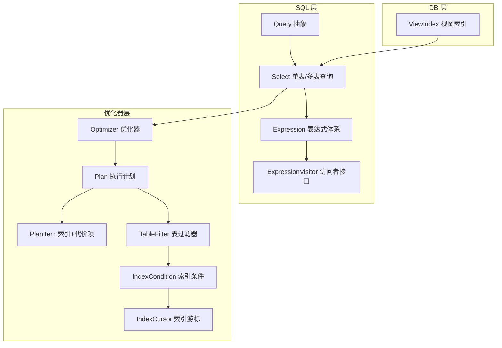
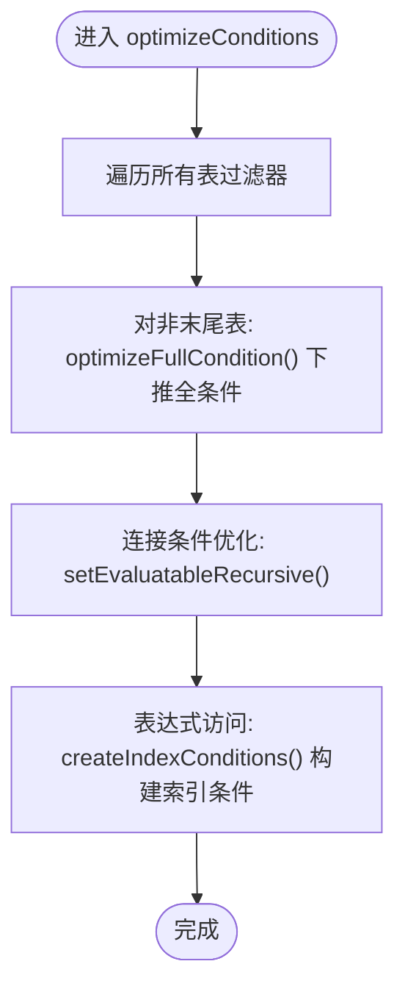
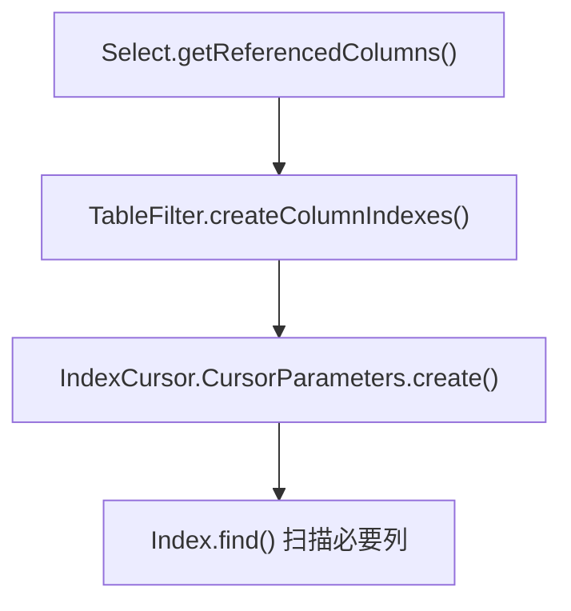
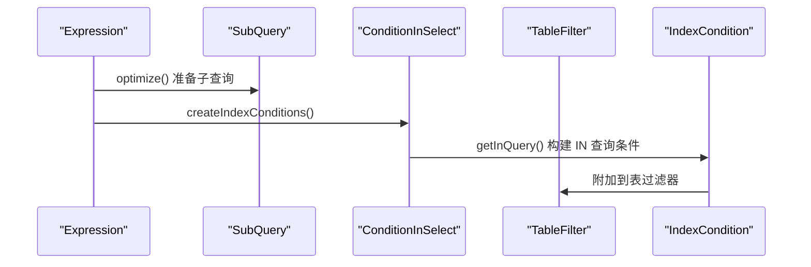
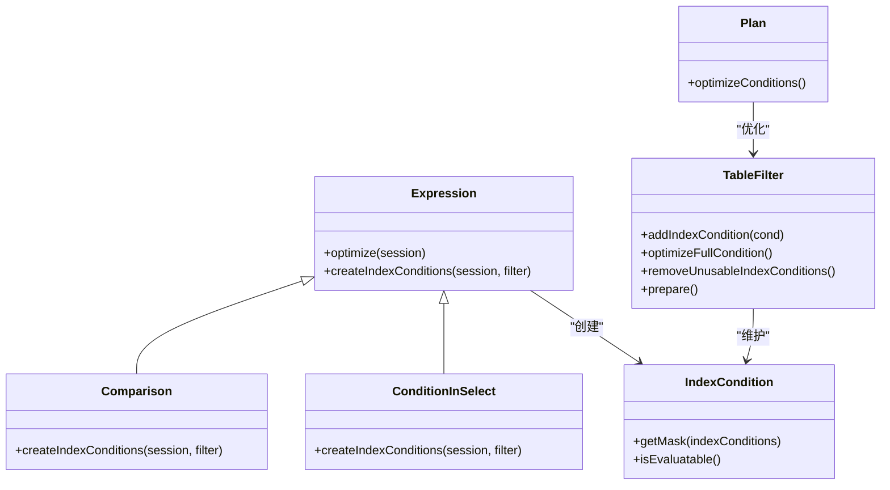
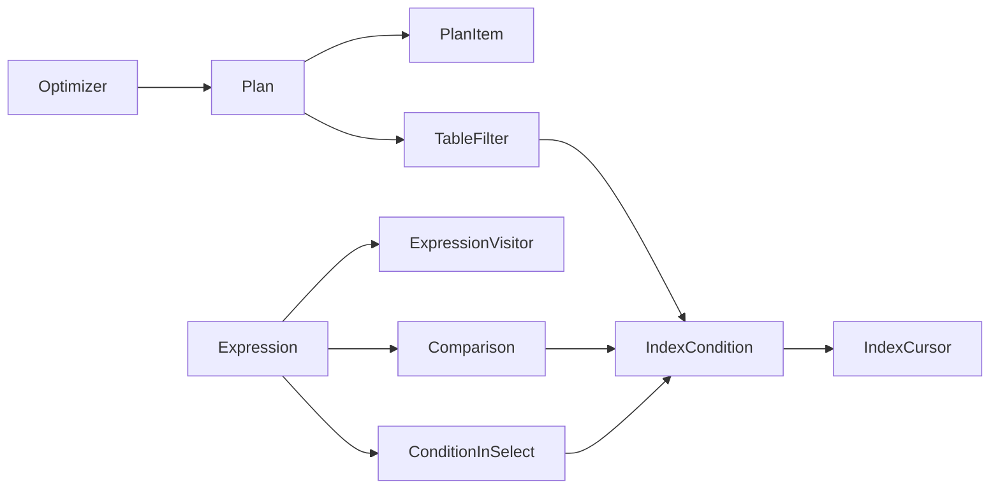
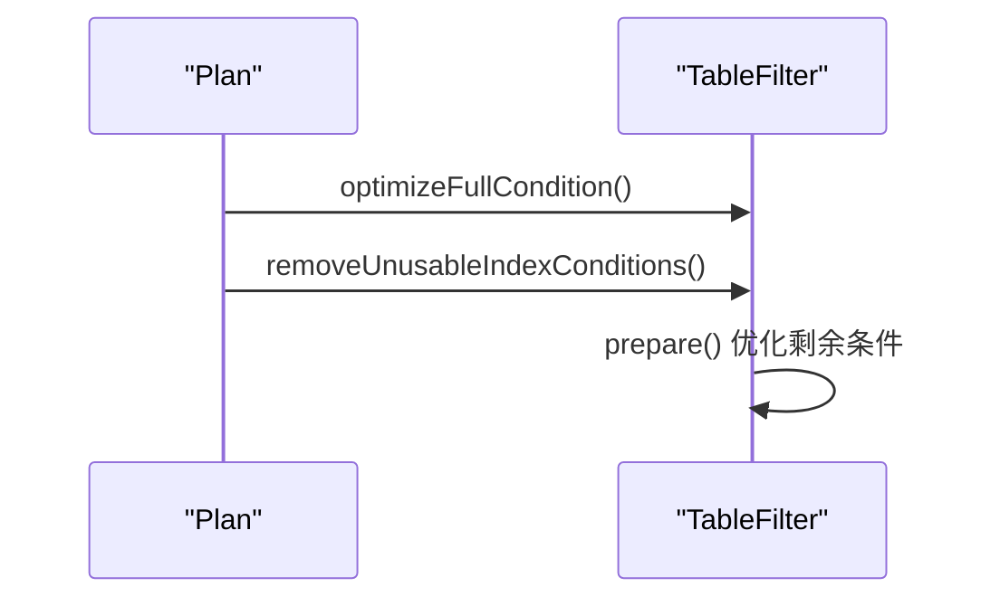
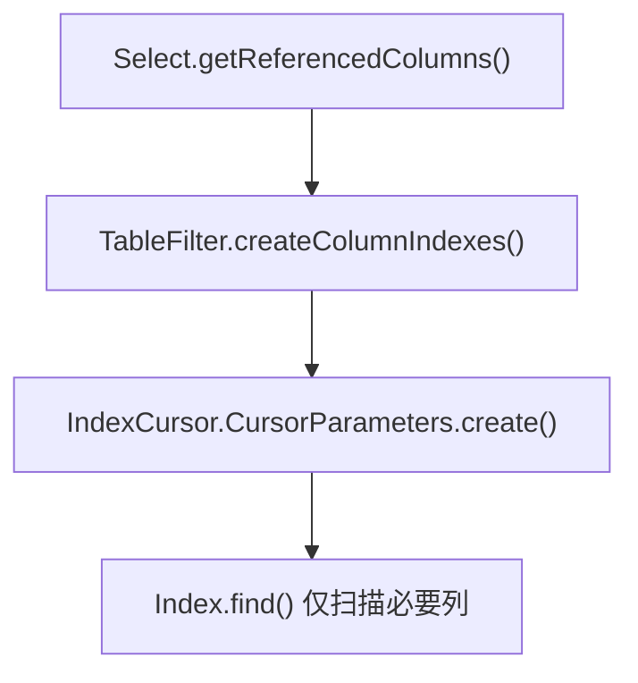
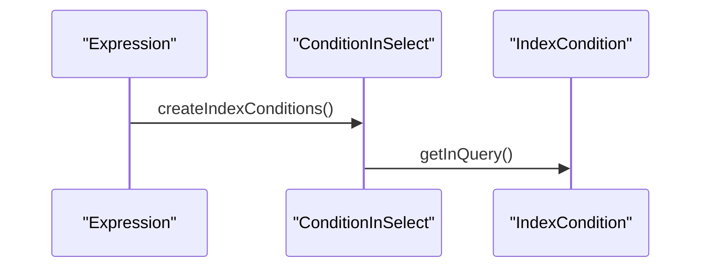

# 逻辑优化


**本文引用的文件**
- [Optimizer.java](https://github.com/lealone/Lealone/blob/master/lealone-sql/src/main/java/com/lealone/sql/optimizer/Optimizer.java)
- [Plan.java](https://github.com/lealone/Lealone/blob/master/lealone-sql/src/main/java/com/lealone/sql/optimizer/Plan.java)
- [PlanItem.java](https://github.com/lealone/Lealone/blob/master/lealone-sql/src/main/java/com/lealone/sql/optimizer/PlanItem.java)
- [TableFilter.java](https://github.com/lealone/Lealone/blob/master/lealone-sql/src/main/java/com/lealone/sql/optimizer/TableFilter.java)
- [IndexCondition.java](https://github.com/lealone/Lealone/blob/master/lealone-sql/src/main/java/com/lealone/sql/optimizer/IndexCondition.java)
- [IndexCursor.java](https://github.com/lealone/Lealone/blob/master/lealone-sql/src/main/java/com/lealone/sql/optimizer/IndexCursor.java)
- [Select.java](https://github.com/lealone/Lealone/blob/master/lealone-sql/src/main/java/com/lealone/sql/query/Select.java)
- [Query.java](https://github.com/lealone/Lealone/blob/master/lealone-sql/src/main/java/com/lealone/sql/query/Query.java)
- [Expression.java](https://github.com/lealone/Lealone/blob/master/lealone-sql/src/main/java/com/lealone/sql/expression/Expression.java)
- [Comparison.java](https://github.com/lealone/Lealone/blob/master/lealone-sql/src/main/java/com/lealone/sql/expression/condition/Comparison.java)
- [ConditionInSelect.java](https://github.com/lealone/Lealone/blob/master/lealone-sql/src/main/java/com/lealone/sql/expression/condition/ConditionInSelect.java)
- [SubQuery.java](https://github.com/lealone/Lealone/blob/master/lealone-sql/src/main/java/com/lealone/sql/expression/subquery/SubQuery.java)
- [ExpressionVisitor.java](https://github.com/lealone/Lealone/blob/master/lealone-sql/src/main/java/com/lealone/sql/expression/visitor/ExpressionVisitor.java)
- [ViewIndex.java](https://github.com/lealone/Lealone/blob/master/lealone-db/src/main/java/com/lealone/db/index/ViewIndex.java)


## 目录
1. [引言](#引言)
2. [项目结构](#项目结构)
3. [核心组件](#核心组件)
4. [架构总览](#架构总览)
5. [详细组件分析](#详细组件分析)
6. [依赖关系分析](#依赖关系分析)
7. [性能考量](#性能考量)
8. [故障排查指南](#故障排查指南)
9. [结论](#结论)
10. [附录：示例与图示](#附录示例与图示)

## 引言
本文件系统性梳理 Lealone 查询优化器在“逻辑优化”阶段的规则与机制，重点覆盖以下方面：
- 谓词下推（Predicate Pushdown）：将过滤条件尽可能下移至数据源或连接边，减少上层处理的数据量。
- 投影剪裁（Projection Pruning）：仅保留查询结果所需的列，避免无关列参与计算与传输。
- 连接消除（Join Elimination）：通过等值连接与传递性，识别冗余连接并去除。
- 子查询展开（Subquery Unnesting）：在可展开且收益明显时，将子查询转换为连接或常量集合，提升执行效率。
- 逻辑优化规则的匹配与应用机制：表达式访问者、索引条件构建、全条件优化与不可用索引条件剔除。
- 逻辑优化对后续物理优化与执行的影响：为索引选择、连接顺序、扫描策略奠定基础。
- 性能影响与限制：代价估算、启发式搜索、参数化与稳定性权衡。

## 项目结构
Lealone 的 SQL 优化主要集中在 lealone-sql 模块的 optimizer、query、expression 等包中；索引与视图等物理层面由 lealone-db 模块支撑。



图表来源
- [Select.java](https://github.com/lealone/Lealone/blob/master/lealone-sql/src/main/java/com/lealone/sql/query/Select.java#L1-L120)
- [Optimizer.java](https://github.com/lealone/Lealone/blob/master/lealone-sql/src/main/java/com/lealone/sql/optimizer/Optimizer.java#L60-L120)
- [Plan.java](https://github.com/lealone/Lealone/blob/master/lealone-sql/src/main/java/com/lealone/sql/optimizer/Plan.java#L1-L116)
- [PlanItem.java](https://github.com/lealone/Lealone/blob/master/lealone-sql/src/main/java/com/lealone/sql/optimizer/PlanItem.java#L1-L55)
- [TableFilter.java](https://github.com/lealone/Lealone/blob/master/lealone-sql/src/main/java/com/lealone/sql/optimizer/TableFilter.java#L1-L120)
- [IndexCondition.java](https://github.com/lealone/Lealone/blob/master/lealone-sql/src/main/java/com/lealone/sql/optimizer/IndexCondition.java#L1-L120)
- [IndexCursor.java](https://github.com/lealone/Lealone/blob/master/lealone-sql/src/main/java/com/lealone/sql/optimizer/IndexCursor.java#L41-L139)
- [Expression.java](https://github.com/lealone/Lealone/blob/master/lealone-sql/src/main/java/com/lealone/sql/expression/Expression.java#L1-L120)
- [ExpressionVisitor.java](https://github.com/lealone/Lealone/blob/master/lealone-sql/src/main/java/com/lealone/sql/expression/visitor/ExpressionVisitor.java#L1-L103)
- [ViewIndex.java](https://github.com/lealone/Lealone/blob/master/lealone-db/src/main/java/com/lealone/db/index/ViewIndex.java#L68-L119)

章节来源
- [Select.java](https://github.com/lealone/Lealone/blob/master/lealone-sql/src/main/java/com/lealone/sql/query/Select.java#L1-L200)
- [Optimizer.java](https://github.com/lealone/Lealone/blob/master/lealone-sql/src/main/java/com/lealone/sql/optimizer/Optimizer.java#L1-L120)

## 核心组件
- 优化器 Optimizer：负责生成候选执行计划并选择最优计划，调用 Plan.optimizeConditions 完成逻辑优化阶段的关键步骤。
- 执行计划 Plan：封装表访问顺序、代价评估与条件优化。
- 计划项 PlanItem：记录选用的索引与代价，支持嵌套连接与连接计划的组合。
- 表过滤器 TableFilter：维护索引条件、过滤条件、连接条件，负责 prepare 与 next 的执行路径。
- 索引条件 IndexCondition：将表达式转换为可被索引使用的比较掩码，支持等值、范围、IN 列表/子查询。
- 索引游标 IndexCursor：根据索引条件解析起止点、IN 列表/结果集，驱动索引扫描。
- 表达式 Expression 与访问者 ExpressionVisitor：统一表达式结构与遍历，支撑谓词下推、投影剪裁、子查询展开等规则。
- 视图索引 ViewIndex：在视图场景下重建索引列与代价缓存，支撑逻辑优化与物理执行。

章节来源
- [Plan.java](https://github.com/lealone/Lealone/blob/master/lealone-sql/src/main/java/com/lealone/sql/optimizer/Plan.java#L41-L115)
- [PlanItem.java](https://github.com/lealone/Lealone/blob/master/lealone-sql/src/main/java/com/lealone/sql/optimizer/PlanItem.java#L1-L55)
- [TableFilter.java](https://github.com/lealone/Lealone/blob/master/lealone-sql/src/main/java/com/lealone/sql/optimizer/TableFilter.java#L150-L230)
- [IndexCondition.java](https://github.com/lealone/Lealone/blob/master/lealone-sql/src/main/java/com/lealone/sql/optimizer/IndexCondition.java#L190-L270)
- [IndexCursor.java](https://github.com/lealone/Lealone/blob/master/lealone-sql/src/main/java/com/lealone/sql/optimizer/IndexCursor.java#L83-L139)
- [Expression.java](https://github.com/lealone/Lealone/blob/master/lealone-sql/src/main/java/com/lealone/sql/expression/Expression.java#L120-L200)
- [ExpressionVisitor.java](https://github.com/lealone/Lealone/blob/master/lealone-sql/src/main/java/com/lealone/sql/expression/visitor/ExpressionVisitor.java#L1-L103)
- [ViewIndex.java](https://github.com/lealone/Lealone/blob/master/lealone-db/src/main/java/com/lealone/db/index/ViewIndex.java#L90-L119)

## 架构总览
逻辑优化发生在查询准备阶段，核心流程如下：
- 解析与映射：Select 初始化、列映射、表达式优化。
- 计划生成：Optimizer 基于表过滤器集合生成候选顺序，Plan 计算代价。
- 条件优化：Plan.optimizeConditions 将全条件下推到各表过滤器，剔除不可用索引条件。
- 执行准备：TableFilter.prepare 清理无效条件、优化剩余条件、建立连接顺序。
- 物理优化：后续阶段依据逻辑优化结果选择索引、连接顺序与扫描策略。

```mermaid
sequenceDiagram
participant Parser as "解析/映射"
participant Sel as "Select"
participant Opt as "Optimizer"
participant Plan as "Plan"
participant TF as "TableFilter"
participant IC as "IndexCondition"
participant CUR as "IndexCursor"
Parser->>Sel : 初始化/列映射/表达式优化
Sel->>Opt : 传入表过滤器数组
Opt->>Plan : 生成候选顺序并评估代价
Plan->>Plan : optimizeConditions()
Plan->>TF : 下推全条件/剔除不可用索引条件
TF->>IC : 构建/解析索引条件
TF->>CUR : find() 解析起止/IN/子查询
Sel->>TF : prepare() 最终准备
TF-->>Sel : 可执行的表过滤链
```

图表来源
- [Select.java](https://github.com/lealone/Lealone/blob/master/lealone-sql/src/main/java/com/lealone/sql/query/Select.java#L540-L570)
- [Optimizer.java](https://github.com/lealone/Lealone/blob/master/lealone-sql/src/main/java/com/lealone/sql/optimizer/Optimizer.java#L67-L80)
- [Plan.java](https://github.com/lealone/Lealone/blob/master/lealone-sql/src/main/java/com/lealone/sql/optimizer/Plan.java#L62-L115)
- [TableFilter.java](https://github.com/lealone/Lealone/blob/master/lealone-sql/src/main/java/com/lealone/sql/optimizer/TableFilter.java#L226-L265)
- [IndexCondition.java](https://github.com/lealone/Lealone/blob/master/lealone-sql/src/main/java/com/lealone/sql/optimizer/IndexCondition.java#L190-L270)
- [IndexCursor.java](https://github.com/lealone/Lealone/blob/master/lealone-sql/src/main/java/com/lealone/sql/optimizer/IndexCursor.java#L83-L139)

## 详细组件分析

### 组件一：谓词下推（Predicate Pushdown）
- 触发点：Plan.optimizeConditions 对所有表过滤器执行优化，其中对非末尾表调用 TableFilter.optimizeFullCondition，将全条件下推到该表的过滤条件与连接条件中。
- 关键实现：
  - 全条件下推：TableFilter.optimizeFullCondition 递归地将 Select.setFullCondition 设置的全局条件添加到当前表过滤器的过滤条件与连接条件中。
  - 连接条件绑定：Select 在 setEvaluatableRecursive 中对连接条件进行优化，若连接条件不可求值且非外连接，则将其转为普通过滤条件。
  - 索引条件构建：Comparison.createIndexConditions 与 ConditionInSelect.createIndexConditions 将等值/范围/IN 子查询条件转换为 IndexCondition 并附加到表过滤器。
- 效果：减少上层处理的数据量，提升索引利用度。



图表来源
- [Plan.java](https://github.com/lealone/Lealone/blob/master/lealone-sql/src/main/java/com/lealone/sql/optimizer/Plan.java#L62-L80)
- [TableFilter.java](https://github.com/lealone/Lealone/blob/master/lealone-sql/src/main/java/com/lealone/sql/optimizer/TableFilter.java#L723-L744)
- [Select.java](https://github.com/lealone/Lealone/blob/master/lealone-sql/src/main/java/com/lealone/sql/query/Select.java#L559-L574)
- [Comparison.java](https://github.com/lealone/Lealone/blob/master/lealone-sql/src/main/java/com/lealone/sql/expression/condition/Comparison.java#L353-L429)
- [ConditionInSelect.java](https://github.com/lealone/Lealone/blob/master/lealone-sql/src/main/java/com/lealone/sql/expression/condition/ConditionInSelect.java#L148-L173)

章节来源
- [Plan.java](https://github.com/lealone/Lealone/blob/master/lealone-sql/src/main/java/com/lealone/sql/optimizer/Plan.java#L62-L80)
- [TableFilter.java](https://github.com/lealone/Lealone/blob/master/lealone-sql/src/main/java/com/lealone/sql/optimizer/TableFilter.java#L723-L744)
- [Select.java](https://github.com/lealone/Lealone/blob/master/lealone-sql/src/main/java/com/lealone/sql/query/Select.java#L559-L574)
- [Comparison.java](https://github.com/lealone/Lealone/blob/master/lealone-sql/src/main/java/com/lealone/sql/expression/condition/Comparison.java#L353-L429)
- [ConditionInSelect.java](https://github.com/lealone/Lealone/blob/master/lealone-sql/src/main/java/com/lealone/sql/expression/condition/ConditionInSelect.java#L148-L173)

### 组件二：投影剪裁（Projection Pruning）
- 触发点：IndexCursor.parseIndexConditions 在解析索引条件时，会根据 Select.getReferencedColumns 或 TableFilter.getColumnIndexes 决定列索引集合，从而只读取必要的列。
- 关键实现：
  - 列索引确定：TableFilter.createColumnIndexes 与 Select.getReferencedColumns 结合，确保仅收集查询实际使用到的列。
  - 游标参数：IndexCursor.CursorParameters.create 使用列索引集合，减少扫描与回表开销。
- 效果：降低 IO 与内存占用，提升扫描效率。



图表来源
- [IndexCursor.java](https://github.com/lealone/Lealone/blob/master/lealone-sql/src/main/java/com/lealone/sql/optimizer/IndexCursor.java#L83-L99)
- [IndexCursor.java](https://github.com/lealone/Lealone/blob/master/lealone-sql/src/main/java/com/lealone/sql/optimizer/IndexCursor.java#L96-L99)
- [TableFilter.java](https://github.com/lealone/Lealone/blob/master/lealone-sql/src/main/java/com/lealone/sql/optimizer/TableFilter.java#L570-L653)

章节来源
- [IndexCursor.java](https://github.com/lealone/Lealone/blob/master/lealone-sql/src/main/java/com/lealone/sql/optimizer/IndexCursor.java#L83-L99)
- [TableFilter.java](https://github.com/lealone/Lealone/blob/master/lealone-sql/src/main/java/com/lealone/sql/optimizer/TableFilter.java#L570-L653)

### 组件三：连接消除（Join Elimination）
- 规则要点：
  - 当连接两侧存在等值条件且满足传递性时，可将连接边替换为单表扫描或直接替换为常量/列表，从而消除连接。
  - 本仓库未发现显式“连接消除”的独立规则类，但通过以下机制间接实现：
    - 等值/范围条件被识别为索引条件后，TableFilter.getBestPlanItem 会优先选择更优索引，减少连接必要性。
    - IN 子查询条件在 createIndexConditions 中被转换为 IndexCondition，可能替代连接。
- 实现位置：Comparison.createIndexConditions、ConditionInSelect.createIndexConditions、TableFilter.getBestPlanItem。

章节来源
- [Comparison.java](https://github.com/lealone/Lealone/blob/master/lealone-sql/src/main/java/com/lealone/sql/expression/condition/Comparison.java#L353-L429)
- [ConditionInSelect.java](https://github.com/lealone/Lealone/blob/master/lealone-sql/src/main/java/com/lealone/sql/expression/condition/ConditionInSelect.java#L148-L173)
- [TableFilter.java](https://github.com/lealone/Lealone/blob/master/lealone-sql/src/main/java/com/lealone/sql/optimizer/TableFilter.java#L150-L204)

### 组件四：子查询展开（Subquery Unnesting）
- 规则要点：
  - 子查询在表达式优化阶段被准备（SubQuery.optimize），并将子查询结果作为表达式的一部分参与后续优化。
  - IN 子查询（ConditionInSelect）在 createIndexConditions 中被转换为 IndexCondition.getInQuery，使后续索引扫描可直接使用子查询结果。
- 影响：避免多次子查询执行，提升连接/索引利用效率。



图表来源
- [SubQuery.java](https://github.com/lealone/Lealone/blob/master/lealone-sql/src/main/java/com/lealone/sql/expression/subquery/SubQuery.java#L70-L110)
- [ConditionInSelect.java](https://github.com/lealone/Lealone/blob/master/lealone-sql/src/main/java/com/lealone/sql/expression/condition/ConditionInSelect.java#L148-L173)
- [IndexCondition.java](https://github.com/lealone/Lealone/blob/master/lealone-sql/src/main/java/com/lealone/sql/optimizer/IndexCondition.java#L82-L94)

章节来源
- [SubQuery.java](https://github.com/lealone/Lealone/blob/master/lealone-sql/src/main/java/com/lealone/sql/expression/subquery/SubQuery.java#L70-L110)
- [ConditionInSelect.java](https://github.com/lealone/Lealone/blob/master/lealone-sql/src/main/java/com/lealone/sql/expression/condition/ConditionInSelect.java#L148-L173)
- [IndexCondition.java](https://github.com/lealone/Lealone/blob/master/lealone-sql/src/main/java/com/lealone/sql/optimizer/IndexCondition.java#L82-L94)

### 组件五：逻辑优化规则的匹配与应用机制
- 表达式访问者：ExpressionVisitor 接口定义了对各类表达式（比较、IN、子查询、聚合、函数等）的访问方法，优化器通过访问者模式遍历表达式，触发相应规则。
- 索引条件构建：Comparison.createIndexConditions 与 ConditionInSelect.createIndexConditions 将表达式转换为 IndexCondition，填充到 TableFilter 的索引条件列表。
- 条件优化：Plan.optimizeConditions 与 TableFilter.prepare 共同完成：
  - 下推全条件（optimizeFullCondition）
  - 剔除不可用索引条件（removeUnusableIndexConditions）
  - 优化剩余条件（filterCondition/joinCondition.optimize）



图表来源
- [Expression.java](https://github.com/lealone/Lealone/blob/master/lealone-sql/src/main/java/com/lealone/sql/expression/Expression.java#L120-L200)
- [Comparison.java](https://github.com/lealone/Lealone/blob/master/lealone-sql/src/main/java/com/lealone/sql/expression/condition/Comparison.java#L353-L429)
- [ConditionInSelect.java](https://github.com/lealone/Lealone/blob/master/lealone-sql/src/main/java/com/lealone/sql/expression/condition/ConditionInSelect.java#L148-L173)
- [IndexCondition.java](https://github.com/lealone/Lealone/blob/master/lealone-sql/src/main/java/com/lealone/sql/optimizer/IndexCondition.java#L190-L270)
- [TableFilter.java](https://github.com/lealone/Lealone/blob/master/lealone-sql/src/main/java/com/lealone/sql/optimizer/TableFilter.java#L226-L265)
- [Plan.java](https://github.com/lealone/Lealone/blob/master/lealone-sql/src/main/java/com/lealone/sql/optimizer/Plan.java#L62-L80)

章节来源
- [ExpressionVisitor.java](https://github.com/lealone/Lealone/blob/master/lealone-sql/src/main/java/com/lealone/sql/expression/visitor/ExpressionVisitor.java#L1-L103)
- [Expression.java](https://github.com/lealone/Lealone/blob/master/lealone-sql/src/main/java/com/lealone/sql/expression/Expression.java#L120-L200)
- [Comparison.java](https://github.com/lealone/Lealone/blob/master/lealone-sql/src/main/java/com/lealone/sql/expression/condition/Comparison.java#L353-L429)
- [ConditionInSelect.java](https://github.com/lealone/Lealone/blob/master/lealone-sql/src/main/java/com/lealone/sql/expression/condition/ConditionInSelect.java#L148-L173)
- [IndexCondition.java](https://github.com/lealone/Lealone/blob/master/lealone-sql/src/main/java/com/lealone/sql/optimizer/IndexCondition.java#L190-L270)
- [TableFilter.java](https://github.com/lealone/Lealone/blob/master/lealone-sql/src/main/java/com/lealone/sql/optimizer/TableFilter.java#L226-L265)
- [Plan.java](https://github.com/lealone/Lealone/blob/master/lealone-sql/src/main/java/com/lealone/sql/optimizer/Plan.java#L62-L80)

## 依赖关系分析
- 优化器与计划：Optimizer.optimize() 返回最优 TableFilter 根节点，Plan.optimizeConditions 在此之前完成条件优化。
- 计划与表过滤器：Plan.calculateCost 逐表调用 TableFilter.getBestPlanItem，PlanItem 记录索引与代价，PlanItem.joinPlan/nestedJoinPlan 支持连接代价叠加。
- 表过滤器与索引条件：TableFilter.addIndexCondition、IndexCondition.getMask、IndexCursor.parseIndexConditions 形成闭环，决定扫描范围与 IN 列表/子查询。
- 表达式与访问者：ExpressionVisitor 定义统一访问接口，Comparison/ConditionInSelect 等在访问时触发规则。



图表来源
- [Optimizer.java](https://github.com/lealone/Lealone/blob/master/lealone-sql/src/main/java/com/lealone/sql/optimizer/Optimizer.java#L67-L120)
- [Plan.java](https://github.com/lealone/Lealone/blob/master/lealone-sql/src/main/java/com/lealone/sql/optimizer/Plan.java#L82-L115)
- [TableFilter.java](https://github.com/lealone/Lealone/blob/master/lealone-sql/src/main/java/com/lealone/sql/optimizer/TableFilter.java#L150-L204)
- [IndexCondition.java](https://github.com/lealone/Lealone/blob/master/lealone-sql/src/main/java/com/lealone/sql/optimizer/IndexCondition.java#L190-L270)
- [IndexCursor.java](https://github.com/lealone/Lealone/blob/master/lealone-sql/src/main/java/com/lealone/sql/optimizer/IndexCursor.java#L101-L139)
- [ExpressionVisitor.java](https://github.com/lealone/Lealone/blob/master/lealone-sql/src/main/java/com/lealone/sql/expression/visitor/ExpressionVisitor.java#L1-L103)
- [Comparison.java](https://github.com/lealone/Lealone/blob/master/lealone-sql/src/main/java/com/lealone/sql/expression/condition/Comparison.java#L353-L429)
- [ConditionInSelect.java](https://github.com/lealone/Lealone/blob/master/lealone-sql/src/main/java/com/lealone/sql/expression/condition/ConditionInSelect.java#L148-L173)

章节来源
- [Optimizer.java](https://github.com/lealone/Lealone/blob/master/lealone-sql/src/main/java/com/lealone/sql/optimizer/Optimizer.java#L67-L120)
- [Plan.java](https://github.com/lealone/Lealone/blob/master/lealone-sql/src/main/java/com/lealone/sql/optimizer/Plan.java#L82-L115)
- [TableFilter.java](https://github.com/lealone/Lealone/blob/master/lealone-sql/src/main/java/com/lealone/sql/optimizer/TableFilter.java#L150-L204)
- [IndexCondition.java](https://github.com/lealone/Lealone/blob/master/lealone-sql/src/main/java/com/lealone/sql/optimizer/IndexCondition.java#L190-L270)
- [IndexCursor.java](https://github.com/lealone/Lealone/blob/master/lealone-sql/src/main/java/com/lealone/sql/optimizer/IndexCursor.java#L101-L139)
- [ExpressionVisitor.java](https://github.com/lealone/Lealone/blob/master/lealone-sql/src/main/java/com/lealone/sql/expression/visitor/ExpressionVisitor.java#L1-L103)
- [Comparison.java](https://github.com/lealone/Lealone/blob/master/lealone-sql/src/main/java/com/lealone/sql/expression/condition/Comparison.java#L353-L429)
- [ConditionInSelect.java](https://github.com/lealone/Lealone/blob/master/lealone-sql/src/main/java/com/lealone/sql/expression/condition/ConditionInSelect.java#L148-L173)

## 性能考量
- 代价估算：
  - Plan.calculateCost 以“成本累加”的方式评估连接顺序，PlanItem.cost 由索引 getCost 提供，结合嵌套连接与连接计划的成本叠加。
  - TableFilter.getBestPlanItem 在有索引条件时，按条件数量对成本做折扣，鼓励优先使用可下推的索引条件。
- 搜索策略：
  - Optimizer 采用穷举（小规模）、贪心（部分表）与遗传算法（大规模）混合策略，平衡搜索空间与时间。
- 稳定性与限制：
  - 对于复杂子查询与视图，逻辑优化可能受限于可求值性与代价缓存（ViewIndex.getCost）。
  - IN 子查询与 IN 列表在非标准表类型上可能无法同时与其他条件组合使用（IndexCondition.getMask）。

章节来源
- [Plan.java](https://github.com/lealone/Lealone/blob/master/lealone-sql/src/main/java/com/lealone/sql/optimizer/Plan.java#L82-L115)
- [TableFilter.java](https://github.com/lealone/Lealone/blob/master/lealone-sql/src/main/java/com/lealone/sql/optimizer/TableFilter.java#L150-L204)
- [Optimizer.java](https://github.com/lealone/Lealone/blob/master/lealone-sql/src/main/java/com/lealone/sql/optimizer/Optimizer.java#L82-L120)
- [ViewIndex.java](https://github.com/lealone/Lealone/blob/master/lealone-db/src/main/java/com/lealone/db/index/ViewIndex.java#L110-L119)
- [IndexCondition.java](https://github.com/lealone/Lealone/blob/master/lealone-sql/src/main/java/com/lealone/sql/optimizer/IndexCondition.java#L200-L232)

## 故障排查指南
- 条件不可求值导致计划无效：
  - 现象：Plan.calculateCost 返回无穷大。
  - 排查：检查连接条件是否可求值（Expression.isEvaluatable），确认是否被错误地从连接条件移除。
- IN 子查询不生效：
  - 现象：IN 子查询未被转换为索引条件。
  - 排查：确认子查询列数为 1、表达式不在其他表过滤器中、且 Settings.optimizeInList 开启。
- 投影过大导致 IO 增加：
  - 现象：扫描列过多。
  - 排查：确认 Select.getReferencedColumns 与 TableFilter.getColumnIndexes 是否正确收集所需列。
- 外连接条件误处理：
  - 现象：外连接缺失空行。
  - 排查：关注 TableFilter.setNullRow 与 joinOuter 标志位。

章节来源
- [Plan.java](https://github.com/lealone/Lealone/blob/master/lealone-sql/src/main/java/com/lealone/sql/optimizer/Plan.java#L82-L115)
- [ConditionInSelect.java](https://github.com/lealone/Lealone/blob/master/lealone-sql/src/main/java/com/lealone/sql/expression/condition/ConditionInSelect.java#L148-L173)
- [IndexCursor.java](https://github.com/lealone/Lealone/blob/master/lealone-sql/src/main/java/com/lealone/sql/optimizer/IndexCursor.java#L83-L139)
- [TableFilter.java](https://github.com/lealone/Lealone/blob/master/lealone-sql/src/main/java/com/lealone/sql/optimizer/TableFilter.java#L395-L420)

## 结论
Lealone 的逻辑优化以“表达式访问者 + 索引条件构建 + 条件下推”为核心，通过 Plan.optimizeConditions 与 TableFilter.prepare 将谓词下推、投影剪裁、子查询展开等规则自然融合，形成稳定的优化流水线。配合 Optimizer 的多策略搜索与 PlanItem 的代价模型，为后续物理优化与高效执行奠定坚实基础。在复杂场景（如视图、子查询、外连接）下，需关注可求值性与代价缓存，以获得更优的性能与稳定性。

## 附录：示例与图示

### 示例一：谓词下推前后对比
- 优化前：WHERE 条件位于上层，未下推到表过滤器。
- 优化后：Plan.optimizeConditions 将全条件下推到 TableFilter.optimizeFullCondition，连接条件经 setEvaluatableRecursive 优化，IndexCondition 构建完成。



图表来源
- [Plan.java](https://github.com/lealone/Lealone/blob/master/lealone-sql/src/main/java/com/lealone/sql/optimizer/Plan.java#L62-L80)
- [TableFilter.java](https://github.com/lealone/Lealone/blob/master/lealone-sql/src/main/java/com/lealone/sql/optimizer/TableFilter.java#L226-L265)

### 示例二：投影剪裁
- 优化前：扫描整行列。
- 优化后：IndexCursor.parseIndexConditions 仅收集 Select.getReferencedColumns 中的列，减少 IO。



图表来源
- [IndexCursor.java](https://github.com/lealone/Lealone/blob/master/lealone-sql/src/main/java/com/lealone/sql/optimizer/IndexCursor.java#L83-L99)
- [TableFilter.java](https://github.com/lealone/Lealone/blob/master/lealone-sql/src/main/java/com/lealone/sql/optimizer/TableFilter.java#L570-L653)

### 示例三：子查询展开
- 优化前：IN 子查询作为表达式存在。
- 优化后：ConditionInSelect.createIndexConditions 转换为 IndexCondition.getInQuery，后续索引扫描可直接使用子查询结果。



图表来源
- [ConditionInSelect.java](https://github.com/lealone/Lealone/blob/master/lealone-sql/src/main/java/com/lealone/sql/expression/condition/ConditionInSelect.java#L148-L173)
- [IndexCondition.java](https://github.com/lealone/Lealone/blob/master/lealone-sql/src/main/java/com/lealone/sql/optimizer/IndexCondition.java#L82-L94)