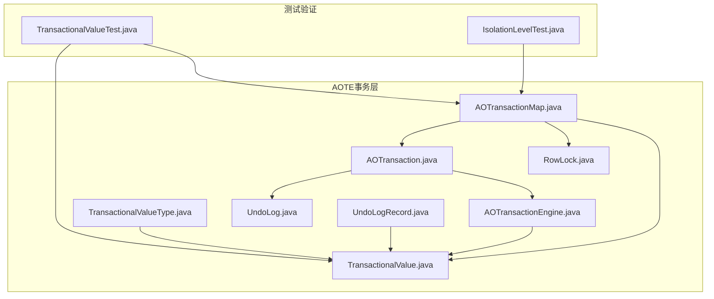
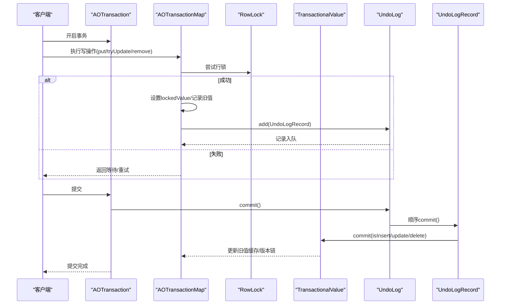
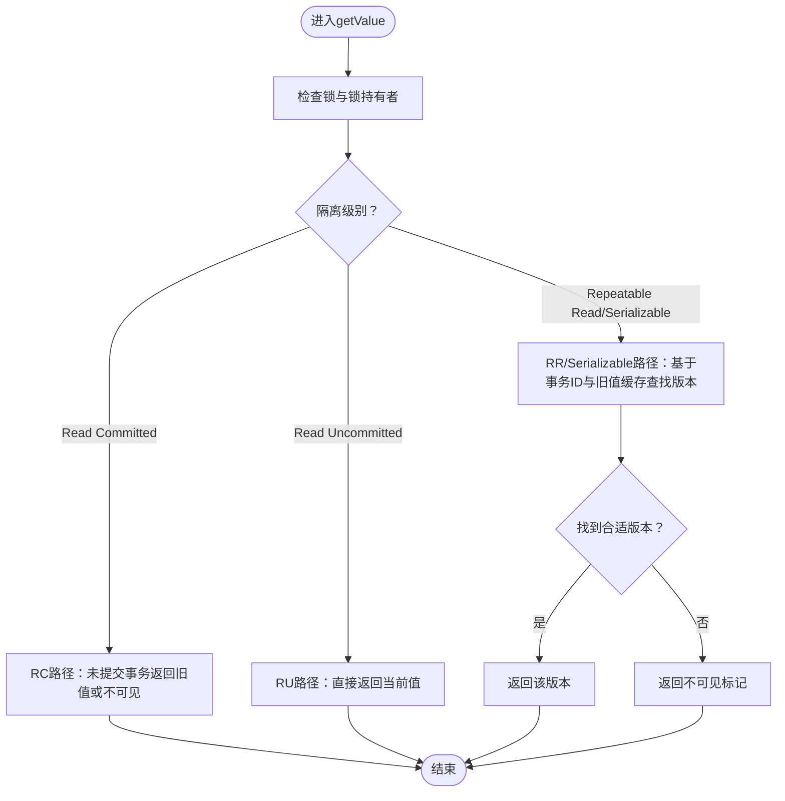
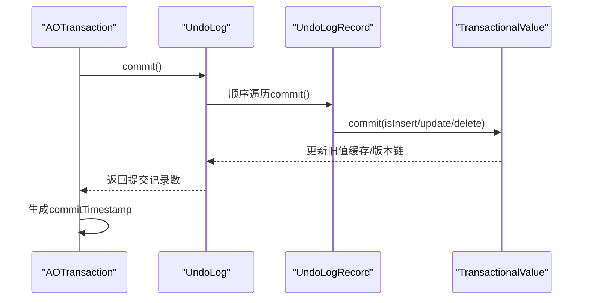
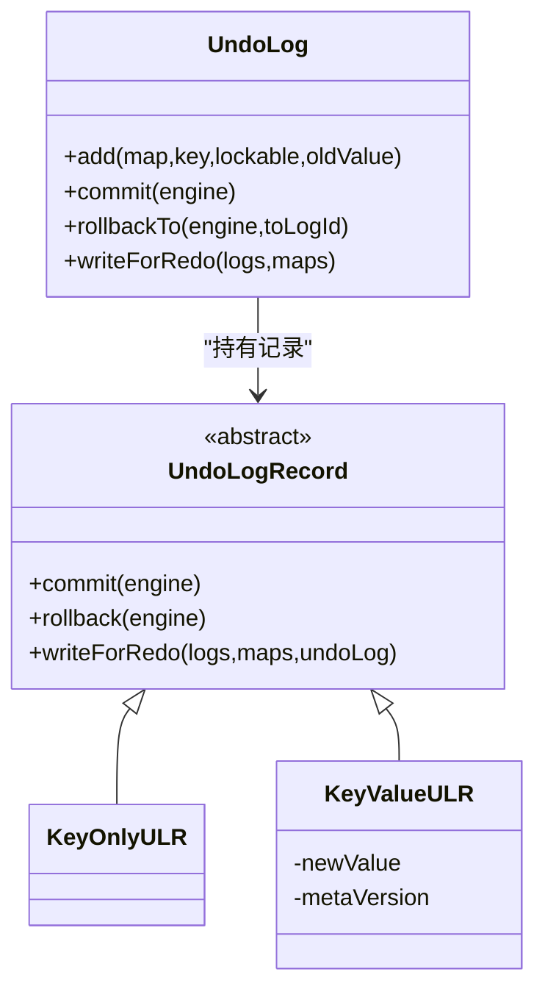
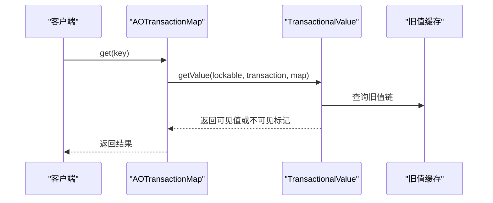
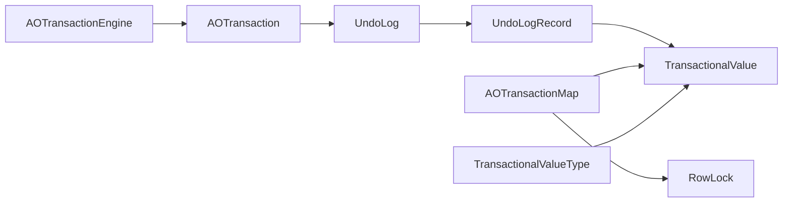

# MVCC实现

**本文引用的文件列表**
- [TransactionalValue.java](https://github.com/lealone/Lealone/blob/master/lealone-aote/src/main/java/com/lealone/transaction/aote/TransactionalValue.java)
- [AOTransaction.java](https://github.com/lealone/Lealone/blob/master/lealone-aote/src/main/java/com/lealone/transaction/aote/AOTransaction.java)
- [UndoLog.java](https://github.com/lealone/Lealone/blob/master/lealone-aote/src/main/java/com/lealone/transaction/aote/log/UndoLog.java)
- [UndoLogRecord.java](https://github.com/lealone/Lealone/blob/master/lealone-aote/src/main/java/com/lealone/transaction/aote/log/UndoLogRecord.java)
- [AOTransactionEngine.java](https://github.com/lealone/Lealone/blob/master/lealone-aote/src/main/java/com/lealone/transaction/aote/AOTransactionEngine.java)
- [AOTransactionMap.java](https://github.com/lealone/Lealone/blob/master/lealone-aote/src/main/java/com/lealone/transaction/aote/AOTransactionMap.java)
- [TransactionalValueType.java](https://github.com/lealone/Lealone/blob/master/lealone-aote/src/main/java/com/lealone/transaction/aote/TransactionalValueType.java)
- [RowLock.java](https://github.com/lealone/Lealone/blob/master/lealone-aote/src/main/java/com/lealone/transaction/aote/lock/RowLock.java)
- [TransactionalValueTest.java](https://github.com/lealone/Lealone/blob/master/lealone-test/src/test/java/com/lealone/test/aote/TransactionalValueTest.java)
- [IsolationLevelTest.java](https://github.com/lealone/Lealone/blob/master/lealone-test/src/test/java/com/lealone/test/aote/IsolationLevelTest.java)

## 目录
1. [简介](#简介)
2. [项目结构](#项目结构)
3. [核心组件](#核心组件)
4. [架构总览](#架构总览)
5. [详细组件分析](#详细组件分析)
6. [依赖关系分析](#依赖关系分析)
7. [性能考量](#性能考量)
8. [故障排查指南](#故障排查指南)
9. [结论](#结论)
10. [附录](#附录)

## 简介
本文件系统化梳理Lealone在AOTE（Async Adaptive Optimization Transaction Engine）子系统中的MVCC实现，重点围绕以下目标：
- 解释TransactionalValue如何封装数据的多个版本并管理版本链；
- 说明AOTransaction如何通过UndoLog维护事务的修改记录，以及这些记录如何支持事务回滚和版本可见性判断；
- 细化不同隔离级别下的版本选择策略（特别是Read Committed与Repeatable Read），包括如何确定哪些版本对当前事务可见；
- 通过测试用例路径展示并发读写场景下，MVCC如何避免读写冲突、保证隔离性并保持高并发性能。

## 项目结构
MVCC相关代码主要集中在lealone-aote模块，涉及事务、存储映射、行级锁、Undo日志等组件协同工作。

图表来源
- [AOTransaction.java](https://github.com/lealone/Lealone/blob/master/lealone-aote/src/main/java/com/lealone/transaction/aote/AOTransaction.java#L1-L461)
- [AOTransactionEngine.java](https://github.com/lealone/Lealone/blob/master/lealone-aote/src/main/java/com/lealone/transaction/aote/AOTransactionEngine.java#L1-L311)
- [TransactionalValue.java](https://github.com/lealone/Lealone/blob/master/lealone-aote/src/main/java/com/lealone/transaction/aote/TransactionalValue.java#L1-L385)
- [TransactionalValueType.java](https://github.com/lealone/Lealone/blob/master/lealone-aote/src/main/java/com/lealone/transaction/aote/TransactionalValueType.java#L1-L159)
- [RowLock.java](https://github.com/lealone/Lealone/blob/master/lealone-aote/src/main/java/com/lealone/transaction/aote/lock/RowLock.java#L1-L104)
- [UndoLog.java](https://github.com/lealone/Lealone/blob/master/lealone-aote/src/main/java/com/lealone/transaction/aote/log/UndoLog.java#L1-L144)
- [UndoLogRecord.java](https://github.com/lealone/Lealone/blob/master/lealone-aote/src/main/java/com/lealone/transaction/aote/log/UndoLogRecord.java#L1-L195)
- [AOTransactionMap.java](https://github.com/lealone/Lealone/blob/master/lealone-aote/src/main/java/com/lealone/transaction/aote/AOTransactionMap.java#L1-L618)
- [TransactionalValueTest.java](https://github.com/lealone/Lealone/blob/master/lealone-test/src/test/java/com/lealone/test/aote/TransactionalValueTest.java#L1-L185)
- [IsolationLevelTest.java](https://github.com/lealone/Lealone/blob/master/lealone-test/src/test/java/com/lealone/test/aote/IsolationLevelTest.java#L1-L102)

章节来源
- [AOTransaction.java](https://github.com/lealone/Lealone/blob/master/lealone-aote/src/main/java/com/lealone/transaction/aote/AOTransaction.java#L1-L120)
- [AOTransactionEngine.java](https://github.com/lealone/Lealone/blob/master/lealone-aote/src/main/java/com/lealone/transaction/aote/AOTransactionEngine.java#L190-L246)

## 核心组件
- TransactionalValue：记录的包装器，负责版本链管理、可见性判断、读写序列化与反序列化。
- AOTransaction：事务实体，持有UndoLog，负责提交/回滚、生成commitTimestamp、与引擎交互。
- UndoLog/UndoLogRecord：事务修改的轻量记录，按顺序组织，支持commit阶段的内存态更新与rollback阶段的逆向恢复。
- AOTransactionMap：事务视图的存储映射，封装读写操作、行锁、旧值缓存与可见性过滤。
- TransactionalValueType：值类型适配器，桥接存储类型与TransactionalValue的读写逻辑。
- RowLock：行级锁，承载事务与旧值，协调并发与可见性。

章节来源
- [TransactionalValue.java](https://github.com/lealone/Lealone/blob/master/lealone-aote/src/main/java/com/lealone/transaction/aote/TransactionalValue.java#L25-L120)
- [AOTransaction.java](https://github.com/lealone/Lealone/blob/master/lealone-aote/src/main/java/com/lealone/transaction/aote/AOTransaction.java#L36-L120)
- [UndoLog.java](https://github.com/lealone/Lealone/blob/master/lealone-aote/src/main/java/com/lealone/transaction/aote/log/UndoLog.java#L22-L92)
- [UndoLogRecord.java](https://github.com/lealone/Lealone/blob/master/lealone-aote/src/main/java/com/lealone/transaction/aote/log/UndoLogRecord.java#L23-L86)
- [AOTransactionMap.java](https://github.com/lealone/Lealone/blob/master/lealone-aote/src/main/java/com/lealone/transaction/aote/AOTransactionMap.java#L29-L120)
- [TransactionalValueType.java](https://github.com/lealone/Lealone/blob/master/lealone-aote/src/main/java/com/lealone/transaction/aote/TransactionalValueType.java#L16-L100)
- [RowLock.java](https://github.com/lealone/Lealone/blob/master/lealone-aote/src/main/java/com/lealone/transaction/aote/lock/RowLock.java#L16-L70)

## 架构总览
MVCC在AOTE中的关键流程：
- 写入：AOTransactionMap在写入前尝试行锁，设置lockedValue并追加UndoLogRecord；提交时按UndoLog顺序调用UndoLogRecord.commit，驱动TransactionalValue.commit建立版本链。
- 读取：AOTransactionMap.get调用TransactionalValue.getValue，结合事务隔离级别与旧值缓存决定可见版本。
- 回滚：AOTransaction.rollback触发UndoLog.rollbackTo，逐条调用UndoLogRecord.rollback，通过TransactionalValue.rollback恢复旧值。
- 可见性：不同隔离级别下，读取路径根据事务ID、commitTimestamp、旧值缓存与锁持有者状态选择合适版本。

图表来源
- [AOTransactionMap.java](https://github.com/lealone/Lealone/blob/master/lealone-aote/src/main/java/com/lealone/transaction/aote/AOTransactionMap.java#L372-L431)
- [UndoLog.java](https://github.com/lealone/Lealone/blob/master/lealone-aote/src/main/java/com/lealone/transaction/aote/log/UndoLog.java#L107-L122)
- [UndoLogRecord.java](https://github.com/lealone/Lealone/blob/master/lealone-aote/src/main/java/com/lealone/transaction/aote/log/UndoLogRecord.java#L51-L82)
- [TransactionalValue.java](https://github.com/lealone/Lealone/blob/master/lealone-aote/src/main/java/com/lealone/transaction/aote/TransactionalValue.java#L258-L297)

## 详细组件分析

### TransactionalValue：版本封装与可见性
- 版本链结构：内部类OldValue以单链表形式维护历史版本，包含事务ID、键、值及next指针；还支持useLast标志优化可重复读场景。
- 读取可见性：
  - Read Committed：若当前事务未提交，则优先返回旧值（lockOwner.getOldValue）；若为插入但未提交则返回“不可见”标记。
  - Repeatable Read/Serializable：基于事务ID与旧值缓存中的版本链进行二分/线性查找，确保事务内一致性；若找不到合适版本则返回“不可见”标记。
  - Read Uncommitted：直接返回当前值。
- 写入序列化：支持写入未提交值或已提交值，兼容旧格式版本号。
- 提交阶段：根据是否插入/更新/删除，调用TransactionalValue.commit建立或更新旧值缓存，形成版本链。

图表来源
- [TransactionalValue.java](https://github.com/lealone/Lealone/blob/master/lealone-aote/src/main/java/com/lealone/transaction/aote/TransactionalValue.java#L121-L196)

章节来源
- [TransactionalValue.java](https://github.com/lealone/Lealone/blob/master/lealone-aote/src/main/java/com/lealone/transaction/aote/TransactionalValue.java#L27-L39)
- [TransactionalValue.java](https://github.com/lealone/Lealone/blob/master/lealone-aote/src/main/java/com/lealone/transaction/aote/TransactionalValue.java#L121-L196)
- [TransactionalValue.java](https://github.com/lealone/Lealone/blob/master/lealone-aote/src/main/java/com/lealone/transaction/aote/TransactionalValue.java#L258-L297)
- [TransactionalValue.java](https://github.com/lealone/Lealone/blob/master/lealone-aote/src/main/java/com/lealone/transaction/aote/TransactionalValue.java#L311-L350)

### AOTransaction：事务生命周期与UndoLog
- 生命周期：开启事务、写入Redo/Undo、生成commitTimestamp、提交/回滚。
- Redo/Undo：通过LogSyncService写入RedoLog，UndoLog在提交时顺序commit，在回滚时按logId倒序rollback。
- 提交顺序：先写RedoLog，再生成commitTimestamp，最后提交UndoLog，确保可重复读依赖的commitTimestamp生效。
- 回滚：rollbackToSavepoint/rollback触发UndoLog.rollbackTo，逐条调用UndoLogRecord.rollback，通过TransactionalValue.rollback恢复旧值。

图表来源
- [AOTransaction.java](https://github.com/lealone/Lealone/blob/master/lealone-aote/src/main/java/com/lealone/transaction/aote/AOTransaction.java#L222-L309)
- [UndoLog.java](https://github.com/lealone/Lealone/blob/master/lealone-aote/src/main/java/com/lealone/transaction/aote/log/UndoLog.java#L107-L122)
- [UndoLogRecord.java](https://github.com/lealone/Lealone/blob/master/lealone-aote/src/main/java/com/lealone/transaction/aote/log/UndoLogRecord.java#L51-L82)
- [TransactionalValue.java](https://github.com/lealone/Lealone/blob/master/lealone-aote/src/main/java/com/lealone/transaction/aote/TransactionalValue.java#L258-L297)

章节来源
- [AOTransaction.java](https://github.com/lealone/Lealone/blob/master/lealone-aote/src/main/java/com/lealone/transaction/aote/AOTransaction.java#L222-L309)
- [UndoLog.java](https://github.com/lealone/Lealone/blob/master/lealone-aote/src/main/java/com/lealone/transaction/aote/log/UndoLog.java#L107-L122)
- [UndoLogRecord.java](https://github.com/lealone/Lealone/blob/master/lealone-aote/src/main/java/com/lealone/transaction/aote/log/UndoLogRecord.java#L51-L82)

### UndoLog/UndoLogRecord：修改记录与回滚
- UndoLog：单线程访问的有序记录集合，维护first/last指针，支持commit与rollbackTo。
- UndoLogRecord：
  - KeyOnlyULR：索引等不需要写Redo的场景，直接结束。
  - KeyValueULR：写Redo时记录元信息与键值，commit时调用TransactionalValue.commit建立版本链；rollback时恢复旧值。
- 写Redo：根据map是否需要持久化与多Map情况，输出不同类型的记录头与键值。

图表来源
- [UndoLog.java](https://github.com/lealone/Lealone/blob/master/lealone-aote/src/main/java/com/lealone/transaction/aote/log/UndoLog.java#L22-L144)
- [UndoLogRecord.java](https://github.com/lealone/Lealone/blob/master/lealone-aote/src/main/java/com/lealone/transaction/aote/log/UndoLogRecord.java#L23-L177)

章节来源
- [UndoLog.java](https://github.com/lealone/Lealone/blob/master/lealone-aote/src/main/java/com/lealone/transaction/aote/log/UndoLog.java#L67-L122)
- [UndoLogRecord.java](https://github.com/lealone/Lealone/blob/master/lealone-aote/src/main/java/com/lealone/transaction/aote/log/UndoLogRecord.java#L51-L177)

### AOTransactionMap：读写入口与可见性过滤
- 读取：get调用TransactionalValue.getValue，结合事务隔离级别与旧值缓存过滤不可见版本。
- 写入：tryUpdateOrRemove先尝试行锁，设置lockedValue并添加UndoLogRecord；addIfAbsent在冲突时标记UndoLogRecord为undone或继续后续流程。
- 旧值缓存：AOTransactionMap持有StorageMap的旧值缓存，TransactionalValue.commit将版本链写入缓存，供读取时快速定位。

图表来源
- [AOTransactionMap.java](https://github.com/lealone/Lealone/blob/master/lealone-aote/src/main/java/com/lealone/transaction/aote/AOTransactionMap.java#L52-L80)
- [TransactionalValue.java](https://github.com/lealone/Lealone/blob/master/lealone-aote/src/main/java/com/lealone/transaction/aote/TransactionalValue.java#L121-L196)

章节来源
- [AOTransactionMap.java](https://github.com/lealone/Lealone/blob/master/lealone-aote/src/main/java/com/lealone/transaction/aote/AOTransactionMap.java#L52-L80)
- [AOTransactionMap.java](https://github.com/lealone/Lealone/blob/master/lealone-aote/src/main/java/com/lealone/transaction/aote/AOTransactionMap.java#L372-L431)

### TransactionalValueType：值类型适配
- 将存储类型与TransactionalValue读写逻辑桥接，支持列式读写、比较、元数据写入等。
- 在比较时使用TransactionalValue.getTid以事务ID排序，确保事务内一致性。

章节来源
- [TransactionalValueType.java](https://github.com/lealone/Lealone/blob/master/lealone-aote/src/main/java/com/lealone/transaction/aote/TransactionalValueType.java#L45-L57)
- [TransactionalValueType.java](https://github.com/lealone/Lealone/blob/master/lealone-aote/src/main/java/com/lealone/transaction/aote/TransactionalValueType.java#L66-L82)

### RowLock：行级锁与旧值
- RowLock继承Lock，持有lockable与PageListener，负责加锁、解锁与旧值管理。
- 与TransactionalValue配合，确保读取可见性与写入冲突检测。

章节来源
- [RowLock.java](https://github.com/lealone/Lealone/blob/master/lealone-aote/src/main/java/com/lealone/transaction/aote/lock/RowLock.java#L16-L104)
- [TransactionalValue.java](https://github.com/lealone/Lealone/blob/master/lealone-aote/src/main/java/com/lealone/transaction/aote/TransactionalValue.java#L83-L120)

## 依赖关系分析
- AOTransaction持有UndoLog并在提交时调用UndoLog.commit，UndoLogRecord.commit再委托TransactionalValue.commit建立版本链。
- AOTransactionMap在写入时创建UndoLogRecord并加入UndoLog，读取时通过TransactionalValue.getValue进行可见性判断。
- TransactionalValue依赖RowLock与旧值缓存，结合事务ID与commitTimestamp决定可见版本。
- AOTransactionEngine负责事务计数、commitTimestamp生成与服务初始化，间接影响MVCC可见性。

图表来源
- [AOTransactionEngine.java](https://github.com/lealone/Lealone/blob/master/lealone-aote/src/main/java/com/lealone/transaction/aote/AOTransactionEngine.java#L190-L246)
- [AOTransaction.java](https://github.com/lealone/Lealone/blob/master/lealone-aote/src/main/java/com/lealone/transaction/aote/AOTransaction.java#L222-L309)
- [UndoLog.java](https://github.com/lealone/Lealone/blob/master/lealone-aote/src/main/java/com/lealone/transaction/aote/log/UndoLog.java#L107-L122)
- [UndoLogRecord.java](https://github.com/lealone/Lealone/blob/master/lealone-aote/src/main/java/com/lealone/transaction/aote/log/UndoLogRecord.java#L51-L82)
- [TransactionalValue.java](https://github.com/lealone/Lealone/blob/master/lealone-aote/src/main/java/com/lealone/transaction/aote/TransactionalValue.java#L258-L297)
- [AOTransactionMap.java](https://github.com/lealone/Lealone/blob/master/lealone-aote/src/main/java/com/lealone/transaction/aote/AOTransactionMap.java#L372-L431)
- [RowLock.java](https://github.com/lealone/Lealone/blob/master/lealone-aote/src/main/java/com/lealone/transaction/aote/lock/RowLock.java#L16-L70)
- [TransactionalValueType.java](https://github.com/lealone/Lealone/blob/master/lealone-aote/src/main/java/com/lealone/transaction/aote/TransactionalValueType.java#L45-L57)

章节来源
- [AOTransactionEngine.java](https://github.com/lealone/Lealone/blob/master/lealone-aote/src/main/java/com/lealone/transaction/aote/AOTransactionEngine.java#L190-L246)
- [AOTransaction.java](https://github.com/lealone/Lealone/blob/master/lealone-aote/src/main/java/com/lealone/transaction/aote/AOTransaction.java#L222-L309)
- [UndoLog.java](https://github.com/lealone/Lealone/blob/master/lealone-aote/src/main/java/com/lealone/transaction/aote/log/UndoLog.java#L107-L122)
- [UndoLogRecord.java](https://github.com/lealone/Lealone/blob/master/lealone-aote/src/main/java/com/lealone/transaction/aote/log/UndoLogRecord.java#L51-L82)
- [TransactionalValue.java](https://github.com/lealone/Lealone/blob/master/lealone-aote/src/main/java/com/lealone/transaction/aote/TransactionalValue.java#L258-L297)
- [AOTransactionMap.java](https://github.com/lealone/Lealone/blob/master/lealone-aote/src/main/java/com/lealone/transaction/aote/AOTransactionMap.java#L372-L431)
- [RowLock.java](https://github.com/lealone/Lealone/blob/master/lealone-aote/src/main/java/com/lealone/transaction/aote/lock/RowLock.java#L16-L70)
- [TransactionalValueType.java](https://github.com/lealone/Lealone/blob/master/lealone-aote/src/main/java/com/lealone/transaction/aote/TransactionalValueType.java#L45-L57)

## 性能考量
- 旧值缓存：TransactionalValue在可重复读场景下将版本链写入StorageMap的旧值缓存，读取时避免全链扫描，提升可见性判断效率。
- commitTimestamp生成时机：必须在RedoLog同步完成后生成，确保可重复读事务与检查点正确依赖该时间戳。
- 写入路径优化：写入时优先写未提交值，必要时回退到旧值，减少不必要的拷贝与IO。
- 行锁粒度：RowLock提供细粒度并发控制，避免全局锁竞争，提高并发吞吐。

章节来源
- [TransactionalValue.java](https://github.com/lealone/Lealone/blob/master/lealone-aote/src/main/java/com/lealone/transaction/aote/TransactionalValue.java#L164-L196)
- [AOTransaction.java](https://github.com/lealone/Lealone/blob/master/lealone-aote/src/main/java/com/lealone/transaction/aote/AOTransaction.java#L250-L259)
- [UndoLogRecord.java](https://github.com/lealone/Lealone/blob/master/lealone-aote/src/main/java/com/lealone/transaction/aote/log/UndoLogRecord.java#L119-L127)

## 故障排查指南
- 读不到预期值：
  - 检查事务隔离级别是否过高导致不可见；参考IsolationLevelTest用例路径。
  - 确认事务是否已提交，未提交事务在RC下可能返回旧值或不可见。
- 并发冲突导致等待：
  - 查看AOTransactionMap.tryUpdateOrRemove返回值，确认是否因行锁被其他事务持有。
- 回滚后仍看到旧值：
  - 确认UndoLog.rollbackTo是否正确执行，以及UndoLogRecord.rollback是否调用了TransactionalValue.rollback。
- 旧值缓存异常：
  - 检查TransactionalValue.commit在插入/更新场景下是否正确写入旧值缓存与版本链。

章节来源
- [IsolationLevelTest.java](https://github.com/lealone/Lealone/blob/master/lealone-test/src/test/java/com/lealone/test/aote/IsolationLevelTest.java#L1-L102)
- [TransactionalValueTest.java](https://github.com/lealone/Lealone/blob/master/lealone-test/src/test/java/com/lealone/test/aote/TransactionalValueTest.java#L1-L185)
- [AOTransactionMap.java](https://github.com/lealone/Lealone/blob/master/lealone-aote/src/main/java/com/lealone/transaction/aote/AOTransactionMap.java#L372-L431)
- [UndoLogRecord.java](https://github.com/lealone/Lealone/blob/master/lealone-aote/src/main/java/com/lealone/transaction/aote/log/UndoLogRecord.java#L72-L82)

## 结论
Lealone的AOTE-MVCC通过TransactionalValue的版本链、RowLock的行级锁、UndoLog的轻量记录与AOTransaction的提交/回滚流程，实现了高效的并发控制与严格的隔离保障。不同隔离级别下，读取路径基于事务ID、commitTimestamp与旧值缓存精确选择可见版本，既满足Repeatable Read/Serializable的可重复读需求，又在Read Committed场景下提供良好的并发性能。

## 附录
- 并发读写示例（测试用例路径）
  - 事务写入与回滚验证：[TransactionalValueTest.java](https://github.com/lealone/Lealone/blob/master/lealone-test/src/test/java/com/lealone/test/aote/TransactionalValueTest.java#L32-L72)
  - 多事务并发写入与提交顺序影响：[TransactionalValueTest.java](https://github.com/lealone/Lealone/blob/master/lealone-test/src/test/java/com/lealone/test/aote/TransactionalValueTest.java#L74-L148)
  - 隔离级别可见性验证：[IsolationLevelTest.java](https://github.com/lealone/Lealone/blob/master/lealone-test/src/test/java/com/lealone/test/aote/IsolationLevelTest.java#L21-L101)