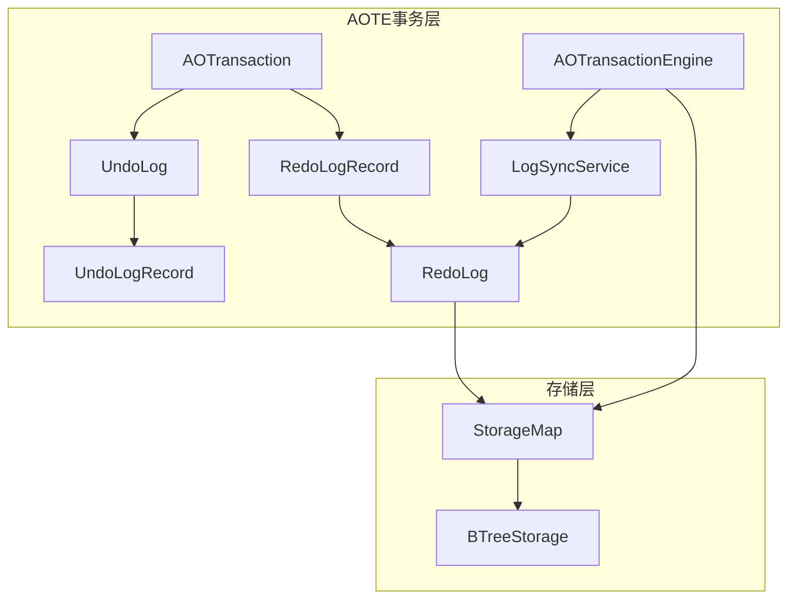
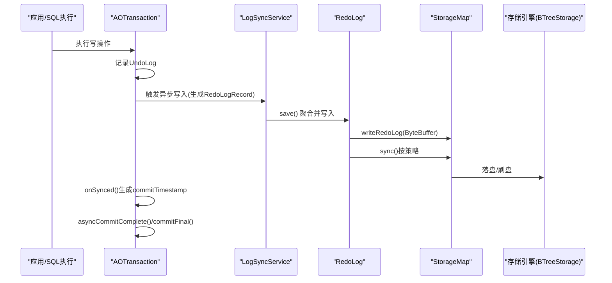
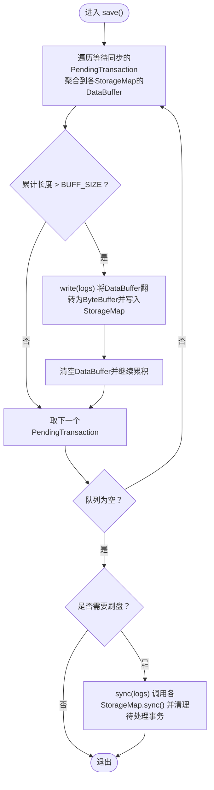
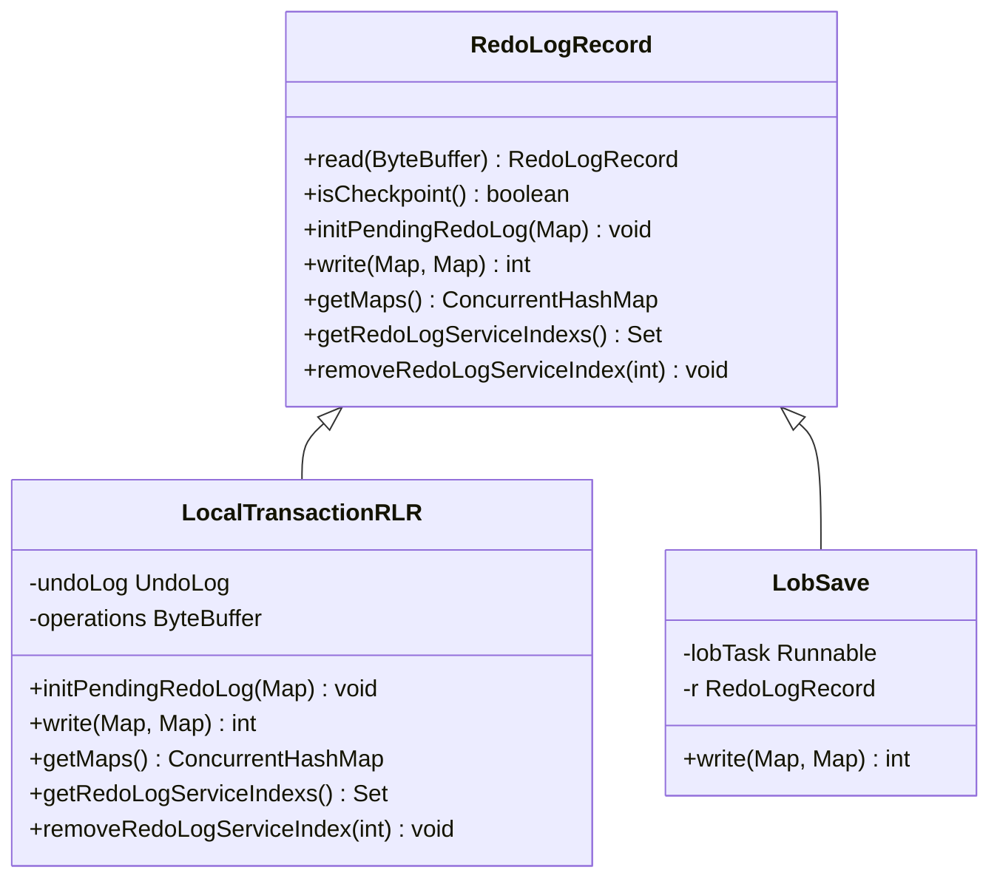
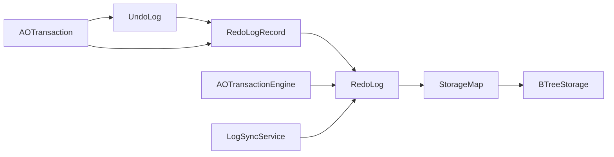
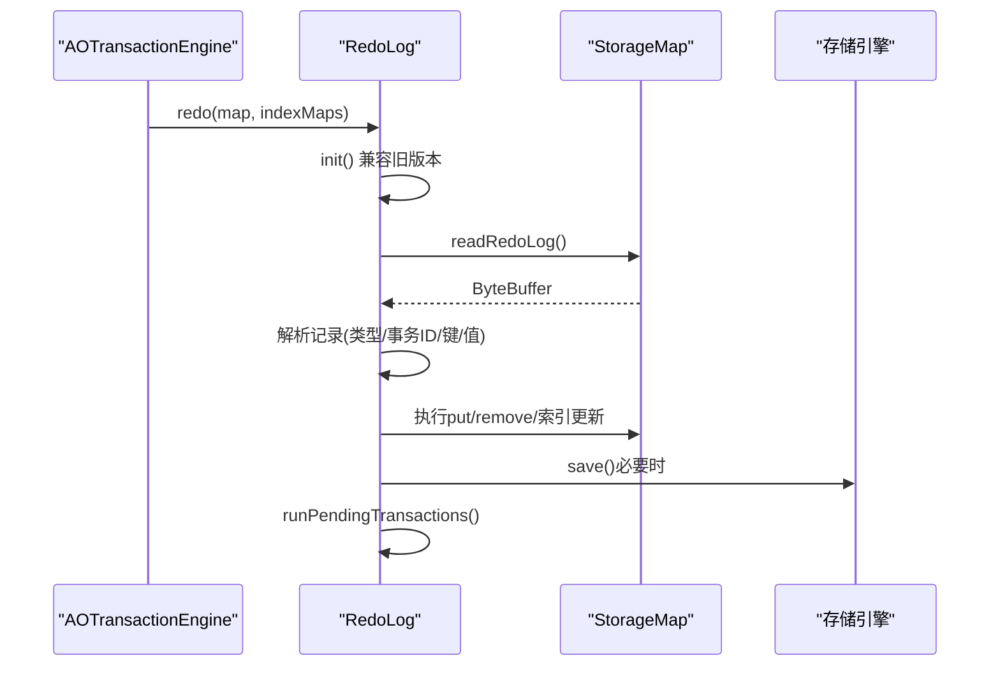

# Redo日志持久化

<cite>
**本文引用的文件列表**
- [RedoLog.java](file://lealone-aote/src/main/java/com/lealone/transaction/aote/log/RedoLog.java)
- [AOTransactionEngine.java](file://lealone-aote/src/main/java/com/lealone/transaction/aote/AOTransactionEngine.java)
- [RedoLogRecord.java](file://lealone-aote/src/main/java/com/lealone/transaction/aote/log/RedoLogRecord.java)
- [UndoLog.java](file://lealone-aote/src/main/java/com/lealone/transaction/aote/log/UndoLog.java)
- [UndoLogRecord.java](file://lealone-aote/src/main/java/com/lealone/transaction/aote/log/UndoLogRecord.java)
- [LogSyncService.java](file://lealone-aote/src/main/java/com/lealone/transaction/aote/log/LogSyncService.java)
- [AOTransaction.java](file://lealone-aote/src/main/java/com/lealone/transaction/aote/AOTransaction.java)
- [StorageMap.java](file://lealone-sci/src/main/java/com/lealone/storage/StorageMap.java)
- [TransactionalValue.java](file://lealone-aote/src/main/java/com/lealone/transaction/aote/TransactionalValue.java)
- [BTreeStorage.java](file://lealone-aose/src/main/java/com/lealone/storage/aose/btree/BTreeStorage.java)
</cite>

## 目录
1. [简介](#简介)
2. [项目结构与定位](#项目结构与定位)
3. [核心组件](#核心组件)
4. [架构总览](#架构总览)
5. [详细组件分析](#详细组件分析)
6. [依赖关系分析](#依赖关系分析)
7. [性能与刷盘策略](#性能与刷盘策略)
8. [故障恢复与崩溃重放](#故障恢复与崩溃重放)
9. [排障指南](#排障指南)
10. [结论](#结论)

## 简介
本文件面向开发者与运维人员，系统化阐述Lealone在AOTE引擎下的Redo日志持久化机制。重点覆盖：
- RedoLog类如何将事务修改序列化为日志记录并异步写入磁盘；
- 日志记录结构（事务ID、操作类型、数据变更内容等）；
- Prepare阶段AOTransactionEngine如何协调RedoLog，确保未提交事务修改在系统崩溃后可准确恢复；
- 日志写入、刷盘策略与崩溃恢复时的日志重放流程；
- 在ACID特性中对“持久性”的保障作用。

## 项目结构与定位
- Redo日志位于AOTE模块的log子包，配合事务引擎AOTransactionEngine与同步服务LogSyncService协同工作。
- StorageMap接口定义了写入/读取Redo日志与刷盘的抽象能力；具体实现由存储引擎提供（例如AOSE的B+树存储）。

图表来源
- [AOTransactionEngine.java](file://lealone-aote/src/main/java/com/lealone/transaction/aote/AOTransactionEngine.java#L254-L260)
- [AOTransaction.java](file://lealone-aote/src/main/java/com/lealone/transaction/aote/AOTransaction.java#L222-L248)
- [UndoLog.java](file://lealone-aote/src/main/java/com/lealone/transaction/aote/log/UndoLog.java#L107-L143)
- [UndoLogRecord.java](file://lealone-aote/src/main/java/com/lealone/transaction/aote/log/UndoLogRecord.java#L84-L176)
- [RedoLogRecord.java](file://lealone-aote/src/main/java/com/lealone/transaction/aote/log/RedoLogRecord.java#L105-L148)
- [RedoLog.java](file://lealone-aote/src/main/java/com/lealone/transaction/aote/log/RedoLog.java#L410-L427)
- [StorageMap.java](file://lealone-sci/src/main/java/com/lealone/storage/StorageMap.java#L300-L329)
- [BTreeStorage.java](file://lealone-aose/src/main/java/com/lealone/storage/aose/btree/BTreeStorage.java#L369-L414)

章节来源
- [AOTransactionEngine.java](file://lealone-aote/src/main/java/com/lealone/transaction/aote/AOTransactionEngine.java#L254-L260)
- [AOTransaction.java](file://lealone-aote/src/main/java/com/lealone/transaction/aote/AOTransaction.java#L222-L248)
- [RedoLog.java](file://lealone-aote/src/main/java/com/lealone/transaction/aote/log/RedoLog.java#L410-L427)
- [StorageMap.java](file://lealone-sci/src/main/java/com/lealone/storage/StorageMap.java#L300-L329)

## 核心组件
- RedoLog：负责收集、聚合、写入与刷盘Redo日志，维护多表事务一致性与检查点协调。
- RedoLogRecord：日志记录抽象，包含本地事务记录、LOB保存包装等类型。
- UndoLog/UndoLogRecord：事务内部的反向日志，用于生成Redo日志并支持回滚。
- LogSyncService：异步同步服务，调度RedoLog写入与刷盘，支持周期/即时/无同步模式。
- AOTransaction/AOTransactionEngine：事务生命周期管理，触发Redo日志写入与提交完成。
- StorageMap：存储抽象，提供writeRedoLog/readRedoLog/sync等能力，具体实现由存储引擎提供。

章节来源
- [RedoLog.java](file://lealone-aote/src/main/java/com/lealone/transaction/aote/log/RedoLog.java#L41-L73)
- [RedoLogRecord.java](file://lealone-aote/src/main/java/com/lealone/transaction/aote/log/RedoLogRecord.java#L23-L61)
- [UndoLog.java](file://lealone-aote/src/main/java/com/lealone/transaction/aote/log/UndoLog.java#L22-L65)
- [UndoLogRecord.java](file://lealone-aote/src/main/java/com/lealone/transaction/aote/log/UndoLogRecord.java#L23-L51)
- [LogSyncService.java](file://lealone-aote/src/main/java/com/lealone/transaction/aote/log/LogSyncService.java#L25-L61)
- [AOTransaction.java](file://lealone-aote/src/main/java/com/lealone/transaction/aote/AOTransaction.java#L222-L248)
- [AOTransactionEngine.java](file://lealone-aote/src/main/java/com/lealone/transaction/aote/AOTransactionEngine.java#L254-L260)
- [StorageMap.java](file://lealone-sci/src/main/java/com/lealone/storage/StorageMap.java#L300-L329)

## 架构总览
Redo日志持久化采用“事务侧生成、异步服务调度、存储侧落盘”的分层设计：
- 事务侧：AOTransaction在提交前将UndoLog转换为RedoLogRecord并交由LogSyncService异步写入。
- 异步服务：LogSyncService根据配置选择同步策略，周期性或即时触发RedoLog.save()。
- 存储侧：RedoLog将序列化后的日志写入各StorageMap的Redo日志缓冲区，并在必要时调用m.sync()进行刷盘。

图表来源
- [AOTransaction.java](file://lealone-aote/src/main/java/com/lealone/transaction/aote/AOTransaction.java#L222-L248)
- [LogSyncService.java](file://lealone-aote/src/main/java/com/lealone/transaction/aote/log/LogSyncService.java#L186-L217)
- [RedoLog.java](file://lealone-aote/src/main/java/com/lealone/transaction/aote/log/RedoLog.java#L410-L427)
- [StorageMap.java](file://lealone-sci/src/main/java/com/lealone/storage/StorageMap.java#L300-L329)
- [BTreeStorage.java](file://lealone-aose/src/main/java/com/lealone/storage/aose/btree/BTreeStorage.java#L369-L392)

## 详细组件分析

### RedoLog：日志聚合、写入与刷盘
- 聚合与缓冲：按表聚合日志，使用固定大小缓冲（常量BUFF_SIZE），超过阈值批量写入。
- 写入路径：将DataBuffer翻转为ByteBuffer后调用StorageMap.writeRedoLog，随后清空缓冲继续累积。
- 刷盘策略：根据LogSyncService的同步类型决定是否调用StorageMap.sync()。
- 多表事务一致性：当事务涉及多表时，需等待所有相关RedoLog服务索引均完成同步后，再推进检查点。
- 兼容性：支持老版本全局Redo日志迁移，按文件编号顺序读取并重放。

图表来源
- [RedoLog.java](file://lealone-aote/src/main/java/com/lealone/transaction/aote/log/RedoLog.java#L271-L363)
- [RedoLog.java](file://lealone-aote/src/main/java/com/lealone/transaction/aote/log/RedoLog.java#L410-L427)
- [RedoLog.java](file://lealone-aote/src/main/java/com/lealone/transaction/aote/log/RedoLog.java#L429-L451)

章节来源
- [RedoLog.java](file://lealone-aote/src/main/java/com/lealone/transaction/aote/log/RedoLog.java#L41-L73)
- [RedoLog.java](file://lealone-aote/src/main/java/com/lealone/transaction/aote/log/RedoLog.java#L271-L363)
- [RedoLog.java](file://lealone-aote/src/main/java/com/lealone/transaction/aote/log/RedoLog.java#L410-L427)
- [RedoLog.java](file://lealone-aote/src/main/java/com/lealone/transaction/aote/log/RedoLog.java#L429-L451)

### RedoLogRecord：日志记录类型与序列化
- 类型体系：
  - CheckpointRLR：检查点标记，触发丢弃旧日志。
  - DroppedMapRLR：兼容旧版，记录被删除表名。
  - LocalTransactionRLR：本地事务记录，封装UndoLog生成的字节流。
  - LobSave：LOB写入任务包装，先执行LOB任务再写入日志。
- 序列化规则：
  - 写入时按表聚合，记录操作类型、事务ID、涉及表集合、键与值等。
  - 旧格式兼容：读取时区分新旧格式版本，确保向前兼容。

图表来源
- [RedoLogRecord.java](file://lealone-aote/src/main/java/com/lealone/transaction/aote/log/RedoLogRecord.java#L23-L61)
- [RedoLogRecord.java](file://lealone-aote/src/main/java/com/lealone/transaction/aote/log/RedoLogRecord.java#L105-L148)
- [RedoLogRecord.java](file://lealone-aote/src/main/java/com/lealone/transaction/aote/log/RedoLogRecord.java#L150-L186)

章节来源
- [RedoLogRecord.java](file://lealone-aote/src/main/java/com/lealone/transaction/aote/log/RedoLogRecord.java#L23-L61)
- [RedoLogRecord.java](file://lealone-aote/src/main/java/com/lealone/transaction/aote/log/RedoLogRecord.java#L105-L148)
- [RedoLogRecord.java](file://lealone-aote/src/main/java/com/lealone/transaction/aote/log/RedoLogRecord.java#L150-L186)

### UndoLog/UndoLogRecord：事务内部反向日志
- UndoLog：维护事务内的操作链表，记录涉及的StorageMap及RedoLog服务索引集合。
- UndoLogRecord：
  - KeyOnlyULR：仅键的索引等无需Redo日志的场景。
  - KeyValueULR：键值变更，写入Redo日志时携带metaVersion、事务ID、表名集合等。
- 写Redo：KeyValueULR.writeForRedo将键、值、元信息写入DataBuffer，供RedoLog聚合。

章节来源
- [UndoLog.java](file://lealone-aote/src/main/java/com/lealone/transaction/aote/log/UndoLog.java#L22-L65)
- [UndoLog.java](file://lealone-aote/src/main/java/com/lealone/transaction/aote/log/UndoLog.java#L107-L143)
- [UndoLogRecord.java](file://lealone-aote/src/main/java/com/lealone/transaction/aote/log/UndoLogRecord.java#L84-L176)

### LogSyncService：异步同步与刷盘调度
- 同步类型：
  - periodic：周期性同步，支持阈值触发。
  - instant：即时同步，尽快唤醒。
  - no_sync：禁用同步，直接回调完成。
- 关键行为：
  - asyncWrite：将PendingTransaction加入对应调度器队列，唤醒等待的调度器。
  - syncWrite：同步等待完成。
  - run：循环执行sync()，并在周期内处理检查点与等待队列。

章节来源
- [LogSyncService.java](file://lealone-aote/src/main/java/com/lealone/transaction/aote/log/LogSyncService.java#L25-L61)
- [LogSyncService.java](file://lealone-aote/src/main/java/com/lealone/transaction/aote/log/LogSyncService.java#L111-L160)
- [LogSyncService.java](file://lealone-aote/src/main/java/com/lealone/transaction/aote/log/LogSyncService.java#L186-L217)
- [LogSyncService.java](file://lealone-aote/src/main/java/com/lealone/transaction/aote/log/LogSyncService.java#L218-L320)

### AOTransaction/AOTransactionEngine：Prepare与提交
- AOTransaction.writeRedoLog：在提交前生成RedoLogRecord（含LOB任务包装），按配置异步或同步写入。
- AOTransaction.onSynced：在RedoLog同步完成后生成commitTimestamp，这是持久性的关键时序点。
- AOTransactionEngine.recover：启动时调用RedoLog.redo，重放未提交事务的修改，确保崩溃后可恢复。

章节来源
- [AOTransaction.java](file://lealone-aote/src/main/java/com/lealone/transaction/aote/AOTransaction.java#L222-L248)
- [AOTransaction.java](file://lealone-aote/src/main/java/com/lealone/transaction/aote/AOTransaction.java#L251-L258)
- [AOTransactionEngine.java](file://lealone-aote/src/main/java/com/lealone/transaction/aote/AOTransactionEngine.java#L254-L260)

### StorageMap与存储引擎：日志落盘
- StorageMap接口提供writeRedoLog/readRedoLog/sync等能力，默认实现为空，具体由存储引擎实现。
- AOSE的BTreeStorage示例：将日志写入块文件，提供readRedoLog与sync能力，并支持validateRedoLog校验事务边界。

章节来源
- [StorageMap.java](file://lealone-sci/src/main/java/com/lealone/storage/StorageMap.java#L300-L329)
- [BTreeStorage.java](file://lealone-aose/src/main/java/com/lealone/storage/aose/btree/BTreeStorage.java#L369-L414)

## 依赖关系分析
- AOTransaction依赖UndoLog生成RedoLogRecord，再交由LogSyncService异步写入。
- LogSyncService持有RedoLog实例，驱动save()与sync()。
- RedoLog依赖StorageMap的writeRedoLog/sync能力，实现落盘与刷盘。
- AOTransactionEngine在recover时调用RedoLog.redo，完成崩溃恢复。

图表来源
- [AOTransaction.java](file://lealone-aote/src/main/java/com/lealone/transaction/aote/AOTransaction.java#L222-L248)
- [UndoLog.java](file://lealone-aote/src/main/java/com/lealone/transaction/aote/log/UndoLog.java#L107-L143)
- [RedoLogRecord.java](file://lealone-aote/src/main/java/com/lealone/transaction/aote/log/RedoLogRecord.java#L105-L148)
- [RedoLog.java](file://lealone-aote/src/main/java/com/lealone/transaction/aote/log/RedoLog.java#L410-L427)
- [StorageMap.java](file://lealone-sci/src/main/java/com/lealone/storage/StorageMap.java#L300-L329)
- [BTreeStorage.java](file://lealone-aose/src/main/java/com/lealone/storage/aose/btree/BTreeStorage.java#L369-L414)
- [AOTransactionEngine.java](file://lealone-aote/src/main/java/com/lealone/transaction/aote/AOTransactionEngine.java#L254-L260)

## 性能与刷盘策略
- 异步化与批量化：RedoLog按表聚合、固定缓冲阈值批量写入，减少系统调用次数。
- 多服务索引：事务涉及多表时，RedoLog维护pendingTransactions，等待所有相关服务索引完成同步后再推进检查点，避免部分表未落盘导致的检查点不一致。
- 同步类型：
  - periodic：周期性刷盘，适合高吞吐场景；支持阈值触发，平衡延迟与吞吐。
  - instant：尽快同步，降低丢失风险但可能影响吞吐。
  - no_sync：跳过同步，追求极致性能，适用于可接受一定数据丢失风险的场景。
- 事务提交时序：AOTransaction.onSynced在RedoLog同步完成后生成commitTimestamp，确保后续检查点与可重复读事务可见性正确。

章节来源
- [RedoLog.java](file://lealone-aote/src/main/java/com/lealone/transaction/aote/log/RedoLog.java#L271-L363)
- [LogSyncService.java](file://lealone-aote/src/main/java/com/lealone/transaction/aote/log/LogSyncService.java#L218-L320)
- [AOTransaction.java](file://lealone-aote/src/main/java/com/lealone/transaction/aote/AOTransaction.java#L251-L258)

## 故障恢复与崩溃重放
- 启动恢复：AOTransactionEngine.recover调用RedoLog.redo，按表重放Redo日志。
- 兼容旧版本：RedoLog.init扫描旧版全局Redo目录，读取历史记录并通过initPendingRedoLog迁移至新格式，再逐条重放。
- 重放逻辑：RedoLog.redo根据格式版本读取键、操作类型、事务ID、表名集合等，分别执行删除或插入/更新，并维护索引一致性。
- 事务边界校验：BTreeStorage.validateRedoLog通过读取日志头记录的事务ID，确认该事务是否已在当前存储中得到满足，避免重复重放。

图表来源
- [AOTransactionEngine.java](file://lealone-aote/src/main/java/com/lealone/transaction/aote/AOTransactionEngine.java#L254-L260)
- [RedoLog.java](file://lealone-aote/src/main/java/com/lealone/transaction/aote/log/RedoLog.java#L136-L190)
- [RedoLog.java](file://lealone-aote/src/main/java/com/lealone/transaction/aote/log/RedoLog.java#L192-L257)
- [BTreeStorage.java](file://lealone-aose/src/main/java/com/lealone/storage/aose/btree/BTreeStorage.java#L380-L414)

章节来源
- [AOTransactionEngine.java](file://lealone-aote/src/main/java/com/lealone/transaction/aote/AOTransactionEngine.java#L254-L260)
- [RedoLog.java](file://lealone-aote/src/main/java/com/lealone/transaction/aote/log/RedoLog.java#L74-L118)
- [RedoLog.java](file://lealone-aote/src/main/java/com/lealone/transaction/aote/log/RedoLog.java#L136-L190)
- [RedoLog.java](file://lealone-aote/src/main/java/com/lealone/transaction/aote/log/RedoLog.java#L192-L257)
- [BTreeStorage.java](file://lealone-aose/src/main/java/com/lealone/storage/aose/btree/BTreeStorage.java#L380-L414)

## 排障指南
- Redo日志未刷盘：
  - 检查log_sync_type配置与周期阈值，确认LogSyncService处于运行状态。
  - 查看RedoLog.save()是否被调用，以及StorageMap.sync()是否被执行。
- 多表事务未推进检查点：
  - 检查RedoLog.pendingTransactions是否仍有未同步的PendingTransaction，确认所有相关服务索引均已完成同步。
- 崩溃后恢复异常：
  - 确认RedoLog.init是否正确扫描旧版本目录并迁移。
  - 使用StorageMap.validateRedoLog校验事务边界，避免重复重放。
- 事务提交延迟：
  - 若使用periodic模式且阈值较高，适当降低阈值或切换为instant模式以提升同步频率。

章节来源
- [LogSyncService.java](file://lealone-aote/src/main/java/com/lealone/transaction/aote/log/LogSyncService.java#L111-L160)
- [RedoLog.java](file://lealone-aote/src/main/java/com/lealone/transaction/aote/log/RedoLog.java#L429-L451)
- [BTreeStorage.java](file://lealone-aose/src/main/java/com/lealone/storage/aose/btree/BTreeStorage.java#L394-L414)

## 结论
Lealone的Redo日志持久化通过事务侧生成、异步服务调度与存储侧落盘的协作，实现了对未提交事务修改的可靠持久化。RedoLog在聚合、写入与刷盘层面提供了灵活的策略选择，结合AOTransactionEngine的恢复流程，确保系统在崩溃后能够准确重放未提交事务，从而满足ACID特性中的“持久性”。通过合理的同步类型与阈值配置，可在性能与可靠性之间取得平衡。