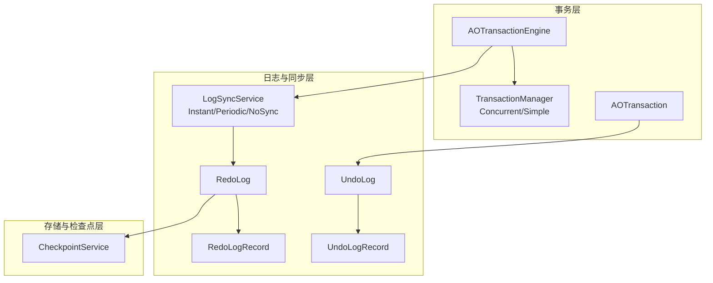
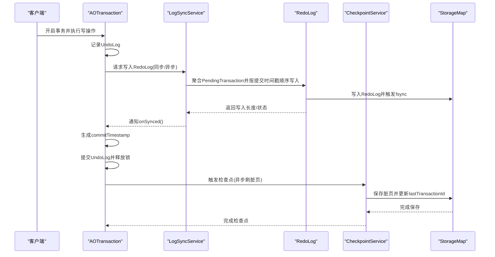
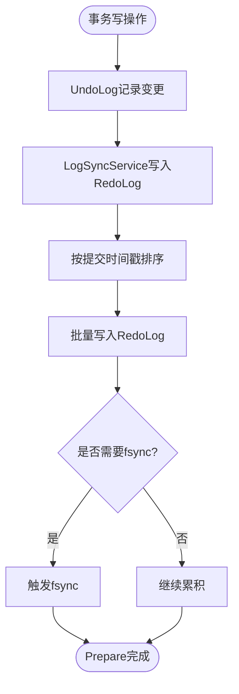
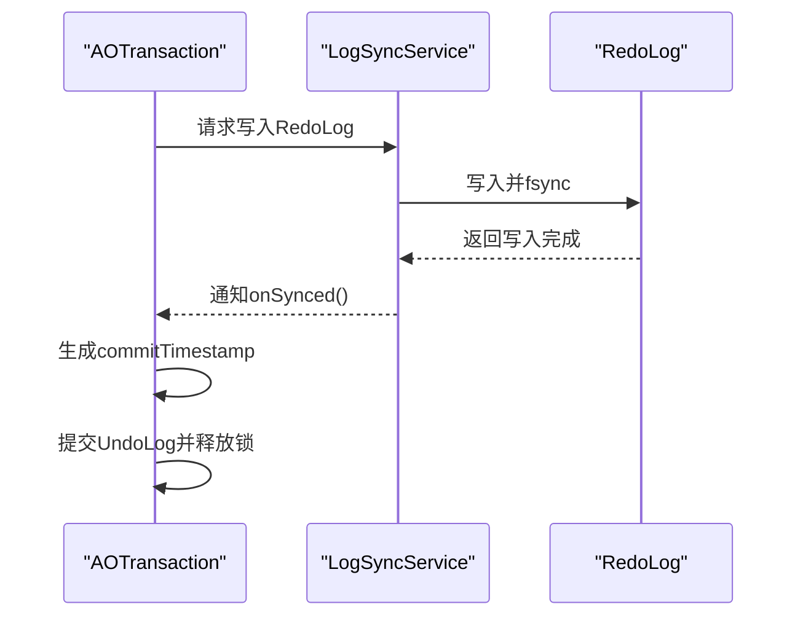
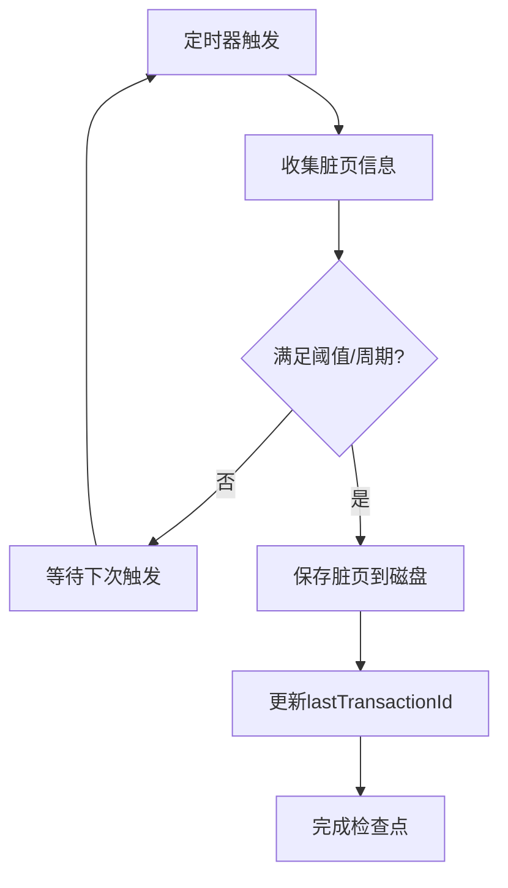
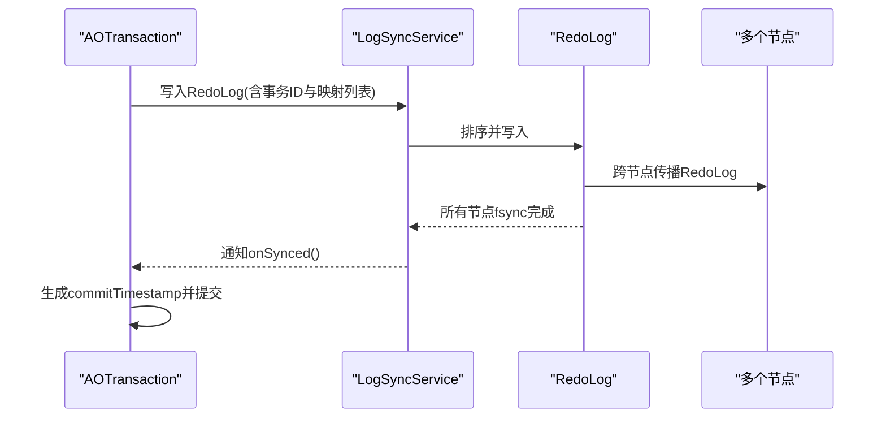
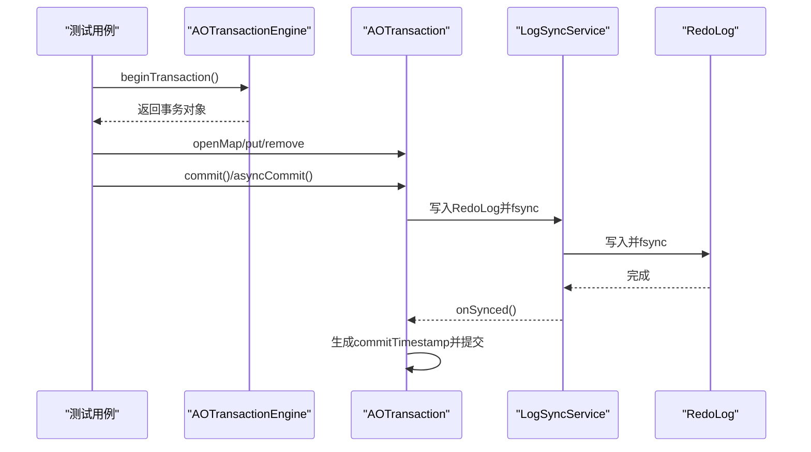
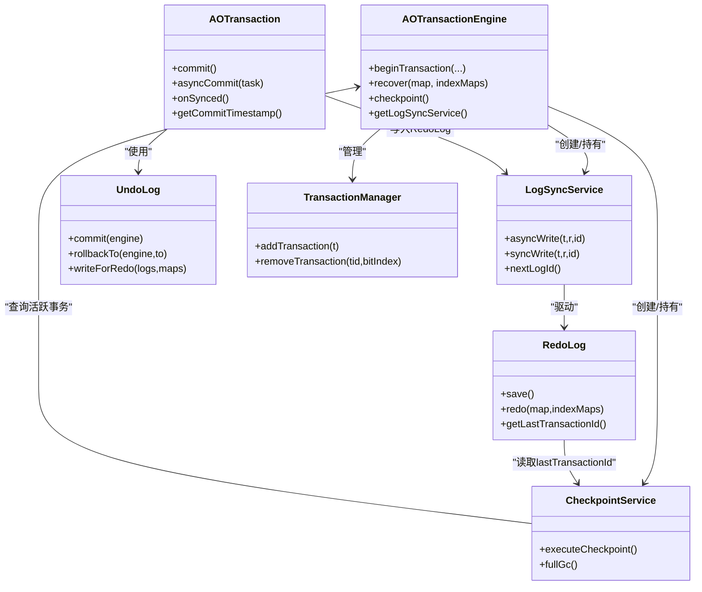

# 两阶段提交

<cite>
**本文引用的文件**
- [AOTransactionEngine.java](https://github.com/lealone/Lealone/blob/master/lealone-aote/src/main/java/com/lealone/transaction/aote/AOTransactionEngine.java)
- [AOTransaction.java](https://github.com/lealone/Lealone/blob/master/lealone-aote/src/main/java/com/lealone/transaction/aote/AOTransaction.java)
- [RedoLog.java](https://github.com/lealone/Lealone/blob/master/lealone-aote/src/main/java/com/lealone/transaction/aote/log/RedoLog.java)
- [LogSyncService.java](https://github.com/lealone/Lealone/blob/master/lealone-aote/src/main/java/com/lealone/transaction/aote/log/LogSyncService.java)
- [CheckpointService.java](https://github.com/lealone/Lealone/blob/master/lealone-aote/src/main/java/com/lealone/transaction/aote/CheckpointService.java)
- [UndoLog.java](https://github.com/lealone/Lealone/blob/master/lealone-aote/src/main/java/com/lealone/transaction/aote/log/UndoLog.java)
- [UndoLogRecord.java](https://github.com/lealone/Lealone/blob/master/lealone-aote/src/main/java/com/lealone/transaction/aote/log/UndoLogRecord.java)
- [RedoLogRecord.java](https://github.com/lealone/Lealone/blob/master/lealone-aote/src/main/java/com/lealone/transaction/aote/log/RedoLogRecord.java)
- [TransactionManager.java](https://github.com/lealone/Lealone/blob/master/lealone-aote/src/main/java/com/lealone/transaction/aote/tm/TransactionManager.java)
- [ConcurrentTransactionManager.java](https://github.com/lealone/Lealone/blob/master/lealone-aote/src/main/java/com/lealone/transaction/aote/tm/ConcurrentTransactionManager.java)
- [SingleThreadTransactionManager.java](https://github.com/lealone/Lealone/blob/master/lealone-aote/src/main/java/com/lealone/transaction/aote/tm/SingleThreadTransactionManager.java)
- [TransactionCommitTest.java](https://github.com/lealone/Lealone/blob/master/lealone-test/src/test/java/com/lealone/test/aote/TransactionCommitTest.java)
</cite>

## 目录
1. [简介](#简介)
2. [项目结构](#项目结构)
3. [核心组件](#核心组件)
4. [架构总览](#架构总览)
5. [详细组件分析](#详细组件分析)
6. [依赖关系分析](#依赖关系分析)
7. [性能考量](#性能考量)
8. [故障排查指南](#故障排查指南)
9. [结论](#结论)
10. [附录](#附录)

## 简介
本文件围绕 Lealone 的两阶段提交（2PC）协议进行深入技术文档化，重点说明：
- Prepare 阶段如何通过 RedoLog 将事务的修改持久化到磁盘，确保即使系统崩溃也能恢复事务状态；
- Commit 阶段如何生成全局唯一的 commitTimestamp，并将其作为事务最终提交的标志；
- CheckpointService 如何与 RedoLog 协同工作，在保证数据持久性的同时，异步地将脏页刷新到磁盘，实现性能与可靠性的平衡；
- 分布式场景下，该两阶段提交协议如何保证跨节点操作的原子性，并通过代码路径示例展示从 Prepare 到 Commit 的完整流程及系统崩溃后的恢复过程。

## 项目结构
与两阶段提交相关的核心模块位于 aote 子模块，主要文件如下：
- 事务引擎与管理：AOTransactionEngine、TransactionManager、ConcurrentTransactionManager、SingleThreadTransactionManager
- 事务对象：AOTransaction
- 日志与同步：LogSyncService（抽象基类及其实现）、RedoLog、RedoLogRecord、UndoLog、UndoLogRecord
- 检查点：CheckpointService
- 测试用例：TransactionCommitTest

图表来源
- [AOTransactionEngine.java](https://github.com/lealone/Lealone/blob/master/lealone-aote/src/main/java/com/lealone/transaction/aote/AOTransactionEngine.java#L1-L120)
- [LogSyncService.java](https://github.com/lealone/Lealone/blob/master/lealone-aote/src/main/java/com/lealone/transaction/aote/log/LogSyncService.java#L1-L120)
- [RedoLog.java](https://github.com/lealone/Lealone/blob/master/lealone-aote/src/main/java/com/lealone/transaction/aote/log/RedoLog.java#L1-L120)
- [UndoLog.java](https://github.com/lealone/Lealone/blob/master/lealone-aote/src/main/java/com/lealone/transaction/aote/log/UndoLog.java#L1-L80)
- [UndoLogRecord.java](https://github.com/lealone/Lealone/blob/master/lealone-aote/src/main/java/com/lealone/transaction/aote/log/UndoLogRecord.java#L1-L80)
- [CheckpointService.java](https://github.com/lealone/Lealone/blob/master/lealone-aote/src/main/java/com/lealone/transaction/aote/CheckpointService.java#L1-L80)

章节来源
- [AOTransactionEngine.java](https://github.com/lealone/Lealone/blob/master/lealone-aote/src/main/java/com/lealone/transaction/aote/AOTransactionEngine.java#L1-L120)
- [LogSyncService.java](https://github.com/lealone/Lealone/blob/master/lealone-aote/src/main/java/com/lealone/transaction/aote/log/LogSyncService.java#L1-L120)
- [RedoLog.java](https://github.com/lealone/Lealone/blob/master/lealone-aote/src/main/java/com/lealone/transaction/aote/log/RedoLog.java#L1-L120)
- [UndoLog.java](https://github.com/lealone/Lealone/blob/master/lealone-aote/src/main/java/com/lealone/transaction/aote/log/UndoLog.java#L1-L80)
- [UndoLogRecord.java](https://github.com/lealone/Lealone/blob/master/lealone-aote/src/main/java/com/lealone/transaction/aote/log/UndoLogRecord.java#L1-L80)
- [CheckpointService.java](https://github.com/lealone/Lealone/blob/master/lealone-aote/src/main/java/com/lealone/transaction/aote/CheckpointService.java#L1-L80)

## 核心组件
- AOTransactionEngine：事务引擎入口，负责初始化、事务生命周期管理、日志同步服务与检查点服务的协调、存储映射注册与恢复。
- AOTransaction：单个事务对象，负责事务的开启、写入 RedoLog、生成 commitTimestamp、最终提交与回滚。
- LogSyncService：日志同步服务抽象，提供三种模式（周期同步、即时同步、无同步），驱动 RedoLog 的写入与 fsync，协调 CheckpointService。
- RedoLog：重做日志写入与恢复，聚合来自多个调度器的待同步事务，按提交时间戳顺序写入并触发 fsync；支持多映射事务的跨节点一致性。
- UndoLog/UndoLogRecord：事务内部的撤销日志，记录每次变更以便回滚；在提交阶段将变更应用到内存并写入 RedoLog。
- CheckpointService：检查点服务，周期性或强制性地将脏页异步刷盘，与 RedoLog 协作以平衡性能与可靠性。
- TransactionManager/ConcurrentTransactionManager/SingleThreadTransactionManager：事务管理器，维护当前活跃事务集合，支持并发与单线程场景。

章节来源
- [AOTransactionEngine.java](https://github.com/lealone/Lealone/blob/master/lealone-aote/src/main/java/com/lealone/transaction/aote/AOTransactionEngine.java#L1-L120)
- [AOTransaction.java](https://github.com/lealone/Lealone/blob/master/lealone-aote/src/main/java/com/lealone/transaction/aote/AOTransaction.java#L200-L320)
- [LogSyncService.java](https://github.com/lealone/Lealone/blob/master/lealone-aote/src/main/java/com/lealone/transaction/aote/log/LogSyncService.java#L1-L120)
- [RedoLog.java](https://github.com/lealone/Lealone/blob/master/lealone-aote/src/main/java/com/lealone/transaction/aote/log/RedoLog.java#L250-L360)
- [UndoLog.java](https://github.com/lealone/Lealone/blob/master/lealone-aote/src/main/java/com/lealone/transaction/aote/log/UndoLog.java#L60-L140)
- [UndoLogRecord.java](https://github.com/lealone/Lealone/blob/master/lealone-aote/src/main/java/com/lealone/transaction/aote/log/UndoLogRecord.java#L50-L170)
- [CheckpointService.java](https://github.com/lealone/Lealone/blob/master/lealone-aote/src/main/java/com/lealone/transaction/aote/CheckpointService.java#L220-L310)
- [TransactionManager.java](https://github.com/lealone/Lealone/blob/master/lealone-aote/src/main/java/com/lealone/transaction/aote/tm/TransactionManager.java#L1-L39)
- [ConcurrentTransactionManager.java](https://github.com/lealone/Lealone/blob/master/lealone-aote/src/main/java/com/lealone/transaction/aote/tm/ConcurrentTransactionManager.java#L1-L49)
- [SingleThreadTransactionManager.java](https://github.com/lealone/Lealone/blob/master/lealone-aote/src/main/java/com/lealone/transaction/aote/tm/SingleThreadTransactionManager.java#L1-L64)

## 架构总览
两阶段提交在 Lealone 中通过“写入 RedoLog（Prepare）+ 生成 commitTimestamp（Commit）+ 检查点刷脏页”的组合实现。整体流程如下：

图表来源
- [AOTransaction.java](https://github.com/lealone/Lealone/blob/master/lealone-aote/src/main/java/com/lealone/transaction/aote/AOTransaction.java#L220-L320)
- [LogSyncService.java](https://github.com/lealone/Lealone/blob/master/lealone-aote/src/main/java/com/lealone/transaction/aote/log/LogSyncService.java#L160-L220)
- [RedoLog.java](https://github.com/lealone/Lealone/blob/master/lealone-aote/src/main/java/com/lealone/transaction/aote/log/RedoLog.java#L270-L360)
- [CheckpointService.java](https://github.com/lealone/Lealone/blob/master/lealone-aote/src/main/java/com/lealone/transaction/aote/CheckpointService.java#L227-L310)

## 详细组件分析

### Prepare 阶段：RedoLog 将事务修改持久化
- 事务写操作通过 UndoLog 记录，随后由 AOTransaction 调用 LogSyncService 写入 RedoLog。
- LogSyncService 将来自不同 InternalScheduler 的 PendingTransaction 按提交时间戳（logId）排序，批量写入 RedoLog 并在必要时触发 fsync。
- RedoLog 将每条 UndoLogRecord 序列化为二进制，写入对应 StorageMap 的 RedoLog 文件，并在周期同步模式下统一 fsync。
- 对于多映射事务，RedoLog 会在记录中包含事务涉及的所有映射名称，确保跨节点一致性。

图表来源
- [AOTransaction.java](https://github.com/lealone/Lealone/blob/master/lealone-aote/src/main/java/com/lealone/transaction/aote/AOTransaction.java#L220-L260)
- [LogSyncService.java](https://github.com/lealone/Lealone/blob/master/lealone-aote/src/main/java/com/lealone/transaction/aote/log/LogSyncService.java#L160-L220)
- [RedoLog.java](https://github.com/lealone/Lealone/blob/master/lealone-aote/src/main/java/com/lealone/transaction/aote/log/RedoLog.java#L270-L360)
- [UndoLog.java](https://github.com/lealone/Lealone/blob/master/lealone-aote/src/main/java/com/lealone/transaction/aote/log/UndoLog.java#L60-L140)
- [UndoLogRecord.java](https://github.com/lealone/Lealone/blob/master/lealone-aote/src/main/java/com/lealone/transaction/aote/log/UndoLogRecord.java#L120-L170)

章节来源
- [AOTransaction.java](https://github.com/lealone/Lealone/blob/master/lealone-aote/src/main/java/com/lealone/transaction/aote/AOTransaction.java#L220-L260)
- [LogSyncService.java](https://github.com/lealone/Lealone/blob/master/lealone-aote/src/main/java/com/lealone/transaction/aote/log/LogSyncService.java#L160-L220)
- [RedoLog.java](https://github.com/lealone/Lealone/blob/master/lealone-aote/src/main/java/com/lealone/transaction/aote/log/RedoLog.java#L270-L360)
- [UndoLog.java](https://github.com/lealone/Lealone/blob/master/lealone-aote/src/main/java/com/lealone/transaction/aote/log/UndoLog.java#L60-L140)
- [UndoLogRecord.java](https://github.com/lealone/Lealone/blob/master/lealone-aote/src/main/java/com/lealone/transaction/aote/log/UndoLogRecord.java#L120-L170)

### Commit 阶段：生成全局唯一的 commitTimestamp
- 在 RedoLog 成功写入并（在需要时）fsync 完成后，AOTransaction 调用 onSynced() 生成 commitTimestamp。
- commitTimestamp 使用事务引擎的自增事务 ID，保证全局唯一且单调递增，作为事务最终提交的标志。
- 随后 AOTransaction 提交 UndoLog，释放锁，完成事务最终提交。

图表来源
- [AOTransaction.java](https://github.com/lealone/Lealone/blob/master/lealone-aote/src/main/java/com/lealone/transaction/aote/AOTransaction.java#L250-L320)
- [LogSyncService.java](https://github.com/lealone/Lealone/blob/master/lealone-aote/src/main/java/com/lealone/transaction/aote/log/LogSyncService.java#L160-L220)
- [RedoLog.java](https://github.com/lealone/Lealone/blob/master/lealone-aote/src/main/java/com/lealone/transaction/aote/log/RedoLog.java#L360-L420)

章节来源
- [AOTransaction.java](https://github.com/lealone/Lealone/blob/master/lealone-aote/src/main/java/com/lealone/transaction/aote/AOTransaction.java#L250-L320)

### CheckpointService 与 RedoLog 协同：异步刷脏页
- CheckpointService 周期性扫描各 StorageMap 的脏页，当满足阈值或周期条件时，异步触发保存。
- 在保存前，CheckpointService 读取 RedoLog 的 lastTransactionId，确保保存的事务边界正确。
- 保存完成后更新 lastTransactionId，避免重复刷脏页。
- 该机制在保证数据持久性的同时，避免频繁 fsync 带来的性能损耗。

图表来源
- [CheckpointService.java](https://github.com/lealone/Lealone/blob/master/lealone-aote/src/main/java/com/lealone/transaction/aote/CheckpointService.java#L227-L310)
- [RedoLog.java](https://github.com/lealone/Lealone/blob/master/lealone-aote/src/main/java/com/lealone/transaction/aote/log/RedoLog.java#L360-L420)

章节来源
- [CheckpointService.java](https://github.com/lealone/Lealone/blob/master/lealone-aote/src/main/java/com/lealone/transaction/aote/CheckpointService.java#L227-L310)
- [RedoLog.java](https://github.com/lealone/Lealone/blob/master/lealone-aote/src/main/java/com/lealone/transaction/aote/log/RedoLog.java#L360-L420)

### 分布式场景下的原子性保障
- 多映射事务在 RedoLog 中记录事务 ID 和涉及的所有映射名称，确保跨节点一致性。
- RedoLog 在写入时按提交时间戳排序，保证跨节点的顺序一致性。
- LogSyncService 的 Periodic 模式在同步周期内允许提前通知异步提交完成，但不会影响最终一致性；NoSync 模式下完全跳过 fsync，适合特定场景。

图表来源
- [RedoLogRecord.java](https://github.com/lealone/Lealone/blob/master/lealone-aote/src/main/java/com/lealone/transaction/aote/log/RedoLogRecord.java#L140-L187)
- [UndoLogRecord.java](https://github.com/lealone/Lealone/blob/master/lealone-aote/src/main/java/com/lealone/transaction/aote/log/UndoLogRecord.java#L120-L170)
- [LogSyncService.java](https://github.com/lealone/Lealone/blob/master/lealone-aote/src/main/java/com/lealone/transaction/aote/log/LogSyncService.java#L220-L320)

章节来源
- [RedoLogRecord.java](https://github.com/lealone/Lealone/blob/master/lealone-aote/src/main/java/com/lealone/transaction/aote/log/RedoLogRecord.java#L140-L187)
- [UndoLogRecord.java](https://github.com/lealone/Lealone/blob/master/lealone-aote/src/main/java/com/lealone/transaction/aote/log/UndoLogRecord.java#L120-L170)
- [LogSyncService.java](https://github.com/lealone/Lealone/blob/master/lealone-aote/src/main/java/com/lealone/transaction/aote/log/LogSyncService.java#L220-L320)

### 从 Prepare 到 Commit 的完整流程与恢复
- 测试用例展示了典型流程：开启事务、写入数据、同步提交（commit）或异步提交（asyncCommit）。
- 恢复流程：引擎在启动时调用 recover，对非内存表执行 RedoLog 重放，重建事务状态。

图表来源
- [TransactionCommitTest.java](https://github.com/lealone/Lealone/blob/master/lealone-test/src/test/java/com/lealone/test/aote/TransactionCommitTest.java#L1-L30)
- [AOTransactionEngine.java](https://github.com/lealone/Lealone/blob/master/lealone-aote/src/main/java/com/lealone/transaction/aote/AOTransactionEngine.java#L245-L266)
- [AOTransaction.java](https://github.com/lealone/Lealone/blob/master/lealone-aote/src/main/java/com/lealone/transaction/aote/AOTransaction.java#L260-L320)
- [LogSyncService.java](https://github.com/lealone/Lealone/blob/master/lealone-aote/src/main/java/com/lealone/transaction/aote/log/LogSyncService.java#L160-L220)
- [RedoLog.java](https://github.com/lealone/Lealone/blob/master/lealone-aote/src/main/java/com/lealone/transaction/aote/log/RedoLog.java#L270-L360)

章节来源
- [TransactionCommitTest.java](https://github.com/lealone/Lealone/blob/master/lealone-test/src/test/java/com/lealone/test/aote/TransactionCommitTest.java#L1-L30)
- [AOTransactionEngine.java](https://github.com/lealone/Lealone/blob/master/lealone-aote/src/main/java/com/lealone/transaction/aote/AOTransactionEngine.java#L245-L266)
- [AOTransaction.java](https://github.com/lealone/Lealone/blob/master/lealone-aote/src/main/java/com/lealone/transaction/aote/AOTransaction.java#L260-L320)
- [LogSyncService.java](https://github.com/lealone/Lealone/blob/master/lealone-aote/src/main/java/com/lealone/transaction/aote/log/LogSyncService.java#L160-L220)
- [RedoLog.java](https://github.com/lealone/Lealone/blob/master/lealone-aote/src/main/java/com/lealone/transaction/aote/log/RedoLog.java#L270-L360)

## 依赖关系分析
- AOTransactionEngine 依赖 LogSyncService、CheckpointService、TransactionManager，负责事务生命周期与存储事件监听。
- AOTransaction 依赖 UndoLog、LogSyncService，负责写入 RedoLog、生成 commitTimestamp、提交与回滚。
- RedoLog 依赖 UndoLog、StorageMap，负责序列化与写入 RedoLog、fsync、跨节点一致性。
- CheckpointService 依赖 LogSyncService、StorageMap，负责脏页统计与保存。
- TransactionManager 提供并发与单线程两种管理模式。

图表来源
- [AOTransactionEngine.java](https://github.com/lealone/Lealone/blob/master/lealone-aote/src/main/java/com/lealone/transaction/aote/AOTransactionEngine.java#L1-L120)
- [AOTransaction.java](https://github.com/lealone/Lealone/blob/master/lealone-aote/src/main/java/com/lealone/transaction/aote/AOTransaction.java#L200-L320)
- [LogSyncService.java](https://github.com/lealone/Lealone/blob/master/lealone-aote/src/main/java/com/lealone/transaction/aote/log/LogSyncService.java#L1-L120)
- [RedoLog.java](https://github.com/lealone/Lealone/blob/master/lealone-aote/src/main/java/com/lealone/transaction/aote/log/RedoLog.java#L1-L120)
- [CheckpointService.java](https://github.com/lealone/Lealone/blob/master/lealone-aote/src/main/java/com/lealone/transaction/aote/CheckpointService.java#L1-L80)
- [UndoLog.java](https://github.com/lealone/Lealone/blob/master/lealone-aote/src/main/java/com/lealone/transaction/aote/log/UndoLog.java#L1-L80)
- [TransactionManager.java](https://github.com/lealone/Lealone/blob/master/lealone-aote/src/main/java/com/lealone/transaction/aote/tm/TransactionManager.java#L1-L39)

章节来源
- [AOTransactionEngine.java](https://github.com/lealone/Lealone/blob/master/lealone-aote/src/main/java/com/lealone/transaction/aote/AOTransactionEngine.java#L1-L120)
- [AOTransaction.java](https://github.com/lealone/Lealone/blob/master/lealone-aote/src/main/java/com/lealone/transaction/aote/AOTransaction.java#L200-L320)
- [LogSyncService.java](https://github.com/lealone/Lealone/blob/master/lealone-aote/src/main/java/com/lealone/transaction/aote/log/LogSyncService.java#L1-L120)
- [RedoLog.java](https://github.com/lealone/Lealone/blob/master/lealone-aote/src/main/java/com/lealone/transaction/aote/log/RedoLog.java#L1-L120)
- [CheckpointService.java](https://github.com/lealone/Lealone/blob/master/lealone-aote/src/main/java/com/lealone/transaction/aote/CheckpointService.java#L1-L80)
- [UndoLog.java](https://github.com/lealone/Lealone/blob/master/lealone-aote/src/main/java/com/lealone/transaction/aote/log/UndoLog.java#L1-L80)
- [TransactionManager.java](https://github.com/lealone/Lealone/blob/master/lealone-aote/src/main/java/com/lealone/transaction/aote/tm/TransactionManager.java#L1-L39)

## 性能考量
- 同步策略：LogSyncService 提供周期同步（Periodic）与即时同步（Instant）两种模式，Periodic 在同步周期内允许提前通知异步提交完成，减少等待；Instant 则在有日志时尽快同步。
- 脏页刷新：CheckpointService 基于脏页内存阈值与周期触发，避免频繁 fsync；同时读取 RedoLog 的 lastTransactionId，确保保存边界正确。
- 多映射事务：RedoLog 在记录中包含事务涉及的所有映射名称，避免跨节点一致性问题带来的额外开销。
- 内存与 GC：CheckpointService 在运行期间执行 GC 任务与 fullGc，结合内存监控，降低内存压力。

[本节为通用性能讨论，不直接分析具体文件]

## 故障排查指南
- RedoLog 写入失败：检查 LogSyncService 的 run 循环与 sync 方法调用，确认异常日志输出。
- 检查点保存失败：查看 CheckpointService.executeCheckpoint 的异常捕获与日志输出。
- 事务未生成 commitTimestamp：确认 AOTransaction.onSynced 是否在 RedoLog fsync 完成后调用。
- 恢复不一致：检查 AOTransactionEngine.recover 是否对非内存表执行 RedoLog.redo，并确认映射名称与事务 ID 校验逻辑。

章节来源
- [LogSyncService.java](https://github.com/lealone/Lealone/blob/master/lealone-aote/src/main/java/com/lealone/transaction/aote/log/LogSyncService.java#L110-L170)
- [CheckpointService.java](https://github.com/lealone/Lealone/blob/master/lealone-aote/src/main/java/com/lealone/transaction/aote/CheckpointService.java#L227-L310)
- [AOTransaction.java](https://github.com/lealone/Lealone/blob/master/lealone-aote/src/main/java/com/lealone/transaction/aote/AOTransaction.java#L250-L320)
- [AOTransactionEngine.java](https://github.com/lealone/Lealone/blob/master/lealone-aote/src/main/java/com/lealone/transaction/aote/AOTransactionEngine.java#L245-L266)
- [RedoLog.java](https://github.com/lealone/Lealone/blob/master/lealone-aote/src/main/java/com/lealone/transaction/aote/log/RedoLog.java#L136-L190)

## 结论
Lealone 的两阶段提交通过“写入 RedoLog + 生成 commitTimestamp + 异步检查点”实现了高可靠与高性能的平衡。Prepare 阶段确保事务修改持久化，Commit 阶段以全局唯一的时间戳标记最终提交，CheckpointService 在不牺牲持久性的前提下异步刷新脏页。分布式场景下，多映射事务与 RedoLog 的跨节点一致性设计进一步保障了原子性与顺序性。

[本节为总结性内容，不直接分析具体文件]

## 附录
- 关键流程参考路径
  - 事务提交：[AOTransaction.java](https://github.com/lealone/Lealone/blob/master/lealone-aote/src/main/java/com/lealone/transaction/aote/AOTransaction.java#L260-L320)
  - RedoLog 写入与 fsync：[RedoLog.java](https://github.com/lealone/Lealone/blob/master/lealone-aote/src/main/java/com/lealone/transaction/aote/log/RedoLog.java#L270-L360)
  - 日志同步服务循环：[LogSyncService.java](https://github.com/lealone/Lealone/blob/master/lealone-aote/src/main/java/com/lealone/transaction/aote/log/LogSyncService.java#L110-L170)
  - 检查点保存脏页：[CheckpointService.java](https://github.com/lealone/Lealone/blob/master/lealone-aote/src/main/java/com/lealone/transaction/aote/CheckpointService.java#L227-L310)
  - 恢复流程：[AOTransactionEngine.java](https://github.com/lealone/Lealone/blob/master/lealone-aote/src/main/java/com/lealone/transaction/aote/AOTransactionEngine.java#L245-L266)
  - 测试用例：[TransactionCommitTest.java](https://github.com/lealone/Lealone/blob/master/lealone-test/src/test/java/com/lealone/test/aote/TransactionCommitTest.java#L1-L30)