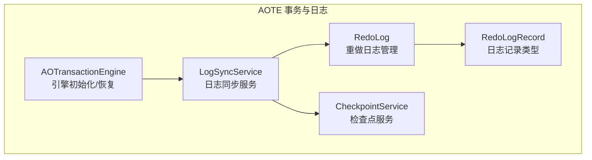
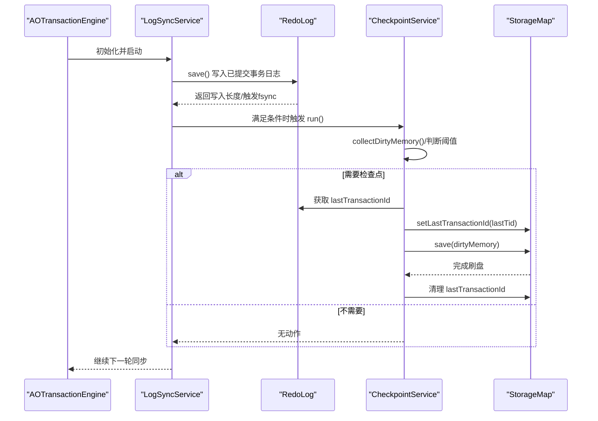
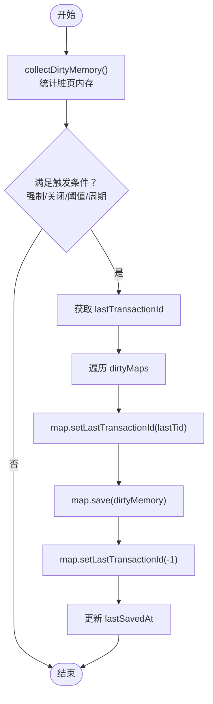
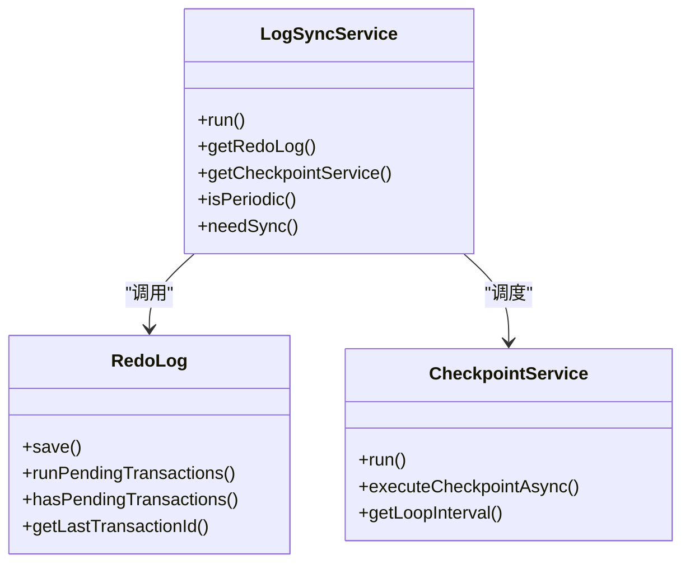
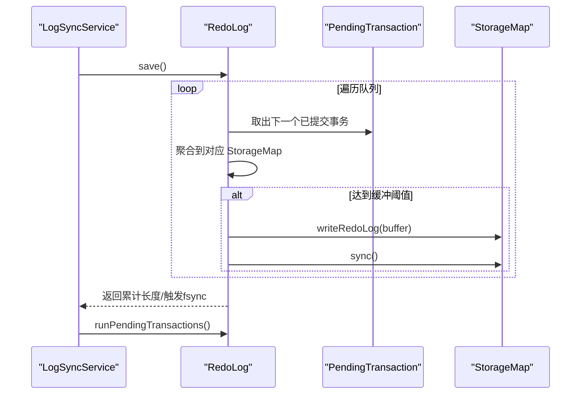
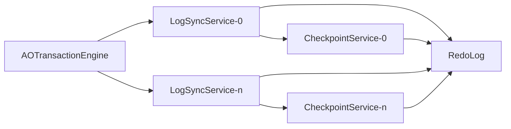

# 检查点协调机制

**本文引用的文件列表**
- [CheckpointService.java](https://github.com/lealone/Lealone/blob/master/lealone-aote/src/main/java/com/lealone/transaction/aote/CheckpointService.java)
- [LogSyncService.java](https://github.com/lealone/Lealone/blob/master/lealone-aote/src/main/java/com/lealone/transaction/aote/log/LogSyncService.java)
- [RedoLog.java](https://github.com/lealone/Lealone/blob/master/lealone-aote/src/main/java/com/lealone/transaction/aote/log/RedoLog.java)
- [AOTransactionEngine.java](https://github.com/lealone/Lealone/blob/master/lealone-aote/src/main/java/com/lealone/transaction/aote/AOTransactionEngine.java)
- [RedoLogRecord.java](https://github.com/lealone/Lealone/blob/master/lealone-aote/src/main/java/com/lealone/transaction/aote/log/RedoLogRecord.java)
- [TransactionEngineTest.java](https://github.com/lealone/Lealone/blob/master/lealone-test/src/test/java/com/lealone/test/aote/TransactionEngineTest.java)

## 目录
1. [简介](#简介)
2. [项目结构](#项目结构)
3. [核心组件](#核心组件)
4. [架构总览](#架构总览)
5. [组件详解](#组件详解)
6. [依赖关系分析](#依赖关系分析)
7. [性能考量](#性能考量)
8. [故障排查指南](#故障排查指南)
9. [结论](#结论)

## 简介
本文件系统性阐述 Lealone AOTE 存储引擎中的“检查点协调机制”。重点说明 CheckpointService 如何与 RedoLog 协同工作，通过定期创建检查点来清理已提交事务的日志，从而显著缩短系统恢复时间；解释检查点触发条件（脏页内存阈值与固定时间间隔）；描述在检查点过程中如何确保所有与已提交事务相关的脏页被安全刷新到持久化存储；并通过流程图与代码片段路径，展示从检查点启动、脏页刷新到日志处理的完整生命周期，突出其在平衡系统性能与数据安全性方面的设计考量。

## 项目结构
围绕检查点协调机制的关键模块位于 lealone-aote 模块：
- 事务与日志同步服务：LogSyncService
- 重做日志管理：RedoLog
- 检查点服务：CheckpointService
- 引擎入口与初始化：AOTransactionEngine
- 日志记录类型：RedoLogRecord
- 测试用例：TransactionEngineTest

图表来源
- [AOTransactionEngine.java](https://github.com/lealone/Lealone/blob/master/lealone-aote/src/main/java/com/lealone/transaction/aote/AOTransactionEngine.java#L267-L310)
- [LogSyncService.java](https://github.com/lealone/Lealone/blob/master/lealone-aote/src/main/java/com/lealone/transaction/aote/log/LogSyncService.java#L1-L120)
- [RedoLog.java](https://github.com/lealone/Lealone/blob/master/lealone-aote/src/main/java/com/lealone/transaction/aote/log/RedoLog.java#L1-L120)
- [CheckpointService.java](https://github.com/lealone/Lealone/blob/master/lealone-aote/src/main/java/com/lealone/transaction/aote/CheckpointService.java#L1-L120)
- [RedoLogRecord.java](https://github.com/lealone/Lealone/blob/master/lealone-aote/src/main/java/com/lealone/transaction/aote/log/RedoLogRecord.java#L37-L86)

章节来源
- [AOTransactionEngine.java](https://github.com/lealone/Lealone/blob/master/lealone-aote/src/main/java/com/lealone/transaction/aote/AOTransactionEngine.java#L267-L310)
- [LogSyncService.java](https://github.com/lealone/Lealone/blob/master/lealone-aote/src/main/java/com/lealone/transaction/aote/log/LogSyncService.java#L1-L120)
- [RedoLog.java](https://github.com/lealone/Lealone/blob/master/lealone-aote/src/main/java/com/lealone/transaction/aote/log/RedoLog.java#L1-L120)
- [CheckpointService.java](https://github.com/lealone/Lealone/blob/master/lealone-aote/src/main/java/com/lealone/transaction/aote/CheckpointService.java#L1-L120)
- [RedoLogRecord.java](https://github.com/lealone/Lealone/blob/master/lealone-aote/src/main/java/com/lealone/transaction/aote/log/RedoLogRecord.java#L37-L86)

## 核心组件
- CheckpointService：负责周期性或强制性的检查点触发，收集脏页内存统计，决定是否需要执行刷盘，并在执行期间设置与已提交事务相关的 LastTransactionId，确保后续日志截断与恢复正确。
- LogSyncService：抽象的日志同步服务，封装周期性/即时/无同步三种模式，驱动 RedoLog.save() 将已提交事务的日志落盘并进行必要的 fsync，同时协调检查点执行时机。
- RedoLog：管理重做日志的写入、聚合、刷盘与 fsync，维护 pendingTransactions 链表以支持多服务实例下的事务一致性，提供 redo() 用于恢复。
- AOTransactionEngine：引擎初始化入口，负责创建并启动多个 LogSyncService 实例，绑定各自的 CheckpointService，并在关闭时触发检查点以保证数据安全。
- RedoLogRecord：日志记录基类及兼容实现，包含 CheckpointRLR 等类型，用于兼容历史版本的检查点标记。

章节来源
- [CheckpointService.java](https://github.com/lealone/Lealone/blob/master/lealone-aote/src/main/java/com/lealone/transaction/aote/CheckpointService.java#L1-L120)
- [LogSyncService.java](https://github.com/lealone/Lealone/blob/master/lealone-aote/src/main/java/com/lealone/transaction/aote/log/LogSyncService.java#L1-L120)
- [RedoLog.java](https://github.com/lealone/Lealone/blob/master/lealone-aote/src/main/java/com/lealone/transaction/aote/log/RedoLog.java#L1-L120)
- [AOTransactionEngine.java](https://github.com/lealone/Lealone/blob/master/lealone-aote/src/main/java/com/lealone/transaction/aote/AOTransactionEngine.java#L267-L310)
- [RedoLogRecord.java](https://github.com/lealone/Lealone/blob/master/lealone-aote/src/main/java/com/lealone/transaction/aote/log/RedoLogRecord.java#L37-L86)

## 架构总览
检查点协调机制围绕“日志同步服务”与“检查点服务”的协作展开：LogSyncService 在运行循环中调用 RedoLog.save() 将已提交事务写入持久化存储并进行必要同步；当满足检查点触发条件时，LogSyncService 触发 CheckpointService.run()，后者根据脏页内存与时间阈值决定是否执行刷盘；在执行过程中，CheckpointService 会设置 StorageMap 的 LastTransactionId，确保后续日志截断与恢复正确。

图表来源
- [AOTransactionEngine.java](https://github.com/lealone/Lealone/blob/master/lealone-aote/src/main/java/com/lealone/transaction/aote/AOTransactionEngine.java#L267-L310)
- [LogSyncService.java](https://github.com/lealone/Lealone/blob/master/lealone-aote/src/main/java/com/lealone/transaction/aote/log/LogSyncService.java#L111-L160)
- [RedoLog.java](https://github.com/lealone/Lealone/blob/master/lealone-aote/src/main/java/com/lealone/transaction/aote/log/RedoLog.java#L271-L363)
- [CheckpointService.java](https://github.com/lealone/Lealone/blob/master/lealone-aote/src/main/java/com/lealone/transaction/aote/CheckpointService.java#L227-L269)

## 组件详解

### CheckpointService：检查点触发与脏页刷新
- 触发条件
  - 强制触发：外部通过 executeCheckpointAsync() 添加任务队列，由 CheckpointService.run() 逐个执行。
  - 关闭触发：引擎关闭时，会向所有 LogSyncService 请求执行检查点。
  - 脏页内存阈值：collectDirtyMemory() 统计各 StorageMap 的脏页内存，若 total 超过配置的 dirty_page_cache_size_in_mb，则触发。
  - 时间周期：lastSavedAt + checkpoint_period 超过当前时间则触发。
- 脏页刷新流程
  - 在执行前，先收集脏页内存并清空 dirtyMaps。
  - 若满足任一触发条件，遍历 dirtyMaps，对每个 StorageMap 设置 LastTransactionId，调用 map.save(dirtyMemory)，完成后清除该标志。
  - 更新 lastSavedAt，避免短时间内重复触发。
- 与 RedoLog 的交互
  - 在执行前通过 LogSyncService.getRedoLog().getLastTransactionId() 获取最后一个已提交事务ID，作为“已提交事务边界”，用于后续日志处理与恢复。

图表来源
- [CheckpointService.java](https://github.com/lealone/Lealone/blob/master/lealone-aote/src/main/java/com/lealone/transaction/aote/CheckpointService.java#L227-L269)

章节来源
- [CheckpointService.java](https://github.com/lealone/Lealone/blob/master/lealone-aote/src/main/java/com/lealone/transaction/aote/CheckpointService.java#L34-L116)
- [CheckpointService.java](https://github.com/lealone/Lealone/blob/master/lealone-aote/src/main/java/com/lealone/transaction/aote/CheckpointService.java#L227-L269)
- [AOTransactionEngine.java](https://github.com/lealone/Lealone/blob/master/lealone-aote/src/main/java/com/lealone/transaction/aote/AOTransactionEngine.java#L166-L190)

### LogSyncService：日志同步与检查点调度
- 运行循环
  - 每轮循环调用 RedoLog.save() 将已提交事务写入持久化存储并进行必要同步。
  - 根据同步策略（周期/即时/无同步）决定是否立即继续同步或等待。
  - 在每次循环末尾，检查是否需要执行 CheckpointService.run()，并在满足条件时执行。
- 同步策略
  - Periodic：周期性同步，若队列长度超过阈值或在同步周期内未滞后，则可提前通知事务完成。
  - Instant：只要有日志就立即同步。
  - NoSync：不进行 fsync，适合特殊场景。
- 与 RedoLog 的交互
  - RedoLog.save() 会聚合 PendingTransaction 并按服务索引写入对应 StorageMap 的重做日志，必要时触发 fsync。
  - RedoLog.runPendingTransactions() 用于处理跨服务实例的多映射事务，确保所有映射均完成同步后才允许后续处理。

图表来源
- [LogSyncService.java](https://github.com/lealone/Lealone/blob/master/lealone-aote/src/main/java/com/lealone/transaction/aote/log/LogSyncService.java#L111-L160)
- [RedoLog.java](https://github.com/lealone/Lealone/blob/master/lealone-aote/src/main/java/com/lealone/transaction/aote/log/RedoLog.java#L271-L363)
- [CheckpointService.java](https://github.com/lealone/Lealone/blob/master/lealone-aote/src/main/java/com/lealone/transaction/aote/CheckpointService.java#L114-L129)

章节来源
- [LogSyncService.java](https://github.com/lealone/Lealone/blob/master/lealone-aote/src/main/java/com/lealone/transaction/aote/log/LogSyncService.java#L111-L160)
- [LogSyncService.java](https://github.com/lealone/Lealone/blob/master/lealone-aote/src/main/java/com/lealone/transaction/aote/log/LogSyncService.java#L161-L185)
- [RedoLog.java](https://github.com/lealone/Lealone/blob/master/lealone-aote/src/main/java/com/lealone/transaction/aote/log/RedoLog.java#L271-L363)

### RedoLog：重做日志写入与恢复
- 写入流程
  - RedoLog.save() 从各 InternalScheduler 的 PendingTransaction 队列中取出已提交事务，按服务索引聚合到对应 StorageMap 的 DataBuffer 中，累积到一定大小后写入并触发 fsync。
  - 对于跨服务实例的多映射事务，使用 LinkableList 维护 pendingTransactions，直到所有映射均完成同步。
- 恢复流程
  - AOTransactionEngine.recover() 调用 RedoLog.redo()，先处理旧版全局 redo log，再读取当前映射的 redo 日志，重放已提交事务，确保数据一致性。
- 检查点兼容
  - RedoLogRecord 中包含 CheckpointRLR 类型，用于兼容历史版本的检查点标记，触发时会清空旧的 pendingRedoLog。

图表来源
- [RedoLog.java](https://github.com/lealone/Lealone/blob/master/lealone-aote/src/main/java/com/lealone/transaction/aote/log/RedoLog.java#L271-L363)
- [AOTransactionEngine.java](https://github.com/lealone/Lealone/blob/master/lealone-aote/src/main/java/com/lealone/transaction/aote/AOTransactionEngine.java#L254-L260)
- [RedoLogRecord.java](https://github.com/lealone/Lealone/blob/master/lealone-aote/src/main/java/com/lealone/transaction/aote/log/RedoLogRecord.java#L62-L78)

章节来源
- [RedoLog.java](https://github.com/lealone/Lealone/blob/master/lealone-aote/src/main/java/com/lealone/transaction/aote/log/RedoLog.java#L136-L190)
- [RedoLog.java](https://github.com/lealone/Lealone/blob/master/lealone-aote/src/main/java/com/lealone/transaction/aote/log/RedoLog.java#L271-L363)
- [RedoLogRecord.java](https://github.com/lealone/Lealone/blob/master/lealone-aote/src/main/java/com/lealone/transaction/aote/log/RedoLogRecord.java#L62-L78)

### 触发条件与配置
- 触发条件
  - 强制触发：executeCheckpointAsync() 添加任务，由 CheckpointService.run() 执行。
  - 关闭触发：引擎关闭时，向所有 LogSyncService 请求执行检查点。
  - 脏页内存阈值：dirty_page_cache_size_in_mb（默认 32MB），超过阈值触发。
  - 时间周期：checkpoint_period（默认 1 小时），超过周期触发。
  - 循环间隔：checkpoint_service_loop_interval（默认 3 秒），用于控制检查点调度频率。
- 配置来源
  - CheckpointService 构造函数读取上述参数并设置内部阈值。
  - LogSyncService.run() 在每轮循环末尾检查是否需要执行 CheckpointService.run()。

章节来源
- [CheckpointService.java](https://github.com/lealone/Lealone/blob/master/lealone-aote/src/main/java/com/lealone/transaction/aote/CheckpointService.java#L46-L63)
- [LogSyncService.java](https://github.com/lealone/Lealone/blob/master/lealone-aote/src/main/java/com/lealone/transaction/aote/log/LogSyncService.java#L111-L160)

### 数据安全与恢复
- 已提交事务边界
  - CheckpointService 在执行前通过 RedoLog.getLastTransactionId() 获取最后一个已提交事务ID，并在执行期间设置 StorageMap 的 LastTransactionId，确保后续日志处理与恢复基于“已提交事务边界”进行。
- 恢复流程
  - AOTransactionEngine.recover() 调用 RedoLog.redo()，先处理旧版全局 redo log，再读取当前映射的 redo 日志，重放已提交事务，确保数据一致性。
- 检查点兼容
  - RedoLogRecord 中的 CheckpointRLR 类型用于兼容历史版本的检查点标记，触发时会清空旧的 pendingRedoLog，避免冗余日志影响恢复。

章节来源
- [CheckpointService.java](https://github.com/lealone/Lealone/blob/master/lealone-aote/src/main/java/com/lealone/transaction/aote/CheckpointService.java#L249-L260)
- [AOTransactionEngine.java](https://github.com/lealone/Lealone/blob/master/lealone-aote/src/main/java/com/lealone/transaction/aote/AOTransactionEngine.java#L254-L260)
- [RedoLog.java](https://github.com/lealone/Lealone/blob/master/lealone-aote/src/main/java/com/lealone/transaction/aote/log/RedoLog.java#L136-L190)
- [RedoLogRecord.java](https://github.com/lealone/Lealone/blob/master/lealone-aote/src/main/java/com/lealone/transaction/aote/log/RedoLogRecord.java#L62-L78)

## 依赖关系分析
- AOTransactionEngine 初始化多个 LogSyncService 实例，并为每个实例绑定独立的 CheckpointService。
- LogSyncService 依赖 RedoLog 进行日志写入与 fsync，同时在运行循环中调度 CheckpointService。
- CheckpointService 依赖 LogSyncService 获取 RedoLog 的 lastTransactionId，并对 StorageMap 进行 save() 刷新脏页。
- RedoLog 依赖 StorageMap 的 writeRedoLog/sync 以及 LinkableList 维护跨服务实例的事务一致性。

图表来源
- [AOTransactionEngine.java](https://github.com/lealone/Lealone/blob/master/lealone-aote/src/main/java/com/lealone/transaction/aote/AOTransactionEngine.java#L284-L310)
- [LogSyncService.java](https://github.com/lealone/Lealone/blob/master/lealone-aote/src/main/java/com/lealone/transaction/aote/log/LogSyncService.java#L111-L160)
- [CheckpointService.java](https://github.com/lealone/Lealone/blob/master/lealone-aote/src/main/java/com/lealone/transaction/aote/CheckpointService.java#L227-L269)

章节来源
- [AOTransactionEngine.java](https://github.com/lealone/Lealone/blob/master/lealone-aote/src/main/java/com/lealone/transaction/aote/AOTransactionEngine.java#L284-L310)
- [LogSyncService.java](https://github.com/lealone/Lealone/blob/master/lealone-aote/src/main/java/com/lealone/transaction/aote/log/LogSyncService.java#L111-L160)
- [CheckpointService.java](https://github.com/lealone/Lealone/blob/master/lealone-aote/src/main/java/com/lealone/transaction/aote/CheckpointService.java#L227-L269)

## 性能考量
- 同步策略选择
  - Periodic：适合高吞吐场景，通过周期性同步与阈值触发减少 fsync 次数，提升吞吐量。
  - Instant：适合强一致场景，实时同步，降低延迟但增加磁盘写放大。
  - NoSync：极端场景下牺牲持久性换取最高吞吐，需谨慎使用。
- 脏页内存阈值与时间周期
  - 通过 dirty_page_cache_size_in_mb 与 checkpoint_period 控制检查点频率，避免频繁刷盘影响性能。
  - checkpoint_service_loop_interval 控制检查点调度频率，避免过度唤醒。
- 多服务实例与跨映射事务
  - LogSyncService 使用 LinkableList 维护 pendingTransactions，确保多映射事务在所有映射均完成同步后才允许后续处理，避免部分映射未落盘导致的数据不一致。

章节来源
- [LogSyncService.java](https://github.com/lealone/Lealone/blob/master/lealone-aote/src/main/java/com/lealone/transaction/aote/log/LogSyncService.java#L111-L160)
- [RedoLog.java](https://github.com/lealone/Lealone/blob/master/lealone-aote/src/main/java/com/lealone/transaction/aote/log/RedoLog.java#L316-L363)
- [CheckpointService.java](https://github.com/lealone/Lealone/blob/master/lealone-aote/src/main/java/com/lealone/transaction/aote/CheckpointService.java#L46-L63)

## 故障排查指南
- 检查点未触发
  - 确认 dirty_page_cache_size_in_mb 与 checkpoint_period 配置是否合理，观察 collectDirtyMemory() 是否持续增长。
  - 检查 LogSyncService.run() 是否在运行，以及是否满足 checkpoint_service_loop_interval 条件。
- 检查点执行失败
  - 查看 CheckpointService.executeCheckpoint() 异常日志，确认 StorageMap.save() 是否抛错。
  - 检查引擎关闭流程是否触发 executeCheckpointAsync()。
- 恢复异常
  - 确认 RedoLog.redo() 是否正确读取并重放日志，特别是旧版全局 redo log 的处理。
  - 检查 CheckpointRLR 类型是否正确清空 pendingRedoLog，避免冗余日志影响恢复。

章节来源
- [CheckpointService.java](https://github.com/lealone/Lealone/blob/master/lealone-aote/src/main/java/com/lealone/transaction/aote/CheckpointService.java#L227-L269)
- [AOTransactionEngine.java](https://github.com/lealone/Lealone/blob/master/lealone-aote/src/main/java/com/lealone/transaction/aote/AOTransactionEngine.java#L166-L190)
- [RedoLog.java](https://github.com/lealone/Lealone/blob/master/lealone-aote/src/main/java/com/lealone/transaction/aote/log/RedoLog.java#L136-L190)
- [RedoLogRecord.java](https://github.com/lealone/Lealone/blob/master/lealone-aote/src/main/java/com/lealone/transaction/aote/log/RedoLogRecord.java#L62-L78)

## 结论
Lealone 的检查点协调机制通过 CheckpointService 与 LogSyncService 的紧密配合，实现了“按需触发 + 定期刷新”的平衡策略：在满足脏页内存阈值或时间周期时触发检查点，确保已提交事务的脏页被安全刷新到持久化存储；通过 RedoLog.save() 的聚合写入与 fsync，以及 RedoLog.redo() 的恢复流程，有效缩短系统恢复时间并保障数据一致性。该机制在性能与安全性之间取得良好折中，适用于多种部署场景。