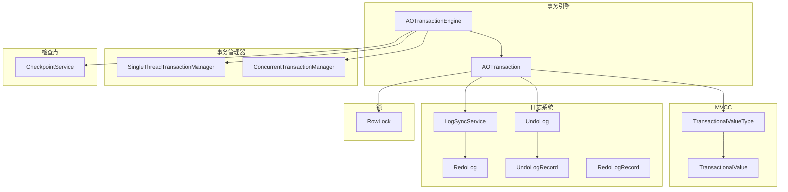
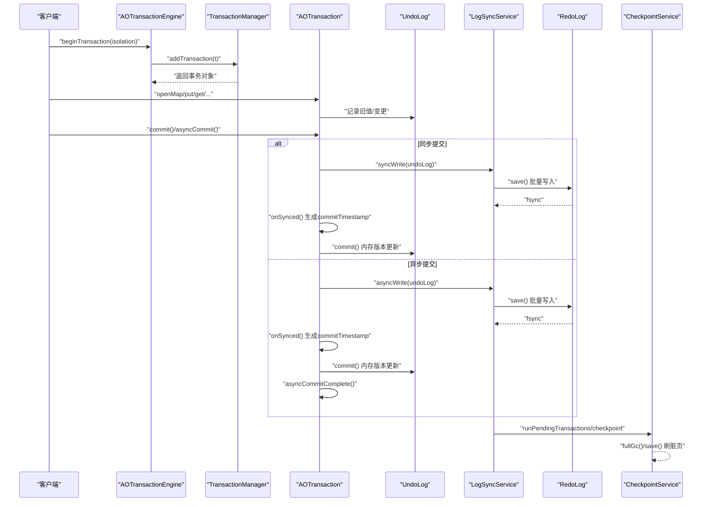
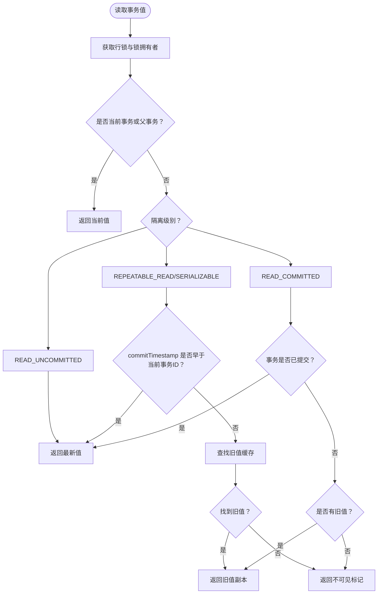
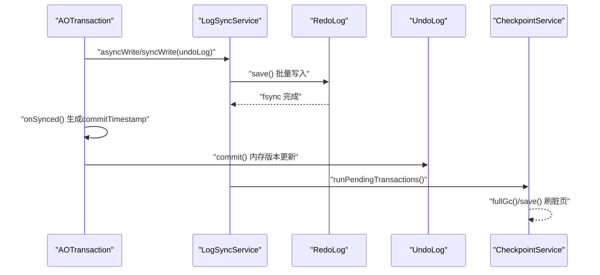
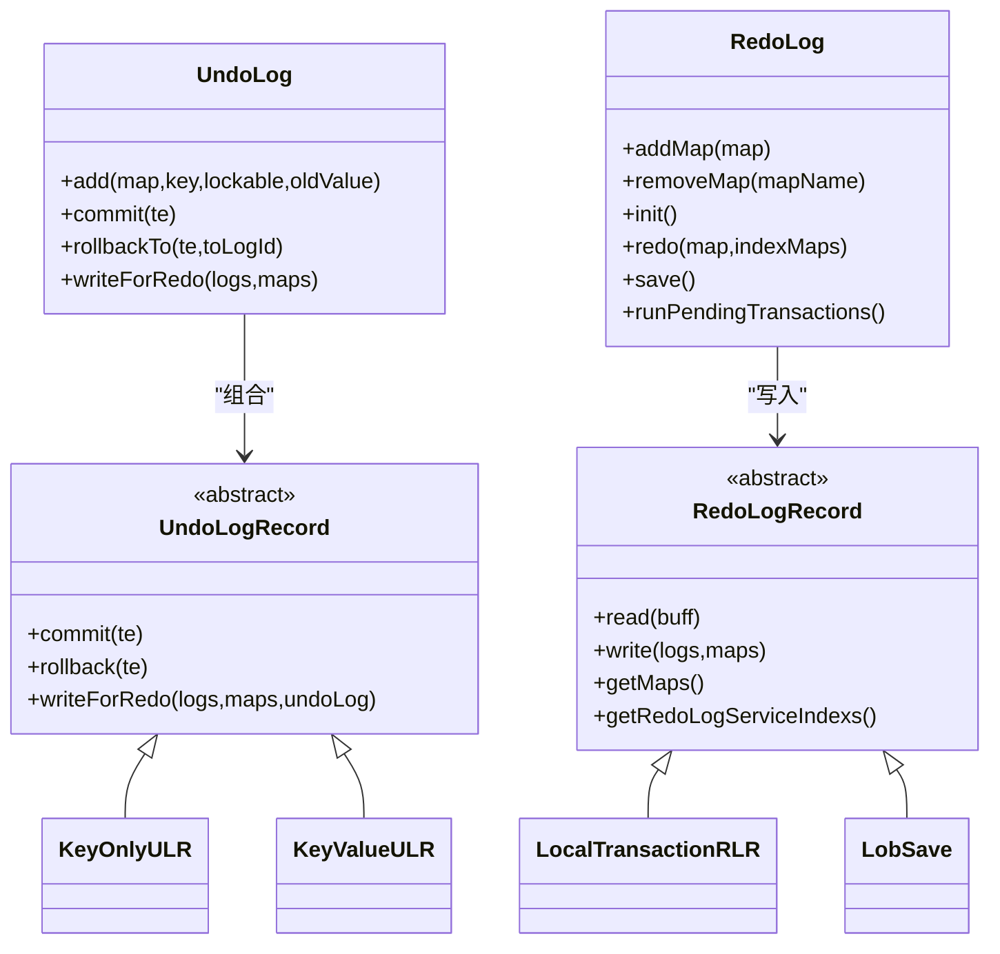
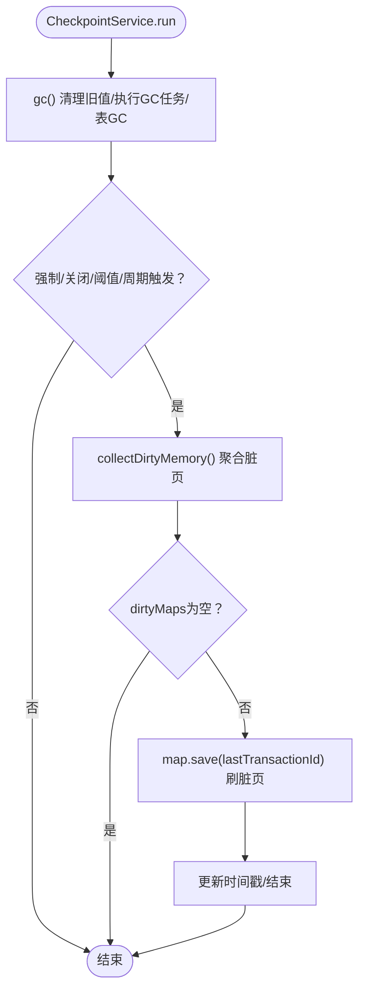
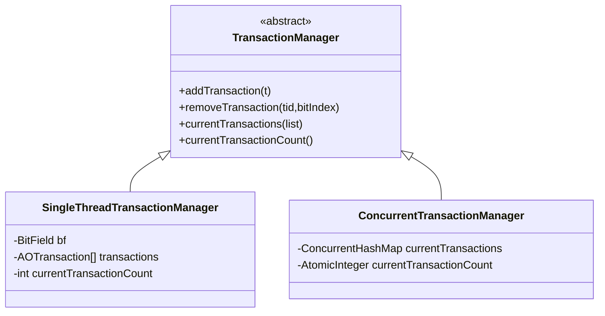
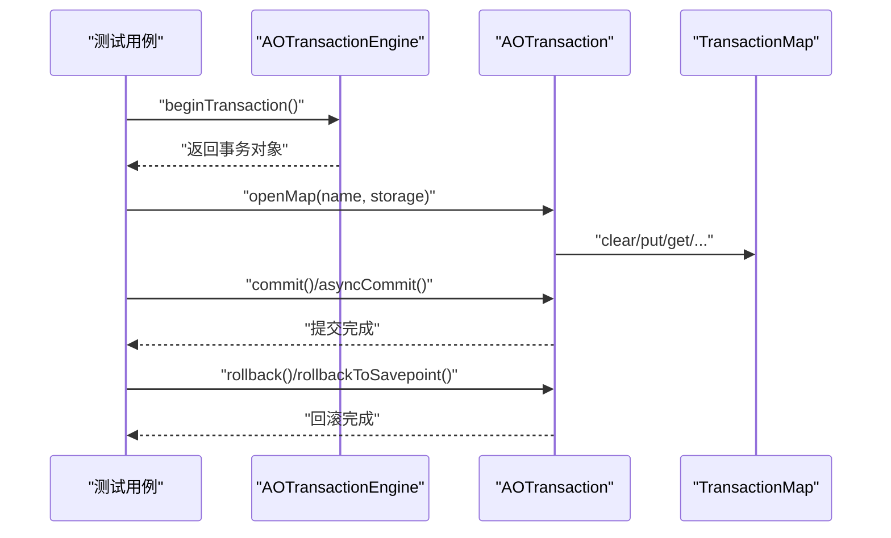
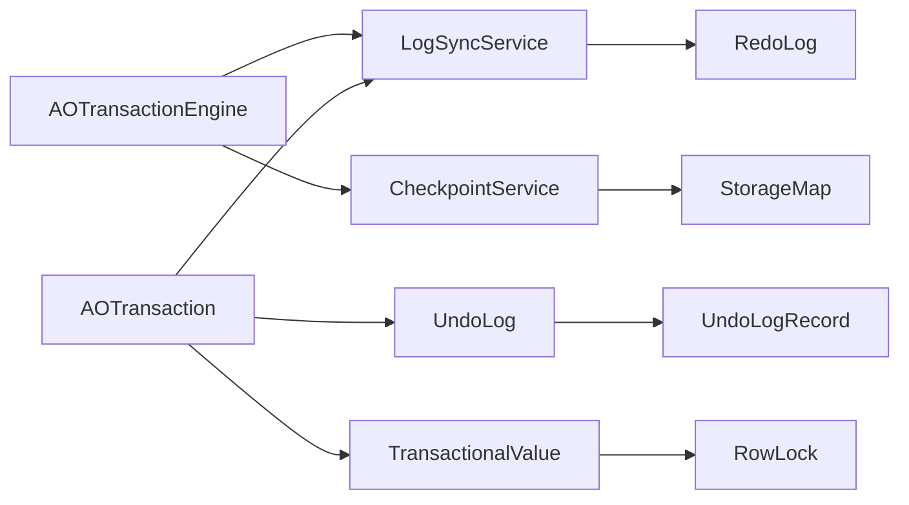

# 事务引擎

<cite>
**本文引用的文件**
- [AOTransactionEngine.java](https://github.com/lealone/Lealone/blob/master/lealone-aote/src/main/java/com/lealone/transaction/aote/AOTransactionEngine.java)
- [AOTransaction.java](https://github.com/lealone/Lealone/blob/master/lealone-aote/src/main/java/com/lealone/transaction/aote/AOTransaction.java)
- [TransactionalValue.java](https://github.com/lealone/Lealone/blob/master/lealone-aote/src/main/java/com/lealone/transaction/aote/TransactionalValue.java)
- [TransactionalValueType.java](https://github.com/lealone/Lealone/blob/master/lealone-aote/src/main/java/com/lealone/transaction/aote/TransactionalValueType.java)
- [SingleThreadTransactionManager.java](https://github.com/lealone/Lealone/blob/master/lealone-aote/src/main/java/com/lealone/transaction/aote/tm/SingleThreadTransactionManager.java)
- [ConcurrentTransactionManager.java](https://github.com/lealone/Lealone/blob/master/lealone-aote/src/main/java/com/lealone/transaction/aote/tm/ConcurrentTransactionManager.java)
- [LogSyncService.java](https://github.com/lealone/Lealone/blob/master/lealone-aote/src/main/java/com/lealone/transaction/aote/log/LogSyncService.java)
- [RedoLog.java](https://github.com/lealone/Lealone/blob/master/lealone-aote/src/main/java/com/lealone/transaction/aote/log/RedoLog.java)
- [UndoLog.java](https://github.com/lealone/Lealone/blob/master/lealone-aote/src/main/java/com/lealone/transaction/aote/log/UndoLog.java)
- [UndoLogRecord.java](https://github.com/lealone/Lealone/blob/master/lealone-aote/src/main/java/com/lealone/transaction/aote/log/UndoLogRecord.java)
- [RedoLogRecord.java](https://github.com/lealone/Lealone/blob/master/lealone-aote/src/main/java/com/lealone/transaction/aote/log/RedoLogRecord.java)
- [CheckpointService.java](https://github.com/lealone/Lealone/blob/master/lealone-aote/src/main/java/com/lealone/transaction/aote/CheckpointService.java)
- [RowLock.java](https://github.com/lealone/Lealone/blob/master/lealone-aote/src/main/java/com/lealone/transaction/aote/lock/RowLock.java)
- [TransactionalValueTest.java](https://github.com/lealone/Lealone/blob/master/lealone-test/src/test/java/com/lealone/test/aote/TransactionalValueTest.java)
- [TransactionTest.java](https://github.com/lealone/Lealone/blob/master/lealone-test/src/test/java/com/lealone/test/aote/TransactionTest.java)
</cite>

## 目录
1. [简介](#简介)
2. [项目结构](#项目结构)
3. [核心组件](#核心组件)
4. [架构总览](#架构总览)
5. [详细组件分析](#详细组件分析)
6. [依赖关系分析](#依赖关系分析)
7. [性能考量](#性能考量)
8. [故障排查指南](#故障排查指南)
9. [结论](#结论)
10. [附录](#附录)

## 简介
本文件面向开发者与架构师，系统性阐述 Lealone 的 AOTE（Async Optimized Transaction Engine）异步化事务引擎。内容覆盖：
- MVCC（多版本并发控制）实现机制与 TransactionalValue 的版本管理
- 两阶段提交在分布式场景下的流程与实现要点
- RedoLog 与 UndoLog 在持久化与回滚中的职责分工
- CheckpointService 如何协调检查点与刷脏页
- SingleThreadTransactionManager 与 ConcurrentTransactionManager 的适用场景与性能差异
- 事务隔离级别（Read Committed、Repeatable Read、Serializable）的实现细节与行为差异
- 通过测试用例路径展示事务的开始、提交与回滚过程

## 项目结构
AOTE 位于 lealone-aote 模块，围绕事务引擎、日志系统、检查点服务与事务管理器展开。核心目录与文件如下：
- 事务引擎与事务对象：AOTransactionEngine、AOTransaction
- MVCC 与值封装：TransactionalValue、TransactionalValueType
- 事务管理器：SingleThreadTransactionManager、ConcurrentTransactionManager
- 日志子系统：LogSyncService、RedoLog、UndoLog、UndoLogRecord、RedoLogRecord
- 检查点服务：CheckpointService
- 行级锁：RowLock
- 测试用例：TransactionalValueTest、TransactionTest

图表来源
- [AOTransactionEngine.java](https://github.com/lealone/Lealone/blob/master/lealone-aote/src/main/java/com/lealone/transaction/aote/AOTransactionEngine.java#L1-L311)
- [AOTransaction.java](https://github.com/lealone/Lealone/blob/master/lealone-aote/src/main/java/com/lealone/transaction/aote/AOTransaction.java#L1-L461)
- [TransactionalValue.java](https://github.com/lealone/Lealone/blob/master/lealone-aote/src/main/java/com/lealone/transaction/aote/TransactionalValue.java#L1-L385)
- [TransactionalValueType.java](https://github.com/lealone/Lealone/blob/master/lealone-aote/src/main/java/com/lealone/transaction/aote/TransactionalValueType.java#L1-L159)
- [SingleThreadTransactionManager.java](https://github.com/lealone/Lealone/blob/master/lealone-aote/src/main/java/com/lealone/transaction/aote/tm/SingleThreadTransactionManager.java#L1-L64)
- [ConcurrentTransactionManager.java](https://github.com/lealone/Lealone/blob/master/lealone-aote/src/main/java/com/lealone/transaction/aote/tm/ConcurrentTransactionManager.java#L1-L49)
- [LogSyncService.java](https://github.com/lealone/Lealone/blob/master/lealone-aote/src/main/java/com/lealone/transaction/aote/log/LogSyncService.java#L1-L321)
- [RedoLog.java](https://github.com/lealone/Lealone/blob/master/lealone-aote/src/main/java/com/lealone/transaction/aote/log/RedoLog.java#L1-L453)
- [UndoLog.java](https://github.com/lealone/Lealone/blob/master/lealone-aote/src/main/java/com/lealone/transaction/aote/log/UndoLog.java#L1-L144)
- [UndoLogRecord.java](https://github.com/lealone/Lealone/blob/master/lealone-aote/src/main/java/com/lealone/transaction/aote/log/UndoLogRecord.java#L1-L195)
- [RedoLogRecord.java](https://github.com/lealone/Lealone/blob/master/lealone-aote/src/main/java/com/lealone/transaction/aote/log/RedoLogRecord.java#L1-L187)
- [CheckpointService.java](https://github.com/lealone/Lealone/blob/master/lealone-aote/src/main/java/com/lealone/transaction/aote/CheckpointService.java#L1-L313)
- [RowLock.java](https://github.com/lealone/Lealone/blob/master/lealone-aote/src/main/java/com/lealone/transaction/aote/lock/RowLock.java#L1-L104)

章节来源
- [AOTransactionEngine.java](https://github.com/lealone/Lealone/blob/master/lealone-aote/src/main/java/com/lealone/transaction/aote/AOTransactionEngine.java#L1-L311)
- [LogSyncService.java](https://github.com/lealone/Lealone/blob/master/lealone-aote/src/main/java/com/lealone/transaction/aote/log/LogSyncService.java#L1-L321)

## 核心组件
- AOTransactionEngine：事务引擎入口，负责事务生命周期管理、日志同步服务初始化、存储映射注册与回收、检查点调度与恢复。
- AOTransaction：单个事务对象，封装事务标识、隔离级别、UndoLog、锁集合、异步提交回调、提交时间戳生成与最终提交。
- TransactionalValue：记录的 MVCC 值包装，维护当前值、旧值链表、可见性判定与写入/读取序列化。
- TransactionalValueType：对存储类型的适配器，支持 MVCC 序列化、比较、内存估算等。
- TransactionManager 及其实现：SingleThreadTransactionManager（位图+数组）与 ConcurrentTransactionManager（ConcurrentHashMap），分别服务于单线程与多线程场景。
- LogSyncService：日志同步服务抽象，Periodic/Instant/NoSync 三种模式，协调 RedoLog 的批量写入、fsync 与唤醒。
- RedoLog：重做日志写入与恢复，支持多调度器队列聚合、事务分发、异步/同步写入、检查点后事务清理。
- UndoLog/UndoLogRecord：回滚日志，记录每次变更的旧值，支持 commit 时的内存版本更新与 rollback 时的回滚。
- CheckpointService：检查点协调器，周期性或强制触发刷脏页，清理旧版本缓存，监控内存压力。
- RowLock：行级锁，持有事务上下文与旧值，参与可见性与冲突检测。

章节来源
- [AOTransactionEngine.java](https://github.com/lealone/Lealone/blob/master/lealone-aote/src/main/java/com/lealone/transaction/aote/AOTransactionEngine.java#L1-L311)
- [AOTransaction.java](https://github.com/lealone/Lealone/blob/master/lealone-aote/src/main/java/com/lealone/transaction/aote/AOTransaction.java#L1-L461)
- [TransactionalValue.java](https://github.com/lealone/Lealone/blob/master/lealone-aote/src/main/java/com/lealone/transaction/aote/TransactionalValue.java#L1-L385)
- [TransactionalValueType.java](https://github.com/lealone/Lealone/blob/master/lealone-aote/src/main/java/com/lealone/transaction/aote/TransactionalValueType.java#L1-L159)
- [SingleThreadTransactionManager.java](https://github.com/lealone/Lealone/blob/master/lealone-aote/src/main/java/com/lealone/transaction/aote/tm/SingleThreadTransactionManager.java#L1-L64)
- [ConcurrentTransactionManager.java](https://github.com/lealone/Lealone/blob/master/lealone-aote/src/main/java/com/lealone/transaction/aote/tm/ConcurrentTransactionManager.java#L1-L49)
- [LogSyncService.java](https://github.com/lealone/Lealone/blob/master/lealone-aote/src/main/java/com/lealone/transaction/aote/log/LogSyncService.java#L1-L321)
- [RedoLog.java](https://github.com/lealone/Lealone/blob/master/lealone-aote/src/main/java/com/lealone/transaction/aote/log/RedoLog.java#L1-L453)
- [UndoLog.java](https://github.com/lealone/Lealone/blob/master/lealone-aote/src/main/java/com/lealone/transaction/aote/log/UndoLog.java#L1-L144)
- [UndoLogRecord.java](https://github.com/lealone/Lealone/blob/master/lealone-aote/src/main/java/com/lealone/transaction/aote/log/UndoLogRecord.java#L1-L195)
- [RedoLogRecord.java](https://github.com/lealone/Lealone/blob/master/lealone-aote/src/main/java/com/lealone/transaction/aote/log/RedoLogRecord.java#L1-L187)
- [CheckpointService.java](https://github.com/lealone/Lealone/blob/master/lealone-aote/src/main/java/com/lealone/transaction/aote/CheckpointService.java#L1-L313)
- [RowLock.java](https://github.com/lealone/Lealone/blob/master/lealone-aote/src/main/java/com/lealone/transaction/aote/lock/RowLock.java#L1-L104)

## 架构总览
AOTE 采用“异步日志 + MVCC + 分布式两段提交”的架构设计。事务在本地进行 MVCC 更新，通过 UndoLog 记录旧值；提交时由 LogSyncService 将 RedoLog 批量写入并触发 fsync；CheckpointService 周期性刷脏页并清理旧版本缓存；SingleThread/Concurrent 两类事务管理器分别满足单线程与高并发场景。

图表来源
- [AOTransactionEngine.java](https://github.com/lealone/Lealone/blob/master/lealone-aote/src/main/java/com/lealone/transaction/aote/AOTransactionEngine.java#L150-L226)
- [AOTransaction.java](https://github.com/lealone/Lealone/blob/master/lealone-aote/src/main/java/com/lealone/transaction/aote/AOTransaction.java#L222-L309)
- [LogSyncService.java](https://github.com/lealone/Lealone/blob/master/lealone-aote/src/main/java/com/lealone/transaction/aote/log/LogSyncService.java#L161-L217)
- [RedoLog.java](https://github.com/lealone/Lealone/blob/master/lealone-aote/src/main/java/com/lealone/transaction/aote/log/RedoLog.java#L271-L363)
- [CheckpointService.java](https://github.com/lealone/Lealone/blob/master/lealone-aote/src/main/java/com/lealone/transaction/aote/CheckpointService.java#L115-L170)

## 详细组件分析

### MVCC 与 TransactionalValue
- 版本链结构：TransactionalValue 使用 OldValue 链表维护历史版本，链表头为最近提交的版本，尾部为最旧版本；当存在可重复读事务时，保留必要的旧版本以保证读一致性。
- 可见性判定：
  - READ_UNCOMMITTED：直接读取最新值。
  - READ_COMMITTED：若当前事务为更新类语句，按 READ_COMMITTED 读取最新值；否则遵循隔离级别规则。
  - REPEATABLE_READ/SERIALIZABLE：基于事务 ID 与 commitTimestamp 判断可见性，必要时从旧值链表回溯。
- 写入与提交：
  - 插入：在提交时将新值写入旧值缓存链表头部。
  - 更新：提交时计算增量内存并更新页面引用计数，同时维护旧值链表。
  - 删除：根据是否存在可重复读事务决定是否立即物理删除或延迟删除。
- 序列化：
  - TransactionalValueType 在写入时区分已提交与未提交值，兼容老版本格式。

图表来源
- [TransactionalValue.java](https://github.com/lealone/Lealone/blob/master/lealone-aote/src/main/java/com/lealone/transaction/aote/TransactionalValue.java#L121-L196)
- [TransactionalValue.java](https://github.com/lealone/Lealone/blob/master/lealone-aote/src/main/java/com/lealone/transaction/aote/TransactionalValue.java#L258-L310)
- [TransactionalValue.java](https://github.com/lealone/Lealone/blob/master/lealone-aote/src/main/java/com/lealone/transaction/aote/TransactionalValue.java#L311-L384)

章节来源
- [TransactionalValue.java](https://github.com/lealone/Lealone/blob/master/lealone-aote/src/main/java/com/lealone/transaction/aote/TransactionalValue.java#L1-L385)
- [TransactionalValueType.java](https://github.com/lealone/Lealone/blob/master/lealone-aote/src/main/java/com/lealone/transaction/aote/TransactionalValueType.java#L1-L159)

### 两阶段提交（分布式）
- Prepare 阶段：事务在本地完成 MVCC 更新并记录 UndoLog，随后通过 LogSyncService 将 RedoLog 批量写入并触发 fsync，确保持久化。
- Commit 阶段：生成 commitTimestamp 并提交 UndoLog，更新内存版本链表；对于可重复读事务，保留必要的旧版本以供后续读取。
- 分布式协调：LogSyncService 维护多个 RedoLog 服务实例，跨调度器聚合待同步事务；RedoLog 记录包含事务涉及的多表映射，确保检查点后仍可正确恢复。

图表来源
- [AOTransaction.java](https://github.com/lealone/Lealone/blob/master/lealone-aote/src/main/java/com/lealone/transaction/aote/AOTransaction.java#L222-L309)
- [LogSyncService.java](https://github.com/lealone/Lealone/blob/master/lealone-aote/src/main/java/com/lealone/transaction/aote/log/LogSyncService.java#L161-L217)
- [RedoLog.java](https://github.com/lealone/Lealone/blob/master/lealone-aote/src/main/java/com/lealone/transaction/aote/log/RedoLog.java#L271-L363)
- [UndoLogRecord.java](https://github.com/lealone/Lealone/blob/master/lealone-aote/src/main/java/com/lealone/transaction/aote/log/UndoLogRecord.java#L51-L82)

章节来源
- [AOTransaction.java](https://github.com/lealone/Lealone/blob/master/lealone-aote/src/main/java/com/lealone/transaction/aote/AOTransaction.java#L222-L309)
- [RedoLogRecord.java](https://github.com/lealone/Lealone/blob/master/lealone-aote/src/main/java/com/lealone/transaction/aote/log/RedoLogRecord.java#L105-L148)

### RedoLog 与 UndoLog 的职责
- UndoLog：记录每次变更的旧值，支持 commit 时的内存版本更新与 rollback 时的回滚；记录涉及的存储映射与日志服务索引集合，便于多表事务的检查点协调。
- RedoLog：负责将 UndoLog 中的变更序列化为重做日志，批量写入并 fsync；支持旧版本全局 redo log 的兼容迁移；在检查点后清理冗余记录。
- 恢复流程：启动时按文件名序读取 redo log 文件，重建事务操作；对索引表的修改在新版本中直接忽略，兼容旧版本。

图表来源
- [UndoLog.java](https://github.com/lealone/Lealone/blob/master/lealone-aote/src/main/java/com/lealone/transaction/aote/log/UndoLog.java#L1-L144)
- [UndoLogRecord.java](https://github.com/lealone/Lealone/blob/master/lealone-aote/src/main/java/com/lealone/transaction/aote/log/UndoLogRecord.java#L1-L195)
- [RedoLog.java](https://github.com/lealone/Lealone/blob/master/lealone-aote/src/main/java/com/lealone/transaction/aote/log/RedoLog.java#L1-L453)
- [RedoLogRecord.java](https://github.com/lealone/Lealone/blob/master/lealone-aote/src/main/java/com/lealone/transaction/aote/log/RedoLogRecord.java#L1-L187)

章节来源
- [UndoLog.java](https://github.com/lealone/Lealone/blob/master/lealone-aote/src/main/java/com/lealone/transaction/aote/log/UndoLog.java#L1-L144)
- [UndoLogRecord.java](https://github.com/lealone/Lealone/blob/master/lealone-aote/src/main/java/com/lealone/transaction/aote/log/UndoLogRecord.java#L1-L195)
- [RedoLog.java](https://github.com/lealone/Lealone/blob/master/lealone-aote/src/main/java/com/lealone/transaction/aote/log/RedoLog.java#L1-L453)
- [RedoLogRecord.java](https://github.com/lealone/Lealone/blob/master/lealone-aote/src/main/java/com/lealone/transaction/aote/log/RedoLogRecord.java#L1-L187)

### CheckpointService 协调检查点
- 触发条件：强制检查点任务、关闭前、脏页内存阈值、周期性检查点间隔。
- 清理策略：当无可重复读事务时，直接移除旧值缓存；当存在可重复读事务时，保留最小事务 ID 之前的旧值，其余清理。
- 刷脏页：按脏页大小聚合，设置 lastTransactionId，调用存储层 save，完成后清除该标记。

图表来源
- [CheckpointService.java](https://github.com/lealone/Lealone/blob/master/lealone-aote/src/main/java/com/lealone/transaction/aote/CheckpointService.java#L115-L170)
- [CheckpointService.java](https://github.com/lealone/Lealone/blob/master/lealone-aote/src/main/java/com/lealone/transaction/aote/CheckpointService.java#L227-L269)
- [CheckpointService.java](https://github.com/lealone/Lealone/blob/master/lealone-aote/src/main/java/com/lealone/transaction/aote/CheckpointService.java#L281-L311)

章节来源
- [CheckpointService.java](https://github.com/lealone/Lealone/blob/master/lealone-aote/src/main/java/com/lealone/transaction/aote/CheckpointService.java#L1-L313)

### 事务管理器：SingleThread 与 Concurrent
- SingleThreadTransactionManager：使用位图与数组管理事务，适合单线程绑定场景，减少并发开销。
- ConcurrentTransactionManager：使用 ConcurrentHashMap 管理事务，适合高并发多线程场景，提供原子计数与并发安全。
- 选择建议：单线程绑定优先使用 SingleThread；跨线程或高并发场景使用 Concurrent。

图表来源
- [SingleThreadTransactionManager.java](https://github.com/lealone/Lealone/blob/master/lealone-aote/src/main/java/com/lealone/transaction/aote/tm/SingleThreadTransactionManager.java#L1-L64)
- [ConcurrentTransactionManager.java](https://github.com/lealone/Lealone/blob/master/lealone-aote/src/main/java/com/lealone/transaction/aote/tm/ConcurrentTransactionManager.java#L1-L49)

章节来源
- [SingleThreadTransactionManager.java](https://github.com/lealone/Lealone/blob/master/lealone-aote/src/main/java/com/lealone/transaction/aote/tm/SingleThreadTransactionManager.java#L1-L64)
- [ConcurrentTransactionManager.java](https://github.com/lealone/Lealone/blob/master/lealone-aote/src/main/java/com/lealone/transaction/aote/tm/ConcurrentTransactionManager.java#L1-L49)

### 事务隔离级别实现细节
- READ_UNCOMMITTED：直接读取最新值，不做可见性限制。
- READ_COMMITTED：更新类语句按 READ_COMMITTED 读取最新值；非更新语句按事务隔离级别判断。
- REPEATABLE_READ/SERIALIZABLE：基于事务 ID 与 commitTimestamp 判断可见性，必要时从旧值链表回溯；提交时保留旧值链表以满足后续读取需求。

章节来源
- [TransactionalValue.java](https://github.com/lealone/Lealone/blob/master/lealone-aote/src/main/java/com/lealone/transaction/aote/TransactionalValue.java#L121-L196)

### 事务生命周期与示例
- 开始事务：通过 AOTransactionEngine.begin 确定调度器与事务管理器，绑定事务。
- 提交事务：AOTransaction.commit()/asyncCommit()，写入 RedoLog，生成 commitTimestamp，提交 UndoLog。
- 回滚事务：AOTransaction.rollback()/rollbackToSavepoint()，回滚 UndoLog 记录。

图表来源
- [TransactionalValueTest.java](https://github.com/lealone/Lealone/blob/master/lealone-test/src/test/java/com/lealone/test/aote/TransactionalValueTest.java#L1-L185)
- [TransactionTest.java](https://github.com/lealone/Lealone/blob/master/lealone-test/src/test/java/com/lealone/test/aote/TransactionTest.java#L1-L58)
- [AOTransactionEngine.java](https://github.com/lealone/Lealone/blob/master/lealone-aote/src/main/java/com/lealone/transaction/aote/AOTransactionEngine.java#L191-L226)
- [AOTransaction.java](https://github.com/lealone/Lealone/blob/master/lealone-aote/src/main/java/com/lealone/transaction/aote/AOTransaction.java#L222-L309)

章节来源
- [TransactionalValueTest.java](https://github.com/lealone/Lealone/blob/master/lealone-test/src/test/java/com/lealone/test/aote/TransactionalValueTest.java#L1-L185)
- [TransactionTest.java](https://github.com/lealone/Lealone/blob/master/lealone-test/src/test/java/com/lealone/test/aote/TransactionTest.java#L1-L58)
- [AOTransactionEngine.java](https://github.com/lealone/Lealone/blob/master/lealone-aote/src/main/java/com/lealone/transaction/aote/AOTransactionEngine.java#L191-L226)
- [AOTransaction.java](https://github.com/lealone/Lealone/blob/master/lealone-aote/src/main/java/com/lealone/transaction/aote/AOTransaction.java#L222-L309)

## 依赖关系分析
- 事务引擎与日志系统：AOTransactionEngine 初始化 LogSyncService 与 CheckpointService，并在存储映射打开时注册 RedoLog 与 CheckpointService。
- 事务与日志：AOTransaction 通过 UndoLog 记录旧值，提交时由 LogSyncService 写入 RedoLog 并触发 fsync。
- MVCC 与锁：TransactionalValue 与 RowLock 协作，保证可见性与并发安全。
- 检查点与刷脏：CheckpointService 在满足条件时调用存储层 save 刷脏页，并清理旧值缓存。

图表来源
- [AOTransactionEngine.java](https://github.com/lealone/Lealone/blob/master/lealone-aote/src/main/java/com/lealone/transaction/aote/AOTransactionEngine.java#L114-L146)
- [AOTransaction.java](https://github.com/lealone/Lealone/blob/master/lealone-aote/src/main/java/com/lealone/transaction/aote/AOTransaction.java#L222-L309)
- [RedoLog.java](https://github.com/lealone/Lealone/blob/master/lealone-aote/src/main/java/com/lealone/transaction/aote/log/RedoLog.java#L136-L190)
- [CheckpointService.java](https://github.com/lealone/Lealone/blob/master/lealone-aote/src/main/java/com/lealone/transaction/aote/CheckpointService.java#L141-L170)
- [TransactionalValue.java](https://github.com/lealone/Lealone/blob/master/lealone-aote/src/main/java/com/lealone/transaction/aote/TransactionalValue.java#L1-L120)
- [RowLock.java](https://github.com/lealone/Lealone/blob/master/lealone-aote/src/main/java/com/lealone/transaction/aote/lock/RowLock.java#L1-L104)

章节来源
- [AOTransactionEngine.java](https://github.com/lealone/Lealone/blob/master/lealone-aote/src/main/java/com/lealone/transaction/aote/AOTransactionEngine.java#L114-L146)
- [AOTransaction.java](https://github.com/lealone/Lealone/blob/master/lealone-aote/src/main/java/com/lealone/transaction/aote/AOTransaction.java#L222-L309)
- [RedoLog.java](https://github.com/lealone/Lealone/blob/master/lealone-aote/src/main/java/com/lealone/transaction/aote/log/RedoLog.java#L136-L190)
- [CheckpointService.java](https://github.com/lealone/Lealone/blob/master/lealone-aote/src/main/java/com/lealone/transaction/aote/CheckpointService.java#L141-L170)
- [TransactionalValue.java](https://github.com/lealone/Lealone/blob/master/lealone-aote/src/main/java/com/lealone/transaction/aote/TransactionalValue.java#L1-L120)
- [RowLock.java](https://github.com/lealone/Lealone/blob/master/lealone-aote/src/main/java/com/lealone/transaction/aote/lock/RowLock.java#L1-L104)

## 性能考量
- 异步提交：LogSyncService 的 Periodic/Instant 模式允许在同步周期内提前通知提交完成，降低延迟；NoSync 模式适用于对持久性要求较低的场景。
- 批量写入：RedoLog.save() 以缓冲区聚合写入，减少 fsync 次数；按调度器队列顺序选取下一个待同步事务，提升吞吐。
- 旧值缓存：可重复读事务保留旧值链表，避免全表扫描；CheckpointService 在无可重复读事务时直接清理，降低内存占用。
- 事务管理器：SingleThread 适合单线程绑定，减少锁竞争；Concurrent 适合高并发，但需注意并发容器的开销。

## 故障排查指南
- 提交未持久化：确认 LogSyncService 的 needSync 返回值与同步类型；检查 RedoLog.save 是否触发 fsync。
- 回滚异常：核对 UndoLogRecord.rollback 的执行路径，确保 oldValue 正确回填。
- 检查点不生效：检查 CheckpointService 的触发条件与 dirtyMaps 聚合；确认存储层 save 是否被调用。
- 旧值未清理：确认 AOTransactionEngine.containsRepeatableReadTransactions 与 CheckpointService.gcTValues 的逻辑。

章节来源
- [LogSyncService.java](https://github.com/lealone/Lealone/blob/master/lealone-aote/src/main/java/com/lealone/transaction/aote/log/LogSyncService.java#L161-L217)
- [RedoLog.java](https://github.com/lealone/Lealone/blob/master/lealone-aote/src/main/java/com/lealone/transaction/aote/log/RedoLog.java#L271-L363)
- [UndoLogRecord.java](https://github.com/lealone/Lealone/blob/master/lealone-aote/src/main/java/com/lealone/transaction/aote/log/UndoLogRecord.java#L72-L82)
- [CheckpointService.java](https://github.com/lealone/Lealone/blob/master/lealone-aote/src/main/java/com/lealone/transaction/aote/CheckpointService.java#L141-L170)

## 结论
AOTE 通过 MVCC 与异步日志系统实现了高性能、可扩展的事务引擎。TransactionalValue 的版本链与可见性判定保障了隔离级别；UndoLog/RedoLog 明确了持久化与回滚的职责边界；CheckpointService 协调检查点与刷脏页；SingleThread/Concurrent 事务管理器满足不同并发模型的需求。结合两阶段提交与分布式协调，AOTE 能够在复杂场景下保持一致性和可靠性。

## 附录
- 事务开始、提交与回滚的测试用例路径：
  - [TransactionalValueTest.java](https://github.com/lealone/Lealone/blob/master/lealone-test/src/test/java/com/lealone/test/aote/TransactionalValueTest.java#L1-L185)
  - [TransactionTest.java](https://github.com/lealone/Lealone/blob/master/lealone-test/src/test/java/com/lealone/test/aote/TransactionTest.java#L1-L58)