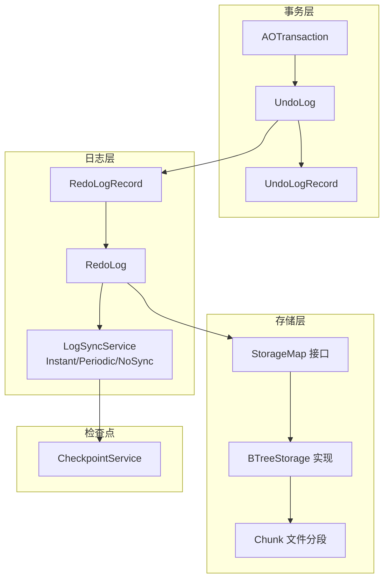
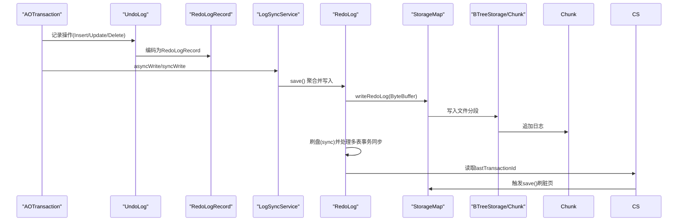
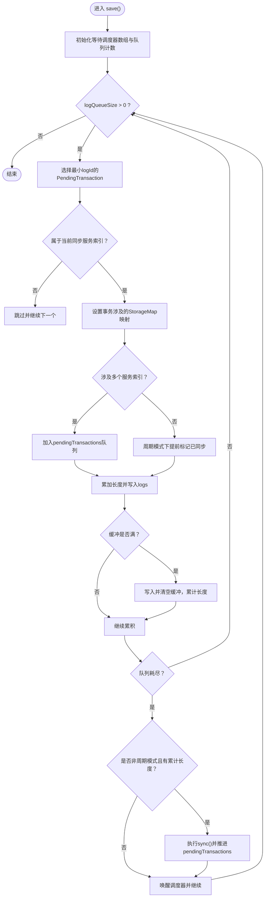
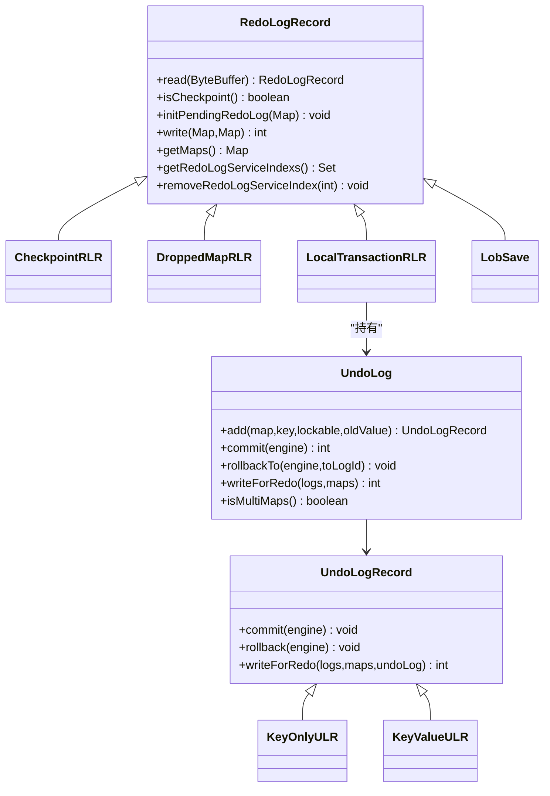
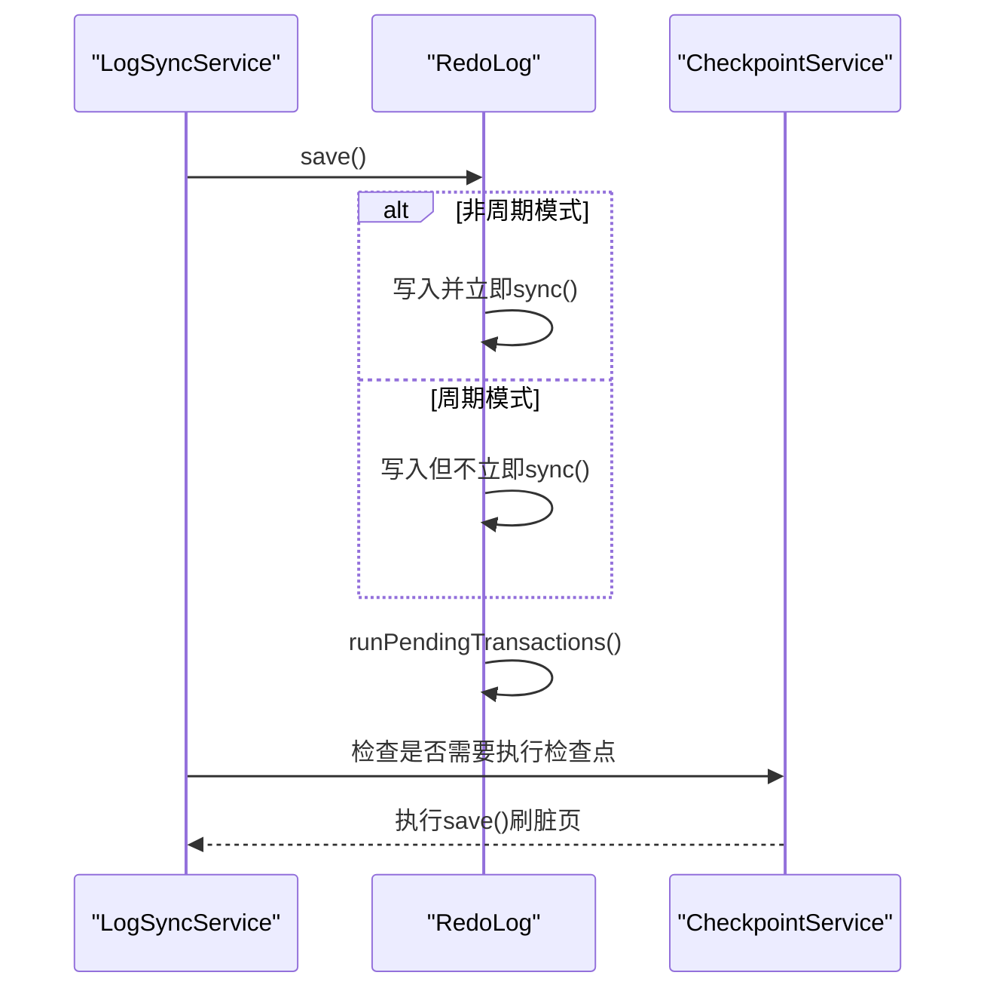
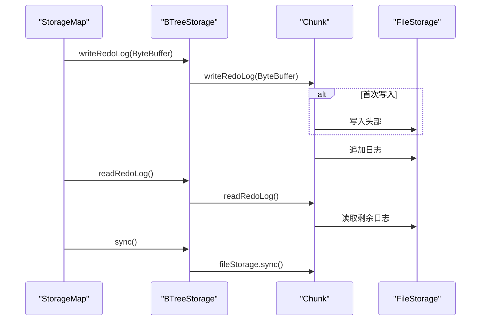
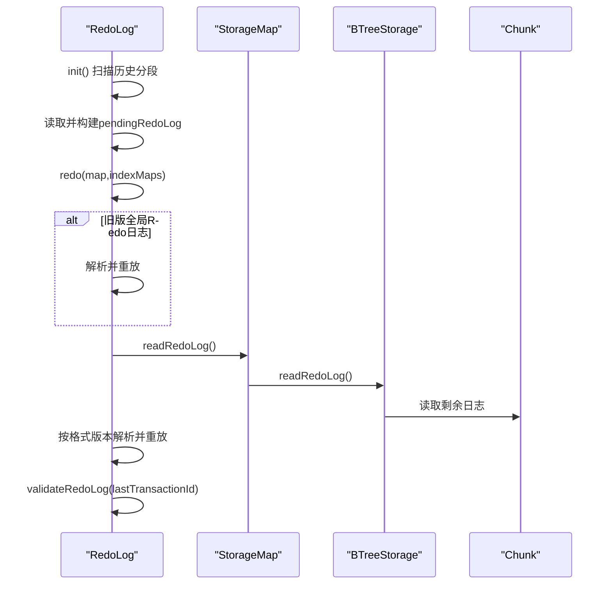
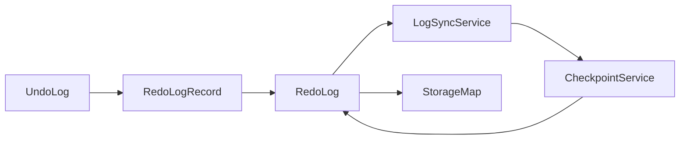

# Redo日志

**本文引用的文件列表**
- [RedoLog.java](https://github.com/lealone/Lealone/blob/master/lealone-aote/src/main/java/com/lealone/transaction/aote/log/RedoLog.java)
- [RedoLogRecord.java](https://github.com/lealone/Lealone/blob/master/lealone-aote/src/main/java/com/lealone/transaction/aote/log/RedoLogRecord.java)
- [UndoLog.java](https://github.com/lealone/Lealone/blob/master/lealone-aote/src/main/java/com/lealone/transaction/aote/log/UndoLog.java)
- [UndoLogRecord.java](https://github.com/lealone/Lealone/blob/master/lealone-aote/src/main/java/com/lealone/transaction/aote/log/UndoLogRecord.java)
- [LogSyncService.java](https://github.com/lealone/Lealone/blob/master/lealone-aote/src/main/java/com/lealone/transaction/aote/log/LogSyncService.java)
- [CheckpointService.java](https://github.com/lealone/Lealone/blob/master/lealone-aote/src/main/java/com/lealone/transaction/aote/CheckpointService.java)
- [AOTransaction.java](https://github.com/lealone/Lealone/blob/master/lealone-aote/src/main/java/com/lealone/transaction/aote/AOTransaction.java)
- [StorageMap.java](https://github.com/lealone/Lealone/blob/master/lealone-sci/src/main/java/com/lealone/storage/StorageMap.java)
- [BTreeStorage.java](https://github.com/lealone/Lealone/blob/master/lealone-aose/src/main/java/com/lealone/storage/aose/btree/BTreeStorage.java)
- [Chunk.java](https://github.com/lealone/Lealone/blob/master/lealone-aose/src/main/java/com/lealone/storage/aose/btree/chunk/Chunk.java)

## 目录
1. [简介](#简介)
2. [项目结构](#项目结构)
3. [核心组件](#核心组件)
4. [架构总览](#架构总览)
5. [详细组件分析](#详细组件分析)
6. [依赖关系分析](#依赖关系分析)
7. [性能考量](#性能考量)
8. [故障排查指南](#故障排查指南)
9. [结论](#结论)
10. [附录](#附录)

## 简介
本文件围绕Lealone数据库的Redo日志子系统进行深入文档化，目标是帮助读者全面理解RedoLog类的设计与实现，掌握其如何记录事务的物理操作（如数据页修改）以保证事务的持久性；详细描述文件存储结构（日志分段、记录格式、检查点机制）；阐述异步写入机制与缓冲策略，并在保证数据安全的前提下最大化写入性能；通过流程图与序列图展示RedoLog的写入流程、刷盘策略以及系统崩溃后的恢复过程，特别关注高并发写入场景下的性能表现与可靠性保障。

## 项目结构
Redo日志相关代码主要位于aote模块的日志包中，配合事务引擎、存储引擎与同步服务共同协作：
- 日志记录与回放：RedoLog、RedoLogRecord、UndoLog、UndoLogRecord
- 同步与调度：LogSyncService及其子类（Instant/Periodic/NoSync）
- 检查点：CheckpointService
- 存储接口：StorageMap（定义writeRedoLog/readRedoLog/sync等）
- 存储实现：BTreeStorage与Chunk（具体落盘与校验）

图表来源
- [RedoLog.java](https://github.com/lealone/Lealone/blob/master/lealone-aote/src/main/java/com/lealone/transaction/aote/log/RedoLog.java#L1-L453)
- [RedoLogRecord.java](https://github.com/lealone/Lealone/blob/master/lealone-aote/src/main/java/com/lealone/transaction/aote/log/RedoLogRecord.java#L1-L187)
- [UndoLog.java](https://github.com/lealone/Lealone/blob/master/lealone-aote/src/main/java/com/lealone/transaction/aote/log/UndoLog.java#L1-L144)
- [UndoLogRecord.java](https://github.com/lealone/Lealone/blob/master/lealone-aote/src/main/java/com/lealone/transaction/aote/log/UndoLogRecord.java#L1-L195)
- [LogSyncService.java](https://github.com/lealone/Lealone/blob/master/lealone-aote/src/main/java/com/lealone/transaction/aote/log/LogSyncService.java#L1-L321)
- [CheckpointService.java](https://github.com/lealone/Lealone/blob/master/lealone-aote/src/main/java/com/lealone/transaction/aote/CheckpointService.java#L1-L313)
- [StorageMap.java](https://github.com/lealone/Lealone/blob/master/lealone-sci/src/main/java/com/lealone/storage/StorageMap.java#L300-L329)
- [BTreeStorage.java](https://github.com/lealone/Lealone/blob/master/lealone-aose/src/main/java/com/lealone/storage/aose/btree/BTreeStorage.java#L369-L414)
- [Chunk.java](https://github.com/lealone/Lealone/blob/master/lealone-aose/src/main/java/com/lealone/storage/aose/btree/chunk/Chunk.java#L311-L325)

章节来源
- [RedoLog.java](https://github.com/lealone/Lealone/blob/master/lealone-aote/src/main/java/com/lealone/transaction/aote/log/RedoLog.java#L1-L120)
- [LogSyncService.java](https://github.com/lealone/Lealone/blob/master/lealone-aote/src/main/java/com/lealone/transaction/aote/log/LogSyncService.java#L1-L120)

## 核心组件
- RedoLog：负责收集、聚合并写入各StorageMap的Redo日志，协调刷盘与检查点，处理多表事务的同步与回放。
- RedoLogRecord：抽象的重做记录类型，支持检查点、本地事务、LOB保存等记录类型，并兼容旧版格式。
- UndoLog/UndoLogRecord：记录事务的撤销信息，用于回滚；同时在提交阶段将操作编码为Redo日志。
- LogSyncService：日志同步服务抽象，提供即时、周期、无同步三种模式，驱动RedoLog的批量写入与刷盘。
- CheckpointService：检查点服务，周期性或强制触发刷脏页，依赖RedoLog的lastTransactionId确保一致性。
- StorageMap：定义Redo日志的写入、读取与刷盘接口，具体由存储实现（如BTreeStorage/Chunk）落地到文件分段。

章节来源
- [RedoLog.java](https://github.com/lealone/Lealone/blob/master/lealone-aote/src/main/java/com/lealone/transaction/aote/log/RedoLog.java#L40-L120)
- [RedoLogRecord.java](https://github.com/lealone/Lealone/blob/master/lealone-aote/src/main/java/com/lealone/transaction/aote/log/RedoLogRecord.java#L23-L122)
- [UndoLog.java](https://github.com/lealone/Lealone/blob/master/lealone-aote/src/main/java/com/lealone/transaction/aote/log/UndoLog.java#L22-L90)
- [UndoLogRecord.java](https://github.com/lealone/Lealone/blob/master/lealone-aote/src/main/java/com/lealone/transaction/aote/log/UndoLogRecord.java#L84-L175)
- [LogSyncService.java](https://github.com/lealone/Lealone/blob/master/lealone-aote/src/main/java/com/lealone/transaction/aote/log/LogSyncService.java#L25-L120)
- [CheckpointService.java](https://github.com/lealone/Lealone/blob/master/lealone-aote/src/main/java/com/lealone/transaction/aote/CheckpointService.java#L28-L120)
- [StorageMap.java](https://github.com/lealone/Lealone/blob/master/lealone-sci/src/main/java/com/lealone/storage/StorageMap.java#L300-L329)

## 架构总览
Redo日志的写入路径从AOTransaction发起，经UndoLog编码为RedoLogRecord，再由LogSyncService调度，RedoLog聚合后写入StorageMap，最终由存储实现落盘并刷盘。恢复阶段通过读取StorageMap的Redo日志进行重放，结合检查点与事务ID确保一致性。

图表来源
- [AOTransaction.java](https://github.com/lealone/Lealone/blob/master/lealone-aote/src/main/java/com/lealone/transaction/aote/AOTransaction.java#L237-L285)
- [UndoLog.java](https://github.com/lealone/Lealone/blob/master/lealone-aote/src/main/java/com/lealone/transaction/aote/log/UndoLog.java#L107-L144)
- [UndoLogRecord.java](https://github.com/lealone/Lealone/blob/master/lealone-aote/src/main/java/com/lealone/transaction/aote/log/UndoLogRecord.java#L129-L175)
- [LogSyncService.java](https://github.com/lealone/Lealone/blob/master/lealone-aote/src/main/java/com/lealone/transaction/aote/log/LogSyncService.java#L161-L217)
- [RedoLog.java](https://github.com/lealone/Lealone/blob/master/lealone-aote/src/main/java/com/lealone/transaction/aote/log/RedoLog.java#L271-L427)
- [StorageMap.java](https://github.com/lealone/Lealone/blob/master/lealone-sci/src/main/java/com/lealone/storage/StorageMap.java#L300-L329)
- [BTreeStorage.java](https://github.com/lealone/Lealone/blob/master/lealone-aose/src/main/java/com/lealone/storage/aose/btree/BTreeStorage.java#L369-L392)
- [Chunk.java](https://github.com/lealone/Lealone/blob/master/lealone-aose/src/main/java/com/lealone/storage/aose/btree/chunk/Chunk.java#L311-L325)

## 详细组件分析

### RedoLog类设计与实现
- 职责
  - 统计并聚合来自多个调度器的待同步事务，按提交时间戳顺序写入，避免乱序。
  - 将UndoLog编码为Redo日志，按StorageMap分组写入，支持缓冲区大小控制。
  - 协调刷盘策略：即时刷盘或周期性批量刷盘；多表事务需等待所有相关服务索引均完成同步后再推进。
  - 兼容旧版全局Redo日志，支持初始化时扫描历史分段并回放到新式存储。
  - 提供lastTransactionId，供检查点服务判断是否需要刷脏页。
- 关键字段
  - 配置与同步服务：config、logSyncService
  - 旧版全局Redo日志缓存：pendingRedoLog
  - 目标StorageMap集合：maps
  - 多表事务同步队列：pendingTransactions
  - 最近事务ID：lastTransactionId
- 关键算法
  - save()：遍历等待同步的PendingTransaction，按调度器顺序挑选最小logId的事务，聚合写入，缓冲满则写入并累计长度；非周期模式下立即刷盘；周期模式下在循环末尾统一刷盘。
  - write()/sync()：将DataBuffer翻转为ByteBuffer并写入对应StorageMap，随后逐个调用sync()；最后处理pendingTransactions队列，移除已完成的服务索引。
  - redo()：兼容旧版全局Redo日志与新式StorageMap Redo日志，按格式版本解析并重放，必要时删除索引。
  - runPendingTransactions()：当某条事务涉及多个服务索引时，等待所有索引完成同步后才从队列移除。
- 错误处理
  - 读取旧版日志时遇到检查点标记会清空缓存，确保一致性。
  - 多表事务同步采用AtomicBoolean标记，避免部分表未刷盘导致检查点提前推进。
- 复杂度
  - save()主循环按PendingTransaction数量线性增长，write()按StorageMap数量线性增长，整体为O(N+M)。

图表来源
- [RedoLog.java](https://github.com/lealone/Lealone/blob/master/lealone-aote/src/main/java/com/lealone/transaction/aote/log/RedoLog.java#L271-L427)

章节来源
- [RedoLog.java](https://github.com/lealone/Lealone/blob/master/lealone-aote/src/main/java/com/lealone/transaction/aote/log/RedoLog.java#L40-L120)
- [RedoLog.java](https://github.com/lealone/Lealone/blob/master/lealone-aote/src/main/java/com/lealone/transaction/aote/log/RedoLog.java#L121-L190)
- [RedoLog.java](https://github.com/lealone/Lealone/blob/master/lealone-aote/src/main/java/com/lealone/transaction/aote/log/RedoLog.java#L271-L452)

### RedoLogRecord与UndoLog/UndoLogRecord
- RedoLogRecord
  - 抽象基类，提供类型识别与兼容旧版的initPendingRedoLog接口。
  - 支持CheckpointRLR、DroppedMapRLR、LocalTransactionRLR、LobSave等类型。
  - LocalTransactionRLR封装UndoLog，复用UndoLog的编码逻辑。
- UndoLog/UndoLogRecord
  - 记录插入/更新/删除操作，区分KeyOnly与KeyValue两类记录。
  - KeyValueULR在writeForRedo中编码为Redo日志格式，包含长度、类型、元信息、键、值等。
  - 多表事务时写入事务ID与涉及的map名称列表，便于跨表一致性校验。
- 兼容性
  - 旧版全局Redo日志通过readForRedo预解析mapName与keyValue字节，延迟到StorageMap打开后再执行重放。

图表来源
- [RedoLogRecord.java](https://github.com/lealone/Lealone/blob/master/lealone-aote/src/main/java/com/lealone/transaction/aote/log/RedoLogRecord.java#L23-L187)
- [UndoLog.java](https://github.com/lealone/Lealone/blob/master/lealone-aote/src/main/java/com/lealone/transaction/aote/log/UndoLog.java#L22-L144)
- [UndoLogRecord.java](https://github.com/lealone/Lealone/blob/master/lealone-aote/src/main/java/com/lealone/transaction/aote/log/UndoLogRecord.java#L23-L195)

章节来源
- [RedoLogRecord.java](https://github.com/lealone/Lealone/blob/master/lealone-aote/src/main/java/com/lealone/transaction/aote/log/RedoLogRecord.java#L23-L122)
- [UndoLogRecord.java](https://github.com/lealone/Lealone/blob/master/lealone-aote/src/main/java/com/lealone/transaction/aote/log/UndoLogRecord.java#L84-L175)

### LogSyncService与刷盘策略
- 模式
  - Instant：只要有日志就立即同步，适合强一致场景。
  - Periodic：周期性同步，支持阈值触发，兼顾性能与安全。
  - NoSync：不主动刷盘，依赖外部策略，适合对延迟敏感但可接受风险的场景。
- 关键行为
  - asyncWrite/syncWrite：将PendingTransaction加入对应调度器队列，唤醒同步服务。
  - run()：循环执行save()，处理pendingTransactions，周期性触发检查点。
  - waitForSyncToCatchUp()：在同步滞后时阻塞，避免检查点过早推进。
- 与RedoLog协作
  - RedoLog.save()根据LogSyncService的isPeriodic与阈值决定刷盘时机。
  - RedoLog.runPendingTransactions()在sync()后清理已完成的服务索引。

图表来源
- [LogSyncService.java](https://github.com/lealone/Lealone/blob/master/lealone-aote/src/main/java/com/lealone/transaction/aote/log/LogSyncService.java#L111-L185)
- [LogSyncService.java](https://github.com/lealone/Lealone/blob/master/lealone-aote/src/main/java/com/lealone/transaction/aote/log/LogSyncService.java#L232-L320)
- [RedoLog.java](https://github.com/lealone/Lealone/blob/master/lealone-aote/src/main/java/com/lealone/transaction/aote/log/RedoLog.java#L365-L427)
- [CheckpointService.java](https://github.com/lealone/Lealone/blob/master/lealone-aote/src/main/java/com/lealone/transaction/aote/CheckpointService.java#L227-L269)

章节来源
- [LogSyncService.java](https://github.com/lealone/Lealone/blob/master/lealone-aote/src/main/java/com/lealone/transaction/aote/log/LogSyncService.java#L1-L120)
- [LogSyncService.java](https://github.com/lealone/Lealone/blob/master/lealone-aote/src/main/java/com/lealone/transaction/aote/log/LogSyncService.java#L161-L217)

### 检查点机制
- 触发条件
  - 强制任务、关闭前、脏页内存阈值、周期超时。
- 行为
  - 收集各StorageMap脏页内存统计，设置lastTransactionId，调用map.save()刷脏页。
  - 依赖RedoLog.getLastTransactionId()确保检查点不会覆盖尚未持久化的事务。
- 与RedoLog的交互
  - 检查点在确认无多表事务未完成同步后执行，避免数据丢失。

章节来源
- [CheckpointService.java](https://github.com/lealone/Lealone/blob/master/lealone-aote/src/main/java/com/lealone/transaction/aote/CheckpointService.java#L227-L312)
- [RedoLog.java](https://github.com/lealone/Lealone/blob/master/lealone-aote/src/main/java/com/lealone/transaction/aote/log/RedoLog.java#L429-L452)

### 文件存储结构与分段
- 存储接口
  - StorageMap定义writeRedoLog/readRedoLog/sync/setRedoLogServiceIndex等接口。
- 实现细节
  - BTreeStorage定位到最后一个Chunk，调用Chunk.writeRedoLog追加日志。
  - Chunk在首次写入时写入头部，后续追加日志至文件末尾。
  - 读取时从特定位置读取剩余日志，支持validateRedoLog按事务ID校验。
- 分段与校验
  - 通过lastTransactionId与事务ID字段实现一致性校验，避免部分日志丢失导致的不一致。

图表来源
- [StorageMap.java](https://github.com/lealone/Lealone/blob/master/lealone-sci/src/main/java/com/lealone/storage/StorageMap.java#L300-L329)
- [BTreeStorage.java](https://github.com/lealone/Lealone/blob/master/lealone-aose/src/main/java/com/lealone/storage/aose/btree/BTreeStorage.java#L369-L392)
- [Chunk.java](https://github.com/lealone/Lealone/blob/master/lealone-aose/src/main/java/com/lealone/storage/aose/btree/chunk/Chunk.java#L311-L325)

章节来源
- [BTreeStorage.java](https://github.com/lealone/Lealone/blob/master/lealone-aose/src/main/java/com/lealone/storage/aose/btree/BTreeStorage.java#L369-L414)
- [Chunk.java](https://github.com/lealone/Lealone/blob/master/lealone-aose/src/main/java/com/lealone/storage/aose/btree/chunk/Chunk.java#L288-L325)

### 系统崩溃后的恢复流程
- 初始化阶段
  - RedoLog.init()扫描日志目录，按文件名序号读取历史分段，构建pendingRedoLog。
  - 读取到检查点标记时清空缓存，确保从最近检查点之后的日志开始重放。
- 运行阶段
  - RedoLog.redo()优先处理旧版全局Redo日志，然后读取StorageMap的Redo日志流，按格式版本解析并重放。
  - 对于多表事务，通过readMapNames与validateRedoLog确保事务完整性。
- 事务提交
  - AOTransaction.onSynced()在RedoLog刷盘完成后生成commitTimestamp，保证检查点与可重复读事务的正确性。

图表来源
- [RedoLog.java](https://github.com/lealone/Lealone/blob/master/lealone-aote/src/main/java/com/lealone/transaction/aote/log/RedoLog.java#L74-L190)
- [RedoLog.java](https://github.com/lealone/Lealone/blob/master/lealone-aote/src/main/java/com/lealone/transaction/aote/log/RedoLog.java#L192-L269)
- [BTreeStorage.java](https://github.com/lealone/Lealone/blob/master/lealone-aose/src/main/java/com/lealone/storage/aose/btree/BTreeStorage.java#L380-L414)
- [AOTransaction.java](https://github.com/lealone/Lealone/blob/master/lealone-aote/src/main/java/com/lealone/transaction/aote/AOTransaction.java#L251-L258)

章节来源
- [RedoLog.java](https://github.com/lealone/Lealone/blob/master/lealone-aote/src/main/java/com/lealone/transaction/aote/log/RedoLog.java#L74-L190)
- [AOTransaction.java](https://github.com/lealone/Lealone/blob/master/lealone-aote/src/main/java/com/lealone/transaction/aote/AOTransaction.java#L237-L258)

## 依赖关系分析
- RedoLog依赖
  - LogSyncService：获取等待调度器、队列计数、同步阈值与周期参数。
  - StorageMap：按map分组写入Redo日志并刷盘。
  - InternalScheduler/PendingTransaction：按提交时间戳顺序消费待同步事务。
- LogSyncService依赖
  - AOTransactionEngine：获取其他LogSyncService实例，唤醒对应调度器。
  - CheckpointService：周期性触发检查点。
- CheckpointService依赖
  - RedoLog：读取lastTransactionId，确保检查点不会覆盖未持久化事务。
  - StorageMap：收集脏页并刷盘。

图表来源
- [RedoLog.java](https://github.com/lealone/Lealone/blob/master/lealone-aote/src/main/java/com/lealone/transaction/aote/log/RedoLog.java#L271-L427)
- [LogSyncService.java](https://github.com/lealone/Lealone/blob/master/lealone-aote/src/main/java/com/lealone/transaction/aote/log/LogSyncService.java#L161-L217)
- [CheckpointService.java](https://github.com/lealone/Lealone/blob/master/lealone-aote/src/main/java/com/lealone/transaction/aote/CheckpointService.java#L227-L269)

章节来源
- [RedoLog.java](https://github.com/lealone/Lealone/blob/master/lealone-aote/src/main/java/com/lealone/transaction/aote/log/RedoLog.java#L271-L427)
- [LogSyncService.java](https://github.com/lealone/Lealone/blob/master/lealone-aote/src/main/java/com/lealone/transaction/aote/log/LogSyncService.java#L161-L217)
- [CheckpointService.java](https://github.com/lealone/Lealone/blob/master/lealone-aote/src/main/java/com/lealone/transaction/aote/CheckpointService.java#L227-L269)

## 性能考量
- 异步写入与批量刷盘
  - 通过LogSyncService的Periodic模式与阈值，减少频繁fsync带来的I/O开销。
  - RedoLog在缓冲满时批量写入，降低系统调用次数。
- 多表事务同步
  - 使用LinkableList与AtomicBoolean跟踪多表事务，确保所有相关服务索引均完成同步后再推进，避免部分表未落盘导致检查点提前。
- 旧版兼容与回放
  - 旧版全局Redo日志在初始化阶段一次性回放到新式存储，避免运行时重复解析成本。
- 内存与GC
  - CheckpointService在内存压力或周期到达时触发fullGc与save，平衡内存占用与持久化压力。

章节来源
- [LogSyncService.java](https://github.com/lealone/Lealone/blob/master/lealone-aote/src/main/java/com/lealone/transaction/aote/log/LogSyncService.java#L271-L320)
- [RedoLog.java](https://github.com/lealone/Lealone/blob/master/lealone-aote/src/main/java/com/lealone/transaction/aote/log/RedoLog.java#L314-L363)
- [CheckpointService.java](https://github.com/lealone/Lealone/blob/master/lealone-aote/src/main/java/com/lealone/transaction/aote/CheckpointService.java#L131-L208)

## 故障排查指南
- 常见问题
  - 检查点提前推进：确认RedoLog.hasPendingTransactions()为false，或等待runPendingTransactions()清理完成。
  - 事务ID不一致：检查StorageMap.validateRedoLog(lastTransactionId)返回值，确保日志包含目标事务ID。
  - 旧版日志残留：init()完成后应删除旧版全局Redo日志目录。
- 定位手段
  - 查看LogSyncService的lastSyncedAt与syncIntervalMillis，确认同步周期是否合理。
  - 在AOTransaction.onSynced()处确认commitTimestamp生成时机，避免过早提交。
  - 检查RedoLog.write()与sync()调用链，确认每条StorageMap均已调用sync()。

章节来源
- [RedoLog.java](https://github.com/lealone/Lealone/blob/master/lealone-aote/src/main/java/com/lealone/transaction/aote/log/RedoLog.java#L422-L452)
- [BTreeStorage.java](https://github.com/lealone/Lealone/blob/master/lealone-aose/src/main/java/com/lealone/storage/aose/btree/BTreeStorage.java#L394-L414)
- [AOTransaction.java](https://github.com/lealone/Lealone/blob/master/lealone-aote/src/main/java/com/lealone/transaction/aote/AOTransaction.java#L251-L258)

## 结论
RedoLog通过“事务编码为Redo日志 + 同步服务调度 + 存储分段落盘”的架构，在保证事务持久性的前提下实现了高并发写入与高效刷盘。其缓冲策略、多表事务同步与检查点协同机制有效平衡了安全性与性能。在高并发场景下，建议采用Periodic模式并合理配置阈值与周期，结合CheckpointService的周期触发，获得最佳吞吐与可靠性。

## 附录
- 关键流程路径参考
  - 写入流程：[AOTransaction.java](https://github.com/lealone/Lealone/blob/master/lealone-aote/src/main/java/com/lealone/transaction/aote/AOTransaction.java#L237-L285) → [UndoLog.java](https://github.com/lealone/Lealone/blob/master/lealone-aote/src/main/java/com/lealone/transaction/aote/log/UndoLog.java#L107-L144) → [LogSyncService.java](https://github.com/lealone/Lealone/blob/master/lealone-aote/src/main/java/com/lealone/transaction/aote/log/LogSyncService.java#L161-L217) → [RedoLog.java](https://github.com/lealone/Lealone/blob/master/lealone-aote/src/main/java/com/lealone/transaction/aote/log/RedoLog.java#L271-L427) → [StorageMap.java](https://github.com/lealone/Lealone/blob/master/lealone-sci/src/main/java/com/lealone/storage/StorageMap.java#L300-L329) → [BTreeStorage.java](https://github.com/lealone/Lealone/blob/master/lealone-aose/src/main/java/com/lealone/storage/aose/btree/BTreeStorage.java#L369-L392)
  - 恢复流程：[RedoLog.java](https://github.com/lealone/Lealone/blob/master/lealone-aote/src/main/java/com/lealone/transaction/aote/log/RedoLog.java#L74-L190) → [BTreeStorage.java](https://github.com/lealone/Lealone/blob/master/lealone-aose/src/main/java/com/lealone/storage/aose/btree/BTreeStorage.java#L380-L414)
  - 刷盘与检查点：[LogSyncService.java](https://github.com/lealone/Lealone/blob/master/lealone-aote/src/main/java/com/lealone/transaction/aote/log/LogSyncService.java#L111-L185) → [CheckpointService.java](https://github.com/lealone/Lealone/blob/master/lealone-aote/src/main/java/com/lealone/transaction/aote/CheckpointService.java#L227-L269)