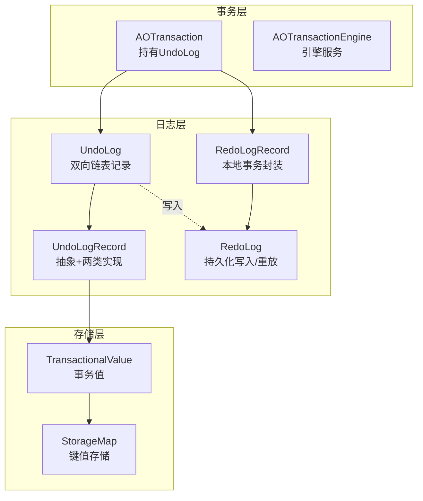
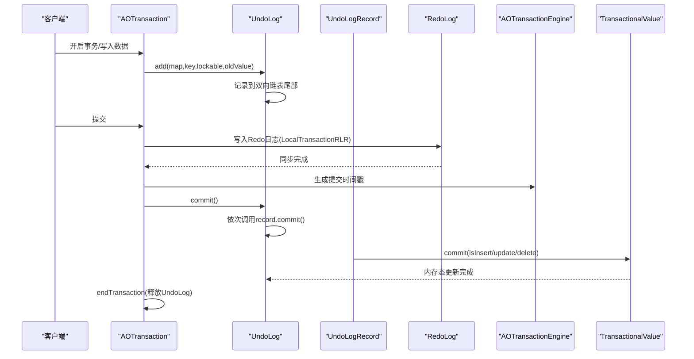
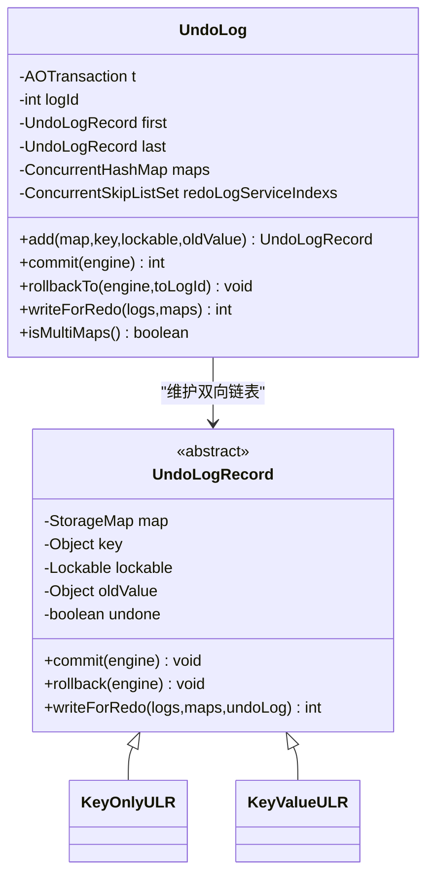
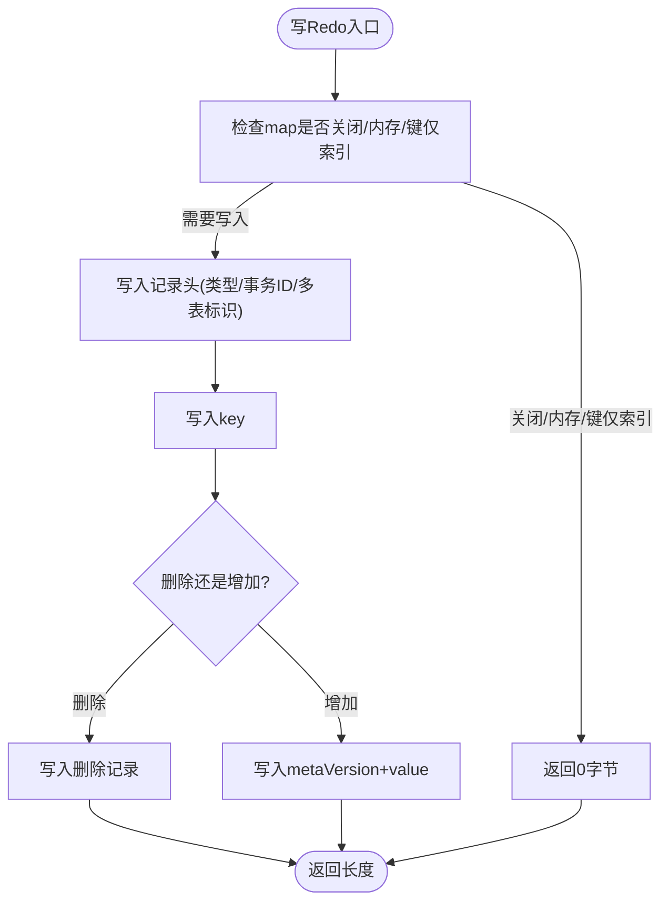
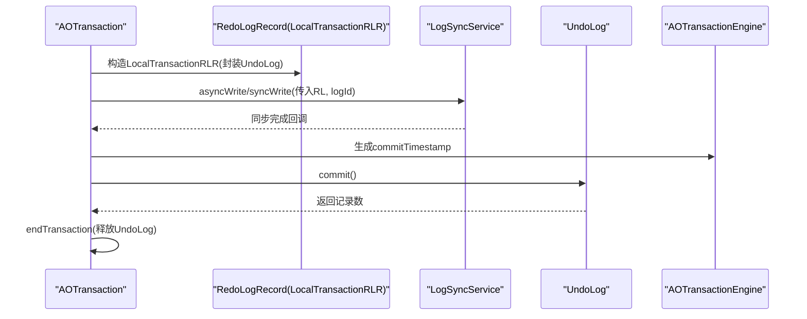
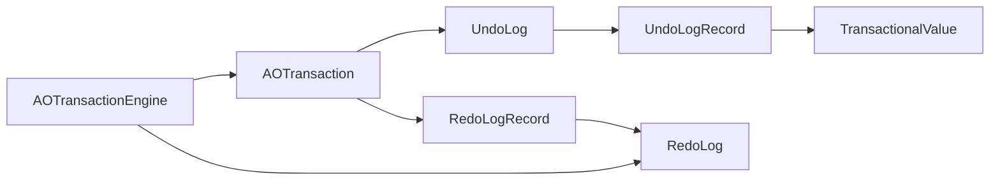

# Undo日志

**本文引用的文件列表**
- [UndoLog.java](https://github.com/lealone/Lealone/blob/master/lealone-aote/src/main/java/com/lealone/transaction/aote/log/UndoLog.java)
- [UndoLogRecord.java](https://github.com/lealone/Lealone/blob/master/lealone-aote/src/main/java/com/lealone/transaction/aote/log/UndoLogRecord.java)
- [AOTransaction.java](https://github.com/lealone/Lealone/blob/master/lealone-aote/src/main/java/com/lealone/transaction/aote/AOTransaction.java)
- [AOTransactionEngine.java](https://github.com/lealone/Lealone/blob/master/lealone-aote/src/main/java/com/lealone/transaction/aote/AOTransactionEngine.java)
- [RedoLog.java](https://github.com/lealone/Lealone/blob/master/lealone-aote/src/main/java/com/lealone/transaction/aote/log/RedoLog.java)
- [RedoLogRecord.java](https://github.com/lealone/Lealone/blob/master/lealone-aote/src/main/java/com/lealone/transaction/aote/log/RedoLogRecord.java)
- [TransactionalValue.java](https://github.com/lealone/Lealone/blob/master/lealone-aote/src/main/java/com/lealone/transaction/aote/TransactionalValue.java)
- [TransactionTest.java](https://github.com/lealone/Lealone/blob/master/lealone-test/src/test/java/com/lealone/test/aote/TransactionTest.java)

## 目录
1. [简介](#简介)
2. [项目结构](#项目结构)
3. [核心组件](#核心组件)
4. [架构总览](#架构总览)
5. [组件详解](#组件详解)
6. [依赖关系分析](#依赖关系分析)
7. [性能与内存特性](#性能与内存特性)
8. [故障排查指南](#故障排查指南)
9. [结论](#结论)
10. [附录](#附录)

## 简介
本文件系统性阐述Lealone AOTE事务引擎中的Undo日志（UndoLog）设计与实现，重点覆盖：
- UndoLog的作用与工作机制：记录事务修改前的旧值（前镜像），支撑事务回滚与持久化阶段的重做（Redo）准备。
- 存储结构与生命周期：基于双向链表的有序记录序列，按事务写入顺序维护，支持回滚到指定位置。
- 与事务对象的关联：每个AOTransaction持有其专属UndoLog；UndoLog在提交阶段驱动内存态更新，在持久化阶段生成Redo日志。
- 高并发与长事务下的内存与性能影响：多表事务、可重复读事务、Redo日志分发与同步策略。
- 完整流程示例：创建、记录、回滚应用、清理与提交。

## 项目结构
围绕Undo日志的关键模块位于lealone-aote子模块，核心文件如下：
- Undo日志与记录：UndoLog、UndoLogRecord
- 事务与引擎：AOTransaction、AOTransactionEngine
- Redo日志与记录：RedoLog、RedoLogRecord
- 事务值与回滚应用：TransactionalValue
- 测试用例：TransactionTest

图表来源
- [AOTransaction.java](https://github.com/lealone/Lealone/blob/master/lealone-aote/src/main/java/com/lealone/transaction/aote/AOTransaction.java#L222-L319)
- [UndoLog.java](https://github.com/lealone/Lealone/blob/master/lealone-aote/src/main/java/com/lealone/transaction/aote/log/UndoLog.java#L67-L143)
- [UndoLogRecord.java](https://github.com/lealone/Lealone/blob/master/lealone-aote/src/main/java/com/lealone/transaction/aote/log/UndoLogRecord.java#L23-L195)
- [RedoLog.java](https://github.com/lealone/Lealone/blob/master/lealone-aote/src/main/java/com/lealone/transaction/aote/log/RedoLog.java#L271-L452)
- [RedoLogRecord.java](https://github.com/lealone/Lealone/blob/master/lealone-aote/src/main/java/com/lealone/transaction/aote/log/RedoLogRecord.java#L105-L186)
- [TransactionalValue.java](https://github.com/lealone/Lealone/blob/master/lealone-aote/src/main/java/com/lealone/transaction/aote/TransactionalValue.java#L258-L309)

章节来源
- [AOTransaction.java](https://github.com/lealone/Lealone/blob/master/lealone-aote/src/main/java/com/lealone/transaction/aote/AOTransaction.java#L222-L319)
- [UndoLog.java](https://github.com/lealone/Lealone/blob/master/lealone-aote/src/main/java/com/lealone/transaction/aote/log/UndoLog.java#L67-L143)
- [UndoLogRecord.java](https://github.com/lealone/Lealone/blob/master/lealone-aote/src/main/java/com/lealone/transaction/aote/log/UndoLogRecord.java#L23-L195)
- [RedoLog.java](https://github.com/lealone/Lealone/blob/master/lealone-aote/src/main/java/com/lealone/transaction/aote/log/RedoLog.java#L271-L452)
- [RedoLogRecord.java](https://github.com/lealone/Lealone/blob/master/lealone-aote/src/main/java/com/lealone/transaction/aote/log/RedoLogRecord.java#L105-L186)
- [TransactionalValue.java](https://github.com/lealone/Lealone/blob/master/lealone-aote/src/main/java/com/lealone/transaction/aote/TransactionalValue.java#L258-L309)

## 核心组件
- UndoLog：事务内的Undo日志容器，维护双向链表记录，提供添加、提交、回滚到指定位置、写入Redo等能力。
- UndoLogRecord：抽象记录基类，包含map、key、lockable、oldValue等上下文；提供commit/rollback语义及写Redo逻辑。
- AOTransaction：持有UndoLog，负责写Redo日志、生成提交时间戳、提交与回滚的最终处理。
- AOTransactionEngine：引擎服务入口，负责日志同步服务、可重复读计数、存储映射注册与恢复。
- RedoLog/RedoLogRecord：Redo日志的持久化写入、批量同步、重放与兼容处理。
- TransactionalValue：事务值包装，提供提交时的旧值缓存与回滚应用。

章节来源
- [UndoLog.java](https://github.com/lealone/Lealone/blob/master/lealone-aote/src/main/java/com/lealone/transaction/aote/log/UndoLog.java#L24-L143)
- [UndoLogRecord.java](https://github.com/lealone/Lealone/blob/master/lealone-aote/src/main/java/com/lealone/transaction/aote/log/UndoLogRecord.java#L23-L195)
- [AOTransaction.java](https://github.com/lealone/Lealone/blob/master/lealone-aote/src/main/java/com/lealone/transaction/aote/AOTransaction.java#L222-L319)
- [AOTransactionEngine.java](https://github.com/lealone/Lealone/blob/master/lealone-aote/src/main/java/com/lealone/transaction/aote/AOTransactionEngine.java#L113-L190)
- [RedoLog.java](https://github.com/lealone/Lealone/blob/master/lealone-aote/src/main/java/com/lealone/transaction/aote/log/RedoLog.java#L271-L452)
- [RedoLogRecord.java](https://github.com/lealone/Lealone/blob/master/lealone-aote/src/main/java/com/lealone/transaction/aote/log/RedoLogRecord.java#L105-L186)
- [TransactionalValue.java](https://github.com/lealone/Lealone/blob/master/lealone-aote/src/main/java/com/lealone/transaction/aote/TransactionalValue.java#L258-L309)

## 架构总览
Undo日志贯穿事务生命周期：
- 写入阶段：AOTransaction在每次写入前记录旧值到UndoLog（Insert/Update/Delete）。
- 提交阶段：AOTransaction写Redo日志并生成提交时间戳；随后调用UndoLog.commit，驱动TransactionalValue在内存中完成最终提交。
- 回滚阶段：AOTransaction调用UndoLog.rollbackTo，逐条回滚应用，恢复旧值。
- 清理阶段：提交或回滚后，AOTransaction释放UndoLog引用，行锁解锁。

图表来源
- [AOTransaction.java](https://github.com/lealone/Lealone/blob/master/lealone-aote/src/main/java/com/lealone/transaction/aote/AOTransaction.java#L222-L319)
- [UndoLog.java](https://github.com/lealone/Lealone/blob/master/lealone-aote/src/main/java/com/lealone/transaction/aote/log/UndoLog.java#L107-L143)
- [UndoLogRecord.java](https://github.com/lealone/Lealone/blob/master/lealone-aote/src/main/java/com/lealone/transaction/aote/log/UndoLogRecord.java#L51-L82)
- [TransactionalValue.java](https://github.com/lealone/Lealone/blob/master/lealone-aote/src/main/java/com/lealone/transaction/aote/TransactionalValue.java#L258-L309)
- [RedoLogRecord.java](https://github.com/lealone/Lealone/blob/master/lealone-aote/src/main/java/com/lealone/transaction/aote/log/RedoLogRecord.java#L105-L148)
- [RedoLog.java](https://github.com/lealone/Lealone/blob/master/lealone-aote/src/main/java/com/lealone/transaction/aote/log/RedoLog.java#L271-L452)

## 组件详解

### UndoLog：事务内Undo日志容器
- 结构与职责
  - 双向链表：first/last指针维护插入顺序，支持从尾部追加与从尾部回滚。
  - 记录计数：logId跟踪记录数量，配合保存点与回滚定位。
  - 多表追踪：记录涉及的StorageMap集合与Redo日志同步服务索引集合。
- 关键方法
  - add：根据StorageMap类型选择KeyOnlyULR或KeyValueULR；非内存表且非键仅索引表时登记Redo日志目标。
  - commit：顺序遍历记录，调用各记录的commit语义，完成内存态最终提交。
  - rollbackTo：从尾部移除并回滚至指定logId，逐条调用record.rollback。
  - writeForRedo：遍历记录，写入Redo日志缓冲区，兼容多表事务场景。
- 生命周期
  - 创建：AOTransaction构造时创建。
  - 使用：写入阶段持续增长；提交/回滚阶段被消费。
  - 清理：AOTransaction.endTransaction时置空，交由GC回收。

图表来源
- [UndoLog.java](https://github.com/lealone/Lealone/blob/master/lealone-aote/src/main/java/com/lealone/transaction/aote/log/UndoLog.java#L24-L143)
- [UndoLogRecord.java](https://github.com/lealone/Lealone/blob/master/lealone-aote/src/main/java/com/lealone/transaction/aote/log/UndoLogRecord.java#L23-L195)

章节来源
- [UndoLog.java](https://github.com/lealone/Lealone/blob/master/lealone-aote/src/main/java/com/lealone/transaction/aote/log/UndoLog.java#L24-L143)

### UndoLogRecord：Undo记录抽象与实现
- 抽象基类
  - 字段：map/key/lockable/oldValue/undone，以及prev/next双向指针。
  - 语义：commit/rollback分别在提交与回滚阶段应用；ignore用于跳过已关闭或已撤销的记录。
- 两类实现
  - KeyOnlyULR：键仅索引表无需写Redo，commit/update为空操作，writeForRedo直接返回0。
  - KeyValueULR：普通键值表，记录newValue与metaVersion；commit时根据内存变化更新页面内存统计并提交；writeForRedo写入Redo日志，支持多表事务标识与事务ID。
- 写Redo兼容
  - readForRedo：兼容旧版全局Redo日志格式，预解析mapName与key/value字节块。

图表来源
- [UndoLogRecord.java](https://github.com/lealone/Lealone/blob/master/lealone-aote/src/main/java/com/lealone/transaction/aote/log/UndoLogRecord.java#L107-L176)
- [UndoLog.java](https://github.com/lealone/Lealone/blob/master/lealone-aote/src/main/java/com/lealone/transaction/aote/log/UndoLog.java#L123-L134)

章节来源
- [UndoLogRecord.java](https://github.com/lealone/Lealone/blob/master/lealone-aote/src/main/java/com/lealone/transaction/aote/log/UndoLogRecord.java#L23-L195)

### AOTransaction：事务与Undo日志的协调者
- 关键职责
  - 持有UndoLog，提供保存点与回滚到保存点的能力。
  - 写Redo日志：根据是否启用Redo、是否需要同步，构造LocalTransactionRLR或LobSave包裹，交由LogSyncService异步/同步写入。
  - 提交流程：写Redo完成后生成commitTimestamp，再调用UndoLog.commit，最后endTransaction释放UndoLog。
  - 回滚流程：rollback/rollbackToSavepoint调用UndoLog.rollbackTo，逐条回滚应用，结束后endTransaction。
- 与引擎协作
  - 通过AOTransactionEngine获取LogSyncService、可重复读计数等。

图表来源
- [AOTransaction.java](https://github.com/lealone/Lealone/blob/master/lealone-aote/src/main/java/com/lealone/transaction/aote/AOTransaction.java#L222-L319)
- [RedoLogRecord.java](https://github.com/lealone/Lealone/blob/master/lealone-aote/src/main/java/com/lealone/transaction/aote/log/RedoLogRecord.java#L105-L148)
- [UndoLog.java](https://github.com/lealone/Lealone/blob/master/lealone-aote/src/main/java/com/lealone/transaction/aote/log/UndoLog.java#L107-L143)

章节来源
- [AOTransaction.java](https://github.com/lealone/Lealone/blob/master/lealone-aote/src/main/java/com/lealone/transaction/aote/AOTransaction.java#L222-L319)

### AOTransactionEngine：引擎与存储集成
- 与Undo/Redo的集成
  - afterStorageMapOpen：为非内存表且非键仅索引表注册Redo日志目标，设置Redo日志服务索引。
  - recover：对非内存表执行Redo重放。
  - containsRepeatableReadTransactions/maxRepeatableReadTransactionId：支持可重复读事务的旧值缓存策略。
- 日志同步服务
  - 初始化多个LogSyncService，支持多路Redo日志分发与同步。

章节来源
- [AOTransactionEngine.java](https://github.com/lealone/Lealone/blob/master/lealone-aote/src/main/java/com/lealone/transaction/aote/AOTransactionEngine.java#L113-L190)
- [AOTransactionEngine.java](https://github.com/lealone/Lealone/blob/master/lealone-aote/src/main/java/com/lealone/transaction/aote/AOTransactionEngine.java#L254-L266)

### RedoLog/RedoLogRecord：持久化与重放
- RedoLog
  - save：批量收集待同步的PendingTransaction，按提交时间戳顺序写入各StorageMap的Redo日志缓冲，达到阈值后落盘并可选fsync。
  - redo：对单表执行重放，兼容旧版本格式；支持多表事务场景的mapName校验。
- RedoLogRecord
  - LocalTransactionRLR：封装UndoLog，write委托UndoLog.writeForRedo。
  - LobSave：在写入Redo之前执行LOB任务（如大对象持久化）。

章节来源
- [RedoLog.java](https://github.com/lealone/Lealone/blob/master/lealone-aote/src/main/java/com/lealone/transaction/aote/log/RedoLog.java#L271-L452)
- [RedoLogRecord.java](https://github.com/lealone/Lealone/blob/master/lealone-aote/src/main/java/com/lealone/transaction/aote/log/RedoLogRecord.java#L105-L186)

### TransactionalValue：回滚应用与提交更新
- 回滚应用
  - rollback：直接将lockable的锁定值设为oldValue，实现内存态回滚。
- 提交更新
  - commit(isInsert, map, key, lockable)：在存在可重复读事务时，将旧值缓存到StorageMap的旧值缓存中，供后续可重复读读取使用；非插入场景还会维护旧值链表。
- 读取可见性
  - getValue：根据隔离级别与事务状态决定返回当前值、旧值或“不可见”标记。

章节来源
- [TransactionalValue.java](https://github.com/lealone/Lealone/blob/master/lealone-aote/src/main/java/com/lealone/transaction/aote/TransactionalValue.java#L258-L309)
- [TransactionalValue.java](https://github.com/lealone/Lealone/blob/master/lealone-aote/src/main/java/com/lealone/transaction/aote/TransactionalValue.java#L121-L196)

## 依赖关系分析
- 组件耦合
  - AOTransaction强依赖UndoLog；UndoLog依赖UndoLogRecord及其子类。
  - UndoLogRecord依赖StorageMap、Lockable、TransactionalValue。
  - AOTransaction通过AOTransactionEngine间接依赖RedoLog与LogSyncService。
- 关键依赖链
  - 写入路径：AOTransaction.add -> UndoLog.add -> UndoLogRecord(KeyValueULR/KeyOnlyULR)。
  - 提交路径：AOTransaction.commit -> RedoLog.save -> UndoLog.commit -> TransactionalValue.commit。
  - 回滚路径：AOTransaction.rollback -> UndoLog.rollbackTo -> UndoLogRecord.rollback -> TransactionalValue.rollback。
- 并发与一致性
  - UndoLog内部为单事务线程访问，避免并发冲突。
  - RedoLog.save按提交时间戳顺序推进，确保重放顺序正确。

图表来源
- [AOTransaction.java](https://github.com/lealone/Lealone/blob/master/lealone-aote/src/main/java/com/lealone/transaction/aote/AOTransaction.java#L222-L319)
- [UndoLog.java](https://github.com/lealone/Lealone/blob/master/lealone-aote/src/main/java/com/lealone/transaction/aote/log/UndoLog.java#L67-L143)
- [UndoLogRecord.java](https://github.com/lealone/Lealone/blob/master/lealone-aote/src/main/java/com/lealone/transaction/aote/log/UndoLogRecord.java#L23-L195)
- [RedoLogRecord.java](https://github.com/lealone/Lealone/blob/master/lealone-aote/src/main/java/com/lealone/transaction/aote/log/RedoLogRecord.java#L105-L148)
- [RedoLog.java](https://github.com/lealone/Lealone/blob/master/lealone-aote/src/main/java/com/lealone/transaction/aote/log/RedoLog.java#L271-L452)
- [AOTransactionEngine.java](https://github.com/lealone/Lealone/blob/master/lealone-aote/src/main/java/com/lealone/transaction/aote/AOTransactionEngine.java#L113-L190)

## 性能与内存特性
- Undo日志内存占用
  - UndoLog采用双向链表，每条记录包含map/key/lockable/oldValue等引用，写入越多内存占用越高。
  - KeyOnlyULR不写Redo，适合索引等键仅表，减少IO与内存压力。
- 长事务与高并发
  - 长事务会累积大量Undo记录，建议合理使用保存点进行回滚，避免一次性回滚过多记录。
  - 多表事务时，RedoLog会记录多表标识，写入Redo时需遍历所有涉及表，带来额外开销。
- 可重复读与旧值缓存
  - 提交阶段若存在可重复读事务，TransactionalValue会在StorageMap的旧值缓存中保留旧值链，便于后续读取，但也会增加内存占用。
- Redo日志同步策略
  - RedoLog.save按阈值批量写入并可选fsync，避免频繁同步带来的抖动；LogSyncService多实例分发，提升吞吐。

章节来源
- [UndoLog.java](https://github.com/lealone/Lealone/blob/master/lealone-aote/src/main/java/com/lealone/transaction/aote/log/UndoLog.java#L67-L143)
- [UndoLogRecord.java](https://github.com/lealone/Lealone/blob/master/lealone-aote/src/main/java/com/lealone/transaction/aote/log/UndoLogRecord.java#L107-L176)
- [TransactionalValue.java](https://github.com/lealone/Lealone/blob/master/lealone-aote/src/main/java/com/lealone/transaction/aote/TransactionalValue.java#L258-L309)
- [RedoLog.java](https://github.com/lealone/Lealone/blob/master/lealone-aote/src/main/java/com/lealone/transaction/aote/log/RedoLog.java#L271-L452)

## 故障排查指南
- 提交后仍能看到旧值
  - 检查AOTransaction.commit是否成功触发UndoLog.commit与TransactionalValue.commit。
  - 确认RedoLog.save是否完成且StorageMap已写入Redo日志。
- 回滚失败或回滚范围不对
  - 检查保存点ID是否正确；AOTransaction.rollbackToSavepoint/rollbackTo会调用UndoLog.rollbackTo。
  - 确认UndoLog记录未被提前清理（endTransaction会置空UndoLog）。
- Redo日志写入异常
  - 查看RedoLog.save的队列大小与同步服务索引；确认LogSyncService正常运行。
  - 检查StorageMap是否为内存表或键仅索引表，这些表不写Redo。
- 重放失败
  - 检查RedoLog.redo的mapName校验与格式版本兼容逻辑。

章节来源
- [AOTransaction.java](https://github.com/lealone/Lealone/blob/master/lealone-aote/src/main/java/com/lealone/transaction/aote/AOTransaction.java#L341-L387)
- [UndoLog.java](https://github.com/lealone/Lealone/blob/master/lealone-aote/src/main/java/com/lealone/transaction/aote/log/UndoLog.java#L116-L143)
- [RedoLog.java](https://github.com/lealone/Lealone/blob/master/lealone-aote/src/main/java/com/lealone/transaction/aote/log/RedoLog.java#L136-L206)
- [RedoLogRecord.java](https://github.com/lealone/Lealone/blob/master/lealone-aote/src/main/java/com/lealone/transaction/aote/log/RedoLogRecord.java#L105-L148)

## 结论
Undo日志在Lealone AOTE中承担“前镜像”的关键角色：既保障事务回滚的原子性，又为持久化阶段的Redo日志提供必要信息。其实现以单事务线程安全的双向链表为基础，结合TransactionalValue的内存态提交与回滚应用，形成完整的事务生命周期闭环。在高并发与长事务场景下，应关注Undo记录数量、可重复读旧值缓存与Redo日志批量同步策略，以平衡内存占用与系统性能。

## 附录

### 完整流程示例（无代码片段）
- 创建
  - 通过AOTransactionEngine.beginTransaction创建事务，AOTransaction内部持有UndoLog。
- 记录
  - 每次写入前，AOTransaction调用UndoLog.add，记录oldValue与相关上下文。
- 回滚应用
  - 调用AOTransaction.rollback或rollbackToSavepoint，内部委托UndoLog.rollbackTo，逐条调用UndoLogRecord.rollback，最终通过TransactionalValue.rollback恢复旧值。
- 提交与清理
  - AOTransaction.commit：写Redo日志并生成commitTimestamp；随后UndoLog.commit，驱动TransactionalValue在内存中完成最终提交；最后endTransaction释放UndoLog并解锁行锁。
- 测试参考
  - TransactionTest展示了多表事务、异步提交与提交后可见性的验证流程。

章节来源
- [AOTransaction.java](https://github.com/lealone/Lealone/blob/master/lealone-aote/src/main/java/com/lealone/transaction/aote/AOTransaction.java#L222-L319)
- [UndoLog.java](https://github.com/lealone/Lealone/blob/master/lealone-aote/src/main/java/com/lealone/transaction/aote/log/UndoLog.java#L107-L143)
- [UndoLogRecord.java](https://github.com/lealone/Lealone/blob/master/lealone-aote/src/main/java/com/lealone/transaction/aote/log/UndoLogRecord.java#L51-L82)
- [TransactionalValue.java](https://github.com/lealone/Lealone/blob/master/lealone-aote/src/main/java/com/lealone/transaction/aote/TransactionalValue.java#L258-L309)
- [TransactionTest.java](https://github.com/lealone/Lealone/blob/master/lealone-test/src/test/java/com/lealone/test/aote/TransactionTest.java#L16-L57)