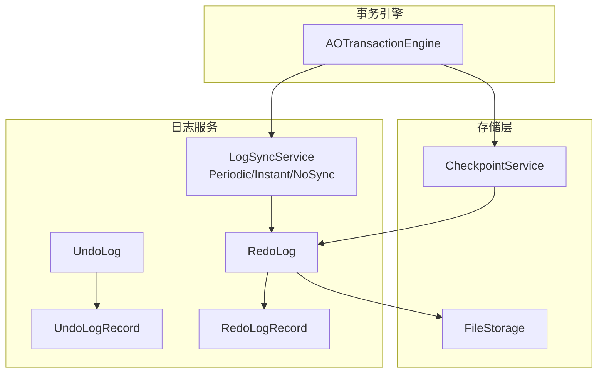
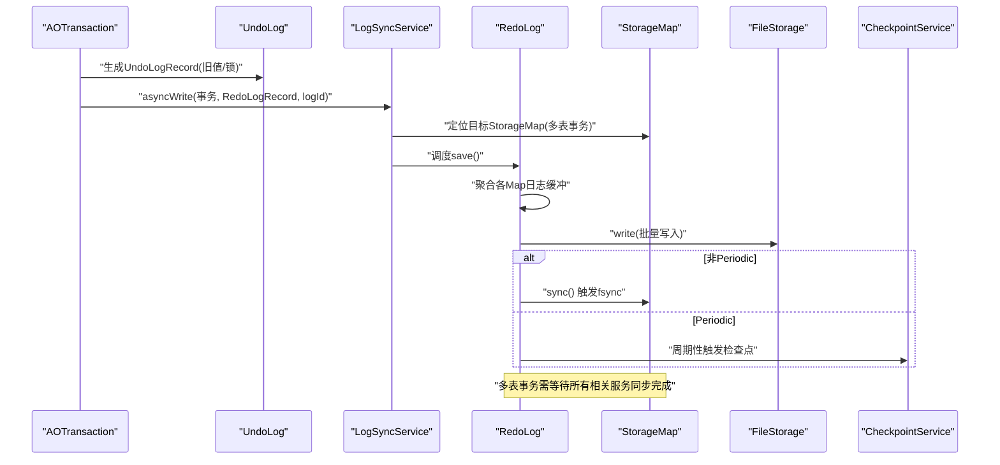
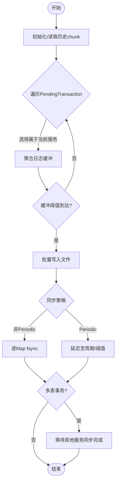
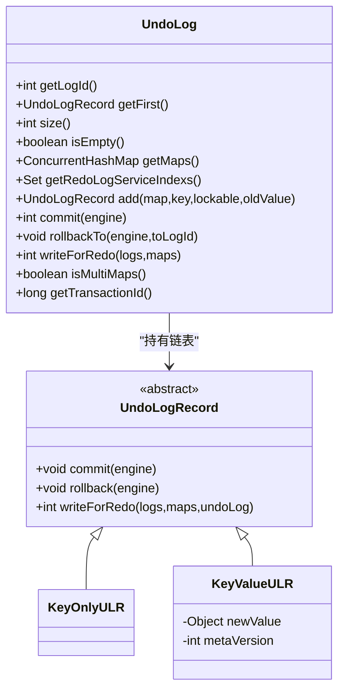
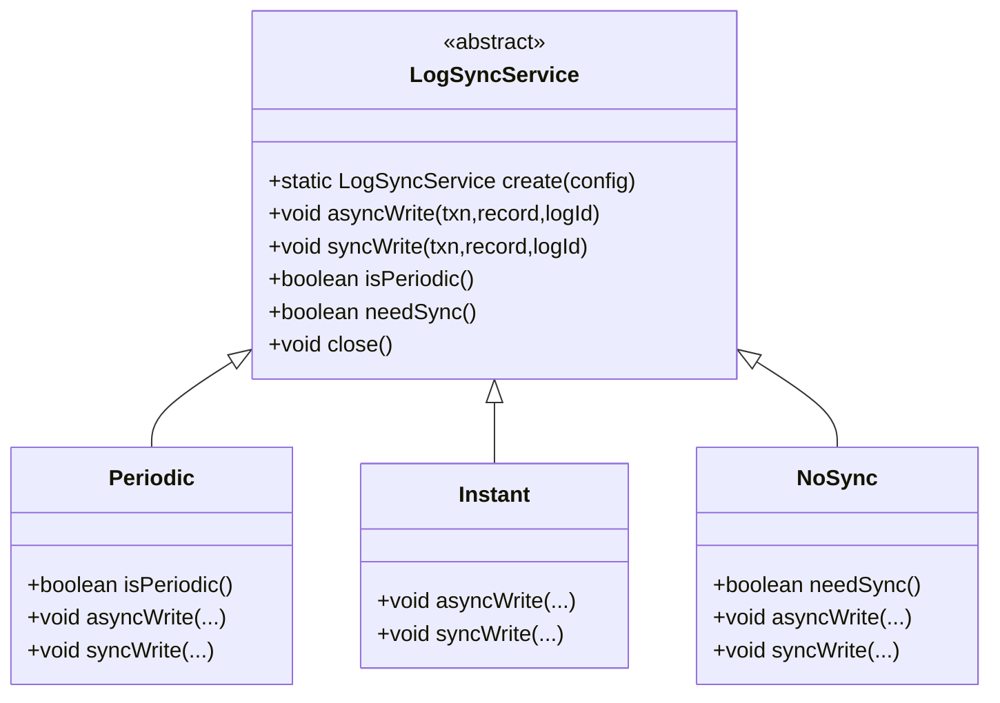
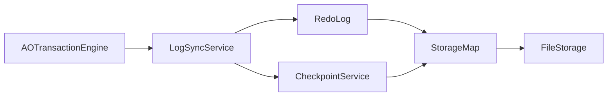

# 事务日志系统

**本文引用的文件列表**
- [RedoLog.java](https://github.com/lealone/Lealone/blob/master/lealone-aote/src/main/java/com/lealone/transaction/aote/log/RedoLog.java)
- [UndoLog.java](https://github.com/lealone/Lealone/blob/master/lealone-aote/src/main/java/com/lealone/transaction/aote/log/UndoLog.java)
- [UndoLogRecord.java](https://github.com/lealone/Lealone/blob/master/lealone-aote/src/main/java/com/lealone/transaction/aote/log/UndoLogRecord.java)
- [RedoLogRecord.java](https://github.com/lealone/Lealone/blob/master/lealone-aote/src/main/java/com/lealone/transaction/aote/log/RedoLogRecord.java)
- [LogSyncService.java](https://github.com/lealone/Lealone/blob/master/lealone-aote/src/main/java/com/lealone/transaction/aote/log/LogSyncService.java)
- [AOTransactionEngine.java](https://github.com/lealone/Lealone/blob/master/lealone-aote/src/main/java/com/lealone/transaction/aote/AOTransactionEngine.java)
- [CheckpointService.java](https://github.com/lealone/Lealone/blob/master/lealone-aote/src/main/java/com/lealone/transaction/aote/CheckpointService.java)
- [FileStorage.java](https://github.com/lealone/Lealone/blob/master/lealone-common/src/main/java/com/lealone/storage/fs/FileStorage.java)
- [TransactionCommitTest.java](https://github.com/lealone/Lealone/blob/master/lealone-test/src/test/java/com/lealone/test/aote/TransactionCommitTest.java)

## 目录
1. [简介](#简介)
2. [项目结构](#项目结构)
3. [核心组件](#核心组件)
4. [架构总览](#架构总览)
5. [详细组件分析](#详细组件分析)
6. [依赖关系分析](#依赖关系分析)
7. [性能考量](#性能考量)
8. [故障排查指南](#故障排查指南)
9. [结论](#结论)
10. [附录](#附录)

## 简介
本文件面向开发者与运维人员，系统化梳理Lealone事务日志子系统的设计与实现，重点覆盖：
- RedoLog：如何记录事务的物理操作以保证持久性，文件存储结构与异步写入机制
- UndoLog：如何记录事务修改前的旧值以支持回滚，内存管理策略
- LogSyncService：如何协调RedoLog的同步策略（Periodic/Instant/NoSync），在数据安全与性能之间权衡
- 通过流程图与序列图展示日志写入、同步与恢复过程，并给出高并发下的性能建议

## 项目结构
事务日志相关代码集中在aote模块的log包下，配合AOTransactionEngine与CheckpointService共同完成事务生命周期内的日志生成、落盘、同步与恢复。

图表来源
- [AOTransactionEngine.java](https://github.com/lealone/Lealone/blob/master/lealone-aote/src/main/java/com/lealone/transaction/aote/AOTransactionEngine.java#L130-L146)
- [LogSyncService.java](https://github.com/lealone/Lealone/blob/master/lealone-aote/src/main/java/com/lealone/transaction/aote/log/LogSyncService.java#L218-L230)
- [RedoLog.java](https://github.com/lealone/Lealone/blob/master/lealone-aote/src/main/java/com/lealone/transaction/aote/log/RedoLog.java#L410-L427)
- [UndoLog.java](https://github.com/lealone/Lealone/blob/master/lealone-aote/src/main/java/com/lealone/transaction/aote/log/UndoLog.java#L67-L91)
- [UndoLogRecord.java](https://github.com/lealone/Lealone/blob/master/lealone-aote/src/main/java/com/lealone/transaction/aote/log/UndoLogRecord.java#L84-L176)
- [RedoLogRecord.java](https://github.com/lealone/Lealone/blob/master/lealone-aote/src/main/java/com/lealone/transaction/aote/log/RedoLogRecord.java#L105-L148)
- [CheckpointService.java](https://github.com/lealone/Lealone/blob/master/lealone-aote/src/main/java/com/lealone/transaction/aote/CheckpointService.java#L237-L260)
- [FileStorage.java](https://github.com/lealone/Lealone/blob/master/lealone-common/src/main/java/com/lealone/storage/fs/FileStorage.java#L264-L276)

章节来源
- [AOTransactionEngine.java](https://github.com/lealone/Lealone/blob/master/lealone-aote/src/main/java/com/lealone/transaction/aote/AOTransactionEngine.java#L130-L146)
- [LogSyncService.java](https://github.com/lealone/Lealone/blob/master/lealone-aote/src/main/java/com/lealone/transaction/aote/log/LogSyncService.java#L218-L230)

## 核心组件
- RedoLog：负责收集各StorageMap的redo日志，批量写入文件并触发fsync；支持历史全局redo日志的兼容重放与新格式的增量重放。
- UndoLog：记录事务修改前的旧值与锁对象，提供commit阶段的内存态提交与rollback阶段的回滚。
- RedoLogRecord/Ulr：定义redo记录的类型与写入格式，支持本地事务记录、LOB操作包装、兼容旧格式的检查点与表删除记录。
- LogSyncService：抽象同步服务，派生出Periodic/Instant/NoSync三种策略，协调异步队列、同步阈值、周期与唤醒逻辑。
- CheckpointService：基于脏页缓存与周期策略触发刷脏页，确保在安全前提下降低fsync频率。

章节来源
- [RedoLog.java](https://github.com/lealone/Lealone/blob/master/lealone-aote/src/main/java/com/lealone/transaction/aote/log/RedoLog.java#L410-L427)
- [UndoLog.java](https://github.com/lealone/Lealone/blob/master/lealone-aote/src/main/java/com/lealone/transaction/aote/log/UndoLog.java#L67-L143)
- [UndoLogRecord.java](https://github.com/lealone/Lealone/blob/master/lealone-aote/src/main/java/com/lealone/transaction/aote/log/UndoLogRecord.java#L84-L176)
- [RedoLogRecord.java](https://github.com/lealone/Lealone/blob/master/lealone-aote/src/main/java/com/lealone/transaction/aote/log/RedoLogRecord.java#L105-L148)
- [LogSyncService.java](https://github.com/lealone/Lealone/blob/master/lealone-aote/src/main/java/com/lealone/transaction/aote/log/LogSyncService.java#L218-L320)
- [CheckpointService.java](https://github.com/lealone/Lealone/blob/master/lealone-aote/src/main/java/com/lealone/transaction/aote/CheckpointService.java#L237-L260)

## 架构总览
事务日志系统围绕“事务—日志—存储”三层协作：
- 事务层：AOTransaction在执行写操作时生成UndoLogRecord，记录旧值与锁对象
- 日志层：LogSyncService接收异步写请求，RedoLog聚合并批量写入，必要时触发fsync
- 存储层：FileStorage负责底层文件写入与对齐校验，CheckpointService控制刷脏页时机

图表来源
- [LogSyncService.java](https://github.com/lealone/Lealone/blob/master/lealone-aote/src/main/java/com/lealone/transaction/aote/log/LogSyncService.java#L186-L203)
- [RedoLog.java](https://github.com/lealone/Lealone/blob/master/lealone-aote/src/main/java/com/lealone/transaction/aote/log/RedoLog.java#L314-L363)
- [CheckpointService.java](https://github.com/lealone/Lealone/blob/master/lealone-aote/src/main/java/com/lealone/transaction/aote/CheckpointService.java#L237-L260)

## 详细组件分析

### RedoLog：持久化与恢复
- 文件存储结构
  - 日志目录由配置项base_dir与redo_log_dir组合，默认位于base_dir/redo_log
  - 采用分块文件命名规则，按递增id顺序读取，保证重放顺序正确
  - 读取时支持兼容旧格式的全局redo日志，随后按新格式增量重放
- 写入与同步
  - save()按调度器队列顺序聚合日志，达到缓冲阈值后批量写入
  - 非Periodic策略即时fsync，Periodic策略延迟至周期或阈值满足后同步
  - 多表事务通过pendingTransactions与RedoLogRecord中的服务索引集合进行跨服务同步协调
- 恢复流程
  - redo()先处理旧版全局redo日志，再读取各StorageMap的增量redo日志
  - 对删除/插入/更新分别执行对应操作，必要时联动索引表

图表来源
- [RedoLog.java](https://github.com/lealone/Lealone/blob/master/lealone-aote/src/main/java/com/lealone/transaction/aote/log/RedoLog.java#L271-L363)
- [RedoLog.java](https://github.com/lealone/Lealone/blob/master/lealone-aote/src/main/java/com/lealone/transaction/aote/log/RedoLog.java#L410-L427)
- [RedoLog.java](https://github.com/lealone/Lealone/blob/master/lealone-aote/src/main/java/com/lealone/transaction/aote/log/RedoLog.java#L429-L451)

章节来源
- [RedoLog.java](https://github.com/lealone/Lealone/blob/master/lealone-aote/src/main/java/com/lealone/transaction/aote/log/RedoLog.java#L74-L118)
- [RedoLog.java](https://github.com/lealone/Lealone/blob/master/lealone-aote/src/main/java/com/lealone/transaction/aote/log/RedoLog.java#L136-L190)
- [RedoLog.java](https://github.com/lealone/Lealone/blob/master/lealone-aote/src/main/java/com/lealone/transaction/aote/log/RedoLog.java#L271-L363)
- [RedoLog.java](https://github.com/lealone/Lealone/blob/master/lealone-aote/src/main/java/com/lealone/transaction/aote/log/RedoLog.java#L410-L451)

### UndoLog：回滚与内存态提交
- 记录结构
  - KeyOnlyULR：仅键无值，用于索引等不需要写redo的场景
  - KeyValueULR：记录新旧值与元信息版本，写redo时使用锁定值快照
- 内存管理
  - 单线程访问，链表结构维护插入顺序，支持从尾部回滚
  - 维护maps集合与服务索引集合，标识涉及的StorageMap与服务索引
- 回滚与提交
  - commit()根据操作类型（insert/delete/update）在内存中完成最终态提交
  - rollbackTo()从尾部向前回滚到指定位置，恢复旧值

图表来源
- [UndoLog.java](https://github.com/lealone/Lealone/blob/master/lealone-aote/src/main/java/com/lealone/transaction/aote/log/UndoLog.java#L22-L143)
- [UndoLogRecord.java](https://github.com/lealone/Lealone/blob/master/lealone-aote/src/main/java/com/lealone/transaction/aote/log/UndoLogRecord.java#L23-L176)

章节来源
- [UndoLog.java](https://github.com/lealone/Lealone/blob/master/lealone-aote/src/main/java/com/lealone/transaction/aote/log/UndoLog.java#L22-L143)
- [UndoLogRecord.java](https://github.com/lealone/Lealone/blob/master/lealone-aote/src/main/java/com/lealone/transaction/aote/log/UndoLogRecord.java#L51-L176)

### LogSyncService：同步策略与异步队列
- 策略类型
  - Periodic：周期性同步，支持“滞后阻塞”策略避免极端情况下丢失过多数据
  - Instant：接近实时同步，满足低延迟需求
  - NoSync：禁用同步，追求极致吞吐但牺牲可靠性
- 异步队列与唤醒
  - asyncWrite()将PendingTransaction加入调度器队列，唤醒对应LogSyncService
  - syncWrite()同步等待完成
- 与CheckpointService协同
  - 在合适时机触发检查点，保障刷脏页与日志同步的平衡

图表来源
- [LogSyncService.java](https://github.com/lealone/Lealone/blob/master/lealone-aote/src/main/java/com/lealone/transaction/aote/log/LogSyncService.java#L218-L320)

章节来源
- [LogSyncService.java](https://github.com/lealone/Lealone/blob/master/lealone-aote/src/main/java/com/lealone/transaction/aote/log/LogSyncService.java#L218-L320)

### RedoLogRecord/UndoLogRecord：格式与兼容
- RedoLogRecord
  - 类型：CheckpointRLR、DroppedMapRLR、LocalTransactionRLR、LobSave
  - 支持旧格式兼容读取与新格式写入
- UndoLogRecord
  - 写redo时按类型输出键/值与元信息，支持多表事务时输出事务ID与涉及的表名集合

章节来源
- [RedoLogRecord.java](https://github.com/lealone/Lealone/blob/master/lealone-aote/src/main/java/com/lealone/transaction/aote/log/RedoLogRecord.java#L23-L187)
- [UndoLogRecord.java](https://github.com/lealone/Lealone/blob/master/lealone-aote/src/main/java/com/lealone/transaction/aote/log/UndoLogRecord.java#L84-L176)

## 依赖关系分析
- AOTransactionEngine负责注册StorageMap到LogSyncService，过滤内存表与索引表不写redo
- LogSyncService持有RedoLog实例，驱动save()与fsync
- RedoLog依赖StorageMap的writeRedoLog/sync接口，以及FileStorage进行文件写入
- CheckpointService在合适时机触发刷脏页，避免频繁fsync影响性能

图表来源
- [AOTransactionEngine.java](https://github.com/lealone/Lealone/blob/master/lealone-aote/src/main/java/com/lealone/transaction/aote/AOTransactionEngine.java#L130-L146)
- [LogSyncService.java](https://github.com/lealone/Lealone/blob/master/lealone-aote/src/main/java/com/lealone/transaction/aote/log/LogSyncService.java#L161-L167)
- [RedoLog.java](https://github.com/lealone/Lealone/blob/master/lealone-aote/src/main/java/com/lealone/transaction/aote/log/RedoLog.java#L410-L427)
- [CheckpointService.java](https://github.com/lealone/Lealone/blob/master/lealone-aote/src/main/java/com/lealone/transaction/aote/CheckpointService.java#L237-L260)

章节来源
- [AOTransactionEngine.java](https://github.com/lealone/Lealone/blob/master/lealone-aote/src/main/java/com/lealone/transaction/aote/AOTransactionEngine.java#L130-L146)
- [LogSyncService.java](https://github.com/lealone/Lealone/blob/master/lealone-aote/src/main/java/com/lealone/transaction/aote/log/LogSyncService.java#L161-L167)
- [RedoLog.java](https://github.com/lealone/Lealone/blob/master/lealone-aote/src/main/java/com/lealone/transaction/aote/log/RedoLog.java#L410-L427)
- [CheckpointService.java](https://github.com/lealone/Lealone/blob/master/lealone-aote/src/main/java/com/lealone/transaction/aote/CheckpointService.java#L237-L260)

## 性能考量
- 同步策略选择
  - Periodic：适合高吞吐场景，通过周期与阈值减少fsync次数，结合CheckpointService刷脏页
  - Instant：适合低延迟场景，每次写入后立即同步
  - NoSync：极致吞吐，风险较高，适用于可容忍短暂丢失的场景
- 缓冲与批量化
  - RedoLog内部缓冲阈值控制批量写入，降低系统调用开销
- 多表事务协调
  - 通过服务索引集合与pendingTransactions确保跨服务一致性后再推进
- 刷脏页策略
  - 基于脏页缓存大小与周期触发，避免频繁fsync导致抖动

章节来源
- [LogSyncService.java](https://github.com/lealone/Lealone/blob/master/lealone-aote/src/main/java/com/lealone/transaction/aote/log/LogSyncService.java#L111-L160)
- [RedoLog.java](https://github.com/lealone/Lealone/blob/master/lealone-aote/src/main/java/com/lealone/transaction/aote/log/RedoLog.java#L314-L363)
- [CheckpointService.java](https://github.com/lealone/Lealone/blob/master/lealone-aote/src/main/java/com/lealone/transaction/aote/CheckpointService.java#L237-L260)

## 故障排查指南
- 日志写入失败
  - 检查FileStorage写入对齐与权限，确认未发生断电检测
  - 关注RedoLog.write()与RedoLog.sync()的异常日志
- 恢复异常
  - 确认历史全局redo日志是否完整，检查RedoLog.init()与readRedoLogRecords()是否正确解析
  - 校验RedoLog.redo()中map名称与事务ID验证逻辑
- 同步策略问题
  - Periodic模式下若出现数据滞后，适当降低log_sync_period或提高redo_log_record_sync_threshold
  - Instant模式下fsync频繁导致延迟升高，考虑切换为Periodic
- 检查点未触发
  - 检查CheckpointService的脏页阈值与周期配置，确认hasPendingTransactions状态

章节来源
- [FileStorage.java](https://github.com/lealone/Lealone/blob/master/lealone-common/src/main/java/com/lealone/storage/fs/FileStorage.java#L264-L276)
- [RedoLog.java](https://github.com/lealone/Lealone/blob/master/lealone-aote/src/main/java/com/lealone/transaction/aote/log/RedoLog.java#L74-L118)
- [LogSyncService.java](https://github.com/lealone/Lealone/blob/master/lealone-aote/src/main/java/com/lealone/transaction/aote/log/LogSyncService.java#L111-L160)
- [CheckpointService.java](https://github.com/lealone/Lealone/blob/master/lealone-aote/src/main/java/com/lealone/transaction/aote/CheckpointService.java#L237-L260)

## 结论
Lealone的事务日志系统通过UndoLog记录旧值、RedoLog持久化物理操作、LogSyncService协调同步策略与CheckpointService刷脏页，实现了在数据安全与系统性能之间的灵活权衡。生产环境可根据业务特性选择合适的同步策略，并结合检查点参数优化整体吞吐与延迟表现。

## 附录
- 使用示例参考
  - 事务提交与异步提交的基本流程可参考测试用例

章节来源
- [TransactionCommitTest.java](https://github.com/lealone/Lealone/blob/master/lealone-test/src/test/java/com/lealone/test/aote/TransactionCommitTest.java#L14-L28)