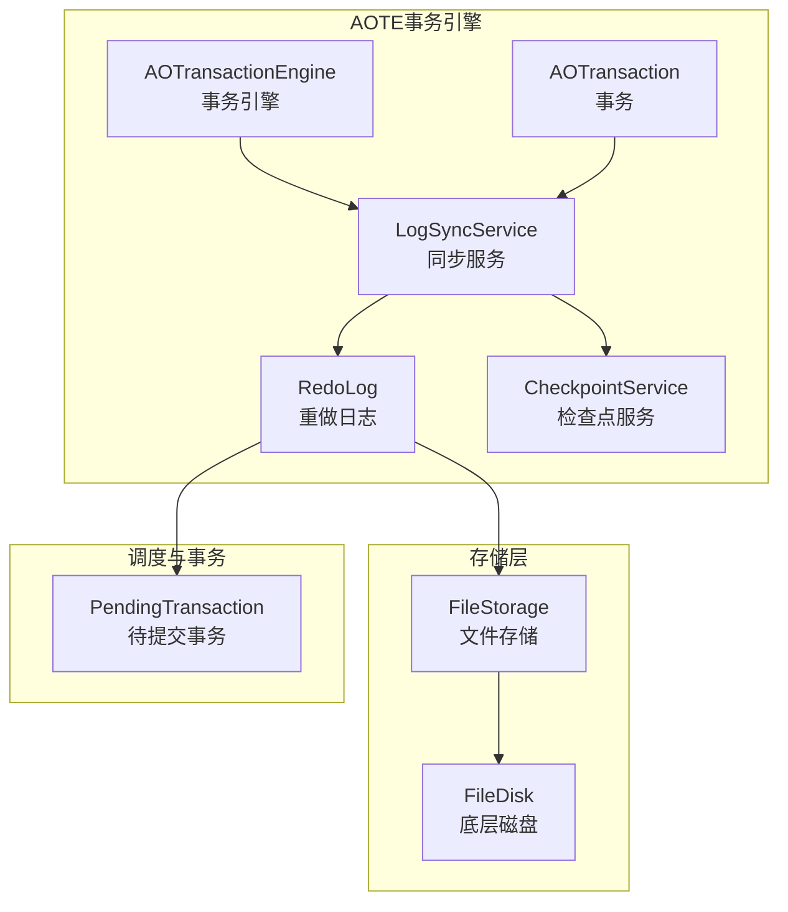
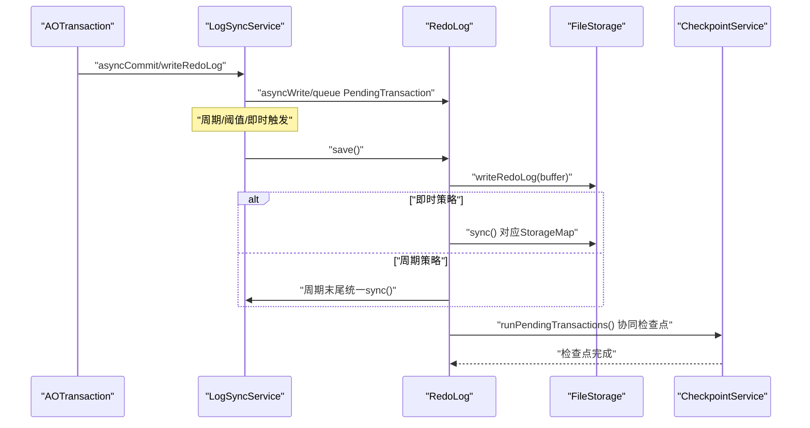
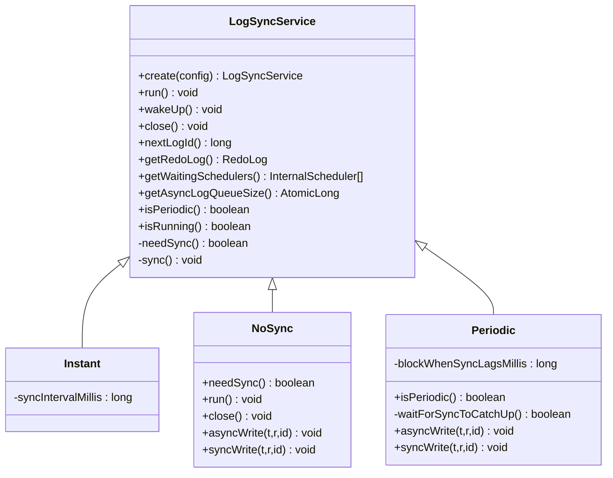
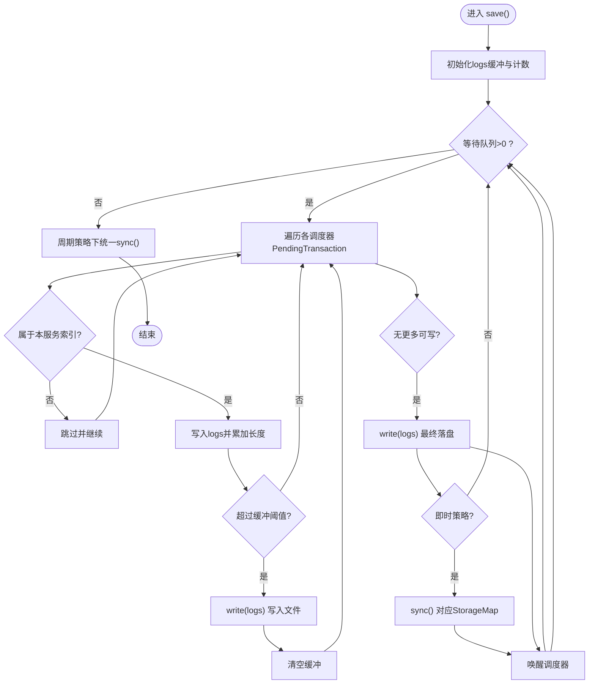
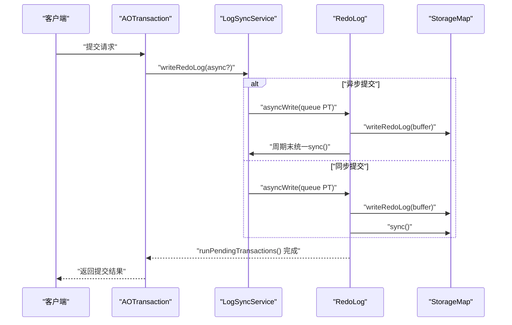
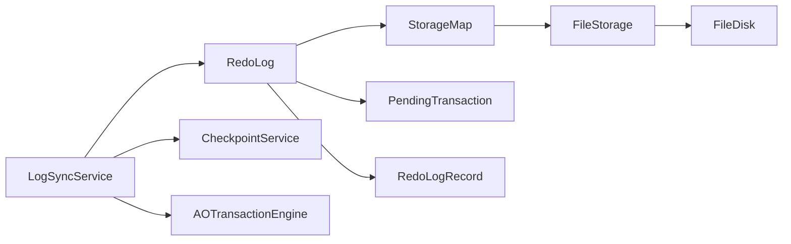

# 日志同步服务

<cite>
**本文引用的文件列表**
- [LogSyncService.java](file://lealone-aote/src/main/java/com/lealone/transaction/aote/log/LogSyncService.java)
- [RedoLog.java](file://lealone-aote/src/main/java/com/lealone/transaction/aote/log/RedoLog.java)
- [RedoLogRecord.java](file://lealone-aote/src/main/java/com/lealone/transaction/aote/log/RedoLogRecord.java)
- [AOTransactionEngine.java](file://lealone-aote/src/main/java/com/lealone/transaction/aote/AOTransactionEngine.java)
- [CheckpointService.java](file://lealone-aote/src/main/java/com/lealone/transaction/aote/CheckpointService.java)
- [AOTransaction.java](file://lealone-aote/src/main/java/com/lealone/transaction/aote/AOTransaction.java)
- [PendingTransaction.java](file://lealone-sci/src/main/java/com/lealone/transaction/PendingTransaction.java)
- [lealone-test.yaml](file://lealone-test/src/test/resources/lealone-test.yaml)
- [FileDisk.java](file://lealone-common/src/main/java/com/lealone/storage/fs/impl/disk/FileDisk.java)
- [FileStorage.java](file://lealone-common/src/main/java/com/lealone/storage/fs/FileStorage.java)
</cite>

## 目录
1. [简介](#简介)
2. [项目结构](#项目结构)
3. [核心组件](#核心组件)
4. [架构总览](#架构总览)
5. [详细组件分析](#详细组件分析)
6. [依赖关系分析](#依赖关系分析)
7. [性能考量](#性能考量)
8. [故障排查指南](#故障排查指南)
9. [结论](#结论)
10. [附录](#附录)

## 简介
本文件围绕日志同步服务LogSyncService展开，系统化说明其在AOTE引擎中的职责与实现，重点覆盖：
- 同步策略：周期性（Periodic）、即时（Instant）、禁用（NoSync）
- 内部机制：刷盘任务调度、I/O批处理、错误处理与重试
- 数据安全与性能权衡：fsync频率对吞吐与延迟的影响
- 配置方法与使用示例路径
- 在不同负载下的行为表现

## 项目结构
LogSyncService位于AOTE事务引擎的日志模块，配合RedoLog、CheckpointService、AOTransactionEngine等组件共同完成事务持久化与恢复。

图表来源
- [LogSyncService.java](file://lealone-aote/src/main/java/com/lealone/transaction/aote/log/LogSyncService.java#L1-L120)
- [RedoLog.java](file://lealone-aote/src/main/java/com/lealone/transaction/aote/log/RedoLog.java#L271-L363)
- [AOTransactionEngine.java](file://lealone-aote/src/main/java/com/lealone/transaction/aote/AOTransactionEngine.java#L290-L311)
- [CheckpointService.java](file://lealone-aote/src/main/java/com/lealone/transaction/aote/CheckpointService.java#L1-L120)
- [AOTransaction.java](file://lealone-aote/src/main/java/com/lealone/transaction/aote/AOTransaction.java#L237-L285)
- [PendingTransaction.java](file://lealone-sci/src/main/java/com/lealone/transaction/PendingTransaction.java#L1-L51)
- [FileStorage.java](file://lealone-common/src/main/java/com/lealone/storage/fs/FileStorage.java#L441-L487)
- [FileDisk.java](file://lealone-common/src/main/java/com/lealone/storage/fs/impl/disk/FileDisk.java#L1-L43)

章节来源
- [LogSyncService.java](file://lealone-aote/src/main/java/com/lealone/transaction/aote/log/LogSyncService.java#L1-L120)
- [AOTransactionEngine.java](file://lealone-aote/src/main/java/com/lealone/transaction/aote/AOTransactionEngine.java#L290-L311)

## 核心组件
- LogSyncService：抽象同步服务，定义三种策略（Periodic/Instant/NoSync），负责周期调度、唤醒、关闭与错误日志。
- RedoLog：重做日志聚合与刷盘，按调度器队列收集待同步事务，进行批处理写入与fsync。
- RedoLogRecord：重做日志记录类型，包含本地事务、检查点、表删除等记录类型。
- CheckpointService：检查点调度与脏页刷写，与LogSyncService协同保障数据安全。
- AOTransaction/AOTransactionEngine：事务发起与提交流程，驱动日志写入与同步。
- PendingTransaction：待提交事务节点，承载事务、记录与同步状态。
- FileStorage/FileDisk：底层文件写入与fsync实现。

章节来源
- [LogSyncService.java](file://lealone-aote/src/main/java/com/lealone/transaction/aote/log/LogSyncService.java#L1-L120)
- [RedoLog.java](file://lealone-aote/src/main/java/com/lealone/transaction/aote/log/RedoLog.java#L271-L363)
- [RedoLogRecord.java](file://lealone-aote/src/main/java/com/lealone/transaction/aote/log/RedoLogRecord.java#L1-L187)
- [CheckpointService.java](file://lealone-aote/src/main/java/com/lealone/transaction/aote/CheckpointService.java#L1-L120)
- [AOTransaction.java](file://lealone-aote/src/main/java/com/lealone/transaction/aote/AOTransaction.java#L237-L285)
- [PendingTransaction.java](file://lealone-sci/src/main/java/com/lealone/transaction/PendingTransaction.java#L1-L51)
- [FileStorage.java](file://lealone-common/src/main/java/com/lealone/storage/fs/FileStorage.java#L441-L487)
- [FileDisk.java](file://lealone-common/src/main/java/com/lealone/storage/fs/impl/disk/FileDisk.java#L1-L43)

## 架构总览
LogSyncService以线程形式运行，周期性或即时地调用RedoLog.save()进行批量刷盘；RedoLog从各调度器的PendingTransaction队列中拉取未同步事务，按缓冲区阈值写入并根据策略决定是否立即fsync；CheckpointService在满足条件时触发脏页刷写，确保数据落盘与内存压力控制。

图表来源
- [AOTransaction.java](file://lealone-aote/src/main/java/com/lealone/transaction/aote/AOTransaction.java#L237-L285)
- [LogSyncService.java](file://lealone-aote/src/main/java/com/lealone/transaction/aote/log/LogSyncService.java#L111-L159)
- [RedoLog.java](file://lealone-aote/src/main/java/com/lealone/transaction/aote/log/RedoLog.java#L271-L363)
- [CheckpointService.java](file://lealone-aote/src/main/java/com/lealone/transaction/aote/CheckpointService.java#L227-L269)

## 详细组件分析

### LogSyncService类图

图表来源
- [LogSyncService.java](file://lealone-aote/src/main/java/com/lealone/transaction/aote/log/LogSyncService.java#L1-L120)
- [LogSyncService.java](file://lealone-aote/src/main/java/com/lealone/transaction/aote/log/LogSyncService.java#L218-L320)

章节来源
- [LogSyncService.java](file://lealone-aote/src/main/java/com/lealone/transaction/aote/log/LogSyncService.java#L1-L120)
- [LogSyncService.java](file://lealone-aote/src/main/java/com/lealone/transaction/aote/log/LogSyncService.java#L218-L320)

### RedoLog刷盘流程（周期/即时）

图表来源
- [RedoLog.java](file://lealone-aote/src/main/java/com/lealone/transaction/aote/log/RedoLog.java#L271-L363)
- [RedoLog.java](file://lealone-aote/src/main/java/com/lealone/transaction/aote/log/RedoLog.java#L410-L427)

章节来源
- [RedoLog.java](file://lealone-aote/src/main/java/com/lealone/transaction/aote/log/RedoLog.java#L271-L363)
- [RedoLog.java](file://lealone-aote/src/main/java/com/lealone/transaction/aote/log/RedoLog.java#L410-L427)

### 同步策略对比与配置
- 周期性（Periodic）
  - 特点：按固定周期执行，周期内允许“提前完成”异步提交，周期末统一fsync。
  - 关键参数：log_sync_period、redo_log_record_sync_threshold。
  - 行为：waitForSyncToCatchUp()用于判断是否需要阻塞等待同步追上。
- 即时（Instant）
  - 特点：每次循环间隔固定，只要队列中有待同步记录即刻fsync。
  - 关键参数：log_sync_service_loop_interval。
- 禁用（NoSync）
  - 特点：不进行fsync，事务在onSynced后直接完成，风险较高。
  - 关键参数：log_sync_type=no_sync。

章节来源
- [LogSyncService.java](file://lealone-aote/src/main/java/com/lealone/transaction/aote/log/LogSyncService.java#L218-L320)
- [lealone-test.yaml](file://lealone-test/src/test/resources/lealone-test.yaml#L25-L33)

### 事务提交与同步时序

图表来源
- [AOTransaction.java](file://lealone-aote/src/main/java/com/lealone/transaction/aote/AOTransaction.java#L237-L285)
- [LogSyncService.java](file://lealone-aote/src/main/java/com/lealone/transaction/aote/log/LogSyncService.java#L111-L159)
- [RedoLog.java](file://lealone-aote/src/main/java/com/lealone/transaction/aote/log/RedoLog.java#L271-L363)

## 依赖关系分析
- LogSyncService依赖：
  - RedoLog：刷盘与fsync
  - CheckpointService：周期性检查点与内存压力控制
  - AOTransactionEngine：事务引擎，提供调度器与服务索引
  - InternalScheduler：待提交事务队列
- RedoLog依赖：
  - StorageMap：写入重做日志与fsync
  - PendingTransaction：事务节点
  - RedoLogRecord：记录类型
- FileStorage/FileDisk：
  - 底层fsync实现（force/sync）

图表来源
- [LogSyncService.java](file://lealone-aote/src/main/java/com/lealone/transaction/aote/log/LogSyncService.java#L1-L120)
- [RedoLog.java](file://lealone-aote/src/main/java/com/lealone/transaction/aote/log/RedoLog.java#L271-L363)
- [AOTransactionEngine.java](file://lealone-aote/src/main/java/com/lealone/transaction/aote/AOTransactionEngine.java#L290-L311)
- [FileStorage.java](file://lealone-common/src/main/java/com/lealone/storage/fs/FileStorage.java#L441-L487)
- [FileDisk.java](file://lealone-common/src/main/java/com/lealone/storage/fs/impl/disk/FileDisk.java#L1-L43)

章节来源
- [LogSyncService.java](file://lealone-aote/src/main/java/com/lealone/transaction/aote/log/LogSyncService.java#L1-L120)
- [RedoLog.java](file://lealone-aote/src/main/java/com/lealone/transaction/aote/log/RedoLog.java#L271-L363)
- [AOTransactionEngine.java](file://lealone-aote/src/main/java/com/lealone/transaction/aote/AOTransactionEngine.java#L290-L311)
- [FileStorage.java](file://lealone-common/src/main/java/com/lealone/storage/fs/FileStorage.java#L441-L487)
- [FileDisk.java](file://lealone-common/src/main/java/com/lealone/storage/fs/impl/disk/FileDisk.java#L1-L43)

## 性能考量
- fsync频率与吞吐/延迟的关系
  - 即时策略：每次循环若队列非空即fsync，延迟低但IO频繁，吞吐受磁盘写入能力限制。
  - 周期策略：按周期统一fsync，缓冲写入减少fsync次数，提升吞吐，但提交延迟增加。
  - 禁用策略：无fsync，延迟最低，但系统崩溃可能导致数据丢失，仅适用于测试或特殊场景。
- 缓冲与批处理
  - RedoLog采用缓冲阈值（默认约16KB）聚合写入，降低系统调用次数。
- 调度器与队列
  - 多调度器并发排队，LogSyncService按调度器索引选择对应事务，避免跨服务争用。
- 检查点与内存压力
  - CheckpointService周期性触发脏页刷写，结合dirty_page_cache_size_in_mb阈值，平衡内存占用与IO开销。

章节来源
- [LogSyncService.java](file://lealone-aote/src/main/java/com/lealone/transaction/aote/log/LogSyncService.java#L111-L159)
- [RedoLog.java](file://lealone-aote/src/main/java/com/lealone/transaction/aote/log/RedoLog.java#L271-L363)
- [CheckpointService.java](file://lealone-aote/src/main/java/com/lealone/transaction/aote/CheckpointService.java#L227-L269)

## 故障排查指南
- 常见问题
  - 刷盘失败：LogSyncService在sync()中捕获异常并记录错误日志，需检查磁盘空间、权限与fsync实现。
  - 提交阻塞：周期策略下waitForSyncToCatchUp()可能阻塞，检查log_sync_period与系统负载。
  - 异步提交未完成：确认PendingTransaction的synced状态与runPendingTransactions()进度。
- 排查步骤
  - 查看日志：定位LogSyncService与RedoLog的错误输出。
  - 检查配置：确认log_sync_type、log_sync_period、log_sync_service_loop_interval、redo_log_record_sync_threshold、dirty_page_cache_size_in_mb。
  - 观察队列：通过getAsyncLogQueueSize()监控待同步事务数量变化。
  - 文件系统：验证FileStorage.sync()与FileDisk.force()行为。

章节来源
- [LogSyncService.java](file://lealone-aote/src/main/java/com/lealone/transaction/aote/log/LogSyncService.java#L161-L167)
- [FileStorage.java](file://lealone-common/src/main/java/com/lealone/storage/fs/FileStorage.java#L441-L487)
- [FileDisk.java](file://lealone-common/src/main/java/com/lealone/storage/fs/impl/disk/FileDisk.java#L1-L43)

## 结论
LogSyncService通过三种同步策略在数据安全与系统性能间提供灵活权衡：周期策略兼顾吞吐与一致性，即时策略降低延迟但增加IO，禁用策略追求极致延迟但牺牲可靠性。配合RedoLog的批处理与CheckpointService的周期刷写，整体形成高效且可控的持久化流水线。

## 附录

### 配置项与使用示例路径
- 基础配置示例（测试配置文件）
  - 位置：[lealone-test.yaml](file://lealone-test/src/test/resources/lealone-test.yaml#L25-L33)
  - 关键项：
    - log_sync_type：periodic/instant/no_sync
    - log_sync_period：周期（毫秒）
    - log_sync_service_loop_interval：即时策略循环间隔（毫秒）
    - redo_log_record_sync_threshold：周期策略阈值
    - dirty_page_cache_size_in_mb：检查点脏页阈值（MB）
- 创建与启动
  - 事务引擎初始化时创建并启动LogSyncService实例：
    - [AOTransactionEngine.java](file://lealone-aote/src/main/java/com/lealone/transaction/aote/AOTransactionEngine.java#L290-L311)
  - LogSyncService工厂方法：
    - [LogSyncService.java](file://lealone-aote/src/main/java/com/lealone/transaction/aote/log/LogSyncService.java#L218-L230)

### 关键流程与数据流
- 事务提交到刷盘
  - [AOTransaction.java](file://lealone-aote/src/main/java/com/lealone/transaction/aote/AOTransaction.java#L237-L285)
  - [LogSyncService.java](file://lealone-aote/src/main/java/com/lealone/transaction/aote/log/LogSyncService.java#L111-L159)
  - [RedoLog.java](file://lealone-aote/src/main/java/com/lealone/transaction/aote/log/RedoLog.java#L271-L363)
- 错误处理与重试
  - [LogSyncService.java](file://lealone-aote/src/main/java/com/lealone/transaction/aote/log/LogSyncService.java#L161-L167)
  - [FileStorage.java](file://lealone-common/src/main/java/com/lealone/storage/fs/FileStorage.java#L441-L487)