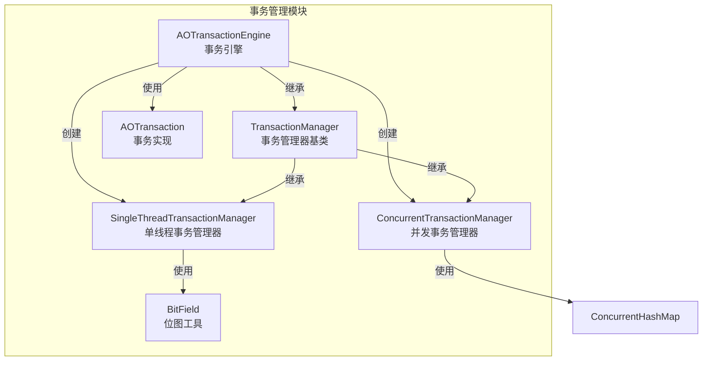
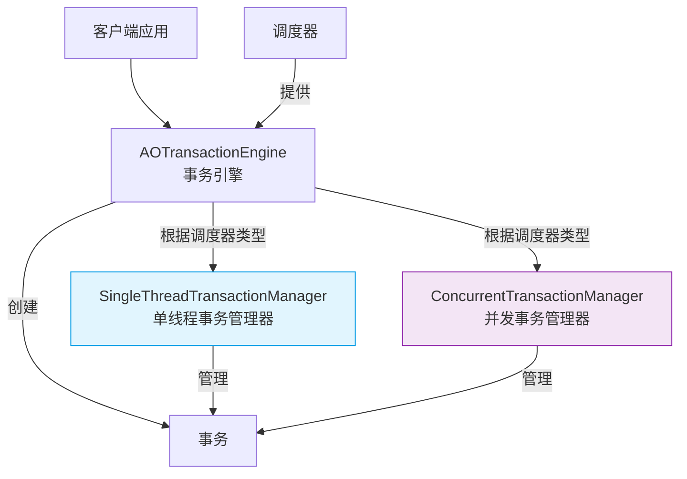
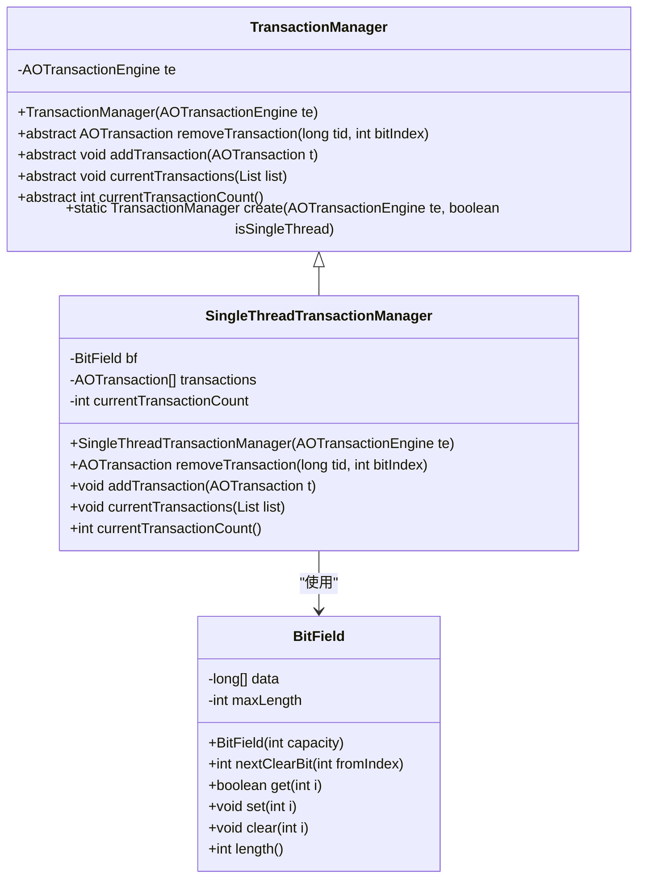
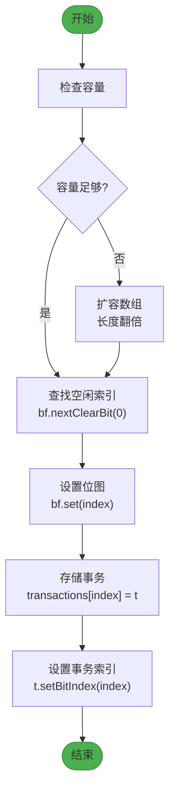
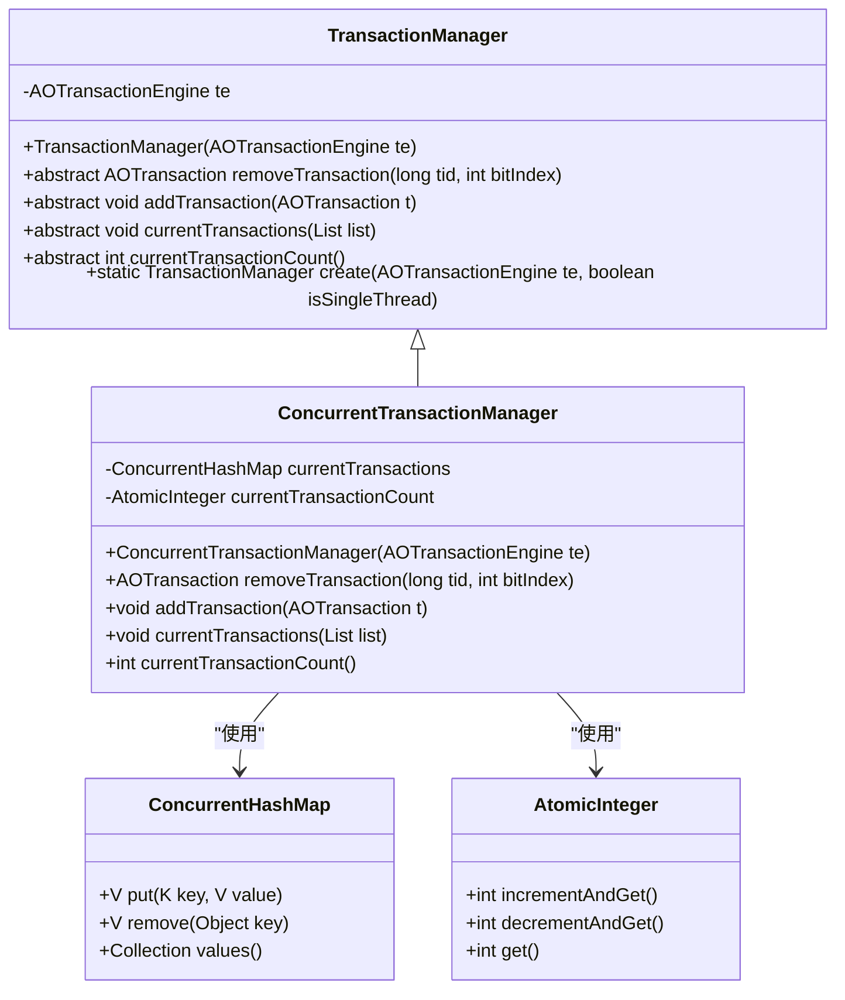
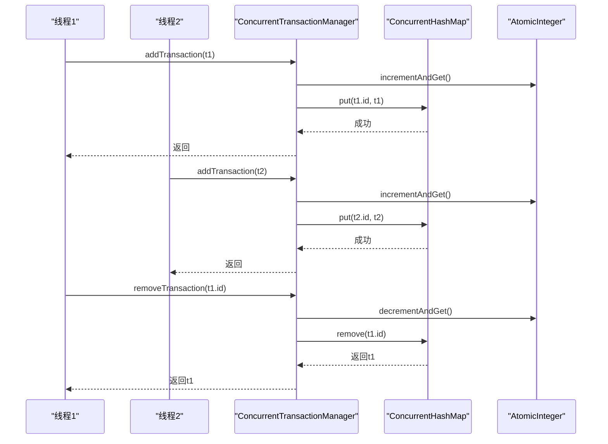
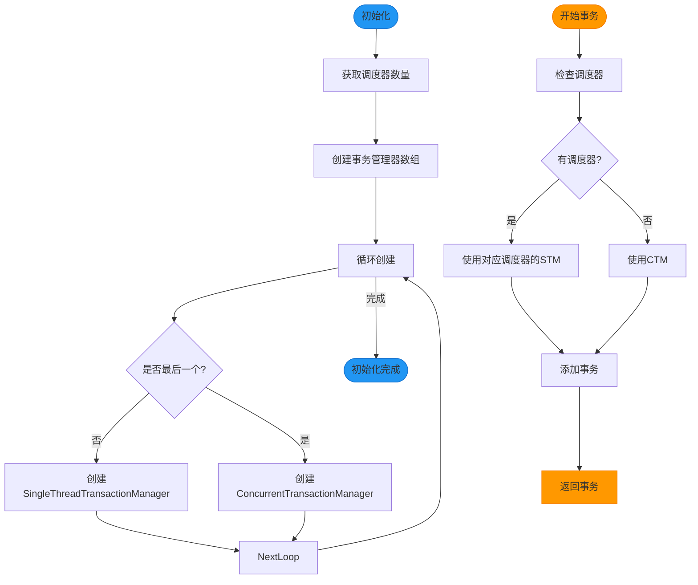
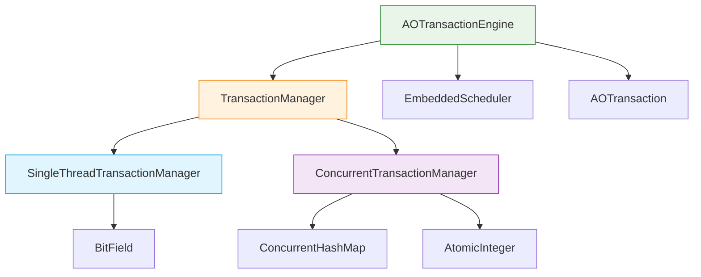

# 事务管理器

<cite>
**本文档引用的文件**   
- [SingleThreadTransactionManager.java](file://lealone-aote/src/main/java/com/lealone/transaction/aote/tm/SingleThreadTransactionManager.java)
- [ConcurrentTransactionManager.java](file://lealone-aote/src/main/java/com/lealone/transaction/aote/tm/ConcurrentTransactionManager.java)
- [TransactionManager.java](file://lealone-aote/src/main/java/com/lealone/transaction/aote/tm/TransactionManager.java)
- [AOTransactionEngine.java](file://lealone-aote/src/main/java/com/lealone/transaction/aote/AOTransactionEngine.java)
- [AOTransaction.java](file://lealone-aote/src/main/java/com/lealone/transaction/aote/AOTransaction.java)
- [BitField.java](file://lealone-common/src/main/java/com/lealone/common/util/BitField.java)
- [EmbeddedScheduler.java](file://lealone-sci/src/main/java/com/lealone/db/scheduler/EmbeddedScheduler.java)
</cite>

## 目录
1. [简介](#简介)
2. [项目结构](#项目结构)
3. [核心组件](#核心组件)
4. [架构概述](#架构概述)
5. [详细组件分析](#详细组件分析)
6. [依赖分析](#依赖分析)
7. [性能考虑](#性能考虑)
8. [故障排除指南](#故障排除指南)
9. [结论](#结论)

## 简介
本文档详细分析了Lealone数据库中事务管理器的实现，重点对比了SingleThreadTransactionManager和ConcurrentTransactionManager两种实现的架构差异和适用场景。文档详细阐述了SingleThreadTransactionManager如何利用单线程调度器的特性，通过位图（BitField）高效管理事务，实现极低的锁竞争。同时，文档解释了ConcurrentTransactionManager如何使用并发哈希表（ConcurrentHashMap）来支持多线程环境下的事务管理，并分析其性能开销。此外，文档说明了AOTransactionEngine如何根据调度器类型选择合适的事务管理器，以及这两种管理器在事务创建、提交和回滚过程中的具体行为。

## 项目结构
Lealone数据库的事务管理器实现在lealone-aote模块中，主要包含事务管理器、事务引擎和相关工具类。事务管理器分为单线程和并发两种实现，分别针对不同的调度器类型进行优化。

**图示来源**
- [AOTransactionEngine.java](file://lealone-aote/src/main/java/com/lealone/transaction/aote/AOTransactionEngine.java#L32-L311)
- [SingleThreadTransactionManager.java](file://lealone-aote/src/main/java/com/lealone/transaction/aote/tm/SingleThreadTransactionManager.java#L14-L64)
- [ConcurrentTransactionManager.java](file://lealone-aote/src/main/java/com/lealone/transaction/aote/tm/ConcurrentTransactionManager.java#L15-L49)

**本节来源**
- [AOTransactionEngine.java](file://lealone-aote/src/main/java/com/lealone/transaction/aote/AOTransactionEngine.java#L32-L311)
- [SingleThreadTransactionManager.java](file://lealone-aote/src/main/java/com/lealone/transaction/aote/tm/SingleThreadTransactionManager.java#L14-L64)
- [ConcurrentTransactionManager.java](file://lealone-aote/src/main/java/com/lealone/transaction/aote/tm/ConcurrentTransactionManager.java#L15-L49)

## 核心组件
事务管理器的核心组件包括事务引擎（AOTransactionEngine）、事务管理器基类（TransactionManager）以及两种具体的事务管理器实现：单线程事务管理器（SingleThreadTransactionManager）和并发事务管理器（ConcurrentTransactionManager）。这些组件协同工作，为数据库提供高效的事务管理能力。

**本节来源**
- [AOTransactionEngine.java](file://lealone-aote/src/main/java/com/lealone/transaction/aote/AOTransactionEngine.java#L32-L311)
- [TransactionManager.java](file://lealone-aote/src/main/java/com/lealone/transaction/aote/tm/TransactionManager.java#L13-L39)

## 架构概述
Lealone数据库的事务管理架构采用分层设计，通过AOTransactionEngine作为事务引擎的入口点，根据调度器类型选择合适的事务管理器。这种设计实现了对单线程和多线程环境的优化支持。

**图示来源**
- [AOTransactionEngine.java](file://lealone-aote/src/main/java/com/lealone/transaction/aote/AOTransactionEngine.java#L217-L224)
- [TransactionManager.java](file://lealone-aote/src/main/java/com/lealone/transaction/aote/tm/TransactionManager.java#L34-L37)

## 详细组件分析

### SingleThreadTransactionManager分析
SingleThreadTransactionManager是为单线程调度器优化的事务管理器实现。它利用位图（BitField）数据结构高效管理事务，避免了多线程环境下的锁竞争问题。

#### 对象导向组件

**图示来源**
- [SingleThreadTransactionManager.java](file://lealone-aote/src/main/java/com/lealone/transaction/aote/tm/SingleThreadTransactionManager.java#L14-L64)
- [BitField.java](file://lealone-common/src/main/java/com/lealone/common/util/BitField.java#L11-L187)

#### 复杂逻辑组件
SingleThreadTransactionManager使用位图来高效管理事务ID的分配和回收。当添加新事务时，它会查找位图中第一个未设置的位作为事务的索引；当移除事务时，它会清除相应的位。

**图示来源**
- [SingleThreadTransactionManager.java](file://lealone-aote/src/main/java/com/lealone/transaction/aote/tm/SingleThreadTransactionManager.java#L36-L47)

**本节来源**
- [SingleThreadTransactionManager.java](file://lealone-aote/src/main/java/com/lealone/transaction/aote/tm/SingleThreadTransactionManager.java#L14-L64)
- [BitField.java](file://lealone-common/src/main/java/com/lealone/common/util/BitField.java#L11-L187)

### ConcurrentTransactionManager分析
ConcurrentTransactionManager是为多线程环境设计的事务管理器实现。它使用并发哈希表（ConcurrentHashMap）来安全地管理跨多个线程的事务。

#### 对象导向组件

**图示来源**
- [ConcurrentTransactionManager.java](file://lealone-aote/src/main/java/com/lealone/transaction/aote/tm/ConcurrentTransactionManager.java#L15-L49)

#### API/服务组件
ConcurrentTransactionManager通过并发安全的数据结构处理多线程环境下的事务操作。添加和移除事务的操作都是线程安全的，无需额外的同步机制。

**图示来源**
- [ConcurrentTransactionManager.java](file://lealone-aote/src/main/java/com/lealone/transaction/aote/tm/ConcurrentTransactionManager.java#L34-L36)

**本节来源**
- [ConcurrentTransactionManager.java](file://lealone-aote/src/main/java/com/lealone/transaction/aote/tm/ConcurrentTransactionManager.java#L15-L49)

### AOTransactionEngine分析
AOTransactionEngine是事务引擎的核心，负责根据调度器类型选择合适的事务管理器，并协调事务的生命周期。

#### 复杂逻辑组件
AOTransactionEngine在初始化时会为每个调度器创建一个SingleThreadTransactionManager实例，并额外创建一个ConcurrentTransactionManager实例用于处理非调度器线程的事务。

**图示来源**
- [AOTransactionEngine.java](file://lealone-aote/src/main/java/com/lealone/transaction/aote/AOTransactionEngine.java#L276-L279)

**本节来源**
- [AOTransactionEngine.java](file://lealone-aote/src/main/java/com/lealone/transaction/aote/AOTransactionEngine.java#L207-L224)

## 依赖分析
事务管理器的实现依赖于多个核心组件，包括调度器、位图工具和并发数据结构。这些依赖关系确保了事务管理器能够在不同环境下高效运行。

**图示来源**
- [AOTransactionEngine.java](file://lealone-aote/src/main/java/com/lealone/transaction/aote/AOTransactionEngine.java#L42-L43)
- [TransactionManager.java](file://lealone-aote/src/main/java/com/lealone/transaction/aote/tm/TransactionManager.java#L34-L37)

**本节来源**
- [AOTransactionEngine.java](file://lealone-aote/src/main/java/com/lealone/transaction/aote/AOTransactionEngine.java#L42-L43)
- [TransactionManager.java](file://lealone-aote/src/main/java/com/lealone/transaction/aote/tm/TransactionManager.java#L34-L37)

## 性能考虑
SingleThreadTransactionManager和ConcurrentTransactionManager在性能特性上有显著差异。SingleThreadTransactionManager由于使用位图和数组，内存占用更小，访问速度更快，且完全避免了锁竞争。而ConcurrentTransactionManager虽然需要更多的内存开销，但提供了真正的并发支持，适合多线程环境。

在单线程或每个线程独立处理事务的场景下，SingleThreadTransactionManager是更优的选择。而在多个线程共享事务或需要跨线程事务协调的场景下，ConcurrentTransactionManager提供了必要的并发安全性。

## 故障排除指南
当遇到事务管理相关问题时，可以检查以下方面：
1. 确认调度器配置是否正确
2. 检查事务管理器的初始化状态
3. 验证事务的创建和销毁是否匹配
4. 监控事务数量是否异常增长

**本节来源**
- [AOTransactionEngine.java](file://lealone-aote/src/main/java/com/lealone/transaction/aote/AOTransactionEngine.java#L150-L189)
- [SingleThreadTransactionManager.java](file://lealone-aote/src/main/java/com/lealone/transaction/aote/tm/SingleThreadTransactionManager.java#L26-L33)

## 结论
Lealone数据库的事务管理器设计体现了对不同并发场景的深刻理解。通过SingleThreadTransactionManager和ConcurrentTransactionManager的双实现策略，系统能够在保持高性能的同时，灵活适应各种部署环境。SingleThreadTransactionManager利用位图技术实现了极低开销的事务管理，特别适合嵌入式和单线程场景；而ConcurrentTransactionManager则通过标准的并发数据结构提供了可靠的多线程支持。AOTransactionEngine作为协调者，智能地根据运行环境选择最合适的管理器，展现了优雅的架构设计。