# 单线程事务管理器

<cite>
**本文引用的文件列表**
- [SingleThreadTransactionManager.java](file://lealone-aote/src/main/java/com/lealone/transaction/aote/tm/SingleThreadTransactionManager.java)
- [TransactionManager.java](file://lealone-aote/src/main/java/com/lealone/transaction/aote/tm/TransactionManager.java)
- [ConcurrentTransactionManager.java](file://lealone-aote/src/main/java/com/lealone/transaction/aote/tm/ConcurrentTransactionManager.java)
- [AOTransactionEngine.java](file://lealone-aote/src/main/java/com/lealone/transaction/aote/AOTransactionEngine.java)
- [AOTransaction.java](file://lealone-aote/src/main/java/com/lealone/transaction/aote/AOTransaction.java)
- [BitField.java](file://lealone-common/src/main/java/com/lealone/common/util/BitField.java)
- [SchedulerThread.java](file://lealone-common/src/main/java/com/lealone/db/scheduler/SchedulerThread.java)
- [EmbeddedScheduler.java](file://lealone-sci/src/main/java/com/lealone/db/scheduler/EmbeddedScheduler.java)
- [TransactionTest.java](file://lealone-test/src/test/java/com/lealone/test/aote/TransactionTest.java)
- [TransactionCommitTest.java](file://lealone-test/src/test/java/com/lealone/test/aote/TransactionCommitTest.java)
- [ConcurrentTransactionTest.java](file://lealone-test/src/test/java/com/lealone/test/aote/ConcurrentTransactionTest.java)
</cite>

## 目录
1. [简介](#简介)
2. [项目结构](#项目结构)
3. [核心组件](#核心组件)
4. [架构总览](#架构总览)
5. [组件详解](#组件详解)
6. [依赖关系分析](#依赖关系分析)
7. [性能与并发特性](#性能与并发特性)
8. [故障排查指南](#故障排查指南)
9. [结论](#结论)
10. [附录](#附录)

## 简介
本文件围绕单线程事务管理器SingleThreadTransactionManager展开，系统性阐述其如何借助单线程调度器的线程绑定特性，结合BitField位图实现事务ID槽位的零锁竞争分配与回收；并深入解析其内部状态机如何跟踪事务生命周期（开始、进行中、提交、回滚），以及位图操作的实现细节（通过位运算快速查找空闲槽位）。文档同时给出事务创建、提交、回滚的调用序列图，并讨论其在高并发写入场景下的性能优势、与AOTransactionEngine的集成方式、适用场景（如嵌入式系统、高吞吐OLTP应用）以及局限性（无法跨线程共享事务）。

## 项目结构
本专题涉及的模块与文件主要位于以下路径：
- lealone-aote：事务引擎与事务管理器实现
- lealone-common：通用工具BitField
- lealone-sci：调度器工厂与嵌入式调度器
- lealone-test：事务功能与并发测试样例

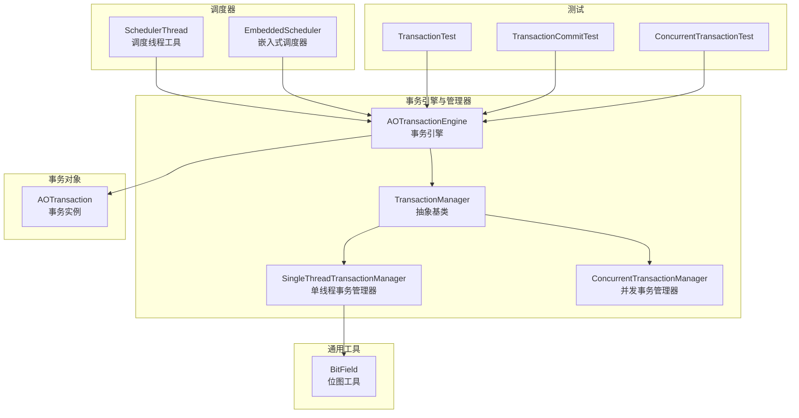

图表来源
- [AOTransactionEngine.java](file://lealone-aote/src/main/java/com/lealone/transaction/aote/AOTransactionEngine.java#L191-L226)
- [TransactionManager.java](file://lealone-aote/src/main/java/com/lealone/transaction/aote/tm/TransactionManager.java#L13-L38)
- [SingleThreadTransactionManager.java](file://lealone-aote/src/main/java/com/lealone/transaction/aote/tm/SingleThreadTransactionManager.java#L14-L63)
- [ConcurrentTransactionManager.java](file://lealone-aote/src/main/java/com/lealone/transaction/aote/tm/ConcurrentTransactionManager.java#L15-L49)
- [AOTransaction.java](file://lealone-aote/src/main/java/com/lealone/transaction/aote/AOTransaction.java#L280-L301)
- [BitField.java](file://lealone-common/src/main/java/com/lealone/common/util/BitField.java#L23-L48)
- [SchedulerThread.java](file://lealone-common/src/main/java/com/lealone/db/scheduler/SchedulerThread.java#L46-L79)
- [EmbeddedScheduler.java](file://lealone-sci/src/main/java/com/lealone/db/scheduler/EmbeddedScheduler.java#L322-L325)
- [TransactionTest.java](file://lealone-test/src/test/java/com/lealone/test/aote/TransactionTest.java#L16-L56)
- [TransactionCommitTest.java](file://lealone-test/src/test/java/com/lealone/test/aote/TransactionCommitTest.java#L14-L28)
- [ConcurrentTransactionTest.java](file://lealone-test/src/test/java/com/lealone/test/aote/ConcurrentTransactionTest.java#L14-L54)

章节来源
- [AOTransactionEngine.java](file://lealone-aote/src/main/java/com/lealone/transaction/aote/AOTransactionEngine.java#L191-L226)
- [SchedulerThread.java](file://lealone-common/src/main/java/com/lealone/db/scheduler/SchedulerThread.java#L46-L79)
- [EmbeddedScheduler.java](file://lealone-sci/src/main/java/com/lealone/db/scheduler/EmbeddedScheduler.java#L322-L325)

## 核心组件
- SingleThreadTransactionManager：基于单线程调度器的事务管理器，使用BitField位图为每个调度线程维护独立的AOTransaction数组，实现零锁竞争的事务槽位分配与回收。
- TransactionManager：事务管理器抽象基类，定义统一接口（添加、移除、列举、计数）。
- ConcurrentTransactionManager：并发事务管理器，使用无锁映射保存事务，适用于非单线程场景。
- AOTransactionEngine：事务引擎，负责事务ID生成、调度器选择、事务管理器实例化与初始化。
- AOTransaction：事务对象，封装事务生命周期、提交/回滚、异步提交回调、锁管理等。
- BitField：位图工具，提供nextClearBit、set、clear等位操作，支持动态扩容。

章节来源
- [SingleThreadTransactionManager.java](file://lealone-aote/src/main/java/com/lealone/transaction/aote/tm/SingleThreadTransactionManager.java#L14-L63)
- [TransactionManager.java](file://lealone-aote/src/main/java/com/lealone/transaction/aote/tm/TransactionManager.java#L13-L38)
- [ConcurrentTransactionManager.java](file://lealone-aote/src/main/java/com/lealone/transaction/aote/tm/ConcurrentTransactionManager.java#L15-L49)
- [AOTransactionEngine.java](file://lealone-aote/src/main/java/com/lealone/transaction/aote/AOTransactionEngine.java#L191-L226)
- [AOTransaction.java](file://lealone-aote/src/main/java/com/lealone/transaction/aote/AOTransaction.java#L280-L301)
- [BitField.java](file://lealone-common/src/main/java/com/lealone/common/util/BitField.java#L23-L48)

## 架构总览
SingleThreadTransactionManager与AOTransactionEngine的协作关系如下：
- AOTransactionEngine根据当前线程是否为调度线程决定绑定哪个事务管理器：
  - 若是调度线程，则绑定对应调度器ID的SingleThreadTransactionManager；
  - 若非调度线程，则绑定最后一个“通用”事务管理器（ConcurrentTransactionManager）。
- SingleThreadTransactionManager为每个调度线程维护独立的AOTransaction数组与BitField位图，避免跨线程竞争。

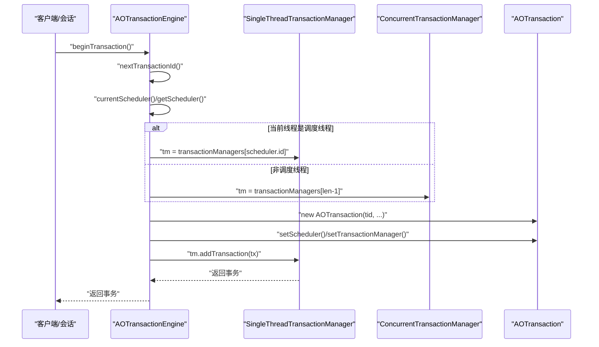

图表来源
- [AOTransactionEngine.java](file://lealone-aote/src/main/java/com/lealone/transaction/aote/AOTransactionEngine.java#L191-L226)
- [SingleThreadTransactionManager.java](file://lealone-aote/src/main/java/com/lealone/transaction/aote/tm/SingleThreadTransactionManager.java#L35-L47)
- [ConcurrentTransactionManager.java](file://lealone-aote/src/main/java/com/lealone/transaction/aote/tm/ConcurrentTransactionManager.java#L25-L37)

## 组件详解

### SingleThreadTransactionManager：零锁竞争的事务槽位管理
- 位图分配与回收
  - 使用BitField位图记录槽位占用状态，分配时通过nextClearBit从低到高扫描首个空闲位，设置位后作为事务槽位索引。
  - 回收时清除位图对应位，减少当前事务计数，释放AOTransaction数组中的槽位。
- 动态数组扩容
  - 当分配的槽位索引超出数组长度时，按2倍扩容并复制旧数组，保证O(1)摊还复杂度。
- 线程绑定与隔离
  - 每个调度线程拥有独立的SingleThreadTransactionManager实例，避免多线程竞争同一数组与位图。
- 与AOTransaction的配合
  - 将分配到的槽位索引写入AOTransaction的bitIndex字段，提交/回滚时通过tid与bitIndex定位并移除事务。

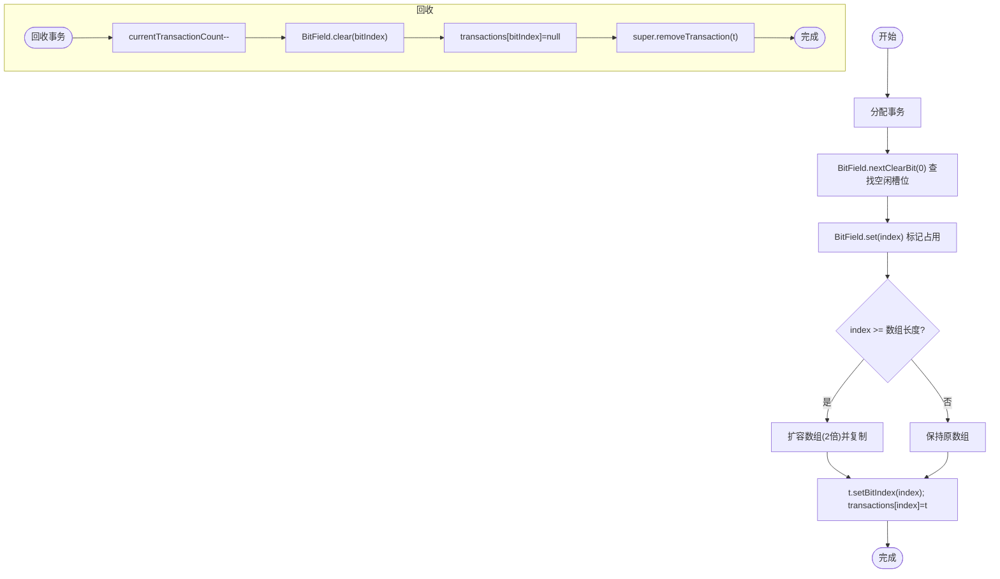

图表来源
- [SingleThreadTransactionManager.java](file://lealone-aote/src/main/java/com/lealone/transaction/aote/tm/SingleThreadTransactionManager.java#L25-L47)
- [BitField.java](file://lealone-common/src/main/java/com/lealone/common/util/BitField.java#L23-L48)

章节来源
- [SingleThreadTransactionManager.java](file://lealone-aote/src/main/java/com/lealone/transaction/aote/tm/SingleThreadTransactionManager.java#L14-L63)
- [BitField.java](file://lealone-common/src/main/java/com/lealone/common/util/BitField.java#L23-L48)

### AOTransactionEngine：调度器选择与事务管理器初始化
- 事务ID生成：使用原子自增生成全局单调递增的事务ID。
- 调度器绑定：
  - 若当前线程是调度线程，绑定对应调度器ID的SingleThreadTransactionManager；
  - 否则绑定最后一个通用事务管理器（ConcurrentTransactionManager）。
- 初始化：根据调度器数量创建多个SingleThreadTransactionManager实例，并初始化日志同步服务。

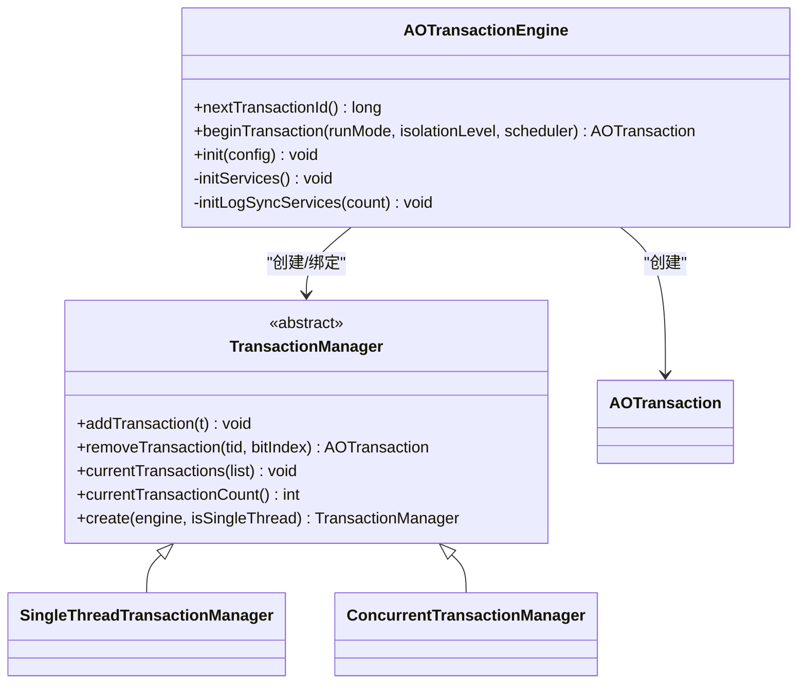

图表来源
- [AOTransactionEngine.java](file://lealone-aote/src/main/java/com/lealone/transaction/aote/AOTransactionEngine.java#L191-L226)
- [TransactionManager.java](file://lealone-aote/src/main/java/com/lealone/transaction/aote/tm/TransactionManager.java#L13-L38)
- [SingleThreadTransactionManager.java](file://lealone-aote/src/main/java/com/lealone/transaction/aote/tm/SingleThreadTransactionManager.java#L14-L63)
- [ConcurrentTransactionManager.java](file://lealone-aote/src/main/java/com/lealone/transaction/aote/tm/ConcurrentTransactionManager.java#L15-L49)
- [AOTransaction.java](file://lealone-aote/src/main/java/com/lealone/transaction/aote/AOTransaction.java#L280-L301)

章节来源
- [AOTransactionEngine.java](file://lealone-aote/src/main/java/com/lealone/transaction/aote/AOTransactionEngine.java#L191-L226)
- [SchedulerThread.java](file://lealone-common/src/main/java/com/lealone/db/scheduler/SchedulerThread.java#L46-L79)
- [EmbeddedScheduler.java](file://lealone-sci/src/main/java/com/lealone/db/scheduler/EmbeddedScheduler.java#L322-L325)

### AOTransaction：事务生命周期与状态机
- 生命周期状态
  - 开始：创建AOTransaction并加入对应事务管理器。
  - 进行中：执行写操作，记录UndoLog。
  - 提交：writeRedoLog -> onSynced -> commitFinal -> 解锁 -> 清理资源。
  - 回滚：rollback -> 清理资源 -> 解锁。
- 关键流程
  - 异步提交：asyncCommit -> writeRedoLog(true) -> 日志异步写入 -> asyncCommitComplete -> commitFinal。
  - 同步提交：commit -> commitLocal -> writeRedoLog(false) -> commitFinal。
  - 提交最终阶段：通过transactionManager.removeTransaction(tid, bitIndex)定位并移除事务，确保提交与槽位回收一致。

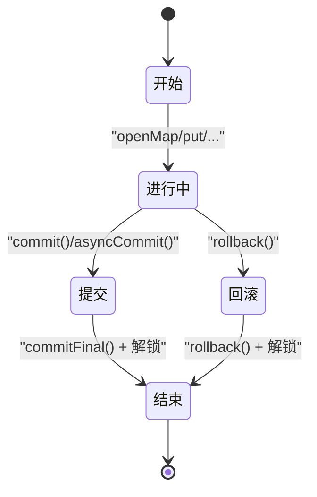

图表来源
- [AOTransaction.java](file://lealone-aote/src/main/java/com/lealone/transaction/aote/AOTransaction.java#L222-L277)
- [AOTransaction.java](file://lealone-aote/src/main/java/com/lealone/transaction/aote/AOTransaction.java#L288-L301)
- [AOTransaction.java](file://lealone-aote/src/main/java/com/lealone/transaction/aote/AOTransaction.java#L341-L351)

章节来源
- [AOTransaction.java](file://lealone-aote/src/main/java/com/lealone/transaction/aote/AOTransaction.java#L222-L277)
- [AOTransaction.java](file://lealone-aote/src/main/java/com/lealone/transaction/aote/AOTransaction.java#L288-L301)
- [AOTransaction.java](file://lealone-aote/src/main/java/com/lealone/transaction/aote/AOTransaction.java#L341-L351)

### 位图操作实现细节
- nextClearBit：从指定起始位置开始，逐块扫描long数组，若整块为全1则跳过，否则在块内逐位查找首个0位，返回索引；若越界则返回块起始索引。
- set/clear：按位掩码设置或清除对应位，支持动态扩容以满足增长需求。
- length：计算最高位+1，便于统计有效长度。

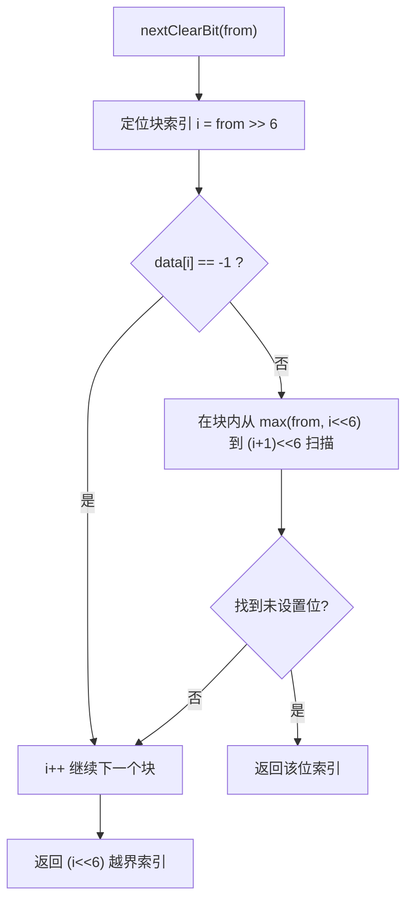

图表来源
- [BitField.java](file://lealone-common/src/main/java/com/lealone/common/util/BitField.java#L23-L48)
- [BitField.java](file://lealone-common/src/main/java/com/lealone/common/util/BitField.java#L100-L120)
- [BitField.java](file://lealone-common/src/main/java/com/lealone/common/util/BitField.java#L132-L139)

章节来源
- [BitField.java](file://lealone-common/src/main/java/com/lealone/common/util/BitField.java#L23-L48)
- [BitField.java](file://lealone-common/src/main/java/com/lealone/common/util/BitField.java#L100-L120)
- [BitField.java](file://lealone-common/src/main/java/com/lealone/common/util/BitField.java#L132-L139)

### 事务创建、提交与回滚的调用序列

#### 创建事务
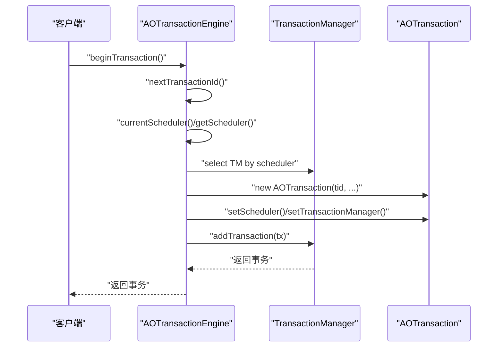

图表来源
- [AOTransactionEngine.java](file://lealone-aote/src/main/java/com/lealone/transaction/aote/AOTransactionEngine.java#L191-L226)
- [SingleThreadTransactionManager.java](file://lealone-aote/src/main/java/com/lealone/transaction/aote/tm/SingleThreadTransactionManager.java#L35-L47)

#### 同步提交
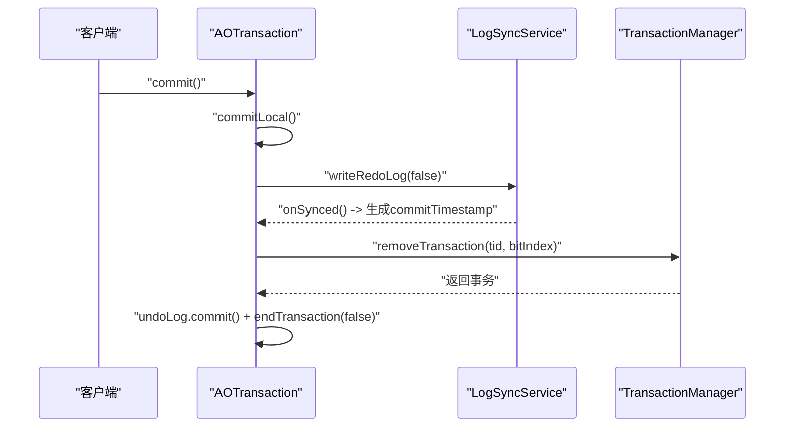

图表来源
- [AOTransaction.java](file://lealone-aote/src/main/java/com/lealone/transaction/aote/AOTransaction.java#L278-L301)
- [AOTransactionEngine.java](file://lealone-aote/src/main/java/com/lealone/transaction/aote/AOTransactionEngine.java#L191-L226)

#### 异步提交
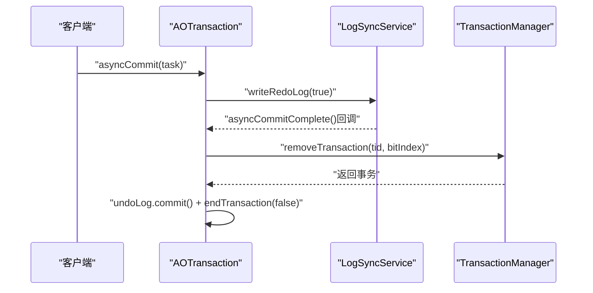

图表来源
- [AOTransaction.java](file://lealone-aote/src/main/java/com/lealone/transaction/aote/AOTransaction.java#L261-L277)
- [AOTransaction.java](file://lealone-aote/src/main/java/com/lealone/transaction/aote/AOTransaction.java#L288-L301)

#### 回滚
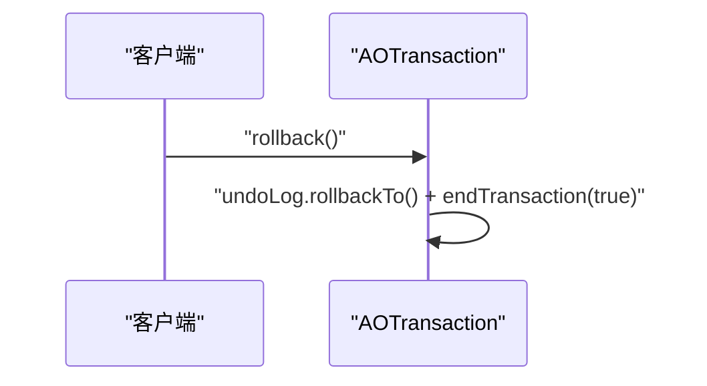

图表来源
- [AOTransaction.java](file://lealone-aote/src/main/java/com/lealone/transaction/aote/AOTransaction.java#L341-L351)

## 依赖关系分析
- 单线程隔离：SingleThreadTransactionManager按调度器ID隔离，避免跨线程共享事务导致的竞争。
- 位图依赖：BitField提供O(1)摊还的槽位分配与回收能力，nextClearBit在最坏情况下为O(k)（k为long数组块数）。
- 并发对比：ConcurrentTransactionManager使用ConcurrentHashMap与AtomicInteger，适合跨线程共享事务但存在锁竞争。
- 调度器绑定：SchedulerThread.currentScheduler与EmbeddedScheduler提供线程绑定与调度器选择逻辑。

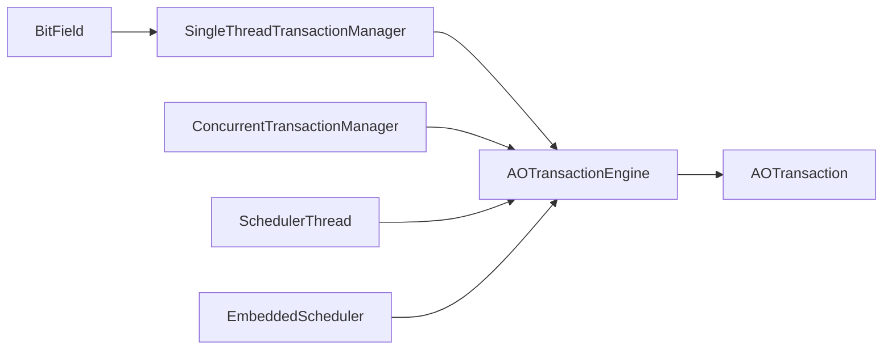

图表来源
- [BitField.java](file://lealone-common/src/main/java/com/lealone/common/util/BitField.java#L23-L48)
- [SingleThreadTransactionManager.java](file://lealone-aote/src/main/java/com/lealone/transaction/aote/tm/SingleThreadTransactionManager.java#L14-L63)
- [AOTransactionEngine.java](file://lealone-aote/src/main/java/com/lealone/transaction/aote/AOTransactionEngine.java#L191-L226)
- [AOTransaction.java](file://lealone-aote/src/main/java/com/lealone/transaction/aote/AOTransaction.java#L280-L301)
- [ConcurrentTransactionManager.java](file://lealone-aote/src/main/java/com/lealone/transaction/aote/tm/ConcurrentTransactionManager.java#L15-L49)
- [SchedulerThread.java](file://lealone-common/src/main/java/com/lealone/db/scheduler/SchedulerThread.java#L46-L79)
- [EmbeddedScheduler.java](file://lealone-sci/src/main/java/com/lealone/db/scheduler/EmbeddedScheduler.java#L322-L325)

章节来源
- [SchedulerThread.java](file://lealone-common/src/main/java/com/lealone/db/scheduler/SchedulerThread.java#L46-L79)
- [EmbeddedScheduler.java](file://lealone-sci/src/main/java/com/lealone/db/scheduler/EmbeddedScheduler.java#L322-L325)

## 性能与并发特性
- 零锁竞争
  - SingleThreadTransactionManager为每个调度线程维护独立数组与位图，避免跨线程竞争，分配/回收均为O(1)摊还。
- 位运算优化
  - BitField使用long数组与位掩码，nextClearBit通过块级跳过与逐位扫描，提升查找效率。
- 与调度器耦合
  - 通过SchedulerThread.currentScheduler绑定线程与调度器，确保事务管理器与线程一一对应，避免上下文切换带来的额外开销。
- 适用场景
  - 嵌入式系统：单线程调度器可简化部署与资源占用。
  - 高吞吐OLTP：单线程事务管理器在写密集场景下具备明显优势，减少锁竞争与上下文切换。
- 局限性
  - 无法跨线程共享事务：非调度线程必须使用通用事务管理器，且事务生命周期需严格限制在发起线程内。

章节来源
- [SingleThreadTransactionManager.java](file://lealone-aote/src/main/java/com/lealone/transaction/aote/tm/SingleThreadTransactionManager.java#L14-L63)
- [BitField.java](file://lealone-common/src/main/java/com/lealone/common/util/BitField.java#L23-L48)
- [AOTransactionEngine.java](file://lealone-aote/src/main/java/com/lealone/transaction/aote/AOTransactionEngine.java#L191-L226)
- [SchedulerThread.java](file://lealone-common/src/main/java/com/lealone/db/scheduler/SchedulerThread.java#L46-L79)

## 故障排查指南
- 事务未正确回收
  - 检查commit/rollback是否调用，确认commitFinal是否执行，以及removeTransaction是否被调用。
- 提交后仍可见未提交数据
  - 确认writeRedoLog是否触发，onSynced是否生成commitTimestamp，以及日志同步服务是否正常运行。
- 非调度线程事务异常
  - 确认SchedulerThread.currentScheduler是否正确绑定调度器，或是否走通用事务管理器路径。
- 测试验证
  - 使用TransactionTest、TransactionCommitTest、ConcurrentTransactionTest验证基本流程与并发行为。

章节来源
- [AOTransaction.java](file://lealone-aote/src/main/java/com/lealone/transaction/aote/AOTransaction.java#L222-L277)
- [AOTransaction.java](file://lealone-aote/src/main/java/com/lealone/transaction/aote/AOTransaction.java#L288-L301)
- [TransactionTest.java](file://lealone-test/src/test/java/com/lealone/test/aote/TransactionTest.java#L16-L56)
- [TransactionCommitTest.java](file://lealone-test/src/test/java/com/lealone/test/aote/TransactionCommitTest.java#L14-L28)
- [ConcurrentTransactionTest.java](file://lealone-test/src/test/java/com/lealone/test/aote/ConcurrentTransactionTest.java#L14-L54)

## 结论
SingleThreadTransactionManager通过“单线程调度器 + BitField位图”的组合，实现了零锁竞争的事务槽位分配与回收，显著降低了高并发写入场景下的竞争开销。AOTransactionEngine在调度器绑定与事务管理器选择上的设计，使单线程事务管理器能够与调度器紧密耦合，进一步提升性能。该实现适用于嵌入式系统与高吞吐OLTP场景，但受限于无法跨线程共享事务，需在应用设计上遵循线程绑定原则。

## 附录
- 代码片段路径参考
  - 事务创建与调度器绑定：[AOTransactionEngine.java](file://lealone-aote/src/main/java/com/lealone/transaction/aote/AOTransactionEngine.java#L191-L226)
  - 单线程槽位分配与回收：[SingleThreadTransactionManager.java](file://lealone-aote/src/main/java/com/lealone/transaction/aote/tm/SingleThreadTransactionManager.java#L25-L47)
  - 位图nextClearBit实现：[BitField.java](file://lealone-common/src/main/java/com/lealone/common/util/BitField.java#L23-L48)
  - 提交与回滚流程：[AOTransaction.java](file://lealone-aote/src/main/java/com/lealone/transaction/aote/AOTransaction.java#L278-L301), [AOTransaction.java](file://lealone-aote/src/main/java/com/lealone/transaction/aote/AOTransaction.java#L341-L351)
  - 并发事务管理器对比：[ConcurrentTransactionManager.java](file://lealone-aote/src/main/java/com/lealone/transaction/aote/tm/ConcurrentTransactionManager.java#L15-L49)
  - 调度器绑定工具：[SchedulerThread.java](file://lealone-common/src/main/java/com/lealone/db/scheduler/SchedulerThread.java#L46-L79), [EmbeddedScheduler.java](file://lealone-sci/src/main/java/com/lealone/db/scheduler/EmbeddedScheduler.java#L322-L325)