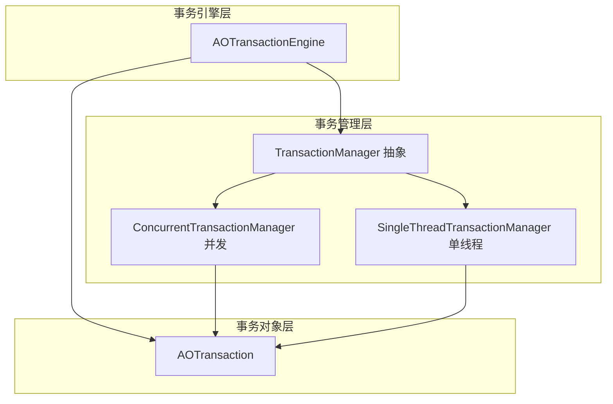
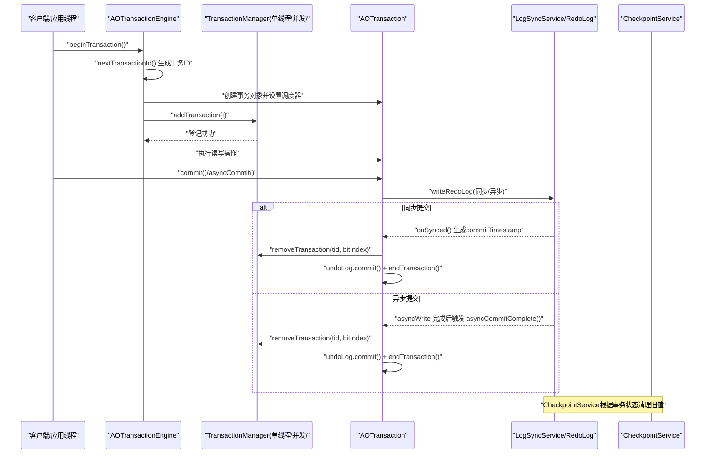
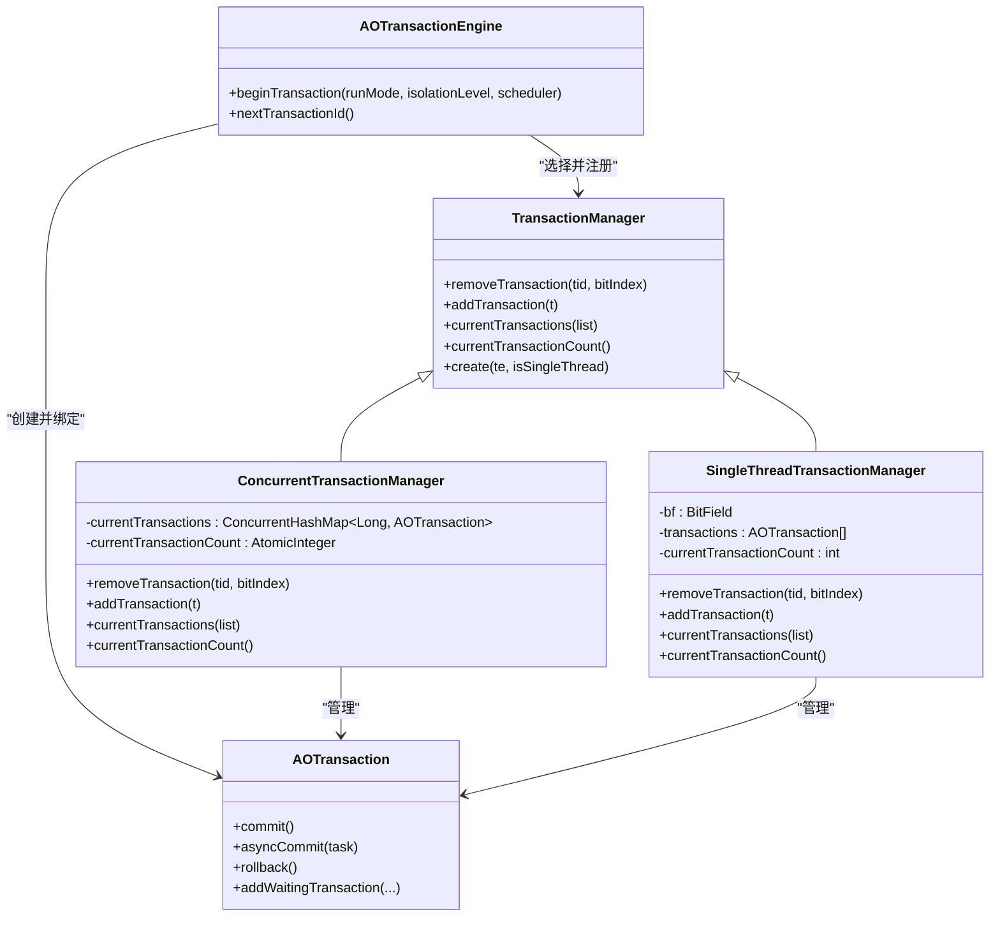
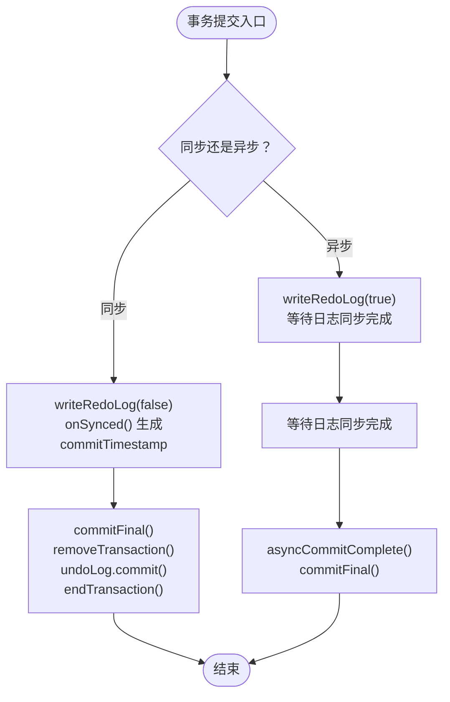
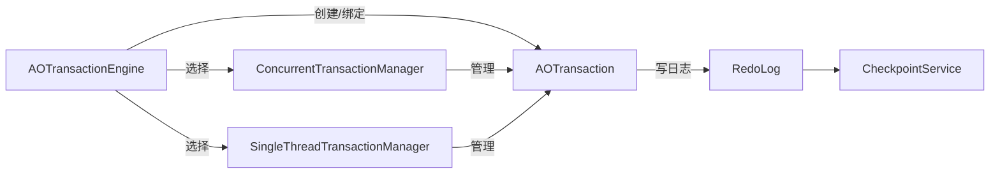

# 并发事务管理器

**本文引用的文件**
- [ConcurrentTransactionManager.java](https://github.com/lealone/Lealone/blob/master/lealone-aote/src/main/java/com/lealone/transaction/aote/tm/ConcurrentTransactionManager.java)
- [SingleThreadTransactionManager.java](https://github.com/lealone/Lealone/blob/master/lealone-aote/src/main/java/com/lealone/transaction/aote/tm/SingleThreadTransactionManager.java)
- [TransactionManager.java](https://github.com/lealone/Lealone/blob/master/lealone-aote/src/main/java/com/lealone/transaction/aote/tm/TransactionManager.java)
- [AOTransactionEngine.java](https://github.com/lealone/Lealone/blob/master/lealone-aote/src/main/java/com/lealone/transaction/aote/AOTransactionEngine.java)
- [AOTransaction.java](https://github.com/lealone/Lealone/blob/master/lealone-aote/src/main/java/com/lealone/transaction/aote/AOTransaction.java)
- [ConcurrentTransactionTest.java](https://github.com/lealone/Lealone/blob/master/lealone-test/src/test/java/com/lealone/test/aote/ConcurrentTransactionTest.java)
- [InternalSchedulerBase.java](https://github.com/lealone/Lealone/blob/master/lealone-sci/src/main/java/com/lealone/db/scheduler/InternalSchedulerBase.java)
- [RedoLog.java](https://github.com/lealone/Lealone/blob/master/lealone-aote/src/main/java/com/lealone/transaction/aote/log/RedoLog.java)
- [CheckpointService.java](https://github.com/lealone/Lealone/blob/master/lealone-aote/src/main/java/com/lealone/transaction/aote/CheckpointService.java)

## 目录
1. [简介](#简介)
2. [项目结构](#项目结构)
3. [核心组件](#核心组件)
4. [架构总览](#架构总览)
5. [组件详解](#组件详解)
6. [依赖关系分析](#依赖关系分析)
7. [性能考量](#性能考量)
8. [故障排查指南](#故障排查指南)
9. [结论](#结论)
10. [附录](#附录)

## 简介
本文件围绕并发事务管理器（ConcurrentTransactionManager）展开，系统性阐述其如何基于ConcurrentHashMap在多线程环境下安全地管理事务，分析线程安全机制与性能开销；解释事务ID生成策略、事务状态并发更新机制（创建、提交、回滚、异步完成），以及在分布式/高并发场景下的适用性与潜在瓶颈，并通过测试用例展示多线程并发行为，对比其与SingleThreadTransactionManager在锁竞争、内存占用与吞吐量上的差异。

## 项目结构
与并发事务管理器直接相关的模块位于 lealone-aote 模块中，核心类包括：
- 事务管理抽象与实现：TransactionManager、SingleThreadTransactionManager、ConcurrentTransactionManager
- 事务引擎：AOTransactionEngine
- 事务对象：AOTransaction
- 测试：ConcurrentTransactionTest

图表来源
- [TransactionManager.java](https://github.com/lealone/Lealone/blob/master/lealone-aote/src/main/java/com/lealone/transaction/aote/tm/TransactionManager.java#L1-L39)
- [SingleThreadTransactionManager.java](https://github.com/lealone/Lealone/blob/master/lealone-aote/src/main/java/com/lealone/transaction/aote/tm/SingleThreadTransactionManager.java#L1-L64)
- [ConcurrentTransactionManager.java](https://github.com/lealone/Lealone/blob/master/lealone-aote/src/main/java/com/lealone/transaction/aote/tm/ConcurrentTransactionManager.java#L1-L49)
- [AOTransactionEngine.java](https://github.com/lealone/Lealone/blob/master/lealone-aote/src/main/java/com/lealone/transaction/aote/AOTransactionEngine.java#L1-L311)
- [AOTransaction.java](https://github.com/lealone/Lealone/blob/master/lealone-aote/src/main/java/com/lealone/transaction/aote/AOTransaction.java#L1-L461)

章节来源
- [TransactionManager.java](https://github.com/lealone/Lealone/blob/master/lealone-aote/src/main/java/com/lealone/transaction/aote/tm/TransactionManager.java#L1-L39)
- [AOTransactionEngine.java](https://github.com/lealone/Lealone/blob/master/lealone-aote/src/main/java/com/lealone/transaction/aote/AOTransactionEngine.java#L1-L311)

## 核心组件
- TransactionManager：事务管理抽象，定义添加、移除、枚举当前事务等接口，并提供工厂方法按是否单线程选择具体实现。
- SingleThreadTransactionManager：基于位图索引的数组存储，适合单线程调度场景，避免全局锁竞争。
- ConcurrentTransactionManager：基于ConcurrentHashMap的并发存储，键为事务ID，值为事务对象，适合多线程并发访问。
- AOTransactionEngine：事务引擎，负责事务ID生成、绑定调度器、选择对应事务管理器实例并注册事务。
- AOTransaction：事务对象，封装提交/回滚、等待/唤醒、异步提交完成回调等逻辑。

章节来源
- [TransactionManager.java](https://github.com/lealone/Lealone/blob/master/lealone-aote/src/main/java/com/lealone/transaction/aote/tm/TransactionManager.java#L1-L39)
- [SingleThreadTransactionManager.java](https://github.com/lealone/Lealone/blob/master/lealone-aote/src/main/java/com/lealone/transaction/aote/tm/SingleThreadTransactionManager.java#L1-L64)
- [ConcurrentTransactionManager.java](https://github.com/lealone/Lealone/blob/master/lealone-aote/src/main/java/com/lealone/transaction/aote/tm/ConcurrentTransactionManager.java#L1-L49)
- [AOTransactionEngine.java](https://github.com/lealone/Lealone/blob/master/lealone-aote/src/main/java/com/lealone/transaction/aote/AOTransactionEngine.java#L1-L311)
- [AOTransaction.java](https://github.com/lealone/Lealone/blob/master/lealone-aote/src/main/java/com/lealone/transaction/aote/AOTransaction.java#L1-L461)

## 架构总览
并发事务管理器的整体流程如下：
- 事务引擎根据当前线程是否绑定调度器决定使用哪个事务管理器实例（单线程或并发）。
- 事务开始时分配自增事务ID，创建事务对象并注册到对应事务管理器。
- 提交/回滚时，先写入重做日志（必要时），再从事务管理器移除事务并释放锁。
- 异步提交通过日志同步服务完成，完成后触发事务对象的异步完成回调。

图表来源
- [AOTransactionEngine.java](https://github.com/lealone/Lealone/blob/master/lealone-aote/src/main/java/com/lealone/transaction/aote/AOTransactionEngine.java#L191-L226)
- [AOTransaction.java](https://github.com/lealone/Lealone/blob/master/lealone-aote/src/main/java/com/lealone/transaction/aote/AOTransaction.java#L222-L301)
- [ConcurrentTransactionManager.java](https://github.com/lealone/Lealone/blob/master/lealone-aote/src/main/java/com/lealone/transaction/aote/tm/ConcurrentTransactionManager.java#L25-L47)
- [SingleThreadTransactionManager.java](https://github.com/lealone/Lealone/blob/master/lealone-aote/src/main/java/com/lealone/transaction/aote/tm/SingleThreadTransactionManager.java#L25-L47)
- [RedoLog.java](https://github.com/lealone/Lealone/blob/master/lealone-aote/src/main/java/com/lealone/transaction/aote/log/RedoLog.java#L370-L408)
- [CheckpointService.java](https://github.com/lealone/Lealone/blob/master/lealone-aote/src/main/java/com/lealone/transaction/aote/CheckpointService.java#L161-L195)

## 组件详解

### 并发事务管理器（ConcurrentTransactionManager）
- 数据结构
  - 使用ConcurrentHashMap<Long, AOTransaction>维护“事务ID -> 事务对象”的映射，键为事务ID。
  - 使用AtomicInteger维护当前活跃事务计数，保证无锁读取。
- 线程安全机制
  - ConcurrentHashMap保证并发读写的安全性，remove/add操作在高并发下具备良好局部性。
  - 当前计数使用原子整型，避免额外锁竞争。
- 关键方法
  - addTransaction：将事务加入映射并计数+1。
  - removeTransaction：计数-1并从映射移除，随后调用父类移除逻辑（如可重复读计数调整）。
  - currentTransactions：将所有值复制到传入列表。
  - currentTransactionCount：返回计数值。
- 与SingleThreadTransactionManager对比
  - SingleThreadTransactionManager使用定长数组+位图索引，适合单线程调度且避免全局锁；并发场景下扩容与位图操作存在竞争。
  - ConcurrentTransactionManager使用哈希表，天然支持多线程并发，但存在哈希冲突与扩容成本。

图表来源
- [TransactionManager.java](https://github.com/lealone/Lealone/blob/master/lealone-aote/src/main/java/com/lealone/transaction/aote/tm/TransactionManager.java#L1-L39)
- [SingleThreadTransactionManager.java](https://github.com/lealone/Lealone/blob/master/lealone-aote/src/main/java/com/lealone/transaction/aote/tm/SingleThreadTransactionManager.java#L1-L64)
- [ConcurrentTransactionManager.java](https://github.com/lealone/Lealone/blob/master/lealone-aote/src/main/java/com/lealone/transaction/aote/tm/ConcurrentTransactionManager.java#L1-L49)
- [AOTransactionEngine.java](https://github.com/lealone/Lealone/blob/master/lealone-aote/src/main/java/com/lealone/transaction/aote/AOTransactionEngine.java#L191-L226)
- [AOTransaction.java](https://github.com/lealone/Lealone/blob/master/lealone-aote/src/main/java/com/lealone/transaction/aote/AOTransaction.java#L222-L301)

章节来源
- [ConcurrentTransactionManager.java](https://github.com/lealone/Lealone/blob/master/lealone-aote/src/main/java/com/lealone/transaction/aote/tm/ConcurrentTransactionManager.java#L1-L49)

### 事务ID生成策略
- AOTransactionEngine通过AtomicLong维护lastTransactionId，nextTransactionId采用递增方式生成全局单调递增的事务ID。
- 该策略简单高效，适合高并发场景，避免UUID等随机ID带来的哈希分布与存储开销问题。
- 事务ID作为ConcurrentHashMap的键，便于快速定位与移除事务对象。

章节来源
- [AOTransactionEngine.java](https://github.com/lealone/Lealone/blob/master/lealone-aote/src/main/java/com/lealone/transaction/aote/AOTransactionEngine.java#L191-L193)

### 事务状态并发更新机制
- 创建：beginTransaction生成事务ID并创建AOTransaction，绑定调度器，选择对应TransactionManager实例并登记。
- 提交：
  - 同步提交：writeRedoLog后调用onSynced生成commitTimestamp，随后commitFinal从事务管理器移除并释放锁。
  - 异步提交：asyncWrite完成后由日志同步服务回调asyncCommitComplete，再执行相同收尾逻辑。
- 回滚：rollbackTo保存点或全量回滚，设置最大提交标记并结束事务，释放锁。
- 等待与唤醒：addWaitingTransaction在被锁时将会话置为等待状态并挂起，事务结束后唤醒等待队列。

图表来源
- [AOTransaction.java](https://github.com/lealone/Lealone/blob/master/lealone-aote/src/main/java/com/lealone/transaction/aote/AOTransaction.java#L222-L301)
- [AOTransactionEngine.java](https://github.com/lealone/Lealone/blob/master/lealone-aote/src/main/java/com/lealone/transaction/aote/AOTransactionEngine.java#L191-L226)

章节来源
- [AOTransaction.java](https://github.com/lealone/Lealone/blob/master/lealone-aote/src/main/java/com/lealone/transaction/aote/AOTransaction.java#L222-L301)

### 超时检测与等待处理
- AOTransaction在addWaitingTransaction中将等待的会话状态置为等待，并记录等待的调度器；若事务在等待期间被提交，会恢复原状态并提示重试。
- 日志同步服务与检查点服务配合，确保事务提交顺序与可见性，避免脏读与不可重复读。
- 内部调度器在有等待任务时主动唤醒，减少空转与饥饿。

章节来源
- [AOTransaction.java](https://github.com/lealone/Lealone/blob/master/lealone-aote/src/main/java/com/lealone/transaction/aote/AOTransaction.java#L311-L351)
- [InternalSchedulerBase.java](https://github.com/lealone/Lealone/blob/master/lealone-sci/src/main/java/com/lealone/db/scheduler/InternalSchedulerBase.java#L123-L155)
- [RedoLog.java](https://github.com/lealone/Lealone/blob/master/lealone-aote/src/main/java/com/lealone/transaction/aote/log/RedoLog.java#L370-L408)

### 多线程并发访问行为示例
- 测试用例展示了两个线程分别执行同步与异步事务操作，验证并发提交与异步完成回调的正确性。

章节来源
- [ConcurrentTransactionTest.java](https://github.com/lealone/Lealone/blob/master/lealone-test/src/test/java/com/lealone/test/aote/ConcurrentTransactionTest.java#L1-L55)

## 依赖关系分析
- AOTransactionEngine
  - 选择并初始化多个TransactionManager实例（单线程按调度器索引，最后一个为并发实例）。
  - beginTransaction根据线程是否绑定调度器选择对应TM实例并登记事务。
- TransactionManager
  - 抽象定义统一接口，具体实现负责并发安全与数据结构选择。
- AOTransaction
  - 与事务管理器解耦，通过removeTransaction(tid, bitIndex)完成移除，bitIndex用于单线程模式的位图索引。
- 日志与检查点
  - RedoLog负责重做日志写入与同步；CheckpointService根据活跃事务状态清理旧值，避免无限增长。

图表来源
- [AOTransactionEngine.java](https://github.com/lealone/Lealone/blob/master/lealone-aote/src/main/java/com/lealone/transaction/aote/AOTransactionEngine.java#L216-L226)
- [ConcurrentTransactionManager.java](https://github.com/lealone/Lealone/blob/master/lealone-aote/src/main/java/com/lealone/transaction/aote/tm/ConcurrentTransactionManager.java#L25-L47)
- [SingleThreadTransactionManager.java](https://github.com/lealone/Lealone/blob/master/lealone-aote/src/main/java/com/lealone/transaction/aote/tm/SingleThreadTransactionManager.java#L25-L47)
- [AOTransaction.java](https://github.com/lealone/Lealone/blob/master/lealone-aote/src/main/java/com/lealone/transaction/aote/AOTransaction.java#L222-L301)
- [RedoLog.java](https://github.com/lealone/Lealone/blob/master/lealone-aote/src/main/java/com/lealone/transaction/aote/log/RedoLog.java#L370-L408)
- [CheckpointService.java](https://github.com/lealone/Lealone/blob/master/lealone-aote/src/main/java/com/lealone/transaction/aote/CheckpointService.java#L161-L195)

章节来源
- [AOTransactionEngine.java](https://github.com/lealone/Lealone/blob/master/lealone-aote/src/main/java/com/lealone/transaction/aote/AOTransactionEngine.java#L216-L226)
- [AOTransaction.java](https://github.com/lealone/Lealone/blob/master/lealone-aote/src/main/java/com/lealone/transaction/aote/AOTransaction.java#L222-L301)

## 性能考量
- 锁竞争
  - SingleThreadTransactionManager：数组+位图，单线程调度下无全局锁竞争，适合低并发或单线程场景。
  - ConcurrentTransactionManager：ConcurrentHashMap在高并发下具备良好局部性，但存在哈希冲突与扩容成本；可通过合理设置初始容量与负载因子降低冲突。
- 内存占用
  - ConcurrentTransactionManager以事务ID为键，键空间随事务数量线性增长；可通过定期清理已完成事务与检查点服务回收旧值降低内存压力。
  - SingleThreadTransactionManager数组扩容按倍数增长，可能造成峰值内存占用较高。
- 吞吐量
  - 并发场景下，ConcurrentTransactionManager在无热点键时具有更好扩展性；单线程场景下SingleThreadTransactionManager更稳定。
- 事务ID生成
  - 自增ID避免哈希分布不均与随机ID的存储开销，适合高并发写入。

章节来源
- [SingleThreadTransactionManager.java](https://github.com/lealone/Lealone/blob/master/lealone-aote/src/main/java/com/lealone/transaction/aote/tm/SingleThreadTransactionManager.java#L25-L47)
- [ConcurrentTransactionManager.java](https://github.com/lealone/Lealone/blob/master/lealone-aote/src/main/java/com/lealone/transaction/aote/tm/ConcurrentTransactionManager.java#L1-L49)
- [AOTransactionEngine.java](https://github.com/lealone/Lealone/blob/master/lealone-aote/src/main/java/com/lealone/transaction/aote/AOTransactionEngine.java#L191-L193)
- [CheckpointService.java](https://github.com/lealone/Lealone/blob/master/lealone-aote/src/main/java/com/lealone/transaction/aote/CheckpointService.java#L161-L195)

## 故障排查指南
- 事务未提交/回滚导致的资源泄漏
  - 确认事务在finally块中执行rollback或在正常路径执行commit。
  - 检查AOTransaction的isClosed与isCommitted状态，避免重复提交。
- 异步提交未触发回调
  - 检查日志同步服务是否运行，确认asyncWrite是否完成；查看内部调度器的runPendingTransactions是否执行。
- 死锁/长时间等待
  - 使用addWaitingTransaction返回码判断是否需要重试；检查是否有事务长时间持有锁。
- 内存增长
  - 触发checkpoint，确认CheckpointService是否清理旧值；检查是否存在大量只读事务未及时清理。

章节来源
- [AOTransaction.java](https://github.com/lealone/Lealone/blob/master/lealone-aote/src/main/java/com/lealone/transaction/aote/AOTransaction.java#L311-L351)
- [InternalSchedulerBase.java](https://github.com/lealone/Lealone/blob/master/lealone-sci/src/main/java/com/lealone/db/scheduler/InternalSchedulerBase.java#L123-L155)
- [AOTransactionEngine.java](https://github.com/lealone/Lealone/blob/master/lealone-aote/src/main/java/com/lealone/transaction/aote/AOTransactionEngine.java#L246-L251)

## 结论
- ConcurrentTransactionManager通过ConcurrentHashMap与原子计数在多线程环境下提供了高效的事务管理能力，适合高并发与分布式场景。
- 与SingleThreadTransactionManager相比，前者在无热点键时具备更好的扩展性，后者在单线程调度下更稳定且内存占用可控。
- 事务ID采用自增策略，结合日志同步与检查点服务，确保提交顺序与可见性；异步提交机制进一步提升吞吐量。
- 在极端高并发下，建议关注哈希冲突与日志同步延迟，合理配置调度器数量与日志同步策略，以获得最佳性能。

## 附录
- 多线程并发行为参考测试用例，验证同步与异步事务在并发线程中的正确性与吞吐表现。

章节来源
- [ConcurrentTransactionTest.java](https://github.com/lealone/Lealone/blob/master/lealone-test/src/test/java/com/lealone/test/aote/ConcurrentTransactionTest.java#L1-L55)