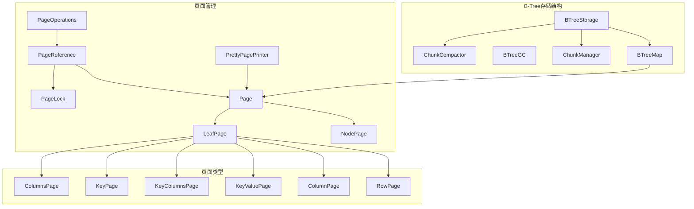
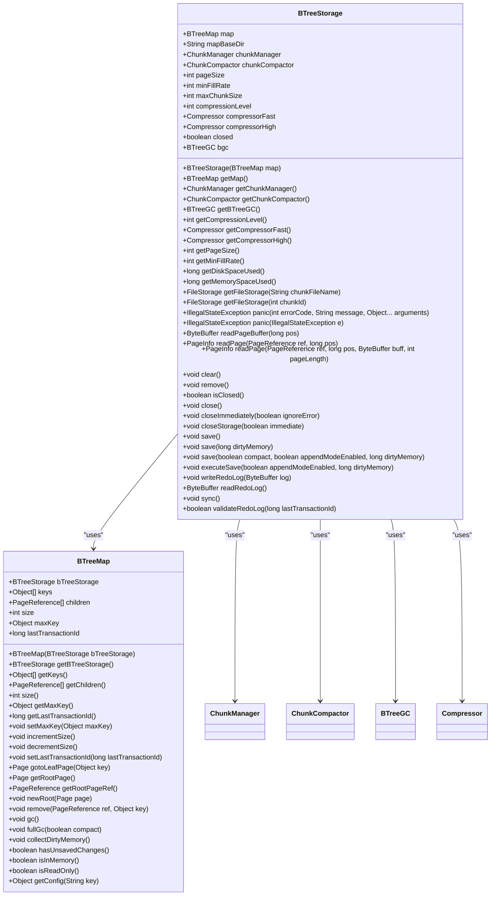
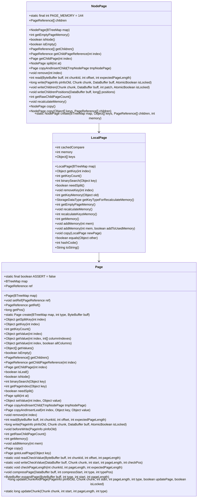
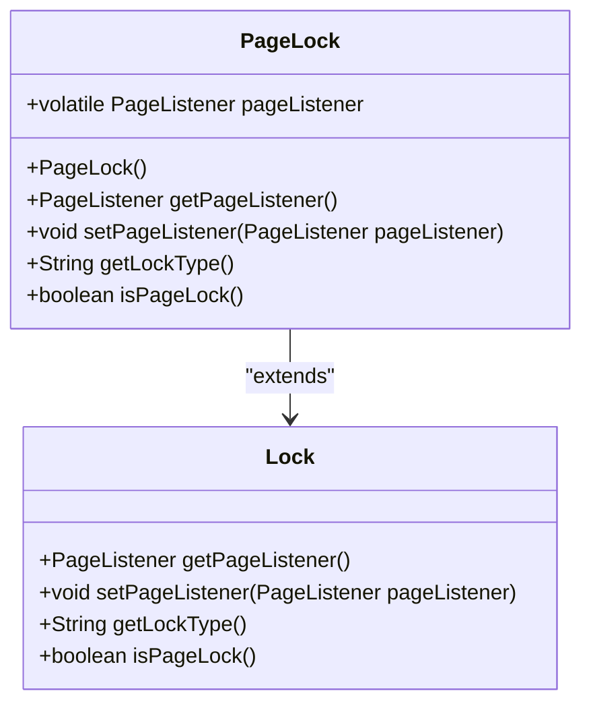
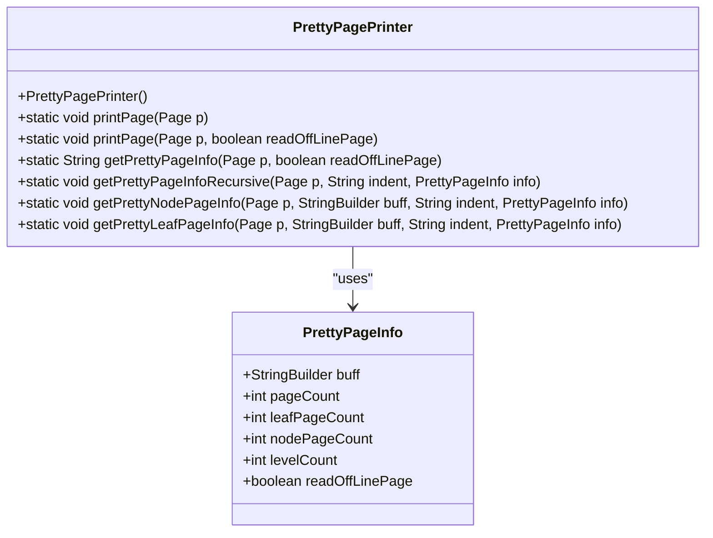
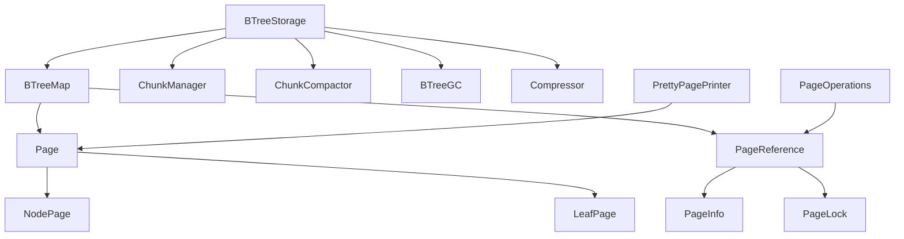

# B-Tree实现


**本文档引用的文件**   
- [BTreeStorage.java](https://github.com/lealone/Lealone/blob/master/lealone-aose/src/main/java/com/lealone/storage/aose/btree/BTreeStorage.java)
- [NodePage.java](https://github.com/lealone/Lealone/blob/master/lealone-aose/src/main/java/com/lealone/storage/aose/btree/page/NodePage.java)
- [LeafPage.java](https://github.com/lealone/Lealone/blob/master/lealone-aose/src/main/java/com/lealone/storage/aose/btree/page/LeafPage.java)
- [PageStorageMode.java](https://github.com/lealone/Lealone/blob/master/lealone-aose/src/main/java/com/lealone/storage/aose/btree/page/PageStorageMode.java)
- [PageLock.java](https://github.com/lealone/Lealone/blob/master/lealone-aose/src/main/java/com/lealone/storage/aose/btree/page/PageLock.java)
- [PageOperations.java](https://github.com/lealone/Lealone/blob/master/lealone-aose/src/main/java/com/lealone/storage/aose/btree/page/PageOperations.java)
- [PageReference.java](https://github.com/lealone/Lealone/blob/master/lealone-aose/src/main/java/com/lealone/storage/aose/btree/page/PageReference.java)
- [PrettyPagePrinter.java](https://github.com/lealone/Lealone/blob/master/lealone-aose/src/main/java/com/lealone/storage/aose/btree/page/PrettyPagePrinter.java)
- [RowPage.java](https://github.com/lealone/Lealone/blob/master/lealone-aose/src/main/java/com/lealone/storage/aose/btree/page/RowPage.java)
- [ColumnPage.java](https://github.com/lealone/Lealone/blob/master/lealone-aose/src/main/java/com/lealone/storage/aose/btree/page/ColumnPage.java)
- [KeyPage.java](https://github.com/lealone/Lealone/blob/master/lealone-aose/src/main/java/com/lealone/storage/aose/btree/page/KeyPage.java)
- [KeyValuePage.java](https://github.com/lealone/Lealone/blob/master/lealone-aose/src/main/java/com/lealone/storage/aose/btree/page/KeyValuePage.java)
- [ColumnsPage.java](https://github.com/lealone/Lealone/blob/master/lealone-aose/src/main/java/com/lealone/storage/aose/btree/page/ColumnsPage.java)
- [KeyColumnsPage.java](https://github.com/lealone/Lealone/blob/master/lealone-aose/src/main/java/com/lealone/storage/aose/btree/page/KeyColumnsPage.java)
- [LocalPage.java](https://github.com/lealone/Lealone/blob/master/lealone-aose/src/main/java/com/lealone/storage/aose/btree/page/LocalPage.java)
- [Page.java](https://github.com/lealone/Lealone/blob/master/lealone-aose/src/main/java/com/lealone/storage/aose/btree/page/Page.java)


## 目录
1. [引言](#引言)
2. [项目结构](#项目结构)
3. [核心组件](#核心组件)
4. [B-Tree存储结构概述](#b-tree存储结构概述)
5. [详细组件分析](#详细组件分析)
6. [依赖分析](#依赖分析)
7. [性能考虑](#性能考虑)
8. [故障排除指南](#故障排除指南)
9. [结论](#结论)

## 引言
本文档深入解析Lealone数据库中B-Tree存储结构的实现。B-Tree是一种自平衡的树数据结构，广泛用于数据库和文件系统中，以实现高效的插入、删除和查找操作。本文档将详细阐述BTreeStorage如何管理B-Tree的整体结构，NodePage和LeafPage的内存与磁盘布局设计，以及它们在读写操作中的协作机制。此外，还将详细说明PageStorageMode中定义的不同存储模式（如行存储、列存储、行列混合存储）的实现原理和性能特征，结合代码示例展示B-Tree的插入、查找、分裂和合并操作流程，分析其在高并发环境下的锁机制（PageLock）和性能优化策略。

## 项目结构
Lealone数据库的B-Tree存储结构主要位于`lealone-aose`模块中，具体路径为`src/main/java/com/lealone/storage/aose/btree`。该目录下包含了B-Tree的核心实现类，如`BTreeStorage`、`BTreeMap`、`BTreeGC`等，以及页面管理相关的类，如`NodePage`、`LeafPage`、`PageReference`等。页面类型根据存储模式的不同，进一步细分为`RowPage`、`ColumnPage`、`KeyValuePage`、`KeyColumnsPage`等。



**图源**
- [BTreeStorage.java](https://github.com/lealone/Lealone/blob/master/lealone-aose/src/main/java/com/lealone/storage/aose/btree/BTreeStorage.java)
- [NodePage.java](https://github.com/lealone/Lealone/blob/master/lealone-aose/src/main/java/com/lealone/storage/aose/btree/page/NodePage.java)
- [LeafPage.java](https://github.com/lealone/Lealone/blob/master/lealone-aose/src/main/java/com/lealone/storage/aose/btree/page/LeafPage.java)
- [PageReference.java](https://github.com/lealone/Lealone/blob/master/lealone-aose/src/main/java/com/lealone/storage/aose/btree/page/PageReference.java)

## 核心组件
B-Tree存储结构的核心组件包括`BTreeStorage`、`BTreeMap`、`NodePage`、`LeafPage`和`PageReference`。`BTreeStorage`负责管理B-Tree的整体结构，包括页面的读写、压缩、垃圾回收等。`BTreeMap`是B-Tree的映射接口，提供了插入、删除、查找等操作。`NodePage`和`LeafPage`分别表示B-Tree的内部节点和叶子节点，它们在内存和磁盘上的布局设计直接影响到B-Tree的性能。`PageReference`用于引用页面，支持页面的缓存和并发访问。

**组件源**
- [BTreeStorage.java](https://github.com/lealone/Lealone/blob/master/lealone-aose/src/main/java/com/lealone/storage/aose/btree/BTreeStorage.java#L35-L414)
- [BTreeMap.java](https://github.com/lealone/Lealone/blob/master/lealone-aose/src/main/java/com/lealone/storage/aose/btree/BTreeMap.java#L1-L100)
- [NodePage.java](https://github.com/lealone/Lealone/blob/master/lealone-aose/src/main/java/com/lealone/storage/aose/btree/page/NodePage.java#L19-L278)
- [LeafPage.java](https://github.com/lealone/Lealone/blob/master/lealone-aose/src/main/java/com/lealone/storage/aose/btree/page/LeafPage.java#L19-L259)
- [PageReference.java](https://github.com/lealone/Lealone/blob/master/lealone-aose/src/main/java/com/lealone/storage/aose/btree/page/PageReference.java#L21-L417)

## B-Tree存储结构概述
B-Tree存储结构通过`BTreeStorage`类进行管理，该类负责B-Tree的整体结构维护，包括页面的读写、压缩、垃圾回收等。`BTreeStorage`通过`ChunkManager`管理数据块，每个数据块包含多个页面。页面的读写操作通过`PageReference`进行，`PageReference`支持页面的缓存和并发访问。`BTreeStorage`还支持页面的压缩，通过`Compressor`接口实现，支持LZF和DEFLATE两种压缩算法。



**图源**
- [BTreeStorage.java](https://github.com/lealone/Lealone/blob/master/lealone-aose/src/main/java/com/lealone/storage/aose/btree/BTreeStorage.java#L35-L414)
- [BTreeMap.java](https://github.com/lealone/Lealone/blob/master/lealone-aose/src/main/java/com/lealone/storage/aose/btree/BTreeMap.java#L1-L100)

## 详细组件分析

### NodePage分析
`NodePage`类表示B-Tree的内部节点，它包含多个子节点的引用和对应的键。`NodePage`的内存布局设计为一个数组，其中键和子节点引用交替存储。当`NodePage`需要分裂时，会创建一个新的`NodePage`，并将一半的键和子节点引用移动到新节点中。`NodePage`的分裂操作是B-Tree保持平衡的关键。



**图源**
- [NodePage.java](https://github.com/lealone/Lealone/blob/master/lealone-aose/src/main/java/com/lealone/storage/aose/btree/page/NodePage.java#L19-L278)
- [LocalPage.java](https://github.com/lealone/Lealone/blob/master/lealone-aose/src/main/java/com/lealone/storage/aose/btree/page/LocalPage.java#L12-L168)
- [Page.java](https://github.com/lealone/Lealone/blob/master/lealone-aose/src/main/java/com/lealone/storage/aose/btree/page/Page.java#L20-L377)

### LeafPage分析
`LeafPage`类表示B-Tree的叶子节点，它包含键值对或仅包含键。`LeafPage`的内存布局设计为两个数组，一个用于存储键，另一个用于存储值。当`LeafPage`需要分裂时，会创建一个新的`LeafPage`，并将一半的键值对移动到新节点中。`LeafPage`的分裂操作是B-Tree保持平衡的关键。

```mermaid
classDiagram
class LeafPage {
+LeafPage(BTreeMap<?, ?> map)
+boolean isLeaf()
+boolean isEmpty()
+Object setValue(int index, Object value)
+void remove(int index)
+Object[] removeValue(int index, Object[] values)
+LeafPage split(int at)
+Object[] splitKeys(int at)
+Object[] splitKeys(int a, int b)
+static Object[][] split(Object[] objs, int a, int b)
+Page copyAndInsertLeaf(int index, Object key, Object value)
+Page copyAndInsertLeaf(int index, Object key, Object value, Object[] values)
+void setPageListener(StorageDataType type, Object value)
+void setPageListener(StorageDataType type, Object[] objs)
+boolean isLocked(Object obj)
+void recalculateMemory()
+LeafPage copy()
+LeafPage copyLeaf(Object[] keys, Object[] values)
+static LeafPage createEmpty(BTreeMap<?, ?> map, boolean addToUsedMemory)
+static LeafPage create(BTreeMap<?, ?> map, Object[] keys, int memory, int pageType)
+static LeafPage create(BTreeMap<?, ?> map, Object[] keys, Object[] values, int memory, int pageType)
+static void initPage(LeafPage p, Object[] keys, Object[] values, int memory)
+static LeafPage create(BTreeMap<?, ?> map, int pageType)
+static long rewrite(BTreeStorage bs, Chunk chunk, DataBuffer buff, long pos)
+static long rewrite(Chunk chunk, DataBuffer buff, ByteBuffer pageBuff, int pageLength, int checkPosOffset, int type)
}
class LocalPage {
+int cachedCompare
+int memory
+Object[] keys
+LocalPage(BTreeMap<?, ?> map)
+Object getKey(int index)
+int getKeyCount()
+int binarySearch(Object key)
+boolean needSplit()
+void removeKey(int index)
+int getKeyMemory(Object old)
+StorageDataType getKeyTypeForRecalculateMemory()
+int getEmptyPageMemory()
+void recalculateMemory()
+int recalculateKeysMemory()
+int getMemory()
+void addMemory(int mem)
+void addMemory(int mem, boolean addToUsedMemory)
+void copy(LocalPage newPage)
+boolean equals(Object other)
+int hashCode()
+String toString()
}
class Page {
+static final boolean ASSERT = false
+BTreeMap<?, ?> map
+PageReference ref
+Page(BTreeMap<?, ?> map)
+void setRef(PageReference ref)
+PageReference getRef()
+long getPos()
+static Page create(BTreeMap<?, ?> map, int type, ByteBuffer buff)
+Object getSplitKey(int index)
+Object getKey(int index)
+int getKeyCount()
+Object getValue(int index)
+Object getValue(int index, int[] columnIndexes)
+Object getValue(int index, boolean allColumns)
+Object[] getValues()
+boolean isEmpty()
+PageReference[] getChildren()
+PageReference getChildPageReference(int index)
+Page getChildPage(int index)
+boolean isLeaf()
+boolean isNode()
+int binarySearch(Object key)
+int getPageIndex(Object key)
+boolean needSplit()
+Page split(int at)
+Object setValue(int index, Object value)
+Page copyAndInsertChild(TmpNodePage tmpNodePage)
+Page copyAndInsertLeaf(int index, Object key, Object value)
+void remove(int index)
+int read(ByteBuffer buff, int chunkId, int offset, int expectedPageLength)
+long write(PageInfo pInfoOld, Chunk chunk, DataBuffer buff, AtomicBoolean isLocked)
+void beforeWrite(PageInfo pInfoOld)
+int getRawChildPageCount()
+int getMemory()
+void addMemory(int mem)
+Page copy()
+Page gotoLeafPage(Object key)
+static void readCheckValue(ByteBuffer buff, int chunkId, int offset, int pageLength)
+static void writeCheckValue(DataBuffer buff, Chunk chunk, int start, int pageLength, int checkPos)
+static void checkPageLength(int chunkId, int pageLength, int expectedPageLength)
+void compressPage(DataBuffer buff, int compressStart, int type, int typePos)
+ByteBuffer expandPage(ByteBuffer buff, int type, int start, int pageLength)
+long updateChunkAndPage(PageInfo pInfoOld, Chunk chunk, int start, int pageLength, int type, boolean updatePage, boolean isLocked)
+static long updateChunk(Chunk chunk, int start, int pageLength, int type)
}
LeafPage --> LocalPage
LocalPage --> Page
```



**图源**
- [LeafPage.java](https://github.com/lealone/Lealone/blob/master/lealone-aose/src/main/java/com/lealone/storage/aose/btree/page/LeafPage.java#L19-L259)
- [LocalPage.java](https://github.com/lealone/Lealone/blob/master/lealone-aose/src/main/java/com/lealone/storage/aose/btree/page/LocalPage.java#L12-L168)
- [Page.java](https://github.com/lealone/Lealone/blob/master/lealone-aose/src/main/java/com/lealone/storage/aose/btree/page/Page.java#L20-L377)

### PageStorageMode分析
`PageStorageMode`枚举定义了不同的存储模式，包括行存储（ROW_STORAGE）和列存储（COLUMN_STORAGE）。行存储模式将每行数据作为一个整体存储，适用于频繁的行级操作。列存储模式将每列数据分开存储，适用于频繁的列级操作。`PageStorageMode`的实现通过`Page`类的`create`方法根据存储模式创建相应的页面类型。

```mermaid
classDiagram
enum PageStorageMode {
ROW_STORAGE
COLUMN_STORAGE
}
class Page {
+static final boolean ASSERT = false
+BTreeMap<?, ?> map
+PageReference ref
+Page(BTreeMap<?, ?> map)
+void setRef(PageReference ref)
+PageReference getRef()
+long getPos()
+static Page create(BTreeMap<?, ?> map, int type, ByteBuffer buff)
+Object getSplitKey(int index)
+Object getKey(int index)
+int getKeyCount()
+Object getValue(int index)
+Object getValue(int index, int[] columnIndexes)
+Object getValue(int index, boolean allColumns)
+Object[] getValues()
+boolean isEmpty()
+PageReference[] getChildren()
+PageReference getChildPageReference(int index)
+Page getChildPage(int index)
+boolean isLeaf()
+boolean isNode()
+int binarySearch(Object key)
+int getPageIndex(Object key)
+boolean needSplit()
+Page split(int at)
+Object setValue(int index, Object value)
+Page copyAndInsertChild(TmpNodePage tmpNodePage)
+Page copyAndInsertLeaf(int index, Object key, Object value)
+void remove(int index)
+int read(ByteBuffer buff, int chunkId, int offset, int expectedPageLength)
+long write(PageInfo pInfoOld, Chunk chunk, DataBuffer buff, AtomicBoolean isLocked)
+void beforeWrite(PageInfo pInfoOld)
+int getRawChildPageCount()
+int getMemory()
+void addMemory(int mem)
+Page copy()
+Page gotoLeafPage(Object key)
+static void readCheckValue(ByteBuffer buff, int chunkId, int offset, int pageLength)
+static void writeCheckValue(DataBuffer buff, Chunk chunk, int start, int pageLength, int checkPos)
+static void checkPageLength(int chunkId, int pageLength, int expectedPageLength)
+void compressPage(DataBuffer buff, int compressStart, int type, int typePos)
+ByteBuffer expandPage(ByteBuffer buff, int type, int start, int pageLength)
+long updateChunkAndPage(PageInfo pInfoOld, Chunk chunk, int start, int pageLength, int type, boolean updatePage, boolean isLocked)
+static long updateChunk(Chunk chunk, int start, int pageLength, int type)
}
PageStorageMode --> Page : "uses"
```

**图源**
- [PageStorageMode.java](https://github.com/lealone/Lealone/blob/master/lealone-aose/src/main/java/com/lealone/storage/aose/btree/page/PageStorageMode.java#L8-L12)
- [Page.java](https://github.com/lealone/Lealone/blob/master/lealone-aose/src/main/java/com/lealone/storage/aose/btree/page/Page.java#L20-L377)

### PageLock分析
`PageLock`类用于实现页面级别的锁机制，支持高并发环境下的读写操作。`PageLock`通过`SchedulerLock`实现，支持非阻塞和阻塞两种模式。`PageLock`的实现确保了在多线程环境下对页面的并发访问是线程安全的。



**图源**
- [PageLock.java](https://github.com/lealone/Lealone/blob/master/lealone-aose/src/main/java/com/lealone/storage/aose/btree/page/PageLock.java#L11-L34)
- [Lock.java](https://github.com/lealone/Lealone/blob/master/lealone-common/src/main/java/com/lealone/db/lock/Lock.java#L1-L10)

### PageOperations分析
`PageOperations`类定义了页面操作的抽象基类，包括写操作（Put、PutIfAbsent、Remove、Append）和子操作（RemovePage、SplitPage）。`PageOperations`通过`PageReference`进行页面的读写操作，支持异步和同步两种模式。`PageOperations`的实现确保了在高并发环境下对页面的并发访问是线程安全的。

```mermaid
classDiagram
class PageOperations {
+PageOperations()
+abstract class WriteOperation<K, V, R> implements PageOperation
+class Put<K, V, R> extends WriteOperation<K, V, R>
+class PutIfAbsent<K, V> extends Put<K, V, V>
+class Append<K, V> extends Put<K, V, K>
+class Remove<K, V> extends WriteOperation<K, V, V>
+abstract class ChildOperation implements PageOperation
+class RemovePage extends ChildOperation
+class SplitPage extends ChildOperation
+class TmpNodePage
}
class WriteOperation {
+BTreeMap<K, V> map
+K key
+AsyncResultHandler<R> resultHandler
+R result
+Page p
+PageReference pRef
+PageListener pListener
+InternalSession currentSession
+WriteOperation(BTreeMap<K, V> map, K key, AsyncResultHandler<R> resultHandler)
+void setResultHandler(AsyncResultHandler<R> resultHandler)
+AsyncResultHandler<R> getResultHandler()
+void setPageReference(PageReference ref)
+InternalSession getSession()
+void setSession(InternalSession session)
+R getResult()
+boolean isPageChanged()
+PageOperationResult run(InternalScheduler scheduler, boolean waitingIfLocked)
+PageOperationResult retry(boolean unlock)
+PageOperationResult writeLocal(InternalScheduler scheduler)
+Object beforeWrite(int index)
+Object writeLocal(int index, InternalScheduler scheduler)
+void insertLeaf(int index, V value)
+Page gotoLeafPage()
+int getKeyIndex()
}
class Put {
+V value
+Put(BTreeMap<K, V> map, K key, V value, AsyncResultHandler<R> resultHandler)
+Object writeLocal(int index, InternalScheduler scheduler)
}
class PutIfAbsent {
+PutIfAbsent(BTreeMap<K, V> map, K key, V value, AsyncResultHandler<V> resultHandler)
+Object beforeWrite(int index)
+Object writeLocal(int index, InternalScheduler scheduler)
}
class Append {
+Append(BTreeMap<K, V> map, V value, AsyncResultHandler<K> resultHandler)
+Page gotoLeafPage()
+int getKeyIndex()
+Object writeLocal(int index, InternalScheduler scheduler)
}
class Remove {
+Remove(BTreeMap<K, V> map, K key, AsyncResultHandler<V> resultHandler)
+Object beforeWrite(int index)
+Object writeLocal(int index, InternalScheduler scheduler)
}
class ChildOperation {
+PageReference pRef
+PageListener oldPageListener
+ChildOperation(InternalSession session, PageReference pRef)
+PageOperationResult run(InternalScheduler scheduler, boolean waitingIfLocked)
+boolean beforeRun()
+PageOperationResult runLocked(InternalScheduler scheduler, boolean waitingIfLocked)
+static boolean tryLockParentRef(PageReference pRef, InternalScheduler scheduler, boolean waitingIfLocked)
}
class RemovePage {
+Object key
+RemovePage(InternalSession session, PageReference pRef, Object key)
+boolean beforeRun()
+PageOperationResult runLocked(InternalScheduler scheduler, boolean waitingIfLocked)
}
class SplitPage {
+SplitPage(InternalSession session, PageReference pRef)
+boolean beforeRun()
+PageOperationResult runLocked(InternalScheduler scheduler, boolean waitingIfLocked)
+static TmpNodePage splitPage(Page p)
+static void replaceParentPage(PageReference parentRef, Page newParent, Page p, TmpNodePage tmpNodePage)
}
class TmpNodePage {
+Page parent
+PageReference left
+PageReference right
+Object key
+TmpNodePage(Page parent, PageReference left, PageReference right, Object key, PageInfo pInfoOld)
}
PageOperations --> WriteOperation
WriteOperation --> Put
WriteOperation --> PutIfAbsent
WriteOperation --> Append
WriteOperation --> Remove
PageOperations --> ChildOperation
ChildOperation --> RemovePage
ChildOperation --> SplitPage
PageOperations --> TmpNodePage
```



**图源**
- [PageOperations.java](https://github.com/lealone/Lealone/blob/master/lealone-aose/src/main/java/com/lealone/storage/aose/btree/page/PageOperations.java#L20-L520)

### PageReference分析
`PageReference`类用于引用页面，支持页面的缓存和并发访问。`PageReference`通过`AtomicReferenceFieldUpdater`实现线程安全的页面引用更新。`PageReference`的实现确保了在多线程环境下对页面的并发访问是线程安全的。


**图源**
- [PageReference.java](https://github.com/lealone/Lealone/blob/master/lealone-aose/src/main/java/com/lealone/storage/aose/btree/page/PageReference.java#L21-L417)
- [PageInfo.java](https://github.com/lealone/Lealone/blob/master/lealone-aose/src/main/java/com/lealone/storage/aose/btree/page/PageInfo.java#L1-L100)

### PrettyPagePrinter分析
`PrettyPagePrinter`类用于打印出漂亮的由页面组成的B-Tree结构，支持在线和离线页面的打印。`PrettyPagePrinter`的实现通过递归遍历B-Tree的节点，生成详细的页面信息。



**图源**
- [PrettyPagePrinter.java](https://github.com/lealone/Lealone/blob/master/lealone-aose/src/main/java/com/lealone/storage/aose/btree/page/PrettyPagePrinter.java#L9-L118)
- [PrettyPageInfo.java](https://github.com/lealone/Lealone/blob/master/lealone-aose/src/main/java/com/lealone/storage/aose/btree/page/PrettyPageInfo.java#L1-L10)

## 依赖分析
B-Tree存储结构的各个组件之间存在紧密的依赖关系。`BTreeStorage`依赖于`BTreeMap`、`ChunkManager`、`ChunkCompactor`和`BTreeGC`，`BTreeMap`依赖于`Page`和`PageReference`，`Page`依赖于`NodePage`和`LeafPage`，`PageReference`依赖于`PageInfo`和`PageLock`。这些依赖关系确保了B-Tree存储结构的各个组件能够协同工作，实现高效的插入、删除和查找操作。



**图源**
- [BTreeStorage.java](https://github.com/lealone/Lealone/blob/master/lealone-aose/src/main/java/com/lealone/storage/aose/btree/BTreeStorage.java#L35-L414)
- [BTreeMap.java](https://github.com/lealone/Lealone/blob/master/lealone-aose/src/main/java/com/lealone/storage/aose/btree/BTreeMap.java#L1-L100)
- [Page.java](https://github.com/lealone/Lealone/blob/master/lealone-aose/src/main/java/com/lealone/storage/aose/btree/page/Page.java#L20-L377)
- [PageReference.java](https://github.com/lealone/Lealone/blob/master/lealone-aose/src/main/java/com/lealone/storage/aose/btree/page/PageReference.java#L21-L417)
- [PageInfo.java](https://github.com/lealone/Lealone/blob/master/lealone-aose/src/main/java/com/lealone/storage/aose/btree/page/PageInfo.java#L1-L100)
- [PageLock.java](https://github.com/lealone/Lealone/blob/master/lealone-aose/src/main/java/com/lealone/storage/aose/btree/page/PageLock.java#L11-L34)
- [PageOperations.java](https://github.com/lealone/Lealone/blob/master/lealone-aose/src/main/java/com/lealone/storage/aose/btree/page/PageOperations.java#L20-L520)
- [PrettyPagePrinter.java](https://github.com/lealone/Lealone/blob/master/lealone-aose/src/main/java/com/lealone/storage/aose/btree/page/PrettyPagePrinter.java#L9-L118)

## 性能考虑
B-Tree存储结构在设计时充分考虑了性能优化。通过页面的压缩和缓存机制，减少了磁盘I/O操作，提高了读写性能。`BTreeStorage`支持页面的异步写入，减少了写操作的延迟。`PageReference`通过`AtomicReferenceFieldUpdater`实现线程安全的页面引用更新，确保了在高并发环境下的性能。`PageOperations`通过`SchedulerLock`实现非阻塞和阻塞两种模式，支持高并发环境下的读写操作。

## 故障排除指南
在使用B-Tree存储结构时，可能会遇到一些常见问题。例如，页面分裂失败、页面合并失败、页面读写失败等。这些问题通常可以通过检查日志文件、调试代码、优化配置等方式解决。`PrettyPagePrinter`类提供了详细的页面信息打印功能，有助于快速定位问题。

**组件源**
- [PrettyPagePrinter.java](https://github.com/lealone/Lealone/blob/master/lealone-aose/src/main/java/com/lealone/storage/aose/btree/page/PrettyPagePrinter.java#L9-L118)

## 结论
本文档详细解析了Lealone数据库中B-Tree存储结构的实现。通过深入分析`BTreeStorage`、`BTreeMap`、`NodePage`、`LeafPage`、`PageReference`等核心组件，阐述了B-Tree的整体结构、页面的内存与磁盘布局设计、以及它们在读写操作中的协作机制。此外，还详细说明了`PageStorageMode`中定义的不同存储模式的实现原理和性能特征，结合代码示例展示了B-Tree的插入、查找、分裂和合并操作流程，分析了其在高并发环境下的锁机制和性能优化策略。希望本文档能帮助开发者更好地理解和使用B-Tree存储结构。