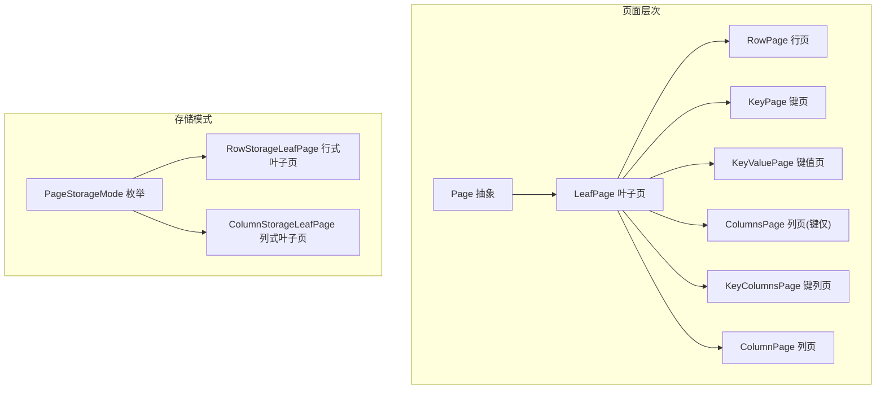
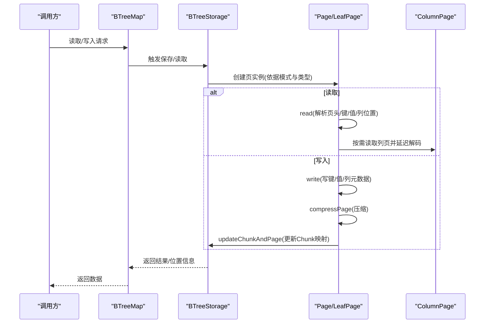
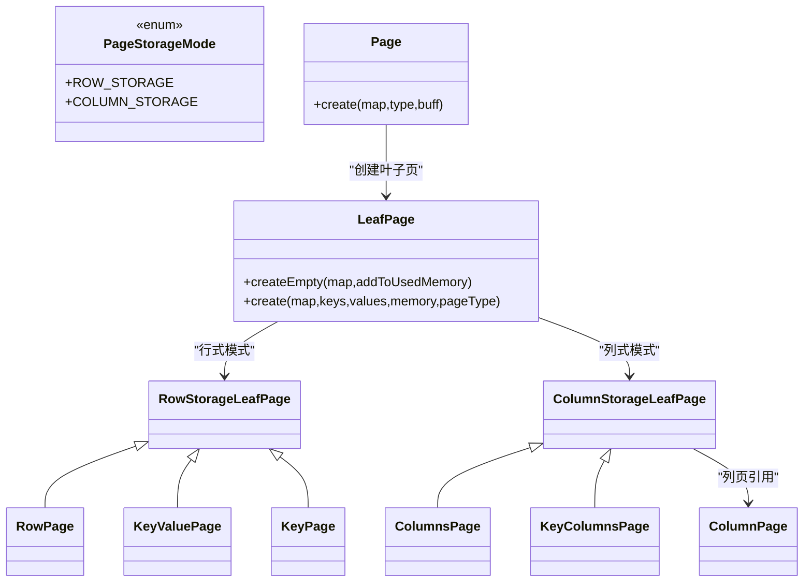
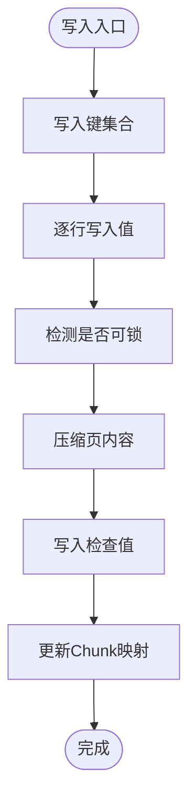
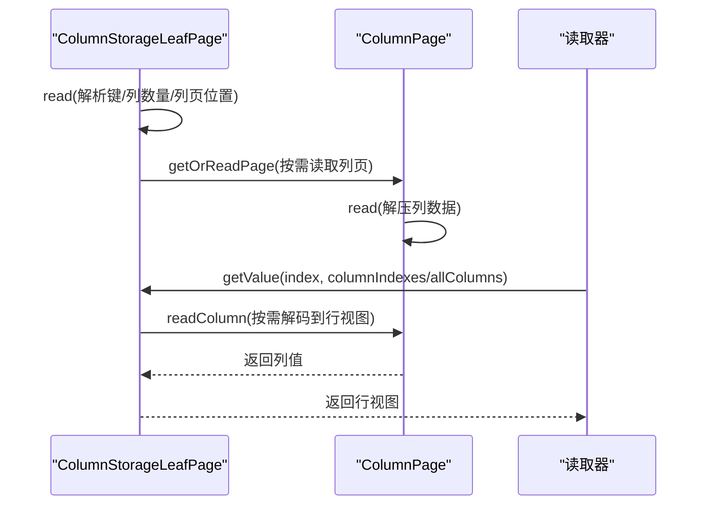
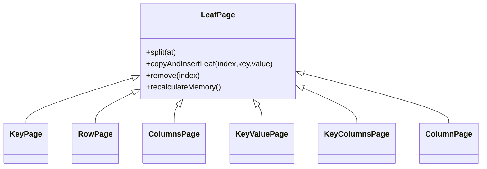
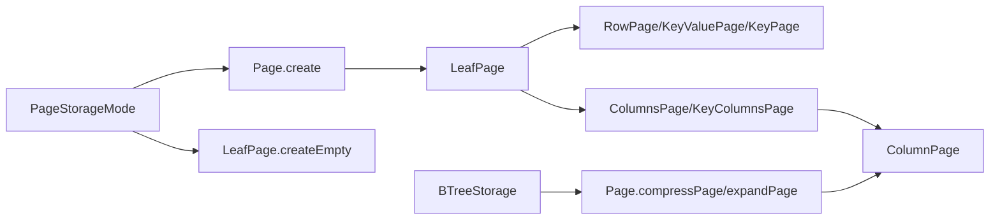

# 存储模式

**本文引用的文件列表**
- [PageStorageMode.java](https://github.com/lealone/Lealone/blob/master/lealone-aose/src/main/java/com/lealone/storage/aose/btree/page/PageStorageMode.java)
- [RowStorageLeafPage.java](https://github.com/lealone/Lealone/blob/master/lealone-aose/src/main/java/com/lealone/storage/aose/btree/page/RowStorageLeafPage.java)
- [ColumnStorageLeafPage.java](https://github.com/lealone/Lealone/blob/master/lealone-aose/src/main/java/com/lealone/storage/aose/btree/page/ColumnStorageLeafPage.java)
- [RowPage.java](https://github.com/lealone/Lealone/blob/master/lealone-aose/src/main/java/com/lealone/storage/aose/btree/page/RowPage.java)
- [ColumnsPage.java](https://github.com/lealone/Lealone/blob/master/lealone-aose/src/main/java/com/lealone/storage/aose/btree/page/ColumnsPage.java)
- [KeyValuePage.java](https://github.com/lealone/Lealone/blob/master/lealone-aose/src/main/java/com/lealone/storage/aose/btree/page/KeyValuePage.java)
- [KeyColumnsPage.java](https://github.com/lealone/Lealone/blob/master/lealone-aose/src/main/java/com/lealone/storage/aose/btree/page/KeyColumnsPage.java)
- [LeafPage.java](https://github.com/lealone/Lealone/blob/master/lealone-aose/src/main/java/com/lealone/storage/aose/btree/page/LeafPage.java)
- [Page.java](https://github.com/lealone/Lealone/blob/master/lealone-aose/src/main/java/com/lealone/storage/aose/btree/page/Page.java)
- [ColumnPage.java](https://github.com/lealone/Lealone/blob/master/lealone-aose/src/main/java/com/lealone/storage/aose/btree/page/ColumnPage.java)
- [KeyPage.java](https://github.com/lealone/Lealone/blob/master/lealone-aose/src/main/java/com/lealone/storage/aose/btree/page/KeyPage.java)
- [PageStorageModeTest.java](https://github.com/lealone/Lealone/blob/master/lealone-test/src/test/java/com/lealone/test/aose/PageStorageModeTest.java)
- [PageStorageModeSqlTest.java](https://github.com/lealone/Lealone/blob/master/lealone-test/src/test/java/com/lealone/test/aose/PageStorageModeSqlTest.java)
- [StorageSetting.java](https://github.com/lealone/Lealone/blob/master/lealone-sci/src/main/java/com/lealone/storage/StorageSetting.java)
- [BTreeStorage.java](https://github.com/lealone/Lealone/blob/master/lealone-aose/src/main/java/com/lealone/storage/aose/btree/BTreeStorage.java)
- [BTreeMap.java](https://github.com/lealone/Lealone/blob/master/lealone-aose/src/main/java/com/lealone/storage/aose/btree/BTreeMap.java)
- [PageReference.java](https://github.com/lealone/Lealone/blob/master/lealone-aose/src/main/java/com/lealone/storage/aose/btree/page/PageReference.java)

## 目录
1. [简介](#简介)
2. [项目结构](#项目结构)
3. [核心组件](#核心组件)
4. [架构总览](#架构总览)
5. [详细组件分析](#详细组件分析)
6. [依赖关系分析](#依赖关系分析)
7. [性能考量](#性能考量)
8. [故障排查指南](#故障排查指南)
9. [结论](#结论)
10. [附录](#附录)

## 简介
本技术文档围绕Lealone数据库AOSE引擎中的B-Tree存储模式展开，系统性解析PageStorageMode枚举所定义的三种存储模式：行存储、列存储，并深入剖析RowStorageLeafPage与ColumnStorageLeafPage在数据布局、序列化、压缩与检索上的差异。文档还结合测试用例展示不同模式下的数据读写行为，给出OLTP与OLAP工作负载下的性能特征与选型建议，并提供配置与迁移策略。

## 项目结构
与存储模式相关的代码主要位于AOSE引擎的btree/page包内，核心类包括：
- 枚举：PageStorageMode
- 叶子页基类与具体实现：RowStorageLeafPage、ColumnStorageLeafPage、RowPage、ColumnsPage、KeyValuePage、KeyColumnsPage、KeyPage
- 列页：ColumnPage
- 通用页抽象：Page
- 叶子页工厂与类型分派：LeafPage
- 页面引用：PageReference
- 存储设置：StorageSetting
- 存储与映射：BTreeStorage、BTreeMap

图表来源
- [Page.java](https://github.com/lealone/Lealone/blob/master/lealone-aose/src/main/java/com/lealone/storage/aose/btree/page/Page.java#L27-L52)
- [LeafPage.java](https://github.com/lealone/Lealone/blob/master/lealone-aose/src/main/java/com/lealone/storage/aose/btree/page/LeafPage.java#L224-L237)
- [RowStorageLeafPage.java](https://github.com/lealone/Lealone/blob/master/lealone-aose/src/main/java/com/lealone/storage/aose/btree/page/RowStorageLeafPage.java#L1-L115)
- [ColumnStorageLeafPage.java](https://github.com/lealone/Lealone/blob/master/lealone-aose/src/main/java/com/lealone/storage/aose/btree/page/ColumnStorageLeafPage.java#L1-L220)
- [RowPage.java](https://github.com/lealone/Lealone/blob/master/lealone-aose/src/main/java/com/lealone/storage/aose/btree/page/RowPage.java#L1-L74)
- [ColumnsPage.java](https://github.com/lealone/Lealone/blob/master/lealone-aose/src/main/java/com/lealone/storage/aose/btree/page/ColumnsPage.java#L1-L63)
- [KeyValuePage.java](https://github.com/lealone/Lealone/blob/master/lealone-aose/src/main/java/com/lealone/storage/aose/btree/page/KeyValuePage.java#L1-L91)
- [KeyColumnsPage.java](https://github.com/lealone/Lealone/blob/master/lealone-aose/src/main/java/com/lealone/storage/aose/btree/page/KeyColumnsPage.java#L1-L80)
- [KeyPage.java](https://github.com/lealone/Lealone/blob/master/lealone-aose/src/main/java/com/lealone/storage/aose/btree/page/KeyPage.java#L1-L76)
- [ColumnPage.java](https://github.com/lealone/Lealone/blob/master/lealone-aose/src/main/java/com/lealone/storage/aose/btree/page/ColumnPage.java#L1-L94)
- [PageStorageMode.java](https://github.com/lealone/Lealone/blob/master/lealone-aose/src/main/java/com/lealone/storage/aose/btree/page/PageStorageMode.java#L8-L12)

章节来源
- [Page.java](https://github.com/lealone/Lealone/blob/master/lealone-aose/src/main/java/com/lealone/storage/aose/btree/page/Page.java#L27-L52)
- [LeafPage.java](https://github.com/lealone/Lealone/blob/master/lealone-aose/src/main/java/com/lealone/storage/aose/btree/page/LeafPage.java#L224-L237)

## 核心组件
- PageStorageMode：定义行存储与列存储两种模式，其ordinal用于页头标识与类型分派。
- RowStorageLeafPage：面向行式存储的叶子页基类，键与值同页存放，适合点查与更新。
- ColumnStorageLeafPage：面向列式存储的叶子页基类，键与各列数据分离为独立列页，适合列裁剪与聚合。
- RowPage/ColumnsPage/KeyValuePage/KeyColumnsPage/KeyPage：按“键/值/列”组合的不同页面类型，配合PageStorageMode进行实例化与序列化。
- ColumnPage：列页，按列维度序列化与压缩，延迟解码到行视图。
- Page/LeafPage：页的抽象与叶子页通用逻辑（分裂、插入、删除、内存计算等）。
- BTreeStorage/BTreeMap：存储与映射层，负责压缩级别、页写入、检查值校验与重写流程。

章节来源
- [PageStorageMode.java](https://github.com/lealone/Lealone/blob/master/lealone-aose/src/main/java/com/lealone/storage/aose/btree/page/PageStorageMode.java#L8-L12)
- [RowStorageLeafPage.java](https://github.com/lealone/Lealone/blob/master/lealone-aose/src/main/java/com/lealone/storage/aose/btree/page/RowStorageLeafPage.java#L1-L115)
- [ColumnStorageLeafPage.java](https://github.com/lealone/Lealone/blob/master/lealone-aose/src/main/java/com/lealone/storage/aose/btree/page/ColumnStorageLeafPage.java#L1-L220)
- [RowPage.java](https://github.com/lealone/Lealone/blob/master/lealone-aose/src/main/java/com/lealone/storage/aose/btree/page/RowPage.java#L1-L74)
- [ColumnsPage.java](https://github.com/lealone/Lealone/blob/master/lealone-aose/src/main/java/com/lealone/storage/aose/btree/page/ColumnsPage.java#L1-L63)
- [KeyValuePage.java](https://github.com/lealone/Lealone/blob/master/lealone-aose/src/main/java/com/lealone/storage/aose/btree/page/KeyValuePage.java#L1-L91)
- [KeyColumnsPage.java](https://github.com/lealone/Lealone/blob/master/lealone-aose/src/main/java/com/lealone/storage/aose/btree/page/KeyColumnsPage.java#L1-L80)
- [KeyPage.java](https://github.com/lealone/Lealone/blob/master/lealone-aose/src/main/java/com/lealone/storage/aose/btree/page/KeyPage.java#L1-L76)
- [ColumnPage.java](https://github.com/lealone/Lealone/blob/master/lealone-aose/src/main/java/com/lealone/storage/aose/btree/page/ColumnPage.java#L1-L94)
- [Page.java](https://github.com/lealone/Lealone/blob/master/lealone-aose/src/main/java/com/lealone/storage/aose/btree/page/Page.java#L27-L52)
- [LeafPage.java](https://github.com/lealone/Lealone/blob/master/lealone-aose/src/main/java/com/lealone/storage/aose/btree/page/LeafPage.java#L180-L200)
- [BTreeStorage.java](https://github.com/lealone/Lealone/blob/master/lealone-aose/src/main/java/com/lealone/storage/aose/btree/BTreeStorage.java#L36-L74)
- [BTreeMap.java](https://github.com/lealone/Lealone/blob/master/lealone-aose/src/main/java/com/lealone/storage/aose/btree/BTreeMap.java#L365-L425)

## 架构总览
下图展示了B-Tree页在读写过程中的关键步骤：页头包含模式标识，读取时根据模式选择对应叶子页类型；写入时先写键，再写值或列元数据，随后压缩并写入检查值，最后更新Chunk映射与PageReference。

图表来源
- [Page.java](https://github.com/lealone/Lealone/blob/master/lealone-aose/src/main/java/com/lealone/storage/aose/btree/page/Page.java#L27-L52)
- [LeafPage.java](https://github.com/lealone/Lealone/blob/master/lealone-aose/src/main/java/com/lealone/storage/aose/btree/page/LeafPage.java#L239-L248)
- [RowStorageLeafPage.java](https://github.com/lealone/Lealone/blob/master/lealone-aose/src/main/java/com/lealone/storage/aose/btree/page/RowStorageLeafPage.java#L79-L115)
- [ColumnStorageLeafPage.java](https://github.com/lealone/Lealone/blob/master/lealone-aose/src/main/java/com/lealone/storage/aose/btree/page/ColumnStorageLeafPage.java#L128-L180)
- [ColumnPage.java](https://github.com/lealone/Lealone/blob/master/lealone-aose/src/main/java/com/lealone/storage/aose/btree/page/ColumnPage.java#L31-L60)
- [BTreeStorage.java](https://github.com/lealone/Lealone/blob/master/lealone-aose/src/main/java/com/lealone/storage/aose/btree/BTreeStorage.java#L36-L74)

## 详细组件分析

### PageStorageMode与页面类型分派
- PageStorageMode定义了行存储与列存储两种模式，其ordinal作为页头字节的一部分参与类型分派。
- Page.create根据页类型与页头模式字节选择具体叶子页实现：键仅、行式、列式、键值、键列等。
- LeafPage.createEmpty/LeafPage.create根据映射的PageStorageMode与键/值类型组合确定页面类型。

图表来源
- [PageStorageMode.java](https://github.com/lealone/Lealone/blob/master/lealone-aose/src/main/java/com/lealone/storage/aose/btree/page/PageStorageMode.java#L8-L12)
- [Page.java](https://github.com/lealone/Lealone/blob/master/lealone-aose/src/main/java/com/lealone/storage/aose/btree/page/Page.java#L27-L52)
- [LeafPage.java](https://github.com/lealone/Lealone/blob/master/lealone-aose/src/main/java/com/lealone/storage/aose/btree/page/LeafPage.java#L180-L200)
- [RowStorageLeafPage.java](https://github.com/lealone/Lealone/blob/master/lealone-aose/src/main/java/com/lealone/storage/aose/btree/page/RowStorageLeafPage.java#L1-L115)
- [ColumnStorageLeafPage.java](https://github.com/lealone/Lealone/blob/master/lealone-aose/src/main/java/com/lealone/storage/aose/btree/page/ColumnStorageLeafPage.java#L1-L220)
- [RowPage.java](https://github.com/lealone/Lealone/blob/master/lealone-aose/src/main/java/com/lealone/storage/aose/btree/page/RowPage.java#L1-L74)
- [ColumnsPage.java](https://github.com/lealone/Lealone/blob/master/lealone-aose/src/main/java/com/lealone/storage/aose/btree/page/ColumnsPage.java#L1-L63)
- [KeyValuePage.java](https://github.com/lealone/Lealone/blob/master/lealone-aose/src/main/java/com/lealone/storage/aose/btree/page/KeyValuePage.java#L1-L91)
- [KeyColumnsPage.java](https://github.com/lealone/Lealone/blob/master/lealone-aose/src/main/java/com/lealone/storage/aose/btree/page/KeyColumnsPage.java#L1-L80)
- [KeyPage.java](https://github.com/lealone/Lealone/blob/master/lealone-aose/src/main/java/com/lealone/storage/aose/btree/page/KeyPage.java#L1-L76)
- [ColumnPage.java](https://github.com/lealone/Lealone/blob/master/lealone-aose/src/main/java/com/lealone/storage/aose/btree/page/ColumnPage.java#L1-L94)

章节来源
- [PageStorageMode.java](https://github.com/lealone/Lealone/blob/master/lealone-aose/src/main/java/com/lealone/storage/aose/btree/page/PageStorageMode.java#L8-L12)
- [Page.java](https://github.com/lealone/Lealone/blob/master/lealone-aose/src/main/java/com/lealone/storage/aose/btree/page/Page.java#L27-L52)
- [LeafPage.java](https://github.com/lealone/Lealone/blob/master/lealone-aose/src/main/java/com/lealone/storage/aose/btree/page/LeafPage.java#L180-L200)

### 行式存储：RowStorageLeafPage与RowPage
- 数据布局：键与值同页存放，RowPage的值数组即为keys数组，适合点查与单行更新。
- 序列化：写入时先写键，再逐行写值；读取时先读键，再读值，支持锁可感知的锁定状态检测。
- 压缩与校验：使用Page.compressPage进行压缩，写入检查值并更新Chunk映射。
- 内存计算：通过StorageDataType估算键与值的内存占用，用于页分裂与GC。

图表来源
- [RowStorageLeafPage.java](https://github.com/lealone/Lealone/blob/master/lealone-aose/src/main/java/com/lealone/storage/aose/btree/page/RowStorageLeafPage.java#L79-L115)
- [RowPage.java](https://github.com/lealone/Lealone/blob/master/lealone-aose/src/main/java/com/lealone/storage/aose/btree/page/RowPage.java#L56-L74)
- [Page.java](https://github.com/lealone/Lealone/blob/master/lealone-aose/src/main/java/com/lealone/storage/aose/btree/page/Page.java#L308-L356)

章节来源
- [RowStorageLeafPage.java](https://github.com/lealone/Lealone/blob/master/lealone-aose/src/main/java/com/lealone/storage/aose/btree/page/RowStorageLeafPage.java#L1-L115)
- [RowPage.java](https://github.com/lealone/Lealone/blob/master/lealone-aose/src/main/java/com/lealone/storage/aose/btree/page/RowPage.java#L1-L74)
- [Page.java](https://github.com/lealone/Lealone/blob/master/lealone-aose/src/main/java/com/lealone/storage/aose/btree/page/Page.java#L308-L356)

### 列式存储：ColumnStorageLeafPage与ColumnPage
- 数据布局：键与各列数据分离，叶子页记录每列的列页位置，列页独立序列化与压缩。
- 列裁剪：getValue(index, columnIndexes)仅加载指定列，提升扫描效率。
- 延迟解码：ColumnPage.read在读取阶段仅解压列数据，实际行视图解码发生在需要时，减少不必要的CPU开销。
- 重写流程：ColumnStorageLeafPage.rewrite不仅修改叶子页检查值，还需遍历并重写所有包含的列页位置。

图表来源
- [ColumnStorageLeafPage.java](https://github.com/lealone/Lealone/blob/master/lealone-aose/src/main/java/com/lealone/storage/aose/btree/page/ColumnStorageLeafPage.java#L28-L126)
- [ColumnPage.java](https://github.com/lealone/Lealone/blob/master/lealone-aose/src/main/java/com/lealone/storage/aose/btree/page/ColumnPage.java#L31-L60)
- [ColumnStorageLeafPage.java](https://github.com/lealone/Lealone/blob/master/lealone-aose/src/main/java/com/lealone/storage/aose/btree/page/ColumnStorageLeafPage.java#L192-L219)

章节来源
- [ColumnStorageLeafPage.java](https://github.com/lealone/Lealone/blob/master/lealone-aose/src/main/java/com/lealone/storage/aose/btree/page/ColumnStorageLeafPage.java#L1-L220)
- [ColumnPage.java](https://github.com/lealone/Lealone/blob/master/lealone-aose/src/main/java/com/lealone/storage/aose/btree/page/ColumnPage.java#L1-L94)

### 页面类型与内存模型
- 叶子页类型：KeyPage、RowPage、ColumnsPage、KeyValuePage、KeyColumnsPage、ColumnPage。
- 内存估算：LeafPage.recalculateMemory基于键与值类型计算内存；Empty页内存来自各类型常量。
- 分裂与复制：LeafPage.split/copyAndInsertLeaf/remove等操作维持B-Tree平衡与一致性。

图表来源
- [LeafPage.java](https://github.com/lealone/Lealone/blob/master/lealone-aose/src/main/java/com/lealone/storage/aose/btree/page/LeafPage.java#L69-L171)
- [KeyPage.java](https://github.com/lealone/Lealone/blob/master/lealone-aose/src/main/java/com/lealone/storage/aose/btree/page/KeyPage.java#L1-L76)
- [RowPage.java](https://github.com/lealone/Lealone/blob/master/lealone-aose/src/main/java/com/lealone/storage/aose/btree/page/RowPage.java#L1-L74)
- [ColumnsPage.java](https://github.com/lealone/Lealone/blob/master/lealone-aose/src/main/java/com/lealone/storage/aose/btree/page/ColumnsPage.java#L1-L63)
- [KeyValuePage.java](https://github.com/lealone/Lealone/blob/master/lealone-aose/src/main/java/com/lealone/storage/aose/btree/page/KeyValuePage.java#L1-L91)
- [KeyColumnsPage.java](https://github.com/lealone/Lealone/blob/master/lealone-aose/src/main/java/com/lealone/storage/aose/btree/page/KeyColumnsPage.java#L1-L80)
- [ColumnPage.java](https://github.com/lealone/Lealone/blob/master/lealone-aose/src/main/java/com/lealone/storage/aose/btree/page/ColumnPage.java#L1-L94)

章节来源
- [LeafPage.java](https://github.com/lealone/Lealone/blob/master/lealone-aose/src/main/java/com/lealone/storage/aose/btree/page/LeafPage.java#L69-L171)

## 依赖关系分析
- Page.create与LeafPage.createEmpty/LeafPage.create共同决定页面类型与模式的耦合关系。
- ColumnStorageLeafPage依赖ColumnPage进行列数据的延迟解码与内存统计。
- Page.compressPage/expandPage统一处理压缩与解压，避免重复实现。
- BTreeStorage持有压缩器与Chunk管理器，影响页写入与重写流程。

图表来源
- [Page.java](https://github.com/lealone/Lealone/blob/master/lealone-aose/src/main/java/com/lealone/storage/aose/btree/page/Page.java#L27-L52)
- [LeafPage.java](https://github.com/lealone/Lealone/blob/master/lealone-aose/src/main/java/com/lealone/storage/aose/btree/page/LeafPage.java#L180-L200)
- [ColumnStorageLeafPage.java](https://github.com/lealone/Lealone/blob/master/lealone-aose/src/main/java/com/lealone/storage/aose/btree/page/ColumnStorageLeafPage.java#L128-L180)
- [ColumnPage.java](https://github.com/lealone/Lealone/blob/master/lealone-aose/src/main/java/com/lealone/storage/aose/btree/page/ColumnPage.java#L61-L85)
- [BTreeStorage.java](https://github.com/lealone/Lealone/blob/master/lealone-aose/src/main/java/com/lealone/storage/aose/btree/BTreeStorage.java#L36-L74)

章节来源
- [Page.java](https://github.com/lealone/Lealone/blob/master/lealone-aose/src/main/java/com/lealone/storage/aose/btree/page/Page.java#L27-L52)
- [LeafPage.java](https://github.com/lealone/Lealone/blob/master/lealone-aose/src/main/java/com/lealone/storage/aose/btree/page/LeafPage.java#L180-L200)
- [ColumnStorageLeafPage.java](https://github.com/lealone/Lealone/blob/master/lealone-aose/src/main/java/com/lealone/storage/aose/btree/page/ColumnStorageLeafPage.java#L128-L180)
- [ColumnPage.java](https://github.com/lealone/Lealone/blob/master/lealone-aose/src/main/java/com/lealone/storage/aose/btree/page/ColumnPage.java#L61-L85)
- [BTreeStorage.java](https://github.com/lealone/Lealone/blob/master/lealone-aose/src/main/java/com/lealone/storage/aose/btree/BTreeStorage.java#L36-L74)

## 性能考量
- OLTP（在线事务处理）
  - 行式存储优势：键值同页，点查与单行更新命中率高，锁检测成本低；适合主键查询与短事务。
  - 列式存储劣势：列页延迟解码带来额外I/O与CPU开销，不适合频繁单行更新。
- OLAP（在线分析处理）
  - 列式存储优势：列裁剪与聚合友好，压缩效果好，扫描吞吐高；适合宽表、大查询与批量分析。
  - 行式存储劣势：全表扫描时存在重复键开销，压缩收益有限。
- 压缩与检查值
  - Page.compressPage在页内容较大时启用压缩，降低磁盘占用与IO；Page.writeCheckValue/ readCheckValue保证页完整性。
- 内存与GC
  - LeafPage.recalculateMemory与BTreeGC协作，控制页内存占用，避免碎片化与过度分裂。

章节来源
- [RowStorageLeafPage.java](https://github.com/lealone/Lealone/blob/master/lealone-aose/src/main/java/com/lealone/storage/aose/btree/page/RowStorageLeafPage.java#L79-L115)
- [ColumnStorageLeafPage.java](https://github.com/lealone/Lealone/blob/master/lealone-aose/src/main/java/com/lealone/storage/aose/btree/page/ColumnStorageLeafPage.java#L128-L180)
- [Page.java](https://github.com/lealone/Lealone/blob/master/lealone-aose/src/main/java/com/lealone/storage/aose/btree/page/Page.java#L308-L356)
- [LeafPage.java](https://github.com/lealone/Lealone/blob/master/lealone-aose/src/main/java/com/lealone/storage/aose/btree/page/LeafPage.java#L152-L171)
- [BTreeStorage.java](https://github.com/lealone/Lealone/blob/master/lealone-aose/src/main/java/com/lealone/storage/aose/btree/BTreeStorage.java#L36-L74)

## 故障排查指南
- 页损坏与校验失败
  - readCheckValue/writeCheckValue用于页完整性校验，若校验失败，抛出文件损坏异常。排查要点：确认页长度与偏移计算正确，检查Chunk映射更新。
- 重写流程
  - LeafPage.rewrite/ColumnStorageLeafPage.rewrite/ColumnPage.rewrite确保页头检查值与位置正确更新；列式重写需同步更新列页位置。
- 页面引用与锁
  - PageReference维护页位置与锁监听器，确保并发安全；KeyPage/KeyValuePage等类型在写入时可能触发锁检测。

章节来源
- [Page.java](https://github.com/lealone/Lealone/blob/master/lealone-aose/src/main/java/com/lealone/storage/aose/btree/page/Page.java#L282-L307)
- [LeafPage.java](https://github.com/lealone/Lealone/blob/master/lealone-aose/src/main/java/com/lealone/storage/aose/btree/page/LeafPage.java#L239-L248)
- [ColumnStorageLeafPage.java](https://github.com/lealone/Lealone/blob/master/lealone-aose/src/main/java/com/lealone/storage/aose/btree/page/ColumnStorageLeafPage.java#L192-L219)
- [ColumnPage.java](https://github.com/lealone/Lealone/blob/master/lealone-aose/src/main/java/com/lealone/storage/aose/btree/page/ColumnPage.java#L87-L94)
- [PageReference.java](https://github.com/lealone/Lealone/blob/master/lealone-aose/src/main/java/com/lealone/storage/aose/btree/page/PageReference.java#L36-L93)

## 结论
- 行式存储适合OLTP场景的点查与短事务，列式存储适合OLAP场景的列裁剪与聚合分析。
- 列式存储通过列页延迟解码与压缩显著提升扫描吞吐，但会增加I/O与CPU开销。
- 配置层面可通过StorageSetting.PAGE_STORAGE_MODE选择模式，并结合压缩级别与页大小优化整体性能。
- 迁移策略建议：先评估工作负载类型，再以小范围数据验证，逐步切换模式并监控GC与查询延迟。

## 附录

### 配置与使用示例
- 通过StorageSetting.PAGE_STORAGE_MODE在映射参数中设置存储模式。
- 测试用例展示了行式与列式模式下的CRUD与列裁剪功能。

章节来源
- [StorageSetting.java](https://github.com/lealone/Lealone/blob/master/lealone-sci/src/main/java/com/lealone/storage/StorageSetting.java#L8-L18)
- [PageStorageModeTest.java](https://github.com/lealone/Lealone/blob/master/lealone-test/src/test/java/com/lealone/test/aose/PageStorageModeTest.java#L52-L88)
- [PageStorageModeSqlTest.java](https://github.com/lealone/Lealone/blob/master/lealone-test/src/test/java/com/lealone/test/aose/PageStorageModeSqlTest.java#L41-L80)

### 工作负载与性能对比要点
- OLTP：优先行式存储，强调单行命中与锁检测成本；列式存储在此场景下吞吐较低。
- OLAP：优先列式存储，强调列裁剪与压缩；行式存储在此场景下扫描成本较高。
- 实际应用中应结合查询模式、列选择性与写入比例综合评估。

[本节为概念性总结，不直接分析具体文件]