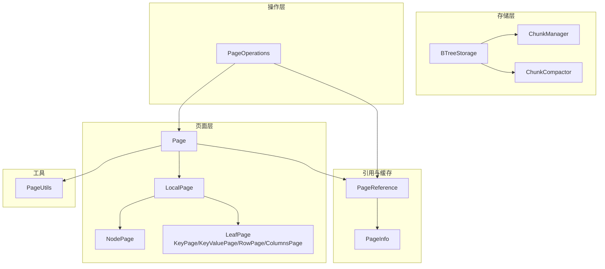
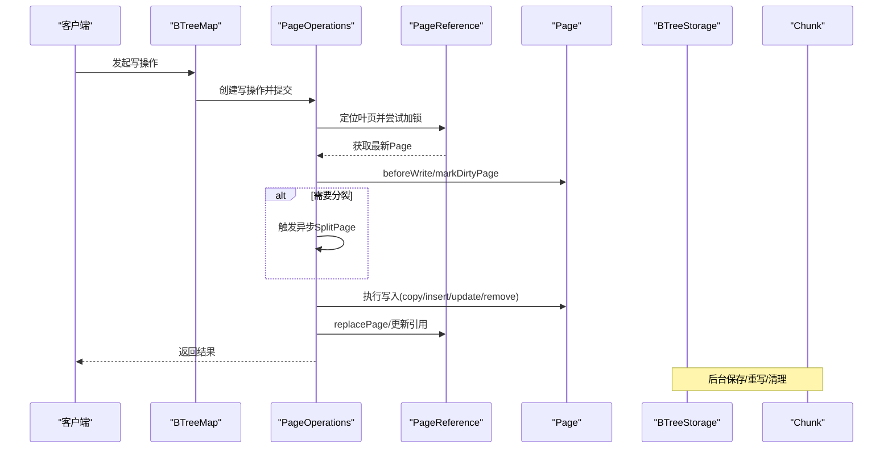
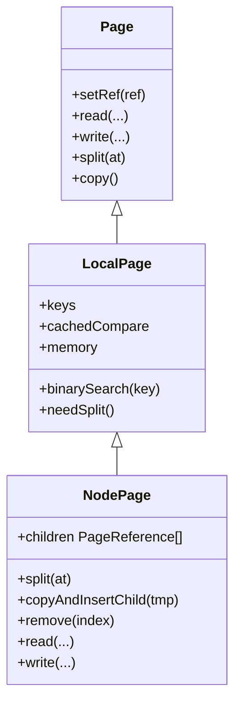
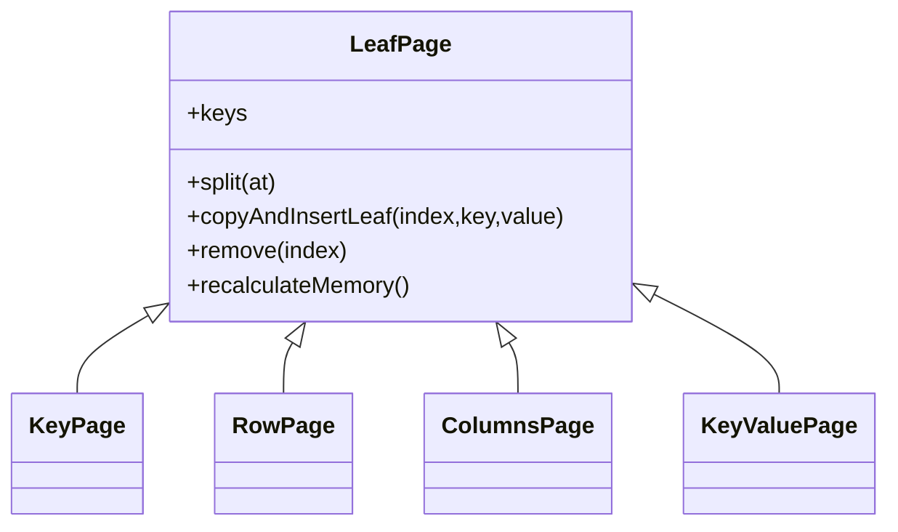
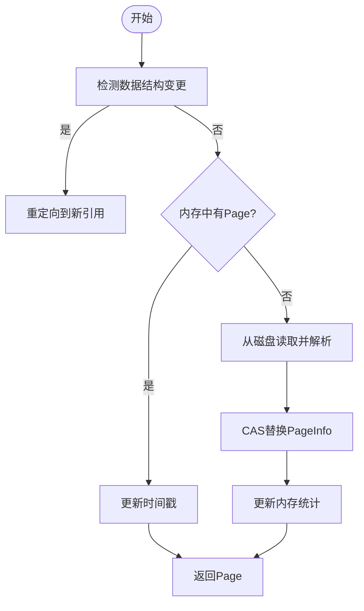
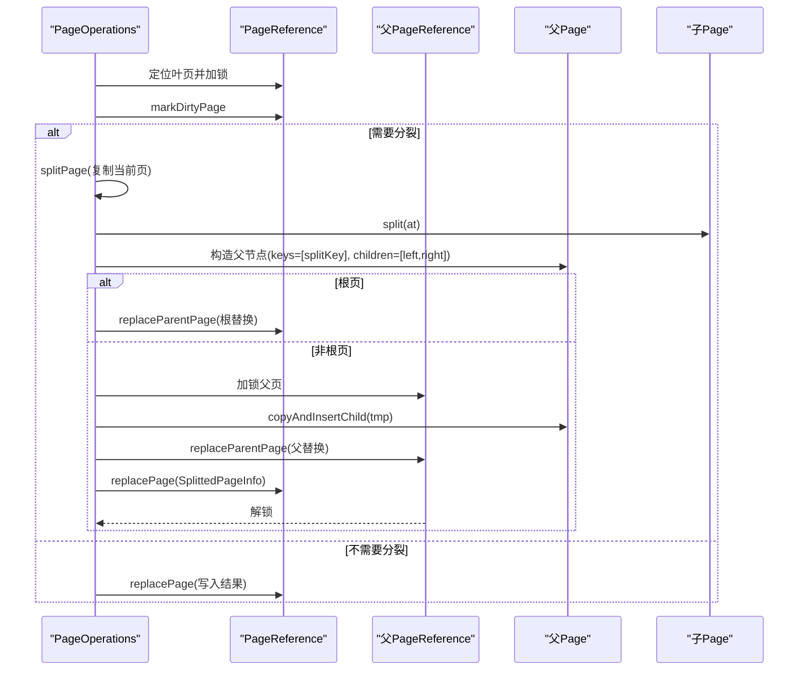
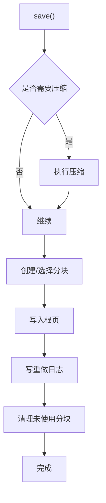
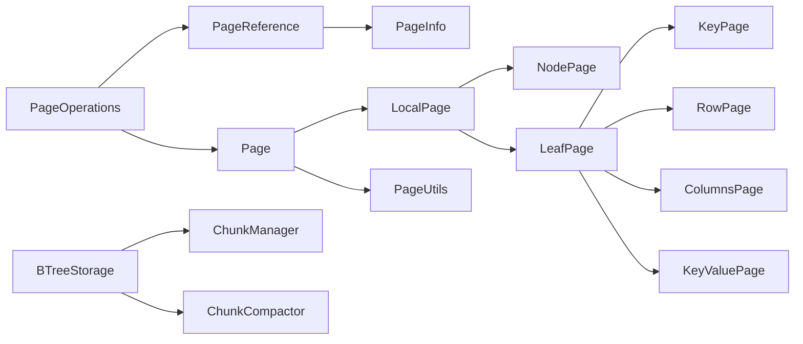
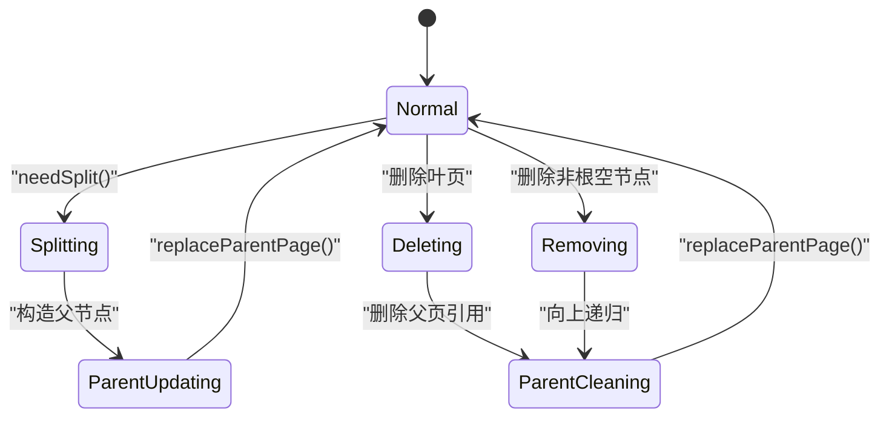

# 节点管理

<cite>
**本文引用的文件**
- [BTreeStorage.java](https://github.com/lealone/Lealone/blob/master/lealone-aose/src/main/java/com/lealone/storage/aose/btree/BTreeStorage.java)
- [NodePage.java](https://github.com/lealone/Lealone/blob/master/lealone-aose/src/main/java/com/lealone/storage/aose/btree/page/NodePage.java)
- [LeafPage.java](https://github.com/lealone/Lealone/blob/master/lealone-aose/src/main/java/com/lealone/storage/aose/btree/page/LeafPage.java)
- [PageReference.java](https://github.com/lealone/Lealone/blob/master/lealone-aose/src/main/java/com/lealone/storage/aose/btree/page/PageReference.java)
- [PageInfo.java](https://github.com/lealone/Lealone/blob/master/lealone-aose/src/main/java/com/lealone/storage/aose/btree/page/PageInfo.java)
- [Page.java](https://github.com/lealone/Lealone/blob/master/lealone-aose/src/main/java/com/lealone/storage/aose/btree/page/Page.java)
- [LocalPage.java](https://github.com/lealone/Lealone/blob/master/lealone-aose/src/main/java/com/lealone/storage/aose/btree/page/LocalPage.java)
- [PageOperations.java](https://github.com/lealone/Lealone/blob/master/lealone-aose/src/main/java/com/lealone/storage/aose/btree/page/PageOperations.java)
- [PageUtils.java](https://github.com/lealone/Lealone/blob/master/lealone-aose/src/main/java/com/lealone/storage/aose/btree/page/PageUtils.java)
- [KeyPage.java](https://github.com/lealone/Lealone/blob/master/lealone-aose/src/main/java/com/lealone/storage/aose/btree/page/KeyPage.java)
- [KeyValuePage.java](https://github.com/lealone/Lealone/blob/master/lealone-aose/src/main/java/com/lealone/storage/aose/btree/page/KeyValuePage.java)
- [RowPage.java](https://github.com/lealone/Lealone/blob/master/lealone-aose/src/main/java/com/lealone/storage/aose/btree/page/RowPage.java)
- [ColumnsPage.java](https://github.com/lealone/Lealone/blob/master/lealone-aose/src/main/java/com/lealone/storage/aose/btree/page/ColumnsPage.java)
</cite>

## 目录
1. [简介](#简介)
2. [项目结构](#项目结构)
3. [核心组件](#核心组件)
4. [架构总览](#架构总览)
5. [详细组件分析](#详细组件分析)
6. [依赖关系分析](#依赖关系分析)
7. [性能考量](#性能考量)
8. [故障排查指南](#故障排查指南)
9. [结论](#结论)
10. [附录](#附录)

## 简介
本文件聚焦于Lealone AOSE存储引擎中B-Tree节点管理的实现细节，系统性阐述BTreeStorage如何通过NodePage与LeafPage构建层级结构，解析内部节点与叶节点的内存布局与元数据结构，说明PageReference机制如何实现节点的引用计数与缓存管理，确保高并发访问下的内存安全。文档结合代码路径示例，展示节点的创建、分裂、合并与回收流程，分析写放大与读取性能之间的权衡，并提供节点状态转换图与生命周期管理策略，以及在故障恢复场景下的持久化保障机制。

## 项目结构
围绕B-Tree节点管理的关键目录与文件：
- 存储层入口：BTreeStorage负责分块管理、压缩、落盘与重做日志同步
- 页面抽象：Page/LocalPage/LeafPage/NodePage定义页面类型、内存估算与序列化
- 引用与缓存：PageReference/PageInfo封装页面引用、锁与缓存元信息
- 操作编排：PageOperations定义写操作、分裂、删除等原子流程
- 工具与常量：PageUtils提供页面位置编码与类型判定

图表来源
- [BTreeStorage.java](https://github.com/lealone/Lealone/blob/master/lealone-aose/src/main/java/com/lealone/storage/aose/btree/BTreeStorage.java#L1-L120)
- [NodePage.java](https://github.com/lealone/Lealone/blob/master/lealone-aose/src/main/java/com/lealone/storage/aose/btree/page/NodePage.java#L1-L60)
- [LeafPage.java](https://github.com/lealone/Lealone/blob/master/lealone-aose/src/main/java/com/lealone/storage/aose/btree/page/LeafPage.java#L1-L60)
- [PageReference.java](https://github.com/lealone/Lealone/blob/master/lealone-aose/src/main/java/com/lealone/storage/aose/btree/page/PageReference.java#L1-L60)
- [PageInfo.java](https://github.com/lealone/Lealone/blob/master/lealone-aose/src/main/java/com/lealone/storage/aose/btree/page/PageInfo.java#L1-L60)
- [Page.java](https://github.com/lealone/Lealone/blob/master/lealone-aose/src/main/java/com/lealone/storage/aose/btree/page/Page.java#L1-L60)
- [LocalPage.java](https://github.com/lealone/Lealone/blob/master/lealone-aose/src/main/java/com/lealone/storage/aose/btree/page/LocalPage.java#L1-L60)
- [PageOperations.java](https://github.com/lealone/Lealone/blob/master/lealone-aose/src/main/java/com/lealone/storage/aose/btree/page/PageOperations.java#L1-L60)
- [PageUtils.java](https://github.com/lealone/Lealone/blob/master/lealone-aose/src/main/java/com/lealone/storage/aose/btree/page/PageUtils.java#L1-L40)

章节来源
- [BTreeStorage.java](https://github.com/lealone/Lealone/blob/master/lealone-aose/src/main/java/com/lealone/storage/aose/btree/BTreeStorage.java#L1-L120)
- [Page.java](https://github.com/lealone/Lealone/blob/master/lealone-aose/src/main/java/com/lealone/storage/aose/btree/page/Page.java#L1-L60)
- [PageReference.java](https://github.com/lealone/Lealone/blob/master/lealone-aose/src/main/java/com/lealone/storage/aose/btree/page/PageReference.java#L1-L60)

## 核心组件
- BTreeStorage：分块管理、压缩策略、落盘与重做日志同步、GC协调
- NodePage：内部节点，维护键数组与子页引用数组，支持分裂与复制插入
- LeafPage及其子类：叶节点，按存储模式（行式/列式）组织键值数据，支持分裂与插入
- PageReference：页面引用，封装PageInfo、锁、父引用与内存统计，提供读写一致性
- PageInfo：页面缓存元信息，含位置、缓冲区、命中时间与锁
- PageOperations：写操作、分裂、删除等原子流程编排
- PageUtils：页面位置编码与类型判定

章节来源
- [BTreeStorage.java](https://github.com/lealone/Lealone/blob/master/lealone-aose/src/main/java/com/lealone/storage/aose/btree/BTreeStorage.java#L1-L120)
- [NodePage.java](https://github.com/lealone/Lealone/blob/master/lealone-aose/src/main/java/com/lealone/storage/aose/btree/page/NodePage.java#L1-L60)
- [LeafPage.java](https://github.com/lealone/Lealone/blob/master/lealone-aose/src/main/java/com/lealone/storage/aose/btree/page/LeafPage.java#L1-L60)
- [PageReference.java](https://github.com/lealone/Lealone/blob/master/lealone-aose/src/main/java/com/lealone/storage/aose/btree/page/PageReference.java#L1-L60)
- [PageInfo.java](https://github.com/lealone/Lealone/blob/master/lealone-aose/src/main/java/com/lealone/storage/aose/btree/page/PageInfo.java#L1-L60)
- [PageOperations.java](https://github.com/lealone/Lealone/blob/master/lealone-aose/src/main/java/com/lealone/storage/aose/btree/page/PageOperations.java#L1-L60)
- [PageUtils.java](https://github.com/lealone/Lealone/blob/master/lealone-aose/src/main/java/com/lealone/storage/aose/btree/page/PageUtils.java#L1-L40)

## 架构总览
B-Tree节点管理采用“页面+引用+分块”的分层架构：
- 页面抽象：Page/LocalPage/NodePage/LeafPage统一键值与子页管理
- 引用与缓存：PageReference持有PageInfo，提供CAS替换、锁与内存统计
- 分块与落盘：BTreeStorage协调ChunkManager/ChunkCompactor进行压缩、重写与落盘
- 操作编排：PageOperations在调度器驱动下完成写、分裂、删除等原子操作

图表来源
- [PageOperations.java](https://github.com/lealone/Lealone/blob/master/lealone-aose/src/main/java/com/lealone/storage/aose/btree/page/PageOperations.java#L120-L200)
- [PageReference.java](https://github.com/lealone/Lealone/blob/master/lealone-aose/src/main/java/com/lealone/storage/aose/btree/page/PageReference.java#L160-L220)
- [BTreeStorage.java](https://github.com/lealone/Lealone/blob/master/lealone-aose/src/main/java/com/lealone/storage/aose/btree/BTreeStorage.java#L300-L370)

## 详细组件分析

### NodePage：内部节点的内存布局与操作
- 内存估算：固定开销+每个子页引用的估算内存
- 键与子页：键数组长度比子页引用数组少1；分裂时左右子树键分布遵循约定
- 读写：读取时解码键数组与子页位置，写入时先写子页位置，再写子页内容并回填位置
- 复制插入：在指定索引处插入一对子页引用，更新父页键与子页父引用
- 删除：删除子页引用并回收空子页内存

图表来源
- [Page.java](https://github.com/lealone/Lealone/blob/master/lealone-aose/src/main/java/com/lealone/storage/aose/btree/page/Page.java#L1-L120)
- [LocalPage.java](https://github.com/lealone/Lealone/blob/master/lealone-aose/src/main/java/com/lealone/storage/aose/btree/page/LocalPage.java#L1-L120)
- [NodePage.java](https://github.com/lealone/Lealone/blob/master/lealone-aose/src/main/java/com/lealone/storage/aose/btree/page/NodePage.java#L1-L120)

章节来源
- [NodePage.java](https://github.com/lealone/Lealone/blob/master/lealone-aose/src/main/java/com/lealone/storage/aose/btree/page/NodePage.java#L60-L120)
- [NodePage.java](https://github.com/lealone/Lealone/blob/master/lealone-aose/src/main/java/com/lealone/storage/aose/btree/page/NodePage.java#L120-L200)
- [NodePage.java](https://github.com/lealone/Lealone/blob/master/lealone-aose/src/main/java/com/lealone/storage/aose/btree/page/NodePage.java#L200-L279)

### 叶子页面族：键值布局与存储模式
- KeyPage：仅键，用于索引键
- RowPage：行式存储，键即值
- ColumnsPage：列式存储，按列读取元数据
- KeyValuePage：键值对存储，键与值分离

图表来源
- [LeafPage.java](https://github.com/lealone/Lealone/blob/master/lealone-aose/src/main/java/com/lealone/storage/aose/btree/page/LeafPage.java#L1-L120)
- [KeyPage.java](https://github.com/lealone/Lealone/blob/master/lealone-aose/src/main/java/com/lealone/storage/aose/btree/page/KeyPage.java#L1-L76)
- [RowPage.java](https://github.com/lealone/Lealone/blob/master/lealone-aose/src/main/java/com/lealone/storage/aose/btree/page/RowPage.java#L1-L74)
- [ColumnsPage.java](https://github.com/lealone/Lealone/blob/master/lealone-aose/src/main/java/com/lealone/storage/aose/btree/page/ColumnsPage.java#L1-L63)
- [KeyValuePage.java](https://github.com/lealone/Lealone/blob/master/lealone-aose/src/main/java/com/lealone/storage/aose/btree/page/KeyValuePage.java#L1-L91)

章节来源
- [LeafPage.java](https://github.com/lealone/Lealone/blob/master/lealone-aose/src/main/java/com/lealone/storage/aose/btree/page/LeafPage.java#L120-L200)
- [KeyPage.java](https://github.com/lealone/Lealone/blob/master/lealone-aose/src/main/java/com/lealone/storage/aose/btree/page/KeyPage.java#L30-L76)
- [RowPage.java](https://github.com/lealone/Lealone/blob/master/lealone-aose/src/main/java/com/lealone/storage/aose/btree/page/RowPage.java#L30-L74)
- [ColumnsPage.java](https://github.com/lealone/Lealone/blob/master/lealone-aose/src/main/java/com/lealone/storage/aose/btree/page/ColumnsPage.java#L30-L63)
- [KeyValuePage.java](https://github.com/lealone/Lealone/blob/master/lealone-aose/src/main/java/com/lealone/storage/aose/btree/page/KeyValuePage.java#L40-L91)

### PageReference与PageInfo：引用计数与缓存管理
- PageReference：持有PageInfo，提供CAS替换、锁管理、脏页标记、GC触发与内存统计
- PageInfo：记录页面位置、缓冲区、命中时间、锁与元版本，支持GC释放page/buff
- 读路径：getOrReadPage在内存中优先，否则从磁盘重建并CAS替换
- 写路径：markDirtyPage标记脏页并向父链传播，replacePage原子替换新页

图表来源
- [PageReference.java](https://github.com/lealone/Lealone/blob/master/lealone-aose/src/main/java/com/lealone/storage/aose/btree/page/PageReference.java#L160-L220)
- [PageInfo.java](https://github.com/lealone/Lealone/blob/master/lealone-aose/src/main/java/com/lealone/storage/aose/btree/page/PageInfo.java#L1-L120)

章节来源
- [PageReference.java](https://github.com/lealone/Lealone/blob/master/lealone-aose/src/main/java/com/lealone/storage/aose/btree/page/PageReference.java#L1-L120)
- [PageReference.java](https://github.com/lealone/Lealone/blob/master/lealone-aose/src/main/java/com/lealone/storage/aose/btree/page/PageReference.java#L120-L220)
- [PageInfo.java](https://github.com/lealone/Lealone/blob/master/lealone-aose/src/main/java/com/lealone/storage/aose/btree/page/PageInfo.java#L1-L120)

### PageOperations：写入、分裂与删除流程
- 写操作：定位叶页、加锁、beforeWrite标记脏页、执行写入、必要时触发异步分裂
- 分裂：复制当前页，按中点切分，构造父节点，更新父子引用，必要时向上递归
- 删除：复制叶页删除元素，若为空且非根则异步删除父节点引用，必要时向上递归

图表来源
- [PageOperations.java](https://github.com/lealone/Lealone/blob/master/lealone-aose/src/main/java/com/lealone/storage/aose/btree/page/PageOperations.java#L280-L360)
- [PageOperations.java](https://github.com/lealone/Lealone/blob/master/lealone-aose/src/main/java/com/lealone/storage/aose/btree/page/PageOperations.java#L400-L520)
- [NodePage.java](https://github.com/lealone/Lealone/blob/master/lealone-aose/src/main/java/com/lealone/storage/aose/btree/page/NodePage.java#L60-L120)

章节来源
- [PageOperations.java](https://github.com/lealone/Lealone/blob/master/lealone-aose/src/main/java/com/lealone/storage/aose/btree/page/PageOperations.java#L120-L200)
- [PageOperations.java](https://github.com/lealone/Lealone/blob/master/lealone-aose/src/main/java/com/lealone/storage/aose/btree/page/PageOperations.java#L280-L360)
- [PageOperations.java](https://github.com/lealone/Lealone/blob/master/lealone-aose/src/main/java/com/lealone/storage/aose/btree/page/PageOperations.java#L400-L520)

### BTreeStorage：分块、压缩与持久化
- 分块管理：ChunkManager/ChunkCompactor负责分块创建、重写与清理
- 压缩策略：根据配置选择压缩级别，写入时可压缩键序列化数据
- 落盘流程：save/executeSave按需创建新分块或追加，写入根页位置，回写重做日志
- 故障恢复：validateRedoLog校验重做日志，sync确保落盘

图表来源
- [BTreeStorage.java](https://github.com/lealone/Lealone/blob/master/lealone-aose/src/main/java/com/lealone/storage/aose/btree/BTreeStorage.java#L294-L370)

章节来源
- [BTreeStorage.java](https://github.com/lealone/Lealone/blob/master/lealone-aose/src/main/java/com/lealone/storage/aose/btree/BTreeStorage.java#L294-L370)

## 依赖关系分析
- Page与LocalPage/NodePage/LeafPage形成继承层次，统一键值与子页接口
- PageReference依赖PageInfo与锁，提供原子替换与内存统计
- PageOperations依赖调度器与BTreeMap，编排写、分裂、删除
- BTreeStorage依赖ChunkManager/ChunkCompactor协调分块与重写

图表来源
- [Page.java](https://github.com/lealone/Lealone/blob/master/lealone-aose/src/main/java/com/lealone/storage/aose/btree/page/Page.java#L1-L60)
- [LocalPage.java](https://github.com/lealone/Lealone/blob/master/lealone-aose/src/main/java/com/lealone/storage/aose/btree/page/LocalPage.java#L1-L60)
- [NodePage.java](https://github.com/lealone/Lealone/blob/master/lealone-aose/src/main/java/com/lealone/storage/aose/btree/page/NodePage.java#L1-L60)
- [LeafPage.java](https://github.com/lealone/Lealone/blob/master/lealone-aose/src/main/java/com/lealone/storage/aose/btree/page/LeafPage.java#L1-L60)
- [PageReference.java](https://github.com/lealone/Lealone/blob/master/lealone-aose/src/main/java/com/lealone/storage/aose/btree/page/PageReference.java#L1-L60)
- [PageOperations.java](https://github.com/lealone/Lealone/blob/master/lealone-aose/src/main/java/com/lealone/storage/aose/btree/page/PageOperations.java#L1-L60)
- [BTreeStorage.java](https://github.com/lealone/Lealone/blob/master/lealone-aose/src/main/java/com/lealone/storage/aose/btree/BTreeStorage.java#L1-L120)

章节来源
- [Page.java](https://github.com/lealone/Lealone/blob/master/lealone-aose/src/main/java/com/lealone/storage/aose/btree/page/Page.java#L1-L120)
- [PageReference.java](https://github.com/lealone/Lealone/blob/master/lealone-aose/src/main/java/com/lealone/storage/aose/btree/page/PageReference.java#L1-L120)
- [PageOperations.java](https://github.com/lealone/Lealone/blob/master/lealone-aose/src/main/java/com/lealone/storage/aose/btree/page/PageOperations.java#L1-L120)
- [BTreeStorage.java](https://github.com/lealone/Lealone/blob/master/lealone-aose/src/main/java/com/lealone/storage/aose/btree/BTreeStorage.java#L1-L120)

## 性能考量
- 写放大
  - 分裂：写入新页与父页，可能向上递归；通过异步化降低阻塞
  - 脏页：markDirtyPage向父链传播，减少重复写
  - 压缩：键序列化阶段压缩，降低IO与空间占用
- 读取性能
  - PageReference缓存Page与ByteBuffer，命中率统计用于GC决策
  - 二分查找缓存最近比较结果，加速连续查询
- 内存管理
  - LocalPage按键/值类型估算内存，实时增减
  - BTreeGC跟踪已用内存，控制缓存与回收节奏

章节来源
- [LocalPage.java](https://github.com/lealone/Lealone/blob/master/lealone-aose/src/main/java/com/lealone/storage/aose/btree/page/LocalPage.java#L80-L120)
- [PageReference.java](https://github.com/lealone/Lealone/blob/master/lealone-aose/src/main/java/com/lealone/storage/aose/btree/page/PageReference.java#L1-L120)
- [Page.java](https://github.com/lealone/Lealone/blob/master/lealone-aose/src/main/java/com/lealone/storage/aose/btree/page/Page.java#L300-L378)
- [BTreeStorage.java](https://github.com/lealone/Lealone/blob/master/lealone-aose/src/main/java/com/lealone/storage/aose/btree/BTreeStorage.java#L1-L120)

## 故障排查指南
- 文件损坏与校验
  - readPage/readPageBuffer对页面长度与校验值进行严格校验
  - readCheckValue/writeCheckValue基于chunkId/offset/pageLength计算校验值
- 重做日志验证
  - validateRedoLog扫描重做日志，确认事务边界
- GC与回收
  - canGc判断是否可回收，gcPage按策略释放page/buff
  - updatePage在写完成后更新位置，避免回收冲突

章节来源
- [Page.java](https://github.com/lealone/Lealone/blob/master/lealone-aose/src/main/java/com/lealone/storage/aose/btree/page/Page.java#L280-L320)
- [BTreeStorage.java](https://github.com/lealone/Lealone/blob/master/lealone-aose/src/main/java/com/lealone/storage/aose/btree/BTreeStorage.java#L388-L414)
- [PageReference.java](https://github.com/lealone/Lealone/blob/master/lealone-aose/src/main/java/com/lealone/storage/aose/btree/page/PageReference.java#L360-L418)

## 结论
Lealone的B-Tree节点管理通过Page/LocalPage/NodePage/LeafPage的清晰抽象，配合PageReference/PageInfo的引用计数与缓存机制，实现了高并发下的内存安全与高效读写。BTreeStorage在分块、压缩与持久化方面提供了稳健的后台流程，PageOperations将写、分裂、删除等复杂操作编排为原子步骤。整体设计在写放大与读取性能之间取得平衡，并通过重做日志与严格的校验保障故障恢复能力。

## 附录
- 节点状态转换图（概念）

- 生命周期管理策略
  - 创建：LeafPage.createEmpty初始化空页并计入内存
  - 访问：PageReference.getOrReadPage优先命中内存，否则从磁盘重建
  - 修改：copy-and-insert语义保证并发安全，markDirtyPage传播脏页标记
  - 回收：canGc判断可回收，gcPage释放page/buff，updateChunkAndPage更新位置映射
  - 清理：ChunkCompactor清理未使用分块，BTreeStorage在落盘后移除

章节来源
- [LeafPage.java](https://github.com/lealone/Lealone/blob/master/lealone-aose/src/main/java/com/lealone/storage/aose/btree/page/LeafPage.java#L180-L200)
- [PageReference.java](https://github.com/lealone/Lealone/blob/master/lealone-aose/src/main/java/com/lealone/storage/aose/btree/page/PageReference.java#L360-L418)
- [Page.java](https://github.com/lealone/Lealone/blob/master/lealone-aose/src/main/java/com/lealone/storage/aose/btree/page/Page.java#L350-L378)
- [BTreeStorage.java](https://github.com/lealone/Lealone/blob/master/lealone-aose/src/main/java/com/lealone/storage/aose/btree/BTreeStorage.java#L340-L370)