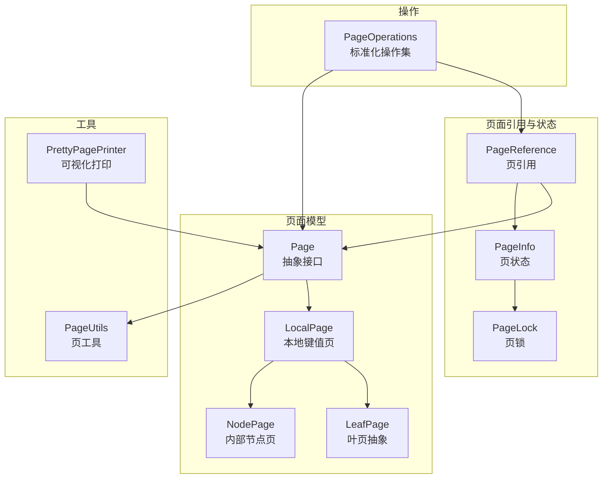
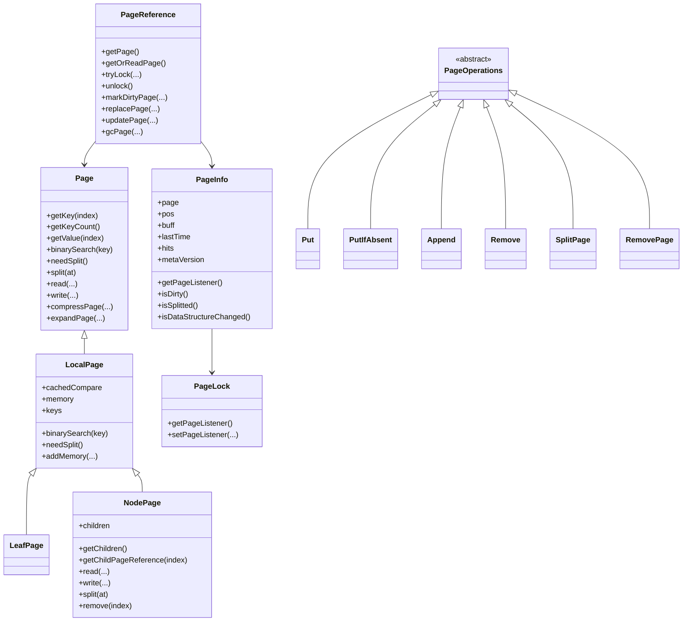
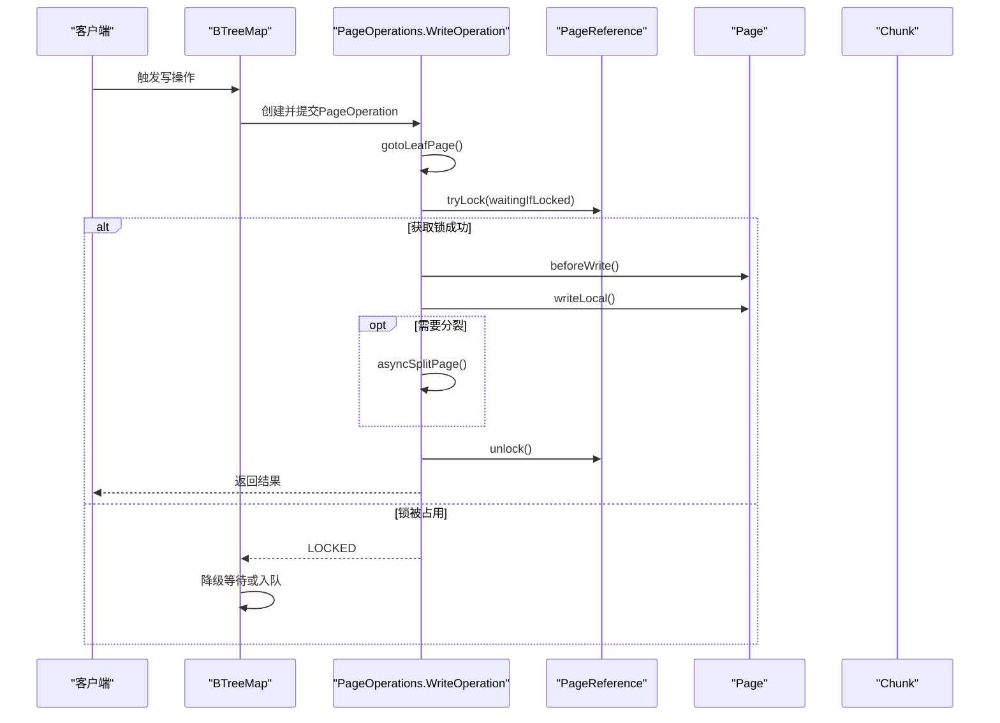
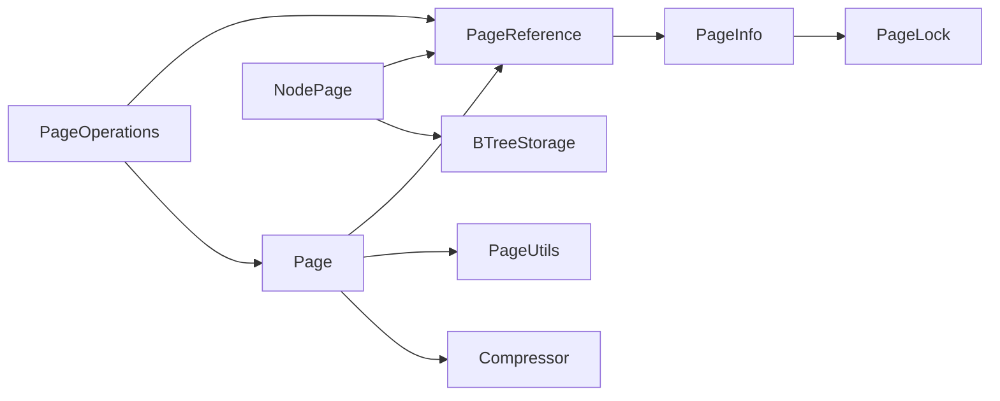

# 页面操作

<cite>
**本文引用的文件列表**
- [Page.java](https://github.com/lealone/Lealone/blob/master/lealone-aose/src/main/java/com/lealone/storage/aose/btree/page/Page.java)
- [LocalPage.java](https://github.com/lealone/Lealone/blob/master/lealone-aose/src/main/java/com/lealone/storage/aose/btree/page/LocalPage.java)
- [LeafPage.java](https://github.com/lealone/Lealone/blob/master/lealone-aose/src/main/java/com/lealone/storage/aose/btree/page/LeafPage.java)
- [NodePage.java](https://github.com/lealone/Lealone/blob/master/lealone-aose/src/main/java/com/lealone/storage/aose/btree/page/NodePage.java)
- [PageOperations.java](https://github.com/lealone/Lealone/blob/master/lealone-aose/src/main/java/com/lealone/storage/aose/btree/page/PageOperations.java)
- [PageReference.java](https://github.com/lealone/Lealone/blob/master/lealone-aose/src/main/java/com/lealone/storage/aose/btree/page/PageReference.java)
- [PageInfo.java](https://github.com/lealone/Lealone/blob/master/lealone-aose/src/main/java/com/lealone/storage/aose/btree/page/PageInfo.java)
- [PageLock.java](https://github.com/lealone/Lealone/blob/master/lealone-aose/src/main/java/com/lealone/storage/aose/btree/page/PageLock.java)
- [PageUtils.java](https://github.com/lealone/Lealone/blob/master/lealone-aose/src/main/java/com/lealone/storage/aose/btree/page/PageUtils.java)
- [PrettyPagePrinter.java](https://github.com/lealone/Lealone/blob/master/lealone-aose/src/main/java/com/lealone/storage/aose/btree/page/PrettyPagePrinter.java)
- [BTreeMap.java](https://github.com/lealone/Lealone/blob/master/lealone-aose/src/main/java/com/lealone/storage/aose/btree/BTreeMap.java)
</cite>

## 目录
1. [简介](#简介)
2. [项目结构](#项目结构)
3. [核心组件](#核心组件)
4. [架构总览](#架构总览)
5. [详细组件分析](#详细组件分析)
6. [依赖关系分析](#依赖关系分析)
7. [性能考量](#性能考量)
8. [故障排查指南](#故障排查指南)
9. [结论](#结论)
10. [附录](#附录)

## 简介
本文件围绕Lealone存储引擎中B-Tree页面操作的实现，系统性梳理Page接口及其具体实现类、PageOperations工具类提供的标准化页面操作方法集、PageLock在高并发下的细粒度锁机制（含读写锁策略与死锁预防）、页面读取/写入/压缩/校验流程及其对I/O性能的影响，并给出PrettyPagePrinter的使用方法与输出格式说明，帮助开发者进行B-Tree结构调试与性能分析。

## 项目结构
本专题聚焦于lealone-aose模块的btree.page包，核心文件如下：
- Page接口与抽象基类：Page、LocalPage、LeafPage、NodePage
- 页面引用与状态：PageReference、PageInfo
- 锁与监听：PageLock
- 工具与常量：PageUtils
- 标准化操作：PageOperations（写操作、分裂、删除）
- 可视化打印：PrettyPagePrinter

图表来源
- [Page.java](https://github.com/lealone/Lealone/blob/master/lealone-aose/src/main/java/com/lealone/storage/aose/btree/page/Page.java#L1-L378)
- [LocalPage.java](https://github.com/lealone/Lealone/blob/master/lealone-aose/src/main/java/com/lealone/storage/aose/btree/page/LocalPage.java#L1-L169)
- [LeafPage.java](https://github.com/lealone/Lealone/blob/master/lealone-aose/src/main/java/com/lealone/storage/aose/btree/page/LeafPage.java#L1-L260)
- [NodePage.java](https://github.com/lealone/Lealone/blob/master/lealone-aose/src/main/java/com/lealone/storage/aose/btree/page/NodePage.java#L1-L279)
- [PageReference.java](https://github.com/lealone/Lealone/blob/master/lealone-aose/src/main/java/com/lealone/storage/aose/btree/page/PageReference.java#L1-L418)
- [PageInfo.java](https://github.com/lealone/Lealone/blob/master/lealone-aose/src/main/java/com/lealone/storage/aose/btree/page/PageInfo.java#L1-L181)
- [PageLock.java](https://github.com/lealone/Lealone/blob/master/lealone-aose/src/main/java/com/lealone/storage/aose/btree/page/PageLock.java#L1-L35)
- [PageUtils.java](https://github.com/lealone/Lealone/blob/master/lealone-aose/src/main/java/com/lealone/storage/aose/btree/page/PageUtils.java#L1-L94)
- [PrettyPagePrinter.java](https://github.com/lealone/Lealone/blob/master/lealone-aose/src/main/java/com/lealone/storage/aose/btree/page/PrettyPagePrinter.java#L1-L119)
- [PageOperations.java](https://github.com/lealone/Lealone/blob/master/lealone-aose/src/main/java/com/lealone/storage/aose/btree/page/PageOperations.java#L1-L521)

章节来源
- [Page.java](https://github.com/lealone/Lealone/blob/master/lealone-aose/src/main/java/com/lealone/storage/aose/btree/page/Page.java#L1-L378)
- [PageOperations.java](https://github.com/lealone/Lealone/blob/master/lealone-aose/src/main/java/com/lealone/storage/aose/btree/page/PageOperations.java#L1-L521)
- [PageReference.java](https://github.com/lealone/Lealone/blob/master/lealone-aose/src/main/java/com/lealone/storage/aose/btree/page/PageReference.java#L1-L418)
- [PageInfo.java](https://github.com/lealone/Lealone/blob/master/lealone-aose/src/main/java/com/lealone/storage/aose/btree/page/PageInfo.java#L1-L181)
- [PageLock.java](https://github.com/lealone/Lealone/blob/master/lealone-aose/src/main/java/com/lealone/storage/aose/btree/page/PageLock.java#L1-L35)
- [PageUtils.java](https://github.com/lealone/Lealone/blob/master/lealone-aose/src/main/java/com/lealone/storage/aose/btree/page/PageUtils.java#L1-L94)
- [PrettyPagePrinter.java](https://github.com/lealone/Lealone/blob/master/lealone-aose/src/main/java/com/lealone/storage/aose/btree/page/PrettyPagePrinter.java#L1-L119)

## 核心组件
- Page接口：定义页面通用能力（键访问、数量、值访问、子页访问、分裂、复制、读写、压缩/解压、校验、内存统计等），并提供统一的读写入口与校验逻辑。
- LocalPage：在Page基础上实现键值缓存、二分查找、内存估算与增删改写等通用逻辑。
- 叶页（LeafPage）：封装键/值数组、插入/删除/复制、内存重计算、按存储模式创建等；支持重写（rewrite）以适配不同存储模式。
- 内部节点（NodePage）：维护子页引用数组与键数组，负责读写子页位置、写入子页、内存估算、分裂与删除子页。
- PageReference：持有Page或磁盘位置信息，提供CAS替换页、标记脏页、加解锁、读取页、垃圾回收等能力。
- PageInfo：封装页状态（页对象、磁盘位置、缓冲区、时间戳、命中次数、元版本、页锁等），并提供“数据结构变更”“已删除”“已分裂”等状态标识。
- PageLock：继承通用Lock，绑定PageListener，用于页级细粒度锁与监听。
- PageOperations：标准化写操作（Put/PutIfAbsent/Append/Remove）、异步分裂与删除子页、父子页加锁策略与重试/回退。
- PageUtils：页类型、压缩标志、位置编码与解码、页类型判定等工具常量与方法。
- PrettyPagePrinter：递归打印B-Tree页面树，包含类型、位置、内存、键/值、子页等信息，支持离线读取。

章节来源
- [Page.java](https://github.com/lealone/Lealone/blob/master/lealone-aose/src/main/java/com/lealone/storage/aose/btree/page/Page.java#L1-L378)
- [LocalPage.java](https://github.com/lealone/Lealone/blob/master/lealone-aose/src/main/java/com/lealone/storage/aose/btree/page/LocalPage.java#L1-L169)
- [LeafPage.java](https://github.com/lealone/Lealone/blob/master/lealone-aose/src/main/java/com/lealone/storage/aose/btree/page/LeafPage.java#L1-L260)
- [NodePage.java](https://github.com/lealone/Lealone/blob/master/lealone-aose/src/main/java/com/lealone/storage/aose/btree/page/NodePage.java#L1-L279)
- [PageReference.java](https://github.com/lealone/Lealone/blob/master/lealone-aose/src/main/java/com/lealone/storage/aose/btree/page/PageReference.java#L1-L418)
- [PageInfo.java](https://github.com/lealone/Lealone/blob/master/lealone-aose/src/main/java/com/lealone/storage/aose/btree/page/PageInfo.java#L1-L181)
- [PageLock.java](https://github.com/lealone/Lealone/blob/master/lealone-aose/src/main/java/com/lealone/storage/aose/btree/page/PageLock.java#L1-L35)
- [PageOperations.java](https://github.com/lealone/Lealone/blob/master/lealone-aose/src/main/java/com/lealone/storage/aose/btree/page/PageOperations.java#L1-L521)
- [PageUtils.java](https://github.com/lealone/Lealone/blob/master/lealone-aose/src/main/java/com/lealone/storage/aose/btree/page/PageUtils.java#L1-L94)
- [PrettyPagePrinter.java](https://github.com/lealone/Lealone/blob/master/lealone-aose/src/main/java/com/lealone/storage/aose/btree/page/PrettyPagePrinter.java#L1-L119)

## 架构总览
下面的类图展示了页面模型与操作之间的关系，以及PageReference与PageInfo的协作。

图表来源
- [Page.java](https://github.com/lealone/Lealone/blob/master/lealone-aose/src/main/java/com/lealone/storage/aose/btree/page/Page.java#L1-L378)
- [LocalPage.java](https://github.com/lealone/Lealone/blob/master/lealone-aose/src/main/java/com/lealone/storage/aose/btree/page/LocalPage.java#L1-L169)
- [LeafPage.java](https://github.com/lealone/Lealone/blob/master/lealone-aose/src/main/java/com/lealone/storage/aose/btree/page/LeafPage.java#L1-L260)
- [NodePage.java](https://github.com/lealone/Lealone/blob/master/lealone-aose/src/main/java/com/lealone/storage/aose/btree/page/NodePage.java#L1-L279)
- [PageReference.java](https://github.com/lealone/Lealone/blob/master/lealone-aose/src/main/java/com/lealone/storage/aose/btree/page/PageReference.java#L1-L418)
- [PageInfo.java](https://github.com/lealone/Lealone/blob/master/lealone-aose/src/main/java/com/lealone/storage/aose/btree/page/PageInfo.java#L1-L181)
- [PageLock.java](https://github.com/lealone/Lealone/blob/master/lealone-aose/src/main/java/com/lealone/storage/aose/btree/page/PageLock.java#L1-L35)
- [PageOperations.java](https://github.com/lealone/Lealone/blob/master/lealone-aose/src/main/java/com/lealone/storage/aose/btree/page/PageOperations.java#L1-L521)

## 详细组件分析

### Page接口与抽象实现
- 统一能力：键/值访问、键计数、子页访问、分裂、复制、读写、压缩/解压、校验、内存统计、定位叶子页等。
- 读写流程：read负责从缓冲区解析页头、键数组、子页位置等；write先写入页头与键，再压缩写入，最后写入校验值并更新Chunk映射。
- 压缩策略：根据压缩等级选择不同压缩器，仅当压缩收益大于阈值时才写入压缩数据与长度差。
- 校验机制：写入前计算校验值，读取时验证页长与校验值，防止文件损坏。

章节来源
- [Page.java](https://github.com/lealone/Lealone/blob/master/lealone-aose/src/main/java/com/lealone/storage/aose/btree/page/Page.java#L226-L377)
- [PageUtils.java](https://github.com/lealone/Lealone/blob/master/lealone-aose/src/main/java/com/lealone/storage/aose/btree/page/PageUtils.java#L1-L94)

### LocalPage与叶页（LeafPage）
- LocalPage：实现二分查找缓存、键计数、内存估算与增删改写等通用逻辑。
- 叶页：支持多种存储模式（键仅、行存储、列存储、键值混合），插入/删除/复制均会更新内存统计；提供rewrite以适配不同存储模式。

章节来源
- [LocalPage.java](https://github.com/lealone/Lealone/blob/master/lealone-aose/src/main/java/com/lealone/storage/aose/btree/page/LocalPage.java#L1-L169)
- [LeafPage.java](https://github.com/lealone/Lealone/blob/master/lealone-aose/src/main/java/com/lealone/storage/aose/btree/page/LeafPage.java#L1-L260)

### 内部节点（NodePage）
- 子页管理：维护children数组与keys数组，读写时先写入子页位置，再写入键数组；写子页时支持重写路径与异步写入。
- 分裂与删除：分裂时将keys与children按at拆分，删除子页时更新内存并调整数组。
- 内存估算：键内存 + 子页引用开销。

章节来源
- [NodePage.java](https://github.com/lealone/Lealone/blob/master/lealone-aose/src/main/java/com/lealone/storage/aose/btree/page/NodePage.java#L1-L279)

### PageReference与PageInfo
- PageReference：持有Page或磁盘位置，提供CAS替换页、标记脏页（含向上传播）、加解锁、读取页、垃圾回收等；支持“数据结构变更”重定向。
- PageInfo：封装页状态与页锁，提供脏页、分裂、删除等状态标识，以及内存统计与拷贝。

章节来源
- [PageReference.java](https://github.com/lealone/Lealone/blob/master/lealone-aose/src/main/java/com/lealone/storage/aose/btree/page/PageReference.java#L1-L418)
- [PageInfo.java](https://github.com/lealone/Lealone/blob/master/lealone-aose/src/main/java/com/lealone/storage/aose/btree/page/PageInfo.java#L1-L181)

### PageLock与细粒度锁机制
- PageLock继承通用Lock，绑定PageListener，用于页级细粒度锁与监听。
- PageReference使用SchedulerLock实现轻量级加解锁，tryLock支持等待策略；PageReference在标记脏页时向上传播，若发现新的PageListener或Page已被回收则重试。
- 死锁预防：PageOperations在执行父子页操作时采用“先锁子页，再锁父页”的策略，并在失败时释放子页锁，避免循环等待；同时通过PageReference的“数据结构变更”检测与重试机制，避免对已回收页进行操作。

章节来源
- [PageLock.java](https://github.com/lealone/Lealone/blob/master/lealone-aose/src/main/java/com/lealone/storage/aose/btree/page/PageLock.java#L1-L35)
- [PageReference.java](https://github.com/lealone/Lealone/blob/master/lealone-aose/src/main/java/com/lealone/storage/aose/btree/page/PageReference.java#L149-L210)
- [PageOperations.java](https://github.com/lealone/Lealone/blob/master/lealone-aose/src/main/java/com/lealone/storage/aose/btree/page/PageOperations.java#L297-L461)

### PageOperations标准化操作集
- 写操作（WriteOperation）：Put、PutIfAbsent、Append、Remove，均通过gotoLeafPage定位叶页、tryLock加锁、beforeWrite标记脏页、writeLocal执行本地写、必要时触发异步split或remove。
- 异步操作：SplitPage与RemovePage在锁定成功后执行，完成后更新父页或替换引用，避免阻塞写线程。
- 重试与回退：当页发生结构性变化（分裂/删除）或被GC回收时，自动重试；锁冲突时降低等待策略或进入等待队列。

章节来源
- [PageOperations.java](https://github.com/lealone/Lealone/blob/master/lealone-aose/src/main/java/com/lealone/storage/aose/btree/page/PageOperations.java#L25-L521)
- [BTreeMap.java](https://github.com/lealone/Lealone/blob/master/lealone-aose/src/main/java/com/lealone/storage/aose/btree/BTreeMap.java#L665-L693)

### 页面读取、写入、压缩与校验流程
- 读取流程：PageReference.getOrReadPage优先返回内存页，否则通过BTreeStorage.readPage读取；读取后CAS替换PageInfo并更新使用内存。
- 写入流程：Page.write先写入页头与键，再压缩写入，最后写入校验值并更新Chunk映射；NodePage在写完键后异步写子页并回填位置。
- 压缩与校验：Page.compressPage根据压缩等级选择压缩器，仅当收益大于阈值时写入压缩数据；Page.read/expandPage负责解压；Page.readCheckValue与writeCheckValue负责校验。

图表来源
- [PageOperations.java](https://github.com/lealone/Lealone/blob/master/lealone-aose/src/main/java/com/lealone/storage/aose/btree/page/PageOperations.java#L82-L151)
- [PageReference.java](https://github.com/lealone/Lealone/blob/master/lealone-aose/src/main/java/com/lealone/storage/aose/btree/page/PageReference.java#L149-L160)
- [BTreeMap.java](https://github.com/lealone/Lealone/blob/master/lealone-aose/src/main/java/com/lealone/storage/aose/btree/BTreeMap.java#L665-L693)

章节来源
- [Page.java](https://github.com/lealone/Lealone/blob/master/lealone-aose/src/main/java/com/lealone/storage/aose/btree/page/Page.java#L226-L377)
- [NodePage.java](https://github.com/lealone/Lealone/blob/master/lealone-aose/src/main/java/com/lealone/storage/aose/btree/page/NodePage.java#L157-L229)
- [PageOperations.java](https://github.com/lealone/Lealone/blob/master/lealone-aose/src/main/java/com/lealone/storage/aose/btree/page/PageOperations.java#L297-L521)

### PrettyPagePrinter使用与输出格式
- 使用方式：PrettyPagePrinter.printPage(Page)或PrettyPagePrinter.getPrettyPageInfo(Page, readOffLinePage=true/false)。
- 输出内容：页类型、位置、块ID、内存、键数量、键列表、叶页值列表、节点子页数量与递归遍历；可选离线读取子页。
- 适用场景：B-Tree结构调试、层级统计、内存分析、问题定位。

章节来源
- [PrettyPagePrinter.java](https://github.com/lealone/Lealone/blob/master/lealone-aose/src/main/java/com/lealone/storage/aose/btree/page/PrettyPagePrinter.java#L1-L119)

## 依赖关系分析
- Page与PageReference/PageInfo/PageLock：Page持有PageReference，PageReference持有Page或磁盘位置并维护PageInfo与PageLock；PageInfo持有PageLock并暴露PageListener。
- PageOperations依赖PageReference与Page，通过tryLock与标记脏页协调并发；NodePage在写子页时依赖BTreeStorage与ChunkManager。
- Page与PageUtils：Page.read/write使用PageUtils的位置编码/解码与类型常量；压缩/解压使用Compressor。

图表来源
- [PageReference.java](https://github.com/lealone/Lealone/blob/master/lealone-aose/src/main/java/com/lealone/storage/aose/btree/page/PageReference.java#L1-L418)
- [PageInfo.java](https://github.com/lealone/Lealone/blob/master/lealone-aose/src/main/java/com/lealone/storage/aose/btree/page/PageInfo.java#L1-L181)
- [PageLock.java](https://github.com/lealone/Lealone/blob/master/lealone-aose/src/main/java/com/lealone/storage/aose/btree/page/PageLock.java#L1-L35)
- [PageOperations.java](https://github.com/lealone/Lealone/blob/master/lealone-aose/src/main/java/com/lealone/storage/aose/btree/page/PageOperations.java#L1-L521)
- [NodePage.java](https://github.com/lealone/Lealone/blob/master/lealone-aose/src/main/java/com/lealone/storage/aose/btree/page/NodePage.java#L1-L279)
- [Page.java](https://github.com/lealone/Lealone/blob/master/lealone-aose/src/main/java/com/lealone/storage/aose/btree/page/Page.java#L1-L378)
- [PageUtils.java](https://github.com/lealone/Lealone/blob/master/lealone-aose/src/main/java/com/lealone/storage/aose/btree/page/PageUtils.java#L1-L94)

章节来源
- [PageReference.java](https://github.com/lealone/Lealone/blob/master/lealone-aose/src/main/java/com/lealone/storage/aose/btree/page/PageReference.java#L1-L418)
- [PageOperations.java](https://github.com/lealone/Lealone/blob/master/lealone-aose/src/main/java/com/lealone/storage/aose/btree/page/PageOperations.java#L1-L521)
- [NodePage.java](https://github.com/lealone/Lealone/blob/master/lealone-aose/src/main/java/com/lealone/storage/aose/btree/page/NodePage.java#L1-L279)
- [Page.java](https://github.com/lealone/Lealone/blob/master/lealone-aose/src/main/java/com/lealone/storage/aose/btree/page/Page.java#L1-L378)
- [PageUtils.java](https://github.com/lealone/Lealone/blob/master/lealone-aose/src/main/java/com/lealone/storage/aose/btree/page/PageUtils.java#L1-L94)

## 性能考量
- I/O路径优化
  - 压缩：Page.compressPage仅在收益显著时启用，减少磁盘占用与网络传输，但增加CPU开销；压缩等级越高，CPU消耗越大。
  - 子页写入：NodePage.writeChildren在写完键后异步写子页并回填位置，避免主写路径阻塞。
  - 离线读取：PageReference.getOrReadPage优先使用内存页，减少磁盘IO；必要时读取并CAS替换。
- 并发与锁
  - PageReference使用轻量级SchedulerLock，tryLock支持等待策略；PageOperations在父子页操作中采用“先子后父”策略，降低死锁概率。
  - 标记脏页向上传播，若发现新的PageListener或Page已被回收则重试，避免脏页污染。
- 内存与GC
  - PageReference.updatePage与gcPage在写完页后更新位置并释放旧缓冲；PageReference.gcPage支持按需释放页或缓冲，减少内存占用。
  - LeafPage.rewrite与NodePage.rewrite支持重写路径，避免反序列化到内存。

章节来源
- [Page.java](https://github.com/lealone/Lealone/blob/master/lealone-aose/src/main/java/com/lealone/storage/aose/btree/page/Page.java#L308-L377)
- [NodePage.java](https://github.com/lealone/Lealone/blob/master/lealone-aose/src/main/java/com/lealone/storage/aose/btree/page/NodePage.java#L157-L229)
- [PageReference.java](https://github.com/lealone/Lealone/blob/master/lealone-aose/src/main/java/com/lealone/storage/aose/btree/page/PageReference.java#L339-L417)
- [LeafPage.java](https://github.com/lealone/Lealone/blob/master/lealone-aose/src/main/java/com/lealone/storage/aose/btree/page/LeafPage.java#L239-L259)

## 故障排查指南
- 文件损坏与校验失败
  - 现象：读取时抛出文件损坏异常，提示校验值或页长不匹配。
  - 排查：确认Chunk未被外部修改；检查Page.readCheckValue与writeCheckValue的计算一致性；核对PageUtils.getPagePos编码正确。
- 锁冲突与重试
  - 现象：PageOperationResult返回LOCKED，写操作被延迟。
  - 排查：降低等待策略或进入等待队列；检查PageReference.tryLock与PageOperations.retry逻辑。
- 数据结构变更
  - 现象：写操作中途返回RETRY，或读取到离线页。
  - 排查：确认PageReference.isDataStructureChanged与PageInfo的“已分裂/已删除”状态；确保在写前重新定位叶页。
- 压缩异常
  - 现象：解压失败或页长异常。
  - 排查：确认压缩等级与压缩器配置；检查Page.expandPage与Page.compressPage的长度差写入/读取。

章节来源
- [Page.java](https://github.com/lealone/Lealone/blob/master/lealone-aose/src/main/java/com/lealone/storage/aose/btree/page/Page.java#L282-L307)
- [PageOperations.java](https://github.com/lealone/Lealone/blob/master/lealone-aose/src/main/java/com/lealone/storage/aose/btree/page/PageOperations.java#L82-L151)
- [PageReference.java](https://github.com/lealone/Lealone/blob/master/lealone-aose/src/main/java/com/lealone/storage/aose/btree/page/PageReference.java#L161-L208)

## 结论
本专题系统梳理了Lealone B-Tree页面操作的核心实现：Page接口抽象了页面通用能力，LocalPage/LeafPage/NodePage分别承担键值页与内部节点的职责；PageReference/PageInfo/PageLock构成细粒度并发控制与状态管理；PageOperations提供标准化写操作与异步分裂/删除；PageUtils与PrettyPagePrinter完善了工具链与可视化能力。整体设计在保证高并发一致性的同时，兼顾I/O与CPU的平衡，适合在生产环境中稳定运行。

## 附录
- 使用建议
  - 调试B-Tree结构：使用PrettyPagePrinter.printPage查看页类型、键/值、子页与层级信息。
  - 性能优化：根据数据特征调整压缩等级；关注写入路径的异步子页写入；监控锁冲突与重试次数。
  - 并发安全：遵循PageOperations的加锁顺序与重试策略，避免对已回收页进行操作。