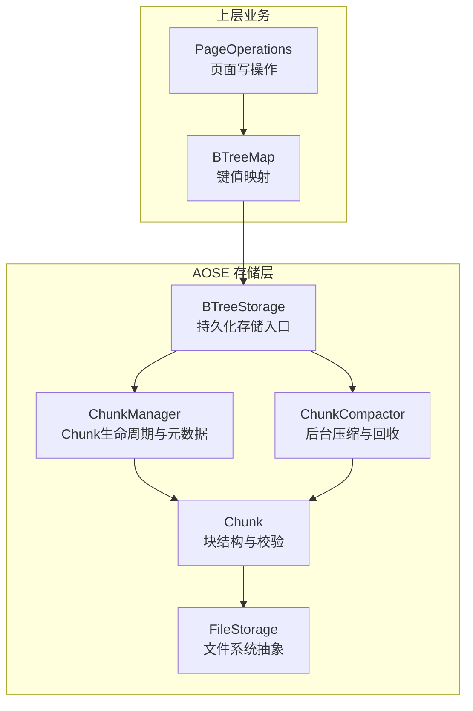
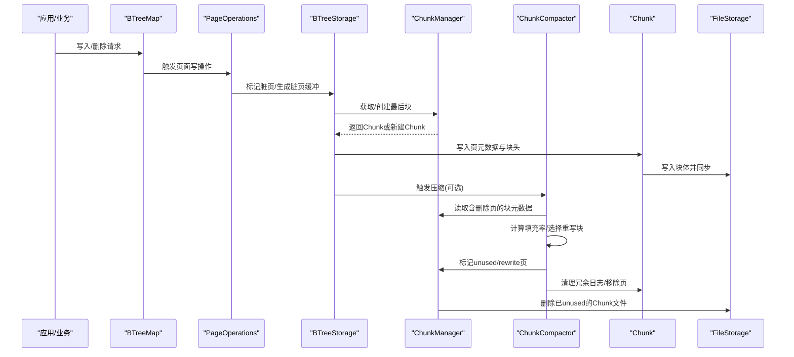
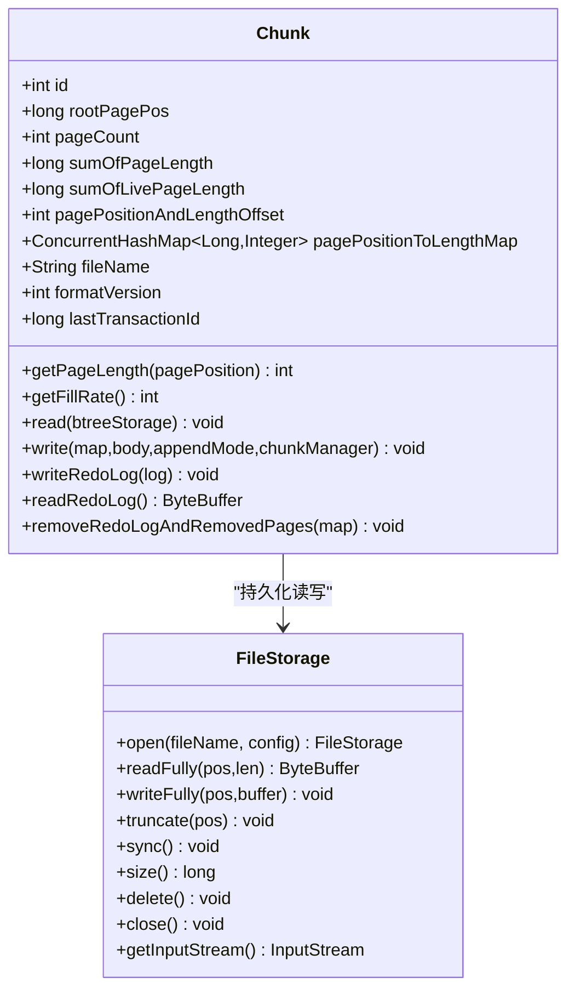
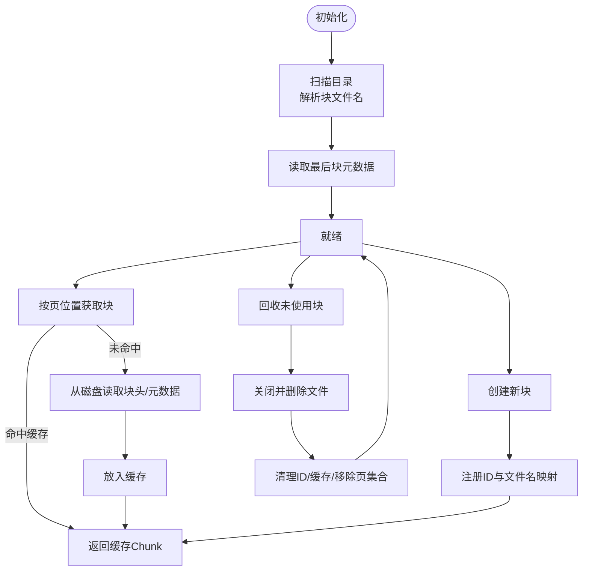
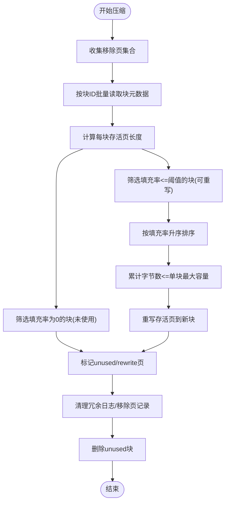
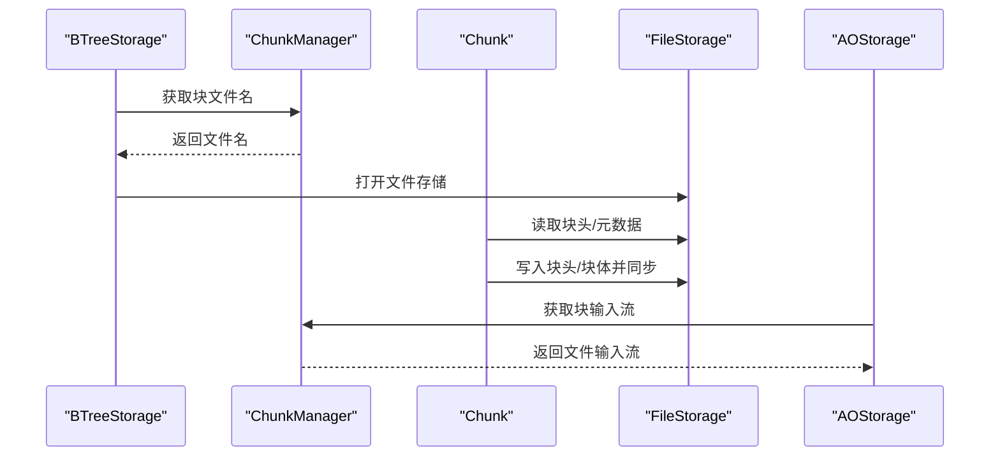
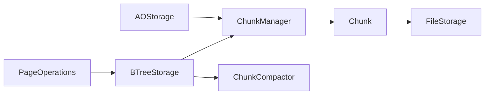

# Chunk管理

<cite>
**本文引用的文件列表**
- [Chunk.java](https://github.com/lealone/Lealone/blob/master/lealone-aose/src/main/java/com/lealone/storage/aose/btree/chunk/Chunk.java)
- [ChunkCompactor.java](https://github.com/lealone/Lealone/blob/master/lealone-aose/src/main/java/com/lealone/storage/aose/btree/chunk/ChunkCompactor.java)
- [ChunkManager.java](https://github.com/lealone/Lealone/blob/master/lealone-aose/src/main/java/com/lealone/storage/aose/btree/chunk/ChunkManager.java)
- [BTreeStorage.java](https://github.com/lealone/Lealone/blob/master/lealone-aose/src/main/java/com/lealone/storage/aose/btree/BTreeStorage.java)
- [AOStorage.java](https://github.com/lealone/Lealone/blob/master/lealone-aose/src/main/java/com/lealone/storage/aose/AOStorage.java)
- [FileStorage.java](https://github.com/lealone/Lealone/blob/master/lealone-common/src/main/java/com/lealone/storage/fs/FileStorage.java)
- [PageOperations.java](https://github.com/lealone/Lealone/blob/master/lealone-aose/src/main/java/com/lealone/storage\aose\btree\page\PageOperations.java)
- [AoseTestBase.java](https://github.com/lealone/Lealone/blob/master/lealone-test/src/test/java/com/lealone/test\aose\AoseTestBase.java)
</cite>

## 目录
1. [简介](#简介)
2. [项目结构](#项目结构)
3. [核心组件](#核心组件)
4. [架构总览](#架构总览)
5. [组件详解](#组件详解)
6. [依赖关系分析](#依赖关系分析)
7. [性能考量](#性能考量)
8. [故障排查指南](#故障排查指南)
9. [结论](#结论)
10. [附录：配置与调优](#附录配置与调优)

## 简介
本文件面向开发者与运维人员，系统性阐述Lealone AOSE（自适应优化存储引擎）中的Chunk管理子系统，重点覆盖：
- Chunk如何将存储空间划分为固定大小的块，并管理其分配、回收与元数据维护
- ChunkCompactor如何实现后台数据压缩，包括脏页识别、数据迁移与空间回收
- Chunk结构设计（头部、数据区、校验机制）
- 文件存储层（FileStorage）与ChunkManager的协作方式，实现数据持久化
- Chunk管理策略对写入放大、空间利用率与I/O性能的影响，并给出可操作的配置与调优建议

## 项目结构
Chunk管理相关代码集中在AOSE模块的btree/chunk包内，配合BTreeStorage、ChunkManager、ChunkCompactor以及文件系统抽象FileStorage共同完成持久化与压缩。

图表来源
- [BTreeStorage.java](https://github.com/lealone/Lealone/blob/master/lealone-aose/src/main/java/com/lealone/storage/aose/btree/BTreeStorage.java#L1-L120)
- [ChunkManager.java](https://github.com/lealone/Lealone/blob/master/lealone-aose/src/main/java/com/lealone/storage/aose/btree/chunk/ChunkManager.java#L1-L120)
- [ChunkCompactor.java](https://github.com/lealone/Lealone/blob/master/lealone-aose/src/main/java/com/lealone/storage/aose/btree/chunk/ChunkCompactor.java#L1-L80)
- [Chunk.java](https://github.com/lealone/Lealone/blob/master/lealone-aose/src/main/java/com/lealone/storage/aose/btree/chunk/Chunk.java#L1-L120)
- [FileStorage.java](https://github.com/lealone/Lealone/blob/master/lealone-common/src/main/java/com/lealone/storage/fs/FileStorage.java#L72-L134)

章节来源
- [BTreeStorage.java](https://github.com/lealone/Lealone/blob/master/lealone-aose/src/main/java/com/lealone/storage/aose/btree/BTreeStorage.java#L1-L120)
- [ChunkManager.java](https://github.com/lealone/Lealone/blob/master/lealone-aose/src/main/java/com/lealone/storage/aose/btree/chunk/ChunkManager.java#L1-L120)

## 核心组件
- Chunk：块级数据容器，包含页位置与长度映射、移除页集合、根页位置、统计信息（页总数、总长度、存活页长度），并负责块头的读写与校验。
- ChunkManager：管理Chunk的创建、加载、缓存、文件名映射、移除页集合聚合与未使用Chunk的删除。
- ChunkCompactor：后台压缩器，扫描被删除页集合，识别低填充率Chunk，准备重写到新Chunk，并清理unused chunk与移除页记录。
- BTreeStorage：存储入口，协调保存流程、压缩触发、文件打开与同步。
- FileStorage：文件系统抽象，提供读写、截断、同步、输入流等能力。

章节来源
- [Chunk.java](https://github.com/lealone/Lealone/blob/master/lealone-aose/src/main/java/com/lealone/storage/aose/btree/chunk/Chunk.java#L1-L120)
- [ChunkManager.java](https://github.com/lealone/Lealone/blob/master/lealone-aose/src/main/java/com/lealone/storage/aose/btree/chunk/ChunkManager.java#L1-L120)
- [ChunkCompactor.java](https://github.com/lealone/Lealone/blob/master/lealone-aose/src/main/java/com/lealone/storage/aose/btree/chunk/ChunkCompactor.java#L1-L80)
- [BTreeStorage.java](https://github.com/lealone/Lealone/blob/master/lealone-aose/src/main/java/com/lealone/storage/aose/btree/BTreeStorage.java#L1-L120)
- [FileStorage.java](https://github.com/lealone/Lealone/blob/master/lealone-common/src/main/java/com/lealone/storage/fs/FileStorage.java#L72-L134)

## 架构总览
Chunk管理子系统围绕“块”这一基本单位组织数据持久化与压缩回收。写入路径通过页面操作触发脏页标记与落盘；压缩路径通过扫描移除页集合，识别低填充率块并重写到新块，最终回收旧块与冗余日志。

图表来源
- [PageOperations.java](https://github.com/lealone/Lealone/blob/master/lealone-aose/src/main/java/com/lealone/storage\aose\btree\page\PageOperations.java#L1-L120)
- [BTreeStorage.java](https://github.com/lealone/Lealone/blob/master/lealone-aose/src/main/java/com/lealone/storage/aose/btree/BTreeStorage.java#L190-L340)
- [ChunkManager.java](https://github.com/lealone/Lealone/blob/master/lealone-aose/src/main/java/com/lealone/storage/aose/btree/chunk/ChunkManager.java#L120-L206)
- [ChunkCompactor.java](https://github.com/lealone/Lealone/blob/master/lealone-aose/src/main/java/com/lealone/storage/aose/btree/chunk/ChunkCompactor.java#L69-L169)
- [Chunk.java](https://github.com/lealone/Lealone/blob/master/lealone-aose/src/main/java/com/lealone/storage/aose/btree/chunk/Chunk.java#L298-L354)
- [FileStorage.java](https://github.com/lealone/Lealone/blob/master/lealone-common/src/main/java/com/lealone/storage/fs/FileStorage.java#L72-L134)

## 组件详解

### Chunk结构与元数据
- 块头设计
  - 头部大小为两倍物理扇区大小，分别写入文件开头与中间位置，提升崩溃恢复概率。
  - 头部包含关键字段：块ID、根页位置、页数、页总长度、页位置与长度偏移、格式版本、移除页偏移与计数、事务ID等。
  - 采用Fletcher校验码，两次写入头部并校验，确保一致性。
- 数据区
  - 页位置与长度映射表用于快速定位与校验页长度。
  - 移除页集合记录被删除页的位置，支持增量清理与重写决策。
- 填充率计算
  - 基于存活页长度与总页长度计算百分比，作为压缩阈值判断依据。
- 文件位置换算
  - 提供从页偏移到文件绝对位置的换算函数，保证页读写与块头分离。

图表来源
- [Chunk.java](https://github.com/lealone/Lealone/blob/master/lealone-aose/src/main/java/com/lealone/storage/aose/btree/chunk/Chunk.java#L1-L200)
- [FileStorage.java](https://github.com/lealone/Lealone/blob/master/lealone-common/src/main/java/com/lealone/storage/fs/FileStorage.java#L72-L134)

章节来源
- [Chunk.java](https://github.com/lealone/Lealone/blob/master/lealone-aose/src/main/java/com/lealone/storage/aose/btree/chunk/Chunk.java#L1-L200)
- [Chunk.java](https://github.com/lealone/Lealone/blob/master/lealone-aose/src/main/java/com/lealone/storage/aose/btree/chunk/Chunk.java#L200-L354)

### ChunkManager：块生命周期与元数据管理
- 初始化与文件发现
  - 遍历映射目录下的块文件，解析文件名中的块ID与序列号，确定“最后块”。
- 块创建与缓存
  - 分配新的块ID，生成块文件名，创建Chunk对象但不立即写入文件。
- 块读取与缓存
  - 通过页位置推导块ID，按需从磁盘读取块头与元数据，放入并发缓存。
- 移除页集合
  - 维护全局移除页集合，合并最后块中的移除页，供压缩器扫描。
- 未使用块回收
  - 关闭并删除未使用块文件，清理ID映射与缓存，并从移除页集合中剔除对应页。

图表来源
- [ChunkManager.java](https://github.com/lealone/Lealone/blob/master/lealone-aose/src/main/java/com/lealone/storage/aose/btree/chunk/ChunkManager.java#L1-L206)

章节来源
- [ChunkManager.java](https://github.com/lealone/Lealone/blob/master/lealone-aose/src/main/java/com/lealone/storage/aose/btree/chunk/ChunkManager.java#L1-L206)

### ChunkCompactor：后台压缩与回收
- 压缩触发
  - 在存储保存流程中可选择性触发压缩，基于最小填充率阈值决定是否重写。
- 脏页识别
  - 从ChunkManager聚合的移除页集合中识别受影响的块，计算每块存活页长度。
- 低填充率块筛选
  - 仅对填充率低于阈值的块进行重写，按填充率升序排序，限制重写总量不超过单块最大容量。
- 数据迁移与清理
  - 将未被删除的页重写到新块，清理冗余日志与移除页记录；未使用的块延迟删除，待最新trunk写入成功后再统一回收。
- 与ChunkManager协作
  - 通过ChunkManager提供的读取接口批量加载块元数据，清理unused块与rewrite页集合。

图表来源
- [ChunkCompactor.java](https://github.com/lealone/Lealone/blob/master/lealone-aose/src/main/java/com/lealone/storage/aose/btree/chunk/ChunkCompactor.java#L69-L169)
- [ChunkManager.java](https://github.com/lealone/Lealone/blob/master/lealone-aose/src/main/java/com/lealone/storage/aose/btree/chunk/ChunkManager.java#L165-L206)

章节来源
- [ChunkCompactor.java](https://github.com/lealone/Lealone/blob/master/lealone-aose/src/main/java/com/lealone/storage/aose/btree/chunk/ChunkCompactor.java#L1-L169)
- [ChunkManager.java](https://github.com/lealone/Lealone/blob/master/lealone-aose/src/main/java/com/lealone/storage/aose/btree/chunk/ChunkManager.java#L165-L206)

### 文件存储层（FileStorage）与ChunkManager协作
- 文件打开与读写
  - BTreeStorage根据块文件名打开FileStorage，提供读写、截断、同步、删除、关闭与输入流等能力。
- Chunk与FileStorage交互
  - Chunk在读取时从文件头与元数据区读取，写入时先写块头，再写块体并同步；支持追加模式与重做日志写入。
- AOStorage集成
  - AOStorage通过BTreeStorage的ChunkManager将文件输入流暴露给外部备份/传输场景。

图表来源
- [BTreeStorage.java](https://github.com/lealone/Lealone/blob/master/lealone-aose/src/main/java/com/lealone/storage/aose/btree/BTreeStorage.java#L187-L193)
- [ChunkManager.java](https://github.com/lealone/Lealone/blob/master/lealone-aose/src/main/java/com/lealone/storage/aose/btree/chunk/ChunkManager.java#L176-L186)
- [Chunk.java](https://github.com/lealone/Lealone/blob/master/lealone-aose/src/main/java/com/lealone/storage/aose/btree/chunk/Chunk.java#L298-L354)
- [AOStorage.java](https://github.com/lealone/Lealone/blob/master/lealone-aose/src/main/java/com/lealone/storage/aose/AOStorage.java#L48-L51)
- [FileStorage.java](https://github.com/lealone/Lealone/blob/master/lealone-common/src/main/java/com/lealone/storage/fs/FileStorage.java#L72-L134)

章节来源
- [BTreeStorage.java](https://github.com/lealone/Lealone/blob/master/lealone-aose/src/main/java/com/lealone/storage/aose/btree/BTreeStorage.java#L187-L193)
- [ChunkManager.java](https://github.com/lealone/Lealone/blob/master/lealone-aose/src/main/java/com/lealone/storage/aose/btree/chunk/ChunkManager.java#L176-L186)
- [Chunk.java](https://github.com/lealone/Lealone/blob/master/lealone-aose/src/main/java/com/lealone/storage/aose/btree/chunk/Chunk.java#L298-L354)
- [AOStorage.java](https://github.com/lealone/Lealone/blob/master/lealone-aose/src/main/java/com/lealone/storage/aose/AOStorage.java#L48-L51)
- [FileStorage.java](https://github.com/lealone/Lealone/blob/master/lealone-common/src/main/java/com/lealone/storage/fs/FileStorage.java#L72-L134)

## 依赖关系分析
- BTreeStorage依赖ChunkManager与ChunkCompactor，控制压缩触发与保存流程。
- ChunkManager依赖FileStorage进行文件读写与管理。
- Chunk依赖FileStorage进行块头与块体的读写，并维护页位置与长度映射。
- PageOperations在写入过程中标记脏页，间接驱动ChunkManager与Chunk的持久化与回收。

图表来源
- [PageOperations.java](https://github.com/lealone/Lealone/blob/master/lealone-aose/src/main/java/com/lealone/storage\aose\btree\page\PageOperations.java#L1-L120)
- [BTreeStorage.java](https://github.com/lealone/Lealone/blob/master/lealone-aose/src/main/java/com/lealone/storage/aose/btree/BTreeStorage.java#L1-L120)
- [ChunkManager.java](https://github.com/lealone/Lealone/blob/master/lealone-aose/src/main/java/com/lealone/storage/aose/btree/chunk/ChunkManager.java#L1-L120)
- [Chunk.java](https://github.com/lealone/Lealone/blob/master/lealone-aose/src/main/java/com/lealone/storage/aose/btree/chunk/Chunk.java#L1-L120)
- [AOStorage.java](https://github.com/lealone/Lealone/blob/master/lealone-aose/src/main/java/com/lealone/storage/aose/AOStorage.java#L48-L51)

章节来源
- [PageOperations.java](https://github.com/lealone/Lealone/blob/master/lealone-aose/src/main/java/com/lealone/storage\aose\btree\page\PageOperations.java#L1-L120)
- [BTreeStorage.java](https://github.com/lealone/Lealone/blob/master/lealone-aose/src/main/java/com/lealone/storage/aose/btree/BTreeStorage.java#L1-L120)
- [ChunkManager.java](https://github.com/lealone/Lealone/blob/master/lealone-aose/src/main/java/com/lealone/storage/aose/btree/chunk/ChunkManager.java#L1-L120)
- [Chunk.java](https://github.com/lealone/Lealone/blob/master/lealone-aose/src/main/java/com/lealone/storage/aose/btree/chunk/Chunk.java#L1-L120)
- [AOStorage.java](https://github.com/lealone/Lealone/blob/master/lealone-aose/src/main/java/com/lealone/storage/aose/AOStorage.java#L48-L51)

## 性能考量
- 写入放大
  - 追加模式仅在最后块未被标记为unused且未使用旧格式时启用，有助于减少随机写；当不满足条件时会创建新块，可能增加写放大。
  - 压缩过程涉及重写存活页到新块，会产生额外写放大，但能显著降低碎片与后续读放大。
- 空间利用率
  - 通过最小填充率阈值控制压缩触发，阈值越高，越晚触发压缩，空间利用率可能下降；阈值过低可能导致频繁重写。
  - 填充率计算基于存活页长度，避免将大量空洞页计入有效容量。
- I/O性能
  - 块头双写与Fletcher校验增强可靠性，但带来额外I/O；可通过合理设置块大小与压缩级别平衡吞吐与可靠性。
  - FileStorage提供同步与截断能力，压缩完成后及时截断冗余日志，减少后续读放大。

[本节为通用性能讨论，无需列出具体文件来源]

## 故障排查指南
- 崩溃恢复与块头损坏
  - 若块头两次校验均失败，将抛出文件损坏异常；建议检查磁盘健康与文件系统一致性。
- 页位置缺失
  - 读取页长度时若映射不存在，抛出文件损坏异常；检查移除页集合与块元数据是否一致。
- 保存流程异常
  - BTreeStorage在保存过程中捕获非法状态并进入panic模式，关闭相关资源；检查配置参数与磁盘空间。
- 压缩未生效
  - 检查最小填充率阈值是否大于0，移除页集合是否为空，以及是否有低填充率块被选中重写。

章节来源
- [Chunk.java](https://github.com/lealone/Lealone/blob/master/lealone-aose/src/main/java/com/lealone/storage/aose/btree/chunk/Chunk.java#L94-L102)
- [Chunk.java](https://github.com/lealone/Lealone/blob/master/lealone-aose/src/main/java/com/lealone/storage/aose/btree/chunk/Chunk.java#L227-L231)
- [BTreeStorage.java](https://github.com/lealone/Lealone/blob/master/lealone-aose/src/main/java/com/lealone/storage/aose/btree/BTreeStorage.java#L310-L321)

## 结论
Chunk管理子系统通过块头双写与校验、页位置映射、移除页集合与后台压缩，实现了高可靠、可扩展的数据持久化与空间回收。合理的配置与调优能在写入放大、空间利用率与I/O性能之间取得良好平衡。

[本节为总结性内容，无需列出具体文件来源]

## 附录：配置与调优
- 关键配置项
  - 最小填充率（StorageSetting.MIN_FILL_RATE）：默认30，建议根据工作负载调整，过高降低压缩频率，过低增加重写次数。
  - 块最大大小（StorageSetting.MAX_CHUNK_SIZE）：默认256MB，受块头预留空间限制，建议与磁盘IO特性匹配。
  - 页面大小（DbSetting.PAGE_SIZE）：影响页内键值布局与压缩效果。
  - 压缩级别（DbSetting.COMPRESS）：支持关闭、LZF、Deflate，按吞吐与CPU占用权衡。
- 调优建议
  - 低写放大场景：提高最小填充率，减少重写；增大块最大大小，降低块切换频率。
  - 高空间利用率场景：适度降低最小填充率，更积极地触发压缩；定期执行压缩流程。
  - CPU受限场景：降低压缩级别或关闭压缩，优先保证写入吞吐。
  - 测试验证：参考测试基类设置最小填充率，观察写入与空间变化趋势。

章节来源
- [BTreeStorage.java](https://github.com/lealone/Lealone/blob/master/lealone-aose/src/main/java/com/lealone/storage/aose/btree/BTreeStorage.java#L65-L88)
- [BTreeStorage.java](https://github.com/lealone/Lealone/blob/master/lealone-aose/src/main/java/com/lealone/storage/aose/btree/BTreeStorage.java#L171-L178)
- [AoseTestBase.java](https://github.com/lealone/Lealone/blob/master/lealone-test/src/test/java/com/lealone/test\aose\AoseTestBase.java#L72-L85)