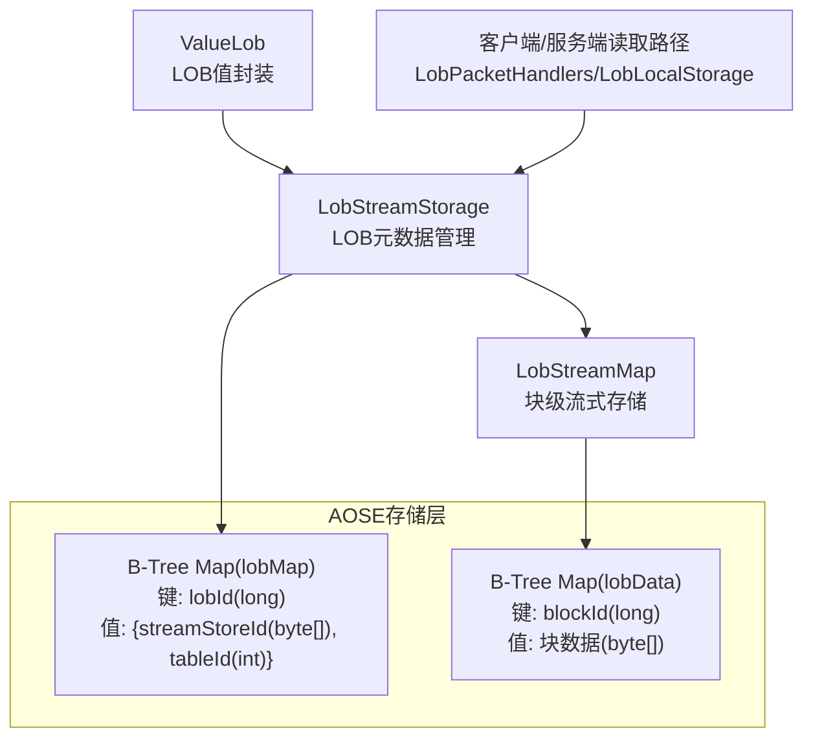
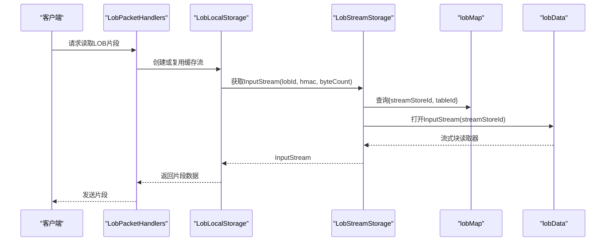
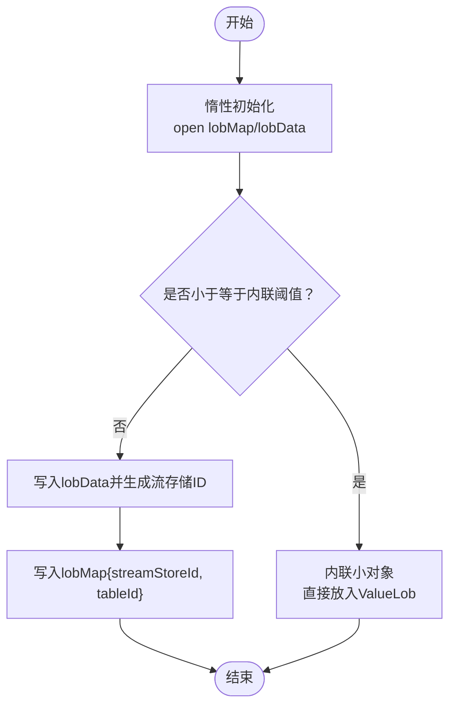
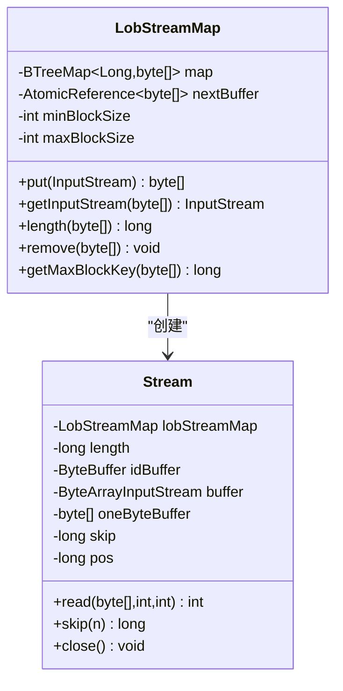
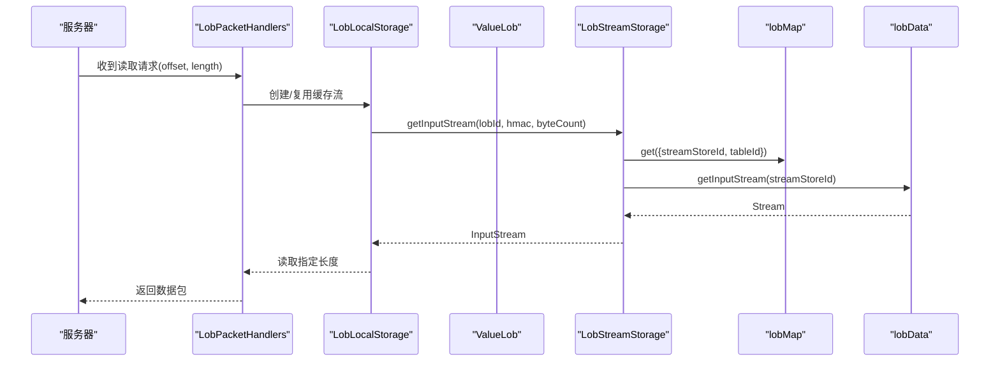
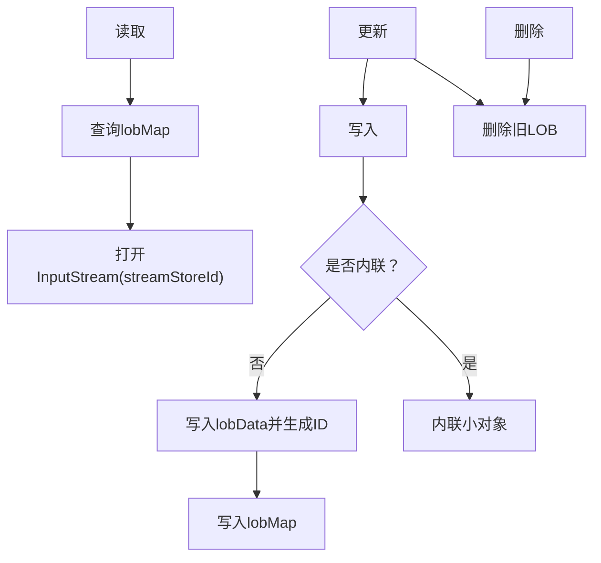
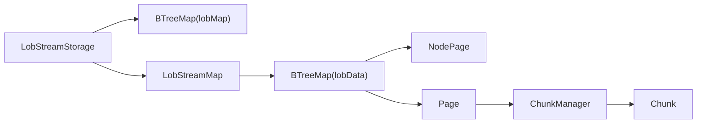

# LOB存储

<cite>
**本文引用的文件列表**
- [LobStreamStorage.java](https://github.com/lealone/Lealone/blob/master/lealone-aose/src/main/java/com/lealone/storage/aose/lob/LobStreamStorage.java)
- [LobStreamMap.java](https://github.com/lealone/Lealone/blob/master/lealone-aose/src/main/java/com/lealone/storage/aose/lob/LobStreamMap.java)
- [LobPacketHandlers.java](https://github.com/lealone/Lealone/blob/master/lealone-server/src/main/java/com/lealone/server/handler/LobPacketHandlers.java)
- [LobLocalStorage.java](https://github.com/lealone/Lealone/blob/master/lealone-common/src/main/java/com/lealone/storage/lob/LobLocalStorage.java)
- [ValueLob.java](https://github.com/lealone/Lealone/blob/master/lealone-common/src/main/java/com/lealone/db/value/ValueLob.java)
- [LobStorageTest.java](https://github.com/lealone/Lealone/blob/master/lealone-test/src/test/java/com/lealone/test/aose/LobStorageTest.java)
- [Constants.java](https://github.com/lealone/Lealone/blob/master/lealone-common/src/main/java/com/lealone/db/Constants.java)
- [SysProperties.java](https://github.com/lealone/Lealone/blob/master/lealone-common/src/main/java/com/lealone/db/SysProperties.java)
- [TableDataHandler.java](https://github.com/lealone/Lealone/blob/master/lealone-db/src/main/java/com/lealone/db/table/TableDataHandler.java)
- [NodePage.java](https://github.com/lealone/Lealone/blob/master/lealone-aose/src/main/java/com/lealone/storage/aose/btree/page/NodePage.java)
- [Page.java](https://github.com/lealone/Lealone/blob/master/lealone-aose/src/main/java/com/lealone/storage/aose/btree/page/Page.java)
- [ChunkManager.java](https://github.com/lealone/Lealone/blob/master/lealone-aose/src/main/java/com/lealone/storage/aose/btree/chunk/ChunkManager.java)
- [Chunk.java](https://github.com/lealone/Lealone/blob/master/lealone-aose/src/main/java/com/lealone/storage/aose/btree/chunk/Chunk.java)
</cite>

## 目录
1. [简介](#简介)
2. [项目结构](#项目结构)
3. [核心组件](#核心组件)
4. [架构总览](#架构总览)
5. [组件详解](#组件详解)
6. [依赖关系分析](#依赖关系分析)
7. [性能考量](#性能考量)
8. [故障排查指南](#故障排查指南)
9. [结论](#结论)
10. [附录](#附录)

## 简介
本文件系统性梳理Lealone中LOB（大对象）存储机制，重点围绕LobStreamStorage与LobStreamMap的设计与实现，解释其基于流式处理、分块存储、延迟加载与内存管理的策略，并结合B-Tree存储的集成方式，给出写入、读取、更新、删除的完整流程图与最佳实践建议。同时提供与常规行/列存储在使用场景上的对比与选择建议。

## 项目结构
LOB存储位于AOSE（面向顺序存储引擎）模块中，采用“元数据+B-Tree数据块”的双映射设计：
- 元数据映射：以LOB ID为键，存储流存储ID与表ID等元信息
- 数据块映射：以自增长键为键，存储实际二进制块，支持内联小块与外部分块

图表来源
- [LobStreamStorage.java](https://github.com/lealone/Lealone/blob/master/lealone-aose/src/main/java/com/lealone/storage/aose/lob/LobStreamStorage.java#L43-L117)
- [LobStreamMap.java](https://github.com/lealone/Lealone/blob/master/lealone-aose/src/main/java/com/lealone/storage/aose/lob/LobStreamMap.java#L36-L70)

章节来源
- [LobStreamStorage.java](https://github.com/lealone/Lealone/blob/master/lealone-aose/src/main/java/com/lealone/storage/aose/lob/LobStreamStorage.java#L43-L117)
- [LobStreamMap.java](https://github.com/lealone/Lealone/blob/master/lealone-aose/src/main/java/com/lealone/storage/aose/lob/LobStreamMap.java#L36-L70)

## 核心组件
- LobStreamStorage：LOB后端存储，负责元数据映射与生命周期管理（保存、GC、关闭、备份）
- LobStreamMap：块级流式存储，负责将输入流切分为块并以可变长度编码的ID串联，支持内联、直接块与间接块
- ValueLob：LOB值对象，封装LOB类型、长度、表ID、LOB ID等
- 客户端读取链路：LobPacketHandlers与LobLocalStorage协作，支持缓存与限流读取

章节来源
- [LobStreamStorage.java](https://github.com/lealone/Lealone/blob/master/lealone-aose/src/main/java/com/lealone/storage/aose/lob/LobStreamStorage.java#L43-L212)
- [LobStreamMap.java](https://github.com/lealone/Lealone/blob/master/lealone-aose/src/main/java/com/lealone/storage/aose/lob/LobStreamMap.java#L108-L173)
- [ValueLob.java](https://github.com/lealone/Lealone/blob/master/lealone-common/src/main/java/com/lealone/db/value/ValueLob.java#L576-L605)
- [LobPacketHandlers.java](https://github.com/lealone/Lealone/blob/master/lealone-server/src/main/java/com/lealone/server/handler/LobPacketHandlers.java#L37-L98)
- [LobLocalStorage.java](https://github.com/lealone/Lealone/blob/master/lealone-common/src/main/java/com/lealone/storage/lob/LobLocalStorage.java#L80-L122)

## 架构总览
LOB存储通过两层B-Tree映射实现：
- lobMap：记录LOB ID到流存储ID与表ID的映射
- lobData：记录块ID到块数据的映射
LobStreamStorage在首次使用时惰性初始化两个映射；LobStreamMap内部以最小/最大块大小控制分块策略，并通过可变长度编码的ID描述数据结构（内联、直接块、间接块）。

图表来源
- [LobPacketHandlers.java](https://github.com/lealone/Lealone/blob/master/lealone-server/src/main/java/com/lealone/server/handler/LobPacketHandlers.java#L37-L98)
- [LobLocalStorage.java](https://github.com/lealone/Lealone/blob/master/lealone-common/src/main/java/com/lealone/storage/lob/LobLocalStorage.java#L80-L122)
- [LobStreamStorage.java](https://github.com/lealone/Lealone/blob/master/lealone-aose/src/main/java/com/lealone/storage/aose/lob/LobStreamStorage.java#L214-L223)
- [LobStreamMap.java](https://github.com/lealone/Lealone/blob/master/lealone-aose/src/main/java/com/lealone/storage/aose/lob/LobStreamMap.java#L368-L371)

## 组件详解

### LobStreamStorage：元数据与生命周期管理
- 惰性初始化：仅在首次使用时打开lobMap与lobData两个B-Tree映射
- 写入流程：根据最大内联长度阈值决定是否内联；否则将流写入lobData并生成流存储ID，再写入lobMap
- 读取流程：根据LOB ID从lobMap获取流存储ID，再由LobStreamMap返回InputStream
- 表迁移与清理：支持将LOB归属表ID迁移到目标表，或按表ID批量清理
- GC与备份：统一触发B-Tree映射的保存、垃圾回收与备份

图表来源
- [LobStreamStorage.java](https://github.com/lealone/Lealone/blob/master/lealone-aose/src/main/java/com/lealone/storage/aose/lob/LobStreamStorage.java#L110-L147)
- [LobStreamStorage.java](https://github.com/lealone/Lealone/blob/master/lealone-aose/src/main/java/com/lealone/storage/aose/lob/LobStreamStorage.java#L150-L212)

章节来源
- [LobStreamStorage.java](https://github.com/lealone/Lealone/blob/master/lealone-aose/src/main/java/com/lealone/storage/aose/lob/LobStreamStorage.java#L43-L212)
- [TableDataHandler.java](https://github.com/lealone/Lealone/blob/master/lealone-db/src/main/java/com/lealone/db/table/TableDataHandler.java#L34-L81)

### LobStreamMap：块级流式存储与ID编码
- 分块策略：最小块大小与最大块大小可配置，默认分别为256字节与256KB
- ID编码格式：
  - 内联块：0 + 变长int长度 + 数据
  - 直接块：1 + 变长int长度 + 变长long块ID
  - 间接块：2 + 变长long总长度 + 变长long块ID（该块内含另一段ID序列）
- 流式读取：InputStream按ID逐步解码，必要时回溯B-Tree读取块数据，支持跳过与位置跟踪
- 延迟加载：仅在需要时读取对应块，避免一次性加载全部LOB
- 内存管理：重用读缓冲区，减少分配与拷贝

图表来源
- [LobStreamMap.java](https://github.com/lealone/Lealone/blob/master/lealone-aose/src/main/java/com/lealone/storage/aose/lob/LobStreamMap.java#L36-L100)
- [LobStreamMap.java](https://github.com/lealone/Lealone/blob/master/lealone-aose/src/main/java/com/lealone/storage/aose/lob/LobStreamMap.java#L108-L173)
- [LobStreamMap.java](https://github.com/lealone/Lealone/blob/master/lealone-aose/src/main/java/com/lealone/storage/aose/lob/LobStreamMap.java#L368-L521)

章节来源
- [LobStreamMap.java](https://github.com/lealone/Lealone/blob/master/lealone-aose/src/main/java/com/lealone/storage/aose/lob/LobStreamMap.java#L36-L173)
- [LobStreamMap.java](https://github.com/lealone/Lealone/blob/master/lealone-aose/src/main/java/com/lealone/storage/aose/lob/LobStreamMap.java#L175-L281)
- [LobStreamMap.java](https://github.com/lealone/Lealone/blob/master/lealone-aose/src/main/java/com/lealone/storage/aose/lob/LobStreamMap.java#L368-L521)

### 读取链路：客户端与服务端协作
- 服务端：LobPacketHandlers根据请求偏移与长度，定位LOB并构造InputStream，使用缓存流提升重复读取效率
- 客户端：LobLocalStorage封装读取过程，限制每次读取长度，确保可控内存占用

图表来源
- [LobPacketHandlers.java](https://github.com/lealone/Lealone/blob/master/lealone-server/src/main/java/com/lealone/server/handler/LobPacketHandlers.java#L37-L98)
- [LobLocalStorage.java](https://github.com/lealone/Lealone/blob/master/lealone-common/src/main/java/com/lealone/storage/lob/LobLocalStorage.java#L80-L122)
- [LobStreamStorage.java](https://github.com/lealone/Lealone/blob/master/lealone-aose/src/main/java/com/lealone/storage/aose/lob/LobStreamStorage.java#L214-L223)

章节来源
- [LobPacketHandlers.java](https://github.com/lealone/Lealone/blob/master/lealone-server/src/main/java/com/lealone/server/handler/LobPacketHandlers.java#L37-L98)
- [LobLocalStorage.java](https://github.com/lealone/Lealone/blob/master/lealone-common/src/main/java/com/lealone/storage/lob/LobLocalStorage.java#L80-L122)

### 写入、读取、更新、删除流程

- 写入（BLOB/CLOB）
  - BLOB：若长度不超过内联阈值则内联；否则将流写入lobData，生成流存储ID并写入lobMap
  - CLOB：Reader转为UTF-8字节流，同样遵循内联或分块策略
- 读取：通过lobMap定位流存储ID，再由LobStreamMap的InputStream按需读取
- 更新：LOB本身不可变，更新通常通过替换LOB ID实现；LOB归属表ID可迁移
- 删除：移除lobMap条目并释放lobData中对应块

图表来源
- [LobStreamStorage.java](https://github.com/lealone/Lealone/blob/master/lealone-aose/src/main/java/com/lealone/storage/aose/lob/LobStreamStorage.java#L150-L212)
- [LobStreamStorage.java](https://github.com/lealone/Lealone/blob/master/lealone-aose/src/main/java/com/lealone/storage/aose/lob/LobStreamStorage.java#L214-L284)
- [LobStreamMap.java](https://github.com/lealone/Lealone/blob/master/lealone-aose/src/main/java/com/lealone/storage/aose/lob/LobStreamMap.java#L108-L173)

章节来源
- [LobStreamStorage.java](https://github.com/lealone/Lealone/blob/master/lealone-aose/src/main/java/com/lealone/storage/aose/lob/LobStreamStorage.java#L150-L284)
- [LobStreamMap.java](https://github.com/lealone/Lealone/blob/master/lealone-aose/src/main/java/com/lealone/storage/aose/lob/LobStreamMap.java#L108-L173)

## 依赖关系分析

### 与B-Tree存储的集成
- LobStreamStorage在惰性初始化时打开两个B-Tree映射：lobMap与lobData
- LobStreamMap内部以Long为键存储块数据，键单调递增，天然适合B-Tree的范围扫描与GC
- B-Tree页面层支持压缩与校验，ChunkManager负责块文件管理与回收

图表来源
- [LobStreamStorage.java](https://github.com/lealone/Lealone/blob/master/lealone-aose/src/main/java/com/lealone/storage/aose/lob/LobStreamStorage.java#L110-L147)
- [LobStreamMap.java](https://github.com/lealone/Lealone/blob/master/lealone-aose/src/main/java/com/lealone/storage/aose/lob/LobStreamMap.java#L36-L70)
- [NodePage.java](https://github.com/lealone/Lealone/blob/master/lealone-aose/src/main/java/com/lealone/storage/aose/btree/page/NodePage.java#L143-L205)
- [Page.java](https://github.com/lealone/Lealone/blob/master/lealone-aose/src/main/java/com/lealone/storage/aose/btree/page/Page.java#L286-L369)
- [ChunkManager.java](https://github.com/lealone/Lealone/blob/master/lealone-aose/src/main/java/com/lealone/storage/aose/btree/chunk/ChunkManager.java#L1-L164)
- [Chunk.java](https://github.com/lealone/Lealone/blob/master/lealone-aose/src/main/java/com/lealone/storage/aose/btree/chunk/Chunk.java#L260-L325)

章节来源
- [NodePage.java](https://github.com/lealone/Lealone/blob/master/lealone-aose/src/main/java/com/lealone/storage/aose/btree/page/NodePage.java#L143-L205)
- [Page.java](https://github.com/lealone/Lealone/blob/master/lealone-aose/src/main/java/com/lealone/storage/aose/btree/page/Page.java#L286-L369)
- [ChunkManager.java](https://github.com/lealone/Lealone/blob/master/lealone-aose/src/main/java/com/lealone/storage/aose/btree/chunk/ChunkManager.java#L1-L164)
- [Chunk.java](https://github.com/lealone/Lealone/blob/master/lealone-aose/src/main/java/com/lealone/storage/aose/btree/chunk/Chunk.java#L260-L325)

## 性能考量
- 分块策略
  - 最小块大小与最大块大小直接影响IO与寻址成本；默认256字节/256KB，适合中小LOB
  - 当ID长度超过最大块的一半或整体超过两倍最小块时，采用间接块以降低ID膨胀
- 延迟加载与内存管理
  - InputStream按需读取块，避免整LOB常驻内存
  - 读缓冲重用，减少GC压力
- 压缩与校验
  - B-Tree页面层支持压缩，可在写入时降低磁盘占用
  - 页面校验与检查值保障一致性
- 配置建议
  - 内联阈值：依据业务中位LOB大小设置，平衡内联与分块
  - 块大小：根据访问模式调整，顺序读取可增大块，随机访问可减小块
  - 客户端读取：限制单次读取长度，避免过大内存占用

章节来源
- [LobStreamMap.java](https://github.com/lealone/Lealone/blob/master/lealone-aose/src/main/java/com/lealone/storage/aose/lob/LobStreamMap.java#L108-L173)
- [Page.java](https://github.com/lealone/Lealone/blob/master/lealone-aose/src/main/java/com/lealone/storage/aose/btree/page/Page.java#L308-L355)
- [Constants.java](https://github.com/lealone/Lealone/blob/master/lealone-common/src/main/java/com/lealone/db/Constants.java#L107-L118)
- [SysProperties.java](https://github.com/lealone/Lealone/blob/master/lealone-common/src/main/java/com/lealone/db/SysProperties.java#L111-L130)

## 故障排查指南
- 常见问题
  - 读取异常：块缺失或ID损坏，抛出“块未找到”类错误
  - 内存溢出：单次读取过大或未及时关闭流
  - GC不生效：未触发保存或GC任务未注册
- 排查步骤
  - 确认lobMap与lobData映射存在且未被清空
  - 使用getMaxBlockKey定位最后使用的块键，清理更高键值的孤儿块
  - 检查客户端是否正确关闭InputStream与缓存流
  - 确保事务引擎已注册GC任务，定期执行垃圾回收

章节来源
- [LobStreamStorage.java](https://github.com/lealone/Lealone/blob/master/lealone-aose/src/main/java/com/lealone/storage/aose/lob/LobStreamStorage.java#L110-L147)
- [LobStreamMap.java](https://github.com/lealone/Lealone/blob/master/lealone-aose/src/main/java/com/lealone/storage/aose/lob/LobStreamMap.java#L214-L247)
- [LobPacketHandlers.java](https://github.com/lealone/Lealone/blob/master/lealone-server/src/main/java/com/lealone/server/handler/LobPacketHandlers.java#L37-L98)

## 结论
Lealone的LOB存储通过“元数据+B-Tree块映射”的双层设计，实现了高效的流式处理与分块存储。LobStreamStorage负责元数据与生命周期管理，LobStreamMap负责块级编码与延迟加载，二者协同在保证一致性的前提下，兼顾了吞吐与内存占用。结合B-Tree的压缩与校验能力，LOB存储在大文件场景具备良好的扩展性与可靠性。

## 附录

### 使用场景与选择建议
- 大文件/多媒体：优先使用LOB存储，利用分块与延迟加载
- 小文本/短数据：可考虑内联存储，减少寻址开销
- 高频随机访问：适当减小块大小，提高命中率
- 顺序扫描：增大块大小，降低寻址次数
- 与常规行/列存储对比
  - 行存储：适合结构化查询与聚合，LOB字段可能影响行宽度与页填充
  - 列存储：适合分析型查询，LOB不适合列式布局
  - LOB存储：面向大对象的专用方案，兼顾性能与一致性

章节来源
- [LobStorageTest.java](https://github.com/lealone/Lealone/blob/master/lealone-test/src/test/java/com/lealone/test/aose/LobStorageTest.java#L1-L56)
- [ValueLob.java](https://github.com/lealone/Lealone/blob/master/lealone-common/src/main/java/com/lealone/db/value/ValueLob.java#L576-L605)