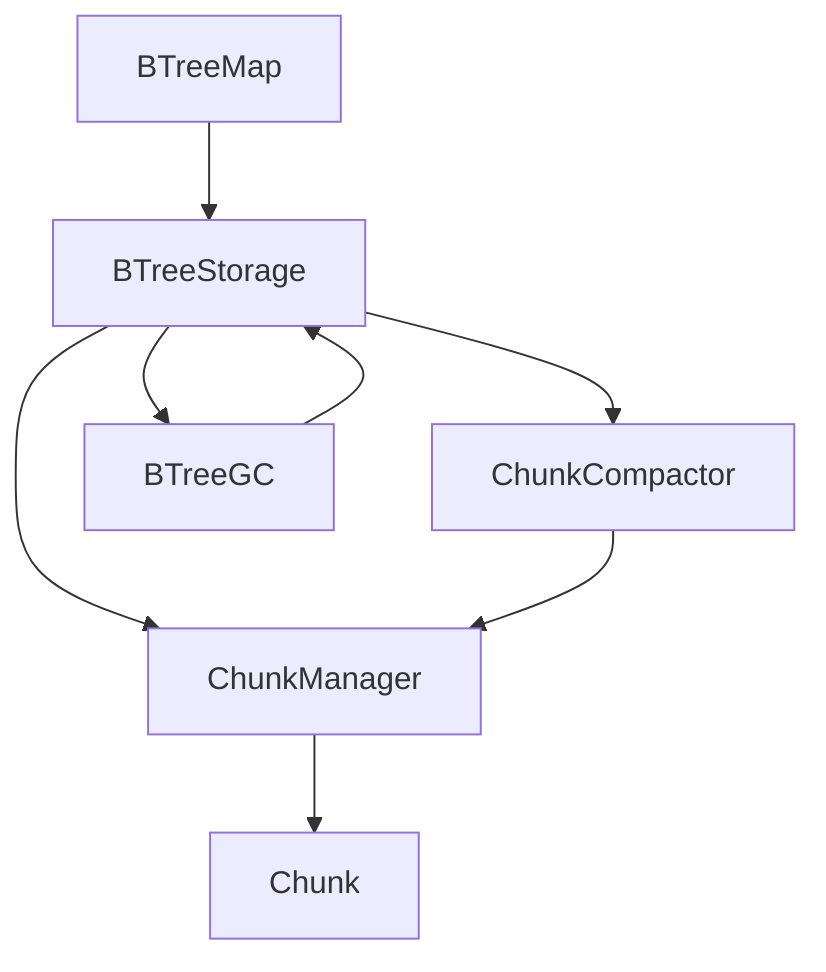
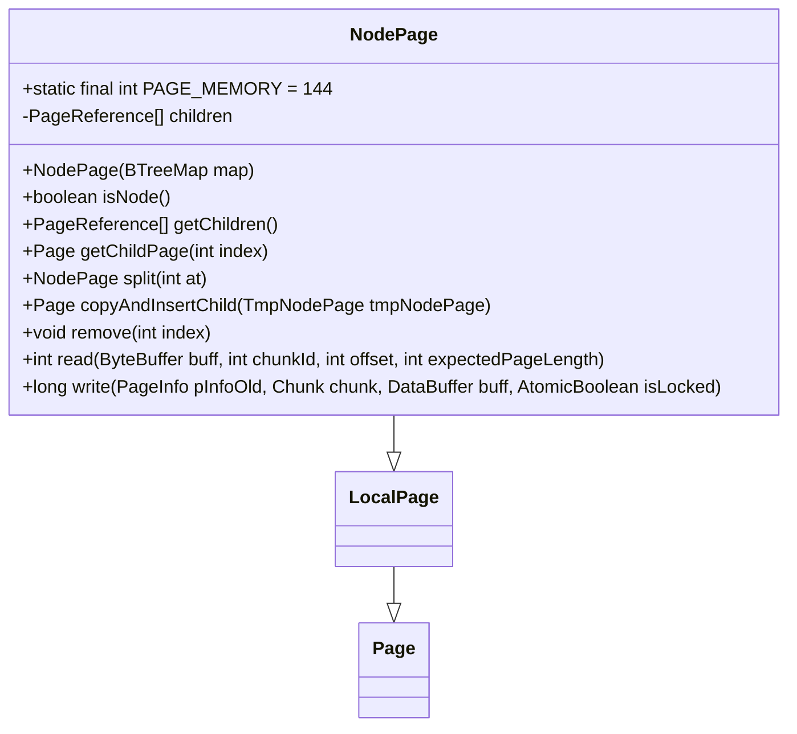
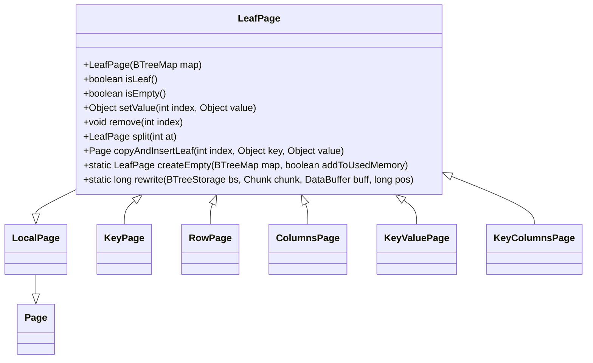
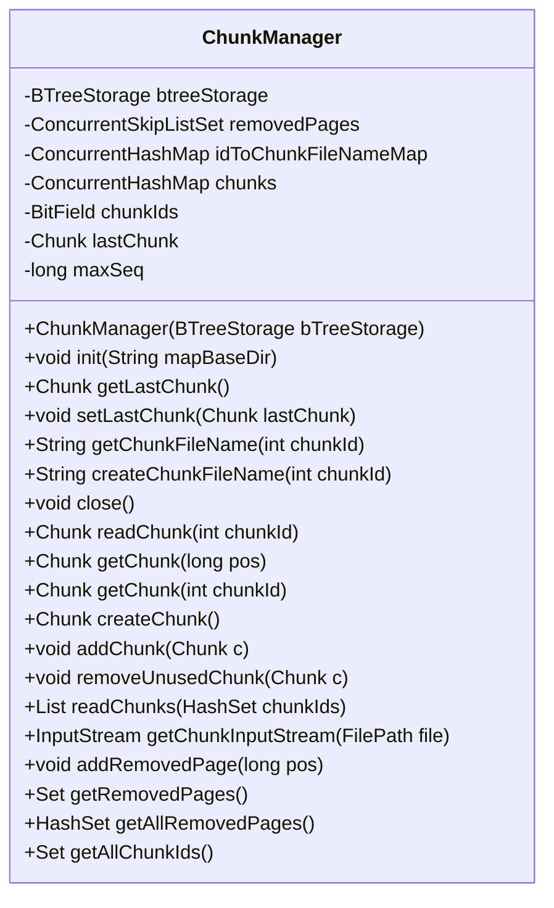
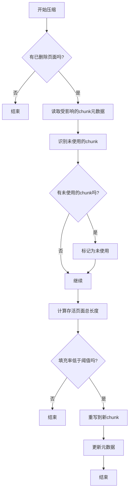
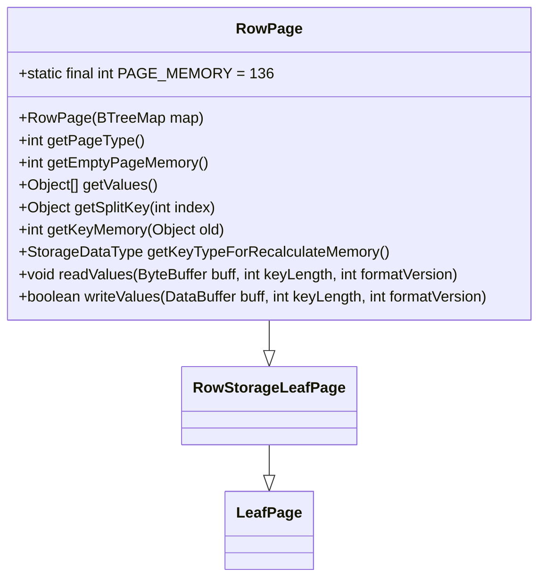
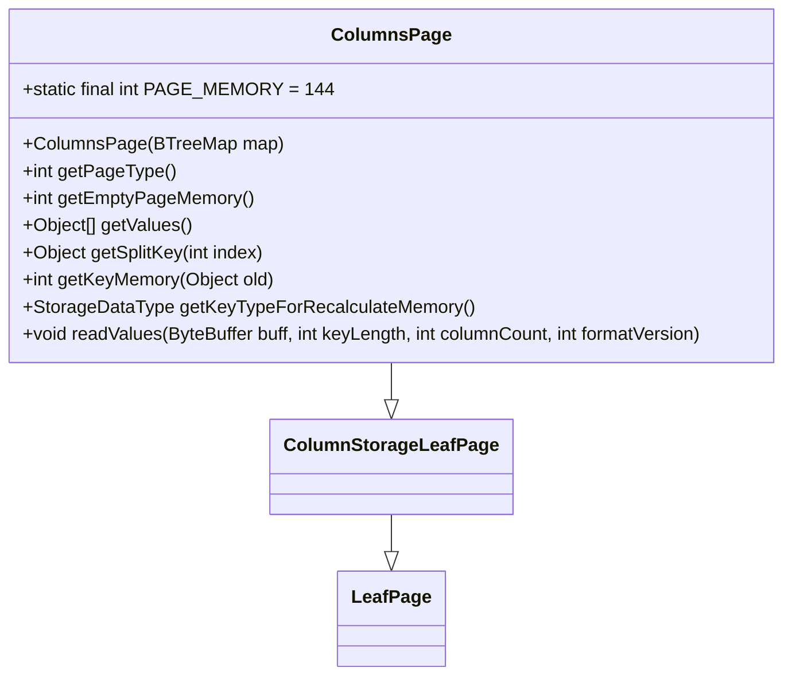
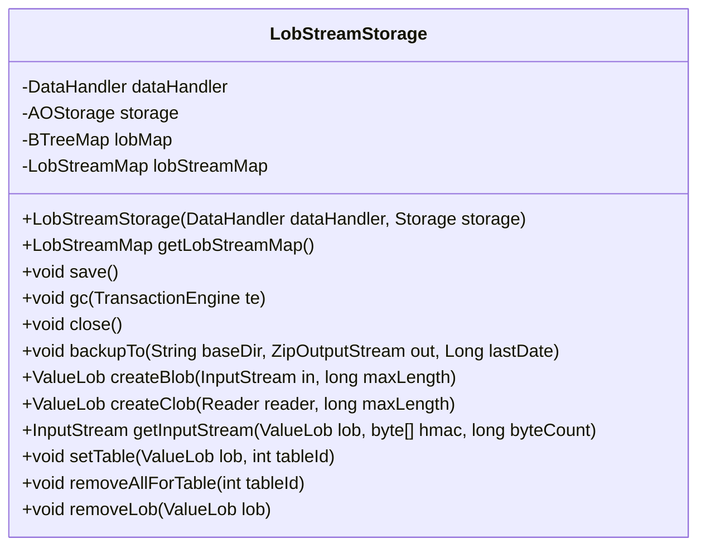
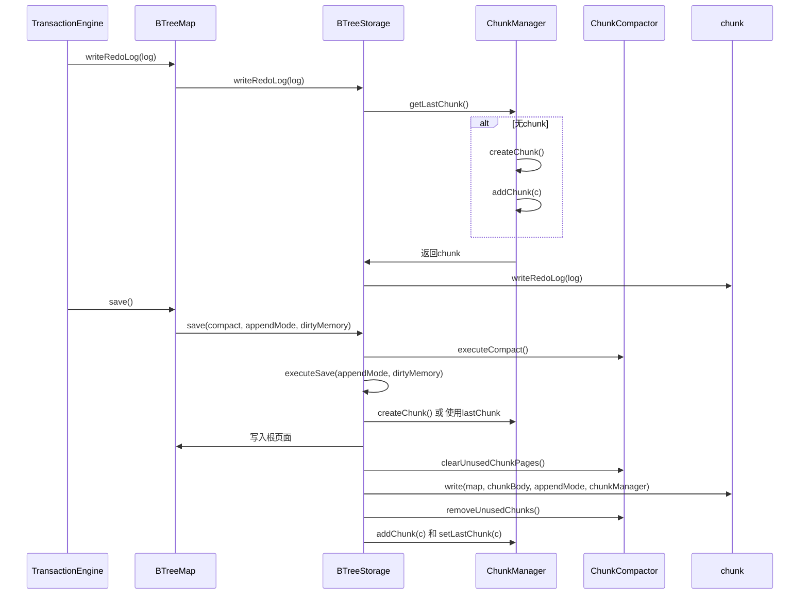
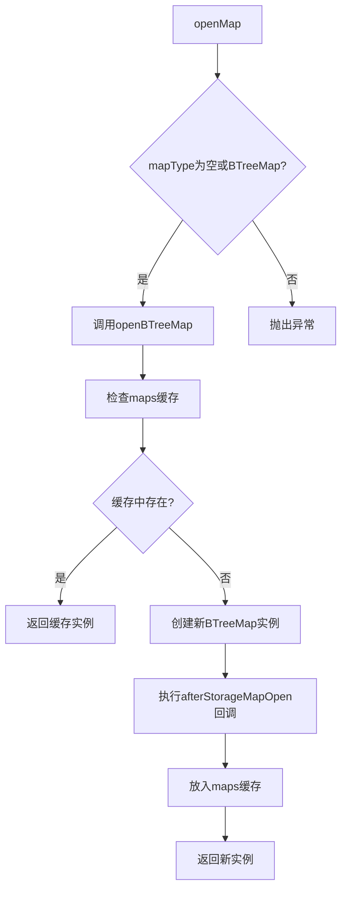

# 存储引擎

<cite>
**本文档引用的文件**   
- [AOStorageEngine.java](file://lealone-aose/src/main/java/com/lealone/storage/aose/AOStorageEngine.java)
- [AOStorage.java](file://lealone-aose/src/main/java/com/lealone/storage/aose/AOStorage.java)
- [BTreeStorage.java](file://lealone-aose/src/main/java/com/lealone/storage/aose/btree/BTreeStorage.java)
- [PageStorageMode.java](file://lealone-aose/src/main/java/com/lealone/storage/aose/btree/page/PageStorageMode.java)
- [ChunkManager.java](file://lealone-aose/src/main/java/com/lealone/storage/aose/btree/chunk/ChunkManager.java)
- [ChunkCompactor.java](file://lealone-aose/src/main/java/com/lealone/storage/aose/btree/chunk/ChunkCompactor.java)
- [Page.java](file://lealone-aose/src/main/java/com/lealone/storage/aose/btree/page/Page.java)
- [NodePage.java](file://lealone-aose/src/main/java/com/lealone/storage/aose/btree/page/NodePage.java)
- [LeafPage.java](file://lealone-aose/src/main/java/com/lealone/storage/aose/btree/page/LeafPage.java)
- [RowPage.java](file://lealone-aose/src/main/java/com/lealone/storage/aose/btree/page/RowPage.java)
- [ColumnsPage.java](file://lealone-aose/src/main/java/com/lealone/storage/aose/btree/page/ColumnsPage.java)
- [KeyValuePage.java](file://lealone-aose/src/main/java/com/lealone/storage/aose/btree/page/KeyValuePage.java)
- [KeyColumnsPage.java](file://lealone-aose/src/main/java/com/lealone/storage/aose/btree/page/KeyColumnsPage.java)
- [BTreeMap.java](file://lealone-aose/src/main/java/com/lealone/storage/aose/btree/BTreeMap.java)
- [LobStreamStorage.java](file://lealone-aose/src/main/java/com/lealone/storage/aose/lob/LobStreamStorage.java)
</cite>

## 目录
1. [引言](#引言)
2. [异步B-Tree架构设计](#异步b-tree架构设计)
3. [B-Tree节点的Page结构](#b-tree节点的page结构)
4. [存储模式](#存储模式)
5. [数据块管理](#数据块管理)
6. [数据压缩机制](#数据压缩机制)
7. [行列混合存储](#行列混合存储)
8. [大对象存储](#大对象存储)
9. [事务交互流程](#事务交互流程)
10. [StorageMap操作流程](#storagemap操作流程)
11. [高并发性能分析](#高并发性能分析)

## 引言
AOSE异步化存储引擎是Lealone数据库的核心组件，采用异步B-Tree架构设计，支持高效的行列混合存储和大对象处理。该引擎通过异步化操作实现了高性能的数据读写，同时提供了灵活的存储模式和数据压缩机制。本文档将深入分析其架构设计、核心组件和工作原理。

**Section sources**
- [AOStorageEngine.java](file://lealone-aose/src/main/java/com/lealone/storage/aose/AOStorageEngine.java#L1-L33)
- [AOStorage.java](file://lealone-aose/src/main/java/com/lealone/storage/aose/AOStorage.java#L1-L104)

## 异步B-Tree架构设计
AOSE存储引擎基于异步B-Tree架构，通过异步化操作实现高性能的数据访问。B-Tree存储结构由BTreeStorage类管理，负责持久化B-Tree Map的数据。每个BTreeMap对应一个BTreeStorage实例，该实例管理着数据的持久化、压缩和垃圾回收。

BTreeStorage在初始化时会创建ChunkManager和ChunkCompactor，分别负责数据块的分配管理和压缩操作。存储引擎支持多种压缩级别，包括禁用压缩、快速压缩(LZF)和高压缩(Deflate)。BTreeGC(B-Tree垃圾收集器)负责管理内存使用和垃圾回收，确保系统在高负载下仍能稳定运行。



**Diagram sources **
- [BTreeStorage.java](file://lealone-aose/src/main/java/com/lealone/storage/aose/btree/BTreeStorage.java#L35-L415)
- [BTreeMap.java](file://lealone-aose/src/main/java/com/lealone/storage/aose/btree/BTreeMap.java#L55-L753)

## B-Tree节点的Page结构
B-Tree的节点以Page为单位进行存储和管理。Page类是所有页面类型的基类，定义了页面的基本操作和属性。页面类型通过PageUtils工具类进行标识和管理。

### NodePage结构
NodePage是B-Tree的内部节点，包含键值数组和子节点引用数组。每个NodePage的内存占用为144字节，包含40字节的基类开销、48字节的键数组引用和56字节的子节点引用数组。NodePage支持节点分裂操作，当节点满时会分裂成两个节点，并将中间键值提升到父节点。



**Diagram sources **
- [NodePage.java](file://lealone-aose/src/main/java/com/lealone/storage/aose/btree/page/NodePage.java#L1-L279)
- [Page.java](file://lealone-aose/src/main/java/com/lealone/storage/aose/btree/page/Page.java#L1-L378)

### LeafPage结构
LeafPage是B-Tree的叶节点，存储实际的数据记录。LeafPage是一个抽象类，有多种具体实现，包括KeyPage、RowPage、ColumnsPage、KeyValuePage和KeyColumnsPage。这些实现根据不同的存储模式和数据类型提供相应的功能。



**Diagram sources **
- [LeafPage.java](file://lealone-aose/src/main/java/com/lealone/storage/aose/btree/page/LeafPage.java#L1-L260)
- [Page.java](file://lealone-aose/src/main/java/com/lealone/storage/aose/btree/page/Page.java#L1-L378)

## 存储模式
存储引擎支持两种主要的存储模式：行存储和列存储。这些模式通过PageStorageMode枚举类定义，包括ROW_STORAGE和COLUMN_STORAGE两种模式。

### 行存储模式
行存储模式将整行数据存储在同一个页面中，适合OLTP场景下的随机访问。在这种模式下，数据按行连续存储，每行数据包含所有列的值。行存储模式的优点是读取单行数据时效率高，因为所有数据都在同一个页面中。

### 列存储模式
列存储模式将同一列的数据存储在同一个页面中，适合OLAP场景下的分析查询。在这种模式下，数据按列组织，每列数据存储在独立的页面中。列存储模式的优点是进行聚合查询时效率高，因为只需要读取相关列的数据。

```mermaid
classDiagram
enum PageStorageMode {
ROW_STORAGE
COLUMN_STORAGE
}
```

**Diagram sources **
- [PageStorageMode.java](file://lealone-aose/src/main/java/com/lealone/storage/aose/btree/page/PageStorageMode.java#L1-L13)

## 数据块管理
数据块管理由ChunkManager类负责，它管理着所有数据块(Chunk)的生命周期。每个Chunk对应一个物理文件，文件名格式为"c_[chunkId]_[sequence].db"。

### ChunkManager功能
ChunkManager维护着三个主要的数据结构：idToChunkFileNameMap(映射chunkId到文件名)、chunks(缓存已加载的Chunk对象)和removedPages(记录已删除的页面位置)。它负责初始化时扫描目录中的所有chunk文件，读取最新的chunk作为当前写入目标。



**Diagram sources **
- [ChunkManager.java](file://lealone-aose/src/main/java/com/lealone/storage/aose/btree/chunk/ChunkManager.java#L1-L207)

## 数据压缩机制
数据压缩由ChunkCompactor类实现，它通过重写部分填充的chunk来提高存储效率。压缩过程分为两个阶段：识别未使用的chunk和重写低填充率的chunk。

### 压缩策略
ChunkCompactor首先识别所有已删除页面的chunk，然后计算每个chunk的填充率。如果chunk中存活页面的总长度为0，则标记为未使用。对于填充率低于配置阈值的chunk，将其存活页面重写到新的chunk中。



**Diagram sources **
- [ChunkCompactor.java](file://lealone-aose/src/main/java/com/lealone/storage/aose/btree/chunk/ChunkCompactor.java#L1-L169)

## 行列混合存储
AOSE存储引擎支持行列混合存储，通过不同的Page实现类来处理不同的存储模式。这种设计允许在同一系统中同时支持OLTP和OLAP工作负载。

### 行存储实现
行存储由RowPage和KeyValuePage类实现。RowPage用于只存储值的场景，而KeyValuePage用于同时存储键值对的场景。这两种实现都将整行数据存储在同一个页面中。



**Diagram sources **
- [RowPage.java](file://lealone-aose/src/main/java/com/lealone/storage/aose/btree/page/RowPage.java#L1-L74)

### 列存储实现
列存储由ColumnsPage和KeyColumnsPage类实现。ColumnsPage用于只存储值的场景，而KeyColumnsPage用于同时存储键值对的场景。这两种实现将同一列的数据存储在连续的内存区域中。



**Diagram sources **
- [ColumnsPage.java](file://lealone-aose/src/main/java/com/lealone/storage/aose/btree/page/ColumnsPage.java#L1-L63)

## 大对象存储
大对象存储由LobStreamStorage类实现，它将大对象(BLOB/CLOB)转换为流并存储在B-Tree Map中。这种设计避免了大对象对主索引结构的影响，提高了存储效率。

### LOB存储架构
LobStreamStorage使用两个B-Tree Map来管理大对象：lobMap存储LOB元数据(LOB ID到流存储ID的映射)，lobStreamMap存储实际的字节流数据块。



**Diagram sources **
- [LobStreamStorage.java](file://lealone-aose/src/main/java/com/lealone/storage/aose/lob/LobStreamStorage.java#L1-L470)

## 事务交互流程
存储引擎与事务引擎通过BTreeMap的事务接口进行交互，支持数据持久化和恢复机制。事务引擎通过调用BTreeMap的writeRedoLog、readRedoLog和validateRedoLog方法来管理重做日志。

### 数据持久化流程
数据持久化通过BTreeStorage的save方法实现。该方法首先检查是否需要压缩，然后执行保存操作。保存过程中会创建新的chunk或在现有chunk上追加数据，确保数据的一致性和持久性。



**Diagram sources **
- [BTreeStorage.java](file://lealone-aose/src/main/java/com/lealone/storage/aose/btree/BTreeStorage.java#L35-L415)
- [BTreeMap.java](file://lealone-aose/src/main/java/com/lealone/storage/aose/btree/BTreeMap.java#L55-L753)

## StorageMap操作流程
StorageMap是存储引擎的主要访问接口，通过BTreeMap类实现。它支持同步和异步两种API风格，允许应用程序根据需求选择合适的访问模式。

### 创建流程
StorageMap的创建通过AOStorage的openMap方法实现。该方法根据配置参数选择合适的Map类型，默认为BTreeMap。



**Diagram sources **
- [AOStorage.java](file://lealone-aose/src/main/java/com/lealone/storage/aose/AOStorage.java#L1-L104)
- [BTreeMap.java](file://lealone-aose/src/main/java/com/lealone/storage/aose/btree/BTreeMap.java#L55-L753)

### 读写操作流程
读写操作通过PageOperation机制实现。写操作(put、remove等)会被封装为WriteOperation，并由调度器处理。读操作直接通过B-Tree遍历实现，不阻塞线程。

```mermaid
sequenceDiagram
participant Client
participant BTreeMap
participant Scheduler
participant PageOperation
Client->>BTreeMap : put(key, value)
BTreeMap->>BTreeMap : checkWrite(value)
BTreeMap->>BTreeMap : 创建Put操作
BTreeMap->>BTreeMap : runPageOperation(Put)
BTreeMap->>Scheduler : 获取当前调度器
alt 调度器可用
loop 最多重试3次
Scheduler->>PageOperation : run()
PageOperation-->>BTreeMap : 结果
alt 成功
break
end
end
end
alt 需要等待
Scheduler->>Scheduler : handlePageOperation(Put)
Scheduler-->>Client : 返回结果
end
```

**Diagram sources **
- [BTreeMap.java](file://lealone-aose/src/main/java/com/lealone/storage/aose/btree/BTreeMap.java#L55-L753)

## 高并发性能分析
AOSE存储引擎在高并发写入场景下表现出色，主要得益于其异步化设计和高效的并发控制机制。

### 并发控制机制
存储引擎使用ReentrantLock进行粗粒度的并发控制，同时通过PageReference的锁机制实现细粒度的页面级并发。写操作通过调度器队列化处理，避免了直接的线程竞争。

### 性能优势
1. **异步化操作**：写操作不阻塞调用线程，提高了系统的响应性和吞吐量
2. **批量持久化**：多个写操作可以合并到一次持久化操作中，减少了I/O开销
3. **高效压缩**：通过ChunkCompactor定期压缩数据，减少了存储空间占用和I/O量
4. **内存管理**：BTreeGC有效管理内存使用，防止内存泄漏和过度使用

这些特性使得AOSE存储引擎在高并发场景下能够保持稳定的性能表现，适合处理大规模数据写入和查询负载。

**Section sources**
- [BTreeMap.java](file://lealone-aose/src/main/java/com/lealone/storage/aose/btree/BTreeMap.java#L55-L753)
- [BTreeStorage.java](file://lealone-aose/src/main/java/com/lealone/storage/aose/btree/BTreeStorage.java#L35-L415)