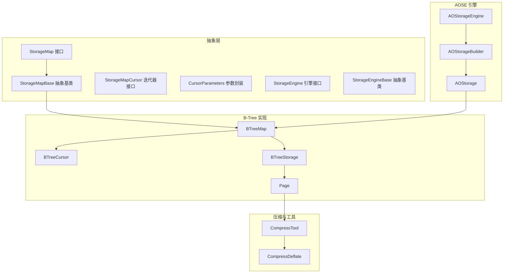
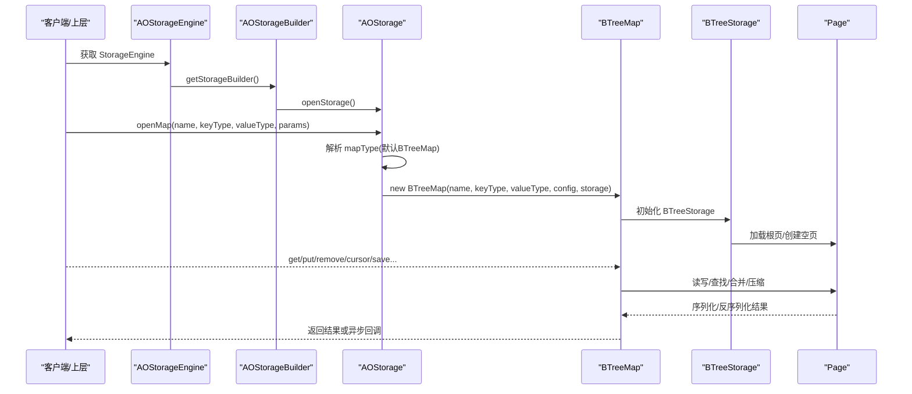
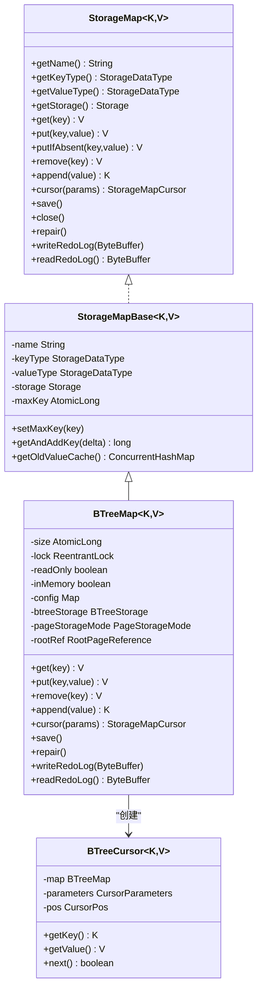
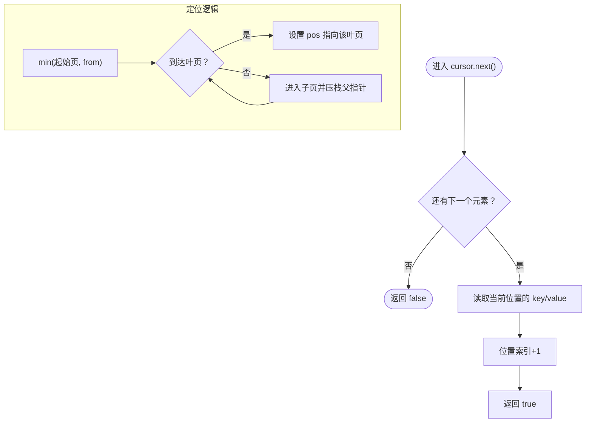
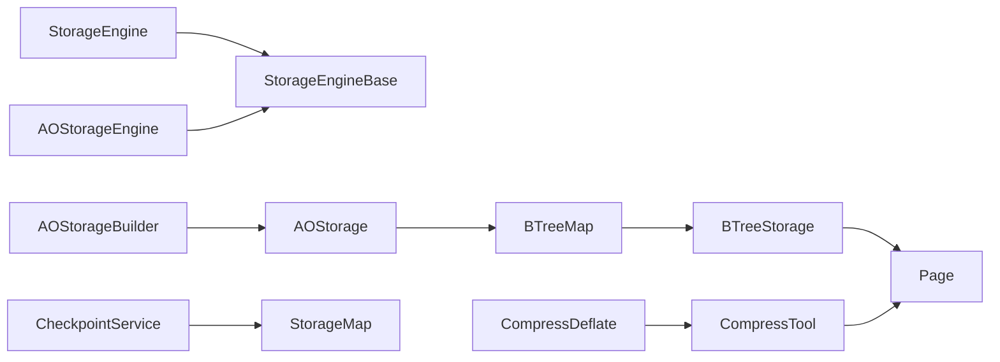

# 存储映射

<cite>
**本文引用的文件列表**
- [StorageMap.java](file://lealone-sci/src/main/java/com/lealone/storage/StorageMap.java)
- [StorageMapBase.java](file://lealone-sci/src/main/java/com/lealone/storage/StorageMapBase.java)
- [StorageMapCursor.java](file://lealone-sci/src/main/java/com/lealone/storage/StorageMapCursor.java)
- [CursorParameters.java](file://lealone-sci/src/main/java/com/lealone/storage/CursorParameters.java)
- [StorageEngine.java](file://lealone-sci/src/main/java/com/lealone/storage/StorageEngine.java)
- [StorageEngineBase.java](file://lealone-sci/src/main/java/com/lealone/storage/StorageEngineBase.java)
- [AOStorageEngine.java](file://lealone-aose/src/main/java/com/lealone/storage/aose/AOStorageEngine.java)
- [AOStorageBuilder.java](file://lealone-aose/src/main/java/com/lealone/storage/aose/AOStorageBuilder.java)
- [AOStorage.java](file://lealone-aose/src/main/java/com/lealone/storage/aose/AOStorage.java)
- [BTreeMap.java](file://lealone-aose/src/main/java/com/lealone/storage/aose/btree/BTreeMap.java)
- [BTreeCursor.java](file://lealone-aose/src/main/java/com/lealone/storage/aose/btree/BTreeCursor.java)
- [BTreeStorage.java](file://lealone-aose/src/main/java/com/lealone/storage/aose/btree/BTreeStorage.java)
- [Page.java](file://lealone-aose/src/main/java/com/lealone/storage/aose/btree/page/Page.java)
- [CompressTool.java](file://lealone-common/src/main/java/com/lealone/common/compress/CompressTool.java)
- [CompressDeflate.java](file://lealone-common/src/main/java/com/lealone/common/compress/CompressDeflate.java)
- [ConcurrentStorageMapTest.java](file://lealone-test/src/test/java/com/lealone/test/aose/ConcurrentStorageMapTest.java)
- [BTreeMapTest.java](file://lealone-test/src/test/java/com/lealone/test/aose/BTreeMapTest.java)
- [PageStorageModeTest.java](file://lealone-test/src/test/java/com/lealone/test/aose/PageStorageModeTest.java)
- [CheckpointService.java](file://lealone-aote/src/main/java/com/lealone/transaction/aote/CheckpointService.java)
</cite>

## 目录
1. [简介](#简介)
2. [项目结构](#项目结构)
3. [核心组件](#核心组件)
4. [架构总览](#架构总览)
5. [组件详解](#组件详解)
6. [依赖关系分析](#依赖关系分析)
7. [性能考量](#性能考量)
8. [故障排查指南](#故障排查指南)
9. [结论](#结论)
10. [附录](#附录)

## 简介
本文件围绕 StorageMap 抽象接口及其在 AOSE（自适应优化存储引擎）中的实现进行系统化文档化，重点阐述：
- StorageMap 作为统一数据访问抽象层的设计理念与职责边界
- 如何统一不同数据结构（以 B-Tree 为主）的访问模式
- AOStorageEngine 如何创建与管理 StorageMap 实例
- AOStorage 作为具体实现如何与底层 B-Tree 存储交互
- 结合测试用例展示 StorageMap 的 get、put、remove 等基本操作与迭代器（BTreeCursor）使用
- 在高并发、事务隔离与数据一致性方面的角色与保障机制
- 扩展性：自定义序列化与压缩策略的接入点

## 项目结构
本主题涉及的关键模块与文件如下：
- 抽象层与通用接口：StorageMap、StorageMapBase、StorageMapCursor、CursorParameters、StorageEngine、StorageEngineBase
- AOSE 引擎与构建器：AOStorageEngine、AOStorageBuilder、AOStorage
- B-Tree 实现：BTreeMap、BTreeCursor、BTreeStorage、Page
- 压缩与工具：CompressTool、CompressDeflate
- 测试与示例：ConcurrentStorageMapTest、BTreeMapTest、PageStorageModeTest
- 事务与检查点：CheckpointService（脏页收集与保存）

图表来源
- [StorageMap.java](file://lealone-sci/src/main/java/com/lealone/storage/StorageMap.java#L1-L331)
- [StorageMapBase.java](file://lealone-sci/src/main/java/com/lealone/storage/StorageMapBase.java#L1-L107)
- [StorageMapCursor.java](file://lealone-sci/src/main/java/com/lealone/storage/StorageMapCursor.java#L1-L35)
- [CursorParameters.java](file://lealone-sci/src/main/java/com/lealone/storage/CursorParameters.java#L1-L50)
- [StorageEngine.java](file://lealone-sci/src/main/java/com/lealone/storage/StorageEngine.java#L1-L24)
- [StorageEngineBase.java](file://lealone-sci/src/main/java/com/lealone/storage/StorageEngineBase.java#L1-L30)
- [AOStorageEngine.java](file://lealone-aose/src/main/java/com/lealone/storage/aose/AOStorageEngine.java#L1-L33)
- [AOStorageBuilder.java](file://lealone-aose/src/main/java/com/lealone/storage/aose/AOStorageBuilder.java#L1-L65)
- [AOStorage.java](file://lealone-aose/src/main/java/com/lealone/storage/aose/AOStorage.java#L1-L104)
- [BTreeMap.java](file://lealone-aose/src/main/java/com/lealone/storage/aose/btree/BTreeMap.java#L1-L753)
- [BTreeCursor.java](file://lealone-aose/src/main/java/com/lealone/storage/aose/btree/BTreeCursor.java#L1-L124)
- [BTreeStorage.java](file://lealone-aose/src/main/java/com/lealone/storage/aose/btree/BTreeStorage.java#L104-L194)
- [Page.java](file://lealone-aose/src/main/java/com/lealone/storage/aose/btree/page/Page.java#L312-L340)
- [CompressTool.java](file://lealone-common/src/main/java/com/lealone/common/compress/CompressTool.java#L80-L306)
- [CompressDeflate.java](file://lealone-common/src/main/java/com/lealone/common/compress/CompressDeflate.java#L44-L74)

章节来源
- [StorageMap.java](file://lealone-sci/src/main/java/com/lealone/storage/StorageMap.java#L1-L331)
- [AOStorageEngine.java](file://lealone-aose/src/main/java/com/lealone/storage/aose/AOStorageEngine.java#L1-L33)
- [AOStorage.java](file://lealone-aose/src/main/java/com/lealone/storage/aose/AOStorage.java#L1-L104)
- [BTreeMap.java](file://lealone-aose/src/main/java/com/lealone/storage/aose/btree/BTreeMap.java#L1-L753)

## 核心组件
- StorageMap：统一的数据访问抽象，定义键值存取、范围查询、游标遍历、生命周期管理、持久化与回收等能力；提供同步与异步 API，默认异步 API 由同步 API 转发。
- StorageMapBase：抽象基类，负责名称、键值类型、Storage 引用、最大键维护与旧值缓存等通用逻辑。
- StorageEngine/StorageEngineBase：插件式存储引擎接口与基类，提供 StorageBuilder 获取与 LOB 存储默认实现。
- AOStorageEngine：AOSE 引擎实现，注册名称、提供 AOStorageBuilder 与 LOB 存储。
- AOStorage：具体 Storage 实现，负责目录准备、只读判断、按参数选择打开 B-Tree 映射。
- BTreeMap：StorageMap 的主要实现，基于 B-Tree 页面结构，提供 get/put/remove/append、游标、保存/回收、重做日志等。
- BTreeCursor：B-Tree 上的有序游标，支持从指定起点开始的顺序遍历。
- CursorParameters：游标参数封装，支持 from/to、列索引过滤、是否全列读取。
- 压缩与序列化：通过 BTreeStorage 配置与 Page 层压缩，CompressTool/CompressDeflate 提供算法与包装流。

章节来源
- [StorageMap.java](file://lealone-sci/src/main/java/com/lealone/storage/StorageMap.java#L1-L331)
- [StorageMapBase.java](file://lealone-sci/src/main/java/com/lealone/storage/StorageMapBase.java#L1-L107)
- [StorageEngine.java](file://lealone-sci/src/main/java/com/lealone/storage/StorageEngine.java#L1-L24)
- [StorageEngineBase.java](file://lealone-sci/src/main/java/com/lealone/storage/StorageEngineBase.java#L1-L30)
- [AOStorageEngine.java](file://lealone-aose/src/main/java/com/lealone/storage/aose/AOStorageEngine.java#L1-L33)
- [AOStorageBuilder.java](file://lealone-aose/src/main/java/com/lealone/storage/aose/AOStorageBuilder.java#L1-L65)
- [AOStorage.java](file://lealone-aose/src/main/java/com/lealone/storage/aose/AOStorage.java#L1-L104)
- [BTreeMap.java](file://lealone-aose/src/main/java/com/lealone/storage/aose/btree/BTreeMap.java#L1-L753)
- [BTreeCursor.java](file://lealone-aose/src/main/java/com/lealone/storage/aose/btree/BTreeCursor.java#L1-L124)
- [CursorParameters.java](file://lealone-sci/src/main/java/com/lealone/storage/CursorParameters.java#L1-L50)
- [BTreeStorage.java](file://lealone-aose/src/main/java/com/lealone/storage/aose/btree/BTreeStorage.java#L104-L194)
- [Page.java](file://lealone-aose/src/main/java/com/lealone/storage/aose/btree/page/Page.java#L312-L340)
- [CompressTool.java](file://lealone-common/src/main/java/com/lealone/common/compress/CompressTool.java#L80-L306)
- [CompressDeflate.java](file://lealone-common/src/main/java/com/lealone/common/compress/CompressDeflate.java#L44-L74)

## 架构总览
StorageMap 将上层业务与底层存储解耦，通过 AOStorageEngine/Builder 打开 AOStorage，AOStorage 再根据参数选择 BTreeMap。BTreeMap 使用 BTreeStorage 管理页面与块，Page 负责序列化/反序列化与压缩，CompressTool/CompressDeflate 提供压缩算法。

图表来源
- [AOStorageEngine.java](file://lealone-aose/src/main/java/com/lealone/storage/aose/AOStorageEngine.java#L1-L33)
- [AOStorageBuilder.java](file://lealone-aose/src/main/java/com/lealone/storage/aose/AOStorageBuilder.java#L1-L65)
- [AOStorage.java](file://lealone-aose/src/main/java/com/lealone/storage/aose/AOStorage.java#L1-L104)
- [BTreeMap.java](file://lealone-aose/src/main/java/com/lealone/storage/aose/btree/BTreeMap.java#L1-L753)
- [BTreeStorage.java](file://lealone-aose/src/main/java/com/lealone/storage/aose/btree/BTreeStorage.java#L104-L194)
- [Page.java](file://lealone-aose/src/main/java/com/lealone/storage/aose/btree/page/Page.java#L312-L340)

## 组件详解

### StorageMap 抽象与 StorageMapBase 基类
- 设计理念
  - 统一键值访问、范围查询、游标遍历、生命周期管理（open/close/remove）、持久化（save）、回收（gc/fullGc/collectDirtyMemory）、重做日志（write/read/sync/validate）。
  - 提供同步与异步 API，默认异步 API 通过同步 API 转发，便于上层统一处理。
- 关键能力
  - get/put/putIfAbsent/remove/append/size/containsKey/isEmpty/isInMemory/clear/remove/isClosed/close/save/gc/fullGc/repair/disk/memory 空间统计等。
  - 游标 cursor(K)/cursor(CursorParameters)，支持从指定起点开始的有序遍历。
  - 重做日志服务索引与最后事务 ID 管理，用于事务一致性校验。
- StorageMapBase
  - 维护 name/keyType/valueType/storage，提供 setMaxKey/getAndAddKey 等通用逻辑，以及旧值缓存 ConcurrentHashMap。

章节来源
- [StorageMap.java](file://lealone-sci/src/main/java/com/lealone/storage/StorageMap.java#L1-L331)
- [StorageMapBase.java](file://lealone-sci/src/main/java/com/lealone/storage/StorageMapBase.java#L1-L107)

### AOStorageEngine 与 AOStorageBuilder/Storage
- AOStorageEngine
  - 注册引擎名“AOSE”，提供 AOStorageBuilder 与 LOB 存储实现。
- AOStorageBuilder
  - 缓存已打开的 AOStorage，按配置初始化 SchedulerFactory 并启动嵌入式调度器。
- AOStorage
  - 负责存储路径准备、只读检测、按参数选择打开 BTreeMap 或抛出未知映射类型异常。
  - openMap 支持通过参数指定 mapType（默认 BTreeMap），内部委托 BTreeMap 实例化与监听器通知。

章节来源
- [AOStorageEngine.java](file://lealone-aose/src/main/java/com/lealone/storage/aose/AOStorageEngine.java#L1-L33)
- [AOStorageBuilder.java](file://lealone-aose/src/main/java/com/lealone/storage/aose/AOStorageBuilder.java#L1-L65)
- [AOStorage.java](file://lealone-aose/src/main/java/com/lealone/storage/aose/AOStorage.java#L1-L104)

### BTreeMap：StorageMap 的主要实现
- 数据结构与并发
  - 使用原子 size、可重入锁保护写路径，读路径允许多线程并发访问。
  - 根页引用 RootPageReference，支持动态替换根页并维护父子关系。
- 核心操作
  - get：二分查找定位叶页，支持全列/部分列读取。
  - put/putIfAbsent/append/remove：封装为 PageOperations，通过 InternalScheduler 执行，支持快速重试与排队等待。
  - clear/remove/close：清理内存、关闭存储、移除映射。
  - save/gc/fullGc/collectDirtyMemory：协调 BTreeStorage 与 GC，按内存状态决定是否落盘。
  - repair：扫描可用页重建映射并保存。
- 游标与范围查询
  - cursor(CursorParameters) 返回 BTreeCursor，支持 from/to、列过滤、全列读取。
  - firstKey/lastKey/lower/floor/higher/ceilingKey 提供范围查询辅助。
- 重做日志与事务
  - writeRedoLog/readRedoLog/sync/validateRedoLog，配合事务引擎使用。
  - setLastTransactionId/getLastTransactionId 用于事务一致性校验。

图表来源
- [StorageMap.java](file://lealone-sci/src/main/java/com/lealone/storage/StorageMap.java#L1-L331)
- [StorageMapBase.java](file://lealone-sci/src/main/java/com/lealone/storage/StorageMapBase.java#L1-L107)
- [BTreeMap.java](file://lealone-aose/src/main/java/com/lealone/storage/aose/btree/BTreeMap.java#L1-L753)
- [BTreeCursor.java](file://lealone-aose/src/main/java/com/lealone/storage/aose/btree/BTreeCursor.java#L1-L124)

章节来源
- [BTreeMap.java](file://lealone-aose/src/main/java/com/lealone/storage/aose/btree/BTreeMap.java#L1-L753)
- [BTreeCursor.java](file://lealone-aose/src/main/java/com/lealone/storage/aose/btree/BTreeCursor.java#L1-L124)

### BTreeCursor：B-Tree 游标
- 行为特征
  - 从根页开始定位 >= from 的第一个叶页，维护 CursorPos 栈，支持 next() 顺序遍历。
  - 支持列过滤（columnIndexes）与全列读取（allColumns）。
- 使用场景
  - 配合 CursorParameters.from/to 实现范围扫描，适合批量导出、统计、迁移等。

图表来源
- [BTreeCursor.java](file://lealone-aose/src/main/java/com/lealone/storage/aose/btree/BTreeCursor.java#L1-L124)
- [CursorParameters.java](file://lealone-sci/src/main/java/com/lealone/storage/CursorParameters.java#L1-L50)

章节来源
- [BTreeCursor.java](file://lealone-aose/src/main/java/com/lealone/storage/aose/btree/BTreeCursor.java#L1-L124)
- [CursorParameters.java](file://lealone-sci/src/main/java/com/lealone/storage/CursorParameters.java#L1-L50)

### 压缩与序列化扩展
- 压缩策略
  - BTreeStorage 解析压缩级别（NO/LZF/DEFLATE/数值），按级别选择 CompressLZF 或 CompressDeflate。
  - Page 层在序列化时尝试压缩，若压缩收益显著则写入压缩标记与长度。
- 工具与包装
  - CompressTool 提供压缩/解压入口与算法选择，CompressDeflate 支持 level/strategy 参数。
  - 文件存储层（FileStorageOutputStream）支持对写入数据进行压缩包装。

章节来源
- [BTreeStorage.java](file://lealone-aose/src/main/java/com/lealone/storage/aose/btree/BTreeStorage.java#L104-L194)
- [Page.java](file://lealone-aose/src/main/java/com/lealone/storage/aose/btree/page/Page.java#L312-L340)
- [CompressTool.java](file://lealone-common/src/main/java/com/lealone/common/compress/CompressTool.java#L80-L306)
- [CompressDeflate.java](file://lealone-common/src/main/java/com/lealone/common/compress/CompressDeflate.java#L44-L74)

## 依赖关系分析
- 引擎与构建
  - StorageEngine/StorageEngineBase 提供插件接口与默认 LOB 抛出不支持异常。
  - AOStorageEngine 实现 getStorageBuilder 与 LOB 存储，AOStorageBuilder 缓存与初始化 AOStorage。
- Storage 与 Map
  - AOStorage.openMap 根据参数选择 BTreeMap，BTreeMap 通过 BTreeStorage 管理页面与块。
- 并发与调度
  - BTreeMap 使用 InternalScheduler/EmbeddedScheduler 执行写操作，支持快速重试与排队等待。
- 事务与检查点
  - CheckpointService 收集各 StorageMap 的脏内存并触发保存，配合 StorageMap 的 save/collectDirtyMemory。

图表来源
- [StorageEngine.java](file://lealone-sci/src/main/java/com/lealone/storage/StorageEngine.java#L1-L24)
- [StorageEngineBase.java](file://lealone-sci/src/main/java/com/lealone/storage/StorageEngineBase.java#L1-L30)
- [AOStorageEngine.java](file://lealone-aose/src/main/java/com/lealone/storage/aose/AOStorageEngine.java#L1-L33)
- [AOStorageBuilder.java](file://lealone-aose/src/main/java/com/lealone/storage/aose/AOStorageBuilder.java#L1-L65)
- [AOStorage.java](file://lealone-aose/src/main/java/com/lealone/storage/aose/AOStorage.java#L1-L104)
- [BTreeMap.java](file://lealone-aose/src/main/java/com/lealone/storage/aose/btree/BTreeMap.java#L1-L753)
- [BTreeStorage.java](file://lealone-aose/src/main/java/com/lealone/storage/aose/btree/BTreeStorage.java#L104-L194)
- [Page.java](file://lealone-aose/src/main/java/com/lealone/storage/aose/btree/page/Page.java#L312-L340)
- [CompressTool.java](file://lealone-common/src/main/java/com/lealone/common/compress/CompressTool.java#L80-L306)
- [CompressDeflate.java](file://lealone-common/src/main/java/com/lealone/common/compress/CompressDeflate.java#L44-L74)
- [CheckpointService.java](file://lealone-aote/src/main/java/com/lealone/transaction/aote/CheckpointService.java#L258-L296)

章节来源
- [AOStorageEngine.java](file://lealone-aose/src/main/java/com/lealone/storage/aose/AOStorageEngine.java#L1-L33)
- [AOStorageBuilder.java](file://lealone-aose/src/main/java/com/lealone/storage/aose/AOStorageBuilder.java#L1-L65)
- [AOStorage.java](file://lealone-aose/src/main/java/com/lealone/storage/aose/AOStorage.java#L1-L104)
- [BTreeMap.java](file://lealone-aose/src/main/java/com/lealone/storage/aose/btree/BTreeMap.java#L1-L753)
- [CheckpointService.java](file://lealone-aote/src/main/java/com/lealone/transaction/aote/CheckpointService.java#L258-L296)

## 性能考量
- 并发与锁
  - 读多写少场景：BTreeMap 读路径允许多线程并发，写路径使用可重入锁与快速重试，减少锁竞争。
  - 写操作通过 InternalScheduler 调度，避免阻塞调用线程，异步写可提升吞吐。
- 内存与磁盘
  - collectDirtyMemory/needGc/fullGc/save 协同工作，按脏页阈值触发保存与垃圾回收，降低内存占用。
  - Page 层压缩减少磁盘写入量，提高 IO 效率。
- 序列化与列存储
  - 支持列存储模式（PageStorageMode），按需读取列，减少不必要的数据传输与解析成本。
- 调度与批处理
  - EmbeddedScheduler 自动启动，保证嵌入式场景下的调度可用性；通过批量写入与延迟提交优化性能。

章节来源
- [BTreeMap.java](file://lealone-aose/src/main/java/com/lealone/storage/aose/btree/BTreeMap.java#L1-L753)
- [BTreeStorage.java](file://lealone-aose/src/main/java/com/lealone/storage/aose/btree/BTreeStorage.java#L104-L194)
- [Page.java](file://lealone-aose/src/main/java/com/lealone/storage/aose/btree/page/Page.java#L312-L340)
- [AOStorageBuilder.java](file://lealone-aose/src/main/java/com/lealone/storage/aose/AOStorageBuilder.java#L1-L65)

## 故障排查指南
- 常见问题与定位
  - 只读/关闭状态：当 map 处于只读或已关闭时，写操作会抛出异常。可通过 isInMemory/isClosed 判断状态。
  - 写入阻塞：若出现写入阻塞，检查是否存在大量锁竞争或调度线程池饱和，适当调整调度配置。
  - 脏页未保存：使用 collectDirtyMemory/needGc/fullGc/save 触发保存，确认磁盘空间与权限。
  - 重做日志校验失败：通过 validateRedoLog 与 lastTransactionId 校验一致性，必要时执行 repair。
- 测试参考
  - 并发读写：ConcurrentStorageMapTest 展示多线程 get/put/containsKey 的正确性。
  - 异步写入：BTreeMapTest 展示异步回调与批量写入的使用。
  - 列过滤与游标：PageStorageModeTest 展示列索引过滤与游标遍历。

章节来源
- [BTreeMap.java](file://lealone-aose/src/main/java/com/lealone/storage/aose/btree/BTreeMap.java#L1-L753)
- [ConcurrentStorageMapTest.java](file://lealone-test/src/test/java/com/lealone/test/aose/ConcurrentStorageMapTest.java#L1-L43)
- [BTreeMapTest.java](file://lealone-test/src/test/java/com/lealone/test/aose/BTreeMapTest.java#L203-L256)
- [PageStorageModeTest.java](file://lealone-test/src/test/java/com/lealone/test/aose/PageStorageModeTest.java#L72-L89)

## 结论
StorageMap 通过抽象统一了不同数据结构的访问模式，AOSE 将其实现为高性能的 B-Tree 存储。AOStorageEngine/Builder 负责装配与生命周期管理，BTreeMap 提供完善的并发控制、事务支持与持久化能力，BTreeCursor 与 CursorParameters 支持高效范围扫描。压缩与序列化扩展进一步提升了存储效率与灵活性。整体设计兼顾易用性、性能与可扩展性。

## 附录
- 基本操作与游标使用示例（路径）
  - get/put/putIfAbsent/remove/append/clear/remove/close/save/gc/fullGc/repair
    - [BTreeMap.java](file://lealone-aose/src/main/java/com/lealone/storage/aose/btree/BTreeMap.java#L558-L752)
  - 游标遍历
    - [BTreeCursor.java](file://lealone-aose/src/main/java/com/lealone/storage/aose/btree/BTreeCursor.java#L1-L124)
    - [CursorParameters.java](file://lealone-sci/src/main/java/com/lealone/storage/CursorParameters.java#L1-L50)
  - 并发与异步
    - [ConcurrentStorageMapTest.java](file://lealone-test/src/test/java/com/lealone/test/aose/ConcurrentStorageMapTest.java#L1-L43)
    - [BTreeMapTest.java](file://lealone-test/src/test/java/com/lealone/test/aose/BTreeMapTest.java#L203-L256)
  - 列过滤与范围扫描
    - [PageStorageModeTest.java](file://lealone-test/src/test/java/com/lealone/test/aose/PageStorageModeTest.java#L72-L89)
  - 压缩与序列化
    - [BTreeStorage.java](file://lealone-aose/src/main/java/com/lealone/storage/aose/btree/BTreeStorage.java#L104-L194)
    - [Page.java](file://lealone-aose/src/main/java/com/lealone/storage/aose/btree/page/Page.java#L312-L340)
    - [CompressTool.java](file://lealone-common/src/main/java/com/lealone/common/compress/CompressTool.java#L80-L306)
    - [CompressDeflate.java](file://lealone-common/src/main/java/com/lealone/common/compress/CompressDeflate.java#L44-L74)