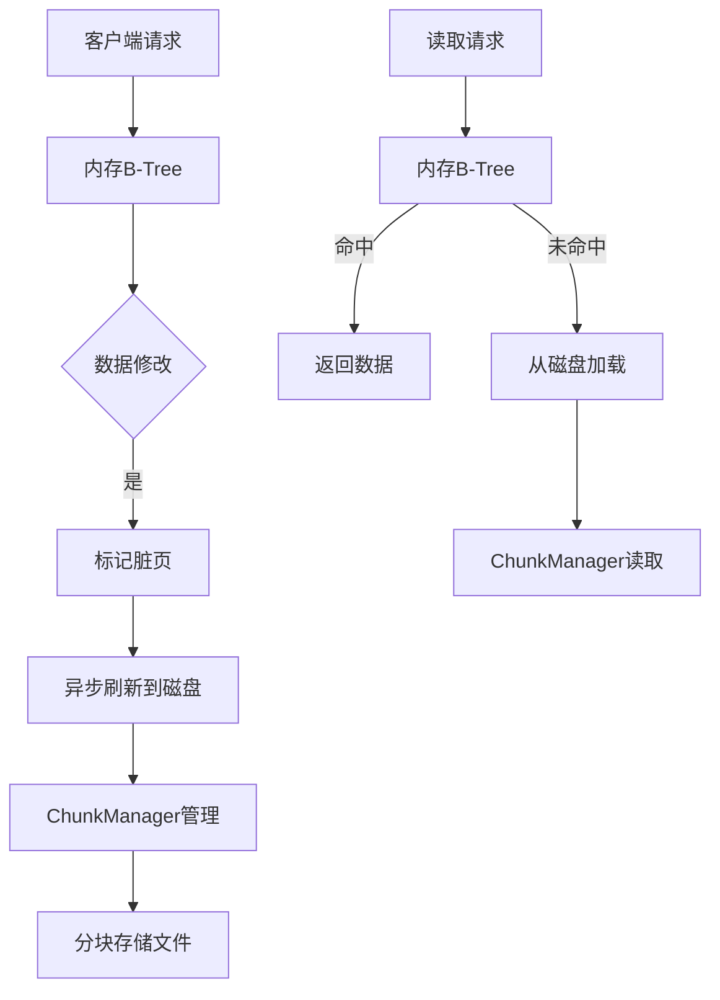
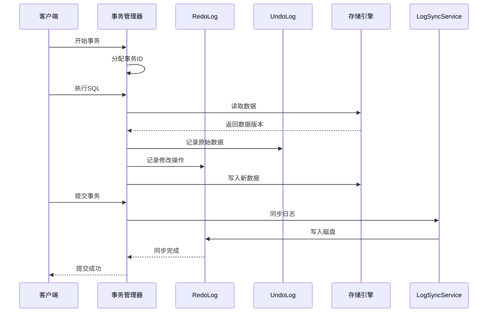
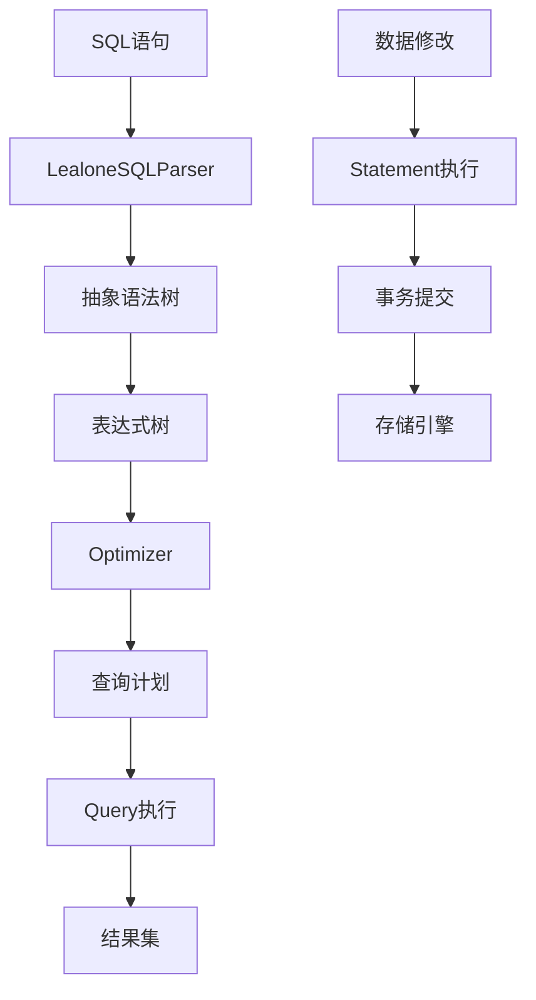
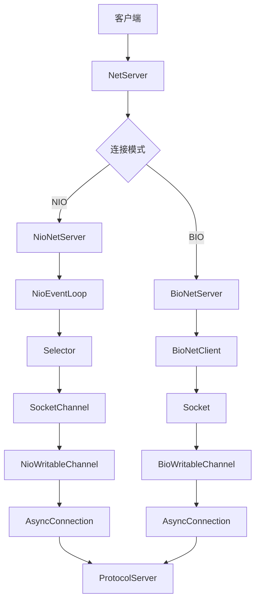
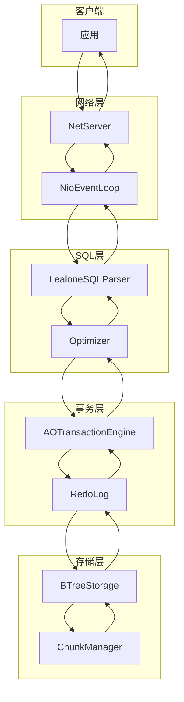

# 核心功能

<cite>
**本文档引用的文件**  
- [AOStorageEngine.java](file://lealone-aose/src/main/java/com/lealone/storage/aose/AOStorageEngine.java)
- [AOTransactionEngine.java](file://lealone-aote/src/main/java/com/lealone/transaction/aote/AOTransactionEngine.java)
- [LealoneSQLEngine.java](file://lealone-sql/src/main/java/com/lealone/sql/LealoneSQLEngine.java)
- [LealoneSQLParser.java](file://lealone-sql/src/main/java/com/lealone/sql/LealoneSQLParser.java)
- [NetServer.java](file://lealone-net/src/main/java/com/lealone/net/NetServer.java)
- [NioNetServer.java](file://lealone-net/src/main/java/com/lealone/net/nio/NioNetServer.java)
- [BioNetFactory.java](file://lealone-net/src/main/java/com/lealone/net/bio/BioNetFactory.java)
- [NioNetFactory.java](file://lealone-net/src/main/java/com/lealone/net/nio/NioNetFactory.java)
- [BTreeStorage.java](file://lealone-aose/src/main/java/com/lealone/storage/aose/btree/BTreeStorage.java)
- [RedoLog.java](file://lealone-aote/src/main/java/com/lealone/transaction/aote/log/RedoLog.java)
- [Database.java](file://lealone-db/src/main/java/com/lealone/db/Database.java)
</cite>

## 目录
1. [引言](#引言)
2. [AOSE异步化存储引擎](#aose异步化存储引擎)
3. [AOTE异步化事务引擎](#aote异步化事务引擎)
4. [LealoneSQL引擎](#lealonesql引擎)
5. [网络层](#网络层)
6. [核心功能协同工作](#核心功能协同工作)
7. [结论](#结论)

## 引言
Lealone数据库系统通过四大核心引擎——AOSE异步化存储引擎、AOTE异步化事务引擎、LealoneSQL引擎和网络层——提供高性能、高并发的数据库服务。这些引擎协同工作，实现了从数据存储、事务管理、SQL处理到网络通信的完整功能体系。本文档将全面介绍这四大核心引擎的设计目标、实现原理和协同机制，为读者建立一个功能层面的整体认知。

## AOSE异步化存储引擎

AOSE（Asynchronous Optimized Storage Engine）是Lealone的异步化存储引擎，其核心设计目标是通过异步B-Tree实现高性能的数据写入和存储管理。该引擎基于B-Tree数据结构，采用异步写入和内存映射技术，有效提升了I/O性能和系统吞吐量。

AOSE通过`BTreeStorage`类管理存储，该类负责B-Tree的持久化存储和内存管理。它实现了`StorageEngine`接口，提供了存储引擎的生命周期管理功能。`BTreeStorage`维护了一个`ChunkManager`，用于管理存储文件的分块（chunk），每个chunk是一个独立的文件，包含B-Tree的节点数据。这种分块设计使得存储引擎能够高效地进行垃圾回收和空间管理。

在写入性能方面，AOSE采用了异步写入策略。当数据写入时，首先写入内存中的B-Tree结构，然后异步地将脏页（dirty pages）刷新到磁盘。这种设计避免了同步I/O操作对主线程的阻塞，显著提升了写入性能。同时，AOSE支持数据压缩，通过`Compressor`接口实现了LZF和Deflate两种压缩算法，可以在存储空间和CPU开销之间进行权衡。

**图示来源**
- [BTreeStorage.java](file://lealone-aose/src/main/java/com/lealone/storage/aose/btree/BTreeStorage.java#L35-L415)

**本节来源**
- [AOStorageEngine.java](file://lealone-aose/src/main/java/com/lealone/storage/aose/AOStorageEngine.java#L1-L33)
- [BTreeStorage.java](file://lealone-aose/src/main/java/com/lealone/storage/aose/btree/BTreeStorage.java#L1-L415)

## AOTE异步化事务引擎

AOTE（Asynchronous adaptive Optimization Transaction Engine）是Lealone的异步化事务引擎，其核心设计目标是支持MVCC（多版本并发控制）和两阶段提交，确保数据的一致性和隔离性。该引擎通过`AOTransactionEngine`类实现，提供了完整的事务管理功能。

AOTE支持多种隔离级别，包括读未提交、读已提交、可重复读和串行化。通过MVCC机制，AOTE实现了非阻塞的读操作，读事务不会阻塞写事务，写事务也不会阻塞读事务。每个事务在开始时会获取一个唯一的事务ID，用于标识事务的版本。当数据被修改时，旧版本的数据会被保留，直到所有可能引用它的事务都完成后才被清理。

在两阶段提交方面，AOTE通过`RedoLog`和`UndoLog`实现。`RedoLog`用于记录事务的修改操作，确保在系统崩溃后能够恢复未完成的事务；`UndoLog`用于记录事务的原始数据，支持事务回滚。`LogSyncService`负责将日志同步到磁盘，确保数据的持久性。

**图示来源**
- [AOTransactionEngine.java](file://lealone-aote/src/main/java/com/lealone/transaction/aote/AOTransactionEngine.java#L32-L311)
- [RedoLog.java](file://lealone-aote/src/main/java/com/lealone/transaction/aote/log/RedoLog.java#L40-L453)

**本节来源**
- [AOTransactionEngine.java](file://lealone-aote/src/main/java/com/lealone/transaction/aote/AOTransactionEngine.java#L32-L311)
- [RedoLog.java](file://lealone-aote/src/main/java/com/lealone/transaction/aote/log/RedoLog.java#L40-L453)

## LealoneSQL引擎

LealoneSQL引擎是Lealone数据库的SQL处理核心，负责SQL语句的解析、优化和执行。该引擎通过`LealoneSQLEngine`和`LealoneSQLParser`类实现，提供了完整的SQL处理能力。

SQL解析阶段，`LealoneSQLParser`将SQL语句解析为抽象语法树（AST）。解析器支持标准的SQL语法，包括DDL、DML和查询语句。解析后的AST被转换为内部的表达式树，便于后续的优化和执行。

在查询优化方面，LealoneSQL引擎采用了基于成本的优化策略。`Optimizer`类负责分析查询计划，选择最优的执行路径。优化器考虑了索引选择、连接顺序和谓词下推等因素，以最小化查询的执行成本。对于复杂的查询，引擎支持查询重写和物化视图优化。

执行阶段，引擎将优化后的查询计划转换为可执行的操作序列。`Query`类负责执行查询，`Statement`类负责执行数据修改操作。执行引擎支持并行执行和异步执行，能够充分利用多核CPU的计算能力。

**图示来源**
- [LealoneSQLEngine.java](file://lealone-sql/src/main/java/com/lealone/sql/LealoneSQLEngine.java#L1-L27)
- [LealoneSQLParser.java](file://lealone-sql/src/main/java/com/lealone/sql/LealoneSQLParser.java#L1-L15)

**本节来源**
- [LealoneSQLEngine.java](file://lealone-sql/src/main/java/com/lealone/sql/LealoneSQLEngine.java#L1-L27)
- [LealoneSQLParser.java](file://lealone-sql/src/main/java/com/lealone/sql/LealoneSQLParser.java#L1-L15)

## 网络层

Lealone的网络层负责处理客户端连接和网络通信，支持BIO（阻塞I/O）和NIO（非阻塞I/O）两种模式。网络层通过`NetServer`和`NetClient`接口提供统一的网络服务抽象。

在NIO模式下，`NioNetServer`使用Java NIO的`Selector`机制实现高并发连接处理。服务器通过`NioEventLoop`事件循环监听客户端连接和数据读写事件。每个连接由一个`NioWritableChannel`管理，支持异步读写操作。这种设计使得单个线程能够处理数千个并发连接，大大提升了系统的并发能力。

BIO模式通过`BioNetFactory`提供，适用于对延迟要求不高的场景。虽然BIO模式的并发能力有限，但其实现简单，易于调试和维护。

网络层与协议服务器（`ProtocolServer`）集成，支持多种通信协议。`AsyncConnectionManager`负责管理所有活动连接，提供连接池和负载均衡功能。

**图示来源**
- [NetServer.java](file://lealone-net/src/main/java/com/lealone/net/NetServer.java#L1-L15)
- [NioNetServer.java](file://lealone-net/src/main/java/com/lealone/net/nio/NioNetServer.java#L1-L77)
- [BioNetFactory.java](file://lealone-net/src/main/java/com/lealone/net/bio/BioNetFactory.java#L1-L37)

**本节来源**
- [NetServer.java](file://lealone-net/src/main/java/com/lealone/net/NetServer.java#L1-L15)
- [NioNetServer.java](file://lealone-net/src/main/java/com/lealone/net/nio/NioNetServer.java#L1-L77)
- [BioNetFactory.java](file://lealone-net/src/main/java/com/lealone/net/bio/BioNetFactory.java#L1-L37)

## 核心功能协同工作

Lealone的四大核心引擎通过`Database`类协同工作，形成一个完整的数据库服务系统。当客户端发起请求时，网络层接收连接并传递给SQL引擎；SQL引擎解析和优化SQL语句，生成执行计划；执行计划被传递给事务引擎，由事务引擎管理事务的生命周期；事务引擎调用存储引擎进行实际的数据读写操作。

这种分层架构实现了关注点分离，每个引擎专注于特定的功能领域。同时，引擎之间通过清晰的接口进行通信，保证了系统的模块化和可扩展性。例如，`Database`类持有`SQLEngine`和`TransactionEngine`的引用，作为它们之间的协调者。

在性能方面，异步化设计贯穿整个系统。从网络层的异步I/O，到存储引擎的异步写入，再到事务引擎的日志异步同步，异步化确保了系统在高并发场景下的响应性和吞吐量。

**图示来源**
- [Database.java](file://lealone-db/src/main/java/com/lealone/db/Database.java#L88-L2041)

**本节来源**
- [Database.java](file://lealone-db/src/main/java/com/lealone/db/Database.java#L88-L2041)

## 结论

Lealone通过AOSE异步化存储引擎、AOTE异步化事务引擎、LealoneSQL引擎和网络层四大核心引擎，构建了一个高性能、高并发的数据库系统。AOSE通过异步B-Tree实现了高效的存储管理；AOTE通过MVCC和两阶段提交确保了数据的一致性和隔离性；LealoneSQL引擎提供了完整的SQL处理能力；网络层支持BIO/NIO，实现了高并发连接处理。这些引擎通过清晰的接口和异步化设计协同工作，为用户提供了可靠的数据库服务。这种模块化、异步化的架构设计，使得Lealone能够适应各种应用场景，从单机嵌入式数据库到分布式数据库集群。