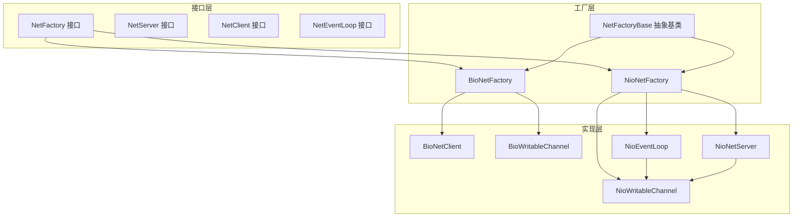
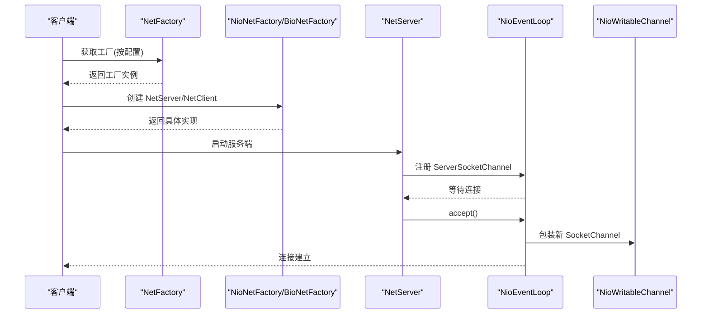
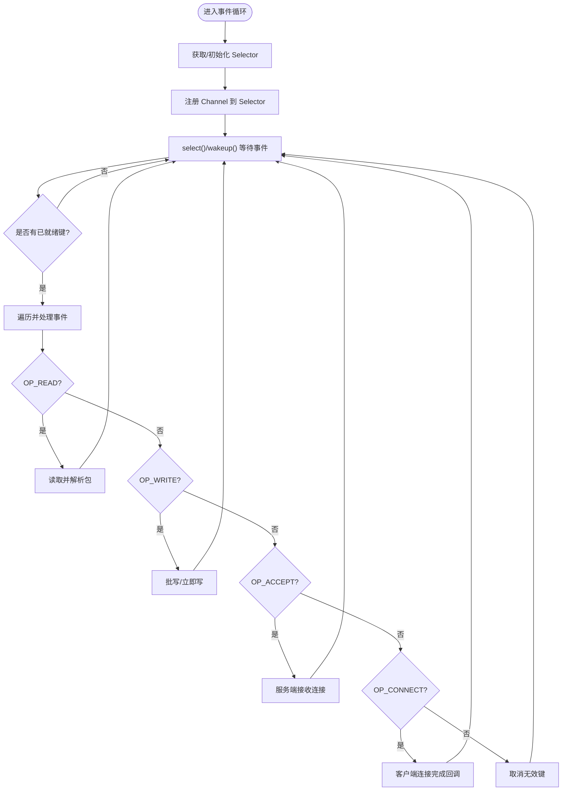
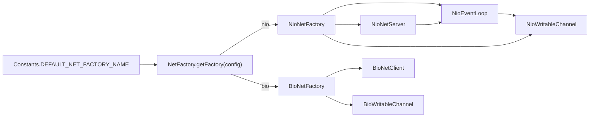

# BIO与NIO实现

<cite>
**本文引用的文件列表**
- [BioNetFactory.java](file://lealone-net/src/main/java/com/lealone/net/bio/BioNetFactory.java)
- [NioNetFactory.java](file://lealone-net/src/main/java/com/lealone/net/nio/NioNetFactory.java)
- [NetFactory.java](file://lealone-net/src/main/java/com/lealone/net/NetFactory.java)
- [NetFactoryBase.java](file://lealone-net/src/main/java/com/lealone/net/NetFactoryBase.java)
- [NetServer.java](file://lealone-net/src/main/java/com/lealone/net/NetServer.java)
- [NetServerBase.java](file://lealone-net/src/main/java/com/lealone/net/NetServerBase.java)
- [NioNetServer.java](file://lealone-net/src/main/java/com/lealone/net/nio/NioNetServer.java)
- [BioNetClient.java](file://lealone-net/src/main/java/com/lealone/net/bio/BioNetClient.java)
- [BioWritableChannel.java](file://lealone-net/src/main/java/com/lealone/net/bio/BioWritableChannel.java)
- [NioWritableChannel.java](file://lealone-net/src/main/java/com/lealone/net/nio/NioWritableChannel.java)
- [NioEventLoop.java](file://lealone-net/src/main/java/com/lealone/net/nio/NioEventLoop.java)
- [NetEventLoop.java](file://lealone-net/src/main/java/com/lealone/net/NetEventLoop.java)
- [NetClientBase.java](file://lealone-net/src/main/java/com/lealone/net/NetClientBase.java)
- [Constants.java](file://lealone-common/src/main/java/com/lealone/db/Constants.java)
</cite>

## 目录
1. [引言](#引言)
2. [项目结构](#项目结构)
3. [核心组件](#核心组件)
4. [架构总览](#架构总览)
5. [详细组件分析](#详细组件分析)
6. [依赖关系分析](#依赖关系分析)
7. [性能考量](#性能考量)
8. [故障排查指南](#故障排查指南)
9. [结论](#结论)
10. [附录：配置与调优建议](#附录配置与调优建议)

## 引言
本文件系统化梳理 Lealone 网络子系统中 BIO 与 NIO 的实现与差异，重点覆盖：
- NetFactory 如何根据配置选择并创建不同网络实现（BIO/NIO）
- NIO 事件循环 NioEventLoop 的工作机制与关键流程
- BIO 与 NIO 在连接处理、线程模型、资源消耗上的差异
- 面向不同应用场景的选择建议与调优要点

## 项目结构
网络相关代码集中在 lealone-net 模块，按“接口-实现-工厂”的层次组织：
- 接口层：NetFactory、NetServer、NetClient、NetEventLoop
- 实现层：BIO 与 NIO 的具体实现类
- 工厂层：NetFactoryBase 抽象基类，BioNetFactory、NioNetFactory 具体工厂
- 服务端抽象：NetServerBase 提供通用的连接管理与绑定检查逻辑

图表来源
- [NetFactory.java](file://lealone-net/src/main/java/com/lealone/net/NetFactory.java#L1-L56)
- [NetFactoryBase.java](file://lealone-net/src/main/java/com/lealone/net/NetFactoryBase.java#L1-L22)
- [BioNetFactory.java](file://lealone-net/src/main/java/com/lealone/net/bio/BioNetFactory.java#L1-L37)
- [NioNetFactory.java](file://lealone-net/src/main/java/com/lealone/net/nio/NioNetFactory.java#L1-L38)
- [BioNetClient.java](file://lealone-net/src/main/java/com/lealone/net/bio/BioNetClient.java#L1-L73)
- [BioWritableChannel.java](file://lealone-net/src/main/java/com/lealone/net/bio/BioWritableChannel.java#L1-L160)
- [NioNetServer.java](file://lealone-net/src/main/java/com/lealone/net/nio/NioNetServer.java#L1-L77)
- [NioWritableChannel.java](file://lealone-net/src/main/java/com/lealone/net/nio/NioWritableChannel.java#L1-L136)
- [NioEventLoop.java](file://lealone-net/src/main/java/com/lealone/net/nio/NioEventLoop.java#L1-L569)

章节来源
- [NetFactory.java](file://lealone-net/src/main/java/com/lealone/net/NetFactory.java#L1-L56)
- [NetFactoryBase.java](file://lealone-net/src/main/java/com/lealone/net/NetFactoryBase.java#L1-L22)
- [NetServerBase.java](file://lealone-net/src/main/java/com/lealone/net/NetServerBase.java#L1-L60)

## 核心组件
- NetFactory：网络工厂接口，负责创建 NetServer、NetClient，并可扩展事件循环创建
- NetFactoryBase：插件化基类，统一插件注册与类型约束
- BioNetFactory：BIO 实现工厂，提供 BIO 客户端与禁用服务端创建
- NioNetFactory：NIO 实现工厂，默认工厂名，提供 NIO 客户端、服务端与事件循环
- NetServerBase：服务端抽象基类，封装连接管理与绑定错误处理
- NioNetServer：基于 NIO 的服务端，使用非阻塞 ServerSocketChannel 接收连接
- BioNetClient：基于 BIO 的客户端，使用 Socket 输入输出流
- BioWritableChannel/NioWritableChannel：双向可写通道抽象，承载读写与连接状态
- NioEventLoop：NIO 事件循环，负责注册/选择/读写/异常处理与资源回收

章节来源
- [NetFactory.java](file://lealone-net/src/main/java/com/lealone/net/NetFactory.java#L1-L56)
- [NetFactoryBase.java](file://lealone-net/src/main/java/com/lealone/net/NetFactoryBase.java#L1-L22)
- [BioNetFactory.java](file://lealone-net/src/main/java/com/lealone/net/bio/BioNetFactory.java#L1-L37)
- [NioNetFactory.java](file://lealone-net/src/main/java/com/lealone/net/nio/NioNetFactory.java#L1-L38)
- [NetServerBase.java](file://lealone-net/src/main/java/com/lealone/net/NetServerBase.java#L1-L60)
- [NioNetServer.java](file://lealone-net/src/main/java/com/lealone/net/nio/NioNetServer.java#L1-L77)
- [BioNetClient.java](file://lealone-net/src/main/java/com/lealone/net/bio/BioNetClient.java#L1-L73)
- [BioWritableChannel.java](file://lealone-net/src/main/java/com/lealone/net/bio/BioWritableChannel.java#L1-L160)
- [NioWritableChannel.java](file://lealone-net/src/main/java/com/lealone/net/nio/NioWritableChannel.java#L1-L136)
- [NioEventLoop.java](file://lealone-net/src/main/java/com/lealone/net/nio/NioEventLoop.java#L1-L569)

## 架构总览
BIO 与 NIO 的核心差异体现在“连接模型”和“事件驱动”两个维度：
- BIO：每个连接使用独立线程或阻塞 I/O，适合低并发、简单场景
- NIO：单线程/少量线程通过 Selector 多路复用，适合高并发、高吞吐场景

图表来源
- [NetFactory.java](file://lealone-net/src/main/java/com/lealone/net/NetFactory.java#L34-L55)
- [NioNetFactory.java](file://lealone-net/src/main/java/com/lealone/net/nio/NioNetFactory.java#L1-L38)
- [BioNetFactory.java](file://lealone-net/src/main/java/com/lealone/net/bio/BioNetFactory.java#L1-L37)
- [NioNetServer.java](file://lealone-net/src/main/java/com/lealone/net/nio/NioNetServer.java#L25-L77)
- [NioEventLoop.java](file://lealone-net/src/main/java/com/lealone/net/nio/NioEventLoop.java#L134-L145)
- [NioWritableChannel.java](file://lealone-net/src/main/java/com/lealone/net/nio/NioWritableChannel.java#L1-L136)

## 详细组件分析

### NetFactory 与工厂选择
- NetFactory.getFactory(name)：根据名称返回内置工厂或插件工厂
- NetFactory.getFactory(config)：从配置读取 net.factory.name，默认值来自 Constants.DEFAULT_NET_FACTORY_NAME
- BioNetFactory：仅提供 BIO 客户端，服务端创建抛出内部错误（不支持）
- NioNetFactory：提供 NIO 客户端、服务端与事件循环创建

章节来源
- [NetFactory.java](file://lealone-net/src/main/java/com/lealone/net/NetFactory.java#L34-L55)
- [BioNetFactory.java](file://lealone-net/src/main/java/com/lealone/net/bio/BioNetFactory.java#L1-L37)
- [NioNetFactory.java](file://lealone-net/src/main/java/com/lealone/net/nio/NioNetFactory.java#L1-L38)
- [Constants.java](file://lealone-common/src/main/java/com/lealone/db/Constants.java#L45-L50)

### NIO 事件循环 NioEventLoop
NioEventLoop 是 NIO 的核心，负责：
- 延迟初始化 Selector，减少启动开销
- 注册/唤醒/选择事件键集合
- 读取：分段读取、包长度解析、缓冲区扩容与回收
- 写入：立即写与批写策略，OP_WRITE 关注位维护
- 异常处理：统一记录并关闭连接
- 资源回收：关闭通道、回收缓冲区、关闭 Selector

图表来源
- [NioEventLoop.java](file://lealone-net/src/main/java/com/lealone/net/nio/NioEventLoop.java#L105-L145)
- [NioEventLoop.java](file://lealone-net/src/main/java/com/lealone/net/nio/NioEventLoop.java#L156-L276)
- [NioEventLoop.java](file://lealone-net/src/main/java/com/lealone/net/nio/NioEventLoop.java#L307-L438)
- [NioEventLoop.java](file://lealone-net/src/main/java/com/lealone/net/nio/NioEventLoop.java#L440-L487)
- [NioEventLoop.java](file://lealone-net/src/main/java/com/lealone/net/nio/NioEventLoop.java#L489-L569)

章节来源
- [NioEventLoop.java](file://lealone-net/src/main/java/com/lealone/net/nio/NioEventLoop.java#L1-L569)
- [NetEventLoop.java](file://lealone-net/src/main/java/com/lealone/net/NetEventLoop.java#L1-L52)

### NIO 服务端 NioNetServer
- 启动：打开非阻塞 ServerSocketChannel，绑定地址，注册到连接管理器
- 停止：关闭 Channel 并清理
- 接收：accept() 获取 SocketChannel，配置非阻塞，包装为 NioWritableChannel，创建 AsyncConnection

章节来源
- [NioNetServer.java](file://lealone-net/src/main/java/com/lealone/net/nio/NioNetServer.java#L25-L77)
- [NetServerBase.java](file://lealone-net/src/main/java/com/lealone/net/NetServerBase.java#L19-L38)

### BIO 客户端 BioNetClient 与通道 BioWritableChannel
- 客户端：创建 Socket，设置超时与 TCP 参数，包装为 BioWritableChannel，加入连接池
- 通道：基于 InputStream/OutputStream 顺序读写，严格校验包长，异常时交由连接处理

章节来源
- [BioNetClient.java](file://lealone-net/src/main/java/com/lealone/net/bio/BioNetClient.java#L33-L73)
- [BioWritableChannel.java](file://lealone-net/src/main/java/com/lealone/net/bio/BioWritableChannel.java#L104-L148)

### NIO 通道 NioWritableChannel
- 维护缓冲队列，写入委托给 NioEventLoop 批量写出
- 保持 SelectionKey 与 SocketChannel，关闭时回收缓冲并取消键

章节来源
- [NioWritableChannel.java](file://lealone-net/src/main/java/com/lealone/net/nio/NioWritableChannel.java#L76-L136)

### NetClientBase 与连接池
- 统一连接生命周期管理、超时检查、Socket 参数初始化
- 基于 InetSocketAddress 作为连接池键，避免同地址重复连接

章节来源
- [NetClientBase.java](file://lealone-net/src/main/java/com/lealone/net/NetClientBase.java#L30-L143)

## 依赖关系分析
- NetFactory.getFactory(config) 从配置读取 net.factory.name，若未找到则抛出配置异常
- NioNetFactory 在 createNetEventLoop 中注入配置，用于控制批写策略与包大小
- NioNetServer 依赖 AsyncConnectionManager 注册 accepter，创建连接
- NioEventLoop 依赖 Scheduler 的输入/输出缓冲区，进行高效读写

图表来源
- [Constants.java](file://lealone-common/src/main/java/com/lealone/db/Constants.java#L45-L50)
- [NetFactory.java](file://lealone-net/src/main/java/com/lealone/net/NetFactory.java#L34-L55)
- [NioNetFactory.java](file://lealone-net/src/main/java/com/lealone/net/nio/NioNetFactory.java#L22-L37)
- [BioNetFactory.java](file://lealone-net/src/main/java/com/lealone/net/bio/BioNetFactory.java#L22-L35)
- [NioNetServer.java](file://lealone-net/src/main/java/com/lealone/net/nio/NioNetServer.java#L25-L38)
- [NioEventLoop.java](file://lealone-net/src/main/java/com/lealone/net/nio/NioEventLoop.java#L63-L75)

章节来源
- [NetFactory.java](file://lealone-net/src/main/java/com/lealone/net/NetFactory.java#L34-L55)
- [NioNetFactory.java](file://lealone-net/src/main/java/com/lealone/net/nio/NioNetFactory.java#L22-L37)
- [BioNetFactory.java](file://lealone-net/src/main/java/com/lealone/net/bio/BioNetFactory.java#L22-L35)
- [NioNetServer.java](file://lealone-net/src/main/java/com/lealone/net/nio/NioNetServer.java#L25-L38)
- [NioEventLoop.java](file://lealone-net/src/main/java/com/lealone/net/nio/NioEventLoop.java#L63-L75)

## 性能考量
- BIO
  - 简单直观，每连接一个线程或阻塞 I/O，适合低并发、小规模连接
  - 优点：实现简单、调试容易
  - 缺点：连接数增长带来线程/上下文切换开销，内存占用随连接线性增长
- NIO
  - 单线程/少量线程多路复用，连接数增长对 CPU/内存压力更可控
  - 优点：高并发、高吞吐、资源占用低
  - 缺点：复杂度较高，需要正确处理半包、粘包、背压与异常恢复
- 事件循环优化
  - 批写策略：当输出缓冲包数超过阈值时强制批写，降低系统调用次数
  - 读写策略：根据调度器繁忙状态与偏好决定立即写还是延迟批写
  - 选择器延迟初始化：减少启动时阻塞
  - 包大小限制：防止过大包导致内存压力

章节来源
- [NioEventLoop.java](file://lealone-net/src/main/java/com/lealone/net/nio/NioEventLoop.java#L63-L75)
- [NioEventLoop.java](file://lealone-net/src/main/java/com/lealone/net/nio/NioEventLoop.java#L332-L365)
- [NioEventLoop.java](file://lealone-net/src/main/java/com/lealone/net/nio/NioEventLoop.java#L372-L407)
- [NioEventLoop.java](file://lealone-net/src/main/java/com/lealone/net/nio/NioEventLoop.java#L564-L569)

## 故障排查指南
- 绑定异常
  - NetServerBase.checkBindException 对端口占用与地址不可绑定给出明确提示
- 连接异常
  - NioEventLoop.handleException 统一记录读/写异常并关闭连接
  - NioEventLoop.closeChannelSilently 静默关闭通道，避免异常传播
- 客户端连接失败
  - BioNetClient 在连接失败时关闭 Socket 并回调异常
- 超时与缓冲
  - NetClientBase.initSocket 设置 TCP 参数，避免 Nagle 影响
  - NetClientBase.checkTimeout 驱动连接池超时检查

章节来源
- [NetServerBase.java](file://lealone-net/src/main/java/com/lealone/net/NetServerBase.java#L39-L59)
- [NioEventLoop.java](file://lealone-net/src/main/java/com/lealone/net/nio/NioEventLoop.java#L531-L547)
- [BioNetClient.java](file://lealone-net/src/main/java/com/lealone/net/bio/BioNetClient.java#L60-L71)
- [NetClientBase.java](file://lealone-net/src/main/java/com/lealone/net/NetClientBase.java#L131-L141)
- [NetClientBase.java](file://lealone-net/src/main/java/com/lealone/net/NetClientBase.java#L123-L129)

## 结论
- 在低并发、小规模部署或开发调试场景，BIO 更易用、实现简单
- 在高并发、高吞吐、大规模连接场景，NIO 通过事件循环与多路复用具备明显性能优势
- NetFactory 通过配置灵活切换实现，便于按环境与需求选择

## 附录：配置与调优建议
- 选择网络实现
  - 通过配置项 net.factory.name 指定 nio 或 bio；默认为 nio
- NIO 关键参数
  - prefer_batch_write：是否优先批写，默认开启
  - max_packet_count_per_loop：每次循环最大包数阈值，超过则强制批写
  - max_packet_size：单包最大字节数，防止过大包导致内存压力
- BIO 关键参数
  - network_timeout：网络超时（毫秒），用于 Socket 连接与读写
  - socket_recv_buffer_size/socket_send_buffer_size：TCP 接收/发送缓冲区大小
- 应用场景建议
  - 开发/测试/低并发：可选 BIO，简化问题定位
  - 生产/高并发：推荐 NIO，并结合批写策略与缓冲区参数调优
- 性能测试与调优步骤
  - 基线测试：固定连接数与请求模式，记录吞吐与延迟
  - 参数微调：逐步调整 max_packet_count_per_loop、prefer_batch_write、缓冲区大小
  - 观察指标：CPU 使用率、GC 暂停时间、内存占用、连接数与背压情况
  - 异常监控：关注 NioEventLoop 的异常日志与连接关闭统计

章节来源
- [NetFactory.java](file://lealone-net/src/main/java/com/lealone/net/NetFactory.java#L45-L55)
- [NioEventLoop.java](file://lealone-net/src/main/java/com/lealone/net/nio/NioEventLoop.java#L63-L75)
- [BioNetClient.java](file://lealone-net/src/main/java/com/lealone/net/bio/BioNetClient.java#L33-L46)
- [NetClientBase.java](file://lealone-net/src/main/java/com/lealone/net/NetClientBase.java#L131-L141)
- [Constants.java](file://lealone-common/src/main/java/com/lealone/db/Constants.java#L45-L50)