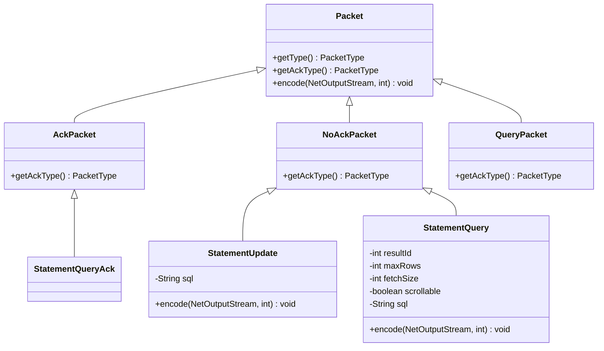
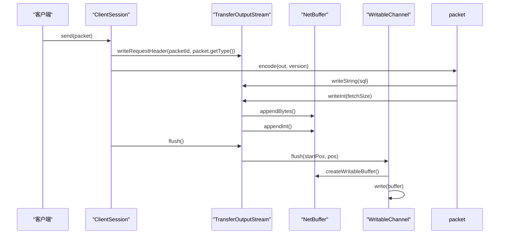
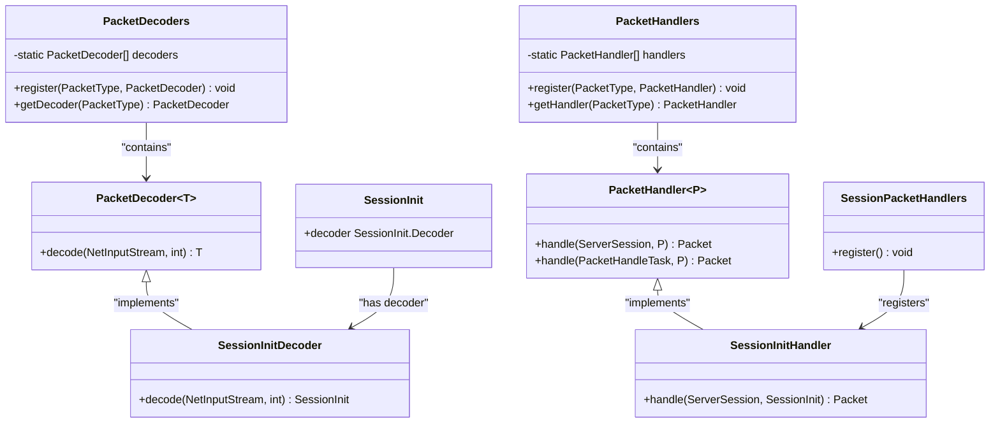
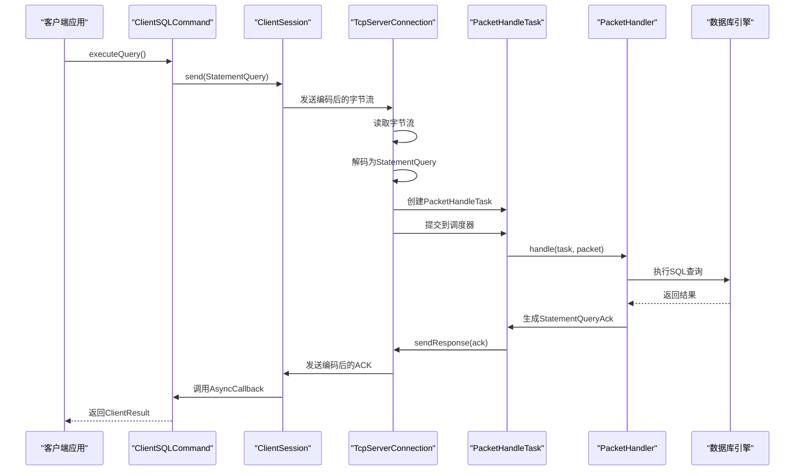

# 协议处理机制


**本文档中引用的文件**  
- [Packet.java](https://github.com/lealone/Lealone/blob/master/lealone-common/src/main/java/com/lealone/server/protocol/Packet.java)
- [PacketType.java](https://github.com/lealone/Lealone/blob/master/lealone-common/src/main/java/com/lealone/server/protocol/PacketType.java)
- [PacketDecoder.java](https://github.com/lealone/Lealone/blob/master/lealone-common/src/main/java/com/lealone/server/protocol/PacketDecoder.java)
- [PacketDecoders.java](https://github.com/lealone/Lealone/blob/master/lealone-common/src/main/java/com/lealone/server/protocol/PacketDecoders.java)
- [PacketHandler.java](https://github.com/lealone/Lealone/blob/master/lealone-server/src/main/java/com/lealone/server/handler/PacketHandler.java)
- [PacketHandlers.java](https://github.com/lealone/Lealone/blob/master/lealone-server/src/main/java/com/lealone/server/handler/PacketHandlers.java)
- [NetBuffer.java](https://github.com/lealone/Lealone/blob/master/lealone-common/src/main/java/com/lealone/net/NetBuffer.java)
- [TransferOutputStream.java](https://github.com/lealone/Lealone/blob/master/lealone-net/src/main/java/com/lealone/net/TransferOutputStream.java)
- [TransferInputStream.java](https://github.com/lealone/Lealone/blob/master/lealone-net/src/main/java/com/lealone/net/TransferInputStream.java)
- [NetInputStream.java](https://github.com/lealone/Lealone/blob/master/lealone-common/src/main/java/com/lealone/net/NetInputStream.java)
- [PacketHandleTask.java](https://github.com/lealone/Lealone/blob/master/lealone-server/src/main/java/com/lealone/server/scheduler/PacketHandleTask.java)
- [ClientSession.java](https://github.com/lealone/Lealone/blob/master/lealone-client/src/main/java/com/lealone/client/session/ClientSession.java)
- [ClientSQLCommand.java](https://github.com/lealone/Lealone/blob/master/lealone-client/src/main/java/com/lealone/client/command/ClientSQLCommand.java)


## 目录
1. [引言](#引言)
2. [协议包结构设计](#协议包结构设计)
3. [编码与解码过程](#编码与解码过程)
4. [协议分发机制](#协议分发机制)
5. [处理流程分析](#处理流程分析)
6. [可靠性与完整性保障](#可靠性与完整性保障)
7. [自定义协议扩展](#自定义协议扩展)
8. [安全考虑](#安全考虑)
9. [结论](#结论)

## 引言

Lealone数据库系统采用基于TCP的二进制协议进行客户端与服务器之间的通信。该协议设计高效、可扩展，支持多种数据库操作命令，包括会话管理、SQL执行、结果集获取和大对象（LOB）处理等。本文档全面解析Lealone的协议处理机制，重点介绍Packet数据包的结构设计、编码解码过程、分发机制以及处理流程，为开发者提供深入理解协议实现的参考。

**本文档中引用的文件**  
- [Packet.java](https://github.com/lealone/Lealone/blob/master/lealone-common/src/main/java/com/lealone/server/protocol/Packet.java)
- [PacketType.java](https://github.com/lealone/Lealone/blob/master/lealone-common/src/main/java/com/lealone/server/protocol/PacketType.java)

## 协议包结构设计

Lealone的协议包（Packet）是网络通信的基本单元，其结构设计遵循高效、清晰的原则。每个协议包由包头和包体两部分组成。

### 包头结构

包头包含协议包的元信息，用于指导接收方如何解析后续数据。包头的主要字段包括：
- **请求/响应标识**：标识该包是请求（REQUEST）还是响应（RESPONSE）。
- **包ID**：用于匹配请求与响应，实现异步通信。
- **包类型**：通过`PacketType`枚举定义，标识协议包的具体类型，如会话初始化、SQL查询、更新操作等。
- **会话ID**：关联特定的数据库会话。

### 包体结构

包体包含具体的业务数据，其结构由包类型决定。例如：
- **SQL查询包**（StatementQuery）：包含结果集ID、最大行数、获取大小、是否可滚动以及SQL语句文本。
- **更新操作包**（StatementUpdate）：仅包含要执行的SQL语句。
- **结果集获取包**（ResultFetchRows）：包含结果集ID和获取行数。

### 数据序列化格式

协议包的序列化采用紧凑的二进制格式，以减少网络传输开销。基本数据类型的序列化规则如下：
- **整数**：使用`DataOutputStream.writeInt()`格式，4字节大端序。
- **长整数**：使用`DataOutputStream.writeLong()`格式，8字节大端序。
- **字符串**：先写入长度（int），再写入字符序列（每个字符2字节）。
- **布尔值**：写入1字节，1表示true，0表示false。
- **字节数组**：先写入长度（int），再写入字节数据。

复杂数据类型（如Value对象）通过`TransferOutputStream.writeValue()`方法进行序列化，该方法先写入值的类型码，再根据类型写入具体数据。



**图示来源**  
- [Packet.java](https://github.com/lealone/Lealone/blob/master/lealone-common/src/main/java/com/lealone/server/protocol/Packet.java)
- [AckPacket.java](https://github.com/lealone/Lealone/blob/master/lealone-common/src/main/java/com/lealone/server/protocol/AckPacket.java)
- [NoAckPacket.java](https://github.com/lealone/Lealone/blob/master/lealone-common/src/main/java/com/lealone/server/protocol/NoAckPacket.java)
- [QueryPacket.java](https://github.com/lealone/Lealone/blob/master/lealone-common/src/main/java/com/lealone/server/protocol/QueryPacket.java)
- [StatementQuery.java](https://github.com/lealone/Lealone/blob/master/lealone-common/src/main/java/com/lealone/server/protocol/statement/StatementQuery.java)
- [StatementUpdate.java](https://github.com/lealone/Lealone/blob/master/lealone-common/src/main/java/com/lealone/server/protocol/statement/StatementUpdate.java)

**本节来源**  
- [Packet.java](https://github.com/lealone/Lealone/blob/master/lealone-common/src/main/java/com/lealone/server/protocol/Packet.java)
- [TransferOutputStream.java](https://github.com/lealone/Lealone/blob/master/lealone-net/src/main/java/com/lealone/net/TransferOutputStream.java)

## 编码与解码过程

协议包的编码解码是网络通信的核心环节，确保数据在客户端和服务器之间正确传输。

### 编码过程

编码过程将Java对象序列化为字节流，通过网络发送。主要步骤如下：

1.  **创建输出流**：使用`TransferOutputStream`包装底层的`WritableChannel`和`NetBuffer`。
2.  **写入包头**：调用`writeRequestHeader`或`writeResponseHeader`方法，写入请求/响应标识、包ID、包类型和会话ID。
3.  **写入包体**：调用`Packet`对象的`encode`方法，将具体数据写入输出流。
4.  **刷新缓冲区**：调用`flush`方法，将数据从`NetBuffer`写入网络通道。

在客户端，`ClientSession.send`方法是编码的入口点。它获取一个`Packet`对象，调用`out.writeRequestHeader`写入包头，然后调用`packet.encode(out, getProtocolVersion())`写入包体。



**图示来源**  
- [TransferOutputStream.java](https://github.com/lealone/Lealone/blob/master/lealone-net/src/main/java/com/lealone/net/TransferOutputStream.java)
- [NetBuffer.java](https://github.com/lealone/Lealone/blob/master/lealone-common/src/main/java/com/lealone/net/NetBuffer.java)
- [ClientSession.java](https://github.com/lealone/Lealone/blob/master/lealone-client/src/main/java/com/lealone/client/session/ClientSession.java)

### 解码过程

解码过程将接收到的字节流反序列化为Java对象。主要步骤如下：

1.  **创建输入流**：使用`TransferInputStream`读取网络数据。
2.  **读取包头**：解析出包ID、包类型和会话ID。
3.  **查找解码器**：根据包类型从`PacketDecoders`注册表中获取对应的`PacketDecoder`。
4.  **执行解码**：调用`PacketDecoder.decode`方法，从输入流中读取数据并构建`Packet`对象。

服务器端的`TcpServerConnection.read`方法负责解码。它首先读取包头，然后通过`PacketDecoders.getDecoder(packetType)`获取解码器，并调用`decoder.decode(in, protocolVersion)`完成解码。

**本节来源**  
- [TransferOutputStream.java](https://github.com/lealone/Lealone/blob/master/lealone-net/src/main/java/com/lealone/net/TransferOutputStream.java)
- [TransferInputStream.java](https://github.com/lealone/Lealone/blob/master/lealone-net/src/main/java/com/lealone/net/TransferInputStream.java)
- [PacketDecoders.java](https://github.com/lealone/Lealone/blob/master/lealone-common/src/main/java/com/lealone/server/protocol/PacketDecoders.java)
- [ClientSession.java](https://github.com/lealone/Lealone/blob/master/lealone-client/src/main/java/com/lealone/client/session/ClientSession.java)

## 协议分发机制

Lealone采用注册表模式实现协议包的分发，确保不同类型的协议包能够被正确的处理器处理。

### 解码器注册表（PacketDecoders）

`PacketDecoders`类维护一个静态数组，用于存储所有`PacketDecoder`实例。数组的索引对应`PacketType.value`的值。

- **注册**：通过`PacketDecoders.register(PacketType, PacketDecoder)`方法将解码器注册到数组中。
- **查找**：通过`PacketDecoders.getDecoder(PacketType)`方法根据包类型获取对应的解码器。

在`PacketDecoders`的静态代码块中，系统预注册了所有核心协议包的解码器，例如`SESSION_INIT`, `STATEMENT_QUERY`, `STATEMENT_UPDATE`等。

### 处理器注册表（PacketHandlers）

`PacketHandlers`类维护一个静态数组，用于存储所有`PacketHandler`实例。其工作方式与`PacketDecoders`类似。

- **注册**：通过`PacketHandlers.register(PacketType, PacketHandler)`方法将处理器注册到数组中。
- **查找**：通过`PacketHandlers.getHandler(PacketType)`方法根据包类型获取对应的处理器。

处理器的注册在`PacketHandlers`的静态代码块中通过调用`SessionPacketHandlers.register()`、`StatementPacketHandlers.register()`等方法完成，实现了模块化的注册。



**图示来源**  
- [PacketDecoders.java](https://github.com/lealone/Lealone/blob/master/lealone-common/src/main/java/com/lealone/server/protocol/PacketDecoders.java)
- [PacketDecoder.java](https://github.com/lealone/Lealone/blob/master/lealone-common/src/main/java/com/lealone/server/protocol/PacketDecoder.java)
- [SessionInit.java](https://github.com/lealone/Lealone/blob/master/lealone-common/src/main/java/com/lealone/server/protocol/session/SessionInit.java)
- [PacketHandlers.java](https://github.com/lealone/Lealone/blob/master/lealone-server/src/main/java/com/lealone/server/handler/PacketHandlers.java)
- [PacketHandler.java](https://github.com/lealone/Lealone/blob/master/lealone-server/src/main/java/com/lealone/server/handler/PacketHandler.java)
- [SessionPacketHandlers.java](https://github.com/lealone/Lealone/blob/master/lealone-server/src/main/java/com/lealone/server/handler/SessionPacketHandlers.java)

**本节来源**  
- [PacketDecoders.java](https://github.com/lealone/Lealone/blob/master/lealone-common/src/main/java/com/lealone/server/protocol/PacketDecoders.java)
- [PacketHandlers.java](https://github.com/lealone/Lealone/blob/master/lealone-server/src/main/java/com/lealone/server/handler/PacketHandlers.java)

## 处理流程分析

协议包的完整处理流程涉及客户端、网络层和服务器端的协同工作。

### 客户端发送流程

1.  **创建命令**：客户端应用创建`ClientSQLCommand`等命令对象。
2.  **构建协议包**：命令对象创建具体的`Packet`，如`StatementQuery`。
3.  **发送请求**：`ClientSession.send`方法负责将`Packet`编码并发送到服务器。
4.  **等待响应**：客户端通过`AsyncCallback`异步等待服务器的响应。

### 服务器端处理流程

1.  **接收数据**：`TcpServerConnection`从网络通道读取字节流。
2.  **解码协议包**：使用`PacketDecoders`将字节流解码为`Packet`对象。
3.  **创建处理任务**：将`Packet`、`PacketHandler`和会话信息封装成`PacketHandleTask`。
4.  **调度执行**：`PacketHandleTask`被提交到`GlobalScheduler`进行异步处理。
5.  **执行处理**：`PacketHandler.handle`方法被调用，执行具体的业务逻辑（如解析SQL、执行查询）。
6.  **发送响应**：处理完成后，生成一个ACK包（如`StatementQueryAck`），并通过连接发送回客户端。



**图示来源**  
- [ClientSQLCommand.java](https://github.com/lealone/Lealone/blob/master/lealone-client/src/main/java/com/lealone/client/command/ClientSQLCommand.java)
- [ClientSession.java](https://github.com/lealone/Lealone/blob/master/lealone-client/src/main/java/com/lealone/client/session/ClientSession.java)
- [TcpServerConnection.java](https://github.com/lealone/Lealone/blob/master/lealone-server/src/main/java/com/lealone/server/TcpServerConnection.java)
- [PacketHandleTask.java](https://github.com/lealone/Lealone/blob/master/lealone-server/src/main/java/com/lealone/server/scheduler/PacketHandleTask.java)
- [PacketHandler.java](https://github.com/lealone/Lealone/blob/master/lealone-server/src/main/java/com/lealone/server/handler/PacketHandler.java)
- [StatementPacketHandlers.java](https://github.com/lealone/Lealone/blob/master/lealone-server/src/main/java/com/lealone/server/handler/StatementPacketHandlers.java)

**本节来源**  
- [ClientSQLCommand.java](https://github.com/lealone/Lealone/blob/master/lealone-client/src/main/java/com/lealone/client/command/ClientSQLCommand.java)
- [PacketHandleTask.java](https://github.com/lealone/Lealone/blob/master/lealone-server/src/main/java/com/lealone/server/scheduler/PacketHandleTask.java)

## 可靠性与完整性保障

Lealone协议通过多种机制保证网络传输的可靠性和数据完整性。

### 连接与会话管理

- **心跳机制**：虽然代码中未直接体现，但TCP连接本身提供了基础的连接可靠性。
- **会话状态**：每个会话有唯一的ID，服务器端维护会话状态，确保命令在正确的上下文中执行。
- **错误处理**：当发生异常时，服务器会发送包含错误信息的响应包，客户端可以据此进行重试或错误处理。

### 数据完整性

- **LOB数据校验**：对于大对象（LOB）数据，协议使用HMAC（Hash-based Message Authentication Code）进行完整性校验。`calculateLobMac`方法生成校验码，`verifyLobMac`方法在接收端验证校验码，防止数据被篡改。
- **魔法数字**：在LOB数据流的末尾写入一个固定的“魔法数字”（`LOB_MAGIC`），接收方验证该数字，确保数据流完整结束。

### 流量控制

- **分页获取**：对于查询结果集，客户端通过`fetchSize`参数控制每次获取的行数，避免一次性加载大量数据导致内存溢出或网络拥塞。

**本节来源**  
- [TransferOutputStream.java](https://github.com/lealone/Lealone/blob/master/lealone-net/src/main/java/com/lealone/net/TransferOutputStream.java)
- [TransferInputStream.java](https://github.com/lealone/Lealone/blob/master/lealone-net/src/main/java/com/lealone/net/TransferInputStream.java)

## 自定义协议扩展

Lealone的协议设计具有良好的扩展性，允许开发者添加自定义的协议包。

### 扩展步骤

1.  **定义新的包类型**：在`PacketType`枚举中添加新的类型值。注意保留间隔，避免与现有类型冲突。
2.  **实现Packet类**：创建新的`Packet`实现类，实现`encode`方法以定义其序列化逻辑。
3.  **实现PacketDecoder**：创建对应的`PacketDecoder`实现，实现`decode`方法以定义其反序列化逻辑。
4.  **实现PacketHandler**：创建`PacketHandler`实现，定义该协议包的业务处理逻辑。
5.  **注册组件**：在系统启动时，调用`PacketDecoders.register`和`PacketHandlers.register`将新的解码器和处理器注册到系统中。

### 示例

```java
// 1. 定义新类型
public enum PacketType {
    ...
    CUSTOM_COMMAND(100), // 选择一个未使用的值
    CUSTOM_COMMAND_ACK(101);
    ...
}

// 2. 实现Packet
public class CustomCommand implements Packet {
    private String data;
    public CustomCommand(String data) { this.data = data; }
    @Override public PacketType getType() { return PacketType.CUSTOM_COMMAND; }
    @Override public PacketType getAckType() { return PacketType.VOID; }
    @Override public void encode(NetOutputStream out, int version) throws IOException {
        out.writeString(data);
    }
}

// 3. 实现Decoder
public static class Decoder implements PacketDecoder<CustomCommand> {
    public static final Decoder decoder = new Decoder();
    @Override public CustomCommand decode(NetInputStream in, int version) throws IOException {
        String data = in.readString();
        return new CustomCommand(data);
    }
}

// 4. 实现Handler
public static class Handler implements PacketHandler<CustomCommand> {
    @Override public Packet handle(ServerSession session, CustomCommand packet) {
        // 处理自定义命令
        System.out.println("Received: " + packet.data);
        return null; // 无需ACK
    }
}

// 5. 注册
static {
    PacketDecoders.register(PacketType.CUSTOM_COMMAND, CustomCommand.Decoder.decoder);
    PacketHandlers.register(PacketType.CUSTOM_COMMAND, new CustomCommand.Handler());
}
```

**本节来源**  
- [PacketType.java](https://github.com/lealone/Lealone/blob/master/lealone-common/src/main/java/com/lealone/server/protocol/PacketType.java)
- [PacketDecoders.java](https://github.com/lealone/Lealone/blob/master/lealone-common/src/main/java/com/lealone/server/protocol/PacketDecoders.java)
- [PacketHandlers.java](https://github.com/lealone/Lealone/blob/master/lealone-server/src/main/java/com/lealone/server/handler/PacketHandlers.java)

## 安全考虑

协议的安全性主要体现在数据传输的完整性和防篡改上。

### LOB数据安全

- **HMAC校验**：如前所述，LOB数据使用HMAC进行校验。HMAC的计算结合了LOB的ID和表ID，确保了数据的来源和完整性。即使攻击者截获了数据包，也无法伪造有效的HMAC。

### 潜在安全风险

- **明文传输**：当前协议未提及SSL/TLS加密，敏感数据（如密码、业务数据）可能以明文形式在网络中传输，存在被窃听的风险。
- **会话劫持**：会话ID在包头中明文传输，如果被截获，可能被用于会话劫持。

**本节来源**  
- [TransferOutputStream.java](https://github.com/lealone/Lealone/blob/master/lealone-net/src/main/java/com/lealone/net/TransferOutputStream.java)

## 结论

Lealone的协议处理机制设计精巧，通过`Packet`、`PacketDecoder`、`PacketHandler`等核心组件，构建了一个高效、可扩展的通信框架。其基于注册表的分发机制使得协议易于维护和扩展。编码解码过程高效，利用`NetBuffer`和`TransferStream`实现了高性能的I/O操作。通过HMAC和魔法数字等机制，保障了LOB数据的完整性。开发者可以遵循既定模式，轻松地为系统添加自定义的协议命令，满足特定的业务需求。