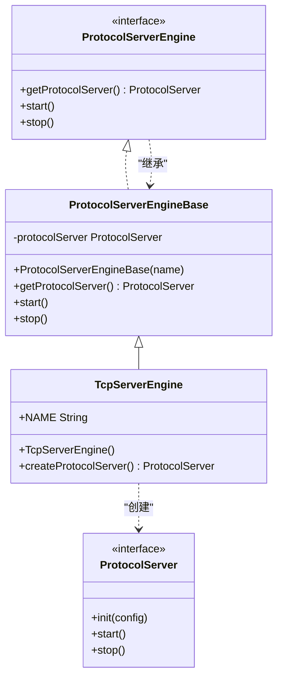
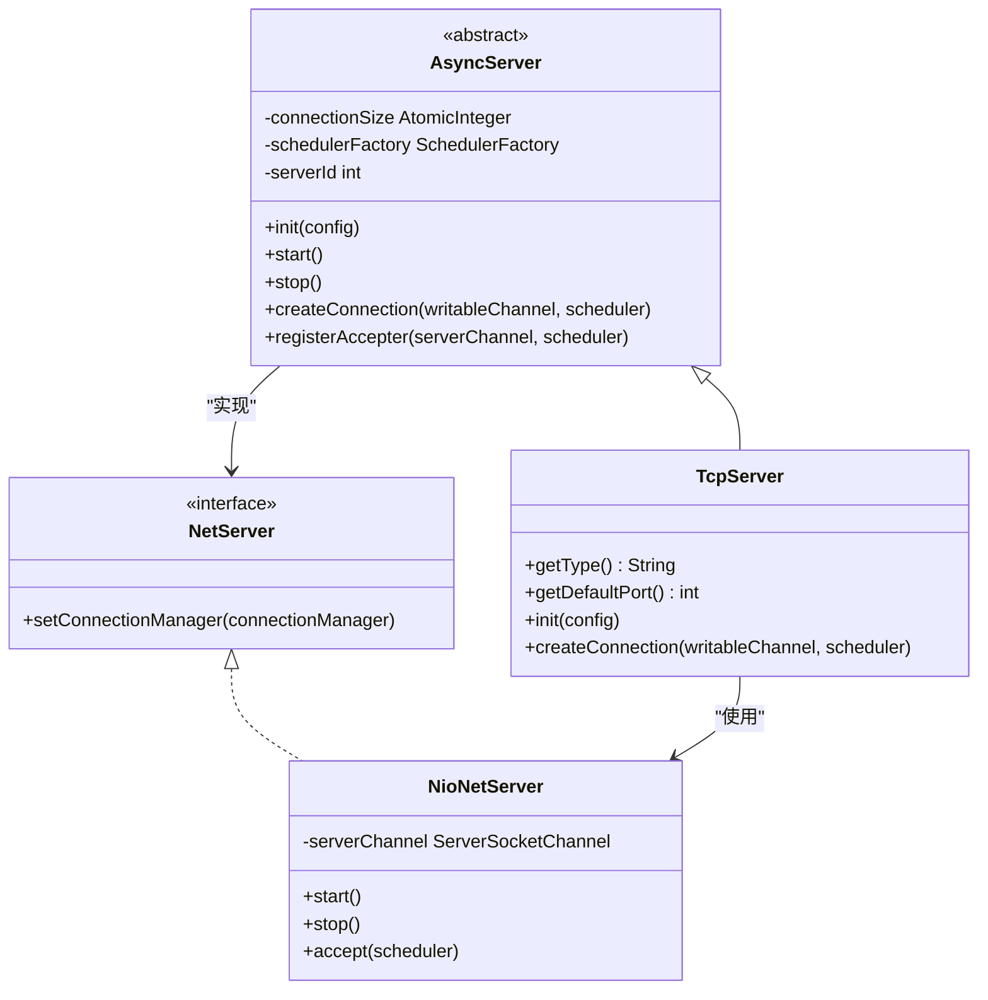
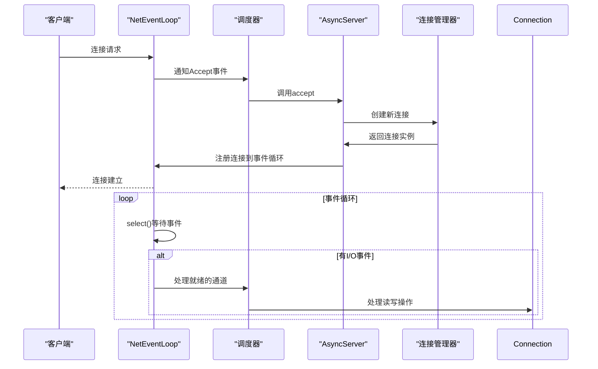
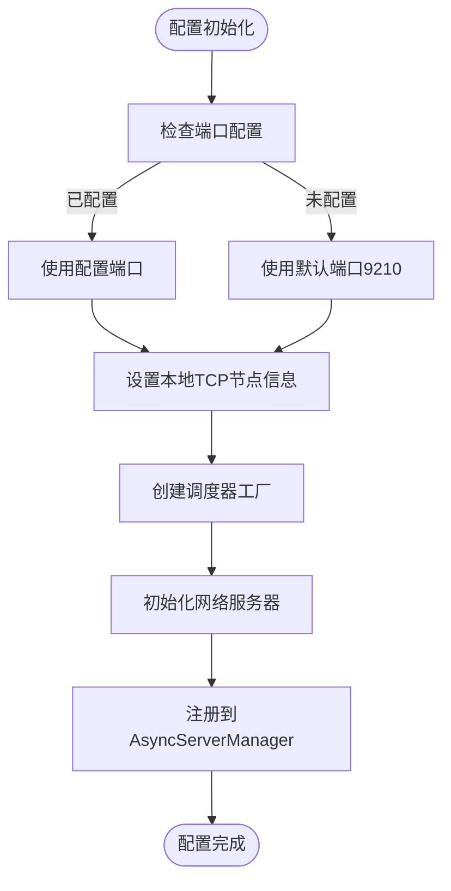
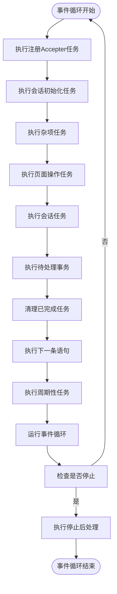
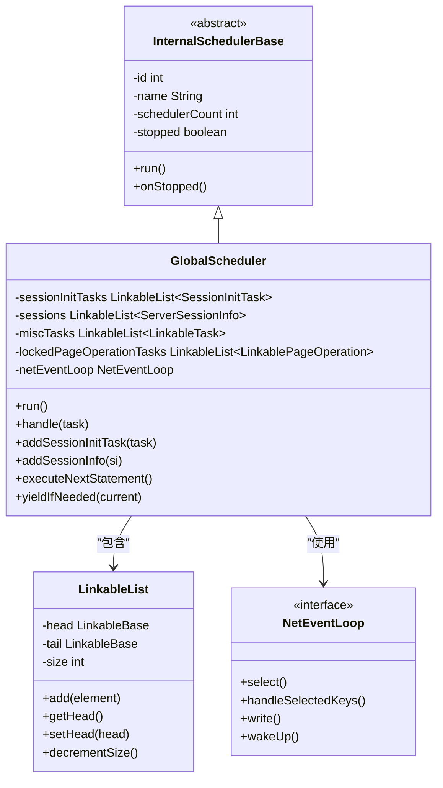
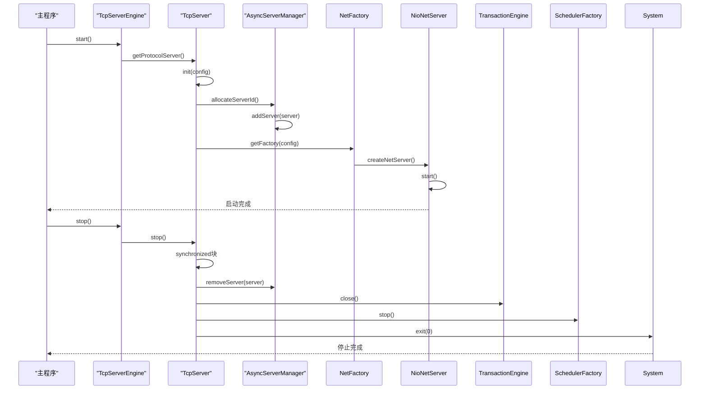

# 服务器引擎

**本文档引用的文件**
- [TcpServerEngine.java](https://github.com/lealone/Lealone/blob/master/lealone-server/src/main/java/com/lealone/server/TcpServerEngine.java)
- [TcpServer.java](https://github.com/lealone/Lealone/blob/master/lealone-server/src/main/java/com/lealone/server/TcpServer.java)
- [AsyncServer.java](https://github.com/lealone/Lealone/blob/master/lealone-server/src/main/java/com/lealone/server/AsyncServer.java)
- [TcpServerConnection.java](https://github.com/lealone/Lealone/blob/master/lealone-server/src/main/java/com/lealone/server/TcpServerConnection.java)
- [ProtocolServerEngineBase.java](https://github.com/lealone/Lealone/blob/master/lealone-sci/src/main/java/com/lealone/server/ProtocolServerEngineBase.java)
- [NetFactory.java](https://github.com/lealone/Lealone/blob/master/lealone-net/src/main/java/com/lealone/net/NetFactory.java)
- [NioNetServer.java](https://github.com/lealone/Lealone/blob/master/lealone-net/src/main/java/com/lealone/net/nio/NioNetServer.java)
- [AsyncServerManager.java](https://github.com/lealone/Lealone/blob/master/lealone-server/src/main/java/com/lealone/server/AsyncServerManager.java)
- [GlobalScheduler.java](https://github.com/lealone/Lealone/blob/master/lealone-server/src/main/java/com/lealone/server/scheduler/GlobalScheduler.java)
- [Constants.java](https://github.com/lealone/Lealone/blob/master/lealone-common/src/main/java/com/lealone/db/Constants.java)
- [ConnectionSetting.java](https://github.com/lealone/Lealone/blob/master/lealone-common/src/main/java/com/lealone/db/ConnectionSetting.java)

## 目录
1. [引言](#引言)
2. [核心服务器引擎职责](#核心服务器引擎职责)
3. [TCP协议底层通信实现](#tcp协议底层通信实现)
4. [异步非阻塞操作支持](#异步非阻塞操作支持)
5. [服务器配置参数与调优建议](#服务器配置参数与调优建议)
6. [多线程处理模型设计](#多线程处理模型设计)
7. [服务器生命周期管理](#服务器生命周期管理)
8. [状态监控与诊断](#状态监控与诊断)
9. [架构总结](#架构总结)

## 引言
Lealone数据库系统中的服务器引擎是整个系统的核心组件，负责处理客户端连接、请求分发和网络通信。本文档详细介绍了以TcpServerEngine为核心的服务器引擎架构，包括其端口监听、连接接受、请求分发等核心职责。文档还深入探讨了TcpServer如何实现TCP协议的底层通信，以及AsyncServer如何支持异步非阻塞操作。此外，本文档提供了服务器配置参数的详细说明、多线程处理模型的设计原理，以及服务器启动、停止和状态监控的完整指南。

**本节不分析具体源文件**

## 核心服务器引擎职责

TcpServerEngine作为核心服务器引擎，承担着端口监听、连接接受和请求分发的关键职责。它通过继承ProtocolServerEngineBase类并实现ProtocolServerEngine接口，构成了服务器引擎的基础框架。TcpServerEngine的主要职责包括：

1. **协议服务器创建**：通过重写createProtocolServer方法，创建并返回TcpServer实例，实现了协议服务器的工厂模式。
2. **引擎命名**：通过静态常量NAME定义了服务器引擎的名称为"TCP"，便于系统识别和管理。
3. **生命周期管理**：继承自ProtocolServerEngineBase的启动和停止机制，确保服务器引擎能够正确地初始化和关闭。

TcpServerEngine的设计体现了单一职责原则，专注于TCP协议服务器的创建和管理，而将具体的网络通信和连接处理委托给下层的TcpServer和AsyncServer组件。

**图源**
- [TcpServerEngine.java](https://github.com/lealone/Lealone/blob/master/lealone-server/src/main/java/com/lealone/server/TcpServerEngine.java#L8-L19)
- [ProtocolServerEngineBase.java](https://github.com/lealone/Lealone/blob/master/lealone-sci/src/main/java/com/lealone/server/ProtocolServerEngineBase.java#L13-L58)

**本节源**
- [TcpServerEngine.java](https://github.com/lealone/Lealone/blob/master/lealone-server/src/main/java/com/lealone/server/TcpServerEngine.java#L8-L19)

## TCP协议底层通信实现

TcpServer类实现了TCP协议的底层通信功能，作为AsyncServer的子类，它在异步非阻塞的基础上提供了TCP特定的实现。TcpServer的主要实现细节包括：

1. **类型标识**：通过重写getType方法返回TcpServerEngine.NAME，确保服务器类型正确标识为TCP。
2. **默认端口**：通过重写getDefaultPort方法返回Constants.DEFAULT_TCP_PORT（9210），为TCP服务器提供默认监听端口。
3. **初始化配置**：在init方法中，除了调用父类初始化外，还通过NetNode.setLocalTcpNode设置本地TCP节点信息，确保网络拓扑正确。
4. **连接创建**：通过重写createConnection方法，创建TcpServerConnection实例，实现连接的工厂模式。

TcpServer的设计充分利用了Java NIO技术，通过非阻塞I/O操作提高了服务器的并发处理能力。它与NioNetServer协同工作，NioNetServer负责监听端口和接受新连接，而TcpServer则负责管理这些连接的生命周期。

**图源**
- [TcpServer.java](https://github.com/lealone/Lealone/blob/master/lealone-server/src/main/java/com/lealone/server/TcpServer.java#L15-L38)
- [NioNetServer.java](https://github.com/lealone/Lealone/blob/master/lealone-net/src/main/java/com/lealone/net/nio/NioNetServer.java#L20-L76)

**本节源**
- [TcpServer.java](https://github.com/lealone/Lealone/blob/master/lealone-server/src/main/java/com/lealone/server/TcpServer.java#L15-L38)
- [Constants.java](https://github.com/lealone/Lealone/blob/master/lealone-common/src/main/java/com/lealone/db/Constants.java#L153)

## 异步非阻塞操作支持

AsyncServer类是支持异步非阻塞操作的核心组件，它通过Java NIO技术实现了高性能的网络通信。AsyncServer的主要特性包括：

1. **连接管理**：通过AtomicInteger维护连接数量，确保线程安全的连接计数。
2. **调度器工厂**：通过SchedulerFactory管理调度器实例，支持多线程并发处理。
3. **服务器标识**：通过serverId唯一标识每个服务器实例，便于集群环境下的管理。
4. **生命周期管理**：重写start和stop方法，实现服务器的启动和关闭逻辑，包括注册到AsyncServerManager和事务引擎的关闭。

AsyncServer的异步非阻塞特性主要体现在：
- 使用NetEventLoop进行事件循环，通过Selector监听I/O事件
- 采用非阻塞的ServerSocketChannel和SocketChannel
- 通过调度器(Scheduler)实现任务的异步处理
- 支持轮询式接受连接(isRoundRobinAcceptEnabled)

这种设计使得服务器能够以少量线程处理大量并发连接，大大提高了资源利用率和系统吞吐量。

**图源**
- [AsyncServer.java](https://github.com/lealone/Lealone/blob/master/lealone-server/src/main/java/com/lealone/server/AsyncServer.java#L26-L168)
- [NetEventLoop.java](https://github.com/lealone/Lealone/blob/master/lealone-net/src/main/java/com/lealone/net/NetEventLoop.java#L14-L51)

**本节源**
- [AsyncServer.java](https://github.com/lealone/Lealone/blob/master/lealone-server/src/main/java/com/lealone/server/AsyncServer.java#L26-L168)

## 服务器配置参数与调优建议

服务器的配置参数对系统性能和稳定性有重要影响。以下是关键配置参数及其调优建议：

### 核心配置参数

| 参数 | 默认值 | 说明 | 调优建议 |
|------|--------|------|----------|
| port | 9210 | TCP服务器监听端口 | 在多实例部署时需确保端口不冲突 |
| name | TCP | 服务器名称 | 用于标识不同类型的服务器引擎 |
| net_factory_name | nio | 网络工厂名称 | 建议保持默认的NIO模式以获得最佳性能 |
| network_timeout | 15000 | 网络超时时间(毫秒) | 高延迟网络可适当增加 |
| scheduler_count | 根据CPU核心数 | 调度器数量 | 通常设置为CPU核心数的1-2倍 |

### 配置参数实现

配置参数主要通过以下方式实现：
1. **NetFactory选择**：通过ConnectionSetting.NET_FACTORY_NAME配置网络工厂类型，支持NIO和BIO两种模式。
2. **默认值设置**：在TcpServer中通过getDefaultPort返回Constants.DEFAULT_TCP_PORT，确保有合理的默认配置。
3. **动态配置**：在init方法中接收Map<String, String>类型的配置参数，支持运行时配置调整。

### 调优建议

1. **连接数优化**：根据预期并发连接数调整系统资源限制，避免文件描述符耗尽。
2. **缓冲区大小**：根据网络带宽和延迟调整socket接收和发送缓冲区大小。
3. **调度器配置**：根据CPU核心数合理设置调度器数量，避免过多线程导致上下文切换开销。
4. **超时设置**：根据应用场景设置合理的网络超时时间，平衡响应速度和资源占用。

**图源**
- [Constants.java](https://github.com/lealone/Lealone/blob/master/lealone-common/src/main/java/com/lealone/db/Constants.java#L153)
- [ConnectionSetting.java](https://github.com/lealone/Lealone/blob/master/lealone-common/src/main/java/com/lealone/db/ConnectionSetting.java#L8-L27)

**本节源**
- [TcpServer.java](https://github.com/lealone/Lealone/blob/master/lealone-server/src/main/java/com/lealone/server/TcpServer.java#L23-L25)
- [AsyncServer.java](https://github.com/lealone/Lealone/blob/master/lealone-server/src/main/java/com/lealone/server/AsyncServer.java#L43-L48)
- [Constants.java](https://github.com/lealone/Lealone/blob/master/lealone-common/src/main/java/com/lealone/db/Constants.java#L49-L153)

## 多线程处理模型设计

Lealone服务器采用先进的多线程处理模型，通过GlobalScheduler实现高效的并发处理。该模型的核心设计包括：

### 调度器架构

GlobalScheduler继承自InternalSchedulerBase，实现了复杂的任务调度机制：
1. **会话初始化队列**：通过sessionInitTasks队列管理新会话的创建，避免阻塞主事件循环。
2. **会话任务队列**：通过sessions队列管理活跃会话的任务，支持优先级调度。
3. **杂项任务队列**：通过miscTasks队列处理临时性任务，执行完成后自动清理。
4. **页面操作队列**：通过lockedPageOperationTasks队列管理存储层的页面操作。

### 任务调度流程

### 并发控制机制

1. **轮询式连接接受**：通过AsyncServerManager的registerAccepterIfNeed方法，实现调度器间的轮询式连接接受，避免单个调度器过载。
2. **优先级调度**：在executeNextStatement方法中，根据任务优先级选择下一个执行的命令，确保高优先级任务及时处理。
3. **会话超时检查**：定期检查会话超时，及时清理无效会话，释放系统资源。
4. **内存管理**：集成MemoryManager，在需要时触发GC，清理查询缓存，防止内存泄漏。

这种多线程处理模型既保证了高并发性能，又通过合理的任务队列设计避免了线程竞争和资源争用。

**图源**
- [GlobalScheduler.java](https://github.com/lealone/Lealone/blob/master/lealone-server/src/main/java/com/lealone/server/scheduler/GlobalScheduler.java#L31-L454)
- [AsyncServerManager.java](https://github.com/lealone/Lealone/blob/master/lealone-server/src/main/java/com/lealone/server/AsyncServerManager.java#L15-L132)

**本节源**
- [GlobalScheduler.java](https://github.com/lealone/Lealone/blob/master/lealone-server/src/main/java/com/lealone/server/scheduler/GlobalScheduler.java#L31-L454)
- [AsyncServerManager.java](https://github.com/lealone/Lealone/blob/master/lealone-server/src/main/java/com/lealone/server/AsyncServerManager.java#L15-L132)

## 服务器生命周期管理

服务器的生命周期管理包括启动、运行和停止三个阶段，每个阶段都有明确的职责和流程。

### 启动流程

1. **初始化**：调用init方法，设置端口、名称等配置参数，创建调度器工厂。
2. **注册**：通过AsyncServerManager分配serverId并注册到全局服务器列表。
3. **网络初始化**：创建NetFactory和NetServer，设置连接管理器，初始化网络配置。
4. **启动**：调用start方法，开始监听端口，将服务器添加到已启动服务器列表。

### 停止流程

1. **同步块保护**：在stop方法中使用synchronized确保线程安全。
2. **状态检查**：首先检查服务器是否已停止，避免重复停止。
3. **清理资源**：从已启动服务器列表和AsyncServerManager中移除服务器。
4. **优雅关闭**：在所有服务器停止后，关闭事务引擎和调度器工厂。
5. **进程退出**：在非ShutdownHook线程中调用System.exit(0)确保进程正常退出。

### 生命周期关键方法

**图源**
- [AsyncServer.java](https://github.com/lealone/Lealone/blob/master/lealone-server/src/main/java/com/lealone/server/AsyncServer.java#L60-L87)
- [ProtocolServerEngineBase.java](https://github.com/lealone/Lealone/blob/master/lealone-sci/src/main/java/com/lealone/server/ProtocolServerEngineBase.java#L43-L51)

**本节源**
- [AsyncServer.java](https://github.com/lealone/Lealone/blob/master/lealone-server/src/main/java/com/lealone/server/AsyncServer.java#L60-L87)
- [ProtocolServerEngineBase.java](https://github.com/lealone/Lealone/blob/master/lealone-sci/src/main/java/com/lealone/server/ProtocolServerEngineBase.java#L43-L51)

## 状态监控与诊断

服务器提供了完善的状态监控和诊断机制，确保系统的稳定运行。

### 连接状态监控

1. **连接计数**：通过AtomicInteger connectionSize精确统计当前连接数。
2. **会话管理**：在TcpServerConnection中维护sessions映射，跟踪每个会话的状态。
3. **超时检测**：通过checkSessionTimeout方法定期检查会话超时，及时清理无效会话。

### 性能监控

1. **负载评估**：通过getLoad方法计算调度器负载，包括会话数和锁定页面操作数。
2. **慢查询检测**：集成查询统计功能，记录执行时间超过阈值的查询。
3. **内存监控**：与MemoryManager集成，在需要时触发GC，防止内存泄漏。

### 诊断机制

1. **异常处理**：在handleRequest中捕获异常，通过handleException方法进行统一处理。
2. **日志记录**：使用LoggerFactory创建日志记录器，输出关键操作和错误信息。
3. **错误响应**：通过sendError方法向客户端发送错误信息，帮助诊断问题。

这些监控和诊断机制共同构成了服务器的健康检查体系，确保能够及时发现和解决问题。

**本节不分析具体源文件**

## 架构总结

Lealone服务器引擎采用分层架构设计，各组件职责清晰，协同工作：

1. **协议层**：TcpServerEngine负责协议服务器的创建和管理。
2. **通信层**：TcpServer和AsyncServer实现TCP协议的底层通信。
3. **网络层**：NioNetServer和NetEventLoop提供异步非阻塞的网络I/O支持。
4. **调度层**：GlobalScheduler实现多线程任务调度和并发处理。
5. **管理层**：AsyncServerManager负责服务器实例的全局管理。

这种架构设计具有高内聚、低耦合的特点，既保证了系统的高性能，又提供了良好的可扩展性和可维护性。通过合理的配置和调优，服务器能够适应各种应用场景，满足不同的性能需求。

**本节不分析具体源文件**