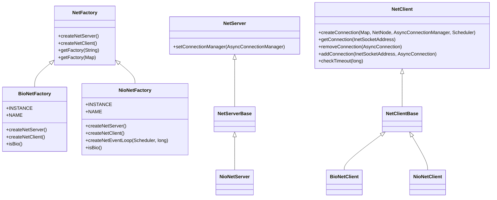

# 网络层

<cite>
**本文档中引用的文件**
- [NetServer.java](file://lealone-net/src/main/java/com/lealone/net/NetServer.java)
- [NetServerBase.java](file://lealone-net/src/main/java/com/lealone/net/NetServerBase.java)
- [NioNetServer.java](file://lealone-net/src/main/java/com/lealone/net/nio/NioNetServer.java)
- [BioNetClient.java](file://lealone-net/src/main/java/com/lealone/net/bio/BioNetClient.java)
- [NioNetClient.java](file://lealone-net/src/main/java/com/lealone/net/nio/NioNetClient.java)
- [AsyncConnectionPool.java](file://lealone-net/src/main/java/com/lealone/net/AsyncConnectionPool.java)
- [NetClientBase.java](file://lealone-net/src/main/java/com/lealone/net/NetClientBase.java)
- [TcpClientConnection.java](file://lealone-net/src/main/java/com/lealone/net/TcpClientConnection.java)
- [WritableChannel.java](file://lealone-net/src/main/java/com/lealone/net/WritableChannel.java)
- [BioWritableChannel.java](file://lealone-net/src/main/java/com/lealone/net/bio/BioWritableChannel.java)
- [NioWritableChannel.java](file://lealone-net/src/main/java/com/lealone/net/nio/NioWritableChannel.java)
- [TransferConnection.java](file://lealone-net/src/main/java/com/lealone/net/TransferConnection.java)
- [NetFactory.java](file://lealone-net/src/main/java/com/lealone/net/NetFactory.java)
- [NetEventLoop.java](file://lealone-net/src/main/java/com/lealone/net/NetEventLoop.java)
- [TcpServerEngine.java](file://lealone-server/src/main/java/com/lealone/server/TcpServerEngine.java)
- [TcpServer.java](file://lealone-server/src/main/java/com/lealone/server/TcpServer.java)
</cite>

## 目录
1. [简介](#简介)
2. [项目结构](#项目结构)
3. [核心组件](#核心组件)
4. [架构概述](#架构概述)
5. [详细组件分析](#详细组件分析)
6. [依赖分析](#依赖分析)
7. [性能考虑](#性能考虑)
8. [故障排除指南](#故障排除指南)
9. [结论](#结论)

## 简介
Lealone数据库系统的网络层提供了BIO和NIO两种网络模型的实现，支持高并发场景下的高效网络通信。本文档全面介绍网络层的实现细节，包括NetServer如何监听客户端连接，TcpServerEngine如何处理TCP协议通信，Packet数据包的结构设计和序列化/反序列化机制，以及AsyncConnectionPool如何管理连接池以提高资源利用率。文档还描述了从客户端连接建立到SQL命令传输再到结果返回的完整网络通信流程，并提供网络层配置参数说明和性能调优建议。

## 项目结构
Lealone的网络层主要由lealone-net和lealone-server模块组成，实现了BIO和NIO两种网络模型。网络层采用分层架构设计，将网络通信、协议处理和业务逻辑分离，提供了灵活的扩展能力。

**图源**
- [NetServer.java](file://lealone-net/src/main/java/com/lealone/net/NetServer.java)
- [NetClient.java](file://lealone-net/src/main/java/com/lealone/net/NetClient.java)
- [WritableChannel.java](file://lealone-net/src/main/java/com/lealone/net/WritableChannel.java)
- [TcpServerEngine.java](file://lealone-server/src/main/java/com/lealone/server/TcpServerEngine.java)
- [TcpServer.java](file://lealone-server/src/main/java/com/lealone/server/TcpServer.java)

**节源**
- [NetServer.java](file://lealone-net/src/main/java/com/lealone/net/NetServer.java)
- [NetClient.java](file://lealone-net/src/main/java/com/lealone/net/NetClient.java)
- [WritableChannel.java](file://lealone-net/src/main/java/com/lealone/net/WritableChannel.java)
- [TcpServerEngine.java](file://lealone-server/src/main/java/com/lealone/server/TcpServerEngine.java)

## 核心组件
Lealone网络层的核心组件包括NetServer、NetClient、AsyncConnection、WritableChannel和NetEventLoop等。NetServer负责监听客户端连接，NetClient负责创建客户端连接，AsyncConnection表示一个异步连接，WritableChannel负责底层的读写操作，NetEventLoop则负责NIO事件循环。

BIO和NIO两种网络模型通过NetFactory工厂类进行创建和管理，允许在运行时根据配置选择合适的网络模型。对于高并发场景，NIO模型通过事件驱动的方式能够更好地利用系统资源，而BIO模型则提供了更简单的编程模型。

**节源**
- [NetServer.java](file://lealone-net/src/main/java/com/lealone/net/NetServer.java)
- [NetClient.java](file://lealone-net/src/main/java/com/lealone/net/NetClient.java)
- [AsyncConnection.java](file://lealone-net/src/main/java/com/lealone/net/AsyncConnection.java)
- [WritableChannel.java](file://lealone-net/src/main/java/com/lealone/net/WritableChannel.java)
- [NetEventLoop.java](file://lealone-net/src/main/java/com/lealone/net/NetEventLoop.java)

## 架构概述
Lealone网络层采用分层架构设计，将网络通信、协议处理和业务逻辑分离。网络层的核心是NetServer和NetClient，分别负责服务器端和客户端的网络通信。

**图源**
- [NetServer.java](file://lealone-net/src/main/java/com/lealone/net/NetServer.java)
- [NioNetServer.java](file://lealone-net/src/main/java/com/lealone/net/nio/NioNetServer.java)
- [NetClient.java](file://lealone-net/src/main/java/com/lealone/net/NetClient.java)
- [NioNetClient.java](file://lealone-net/src/main/java/com/lealone/net/nio/NioNetClient.java)
- [AsyncConnection.java](file://lealone-net/src/main/java/com/lealone/net/AsyncConnection.java)
- [WritableChannel.java](file://lealone-net/src/main/java/com/lealone/net/WritableChannel.java)
- [NetEventLoop.java](file://lealone-net/src/main/java/com/lealone/net/NetEventLoop.java)
- [TransferConnection.java](file://lealone-net/src/main/java/com/lealone/net/TransferConnection.java)
- [TcpServer.java](file://lealone-server/src/main/java/com/lealone/server/TcpServer.java)

## 详细组件分析

### BIO和NIO网络模型实现
Lealone网络层提供了BIO和NIO两种网络模型的实现，通过NetFactory工厂类进行创建和管理。BIO模型基于传统的阻塞I/O，每个连接都需要一个独立的线程处理；而NIO模型基于非阻塞I/O和事件驱动，能够用少量线程处理大量并发连接。

**图源**
- [NetFactory.java](file://lealone-net/src/main/java/com/lealone/net/NetFactory.java)
- [BioNetFactory.java](file://lealone-net/src/main/java/com/lealone/net/bio/BioNetFactory.java)
- [NioNetFactory.java](file://lealone-net/src/main/java/com/lealone/net/nio/NioNetFactory.java)
- [NetServer.java](file://lealone-net/src/main/java/com/lealone/net/NetServer.java)
- [NetServerBase.java](file://lealone-net/src/main/java/com/lealone/net/NetServerBase.java)
- [NioNetServer.java](file://lealone-net/src/main/java/com/lealone/net/nio/NioNetServer.java)
- [NetClient.java](file://lealone-net/src/main/java/com/lealone/net/NetClient.java)
- [NetClientBase.java](file://lealone-net/src/main/java/com/lealone/net/NetClientBase.java)
- [BioNetClient.java](file://lealone-net/src/main/java/com/lealone/net/bio/BioNetClient.java)
- [NioNetClient.java](file://lealone-net/src/main/java/com/lealone/net/nio/NioNetClient.java)

**节源**
- [NetFactory.java](file://lealone-net/src/main/java/com/lealone/net/NetFactory.java)
- [BioNetFactory.java](file://lealone-net/src/main/java/com/lealone/net/bio/BioNetFactory.java)
- [NioNetFactory.java](file://lealone-net/src/main/java/com/lealone/net/nio/NioNetFactory.java)
- [NetServer.java](file://lealone-net/src/main/java/com/lealone/net/NetServer.java)
- [NetClient.java](file://lealone-net/src/main/java/com/lealone/net/NetClient.java)

### NetServer连接监听机制
NetServer负责监听客户端连接，其中NioNetServer实现了基于NIO的非阻塞连接监听。当服务器启动时，NioNetServer会创建一个ServerSocketChannel并将其注册到Selector上，监听OP_ACCEPT事件。

**图源**
- [NioNetServer.java](file://lealone-net/src/main/java/com/lealone/net/nio/NioNetServer.java)
- [NetServerBase.java](file://lealone-net/src/main/java/com/lealone/net/NetServerBase.java)
- [AsyncConnectionManager.java](file://lealone-net/src/main/java/com/lealone/net/AsyncConnectionManager.java)

**节源**
- [NioNetServer.java](file://lealone-net/src/main/java/com/lealone/net/nio/NioNetServer.java)

### TcpServerEngine TCP通信处理
TcpServerEngine是TCP协议服务器的引擎，负责创建TcpServer实例并管理TCP连接。TcpServer继承自NetServerBase，实现了TCP协议的通信处理逻辑。

**图源**
- [TcpServerEngine.java](file://lealone-server/src/main/java/com/lealone/server/TcpServerEngine.java)
- [TcpServer.java](file://lealone-server/src/main/java/com/lealone/server/TcpServer.java)
- [NetServerBase.java](file://lealone-net/src/main/java/com/lealone/net/NetServerBase.java)
- [ProtocolServerBase.java](file://lealone-common/src/main/java/com/lealone/server/ProtocolServerBase.java)

**节源**
- [TcpServerEngine.java](file://lealone-server/src/main/java/com/lealone/server/TcpServerEngine.java)
- [TcpServer.java](file://lealone-server/src/main/java/com/lealone/server/TcpServer.java)

### Packet数据包结构与序列化
Lealone网络层使用TransferConnection、TransferInputStream和TransferOutputStream来处理数据包的序列化和反序列化。数据包采用自定义的二进制协议格式，包含长度前缀、请求/响应标识、包ID、包类型/状态等信息。

**图源**
- [TransferConnection.java](file://lealone-net/src/main/java/com/lealone/net/TransferConnection.java)
- [TransferInputStream.java](file://lealone-net/src/main/java/com/lealone/net/TransferInputStream.java)
- [TransferOutputStream.java](file://lealone-net/src/main/java/com/lealone/net/TransferOutputStream.java)

**节源**
- [TransferConnection.java](file://lealone-net/src/main/java/com/lealone/net/TransferConnection.java)

### AsyncConnectionPool连接池管理
AsyncConnectionPool负责管理异步连接池，通过连接复用提高资源利用率。连接池支持共享和专用两种模式，可以根据配置决定连接的最大共享大小。

**图源**
- [AsyncConnectionPool.java](file://lealone-net/src/main/java/com/lealone/net/AsyncConnectionPool.java)
- [AsyncConnection.java](file://lealone-net/src/main/java/com/lealone/net/AsyncConnection.java)
- [NetClientBase.java](file://lealone-net/src/main/java/com/lealone/net/NetClientBase.java)

**节源**
- [AsyncConnectionPool.java](file://lealone-net/src/main/java/com/lealone/net/AsyncConnectionPool.java)

### 完整网络通信流程
从客户端连接建立到SQL命令传输再到结果返回的完整网络通信流程涉及多个组件的协作。以下是典型的通信流程：

**图源**
- [NetClient.java](file://lealone-net/src/main/java/com/lealone/net/NetClient.java)
- [NioNetClient.java](file://lealone-net/src/main/java/com/lealone/net/nio/NioNetClient.java)
- [NetEventLoop.java](file://lealone-net/src/main/java/com/lealone/net/NetEventLoop.java)
- [NioNetServer.java](file://lealone-net/src/main/java/com/lealone/net/nio/NioNetServer.java)
- [TcpServer.java](file://lealone-server/src/main/java/com/lealone/server/TcpServer.java)
- [TransferConnection.java](file://lealone-net/src/main/java/com/lealone/net/TransferConnection.java)

**节源**
- [NetClient.java](file://lealone-net/src/main/java/com/lealone/net/NetClient.java)
- [NioNetClient.java](file://lealone-net/src/main/java/com/lealone/net/nio/NioNetClient.java)
- [TcpServer.java](file://lealone-server/src/main/java/com/lealone/server/TcpServer.java)

## 依赖分析
Lealone网络层的组件之间存在清晰的依赖关系，通过接口和抽象类实现松耦合设计。NetFactory作为工厂类，负责创建NetServer和NetClient实例，而具体的实现由BIO和NIO子系统提供。

**图源**
- [NetFactory.java](file://lealone-net/src/main/java/com/lealone/net/NetFactory.java)
- [NetServer.java](file://lealone-net/src/main/java/com/lealone/net/NetServer.java)
- [NetClient.java](file://lealone-net/src/main/java/com/lealone/net/NetClient.java)
- [AsyncConnectionPool.java](file://lealone-net/src/main/java/com/lealone/net/AsyncConnectionPool.java)
- [AsyncConnection.java](file://lealone-net/src/main/java/com/lealone/net/AsyncConnection.java)
- [WritableChannel.java](file://lealone-net/src/main/java/com/lealone/net/WritableChannel.java)
- [NetEventLoop.java](file://lealone-net/src/main/java/com/lealone/net/NetEventLoop.java)
- [TransferConnection.java](file://lealone-net/src/main/java/com/lealone/net/TransferConnection.java)
- [TcpServerEngine.java](file://lealone-server/src/main/java/com/lealone/server/TcpServerEngine.java)
- [TcpServer.java](file://lealone-server/src/main/java/com/lealone/server/TcpServer.java)

**节源**
- [NetFactory.java](file://lealone-net/src/main/java/com/lealone/net/NetFactory.java)
- [NetServer.java](file://lealone-net/src/main/java/com/lealone/net/NetServer.java)
- [NetClient.java](file://lealone-net/src/main/java/com/lealone/net/NetClient.java)

## 性能考虑
在高并发场景下，NIO模型相比BIO模型具有显著的性能优势。NIO通过事件驱动的方式，使用少量线程即可处理大量并发连接，避免了线程创建和上下文切换的开销。

BIO模型适用于连接数较少且连接处理时间较长的场景，其编程模型简单直观。而NIO模型适用于连接数多且连接处理时间短的场景，能够更好地利用系统资源。

为了优化网络层性能，建议：
1. 在高并发场景下使用NIO模型
2. 合理配置连接池大小和超时时间
3. 优化网络缓冲区大小
4. 启用TCP_NODELAY和TCP_KEEPALIVE选项
5. 根据实际负载调整事件循环的处理策略

## 故障排除指南
网络层常见的问题包括连接超时、连接池耗尽、数据包解析错误等。以下是常见问题的排查方法：

1. **连接超时**：检查网络延迟和服务器负载，适当增加network_timeout配置值
2. **连接池耗尽**：检查连接池配置，增加max_shared_size或优化连接复用策略
3. **数据包解析错误**：检查数据包格式是否正确，确保发送方和接收方使用相同的协议版本
4. **端口占用**：检查端口是否被其他进程占用，修改lealone.yaml中的端口配置
5. **SSL连接问题**：确保SSL证书配置正确，检查证书有效期和信任链

**节源**
- [NetClientBase.java](file://lealone-net/src/main/java/com/lealone/net/NetClientBase.java)
- [AsyncConnectionPool.java](file://lealone-net/src/main/java/com/lealone/net/AsyncConnectionPool.java)
- [BioWritableChannel.java](file://lealone-net/src/main/java/com/lealone/net/bio/BioWritableChannel.java)
- [NioNetServer.java](file://lealone-net/src/main/java/com/lealone/net/nio/NioNetServer.java)

## 结论
Lealone网络层提供了BIO和NIO两种网络模型的实现，通过灵活的架构设计支持高并发场景下的高效网络通信。NetServer负责监听客户端连接，TcpServerEngine处理TCP协议通信，Packet数据包采用自定义的二进制协议格式进行序列化和反序列化，AsyncConnectionPool通过连接复用提高资源利用率。

网络层的分层架构设计将网络通信、协议处理和业务逻辑分离，提供了良好的扩展性和维护性。在高并发场景下，推荐使用NIO模型以获得更好的性能表现。通过合理的配置和调优，Lealone网络层能够满足各种规模应用的性能需求。